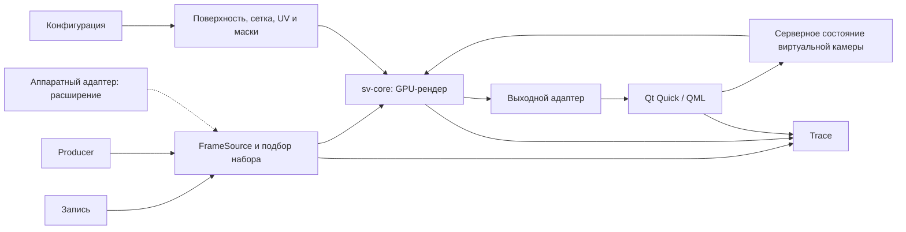

# Архитектура стенда Surround View

## Назначение и статус

Редакция от 19.09.2026. Целевая архитектура по [аудиту](Аудит_и_план_3D_Surround_View.md); работоспособность на аппаратуре ещё должна быть проверена. Объём определён в [REQUIREMENTS.md](REQUIREMENTS.md), календарь — в [MASTER_PLAN.md](MASTER_PLAN.md), измерения — в [VALIDATION.md](VALIDATION.md).

## Компоненты и процессы

| Компонент | Ответственность |
|---|---|
| `sv-core` | Библиотека без Qt и транспорта: координаты, калибровка, поверхность, сетки, отображения, GPU-ресурсы и виртуальная камера |
| `sv-server` | Основной host ядра: конфигурация, `FrameSource`, подбор наборов, команды, выходной адаптер, health и trace |
| `sv-bench` | Host того же ядра на локальных данных: математические и performance-опыты без UI |
| `sv-ui` | Qt 5.15, Qt Quick (QML), Qt Quick Controls 2; показ готового изображения, жесты, статусы и собственные события представления |
| `sv-simulator` | Лёгкий producer известного набора, сценарий времени и неисправностей; полный 3D-мир — расширение |

`FrameSource` возвращает нормализованный кадр, владельца буфера и метаданные. `FileFrameSource` и `ProducerFrameSource` обязательны; `HardwareFrameSource` желателен. Выбор источника между запусками сохраняет одно ядро. Горячая замена — отдельная возможность. `sv-bench` изолирует стоимость метода; испытание server → UI остаётся обязательным.

## Подготовка, кадр и команда

При загрузке конфигурации CPU валидирует параметры, строит аналитическую поверхность и выбранную сетку, готовит UV, маски, веса и GPU-ресурсы. Калибровка определяет проекцию и критерий дискретизации; форму задают параметры автомобиля и поверхности. Пересчёт нужен при изменении этих входов, которое в MVP применяется перезапуском.

При новом наборе выполняются подбор кадров, upload входных текстур, обновление масок доступности, рисование bowl, выборка и нормализованное смешивание четырёх текстур в итоговый FBO. Базовый путь — прямое рисование, без обязательного промежуточного атласа. Прямая проекция в shader служит проверке отображений; исследуемый вариант использует подготовленные координаты и интерполяцию. Стоимость и точность вариантов фиксируются раздельно.

При команде orbit/zoom/preset сервер обновляет состояние и его `state_revision`, использует сохранённые входные текстуры, сетку и калибровку, затем создаёт новый выходной кадр. Частота новых видов может отличаться от частоты входа. Новое рисование не означает новое декодирование или upload неизменных входов (NFR-P-004). Дополнительный атлас возможен после измерения пользы и его собственной ошибки.

## Потоки исполнения и владение

| Поток | Работа и ограничения |
|---|---|
| Вход/файлы | Чтение и валидация, ограниченная очередь каждой камеры; не удерживает GPU-контекст |
| Управление | Независимая ограниченная очередь команд, подтверждения и reconnect |
| Render thread | Единственный владелец EGL/OpenGL-контекста ядра и состояния виртуальной камеры; не ждёт сеть, файл или UI бесконечно |
| Выход/trace | Копирование опубликованных CPU-слотов, неблокирующая запись событий; переполнение учитывается |
| UI event loop | QML, жесты, статус; сетевое чтение вынесено из этого потока |
| Qt Quick scene graph | Создание/обновление/освобождение текстуры отображения в потоке рендера Qt Quick [1] |

Начальные пределы: вход — 3 кадра на камеру, выход — 3 слота, управление — 64 команды, trace — 4096 событий. Для видео удаляется старейший ещё не используемый элемент; счётчик содержит причину. Занятый буфер не перезаписывается. Абсолютные команды можно заменять последней; относительные orbit-delta объединяются с сохранением суммы и связей `command_id`. При невозможности объединения переполненная команда явно отклоняется.

CPU-слот проходит FREE → WRITING → READY → IN_USE → FREE. GPU-буфер освобождается после fence; CPU-слот — после завершения потребителя. Если свободных выходных слотов нет, публикация пропускается с причиной; управление и рендер продолжаются. При reconnect меняется сессия, позднее подтверждение старой сессии не освобождает новый слот. UI не удерживает слот после завершения собственного копирования; отдельная UI-текстура живёт до окончания чтения scene graph.

## Время, набор кадров и состояния

Локальный профиль использует `CLOCK_MONOTONIC` одного Linux-узла. Шкалы разных узлов имеют разные начала и не вычитаются напрямую [2]. Для распределённого профиля требуется `clock_domain` и проверенное отображение `t_local = a·t_source + b` с интервалом действия и оценкой погрешности. При отсутствии отображения сквозная задержка помечается недоступной.

Replay сохраняет `scenario_timestamp_ns`, а время выпуска отображает в текущую шкалу исполнения. Пауза замораживает сценарий; сохранённый кадр обозначается PAUSED, а его реальный возраст остаётся в trace. Пошаговый выпуск задаёт новое время исполнения. Это не отключает обнаружение устаревания live-источников.

Подбор начинает с последнего кадра с наименьшим временем среди доступных камер; для остальных выбирается ближайший кадр в пределах окна, при равенстве — более новый. Недоступные и слишком старые входы исключаются; отсутствие полного синхронного набора не блокирует рендер. Каждый результат сохраняет `frame_set_id`, camera sequence IDs, времена, skew и возраст; фактические численные ограничения находятся в NFR и конфигурации.

| Состояние | Условие |
|---|---|
| STARTING | Инициализация и ожидание первого набора до startup timeout |
| READY | Четыре свежих входа, совпадающая калибровка, skew внутри окна |
| DEGRADED | Доступны 1–3 свежих входа либо нарушено окно синхронизации |
| NO_INPUT | Нет пригодного входа после timeout; вывод маски «нет данных», команды продолжают действовать |
| ERROR | Невосстановимая ошибка конфигурации, GPU или ресурса; код и причина, корректное завершение |

Восстановленный источник допускается после handshake, проверки калибровки и первого свежего кадра. READY возвращается только при пригодном полном наборе. `stale` — текущий признак, `dropped` — счётчик событий. В исходном профиле hold-last отключён; истёкший вход имеет нулевой вес. Если расширение включает hold-last, задаётся конечный предел, stale-overlay и отдельный статус каждого использованного входа.

## Выходной кадр и интерфейс

Внутренние GPU-проходы не требуют чтения полного кадра на CPU (SRV-G-002). В исходном выходном адаптере итоговый FBO читается в CPU-буфер, передаётся по локальному сокету и загружается в текстуру UI. Время readback, передачи и upload UI учитывается отдельно и входит в полную задержку. Номер OpenGL-текстуры не является межпроцессным дескриптором.

В QML результат показывается собственным `QQuickItem` с `QSGTexture`; C++-часть доставляет ему неизменяемый кадр и метаданные. `QGuiApplication` и `QQmlApplicationEngine` создают приложение. QML содержит только представление, жесты и модели состояния. Обновление texture/node соблюдает потоки scene graph [1]. Сервер не зависит от Qt; headless подтверждается отдельным запуском, а не составом UI-библиотек.

UI связывает `frame_id`, `state_revision` и команды с кадром, действительно использованным scene graph. Событие `ui_present_submit` фиксируется через `QQuickWindow::frameSwapped` для этого кадра; смысл сигнала — постановка кадра на представление [3]. Это программная конечная точка; физическое отображение требует отдельного внешнего измерения. Повторный swap той же текстуры не считается новым уникальным набором.

## ADR: принятые решения и условия пересмотра

| ADR | Решение от 19.09.2026 | Проверка и пересмотр |
|---|---|---|
| ADR-001 — платформа/API | C++20, Linux, CMake, OpenGL 3.3 Core/GLSL 330 через EGL; UI Qt 5.15 Quick/QML | На M1 проверить GPU/драйвер, backend EGL, запуск без графической сессии и FBO. Surfaceless extension [4] не гарантирует доступ к GPU. При несовместимости выбрать один профиль OpenGL ES и обновить документы до реализации |
| ADR-002 — итоговый кадр | Ограниченный копируемый путь FBO → CPU → Unix domain socket → Qt Quick texture; отдельный control socket | Измерить readback, копии и latency. DMA-BUF SHOULD при доказанном ограничении; descriptor описывает FD, формат, плоскости, offsets/strides, modifiers, fence и release [5] |
| ADR-003 — время | Один узел и единый monotonic domain; replay mapping сохраняется в manifest/trace | Распределённый опыт допускается при измеренном отображении часов и погрешности; сервер и UI пишут собственные события |

Удалённый producer — отдельный TCP-профиль после расчёта полосы в [PROTOCOL.md](requirements/PROTOCOL.md). Протокол v1 общий для локального IPC и сетевого расширения. ZeroMQ, UDP/RTP и новые кодеки не являются параллельными обязательствами.

## Диаграммы и проверка

[Контекст](diagrams/system-context.puml), [компоненты](diagrams/components.puml) и [последовательность](diagrams/server-sequence.puml) отражают эту модель. Готовность подтверждают независимый запуск процессов, replay без producer, три конфигурации одним бинарным файлом, T-SRV-001 для headless и T-SYS-006 для полного trace. Единственный план этапов — [MASTER_PLAN.md](MASTER_PLAN.md).

## Источники

Библиографические описания оформлены по ГОСТ Р 7.0.100–2018. Нумерация локальная для этого документа.

1. Qt Quick Scene Graph / The Qt Company. – Текст : электронный // Qt Quick 5.15 Documentation. – URL: [https://doc.qt.io/archives/qt-5.15/qtquick-visualcanvas-scenegraph.html](https://doc.qt.io/archives/qt-5.15/qtquick-visualcanvas-scenegraph.html) (дата обращения: 19.09.2026).
2. clock_gettime(3) : Linux manual page. – Текст : электронный // Linux man-pages. – URL: [https://man7.org/linux/man-pages/man3/clock_gettime.3.html](https://man7.org/linux/man-pages/man3/clock_gettime.3.html) (дата обращения: 19.09.2026).
3. QQuickWindow Class / The Qt Company. – Текст : электронный // Qt Quick 5.15 Documentation. – URL: [https://doc.qt.io/archives/qt-5.15/qquickwindow.html](https://doc.qt.io/archives/qt-5.15/qquickwindow.html) (дата обращения: 19.09.2026).
4. EGL_KHR_surfaceless_context / Khronos Group. – Текст : электронный // Khronos EGL Registry. – URL: [https://registry.khronos.org/EGL/extensions/KHR/EGL_KHR_surfaceless_context.txt](https://registry.khronos.org/EGL/extensions/KHR/EGL_KHR_surfaceless_context.txt) (дата обращения: 19.09.2026).
5. EGL_EXT_image_dma_buf_import / Khronos Group. – Текст : электронный // Khronos EGL Registry. – URL: [https://registry.khronos.org/EGL/extensions/EXT/EGL_EXT_image_dma_buf_import.txt](https://registry.khronos.org/EGL/extensions/EXT/EGL_EXT_image_dma_buf_import.txt) (дата обращения: 19.09.2026).
6. ГОСТ Р 7.0.100–2018. Система стандартов по информации, библиотечному и издательскому делу. Библиографическая запись. Библиографическое описание. Общие требования и правила составления : национальный стандарт Российской Федерации : дата введения 2019-07-01. – Москва : Стандартинформ, 2018. – URL: [https://docs.cntd.ru/document/1200161674](https://docs.cntd.ru/document/1200161674) (дата обращения: 19.09.2026). – Текст : электронный.
