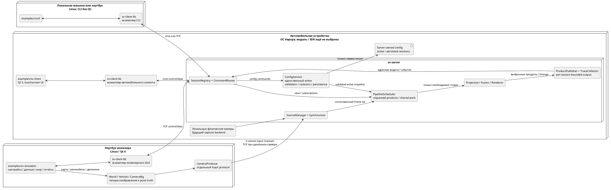
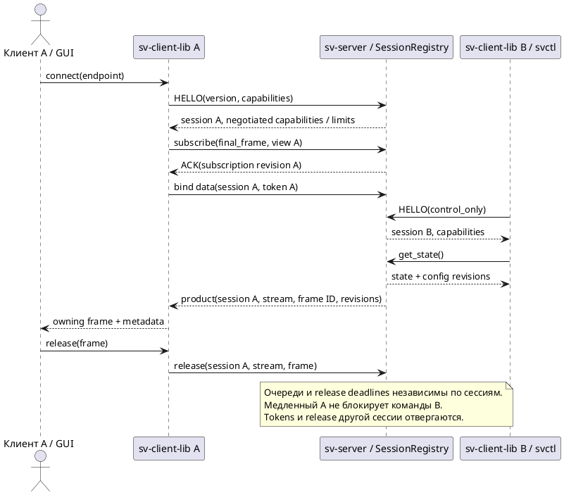
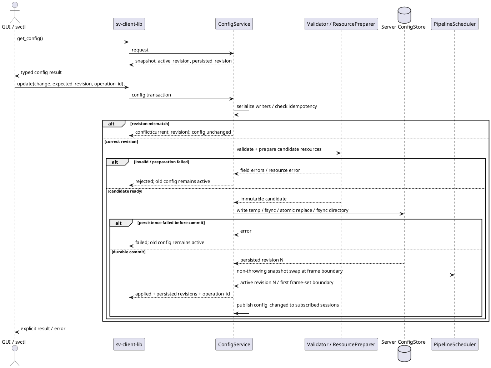
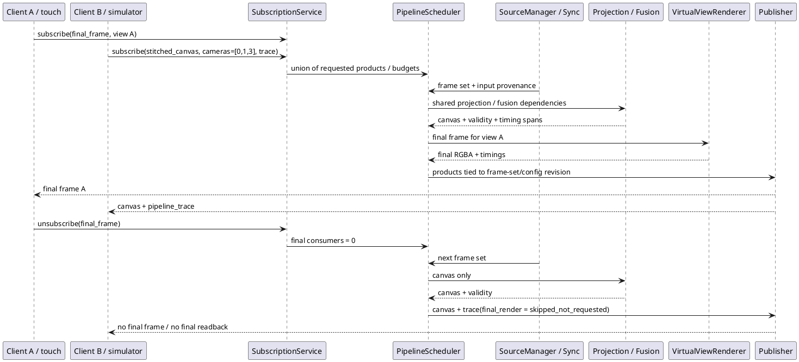
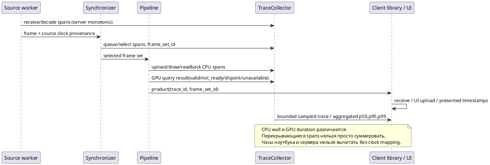
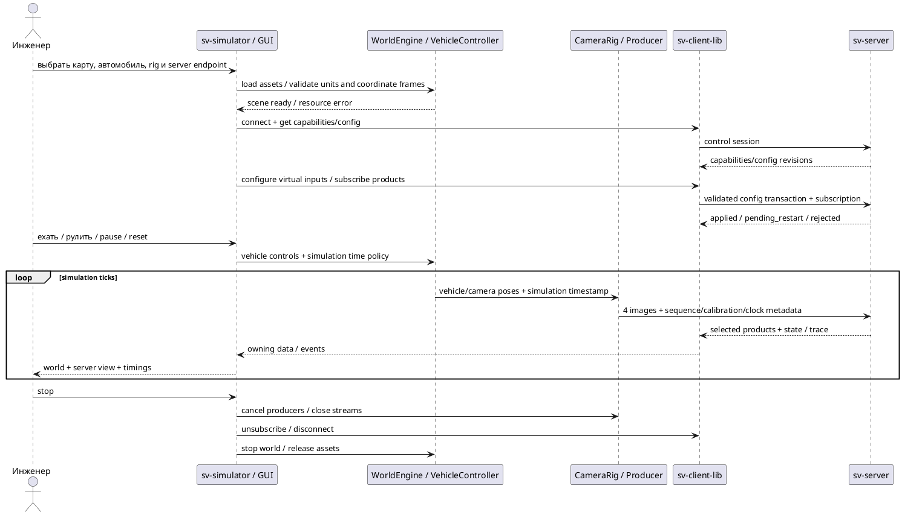

# Сервер вычислений и три примера клиентов

Редакция 10.10.2026 по уточнениям пользователя. **Это целевой контракт следующего этапа, а не описание уже реализованных multi-client/config/subscription API.** Рабочий SV01 по-прежнему описан в [[engineering/CLIENT_LIBRARY]] и [[engineering/SOURCES]]. Данный документ определяет приоритет новой архитектуры над прежними предложениями; [[architecture/DEPLOYMENT]] показывает исходный проверенный стенд.

Исследовательское расширение и сценарные переключения алгоритмов: [[architecture/RESEARCH_RUNTIME]]. Catalog и temporary configure_fusion/configure_surface уже реализованы в SV01; общий ConfigService, subscriptions и multi-session остаются целевым контрактом.

## Граница C++ продукта и исследовательских средств

Продуктовый путь не должен требовать Python: обработка изображений, калибровочные алгоритмы, проверка и применение настроек выполняются нативно в сервере; любой клиент обращается к ним через `sv-client-lib`. Новые алгоритмы сначала сверяются с независимым эталоном, затем становятся серверными реализациями с переключением по протоколу. Перенос Python dispatcher в GUI с запуском subprocess не считается завершением миграции.

Клиентские обязанности — UI, создание виртуального мира/камер, подача изображений и оркестрация эксперимента — остаются в компилируемых клиентских application services. Серверу не требуется Blender для обработки реальных камер. Общий C++ ExperimentRunner уже используется `svctl research`; GUI должен использовать тот же сервис. Python допустим для независимых численных эталонов, integration tests, подготовки исследовательских fixtures, Blender asset authoring и генерации рисунков, но не как обязательная часть установленного сервера, библиотеки или клиентов.

На текущем этапе GUI редактор fusion/surface использует типизированные операции библиотеки. Полный перенос продуктовых workflows ещё не выполнен: нужны серверный реестр калибровочных снимков, загрузка observations через библиотеку, GUI сценариев и native live producer. Исторические `tools/configurator.py` и offline studies остаются средствами воспроизведения опытов, не универсальным клиентским API.

## 1. Ответственность и размещение

`sv-server` принимает изображения камер и запросы клиентов, вычисляет согласованные продукты pipeline и публикует только запрошенные результаты. Он единственный валидирует, применяет и сохраняет свою конфигурацию. Библиотека и приложения не редактируют файл сервера даже при локальном Unix-соединении. Диагностика, связанная с обработкой кадров, остаётся частью серверного pipeline; генерация мира, подготовка наборов, интерфейсы настройки и сравнение отчётов относятся к инструментам.

`sv-client-lib` предоставляет транспортно-независимый API подключения, чтения состояния, настройки, управления и подписок; не содержит Qt, Blender, алгоритмов сшивки или файловой записи server config. Публичные операции должны иметь типизированные request/result структуры, а wire codec оставаться внутренней деталью. Общая библиотека нужна каждому C++ клиенту, включая CLI. Протокол producer камер — отдельный контракт: готовый client API не делает клиент источником изображений автоматически.

Три продуктовых примера находятся в `examples/`. Дополнительный небольшой probe остаётся только тестовым потребителем установленной библиотеки.

| Подпроект | Платформа | Назначение |
|---|---|---|
| `examples/sv-client/` | Qt 5; целевое устройство с Авророй; Linux для разработки | Сенсорный экран автомобиля: финальный кадр, крупные элементы, ракурсы/orbit/zoom, состояние соединения и вкладка информации о сервере. Без редактора полной конфигурации |
| `examples/svctl/` | C++17, Boost/STL, без Qt; Linux, далее SDK Аврора | CLI для всех реализованных серверных операций: настройка, subscriptions, trace/report, проверки capabilities; machine-readable вывод и корректные exit codes |
| `examples/sv-simulator/` | Ноутбук Linux, Qt 6; переносимость других ОС отдельно | Единый инженерный GUI: подключение/настройка сервера, все продукты/метрики, калибровка и наборы, мир/карта/машина, управление движением и четыре virtual-camera inputs |

Название `sv-simulator` теперь относится к ноутбучному приложению. Прежний `tools/simulator.py` — аналитический fixture generator, не полноценный simulator GUI. Его математика и тестовые данные сохраняются до переноса функций. Python integration tests и скрипты воспроизводимости рисунков диплома остаются допустимыми отдельными средствами; пользовательский workflow не должен зависеть от ручного запуска цепочки скриптов.

*Рисунок КС.1 — Целевая ответственность компонентов. Новые ConfigService, multi-session registry, scheduler/subscriptions и live-world camera producer требуют реализации. На Linux уже существуют renderer, replay/socket sources, client library, GUI и отдельный визуальный driving preview; preview ещё не подключён как источник кадров. Запуск на Авроре не подтверждён.*

## 2. Сессия, capabilities и несколько клиентов

Control connection создаёт независимую клиентскую сессию. HELLO сообщает версию и возможности клиента; сервер возвращает согласованную версию, session ID, capabilities, лимиты и token привязки data channel. Клиент явно выбирает products; control-only соединение не требует data channel. Для legacy SV01 текущий default final output сохраняется до явного перехода на новый контракт. Версия/новые возможности не объявляются до реализации и тестов.

*Рисунок КС.2 — Подключение двух клиентов и control-only session. Текущая библиотека всегда открывает control/data; отделение control-only — новая задача.*

Каждая сессия имеет собственные view, subscriptions, command IDs, budgets и bounded queues. Orbit/zoom одного клиента меняет только его virtual view; другие клиенты не теряют свой ракурс. Начальный view берётся из server config. Явная операция сохранения default view — глобальное изменение config, а не побочный эффект каждого движения пальца. Источники, calibration и общая fusion policy глобальны и изменяются через ConfigService с проверкой ревизии.

Сервер ограничивает число клиентов, суммарные render/readback budgets, число streams и размеры очередей. Одинаковые продукты одного frame set/config/view допускают совместное вычисление; разные view требуют разных render outputs. При переполнении newest-frame policy удаляет старый ещё не занятый кадр конкретного подписчика. Удерживаемый кадр не перезаписывается; истечение release deadline прекращает его stream/session по согласованной политике. Текущий server singleton `ctl/video/session/token/busy` необходимо заменить session registry; просто убрать проверку busy недостаточно.

## 3. Настройка и сохранение: сервер — единственный writer

Клиент получает снимок config и `persisted_revision`/`active_revision`. Изменение отправляется как типизированная операция или ограниченный patch с `expected_revision` и idempotency key; произвольный путь записи и доступ к файловой системе сервера не предоставляются. Сервер сериализует config transactions, проверяет схему, геометрию, зависимости, права на ресурсы и доступный budget. Два клиента не могут молча перезаписать изменения друг друга.

*Рисунок КС.3 — Горячая конфигурационная транзакция. После durable commit переключение подготовленного snapshot не должно требовать потенциально падающего выделения ресурсов.*

Если операцию нельзя применить без перезапуска (например, отдельные изменения listeners/capture backend), сервер сохраняет её как `pending_restart`, явно сообщает разные persisted/active revisions и продолжает текущую активную конфигурацию. Он не выдаёт `applied`, пока новое состояние не работает. При падении между commit и activation сервер восстанавливает сохранённую конфигурацию на запуске; startup failure диагностируется, а старый snapshot не подменяется молча. Потеря ACK после commit даёт клиенту неопределённый результат: повтор с тем же operation ID/query status возвращает исходный результат; библиотека не повторяет произвольные мутации автоматически. Retention/лимит журнала idempotency входят в контракт; истёкший ID возвращает `status_unknown`, а не ложный успех.

Перед изменением сетевых listeners нужна политика сохранения управляющей связи, bind preflight и явное подтверждение `pending_restart`; клиент не может обойти server Unix-only policy. Начальная конфигурация устанавливается администратором/пакетом до запуска; во время работы её writer только сервер. На ноутбуке можно сохранять черновики и экспортированные копии, но они не являются серверным активным состоянием.

## 4. Продукты, промежуточные результаты и отсутствие финального кадра

Подписка — состояние конкретной сессии. Поле `final_frame=false` означает отсутствие финальных кадров для неё. Если финальный продукт не нужен ни одному клиенту/recorder/явному benchmark job, scheduler не выполняет финальный render/readback/encode. Запрос telemetry сам по себе не включает дорогие стадии. Source/health могут продолжаться; если измеряется отдельная стадия, она включается явной диагностической задачей и отражается в trace. Сервер не должен рендерить вхолостую лишь ради нулевой подписки.

| Product | Содержание и параметры | Статус |
|---|---|---|
| `final_frame` | RGBA виртуального вида с явно выбранным view; разрешение/FPS/budget | Есть legacy final RGBA; per-session настройка предстоит |
| `camera_frame` | Конкретный нормализованный вход, camera ID, format/origin/timestamps | Требуется подписка и публикация |
| `stitched_canvas` | Прямоугольный холст **до** виртуального вида; camera mask, projection/domain, resolution, calibration/fusion revision | Новый pipeline stage, сейчас не существует |
| `coverage`, `weights`, `projection_map` | Число валидных камер, четыре численных веса, UV/world map с validity | Есть offline/reference и render diagnostics; сетевой product API предстоит |
| `pipeline_trace` | Тайминги стадий и причины пропусков/отказов | Новый контракт |
| `state`, `health`, `config` | Метаданные/снимки/события, не видеокадры | Есть частичный state; остальное расширяется |

`stitched_canvas` с тремя камерами требует camera mask, например `[0,1,3]`; отсутствующая четвёртая камера не участвует в нормализации весов. Холст нельзя получать скриншотом финального FBO: там уже virtual view, кузов и fallback. Его проекция задаётся явно: `ground_plane` с метрическими bounds либо `equirectangular` с центром/угловым диапазоном и моделью пересечения носителя. Параллакс разнесённых камер и ненаблюдаемые области сохраняются; validity/mask передаются отдельно от цвета. Сначала реализуется одна строго определённая проекция, затем расширения.

*Рисунок КС.4 — Подписки определяют необходимые стадии. Existing direct-fragment renderer сначала надо разделить: общего stitched canvas в нём пока нет.*

В каждом продукте нужны session/stream/frame-set ID, source sequence/timestamps, config/calibration/view/subscription revisions, формат, размер/stride/origin, available camera mask и status. ACK подписки определяет effective frame-set boundary. Старые buffered products сохраняют старую revision; клиент может их отбросить, но не интерпретировать как результат новой настройки. Для диагностических тяжёлых карт обязательны FPS/размер/память/полоса лимиты и отказ `budget_exceeded` вместо бесконтрольного копирования.

## 5. Тайминги pipeline

Trace имеет `frame_set_id`, `trace_id`, config revision и отдельные spans: source receive/decode, queue wait, synchronization/select, projection/fusion, upload, final draw, readback/copy, publish queue/send. Каждый span хранит stage/status/clock domain/start/duration; отсутствующая или не выполненная стадия имеет статус, а не фиктивные 0 ms. Счётчики dropped/stale/skew и причин пропусков отделены от durations.

*Рисунок КС.5 — Наблюдаемость стадий. Существующие upload/readback и optional GPU timings — база, но не полный trace.*

ClockMappingService и измерение uncertainty понадобятся для end-to-end между физическими машинами. До этого раздельно публикуются server pipeline latency и client-local receive→present; host delivery нельзя подписывать sensor exposure. Telemetry сбор ограничен ring buffer/sampling и не должен блокировать GL-поток. Итоговый trace не обязателен к приходу раньше продукта; late GPU query связывается по trace ID, без блокирующего ожидания.

## 6. Ноутбучный simulator и объединение инструментов

Окна инженерного GUI: подключения/сервер; источники и записи; calibration; carrier/fusion/продукты; pipeline timings; мир/машина/камеры/движение; эксперименты и отчёты; assets/provenance. Из GUI можно выбрать существующие replay/фотографический/аналитический/Blender режимы. Симулятор не перезаписывает server config локально: он отправляет те же команды через библиотеку, что `svctl`.

*Рисунок КС.6 — Целевой live simulator workflow. Текущий offline Blender export и producer recordings покрывают только подготовку и передачу записи.*

Перенос инструментов выполняется через reusable services, не копированием Python-команд в QML. На первом шаге допускается управляемый subprocess adapter для существующих offline jobs с progress/cancellation/error/report и сохранением provenance. Затем соответствующая доменная логика переносится в библиотеки; GUI не знает конкретных shell commands. Старые входы сохраняются до проверки эквивалентности результатов и обновления docs/tests. Воспроизводимость мира и дипломных рисунков не удаляется ради сокращения числа файлов.

## 7. Структура кода и тестовые границы

Планируемое разделение: `src/server/{sessions,config,pipeline,products,telemetry}`, `include/sv/client/{connection,configuration,subscriptions,telemetry}`, `src/client_library/`, `examples/{sv-client,svctl,sv-simulator}`. Это распределение ответственности, не требование немедленно создать пустые файлы под каждый пункт.

Зависимости инвертируются в местах внешних эффектов: `IConfigStore`, `IFrameSource`, `IProductSink`, `IClock`, `IWorldEngine`. Реализации файлового store, Asio transport, EGL renderer и Blender/world adapter скрываются за PImpl/RAII там, где это уменьшает публичные зависимости. Не вводить интерфейс ради каждого value object. Конфигурация и результаты разделены на `ConnectionPolicy`, `SourceSettings`, `CalibrationSettings`, `RenderSettings`, `ProductSubscription`, `TelemetrySettings`; никаких общих mutable структур на сотни полей. Крупный server.cpp разбивается по ответственности, не по произвольному числу строк.

Пока остаётся C++17: для данной архитектуры C++20 не обязателен, а SDK ещё не проверен. Новый стандарт вводится отдельным решением при конкретной потребности и проверенной toolchain. Новые unit tests предпочтительно на C++/системном GTest; Python остаётся для межпроцессных integration tests и независимых численных oracle. GTest не скачивается FetchContent, особенно в SDK.

| Сценарий диаграмм | Обязательная проверка |
|---|---|
| КС.2 | Два/несколько клиентов, control-only, wrong-session token/release, independent slow client, bounded shutdown |
| КС.3 | Conflict двух writers, validation failure, disk full/permission error, crash before/after commit, duplicate operation, pending_restart, восстановление |
| КС.4 | Нет финальных подписчиков → нет final draw/readback; три камеры → четвёртая не участвует; revision boundary, budget rejection |
| КС.5 | Fake clock, disabled stage status, ring saturation, GPU unavailable/disjoint, no cross-host subtraction |
| КС.6 | Load error, deterministic poses/times, pause/reset, отказ одного producer, disconnect/reconnect, cancellation без зависания UI |

## 8. Выбор формата команд

**На первом этапе сохраняется SV01 + Boost.JSON; Protobuf не добавляется в зависимости.** Protobuf даёт schema/generated types и правила binary schema evolution, но требует `.proto`, compiler и runtime; сам бинарный payload не является самодокументируемым. Эти свойства подтверждены [официальным обзором Protobuf](https://protobuf.dev/overview/) и [руководством по совместимости proto3](https://protobuf.dev/programming-guides/proto3/#updating).

Для проекта сейчас важнее исправить семантику sessions/config/subscriptions и предоставить типизированный C++ API. Формат сериализации сам по себе не обеспечивает atomic persistence, idempotency, multi-client fairness или stream framing. Измерений, показывающих проблему стоимости JSON control messages, нет; большие изображения уже передаются отдельным бинарным payload. Это проектное решение, а не утверждение о превосходстве JSON.

Codec отделяется от domain operations; новые capabilities/version negotiation и golden compatibility fixtures должны предшествовать смене wire. Вернуться к Protobuf при необходимости независимых multi-language SDK или после измерений command overhead; тогда выполнить отдельный versioned transition с системным `find_package(Protobuf REQUIRED)` и offline `protoc`, без FetchContent. Не заменять текущий wire несовместимо под прежней magic/version.

## 9. Порядок реализации и границы текущего этапа

1. Принять этот контракт; разложить примеры, добавить Qt-free `svctl` для существующих команд и сохранить installed consumer проверки.
2. Разбить server transport/session code и реализовать несколько sessions/control-only с изоляцией queues/view.
3. Ввести ConfigService/revision/idempotency/persistence и типизированный client API; CLI получает все операции одновременно с сервером.
4. Реализовать subscriptions/output policy и trace; затем самостоятельный stitched canvas с camera mask.
5. Создать laptop Qt 6 workbench, подключить существующие jobs через сервисы и последовательно live world/camera rig.
6. Адаптировать touchscreen Qt 5 клиент, провести two-host и Aurora acceptance, затем общую редактуру диплома.

Связанный список всех работ и условий завершения — корневой `TODO.md`; текущее подтверждённое состояние — [[prototype/STATUS]]. Ни наличие диаграмм, ни новая папка examples не закрывают будущие возможности.
