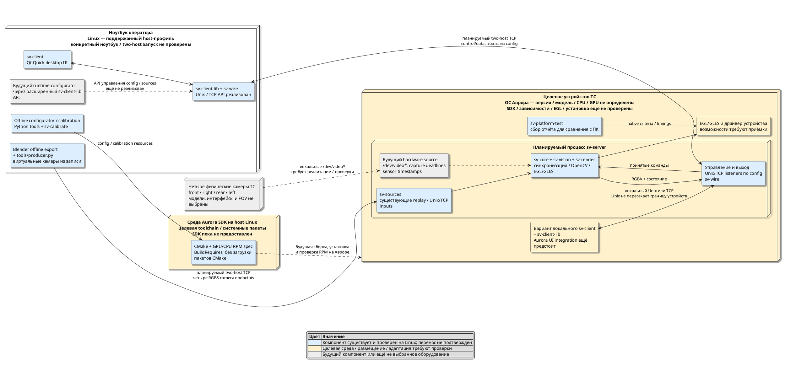

# Компоненты, устройства и размещение

Состояние на 07.10.2026. Диаграммы показывают текущие компоненты и отдельно целевое размещение. Библиотеки внутри процессов не являются самостоятельными сервисами. Проверенный стенд — один ПК под Arch Linux x86_64; запуск ноутбук → устройство Аврора пока не проверен. Паспорт оборудования взят из сохранённого отчёта [[validation/baselines/PC_RTX_V06]], состав targets — из `CMakeLists.txt`.

## Текущий Linux-стенд

```plantuml
@startuml
left to right direction
skinparam componentStyle rectangle
skinparam shadowing false
skinparam wrapWidth 220
skinparam nodesep 35
skinparam ranksep 45

node "Рабочая станция / проверенный стенд\nArch Linux, x86_64\nAMD Ryzen 9 9950X, 16 ядер\nNVIDIA GeForce RTX 5070 Ti, 16 GB VRAM" as PC {
  package "Подготовка данных / отдельные offline-запуски" {
    component "Blender + tools/blender/\nпроцедурная улица, автомобиль,\nrig четырёх камер, scripted motion" as Blender
    component "sv-simulator\ntools/simulator.py\nаналитические изображения и XYZ" as Simulator
    component "sv-scene\nфотографическая panorama demo" as Scene
    component "sv-capture\nOpenCV VideoCapture recorder\n4 видеофайла; /dev/video* — требует приёмки" as Capture
    component "sv-configurator\ntools/configurator.py\noffline подготовка / диагностика" as Configurator
    component "sv-calibrate\nOpenCV calibration / board detector" as Calibrate
    artifact "assets/\n.blend + скрипты восстановления\nLondon HDR + provenance" as Assets
    artifact "Записи и конфигурация\n4 изображения на timestamp\nmanifest / calibration / hashes" as Dataset
  }

  component "tools/producer.py\nчетыре независимых camera streams\nreconnect / late-drop / reports" as Producer

  node "Процесс sv-server" as Server {
    component "sv-sources / FrameSource\nreplay decode worker ИЛИ\n4 Unix/TCP camera inputs\nbounded queues" as Sources
    component "sv-core\nconfig, math, mesh, synchronizer\nвиртуальная камера и frame sets" as Core
    component "sv-vision\nOpenCV image decode / projection" as Vision
    component "sv-render\nодин владелец EGL/GLES 3\nplane / bowl / dome / cylinder / cube\nпол, fusion, RGBA readback" as Render
    component "Asio control/data transport\nкоманды, state/health, release\nUnix/TCP listeners по config" as Transport
    component "sv-wire\nSV01 framing / codec" as ServerWire
  }

  node "Процесс sv-client" as Client {
    component "Qt Quick / QML\nBridge + QQuickImageProvider\nжесты, статусы, готовый RGBA" as UI
    component "sv-client-lib\ninstalled CMake target sv::client\nendpoint, session, ACK, frame ownership\ndeadlines / reconnect" as Library
    component "sv-wire\nSV01 framing / codec" as ClientWire
  }

  component "sv-client-probe\nпример внешнего C++ клиента\nиспользует sv-client-lib" as Probe
  component "Python tools/ipc.py\nтестовый клиент протокола\nне обёртка над sv-client-lib" as PythonIPC

  package "Исследование и проверка / отдельные запуски" {
    component "sv-bench / sv-project\nGPU benchmark / CPU projection" as Bench
    component "sv-platform-test\nsv-validation + sv-gpu-validation\nпаспорт, критерии, timings" as Platform
    component "tools/reference.py\ncompare_reference.py\nаналитический CPU-эталон\n5 носителей / 3 fusion" as Reference
    component "CTest / Python integration\ncore, sources, client lifecycle,\nrender modes, vision fixtures" as Tests
    artifact "artifacts/ + docs/validation/\nJSON / Markdown / traces / figures" as Reports
  }

  node "Графический backend этого ПК" {
    component "NVIDIA EGL/GLES\nRTX 5070 Ti" as GPU
    component "Mesa llvmpipe\nпрограммный render на CPU" as Mesa
  }

  package "Сборка и упаковка" {
    component "CMake / системные зависимости\nC++17, Boost.Asio/JSON, GLM\nOpenCV, OpenSSL, Qt, EGL/GLES\nбез FetchContent" as Build
    component "RPM spec: GPU / CPU profiles\nLinux package qualification" as RPM
  }
}

Assets --> Blender
Assets --> Scene
Blender --> Dataset : offline export / conversion
Simulator --> Dataset
Scene --> Dataset
Capture --> Dataset : запись, не live backend сервера
Configurator --> Dataset : config / отчёт
Calibrate --> Dataset : calibration / отчёт
Dataset --> Sources : source.type = replay
Dataset --> Producer : verified recording
Producer --> Sources : source.type = socket\n4 RGB8 Unix/TCP канала
Sources --> Vision : replay image decode
Sources --> Core : кадры / timestamps / provenance
Core --> Render : frame set + view / mesh
Render --> GPU : один выбранный backend
Render --> Mesa : альтернативный backend
Render --> Transport : готовый RGBA + metadata
Transport --> Core : pause / step / orbit / zoom / preset
Transport ..> ServerWire : codec
UI <--> Library : команды / события / кадры
Library ..> ClientWire : codec
Library <--> Transport : Unix ИЛИ TCP loopback\nраздельные control/data каналы
Probe ..> Library : тот же API / отдельный процесс
PythonIPC <--> Transport : интеграционные проверки
Dataset --> Bench
Dataset --> Reference
Bench ..> Render : тот же GPU renderer
Platform ..> Render : GPU-профиль
Tests ..> Server : lifecycle / faults / integration
Bench --> Reports
Platform --> Reports
Reference --> Reports
Tests --> Reports
Producer --> Reports
Build --> RPM

note bottom of Sources
  Replay и socket — альтернативы при запуске.
  Live /dev/video* и смешанные источники
  в sv-server пока не реализованы.
end note
note bottom of Transport
  Один клиент одновременно.
  Если разрешён только Unix, IP listeners не создаются.
  UDP не реализован; TLS/auth отсутствуют.
end note
note bottom of Blender
  Виртуальные камеры сейчас экспортируют запись.
  Интерактивного вождения / live Blender producer пока нет.
end note
@enduml
```

*Рисунок А.1 — Существующие компоненты на проверенном Linux-стенде. Стрелки к библиотекам показывают использование кода, остальные подписи — потоки данных. Offline-инструменты, тесты и два графических backend не обязаны запускаться одновременно. Отдельный probe использует собственный экземпляр библиотеки; схема не предполагает общий экземпляр с GUI.*

## Целевое размещение: ноутбук и устройство с Авророй

*Рисунок А.2 — Целевая топология использования существующего кода. Это план развёртывания, а не свидетельство запуска на Авроре или двух физических машинах. Сервер открывает физические камеры на своём устройстве; ноутбук получает готовые кадры и управляет сервером. Виртуальные камеры используют отдельные входные каналы, не клиентский control/data канал.*

## Что означает размещение

| Устройство / ОС | Что уже проверено | Что предстоит |
|---|---|---|
| Рабочий ПК, Arch Linux x86_64, Ryzen 9 9950X / RTX 5070 Ti | Server/client, replay/socket producer, OpenCV tools, Blender offline, CPU reference, tests, NVIDIA и Mesa baselines, Linux RPM | Длительные испытания и полные quality metrics |
| Другой ноутбук под Linux | Клиентский Unix/TCP API и producer существуют; TCP испытан через loopback | Настоящий two-host запуск, сеть, skew/clock mapping; Unix доступен только локально |
| Устройство ТС под ОС Аврора | Подготовлены offline CMake, RPM spec и native suite | Выбрать устройство/ОС/SDK, проверить пакеты/ABI/драйвер, установить и запустить, адаптировать UI |
| Четыре реальные камеры на устройстве сервера | Существует отдельный OpenCV recorder; тестировался на видеофайлах | Выбрать камеры, реализовать server capture backend и испытать захват/синхронизацию/отказы |

Мир `.blend`, HDR и скрипты — [[engineering/ASSETS]]. Сборка — [[engineering/BUILD]], запуск — [[engineering/USAGE]], каналы камер — [[engineering/SOURCES]], клиентский API — [[engineering/CLIENT_LIBRARY]], перенос — [[engineering/AURORA]]. Общая проектная архитектура — [[architecture/SYSTEM]], границы реализации — [[prototype/STATUS]]. PlantUML хранится непосредственно в этой Markdown-заметке; для отображения в Obsidian нужен совместимый PlantUML renderer.
