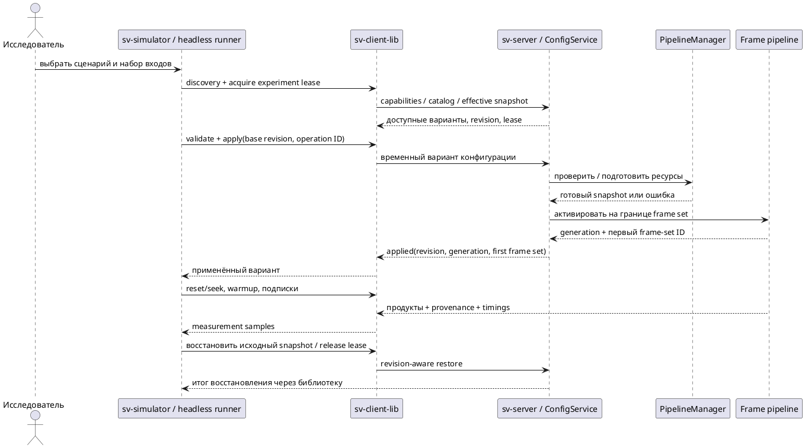

# Управляемый серверный стенд исследований

Проектное решение от 10.10.2026 по предложению пользователя. Общий API ниже — проектный; реализованные срезы отмечены отдельно. Текущий контракт — [[engineering/PROTOCOL_IMPLEMENTED]]. Связанные задачи — [[../TODO]], [[planning/ROADMAP]], ответственность компонентов — [[architecture/CLIENT_SERVER_MODEL]].

## Первый реализованный срез

`fusion_runtime_v1`: catalog, typed client wrapper, revision-checked temporary configure трёх существующих GPU-режимов и параметров; config revision/settings в ACK и frames. Интеграционная проверка сравнивает одни paused inputs и проверяет восстановление RGB без upload/rebuild. Контракт и ограничения: [[engineering/PROTOCOL_IMPLEMENTED]]. Добавлен общий C++ runner `examples/common/research` и `svctl research`: декларативные fusion-варианты, randomized complete blocks на последовательных paused frame sets с native RGBA capture, hashes/raw timing report и проверяемый restore при штатном завершении/cancel/callback failure. Проверки: [[validation/RESEARCH_RUNTIME]]. Ограниченный replay lease/watchdog `experiment_lease_v1` восстанавливает fusion/surface/pause после expiry/control disconnect; runner продлевает lease и ждёт idle после cleanup. Четыре native fusion-кандидата и runtime surface control добавлены: [[validation/NATIVE_FUSION]]. Многокадровый headless режим с lease-aware step реализован; ConfigService, cursor/history reset и GUI сценариев ещё предстоят. Контракт восстановления и опыт с direct-view truth: [[validation/SERVER_BOUNDARY]].

## Цель и границы

Сравнивать алгоритмы в том же `sv-server`, который формирует кадр для автомобильного клиента. `sv-simulator` составляет и запускает сценарий через `sv-client-lib`; CLI использует тот же исполнитель без Qt. Offline-инструменты сохраняются для независимых эталонов, проверки математики и предварительных опытов, но их CPU-время не выдаётся за производительность серверного GPU pipeline.

Включать все **выбранные для исследования и реализованные** варианты через общий контракт стадий, а не обещать все существующие алгоритмы. Исследовательская сборка, включая сборку для целевой платформы, сохраняет максимально широкий проверяемый набор вариантов; оптимизация не должна сводиться к удалению альтернатив до сравнительных опытов. Сокращённый эксплуатационный профиль возможен позднее как отдельный результат исследования, а не текущая цель. Каталог сообщает фактически доступные реализации, версии, параметры, backend, допустимые сочетания, ограничения памяти и статус experimental/production. Неизвестный или недоступный алгоритм отклоняется; скрытый fallback запрещён. Research build может включать дополнительные зависимости; минимальный Aurora build объявляет только собранные возможности и не скачивает зависимости при сборке RPM.

Direct Blender truth, object IDs, depth и true camera poses принадлежат независимому evaluator. По умолчанию исследуемый сервер получает только наблюдения, доступные реальной системе. Передача истинной калибровки или глубины допускается в явно помеченной oracle ablation; такие результаты не смешиваются с production-профилями.

## Компоненты и варианты

| Компонент | Ответственность | Исследуемые варианты / ограничения |
|---|---|---|
| AlgorithmCatalog | Версионированные descriptors и фабрики типизированных интерфейсов стадий | Общие контракты, параметры и compatibility checks; без Qt и удалённой загрузки кода |
| Projection / Carrier | Проекция и геометрия носителя | Plane, bowl, dome-floor, cylinder, cube и другие явно реализованные кандидаты; одинаковые бюджеты и ракурсы |
| Seam / Blend | Выбор камер и смешивание | Семь server methods (три GPU, четыре GLES/CPU) с native parity; текущий 3/4-camera fallback явно обозначен |
| Photometric / Temporal | Компенсация экспозиции и временная обработка | Реализованные кандидаты, reset/history semantics, измеряемая стоимость; отсутствие компенсации — baseline |
| CalibrationService | Асинхронный fit, независимая validation и revision-aware apply | Отдельный job, а не повторная калибровка каждого кадра; модели/решатели объявляются catalog |
| ConfigService / PipelineManager | Проверка, подготовка ресурсов и атомарная смена snapshot | Только сервер владеет конфигурацией и GPU-ресурсами |
| ExperimentRunner | Сценарии, повторы, журнал, восстановление и отчёты | Общая application service для simulator и headless CLI через sv-client-lib |
| IndependentEvaluator | Метрики по сохранённым продуктам и эталонам | Исходные reports, undefined ROI, отрицательные результаты и происхождение truth |

*Таблица ИС.1 — Целевое разделение исследовательского стенда. Наличие варианта в offline-коде ещё не означает наличие в серверном каталоге.*

## Смена конфигурации во время работы

Предлагаемые операции относятся к будущему typed API: discovery каталога, чтение effective snapshot, validate, apply/status и управление экспериментальным lease. Их wire names и capability version нужно закрепить отдельно; новые операции не добавляются в описание реализованного SV01 до тестов.

Запрос содержит base revision, operation ID, ожидаемые algorithm IDs/versions, параметры и режим сохранения. Сначала сервер проверяет совместимость и бюджет, затем подготавливает новый pipeline вне обработки текущего кадра. GPU-операции выполняются в принадлежащем им executor/context. На границе frame set активируется целиком готовый snapshot. Кадр не смешивает старые веса, новую сетку и чужую калибровку. Подготовка сверх установленного лимита отклоняется, а не вызывает неконтролируемое удвоение памяти.

Принятие запроса не равно применению: status различает preparing/applied/rejected/pending_restart. Событие applied указывает config revision, pipeline generation и первый frame-set ID. Каждый продукт содержит эти идентификаторы, входные frame IDs/timestamps и фактические algorithm/backend versions. При ошибке подготовки остаётся прежний pipeline; повтор operation ID не применяет изменения повторно. Изменения listeners/backend, требующие перезапуска, возвращают pending_restart и не считаются выполненным шагом опыта.

Промежуточные варианты эксперимента применяются как временные server-owned snapshots. Постоянное сохранение — отдельное явное действие через сервер; успешное сохранение подтверждается только после атомарной записи. После опыта восстанавливается исходный snapshot. При разрыве связи lease истекает по серверному deadline и запускает восстановление; его сбой публикуется как отдельная ошибка. Другие клиенты могут смотреть результаты, но конфликтующие изменения общего pipeline блокируются lease либо отклоняются по revision; per-session view не становится общей настройкой.

*Рисунок ИС.1 — Целевой порядок переключения и измерения. Discovery и lease должны завершиться успешно до изменения состояния; все стрелки управления проходят через библиотеку.*

## Сценарий исследования

Сценарий — версионированный декларативный JSON, без произвольного Python/shell на сервере. Он задаёт dataset manifest/hash, отдельный truth manifest, группы train/validation/test, seed, траекторию и временную шкалу, исходную конфигурацию, матрицу вариантов, ракурс, разрешение и лимиты ресурсов. Дополнительно задаются warmup, число повторов, порядок вариантов, products/subscriptions, метрики, сроки, критерии остановки и политика ошибок. Разделять capture, offline replay и live performance run: их временные характеристики различны.

Исполнитель использует состояния: preflight → acquire → snapshot → prepare → reset/seek → warmup → measure → export → restore → finished/failed. Даже при cancel/error выполняется restore; после утраты lease результат помечается interrupted, а не silently resumed. Возобновление создаёт новый attempt ID и проверяет входные hashes/versions. Сценарий выполняется локально на ноутбуке; при потере control connection измерение останавливается, watchdog на сервере обеспечивает восстановление.

Для парного quality-сравнения варианты получают точно те же наборы кадров, а не разные участки движущегося live-потока. Stateful-методы каждый раз начинают с явно сброшенной истории и одинакового прогрева; режим непрерывной истории — отдельный опыт. Для performance используются фиксированный поток и randomized complete blocks; публикуются warmup/setup cost отдельно от steady-state p50/p95/p99, CPU/GPU, drops, frame age, RSS и сетевого бюджета. Инструментация и подписки входят в профиль опыта: readback всех промежуточных продуктов не бесплатен.

Dataset truth и критерии финальной выборки замораживаются до подтверждающей серии. Один repeated replay измеряет повторяемость исполнения, но не заменяет независимые сцены. Пропуски, rejects, unavailable backend и нарушения бюджета включаются в отчёт. Нельзя объединять CPU/GPU реализации и разные разрешения в одну строку рейтинга.

## Этапы реализации и приёмка

1. Описать типы profiles/descriptors и интерфейсы стадий; зарегистрировать сначала существующие серверные режимы. Проверить соответствие каталога фактической сборке и отклонение несовместимых параметров.
2. Реализовать минимальный ConfigService: read/validate/temporary apply/status/restore с revisions, operation IDs и frame-boundary semantics. Проверить rollback, OOM/prepare failure, потерю ACK, cancel и persistent-write failure.
3. Через sv-client-lib создать headless runner: одна запись, два текущих алгоритма, фиксированный view, reset/warmup и products. Проверить общие input frame IDs, config hashes, generation и восстановление после ошибки.
4. Переносить исследовательские алгоритмы по одному. Для каждого нужны known-answer tests, CPU reference / server parity с объявленными допусками и явное определение fallback. Не переносить недостатки offline-методики как подтверждённый алгоритм.
5. Добавить продуктовые подписки, trace, calibration jobs и повторяемый producer. Разделять измерение качества и стоимости instrumentation.
6. Подключить тот же runner к GUI simulator: редактор/валидация сценария, запуск/отмена, прогресс, сравнение и экспорт. Не создавать отдельную GUI-реализацию сценарного движка.
7. Прогнать независимую подтверждающую серию и позднее тот же поддержанный профиль на Авроре. Различия capabilities документировать как ограничения сравнения.

GTest unit/contract tests покрывают catalog, конфликты revisions, lifecycle и ошибки; интеграционные tests проверяют команды через настоящую sv-client-lib, идентичность входов, границу переключения и восстановление. Отдельные parity tests связывают независимые fixtures с реальным серверным output. До выполнения этих этапов новые исследования offline остаются exploratory; закрывать весь исследовательский backlog наличием переключателя нельзя.

Многометочный кандидат 11.10.2026: native weighted Potts alpha-expansion выбран optional fusion.seam_solver, catalog v4; default legacy path сохранён. Renderer передаёт per-frame energy/convergence diagnostics через сервер; общий runner/capture не выполняет оптимизацию локально. Tests и empirical cost: [[validation/MULTILABEL_SEAM]].
