# Управляемый серверный стенд исследований

Проектное решение от 10.10.2026 по предложению пользователя. Общий API ниже — проектный; реализованные срезы отмечены отдельно. Текущий контракт — [[engineering/PROTOCOL_IMPLEMENTED]]. Связанные задачи — [[../TODO]], [[planning/ROADMAP]], ответственность компонентов — [[architecture/CLIENT_SERVER_MODEL]].

## Первый реализованный срез

`fusion_runtime_v1`: catalog, typed client wrapper, revision-checked temporary configure трёх существующих GPU-режимов и параметров; config revision/settings в ACK и frames. Интеграционная проверка сравнивает одни paused inputs и проверяет восстановление RGB без upload/rebuild. Контракт и ограничения: [[engineering/PROTOCOL_IMPLEMENTED]]. Добавлен общий C++ runner `examples/common/research` и `svctl research`: декларативные fusion-варианты, randomized complete blocks на последовательных paused frame sets с native RGBA capture, hashes/raw timing report и проверяемый restore при штатном завершении/cancel/callback failure. Проверки: [[validation/RESEARCH_RUNTIME]]. Ограниченный replay lease/watchdog `experiment_lease_v1` восстанавливает fusion/surface/pause после expiry/control disconnect; runner продлевает lease и ждёт idle после cleanup. Четыре native fusion-кандидата и runtime surface control добавлены: [[validation/NATIVE_FUSION]]. Многокадровый headless режим с lease-aware step реализован; другие группы ConfigService, cursor restoration и GUI сценариев ещё предстоят; явный start/history/decode-cache reset описан ниже. Контракт восстановления и опыт с direct-view truth: [[validation/SERVER_BOUNDARY]].

## Цель и границы

Сравнивать алгоритмы в том же `sv-server`, который формирует кадр для автомобильного клиента. `sv-simulator` составляет и запускает сценарий через `sv-client-lib`; CLI использует тот же исполнитель без Qt. Offline-инструменты сохраняются для независимых эталонов, проверки математики и предварительных опытов, но их CPU-время не выдаётся за производительность серверного GPU pipeline.

Включать все **выбранные для исследования и реализованные** варианты через общий контракт стадий, а не обещать все существующие алгоритмы. Исследовательская сборка, включая сборку для целевой платформы, сохраняет максимально широкий проверяемый набор вариантов; оптимизация не должна сводиться к удалению альтернатив до сравнительных опытов. Сокращённый эксплуатационный профиль возможен позднее как отдельный результат исследования, а не текущая цель. Каталог сообщает фактически доступные реализации, версии, параметры, backend, допустимые сочетания, ограничения памяти и статус experimental/production. Неизвестный или недоступный алгоритм отклоняется; скрытый fallback запрещён. Research build может включать дополнительные зависимости; минимальный Aurora build объявляет только собранные возможности и не скачивает зависимости при сборке RPM.

Direct Blender truth, object IDs, depth и true camera poses принадлежат независимому evaluator. По умолчанию исследуемый сервер получает только наблюдения, доступные реальной системе. Передача истинной калибровки или глубины допускается в явно помеченной oracle ablation; такие результаты не смешиваются с production-профилями.

## Компоненты и варианты

| Компонент | Ответственность | Исследуемые варианты / ограничения |
|---|---|---|
| AlgorithmCatalog | Версионированные descriptors и фабрики типизированных интерфейсов стадий | Общие контракты, параметры и compatibility checks; без Qt и удалённой загрузки кода |
| Projection / Carrier | Проекция и геометрия носителя | Plane, bowl, dome-floor, cylinder, cube и другие явно реализованные кандидаты; одинаковые бюджеты и ракурсы |
| Seam / Blend | Выбор камер и смешивание | Семь server methods (три GPU, четыре GLES/CPU) с native parity; текущий 3/4-camera fallback явно обозначен |
| Photometric / Temporal | Компенсация экспозиции и временная обработка | Реализованные кандидаты, reset/history semantics, измеряемая стоимость; отсутствие компенсации — baseline |
| CalibrationService | Асинхронный fit, независимая validation и revision-aware apply | Отдельный job, а не повторная калибровка каждого кадра; модели/решатели объявляются catalog |
| ConfigService / PipelineManager | Проверка, подготовка ресурсов и атомарная смена snapshot | Только сервер владеет конфигурацией и GPU-ресурсами |
| ExperimentRunner | Сценарии, повторы, журнал, восстановление и отчёты | Общая application service для simulator и headless CLI через sv-client-lib |
| IndependentEvaluator | Метрики по сохранённым продуктам и эталонам | Исходные reports, undefined ROI, отрицательные результаты и происхождение truth |

*Таблица ИС.1 — Целевое разделение исследовательского стенда. Наличие варианта в offline-коде ещё не означает наличие в серверном каталоге.*

## Смена конфигурации во время работы

Предлагаемые операции относятся к будущему typed API: discovery каталога, чтение effective snapshot, validate, apply/status и управление экспериментальным lease. Их wire names и capability version нужно закрепить отдельно; новые операции не добавляются в описание реализованного SV01 до тестов.

Запрос содержит base revision, operation ID, ожидаемые algorithm IDs/versions, параметры и режим сохранения. Сначала сервер проверяет совместимость и бюджет, затем подготавливает новый pipeline вне обработки текущего кадра. GPU-операции выполняются в принадлежащем им executor/context. На границе frame set активируется целиком готовый snapshot. Кадр не смешивает старые веса, новую сетку и чужую калибровку. Подготовка сверх установленного лимита отклоняется, а не вызывает неконтролируемое удвоение памяти.

Принятие запроса не равно применению: status различает preparing/applied/rejected/pending_restart. Событие applied указывает config revision, pipeline generation и первый frame-set ID. Каждый продукт содержит эти идентификаторы, входные frame IDs/timestamps и фактические algorithm/backend versions. При ошибке подготовки остаётся прежний pipeline; повтор operation ID не применяет изменения повторно. Изменения listeners/backend, требующие перезапуска, возвращают pending_restart и не считаются выполненным шагом опыта.

Промежуточные варианты эксперимента применяются как временные server-owned snapshots. Постоянное сохранение — отдельное явное действие через сервер; успешное сохранение подтверждается только после атомарной записи. После опыта восстанавливается исходный snapshot. При разрыве связи lease истекает по серверному deadline и запускает восстановление; его сбой публикуется как отдельная ошибка. Другие клиенты могут смотреть результаты, но конфликтующие изменения общего pipeline блокируются lease либо отклоняются по revision; per-session view не становится общей настройкой.

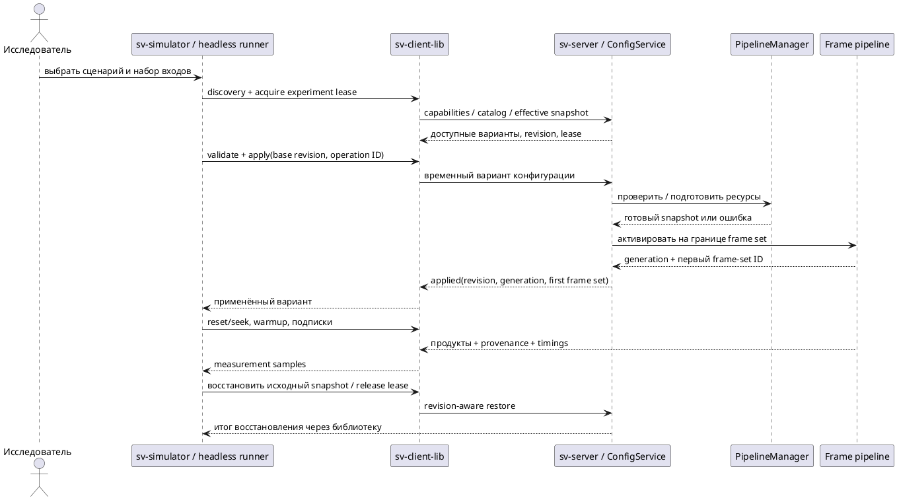
```plantuml
@startuml
actor "Исследователь" as U
participant "sv-simulator / headless runner" as R
participant "sv-client-lib" as L
participant "sv-server / ConfigService" as C
participant "PipelineManager" as P
participant "Frame pipeline" as F
U -> R : выбрать сценарий и набор входов
R -> L : discovery + acquire experiment lease
L -> C : capabilities / catalog / effective snapshot
C --> L : доступные варианты, revision, lease
R -> L : validate + apply(base revision, operation ID)
L -> C : временный вариант конфигурации
C -> P : проверить / подготовить ресурсы
P --> C : готовый snapshot или ошибка
C -> F : активировать на границе frame set
F --> C : generation + первый frame-set ID
C --> L : applied(revision, generation, first frame set)
L --> R : применённый вариант
R -> L : reset/seek, warmup, подписки
F --> L : продукты + provenance + timings
L --> R : measurement samples
R -> L : восстановить исходный snapshot / release lease
L -> C : revision-aware restore
C --> R : итог восстановления через библиотеку
@enduml
```

*Рисунок ИС.1 — Целевой порядок переключения и измерения. Discovery и lease должны завершиться успешно до изменения состояния; все стрелки управления проходят через библиотеку.*

## Сценарий исследования

Сценарий — версионированный декларативный JSON, без произвольного Python/shell на сервере. Он задаёт dataset manifest/hash, отдельный truth manifest, группы train/validation/test, seed, траекторию и временную шкалу, исходную конфигурацию, матрицу вариантов, ракурс, разрешение и лимиты ресурсов. Дополнительно задаются warmup, число повторов, порядок вариантов, products/subscriptions, метрики, сроки, критерии остановки и политика ошибок. Разделять capture, offline replay и live performance run: их временные характеристики различны.

Исполнитель использует состояния: preflight → acquire → snapshot → prepare → reset/seek → warmup → measure → export → restore → finished/failed. Даже при cancel/error выполняется restore; после утраты lease результат помечается interrupted, а не silently resumed. Возобновление создаёт новый attempt ID и проверяет входные hashes/versions. Сценарий выполняется локально на ноутбуке; при потере control connection измерение останавливается, watchdog на сервере обеспечивает восстановление.

Для парного quality-сравнения варианты получают точно те же наборы кадров, а не разные участки движущегося live-потока. Stateful-методы каждый раз начинают с явно сброшенной истории и одинакового прогрева; режим непрерывной истории — отдельный опыт. Для performance используются фиксированный поток и randomized complete blocks; публикуются warmup/setup cost отдельно от steady-state p50/p95/p99, CPU/GPU, drops, frame age, RSS и сетевого бюджета. Инструментация и подписки входят в профиль опыта: readback всех промежуточных продуктов не бесплатен.

Dataset truth и критерии финальной выборки замораживаются до подтверждающей серии. Один repeated replay измеряет повторяемость исполнения, но не заменяет независимые сцены. Пропуски, rejects, unavailable backend и нарушения бюджета включаются в отчёт. Нельзя объединять CPU/GPU реализации и разные разрешения в одну строку рейтинга.

## Этапы реализации и приёмка

1. Описать типы profiles/descriptors и интерфейсы стадий; зарегистрировать сначала существующие серверные режимы. Проверить соответствие каталога фактической сборке и отклонение несовместимых параметров.
2. Реализовать минимальный ConfigService: read/validate/temporary apply/status/restore с revisions, operation IDs и frame-boundary semantics. Проверить rollback, OOM/prepare failure, потерю ACK, cancel и persistent-write failure.
3. Через sv-client-lib создать headless runner: одна запись, два текущих алгоритма, фиксированный view, reset/warmup и products. Проверить общие input frame IDs, config hashes, generation и восстановление после ошибки.
4. Переносить исследовательские алгоритмы по одному. Для каждого нужны known-answer tests, CPU reference / server parity с объявленными допусками и явное определение fallback. Не переносить недостатки offline-методики как подтверждённый алгоритм.
5. Добавить продуктовые подписки, trace, calibration jobs и повторяемый producer. Разделять измерение качества и стоимости instrumentation.
6. Подключить тот же runner к GUI simulator: редактор/валидация сценария, запуск/отмена, прогресс, сравнение и экспорт. Не создавать отдельную GUI-реализацию сценарного движка.
7. Прогнать независимую подтверждающую серию и позднее тот же поддержанный профиль на Авроре. Различия capabilities документировать как ограничения сравнения.

GTest unit/contract tests покрывают catalog, конфликты revisions, lifecycle и ошибки; интеграционные tests проверяют команды через настоящую sv-client-lib, идентичность входов, границу переключения и восстановление. Отдельные parity tests связывают независимые fixtures с реальным серверным output. До выполнения этих этапов новые исследования offline остаются exploratory; закрывать весь исследовательский backlog наличием переключателя нельзя.

Многометочный кандидат 11.10.2026: native weighted Potts alpha-expansion выбран optional fusion.seam_solver, catalog v4; default legacy path сохранён. Renderer передаёт per-frame energy/convergence diagnostics через сервер; общий runner/capture не выполняет оптимизацию локально. Tests и empirical cost: [[validation/MULTILABEL_SEAM]].

## Ограниченные матрицы и фиксированный план испытаний

C++ service `examples/common/research` принимает либо прежний `variants`, либо `matrix`:

```json
{
  "schema_version": 1,
  "frames": 3, "warmup": 2, "repeats": 5, "seed": 17,
  "capture_frames": true,
  "matrix": {
    "base": {"mode": "multi_band"},
    "axes": {"pyramid_levels": [2, 4], "pyramid_boundary": ["zero", "normalized"]}
  }
}
```

`base` — optional объект начальных полей варианта; `axes` —1…16 именованных массивов значений.
Имена осей сортируются лексикографически, порядок значений массива сохраняется. Каждое значение
оси заменяет одно одноимённое поле base; последняя по имени ось меняется быстрее остальных.
Можно варьировать mode, параметры fusion и полные surface objects; dotted-path patching нет.
Расширенные варианты проходят тот же strict parser, что и explicit variants, затем server catalog/
configure validation. Одновременные variants/matrix, пустые оси, неизвестные поля и более32
комбинаций отклоняются до соединения. Duplicate values не удаляются: индексы вариантов сохраняются.

Лимит10000 trials включает frames × variants × (warmup+repeats). Сохранены границы frames1…256,
repeats1…1000, warmup0…100, seed0…2147483647. Все проверки выполняются до выделения полного
плана/соединения. API для будущего GUI использует тот же Scenario/runner; GUI редактора пока нет.

Вместо std::shuffle используется версионированный `mt19937_fisher_yates_reject_v1`: стандартный
mt19937, обратный Fisher–Yates и явный unbiased bounded-index draw. Для bound=n порог
`2^32 mod n`; слова меньше порога отбрасываются, остальные дают word mod n. Нет зависимости
от реализации std::shuffle/uniform_int_distribution. Состояние engine непрерывно между blocks
и frames, reset order к0…N−1 происходит перед каждым блоком. Каждый блок содержит каждый вариант
ровно один раз; первые warmup blocks каждого кадра исключаются из summaries.

Seed относится **только к порядку trials**, а не к генерации Blender scene/mount/noise.
Каждый вариант получает одно измерение после повторного применения профиля. Это прогрев на
paused frame set, не доказательство steady-state live FPS и не гарантия cold cache/источника.

До соединения строится полный `trial_plan`: trial_index/frame_index/variant/block/warmup.
В report schema1 добавлены `trial_order_algorithm`, `trial_plan`, `trial_plan_sha256`.
SHA-256 вычислен по компактной Boost.JSON serialization плана; scenario_sha256 относится к
нормализованному сценарию с **развёрнутыми variants**, не к исходному тексту matrix. Sample
содержит trial_index; при отмене/ошибке записанные samples являются выполненным префиксом плана.
Вызов capture может завершиться ошибкой до добавления sample — такой trial в successful prefix
не входит. Full plan не свидетельствует о выполнении всех пунктов: проверяйте success/error,
samples и restored/restore_error.

Прежние reports не переписываются. Порядок с тем же seed может отличаться от исторического
std::shuffle; сравнивать новые серии нужно по algorithm ID, plan hash и scenario hash, а также
по прежним config/input/build identities. Реальные cross-standard-library/target trials ещё нужны.

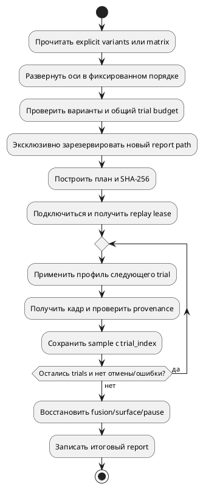
```plantuml
@startuml
start
:Прочитать explicit variants или matrix;
:Развернуть оси в фиксированном порядке;
:Проверить варианты и общий trial budget;
:Эксклюзивно зарезервировать новый report path;
:Построить план и SHA-256;
:Подключиться и получить replay lease;
repeat
  :Применить профиль следующего trial;
  :Получить кадр и проверить provenance;
  :Сохранить sample с trial_index;
repeat while (Остались trials и нет отмены/ошибки?) is (да) not (нет)
:Восстановить fusion/surface/pause;
:Записать итоговый report;
stop
@enduml
```

*Рисунок R.1 — общий C++ workflow плана, выполнения и восстановления. Ошибки соединения/lease
и невозможность restore фиксируются отдельно; схема не обещает возврат replay cursor.*

CLI резервирует report через O_CREAT|O_EXCL до подключения к серверу, включая metadata-only
режим. Существующий файл, параллельно зарезервированный путь или dangling symlink отклоняются
без truncate и запуска эксперимента. Report writer проверяет write/close и не допускает повторной
записи через тот же объект. При аварии может остаться пустой/частичный файл: это **не** atomic
publication, durable checkpoint или automatic resume. Для повтора используйте новый путь;
успешность определяется только завершённым JSON report и его полями. RGBA directory также должна
быть новой. Продуктовая реализация — C++; Python используется только integration tests.

Остаются cursor restoration/GPU cache policy, оркестрация независимых scene/mount seeds, GUI сценариев,
quality-oracle/критерии финальной серии, durable resume и общий experiment provenance. Изменения
не являются новым подтверждающим quality исследованием и не закрывают E-STITCH-01.


## Явный replay start и сброс истории

Сценарий schema1 принимает optional `reset_replay: true` (default false для прежнего поведения).
После acquire runner проверяет capability `replay_reset_v1`, выполняет leased `replay_reset`
вместо обычного pause и ждёт post-ACK READY кадр. `ready_preparation=reset_first_row` фиксирует
подготовку; нормализованный scenario и его hash включают reset_replay, в том числе false.
Поэтому hash новых reports может отличаться от исторического даже при прежнем поведении;
старые reports не переписываются. Готовый
`configs/research/multiband-matrix.json` включает этот режим. При неполной первой строке runner
завершает опыт ошибкой и выполняет cleanup; скрытого перехода к следующей строке нет.
Прежняя однократная READY preparation через step остаётся только при reset_replay=false.

Reset очищает decode cache источника и retained sync history, новый source session отделяет
прогоны, delivery sequence продолжает расти. Идентичность входов сравнивается внутри trial
с baseline своего прогона; между прогонами сравниваются dataset, scenario timestamps, settings,
plan и RGB hashes, а не абсолютные delivery timestamps/session IDs.

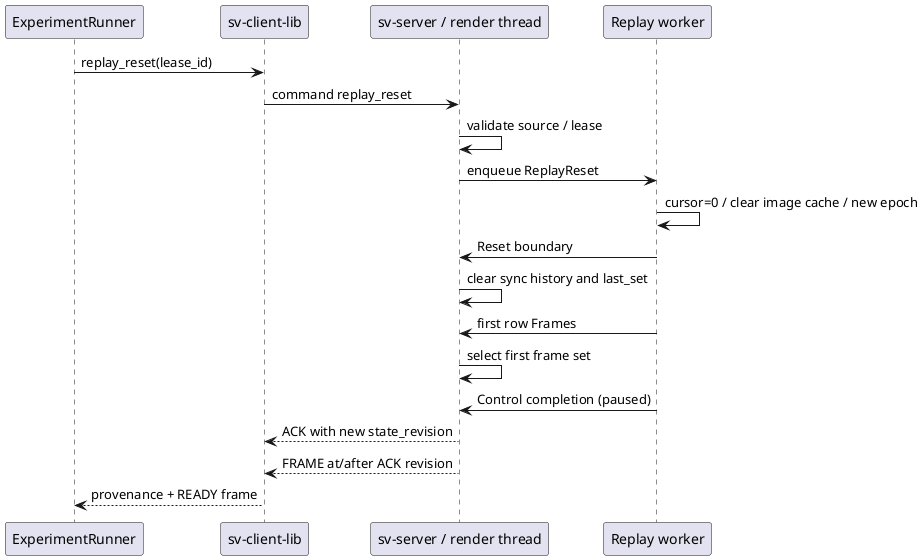
```plantuml
@startuml
participant "ExperimentRunner" as R
participant "sv-client-lib" as L
participant "sv-server / render thread" as S
participant "Replay worker" as W
R -> L : replay_reset(lease_id)
L -> S : command replay_reset
S -> S : validate source / lease
S -> W : enqueue ReplayReset
W -> W : cursor=0 / clear image cache / new epoch
W -> S : Reset boundary
S -> S : clear sync history and last_set
W -> S : first row Frames
S -> S : select first frame set
W -> S : Control completion (paused)
S --> L : ACK with new state_revision
S --> L : FRAME at/after ACK revision
L --> R : provenance + READY frame
@enduml
```

*Рисунок R.2 — граница сброса отделяет историю предыдущего прогона от нового набора кадров.*

Подробный wire contract и ограничения: [[engineering/PROTOCOL_IMPLEMENTED#Сброс replay к первой строке (`replay_reset_v1`)]].
Это не restore первоначального cursor: report сохраняет `cursor_restored=false` и
`restore_scope=fusion_surface_pause_only`. GPU/OS caches, telemetry и общая производительность
после reset отдельно не нормализуются. Потерянный ACK не допускает автоматического retry.


## Первый compiled quality evaluator

Общий C++ service принимает внешний QualityReference: до подключения загружает ограниченный
manifest/RGB/mask, затем на measured samples сверяет фактическую проекцию и input guards,
вычисляет masked RGB8 MAE/RMSE/PSNR/max error. Эталон остаётся на клиентской стороне и не
поступает исследуемому renderer. CLI использует optional scenario.quality_reference; будущий GUI
может передать тот же PImpl evaluator напрямую. Полный формат/ограничения:
[[engineering/RESEARCH_QUALITY]].

FRAME view фиксирует все параметры проекции: orbit/distance/FOV/clip/target плюс dimensions.
Это предотвращает сравнение одинаковых размеров с различной перспективой. Warmup исключён;
quality summaries считают frame_index один раз при повторных измерениях paused кадра.
Нестабильные повторные metrics приводят к failed report после restore.

Разделены declared independent_ground_truth и regression; код не подтверждает истинность
объявленного kind. Legacy schema1 проверяет только IDs/timestamps; schema2 дополнительно проверяет hashes
decoded camera pixels и активной числовой модели. Независимые scene/mount/noise seeds, полная dataset/config identity,
научно обоснованные thresholds, object/ghost metrics, GUI и durable checkpoints всё ещё нужны.
Наличие evaluator не закрывает подтверждение E-STITCH-01.


## Проверяемая идентичность replay observations

Quality manifest schema2 требует decoded-image и numeric camera-model hashes каждого input.
Сервер объявляет replay_input_identity_v1, worker привязывает digest к immutable image, render
thread сообщает модель, которой обработан кадр. Это обнаруживает замену pixels или intrinsics/
extrinsics с прежними paths/IDs/timestamps. Schema1 оставлена как явно обозначенный metadata-only
legacy режим, автоматического понижения проверки нет. Подробности и стоимость:
[[engineering/RESEARCH_QUALITY#Schema2: проверка содержимого входов и числовой модели]].

Не следует называть это полной immutable dataset registry: ещё не фиксируются вся запись,
scene/mount/noise seeds, все server groups и physical-camera provenance одним паспортом.


## Отдельный результат threshold acceptance

Optional criteria во внешнем manifest загружаются и хэшируются до подключения. C++ evaluator
аннотирует каждый measured sample; общий runner формирует quality_acceptance со статусами
not_requested/incomplete/passed/failed. Плохое качество не обрывает сбор данных; partial/cancel/
restore failure не может получить passed. Workflow success и scientific rejection различаются,
CLI отдаёт5 при завершённом опыте с непройденными порогами. Policy проверяет все measured
samples, не только averages. Контракт: [[engineering/RESEARCH_QUALITY#Заданные до запуска критерии качества]].
Это механизм фиксации/проверки порогов одного прогона; независимая preregistration,
обоснование норм, scene/mount/noise orchestration и подтверждающая серия остаются работой.


## Validation pilot двух окружений и пяти носителей

Для генерации inputs добавлены отдельные street/cargo_yard worlds и независимые scene/mount seeds.
Native configs/research/family-carrier-screen.json задаёт20 variants при прежнем близком active
mesh budget.4 cases×2 frames×20 variants×(1 warmup+3 measured)=640 trials;480 measured samples,
1920 независимых arithmetic checks. Все переключения и metrics выполняются C++ service, Python
остаётся exporter/fixture/oracle/plotting. Фактическая геометрия новых worlds и сохранность
исходной Blender Scene проверены через MCP. Results/limits: [[validation/FAMILY_CARRIER_SCREEN]].

Compiled multi-recording supervisor и GUI batch-планов ещё отсутствуют; первый GUI одного исследования описан ниже. True camera calibration
передана стенду, поэтому данный pilot не является испытанием автоматической калибровки.
Наличие новых family inputs не закрывает noise/photometric/dynamic/holdout/target gates.

## Последовательный batch service одной записи

`run_batch` и PImpl `FileExperiment` добавляют общий C++ application service над прежним
ExperimentRunner. CLI `svctl research` также использует FileExperiment: загрузка reference,
capture и запись report не дублируются в двух launchers. Контракт/границы:
[[engineering/RESEARCH_BATCH]]. Новых серверных команд этот срез не добавляет.

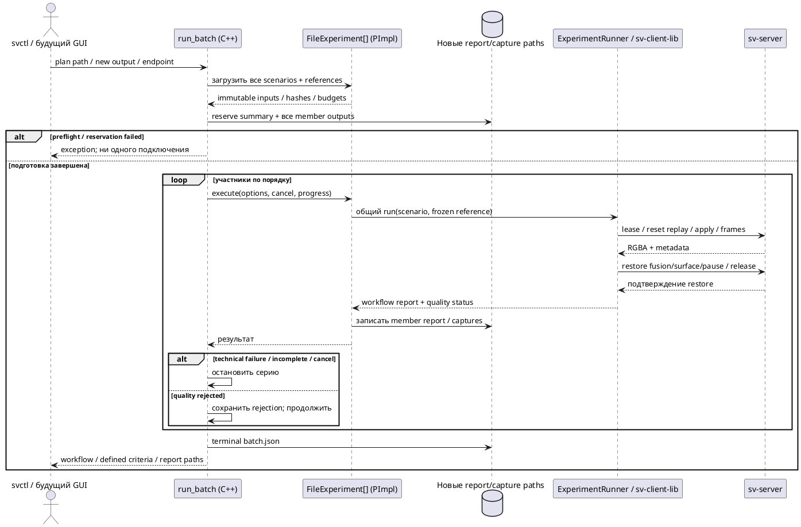
```plantuml
@startuml
actor "svctl / будущий GUI" as UI
participant "run_batch (C++)" as B
participant "FileExperiment[] (PImpl)" as F
database "Новые report/capture paths" as O
participant "ExperimentRunner / sv-client-lib" as R
participant "sv-server" as S
UI -> B : plan path / new output / endpoint
B -> F : загрузить все scenarios + references
F --> B : immutable inputs / hashes / budgets
B -> O : reserve summary + все member outputs
alt preflight / reservation failed
  B --> UI : exception; ни одного подключения
else подготовка завершена
  loop участники по порядку
    B -> F : execute(options, cancel, progress)
    F -> R : общий run(scenario, frozen reference)
    R -> S : lease / reset replay / apply / frames
    S --> R : RGBA + metadata
    R -> S : restore fusion/surface/pause / release
    S --> R : подтверждение restore
    R --> F : workflow report + quality status
    F -> O : записать member report / captures
    F --> B : результат
    alt technical failure / incomplete / cancel
      B -> B : остановить серию
    else quality rejected
      B -> B : сохранить rejection; продолжить
    end
  end
  B -> O : terminal batch.json
  B --> UI : workflow / defined criteria / report paths
end
@enduml
```

*Рисунок RR.6 — все входы/outputs подготавливаются до сети; каждый участник имеет собственный
lease и restore. Между участниками общий lease не удерживается.*

Лимиты: 8 scenarios, 10000 aggregate trials, 128 MiB retained reference pixels. Scope одной
подключённой записи зафиксирован как same_server_recording_v1; автоматического переключения
recording, atomic multi-run isolation, cursor restoration и durable checkpoints здесь нет.

## GUI одного исследования: граница worker и UI

Реализованный первый срез ResearchController: GUI формирует typed draft, worker сохраняет его в новый
output и вызывает FileExperiment. Product rendering/evaluation остаётся в прежних C++ services.
UI не вызывает блокирующий runner; progress передаётся через atomic counters с периодическим
чтением, завершение — queued callback. При закрытии окна запрашивается отмена и ожидается
завершение restore. Draft без внешнего reference не может объявить scientific quality passed.

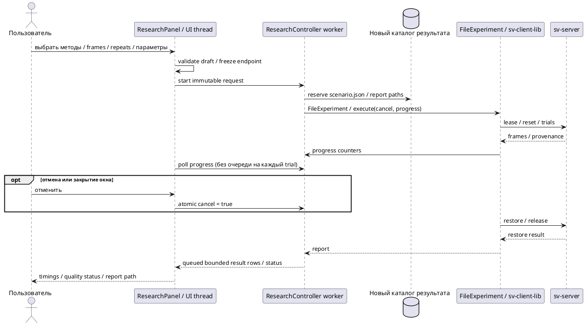
```plantuml
@startuml
actor Пользователь as U
participant "ResearchPanel / UI thread" as UI
participant "ResearchController worker" as W
database "Новый каталог результата" as O
participant "FileExperiment / sv-client-lib" as R
participant "sv-server" as S
U -> UI : выбрать методы / frames / repeats / параметры
UI -> UI : validate draft / freeze endpoint
UI -> W : start immutable request
W -> O : reserve scenario.json / report paths
W -> R : FileExperiment / execute(cancel, progress)
R -> S : lease / reset / trials
S --> R : frames / provenance
R -> W : progress counters
UI -> W : poll progress (без очереди на каждый trial)
opt отмена или закрытие окна
  U -> UI : отменить
  UI -> W : atomic cancel = true
end
R -> S : restore / release
S --> R : restore result
R --> W : report
W --> UI : queued bounded result rows / status
UI --> U : timings / quality status / report path
@enduml
```

*Рисунок RR.7 — worker исполняет workflow, UI остаётся отзывчивым и не получает полный report
с тысячами frame metadata. Batch editor и import/reference chooser не входят в этот первый срез.*

## Выбор reference и импорт одиночного сценария

GUI использует два входа одного FileExperiment: исходный файл либо exact JSON bytes формы с
явной reference base. В форме locator reference абсолютный; при импорте относительные пути
разрешаются от canonical source directory. Исходный файл не переписывается. Все reference
pixels/guards/criteria фиксируются до output creation и подключения; сервер не получает truth.

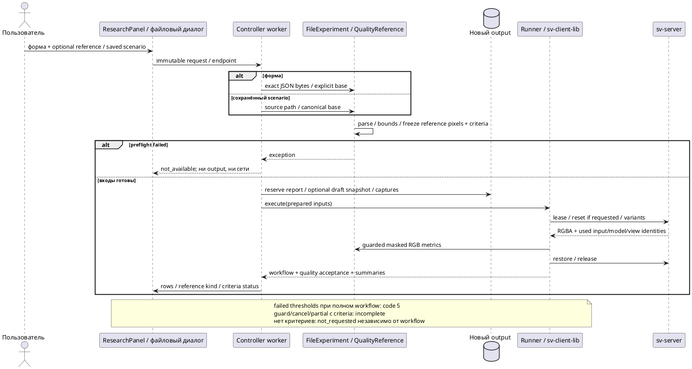
```plantuml
@startuml
actor Пользователь as U
participant "ResearchPanel / файловый диалог" as G
participant "Controller worker" as W
participant "FileExperiment / QualityReference" as P
database "Новый output" as O
participant "Runner / sv-client-lib" as R
participant "sv-server" as S
U -> G : форма + optional reference / saved scenario
G -> W : immutable request / endpoint
alt форма
  W -> P : exact JSON bytes / explicit base
else сохранённый scenario
  W -> P : source path / canonical base
end
P -> P : parse / bounds / freeze reference pixels + criteria
alt preflight failed
  P --> W : exception
  W --> G : not_available; ни output, ни сети
else входы готовы
  W -> O : reserve report / optional draft snapshot / captures
  W -> R : execute(prepared inputs)
  R -> S : lease / reset if requested / variants
  S --> R : RGBA + used input/model/view identities
  R -> P : guarded masked RGB metrics
  R -> S : restore / release
  R --> W : workflow + quality acceptance + summaries
  W -> G : rows / reference kind / criteria status
end
note over R,G
failed thresholds при полном workflow: code 5
guard/cancel/partial с criteria: incomplete
нет критериев: not_requested независимо от workflow
end note
@enduml
```

*Рисунок RR.8 — внешний эталон остаётся на стороне клиента; failed качества не подменяется
технической ошибкой, а прежний badge очищается при отказе нового запроса.*

FileExperiment записывает raw-byte hash, input_kind/base и source path для файла. Форму можно
повторить через сохранённый scenario.json; импорт не создаёт копию входного dataset. При ранней
отмене passport уже загруженного reference может присутствовать без оценённых frames.
GUI показывает MAE/RMSE и PSNR из общей взвешенной MSE уникальных frames; per-sample acceptance
сохраняет прежнюю policy. Ни regression, ни авторское independent_ground_truth не доказывают
обоснованности threshold/независимости данных. Контракт: [[engineering/RESEARCH_BATCH]].

## GUI: запуск сохранённого batch-плана

Реализованный процесс использует общий C++ `run_batch`, а не отдельный GUI runner.
Вся серия работает с одним подключённым сервером и одной replay-записью.
Прогресс относится к текущему сценарию; его завершение ещё не означает завершение серии.

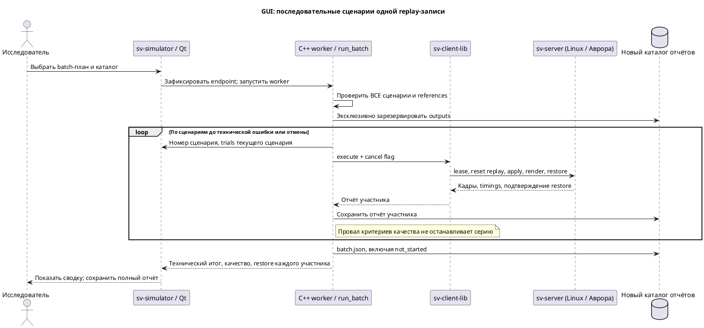
```plantuml
@startuml
title GUI: последовательные сценарии одной replay-записи
actor Исследователь as User
participant "sv-simulator / Qt" as UI
participant "C++ worker / run_batch" as Batch
participant "sv-client-lib" as Lib
participant "sv-server (Linux / Аврора)" as Server
database "Новый каталог отчётов" as Reports
User -> UI: Выбрать batch-план и каталог
UI -> Batch: Зафиксировать endpoint; запустить worker
Batch -> Batch: Проверить ВСЕ сценарии и references
Batch -> Reports: Эксклюзивно зарезервировать outputs
loop По сценариям до технической ошибки или отмены
  Batch -> UI: Номер сценария, trials текущего сценария
  Batch -> Lib: execute + cancel flag
  Lib -> Server: lease, reset replay, apply, render, restore
  Server --> Lib: Кадры, timings, подтверждение restore
  Lib --> Batch: Отчёт участника
  Batch -> Reports: Сохранить отчёт участника
  note right of Batch: Провал критериев качества не останавливает серию
end
Batch -> Reports: batch.json, включая not_started
Batch --> UI: Технический итог, качество, restore каждого участника
UI --> User: Показать сводку; сохранить полный отчёт
@enduml
```

*Рисунок RR.9 — запуск сохранённого batch-плана через общий C++ исполнитель;
каждый участник отдельно восстанавливает настройки, непущенные участники остаются в сводке.*

Callback прогресса сообщает `(member_index, done, total)` с нулевым индексом участника.
Перед его `execute` приходит событие `done=0`, чтобы новый сценарий не наследовал счётчик
предыдущего. В GUI номер начинается с единицы, `total` относится только к этому сценарию.
В конце worker передаёт не полный report, а до восьми компактных строк участников.
Выбор endpoint замораживается до запуска; смена подключения не перенаправляет работающую серию.

## Визуальное составление серии

Редактор формирует до восьми участников из локальных scenario files. ID участника сохраняется
при перестановке; повторное использование одного scenario допускается с разными ID.
Перед worker GUI преобразует URL в абсолютные пути и копирует состав. C++ service принимает
документ и явный base directory, затем выполняет прежний preflight всех FileExperiment.
Для составленного в памяти плана после preflight сохраняется `inputs/plan.json` до сети.
Это повторяемый локальный план со ссылками на исходные данные, не переносимый dataset bundle.

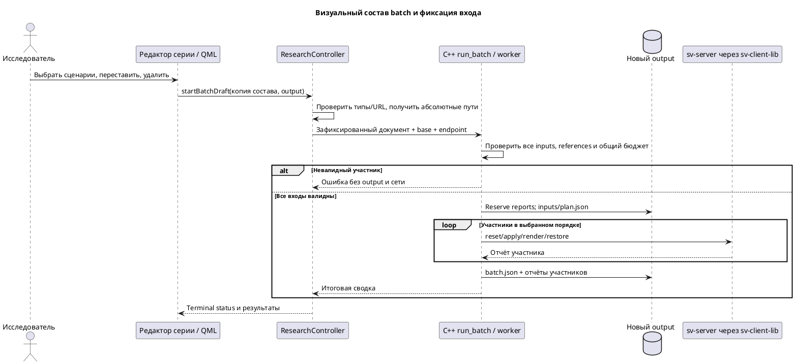
```plantuml
@startuml
title Визуальный состав batch и фиксация входа
actor Исследователь as User
participant "Редактор серии / QML" as Editor
participant "ResearchController" as Controller
participant "C++ run_batch / worker" as Runner
database "Новый output" as Output
participant "sv-server через sv-client-lib" as Server
User -> Editor: Выбрать сценарии, переставить, удалить
Editor -> Controller: startBatchDraft(копия состава, output)
Controller -> Controller: Проверить типы/URL, получить абсолютные пути
Controller -> Runner: Зафиксированный документ + base + endpoint
Runner -> Runner: Проверить все inputs, references и общий бюджет
alt Невалидный участник
  Runner --> Controller: Ошибка без output и сети
else Все входы валидны
  Runner -> Output: Reserve reports; inputs/plan.json
  loop Участники в выбранном порядке
    Runner -> Server: reset/apply/render/restore
    Server --> Runner: Отчёт участника
  end
  Runner -> Output: batch.json + отчёты участников
  Runner --> Controller: Итоговая сводка
end
Controller --> Editor: Terminal status и результаты
@enduml
```

*Рисунок RR.10 — фиксация визуального состава серии и общий preflight до сетевых мутаций.*

## Импорт batch в редактируемый состав

Импорт заменяет состав только после успешной структурной проверки всего плана. Относительные
scenario paths разрешаются от каталога выбранного batch file, как в файловом run_batch;
reference paths по-прежнему разрешает FileExperiment относительно исходного scenario.
Импорт читает только небольшой обычный файл плана, не загружает datasets и не подключается
к серверу. Полный preflight сценариев/эталонов остаётся обязательным перед каждым запуском.

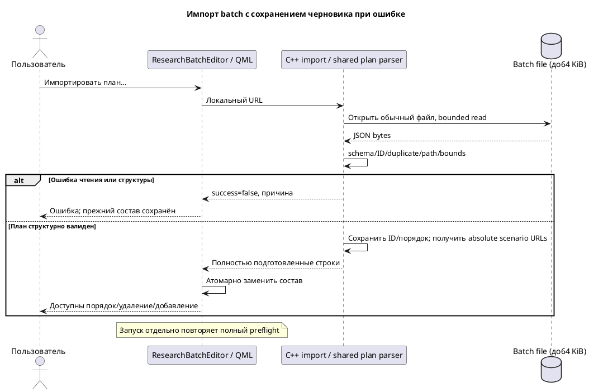
```plantuml
@startuml
title Импорт batch с сохранением черновика при ошибке
actor Пользователь as User
participant "ResearchBatchEditor / QML" as Editor
participant "C++ import / shared plan parser" as Parser
database "Batch file (до64 KiB)" as File
User -> Editor: Импортировать план…
Editor -> Parser: Локальный URL
Parser -> File: Открыть обычный файл, bounded read
File --> Parser: JSON bytes
Parser -> Parser: schema/ID/duplicate/path/bounds
alt Ошибка чтения или структуры
  Parser --> Editor: success=false, причина
  Editor --> User: Ошибка; прежний состав сохранён
else План структурно валиден
  Parser -> Parser: Сохранить ID/порядок; получить absolute scenario URLs
  Parser --> Editor: Полностью подготовленные строки
  Editor -> Editor: Атомарно заменить состав
  Editor --> User: Доступны порядок/удаление/добавление
end
note over Editor: Запуск отдельно повторяет полный preflight
@enduml
```

*Рисунок RR.11 — импорт структуры не запускает исследование и не подменяет полный preflight.*

## Сохранение неисполненного batch-черновика

Сохранение — локальная структурная операция: состав переводится в обычный schema1 plan с
абсолютными scenario paths, проверяется общим parser и записывается в новый файл через
ReportOutput/O_EXCL. Оно не читает scenarios/references, не запускает worker и не подключается
к серверу. Ошибка или отмена сохраняет редактируемый состав; прежний файл не перезаписывается.

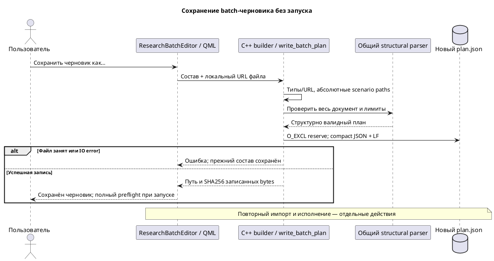
```plantuml
@startuml
title Сохранение batch-черновика без запуска
actor Пользователь as User
participant "ResearchBatchEditor / QML" as Editor
participant "C++ builder / write_batch_plan" as Writer
participant "Общий structural parser" as Parser
database "Новый plan.json" as File
User -> Editor: Сохранить черновик как…
Editor -> Writer: Состав + локальный URL файла
Writer -> Writer: Типы/URL, абсолютные scenario paths
Writer -> Parser: Проверить весь документ и лимиты
Parser --> Writer: Структурно валидный план
Writer -> File: O_EXCL reserve; compact JSON + LF
alt Файл занят или IO error
  Writer --> Editor: Ошибка; прежний состав сохранён
else Успешная запись
  Writer --> Editor: Путь и SHA256 записанных bytes
  Editor --> User: Сохранён черновик; полный preflight при запуске
end
note over Editor,File: Повторный импорт и исполнение — отдельные действия
@enduml
```

*Рисунок RR.12 — сохранение черновика не создаёт исследовательский отчёт или серверную операцию.*

## Сопоставление двух исследовательских отчётов

Контракт реализован 18.10.2026: общий C++ application service и отдельная GUI вкладка
сравнения работают без запуска Python и без сетевых мутаций. Реализация и ограничения:
[[engineering/RESEARCH_REPORTS]]. Следующие правила фиксируют границы этого среза. Начальный вход — два individual ExperimentRunner
report files; batch.json выбирается через отдельные ID.json, а не исполняется как report.

Правила реализации:

- Чтение ordinary files с явным пределом размера; schema/число variants/samples/типовые bounds
  проверять до передачи компактных rows в QML. Не загружать RGBA payload и не читать произвольные
  capture/reference paths из импортированного report. Report — заявленные данные, не аттестация.
- Подбирать строки по полным fusion/surface settings, не по index либо одному mode/boundary:
  levels, solver, carrier, support/visibility и остальные применённые параметры участвуют
  в identity. Перестановка variants не должна менять результат сопоставления.
- Workflow success, restore и quality acceptance показывать отдельно у обоих запусков.
  Missing/partial/unknown нельзя превращать в нули или passed; маленькие ошибки сохранять,
  exact-match PSNR отображать отдельно от отсутствующей метрики.
- Для matched-workload сверять replay input/camera-model identities, последовательность кадров,
  view/output size и measurement/warmup/repeat policy. Не считать frame_set_id или timestamp
  сами по себе доказательством одинакового content; использовать существующие identity guards.
- Аппаратные платформы и backend/build показывать раздельно: PC/Aurora сравнение намеренно
  допускает разные устройства, но требует одинаковой измеряемой работы и явной области
  подтверждения. Отсутствующие provenance должны давать unverified, а не совместимость.
- Quality deltas разрешать только для совместимого набора truth/masks/view и определённых
  metrics; одинакового dataset_id недостаточно. Не смешивать regression и independent truth
  под одной зелёной отметкой. Не усреднять frame PSNR вместо уже определённой pooled MSE.
- В первом UI показывать две сводки и причины unmatched/unverified. Delta доступна только
  при явно выполненных gates; универсальный winner и causal performance conclusion не выводить.
- Loading/parsing выполнять вне UI thread; frozen file pair, queued completion, cancel/close
  и защита от stale results обязательны. Не заменять результаты последнего серверного прогона
  локальным сравнением. Error не должен оставлять rows/badge от другой пары файлов.
- Сохранять raw report hashes, policy version и выбранные сопоставления для воспроизведения.
  Полный bundle, multi-report statistics/CI и автоматическая научная приёмка — отдельные срезы.

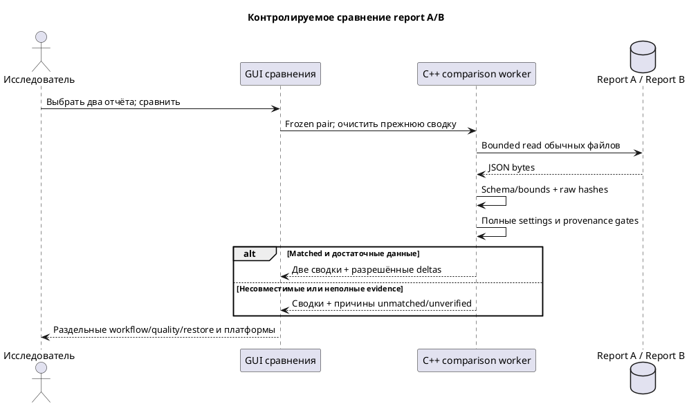
```plantuml
@startuml
title Контролируемое сравнение report A/B
actor Исследователь as User
participant "GUI сравнения" as UI
participant "C++ comparison worker" as Worker
database "Report A / Report B" as Files
User -> UI: Выбрать два отчёта; сравнить
UI -> Worker: Frozen pair; очистить прежнюю сводку
Worker -> Files: Bounded read обычных файлов
Files --> Worker: JSON bytes
Worker -> Worker: Schema/bounds + raw hashes
Worker -> Worker: Полные settings и provenance gates
alt Matched и достаточные данные
  Worker --> UI: Две сводки + разрешённые deltas
else Несовместимые или неполные evidence
  Worker --> UI: Сводки + причины unmatched/unverified
end
UI --> User: Раздельные workflow/quality/restore и платформы
@enduml
```

*Рисунок RR.13 — локальное сравнение не подменяет совпадение workloads названием алгоритма.*

Приёмочные проверки реализованы: reordered variants и разные levels/surfaces; одинаковые IDs при изменённых
image bytes; разные truth/masks/view; missing/partial metadata; zero/tiny/exact/unavailable
metrics; malformed/oversize/FIFO input; cancel/close/stale callback; сохранность результата
прошлого server run. Live отчёты одного Linux fixture проверены для Unix/TCP/combined;
отдельный cross-platform report остаётся после появления целевого устройства. Прежние research/hardware gates этим не закрываются.

## Выбор профиля исследования по каталогу сервера

Реализованный контракт: форма исследования использует уже полученный ConfigurationEditor
fusion catalog той же сессии. Новый запрос/соединение для UI не создаётся. Клиент показывает
пересечение известных ему методов с объявлениями сервера; неизвестные enum не включаются
автоматически. Отсутствующий/ошибочный каталог не разрешает запуск формы. Saved scenarios
и batch сохраняют прежний общий runner и серверную проверку.

Выбор метода не подменяется при обновлении capabilities: неподдерживаемая отмеченная
строка остаётся видимой и её можно снять; запуск блокируется до исправления выбора.
Boundary/solver выбираются по значению, не по индексу. Уровни пирамиды проверяются по
пересечению клиентских и серверных границ. C++ application validation повторяет проверку
формы с фиксированным snapshot каталога до filesystem/network действий. Сервер остаётся
владельцем окончательной проверки; каталог не резервирует backend или конфигурацию.

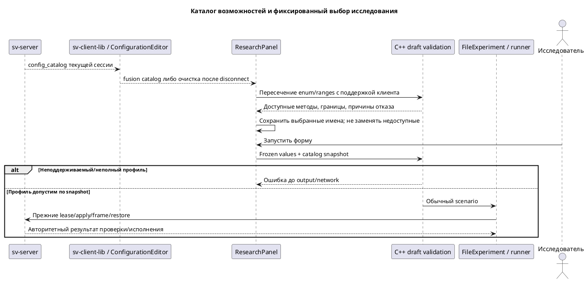
```plantuml
@startuml
title Каталог возможностей и фиксированный выбор исследования
participant "sv-server" as Server
participant "sv-client-lib / ConfigurationEditor" as Config
participant "ResearchPanel" as UI
participant "C++ draft validation" as Draft
participant "FileExperiment / runner" as Runner
Server --> Config: config_catalog текущей сессии
Config --> UI: fusion catalog либо очистка после disconnect
UI -> Draft: Пересечение enum/ranges с поддержкой клиента
Draft --> UI: Доступные методы, границы, причины отказа
UI -> UI: Сохранить выбранные имена; не заменять недоступные
actor Исследователь as User
User -> UI: Запустить форму
UI -> Draft: Frozen values + catalog snapshot
alt Неподдерживаемый/неполный профиль
  Draft --> UI: Ошибка до output/network
else Профиль допустим по snapshot
  Draft -> Runner: Обычный scenario
  Runner -> Server: Прежние lease/apply/frame/restore
  Server --> Runner: Авторитетный результат проверки/исполнения
end
@enduml
```

*Рисунок RR.14 — каталог ограничивает форму, но не заменяет серверную проверку.*

## Критерии качества конкретного опыта

Реализованный контракт: по умолчанию критерии наследуются из reference manifest. Явный режим формы
«Задать для этого опыта» заменяет весь набор criteria непустым выбранным набором MAE/RMSE/PSNR,
а не объединяет его с manifest. Пустой override и criteria без reference запрещены.
Scenario содержит `quality_criteria`; original manifest bytes/hashes и truth не меняются.
Общий C++ FileExperiment до output/network загружает reference и фиксирует эффективные
criteria, их источник и исходные manifest criteria. Runner применяет прежнюю политику
all_measured_samples_v1. Порог — условие конкретного опыта, не доказательство независимости truth.

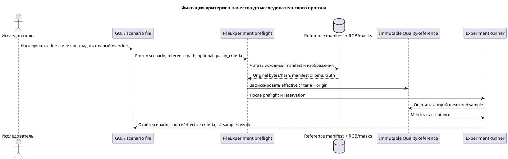
```plantuml
@startuml
title Фиксация критериев качества до исследовательского прогона
actor Исследователь as User
participant "GUI / scenario file" as UI
participant "FileExperiment preflight" as Prepare
database "Reference manifest + RGB/masks" as Reference
participant "Immutable QualityReference" as Quality
participant "ExperimentRunner" as Runner
User -> UI: Наследовать criteria или явно задать полный override
UI -> Prepare: Frozen scenario, reference path, optional quality_criteria
Prepare -> Reference: Читать исходный manifest и изображения
Reference --> Prepare: Original bytes/hash, manifest criteria, truth
Prepare -> Quality: Зафиксировать effective criteria + origin
Prepare -> Runner: После preflight и reservation
Runner -> Quality: Оценить каждый measured sample
Quality --> Runner: Metrics + acceptance
Runner --> UI: Отчёт: scenario, source/effective criteria, all-samples verdict
@enduml
```

*Рисунок RR.15 — критерии фиксируются до запуска без редактирования исходного эталона.*

## Матрица параметров fusion в форме исследования

Реализованный контракт: необязательный диапазон pyramid levels и сравнение seam solvers добавляются
к прежним methods/boundary. C++ строит отдельную применимую матрицу каждого метода через
общий `expand_variant_matrix`: непирамидальные методы не умножаются по levels/boundary,
методы без graph-cut не умножаются по solver. Порядок methods сохраняется, axes имеют
прежний детерминированный порядок общего expander. Не более32 variants и10000 trials;
неверные/пустые/повторные значения отклоняются до output/network.

Сводка количества вариантов/испытаний также вычисляется в C++, не независимой формулой
QML. Каталог проверяется для каждого развёрнутого варианта. Изменение каталога не
сужает выбранный диапазон или solver matrix автоматически. Обычный scenario snapshot
фиксирует все полученные variants; runner и серверный протокол остаются прежними.

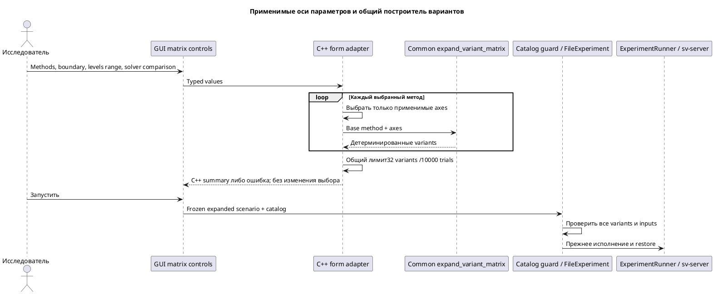
```plantuml
@startuml
title Применимые оси параметров и общий построитель вариантов
actor Исследователь as User
participant "GUI matrix controls" as UI
participant "C++ form adapter" as Adapter
participant "Common expand_variant_matrix" as Expand
participant "Catalog guard / FileExperiment" as Prepare
participant "ExperimentRunner / sv-server" as Run
User -> UI: Methods, boundary, levels range, solver comparison
UI -> Adapter: Typed values
loop Каждый выбранный метод
  Adapter -> Adapter: Выбрать только применимые axes
  Adapter -> Expand: Base method + axes
  Expand --> Adapter: Детерминированные variants
end
Adapter -> Adapter: Общий лимит32 variants /10000 trials
Adapter --> UI: C++ summary либо ошибка; без изменения выбора
User -> UI: Запустить
UI -> Prepare: Frozen expanded scenario + catalog
Prepare -> Prepare: Проверить все variants и inputs
Prepare -> Run: Прежнее исполнение и restore
@enduml
```

*Рисунок RR.16 — нерелевантные оси не создают повторные псевдоварианты.*

## Матрица носителей: снимки active, а не черновиков

Профили формы — полные копии `ConfigurationEditor.activeSurface` из последнего
ответа `read_configuration`. Редактирование `surface` не меняет снимок active.
Исследователь применяет геометрию через существующий конфигуратор, обновляет
active и добавляет профиль в набор. Смена типа не создаёт исследовательский
профиль автоматически. Копия сохраняет optional support/occlusion параметры.

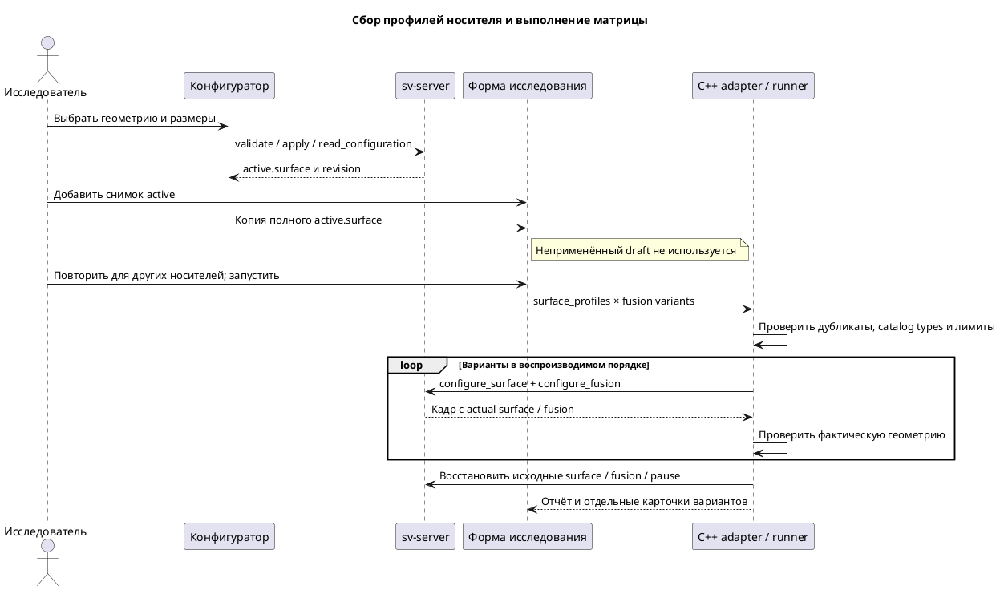
```plantuml
@startuml
title Сбор профилей носителя и выполнение матрицы
actor Исследователь as User
participant "Конфигуратор" as Config
participant "sv-server" as Server
participant "Форма исследования" as Form
participant "C++ adapter / runner" as Runner
User -> Config: Выбрать геометрию и размеры
Config -> Server: validate / apply / read_configuration
Server --> Config: active.surface и revision
User -> Form: Добавить снимок active
Config --> Form: Копия полного active.surface
note right of Form: Неприменённый draft не используется
User -> Form: Повторить для других носителей; запустить
Form -> Runner: surface_profiles × fusion variants
Runner -> Runner: Проверить дубликаты, catalog types и лимиты
loop Варианты в воспроизводимом порядке
  Runner -> Server: configure_surface + configure_fusion
  Server --> Runner: Кадр с actual surface / fusion
  Runner -> Runner: Проверить фактическую геометрию
end
Runner -> Server: Восстановить исходные surface / fusion / pause
Runner --> Form: Отчёт и отдельные карточки вариантов
@enduml
```

*Рисунок RR.17 — сбор полных снимков и разворачивание матрицы носителей.*

Снимок active подтверждает принятие геометрии в момент чтения. Он не гарантирует
совместимость с другой машиной, изменённым vehicle/view или новым состоянием
сервера. Окончательная семантическая проверка остаётся серверной; ошибка прерывает
эксперимент с попыткой восстановления. Без набора профилей сохраняется прежняя
семантика baseline surface. Пустой явно заданный набор и дубликаты недопустимы.

## Числовые оси fusion: применимость до разворачивания

Форма задаёт явные списки чисел через SpinBox и кнопки добавления/удаления.
C++ проверяет конечность, диапазон и дубликаты; десятичный шаг диапазона не
используется, поэтому накопление floating-point step не меняет число вариантов.
Применимость определяется текущим кодом renderer/fusion, а не названием параметра.

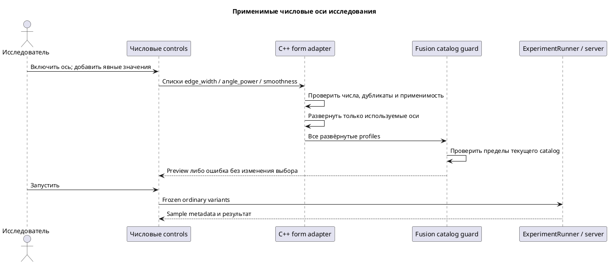
```plantuml
@startuml
title Применимые числовые оси исследования
actor Исследователь as User
participant "Числовые controls" as UI
participant "C++ form adapter" as Adapter
participant "Fusion catalog guard" as Guard
participant "ExperimentRunner / server" as Run
User -> UI: Включить ось; добавить явные значения
UI -> Adapter: Списки edge_width / angle_power / smoothness
Adapter -> Adapter: Проверить числа, дубликаты и применимость
Adapter -> Adapter: Развернуть только используемые оси
Adapter -> Guard: Все развёрнутые profiles
Guard -> Guard: Проверить пределы текущего catalog
Guard --> UI: Preview либо ошибка без изменения выбора
User -> UI: Запустить
UI -> Run: Frozen ordinary variants
Run --> UI: Sample metadata и результат
@enduml
```

*Рисунок RR.18 — в матрицу не включаются параметры, не используемые выбранным методом.*


Отключённая числовая ось сохраняет defaults Scenario/FusionSettings, а не active сервера.
Catalog guard проверяет все три фактически передаваемых числа после parse_scenario,
включая defaults. Один глобальный предел32 variants/10000 trials применяется после
числовых осей, pyramid/solver axes и carrier profiles. Точная таблица применимости и
диапазоны: [[engineering/RESEARCH_BATCH#Числовые списки параметров fusion]].

## Профиль наблюдения и допуск сравнения времени

Сохранение кадров, подсчёт hash, клиентский evaluator и серверная telemetry могут
менять работу между render samples. Совпадение порядка trial не подтверждает
совпадение этой нагрузки. Runner фиксирует версионированный observation profile;
FileExperiment уточняет известный файловый consumer. Telemetry читается внутри lease
перед trial и после них; неизвестные или нестабильные данные не разрешают timing delta.

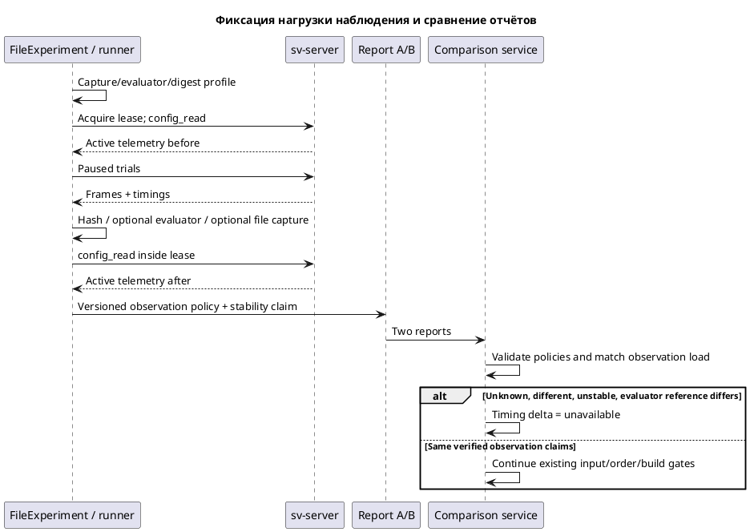
```plantuml
@startuml
title Фиксация нагрузки наблюдения и сравнение отчётов
participant "FileExperiment / runner" as Run
participant "sv-server" as Server
participant "Report A/B" as Reports
participant "Comparison service" as Compare
Run -> Run: Capture/evaluator/digest profile
Run -> Server: Acquire lease; config_read
Server --> Run: Active telemetry before
Run -> Server: Paused trials
Server --> Run: Frames + timings
Run -> Run: Hash / optional evaluator / optional file capture
Run -> Server: config_read inside lease
Server --> Run: Active telemetry after
Run -> Reports: Versioned observation policy + stability claim
Reports -> Compare: Two reports
Compare -> Compare: Validate policies and match observation load
alt Unknown, different, unstable, evaluator reference differs
  Compare -> Compare: Timing delta = unavailable
else Same verified observation claims
  Compare -> Compare: Continue existing input/order/build gates
end
@enduml
```

*Рисунок RR.19 — одинаковые исходники и trial не заменяют сведения о нагрузке наблюдения.*

Исходные fusion/surface/pause фиксируются из successful acquire ACK
(`initial_state_origin=experiment_acquire_ack_v1`). Предварительный отдельный state read
для restore больше не используется. ACK содержит то же текущее состояние, которое
захватывает lease baseline. Это убирает зависимость от интервала read→acquire для будущего
расширения concurrency; текущий односессионный server не проверен как multi-client.

## Переносимый набор сценария и эталона

Первый bundle переносит client-side сценарий и quality reference, включая RGB/mask.
Replay/config/build серверного стенда не входят в этот формат. Пути reference переписываются
в фиксированную структуру; raw bytes каждого файла получают SHA256 и размер.
При загрузке проверяются замкнутость ссылок, относительные имена, размеры и hashes;
проверенные bytes копируются в закрытый временный каталог, где FileExperiment фиксирует
decoded reference. После этого изменение исходного bundle не меняет запущенный опыт.

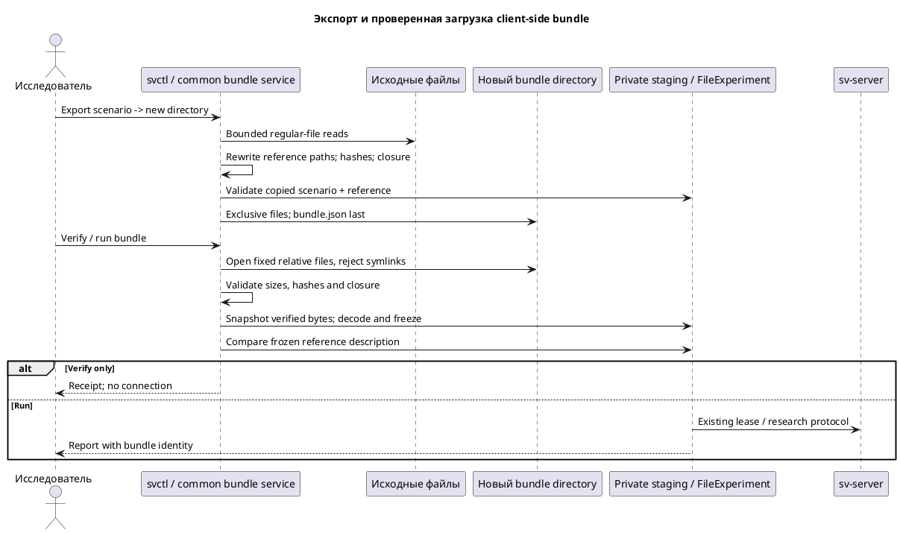
```plantuml
@startuml
title Экспорт и проверенная загрузка client-side bundle
actor Исследователь as User
participant "svctl / common bundle service" as Bundle
participant "Исходные файлы" as Inputs
participant "Новый bundle directory" as Files
participant "Private staging / FileExperiment" as Freeze
participant "sv-server" as Server
User -> Bundle: Export scenario -> new directory
Bundle -> Inputs: Bounded regular-file reads
Bundle -> Bundle: Rewrite reference paths; hashes; closure
Bundle -> Freeze: Validate copied scenario + reference
Bundle -> Files: Exclusive files; bundle.json last
User -> Bundle: Verify / run bundle
Bundle -> Files: Open fixed relative files, reject symlinks
Bundle -> Bundle: Validate sizes, hashes and closure
Bundle -> Freeze: Snapshot verified bytes; decode and freeze
Bundle -> Freeze: Compare frozen reference description
alt Verify only
  Bundle --> User: Receipt; no connection
else Run
  Freeze -> Server: Existing lease / research protocol
  Freeze --> User: Report with bundle identity
end
@enduml
```

*Рисунок RR.20 — переносимость client-side inputs не заменяет регистрацию server recording.*

## Переносимый набор в GUI

Операции экспорта, проверки и запуска используют один worker ResearchController.
Они взаимоисключающие; закрытие окна и отмена используют существующий lifecycle.
Проверка и экспорт доступны без подключения, запуск требует выбранного endpoint.

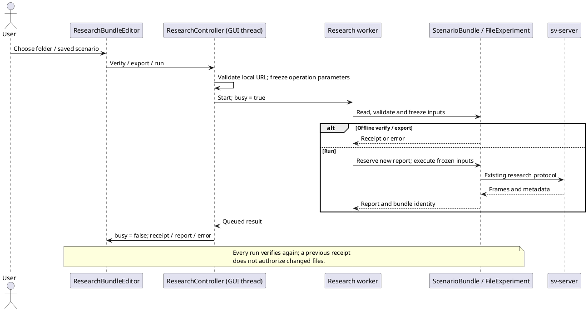
```plantuml
@startuml
actor User
participant "ResearchBundleEditor" as UI
participant "ResearchController (GUI thread)" as Controller
participant "Research worker" as Worker
participant "ScenarioBundle / FileExperiment" as Bundle
participant "sv-server" as Server
User -> UI: Choose folder / saved scenario
UI -> Controller: Verify / export / run
Controller -> Controller: Validate local URL; freeze operation parameters
Controller -> Worker: Start; busy = true
Worker -> Bundle: Read, validate and freeze inputs
alt Offline verify / export
  Bundle --> Worker: Receipt or error
else Run
  Worker -> Bundle: Reserve new report; execute frozen inputs
  Bundle -> Server: Existing research protocol
  Server --> Bundle: Frames and metadata
  Bundle --> Worker: Report and bundle identity
end
Worker --> Controller: Queued result
Controller -> UI: busy = false; receipt / report / error
note over UI,Bundle
Every run verifies again; a previous receipt
does not authorize changed files.
end note
@enduml
```

*Рисунок RR.21 — файловые операции и декодирование выполняются вне GUI-потока.*


## Переносимая серия одной записи

BatchBundle фиксирует все дочерние single-scenario bundles до output/network.
Общий executor принимает уже подготовленные FileExperiment, резервирует все отчёты
и использует прежнюю политику quality rejection / technical stop.

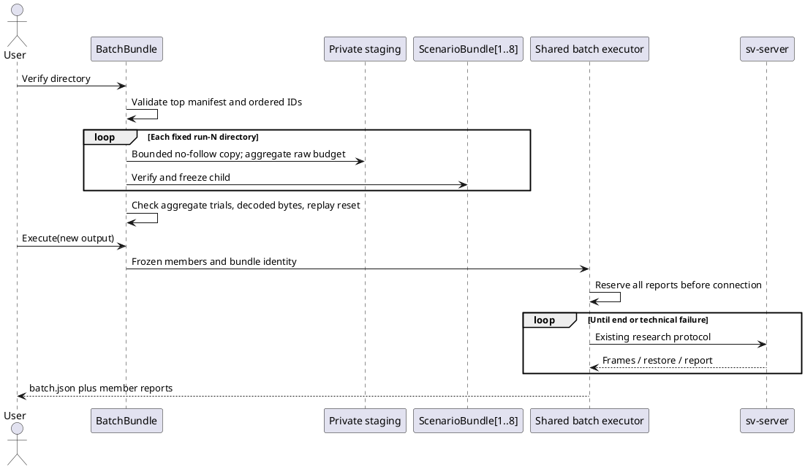
```plantuml
@startuml
actor User
participant BatchBundle as Bundle
participant "Private staging" as Staging
participant "ScenarioBundle[1..8]" as Members
participant "Shared batch executor" as Executor
participant "sv-server" as Server
User -> Bundle: Verify directory
Bundle -> Bundle: Validate top manifest and ordered IDs
loop Each fixed run-N directory
  Bundle -> Staging: Bounded no-follow copy; aggregate raw budget
  Bundle -> Members: Verify and freeze child
end
Bundle -> Bundle: Check aggregate trials, decoded bytes, replay reset
User -> Bundle: Execute(new output)
Bundle -> Executor: Frozen members and bundle identity
Executor -> Executor: Reserve all reports before connection
loop Until end or technical failure
  Executor -> Server: Existing research protocol
  Server --> Executor: Frames / restore / report
end
Executor --> User: batch.json plus member reports
@enduml
```

*Рисунок RR.22 — серия переносит client inputs одной записи, без server recording/config.*
