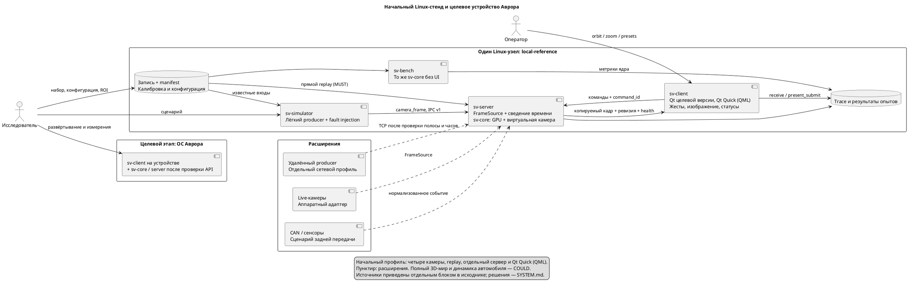
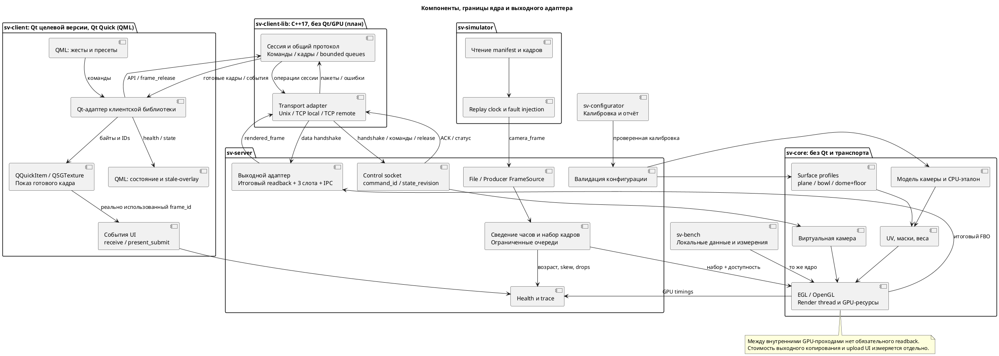
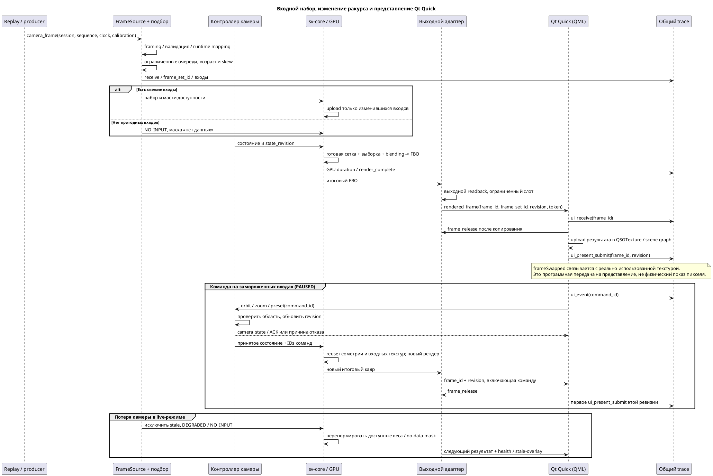

# Архитектура системы Surround View

## Уточнение 07.10.2026

Приоритетная целевая модель следующего этапа: [[architecture/CLIENT_SERVER_MODEL]]. Сервер — единственный writer config; три примера клиентов, multi-session, products/subscriptions и pipeline trace описаны там с последовательностями и условиями приёмки. Следующие разделы содержат прежнюю проектную архитектуру; её расхождения разрешаются новым контрактом. Рабочие новые APIs не объявляются реализованными до тестов.

## Назначение и статус

Рабочая редакция от 06.10.2026; основа от 19.09.2026. Документ задаёт полную проектную архитектуру по [аудиту](../archive/AUDIT.md). Подмножество реализовано и проверено на Linux/Mesa/RTX; его точное отображение на код и отличия находятся в [[prototype/STATUS]]. Объём определён в [SYSTEM.md](../requirements/SYSTEM.md), календарь — в [ROADMAP.md](../planning/ROADMAP.md), методика — в [ACCEPTANCE.md](../validation/ACCEPTANCE.md), первые результаты — [[prototype/MEASUREMENTS]].

Актуальная карта существующих компонентов, устройств и ОС: [[architecture/DEPLOYMENT]]. В ней отдельно показаны проверенный Linux-стенд и план размещения на Авроре.

## Платформы и границы

Цель — клиент и рабочий конвейер на устройстве с ОС Аврора. Первый проверочный профиль — локальный replay на Linux. Точное размещение сервера на целевом устройстве, доступ к EGL/GPU и зависимости подтверждаются по [[architecture/DECISIONS]]. Работа рендера только на мощном ПК не считается переносом на Аврору.

`sv-client` — единое имя клиента; прежнее `sv-ui` заменено. `sv-configurator` выполняет offline-калибровку на рабочей станции, формирует отчёт и проверенную конфигурацию. Сервер применяет её между запусками. Конфигуратор не входит в покадровый GPU-путь.

Текущий код выделяет GPU в `sv-render`, OpenCV — в `sv-vision`, проверки — в `sv-validation`; использует прямую fragment-проекцию и QQuickImageProvider. В 0.6.0 decoding PPM/PNG/JPEG выполняется в replay source worker; альтернативный socket source имеет свой Asio worker. Trace пока выполняется в render-потоке; UV/LUT и общий worker pool ниже планируются. Контракт источников: [[engineering/SOURCES]]. VideoCapture пока отдельный recorder. Фактическое исполнение — [[diploma/03_PROTOTYPE_IMPLEMENTATION]], сборка/RPM — [[engineering/BUILD]] и [[engineering/AURORA]].

## Компоненты и процессы

| Компонент | Ответственность |
|---|---|
| `sv-core` | Библиотека без Qt и транспорта: координаты, калибровка, поверхность, сетки, отображения, GPU-ресурсы и виртуальная камера |
| `sv-server` | Основной host ядра: конфигурация, `FrameSource`, подбор наборов, команды, выходной адаптер, health и trace |
| `sv-bench` | Host того же ядра на локальных данных: математические и performance-опыты без UI |
| `sv-client-lib` | C++17 API соединения с локальным/удалённым `sv-server`: Unix/TCP, handshake, команды/ACK, готовые кадры, состояния, таймауты и reconnect; без Qt и GPU |
| `sv-client` | Qt выбранной версии, Qt Quick (QML), QML-модули, проверенные для данного профиля; Qt-адаптер `sv-client-lib`, показ готового изображения, жесты, статусы и собственные события представления |
| `sv-configurator` | Первоначальная и повторная калибровка, проверка качества, экспорт версии параметров; алгоритмы — [[research/CALIBRATION]] |
| `sv-simulator` | Лёгкий producer известного набора, сценарий времени и неисправностей; полный 3D-мир — расширение |

`FrameSource` возвращает нормализованный кадр, владельца буфера и метаданные. `FileFrameSource` и `ProducerFrameSource` обязательны; `HardwareFrameSource` желателен. Выбор источника между запусками сохраняет одно ядро. Горячая замена — отдельная возможность. `sv-bench` изолирует стоимость метода; испытание server → UI остаётся обязательным.

### Клиентская библиотека и способы подключения

Проектное решение [[architecture/DECISIONS|ADR-012]] выделяет `sv-client-lib` как отдельный CMake target с публичными заголовками и install/export-пакетом. Внешнее приложение выбирает endpoint: локальные Unix control/data sockets либо TCP host и раздельные control/data ports. TCP работает как через loopback на том же устройстве, так и между ноутбуком и устройством сервера. Остальная работа с командами, состояниями и кадрами использует единый API; контракт — [[requirements/CLIENT#Клиентская библиотека sv-client-lib (план)]].

Библиотека владеет соединением, декодированием протокола, очередями и сессией; Qt-адаптер переносит её события в UI thread. QImage, QML и события фактического представления остаются в приложении. Библиотека получает готовый серверный результат; выбор и открытие физических камер остаются на сервере. Первым потребителем является `sv-client`; будущий удалённый конфигуратор может использовать тот же API после выбора способа интеграции. В текущем профиле `Bridge` использует `sv-client-lib`; прямой `QLocalSocket` был исторической реализацией до 0.5.0.

## Подготовка, кадр и команда

При загрузке конфигурации CPU валидирует параметры, строит аналитическую поверхность и выбранную сетку, готовит UV, маски, веса и GPU-ресурсы. Калибровка определяет проекцию и критерий дискретизации; форму задают параметры автомобиля и поверхности. Пересчёт нужен при изменении этих входов, которое в MVP применяется перезапуском.

При новом наборе выполняются подбор кадров, upload входных текстур, обновление масок доступности, рисование выбранной поверхности (plane/bowl/dome+floor), выборка и нормализованное смешивание четырёх текстур в итоговый FBO. Текущая сшивка выполняется непосредственно в fragment shader; общей заранее собранной panorama-texture нет. LUT и intermediate equirectangular/cube atlas — исследовательские варианты, описанные в [[research/PROJECTION_AND_STITCHING]]. Стоимость и точность каждого варианта должны фиксироваться отдельно.

При команде orbit/zoom/preset сервер обновляет состояние и его `state_revision`, использует сохранённые входные текстуры, сетку и калибровку, затем создаёт новый выходной кадр. Частота новых видов может отличаться от частоты входа. Новое рисование не означает новое декодирование или upload неизменных входов (NFR-P-004). Дополнительный атлас возможен после измерения пользы и его собственной ошибки.

## Потоки исполнения и владение

| Поток | Работа и ограничения |
|---|---|
| Вход/файлы | Чтение и валидация, ограниченная очередь каждой камеры; не удерживает GPU-контекст |
| Управление | Независимая ограниченная очередь команд, подтверждения и reconnect |
| Render thread | Единственный владелец EGL/OpenGL-контекста ядра и состояния виртуальной камеры; не ждёт сеть, файл или UI бесконечно |
| Выход/trace | Копирование опубликованных CPU-слотов, неблокирующая запись событий; переполнение учитывается |
| UI event loop | QML, жесты, статус; сетевое чтение вынесено из этого потока |
| Qt Quick scene graph | Создание/обновление/освобождение текстуры отображения в потоке рендера Qt Quick [[references/DEVELOPMENT#S47\|S47]] |

Таблица выше и следующий lifecycle задают целевую архитектуру. В рабочем профиле 0.6.0 входы уже вынесены в source worker, но выход имеет один ожидающий release, trace синхронный и команды не объединяются. Точные текущие ограничения — [[engineering/SOURCES]] и [[engineering/CLIENT_LIBRARY]].

Проектные начальные пределы: вход — 3 кадра на камеру, выход — 3 слота, управление — 64 команды, trace — 4096 событий. Для видео удаляется старейший ещё не используемый элемент; счётчик содержит причину. Занятый буфер не перезаписывается. Абсолютные команды можно заменять последней; относительные orbit-delta объединяются с сохранением суммы и связей `command_id`. При невозможности объединения переполненная команда явно отклоняется.

CPU-слот проходит FREE → WRITING → READY → IN_USE → FREE. GPU-буфер освобождается после fence; CPU-слот — после завершения потребителя. Если свободных выходных слотов нет, публикация пропускается с причиной; управление и рендер продолжаются. При reconnect меняется сессия, позднее подтверждение старой сессии не освобождает новый слот. UI не удерживает слот после завершения собственного копирования; отдельная UI-текстура живёт до окончания чтения scene graph.

## Время, набор кадров и состояния

Локальный профиль использует `CLOCK_MONOTONIC` одного Linux-узла. Шкалы разных узлов имеют разные начала и не вычитаются напрямую [[references/MEASUREMENT#S48|S48]]. Для распределённого профиля требуется `clock_domain` и проверенное отображение `t_local = a·t_source + b` с интервалом действия и оценкой погрешности. При отсутствии отображения сквозная задержка помечается недоступной.

Replay сохраняет `scenario_timestamp_ns`, а время выпуска отображает в текущую шкалу исполнения. Пауза замораживает сценарий; сохранённый кадр обозначается PAUSED, а его реальный возраст остаётся в trace. Пошаговый выпуск задаёт новое время исполнения. Это не отключает обнаружение устаревания live-источников.

Подбор начинает с последнего кадра с наименьшим временем среди доступных камер; для остальных выбирается ближайший кадр в пределах окна, при равенстве — более новый. Недоступные и слишком старые входы исключаются; отсутствие полного синхронного набора не блокирует рендер. Каждый результат сохраняет `frame_set_id`, camera sequence IDs, времена, skew и возраст; фактические численные ограничения находятся в NFR и конфигурации.

| Состояние | Условие |
|---|---|
| STARTING | Инициализация и ожидание первого набора до startup timeout |
| READY | Четыре свежих входа, совпадающая калибровка, skew внутри окна |
| DEGRADED | Доступны 1–3 свежих входа либо нарушено окно синхронизации |
| NO_INPUT | Нет пригодного входа после timeout; вывод маски «нет данных», команды продолжают действовать |
| ERROR | Невосстановимая ошибка конфигурации, GPU или ресурса; код и причина, корректное завершение |

Восстановленный источник допускается после handshake, проверки калибровки и первого свежего кадра. READY возвращается только при пригодном полном наборе. `stale` — текущий признак, `dropped` — счётчик событий. В исходном профиле hold-last отключён; истёкший вход имеет нулевой вес. Если расширение включает hold-last, задаётся конечный предел, stale-overlay и отдельный статус каждого использованного входа.

## Выходной кадр и интерфейс

Внутренние GPU-проходы не требуют чтения полного кадра на CPU (SRV-G-002). В исходном выходном адаптере итоговый FBO читается в CPU-буфер, передаётся по локальному сокету и загружается в текстуру UI. Время readback, передачи и upload UI учитывается отдельно и входит в полную задержку. Номер OpenGL-текстуры не является межпроцессным дескриптором.

В QML результат показывается собственным `QQuickItem` с `QSGTexture`; C++-часть доставляет ему неизменяемый кадр и метаданные. `QGuiApplication` и `QQmlApplicationEngine` создают приложение. QML содержит только представление, жесты и модели состояния. Обновление texture/node соблюдает потоки scene graph [[references/DEVELOPMENT#S47|S47]]. Сервер не зависит от Qt; headless подтверждается отдельным запуском, а не составом UI-библиотек.

UI связывает `frame_id`, `state_revision` и команды с кадром, действительно использованным scene graph. Событие `ui_present_submit` фиксируется через `QQuickWindow::frameSwapped` для этого кадра; смысл сигнала — постановка кадра на представление [[references/DEVELOPMENT#S49|S49]]. Это программная конечная точка; физическое отображение требует отдельного внешнего измерения. Повторный swap той же текстуры не считается новым уникальным набором.

## Решения и профиль начального стенда

Действующие решения и вопросы проверки хранятся в [[architecture/DECISIONS]]. Исходный desktop-профиль OpenGL 3.3/EGL и копируемый IPC применяется только при его проверке на выбранной машине. Версия Qt и профиль OpenGL ES для Авроры заранее не фиксируются.

Удалённый producer реализован как отдельный TCP source-профиль 0.6.0; его физическая двухмашинная проверка и расчёт полосы остаются открытыми в в [PROTOCOL.md](../requirements/PROTOCOL.md). Протокол v1 общий для локального IPC и сетевого расширения. ZeroMQ, UDP/RTP и новые кодеки не являются параллельными обязательствами.

## Проверка архитектуры

[Контекст](SYSTEM.md#контекст), [компоненты](SYSTEM.md#компоненты) и [последовательность](SYSTEM.md#кадр-и-команда) отражают эту модель. Готовность подтверждают независимый запуск процессов, replay без producer, три конфигурации одним бинарным файлом, T-SRV-001 для headless и T-SYS-006 для полного trace. Единственный план этапов — [ROADMAP.md](../planning/ROADMAP.md).

## Связанные источники

[[references/README|Единый каталог литературы и документации]].

## Контекст

## Компоненты

*Рисунок А.1 — Проектные границы компонентов после выделения клиентской библиотеки. Unix и TCP скрыты за общим API; `sv-client-lib` и удалённый профиль ещё не реализованы.*

## Кадр и команда

