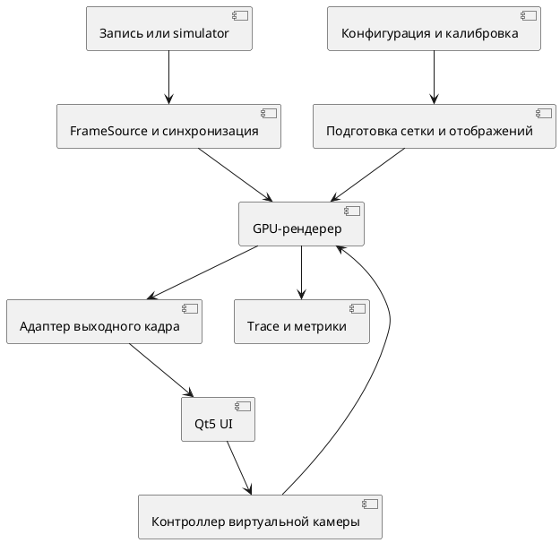

# Анализ документов и план магистерской работы по интерактивному 3D Surround View

> Исторический аудит 18.09.2026. Его приоритеты, сроки и версии API не являются действующими требованиями; см. [[research/TOPIC]] и [[architecture/DECISIONS]].

Дата анализа: 18 сентября 2026 года.

Работу целесообразно строить вокруг параметрической проекционной поверхности и интерактивного GPU-рендеринга. Приоритетная задача сейчас — определить проверяемый исследовательский результат, согласовать обязательный объём и подготовить данные для экспериментов. Разработка полного автомобильного симулятора, CAN-инфраструктуры и аппаратных адаптеров должна зависеть от того, нужны ли они для проверки основной гипотезы.

Ниже отдельно обозначены обнаруженные проблемы и предлагаемые решения. Численные пороги в рекомендациях являются исходными проектными предложениями, а не результатами измерений. Их следует уточнить на раннем прототипе и зафиксировать до итоговых сравнительных экспериментов. Исходный код, оборудование и методические требования кафедры в комплект документов не входят; выводы о готовности реализации из этого анализа не следуют.

## 1 Что уже можно сохранить

В документах правильно заложены единый конвейер для разных источников, независимость геометрии от UI и транспорта, CPU-эталон, конфигурация вместо параметров в коде, воспроизводимые записи и профилирование. Полезно сохранить отказ от одновременного освоения OpenGL и Vulkan, исключение SLAM и восстановления глубины из обязательного объёма, а также диагностику потери камер.

Сильная сторона концепции — акцент на изменении виртуального ракурса внутри одной проекционной сцены. Эту функцию нужно довести до отдельного приёмочного сценария и исследовательских измерений. Диагностические изображения и телеметрия нужны как инструменты проверки.

В восьми файлах с таблицами требований содержатся 92 строки требований: 78 MUST, 13 SHOULD и 1 COULD. Это число включает требования разных уровней и повторения, поэтому оно не равно числу независимых функций. Тем не менее почти весь предполагаемый стенд объявлен обязательным. При таком распределении приоритеты мало помогают ограничить объём.

## 2 Главные проблемы и их последствия

| Приоритет | Документ и место | Проблема | Предлагаемое изменение |
| --- | --- | --- | --- |
| P0 | Концепция, раздел 6 | GPU, bowl, конфигурация и виртуальная камера перечислены как предполагаемая новизна без точного отличия от ближайших аналогов | Выделить один исследовательский вопрос, базовый метод сравнения и измеряемый эффект |
| P0 | Концепция, раздел 9; MASTER_PLAN, раздел 1; SIMULATOR | Минимальный результат расширяется от подсистемы визуализации до распределённого автомобильного стенда | Разделить исследовательское ядро, минимальный демонстрационный стенд и дополнительные интеграции |
| P0 | SYSTEM_ARCHITECTURE, «Синхронизация»; NFR-P-002 | Монотонные часы на каждом узле не создают общую шкалу времени | Начать с одного узла; для нескольких узлов описать преобразование часов и погрешность |
| P0 | NFR-P-001 и NFR-P-002 | Не определены целевая платформа, выходное разрешение, длительность измерения и точный конец пути latency | Ввести паспорт эталонного стенда и определения метрик |
| P0 | SYSTEM_ARCHITECTURE, транспорт; CONFIGURATION, пример RGB8 | Нет расчёта пропускной способности четырёх видеопотоков | Зафиксировать формат и разрешение для каждого режима; посчитать бюджет до реализации сети |
| P0 | SYS-F-003; Концепция, задачи 4–5 | Не раскрыт алгоритм зависимости поверхности от камер | Разделить форму поверхности, UV и дискретизацию; указать, на что конкретно влияет калибровка |
| P0 | MASTER_PLAN, CPU-модель; CONFIGURATION | Нет полной математической спецификации камеры, координат и поверхности | Зафиксировать преобразования и область применимости до написания shader-кода |
| P1 | Концепция, цель и задача интерактивности | «Произвольное положение» камеры и «без повторной обработки» допускают слишком широкую трактовку | Определить допустимую область ракурсов и перечень повторно используемых ресурсов |
| P1 | SRV-G-002; SYSTEM_ARCHITECTURE, MVP | Неясно, распространяется ли запрет readback на экспорт итогового кадра в отдельный UI-процесс | Явно отделить внутренние проходы GPU от выходного адаптера и считать стоимость обоих |
| P1 | SRV-F-007; MASTER_PLAN, blending | Отсутствие дыр и швов обещается без условий покрытия и фотометрии | Ввести маски покрытия, условия нормализации и отдельные метрики геометрии и яркости |
| P1 | SYS-F-001, SYS-F-008, SIM-F-008, OPS-F-011 | Replay одновременно обязателен как режим и необязателен как функция | Сделать чтение фиксированного набора MUST; собственный recorder определить отдельно |
| P1 | NFR-M-004 и SRV-G-003 | CPU-эталон имеет разные приоритеты | Сохранить MUST для математического эталона и независимой проверки GPU |
| P1 | SRV-F-012 | Приёмка общего интерфейса адаптеров не проверяет горячую замену | Для MVP проверять смену источника между запусками; hot-swap вынести в расширение |
| P1 | UI-F-006; SYS-F-006 | Серверная телеметрия не знает фактический момент отображения UI | Добавить события со стороны UI и разделить серверную задержку, передачу и представление кадра |
| P1 | SRV-F-003; SIM-F-006–007 | Сенсоры и CAN обязательны, но их роль в алгоритме не определена | Оставить только конкретный сценарий, например выбор ракурса по задней передаче; иначе снизить приоритет |
| P1 | MASTER_PLAN, разделы 2, 17, 25; SYSTEM_ARCHITECTURE, этапы | Одновременно действуют несколько разных последовательностей реализации | Оставить один план с зависимостями, результатами и критериями завершения |
| P1 | REQUIREMENTS, «Трассируемость» | Есть правило о тестах, но нет самой матрицы соответствий | Заполнить связи «исследовательская задача — требование — компонент — проверка — результат» |
| P2 | Концепция DOCX, страницы 5–7 | Нумерация разных списков продолжается: новизна 14–17, функциональные этапы 18–24 | Перезапустить каждый смысловой список; исправить отступы после двухзначных номеров |

P0 означает риск выбора неправильной задачи или недостоверного эксперимента. P1 — риск реализации и приёмки. P2 — редакционную проблему.

## 3 Как усилить исследовательскую постановку

### 3.1 Почему текущей формулировки новизны недостаточно

В документе Texas Instruments 2015 года уже описаны bowl-поверхность, GPU-рендеринг, динамически меняемый виртуальный ракурс и предварительное вычисление таблиц отображения и смешивания. Следовательно, перечисление этих признаков само по себе не обосновывает научную новизну. Это вывод из сопоставления концепции с конкретным аналогом, а не полный обзор всех публикаций. [Texas Instruments, Surround view camera system for ADAS, страницы 9–13](https://www.ti.com/lit/wp/spry270a/spry270a.pdf).

В официальной реализации TI также отдельно представлены построение LUT и обработка кадров; параметры bowl и ракурсы настраиваются. Значит, конфигурируемость и разделение предварительных и покадровых вычислений тоже нужно сравнивать с существующими решениями. [TI Vision Apps, 3D Surround View Application](https://software-dl.ti.com/jacinto7/esd/processor-sdk-rtos-j721s2/latest/exports/docs/vision_apps/docs/user_guide/group_apps_srv_demos_app_srv_camera.html).

Тему можно сохранить. Для магистерской работы следует точнее определить собственный результат внутри этой темы. Требования кафедры к исследовательскому вкладу нужно обсудить с руководителем на основе конкретной гипотезы и сравнительного эксперимента.

### 3.2 Какой результат я бы выбрал

Основной исследовательский вопрос: как выбирать дискретизацию параметрической bowl-поверхности для заданного расположения физических камер и диапазона виртуальных ракурсов, чтобы ограничивать ошибку отображения при заданном бюджете GPU-времени?

Практически выполнимый вариант — статическое построение сетки с учётом ошибки проекции. Параметры формы bowl задаются конфигурацией, а плотность сетки определяется тем, насколько хорошо кусочно-линейная геометрия и интерполированные UV приближают аналитическую поверхность и точную модель камеры. Такая сетка строится при подготовке конфигурации. Она не требует восстановления глубины, динамического изменения формы по видео или нейросети.

Это направление для исследования, а не уже установленная новизна: адаптивная дискретизация известна в компьютерной графике. Перед заявлением собственного метода необходимо проверить близкие работы именно по Surround View и показать, чем выбранный критерий, ограничения или процедура отличаются от них. Если отличия не подтверждаются, результат корректно оформляется как сравнительное исследование и инженерная реализация с количественными выводами.

Проверяемая гипотеза: при одинаковом пределе ошибки проекции сетка, учитывающая конфигурацию камер, может требовать меньше треугольников или меньше GPU-времени, чем равномерная сетка. Эффект нужно измерить на нескольких конфигурациях. Если выигрыш отсутствует, это тоже результат; нельзя заранее подменять проверку обещанием ускорения.

### 3.3 Предлагаемая редакция основных формулировок

**Тема.** Разработка и исследование GPU-ускоренной подсистемы интерактивного трёхмерного кругового обзора автомобиля на основе параметрической проекционной поверхности.

**Цель.** Разработать подсистему интерактивной визуализации кругового обзора по изображениям четырёх fisheye-камер и экспериментально определить влияние формы и дискретизации проекционной поверхности на точность отображения, время рендеринга и задержку изменения виртуального ракурса на выбранной вычислительной платформе.

**Объект.** Процесс формирования интерактивного визуального представления окружения автомобиля по данным многокамерной системы.

**Предмет.** Параметрические модели проекционной поверхности, способы её дискретизации и GPU-отображения изображений камер, влияющие на геометрическую точность и быстродействие интерактивного кругового обзора.

**Предполагаемый вклад.** Методика выбора дискретизации поверхности по заданному пределу ошибки проекции, её реализация и экспериментальная оценка по отношению к равномерной сетке. Формулировку о собственном методе оставить предварительной до обзора аналогов и результатов.

**Практическая значимость.** Программное ядро, воспроизводимый набор экспериментов, конфигурации нескольких камерных установок и интеграция с интерфейсом отображения.

Задачи лучше сократить с 13 частично перекрывающихся пунктов до шести: анализ аналогов; математическая модель и метрики; базовый GPU-конвейер; исследуемый способ дискретизации; интерактивный стенд; сравнительные эксперименты и выводы. Детальные инженерные задачи остаются в плане реализации.

### 3.4 Что означает 3D в этой работе

Результат — изображения камер, отображённые на условную трёхмерную поверхность. Эта поверхность не является восстановленной геометрией реального окружения. Изменение ракурса не восстанавливает скрытые стороны препятствий. Вертикальные объекты могут растягиваться, смещаться и двоиться, особенно в перекрытиях.

В концепции нужно прямо определить этот смысл 3D Surround View и заменить неограниченное «произвольное положение» на «интерактивное изменение виртуального ракурса в заданной допустимой области». Для orbit задать диапазон высоты/наклона и расстояния, для pan — рабочую область, для всех режимов — запрет ухода под поверхность и внутрь модели автомобиля. Ограничения проверяются на зафиксированной траектории виртуальной камеры.

## 4 Обязательный объём и расширения

| Возможность | Рекомендуемый приоритет | Содержание минимального результата |
| --- | --- | --- |
| Четыре калиброванных источника | MUST | Фиксированный набор изображений и записанные последовательности |
| Одна fisheye-модель | MUST | Точные коэффициенты, область применимости, CPU/GPU-проверка |
| Параметрическая bowl-поверхность | MUST | Формулы, ограничения параметров, сетка и маска автомобиля |
| GPU-проекция и blending | MUST | Маски валидности, нормализация, определённое поведение при отсутствии данных |
| Orbit, zoom и пресеты | MUST | Свободная смена ракурса в допустимых пределах; pan можно отложить |
| Исследовательский эксперимент | MUST | Равномерная и исследуемая дискретизация, качество и производительность |
| Replay | MUST | Чтение набора без работающего симулятора, пауза и воспроизводимые timestamps |
| Минимальный Qt5 UI | MUST для предложенного стенда | Отображение, управление ракурсом, статус свежести |
| Отдельный server-процесс | MUST, если сохраняется выбранный формат стенда | Headless-режим и явный контракт выходного кадра |
| Лёгкий simulator/producer | MUST | Подача известного набора и воспроизводимых неисправностей |
| Собственный интерактивный 3D-мир | COULD | Развивать после готовности основного метода |
| Полная динамика автомобиля и игровые физические модели | COULD | Не нужны для проверки проекции и интерактивного ракурса |
| CAN и дополнительные сенсоры | SHOULD только при конкретном сценарии | Например, событие задней передачи; без собственного общего CAN-стека |
| Реальные камеры и автомобильный адаптер | SHOULD | Один реальный калиброванный набор очень желателен; live-интеграция зависит от доступа к оборудованию |
| DMA-BUF и устранение выходного readback | SHOULD | Переход по измеренному узкому месту и возможностям платформы |
| Hot-swap, горячая калибровка, Vulkan | COULD | Не включать в обязательную приёмку |

Если наличие двух физических компьютеров, Qt5, CAN или конкретного головного устройства является внешним условием задания, эти пункты сохраняют обязательность. Тогда следует уменьшить другие части стенда и выделить отдельный бюджет на интеграцию. В предоставленных документах нет привязки этих ограничений к конкретному внешнему заказчику или оборудованию.

## 5 Архитектура, которую я бы принял

### 5.1 Общее ядро и приложения

Сохранить модуль `sv-core`, не зависящий от Qt и сетевого транспорта. Он включает математические модели, геометрию, подготовку отображений и рендерер. Основной host — `sv-server`. Дополнительный небольшой `sv-bench` запускает то же ядро на локальных данных для измерений. `sv-ui` отображает результат и передаёт управление. `sv-simulator` сначала является простым поставщиком данных.

Общий `FrameSource` возвращает кадры и метаданные. Реализации для файла, сети и оборудования преобразуют внешние форматы в этот контракт. Наличие интерфейса не требует немедленной реализации всех адаптеров.

Приложения разделены процессами, а исследовательская логика реализована один раз. Модуль `sv-bench` не заменяет проверку полной цепочки server–UI: он позволяет отдельно измерить свойства метода без смешивания их с сетевыми задержками.

### 5.2 Предварительные вычисления и обработка кадра

При загрузке конфигурации: валидация, построение аналитической поверхности и сетки, расчёт геометрических масок, подготовка UV/весов или иных таблиц, создание GPU-ресурсов. Пересчёт выполняется при смене калибровки или параметров поверхности.

При поступлении кадров: подбор набора, загрузка либо импорт текстур, применение актуальных масок доступности камер, выборка и смешивание на GPU, рендеринг с текущей виртуальной камерой, публикация результата.

При жесте UI: меняются параметры виртуального вида. Не требуется повторно читать, декодировать или загружать неизменившиеся входные кадры, строить сетку или повторять калибровку. GPU при этом формирует новый выходной кадр. Это следует прямо написать вместо двусмысленного «без повторной обработки».

Подготовительные вычисления допустимо выполнять на CPU. Требование к GPU должно касаться интенсивного покадрового пути, а не любого вычисления UV в течение жизни приложения.

### 5.3 Первый GPU-конвейер

Сначала реализовать прямое рисование bowl с выборкой четырёх входных текстур. Для математического эталона shader может вычислять проекцию по положению фрагмента; для исследуемого варианта — использовать подготовленные координаты и интерполяцию по сетке. Сравнение этих вариантов должно учитывать разницу в точности и объёме работы.

Отдельную стадию построения текстурного атласа bowl вводить только при измеримой пользе: например, если виртуальный ракурс обновляется существенно чаще входных изображений или одновременно требуются несколько видов. Атлас добавляет память, проход и собственную ошибку дискретизации. Его не нужно делать второй обязательной исследовательской задачей.

Для поиска выигрыша от сетки важно измерять действительно зависящий от неё путь. Если GPU-траты определяются преимущественно фрагментным shader и выходным разрешением, уменьшение количества вершин может почти не ускорить рендеринг.

### 5.4 Стек и запуск без окна

Оставить C++20, CMake и один графический API. На этапе проверки платформы выбрать конкретный профиль OpenGL или OpenGL ES. Требование OpenGL 4.5+ в MASTER_PLAN не следует считать автоматически выполнимым для ещё не названного головного устройства. В документах убрать перечень равноправных вариантов «C++20/23», «OpenGL/Vulkan», «SDL3/Qt» и зафиксировать одно принятое решение.

Qt5 сохранить, если это условие целевой среды; не добавлять миграцию UI в исследовательский объём. Вне UI ядро не должно использовать Qt.

Отсутствие Qt Widgets не доказывает работоспособность без графической сессии. Для server нужен проверенный способ получить EGL display/context и рисовать в FBO на конкретном GPU. Возможность не привязывать контекст к оконной поверхности описывается EGL, но поддержка платформенного backend и доступ к устройству должны проверяться отдельно. [Khronos, EGL_KHR_surfaceless_context](https://registry.khronos.org/EGL/extensions/KHR/EGL_KHR_surfaceless_context.txt).

В первую проверку стенда включить запуск без DISPLAY/Wayland-сессии, создание FBO, загрузку изображения, рендеринг и корректное завершение. systemd-unit оформлять после этой проверки.

### 5.5 Передача готового кадра

На первом сквозном прототипе допустим явный readback итогового FBO и передача через ограниченный локальный IPC-буфер. Между внутренними GPU-проходами full-frame readback запрещён. Расходы итогового копирования и загрузки изображения в UI включаются в полный бюджет и публикуются в эксперименте.

Если измерения требуют GPU-обмена между процессами, выбирать поддержанный платформой путь с экспортом/импортом буфера. Числовой ID OpenGL-текстуры не является достаточным межпроцессным контрактом. Для DMA-BUF требуется описать дескрипторы, формат, плоскости, strides/offsets, применимые modifiers, синхронизацию и возврат буфера владельцу. Импорт Linux DMA-BUF в EGLImage предусмотрен отдельным расширением. [Khronos, EGL_EXT_image_dma_buf_import](https://registry.khronos.org/EGL/extensions/EXT/EGL_EXT_image_dma_buf_import.txt).

### 5.6 Очереди и владение ресурсами

Для каждой камеры использовать ограниченную очередь, например 2–3 кадра в начальном профиле. При перегрузке отбрасывать устаревающие данные по явной политике, сохраняя номера и причины потерь. Глубина очереди является настраиваемым ограничением, а не способом скрыть недостаток производительности.

Поток рендеринга владеет GPU-контекстом. Сетевой ввод, запись и логи не блокируют его. Для CPU/GPU-буферов определить состояния «свободен — записывается — готов — используется» и правило повторного использования только после завершения потребителя. Для UI-команд нужен отдельный канал; абсолютные состояния можно заменять последним, а накопительные orbit-delta объединять с сохранением суммы.

## 6 Математика, калибровка и качество изображения

### 6.1 Координатные соглашения

Создать `COORDINATE_SYSTEMS.md`. Рекомендуемая исходная конвенция: автомобиль — X вперёд, Y влево, Z вверх; камера — X вправо, Y вниз, Z вперёд. Зафиксировать правую систему, метры и радианы, начало координат, формат ориентации, порядок умножений, расположение начала изображения и преобразование к системе виртуальной камеры OpenGL.

Запись `T_camera_from_vehicle` должна однозначно обозначать преобразование точки из системы автомобиля в систему физической камеры. Если в конфигурации хранится pose камеры в системе автомобиля, его необходимо инвертировать. Просто назвать поле `pose` и указать RPY недостаточно: нужны порядок вращений и оси, вокруг которых они выполняются.

### 6.2 Модель камеры

Для MVP выбрать точно названную модель, например `opencv_fisheye`, с fx, fy, cx, cy, k1–k4 и явно определённым skew. Зафиксировать разрешение, при котором получена калибровка, правила масштабирования/обрезки изображения и допустимую область направлений лучей. Общего значения `model: fisheye` недостаточно. Математические формулы и функции проекции есть в официальной документации OpenCV. [OpenCV, Fisheye camera model](https://docs.opencv.org/4.x/db/d58/group__calib3d__fisheye.html).

В MASTER_PLAN фразы «выполнить проекцию» и затем «применить дисторсию» требуют уточнения: в выбранной модели нужно определить точную последовательность от 3D-точки к нормализованным координатам, искажению и пикселю. Нельзя добавлять коэффициенты дисторсии к уже вычисленным пиксельным координатам произвольным способом.

Отдельно проверить направление оптической оси, центральный луч, границу поля зрения и вырожденные точки. Не переносить проверки вида Z > 0 на любую fisheye-модель без определения её угловой области применимости. Для выбранного OpenCV-совместимого MVP можно явно ограничить используемые направления передней полусферой и исключить граничные сингулярности.

Калибровка является входным условием метода. В наборе данных должны быть её происхождение, разрешение, соглашения, остаточная ошибка и отдельные проверочные наблюдения. Собственный универсальный калибровщик не нужен в обязательном объёме, но процедура получения и проверки используемой калибровки необходима.

### 6.3 Поверхность и роль камер

Описать аналитическую поверхность S(u, v; θ), её область определения, параметры плоской зоны, перехода, высоты и габаритов. Минимальные проверки: конечные координаты, допустимые индексы, отсутствие самопересечений в разрешённом диапазоне, непрерывность стыков и корректная ориентация треугольников.

В текущих требованиях смешаны три зависимости:

1. Размеры автомобиля определяют масштабы поверхности и область маски автомобиля.
2. Положение и калибровка камер определяют проекцию точек поверхности, покрытие и веса.
3. Камеры могут определять плотность/распределение сетки через критерий ошибки.

Изменение extrinsics само по себе не обязано менять аналитическую форму bowl. Если заявляется именно автоматический выбор формы по камерам, понадобится отдельная целевая функция и процедура выбора параметров. Для предложенного объёма достаточно явно заявить конфигурируемую форму и дискретизацию, учитывающую проекцию камер.

### 6.4 Как реализовать исследуемую дискретизацию

Начать с крупной согласованной сетки. Для каждой ячейки проверить промежуточные точки на аналитической поверхности и сравнить точные координаты проекции с интерполированными по треугольнику. Проверять только те камеры, у которых точка валидна; переходы через границу валидности обрабатывать отдельно. Дополнительно измерить экранную ошибку аппроксимации поверхности на заранее заданном наборе виртуальных ракурсов.

Если ошибка превышает допуск, подразделить ячейку с обеспечением согласованных рёбер, чтобы не возникали трещины и T-стыки. Ограничить глубину и общее число треугольников. Если оба ограничения одновременно невыполнимы, выдавать диагностируемое нарушение бюджета. Проверка в нескольких точках является численной оценкой, а не математическим доказательством глобальной верхней границы ошибки.

Построенную сетку сравнить с равномерными сетками разной плотности. Исследуемый эффект: число треугольников, память, время подготовки, GPU-время и фактически измеренная ошибка. Для другой GPU-архитектуры преимущество может измениться.

### 6.5 Blending и непокрытые области

Смешивание определять только по валидным источникам. Если сумма ненормированных весов W больше ε, нормированные веса должны давать сумму 1 в заданном численном допуске. При W ≤ ε выводить маску «нет данных». Деление на ноль или подстановка произвольного цвета без статуса недопустимы.

Критерий «нет чёрных дыр» заменить долей покрытия заданной ROI вне маски автомобиля и фона. Непокрытые области из-за размещения камер физически возможны; алгоритм смешивания не создаёт отсутствующие наблюдения. Проекция внутри границ изображения также не гарантирует отсутствие перекрытия кузовом: для этого нужны определённые маски.

Зафиксировать RGB/BGR, transfer function, цветовое пространство, а для YUV — матрицу и диапазон. В начальном наборе удобно иметь заранее согласованную экспозицию и цвет. Feathering сглаживает переход, но не гарантирует устранение разницы экспозиций, параллакса или двоения движущихся объектов. Статические коэффициенты яркости можно добавить как SHOULD; сложную динамическую фотометрию не включать без необходимости.

## 7 Протокол, время и replay

### 7.1 Пропускная способность

Для четырёх несжатых потоков 1280×720 RGB8 при 30 FPS расчёт полезных данных даёт:

`4 × 1280 × 720 × 3 × 30 = 331 776 000 байт/с ≈ 331,8 МБ/с ≈ 2,65 Гбит/с`.

Это ещё без заголовков и накладных расходов. Если связь между ноутбуком и сервером — 1 Гбит/с, такой режим не поместится. Даже переход к NV12 8 бит 4:2:0 оставляет около 1,33 Гбит/с. Замена TCP на ZeroMQ не устраняет недостаток полосы.

Для первого исследования использовать локальный replay в полном разрешении. Для двух узлов зафиксировать отдельный профиль: пониженное разрешение, достаточная полоса либо выбранный кодек с измеренной стоимостью кодирования и декодирования. Например, четыре RGB-потока 640×360×30 требуют около 0,664 Гбит/с полезных данных; это только оценка для планирования, пригодность реального канала нужно проверить. Результаты разных профилей нельзя смешивать в одной строке «производительность системы».

### 7.2 Часы и конечная точка измерения

Linux CLOCK_MONOTONIC отсчитывает время относительно локального происхождения шкалы; эта шкала не является общей для разных компьютеров. Следовательно, прямое вычитание timestamps ноутбука и сервера не измеряет задержку. [Linux man-pages, clock_gettime](https://man7.org/linux/man-pages/man3/clock_gettime.3.html).

Для локального эксперимента использовать единый clock domain. Для распределённого хранить идентификатор домена и преобразование времени источника в шкалу измерения с оценкой погрешности. PTP/синхронизация системных часов могут быть частью решения, но наличие демона само по себе не доказывает точность и не превращает удалённые monotonic timestamps в непосредственно сравнимые величины. [linuxptp, phc2sys](https://www.linuxptp.org/documentation/phc2sys/).

Разделить события захвата, отправки, приёма, выбора набора, завершения GPU, получения в UI и передачи кадра на представление. Приём в UI, вызов swap и физическое появление пикселя на экране — разные точки. До внешнего измерения не называть программный timestamp точным временем физического отображения. UI должен отправлять собственные события в trace; сервер не может самостоятельно наблюдать последнюю часть пути.

Для итогового кадра сохранять идентификаторы и timestamps всех использованных входов. Возраст набора удобно определять по самому старому кадру, а рассинхронизацию — как разность максимального и минимального времени захвата. Для задержки отклика на жест нужен `command_id` и номер ревизии состояния, реально использованной при рендеринге.

### 7.3 Подбор кадров и отказ камеры

В начальном профиле задать окно рассинхронизации, например 10 мс, и максимальный возраст входа, например 100 мс. Это проектные числа, которые требуется соотнести с частотой и особенностями реальных источников. Для синтетического синхронного набора исходный skew должен быть известен точно.

Набор вне окна считается деградированным. Источник старше допустимого возраста исключается из смешивания, доступные веса перенормируются, непокрытая область получает маску и статус. Если выбран краткий hold-last, его предел и факт использования должны быть видны. Render loop продолжает работу и управление ракурсом. Потеря камеры не означает, что прежнее полное покрытие сохраняется.

Нужны состояния STARTING, READY, DEGRADED, NO_INPUT и ERROR с условиями переходов. `dropped` удобнее хранить счётчиком событий, а `stale` — текущим состоянием свежести. Следует определить, когда восстановленный источник снова участвует в наборе.

### 7.4 Что добавить в контракт

Помимо имеющихся version/type/source/sequence/size добавить или однозначно определить:

- `session_id` для перезапуска и повторного подключения источника;
- `clock_domain` и смысл каждого timestamp;
- версию или хэш калибровки, применяемой к кадру;
- формат изображения, stride и, для многоплоскостного формата, описание плоскостей;
- длину заголовка, порядок байтов, предельные размеры и правила чтения неполного TCP-сообщения;
- `frame_set_id` и список использованных camera sequence IDs;
- `state_revision` и `command_id` в связке состояния и выходного кадра;
- правила handshake, отклонения несовместимых версий и освобождения ресурсов;
- явно ограниченный жизненный цикл буфера или GPU-дескриптора.

Контрольные команды и видеоданные должны иметь независимые ограниченные очереди. Для MVP достаточно одной поддержанной версии протокола и явного отказа при несовместимости. Общую многолетнюю backward/forward compatibility не нужно обещать без пользователей старых версий.

Если CAN остаётся в проекте, обозначить поддержку Classical CAN или CAN FD, трактовку DLC и описание сигналов. Передача ID и байтов проверяет транспорт, но не декодирование скорости или угла руля. `yaw`, yaw rate и steering — разные величины; каждую требуется назвать, задать единицы и систему координат.

### 7.5 Replay и воспроизводимость

Разделить время сценария и текущее монотонное время воспроизведения. Старые timestamps из записи не должны автоматически превращать весь набор в stale. Replay отображает шкалу записи в текущую шкалу исполнения и сохраняет исходные значения как метаданные.

Минимальный manifest содержит данные камер и калибровку, хэши файлов, timestamps, конфигурацию поверхности, список команд виртуального ракурса, версию формата и сценарий неисправностей. Запись всех CAN-каналов не нужна, если эти данные не участвуют в проверяемом поведении.

У записи должен быть один понятный владелец и указанная граница: входные пакеты либо нормализованные принятые кадры. Это влияет на то, какие неисправности возможно воспроизвести. Готовый набор с manifest достаточен для MUST replay; собственный live-recorder можно реализовать позже.

Одинаковые seed и сценарий не гарантируют побитовую идентичность GPU-изображений на разных драйверах. Нужно определить численные допуски и сохранять версии среды. Для проверки геометрии использовать независимые аналитические случаи или сторонний эталон; один и тот же ошибочный модуль в генераторе и сервере может дать ложное совпадение.

## 8 Как переписать требования и критерии приёмки

### 8.1 Форма требования

У требования должны быть ID, приоритет, условие выполнения, наблюдаемое поведение, способ проверки и связь с задачей исследования. Обоснование и подробный тест можно хранить по ссылке, чтобы таблица оставалась читаемой.

Пример предлагаемой редакции SYS-F-003: «При загрузке валидной конфигурации система формирует аналитическую bowl-поверхность и её сеточное представление. Габариты и форма задаются параметрами поверхности и автомобиля; калибровка камер определяет проекционные отображения и используется выбранным методом дискретизации. Изменение поддерживаемой конфигурации не требует изменения исходного кода».

Пример предлагаемой редакции NFR-P-004: «При изменении только виртуальной камеры система использует уже подготовленные геометрию, калибровку и входные GPU-текстуры. В отсутствие новых входных кадров число операций декодирования, загрузки текстур и перестроения сетки не увеличивается. Формирование нового выходного изображения выполняется GPU-рендерингом».

Пример предлагаемой редакции SRV-G-002: «Между внутренними проходами обработки изображений не выполняется обязательное чтение полного кадра в CPU-память. Выходной копируемый адаптер MVP допускает readback итогового изображения; его объём и время измеряются отдельно и включаются в сквозную задержку».

Формулировку REQUIREMENTS «реализация, тест или измерительный протокол» заменить на «реализованное поведение и подходящее свидетельство выполнения: тест, инспекция или измерительный протокол». Наличие файла теста само по себе не означает выполнения требования.

### 8.2 Предлагаемый начальный профиль

Эталонный профиль: локальный replay четырёх потоков 1280×720, RGB8, номинально 30 FPS; выход 1280×720; конкретный CPU/GPU, драйвер, ОС, режим сборки и дискретизация поверхности. Эти разрешения предложены как отправная точка и не являются подтверждёнными возможностями неизвестного оборудования.

Сетевой профиль задаётся отдельно после проверки доступной полосы. Финальные пороги утверждаются по раннему техническому baseline, до сравнительной оценки исследуемого метода.

| Предлагаемый ID | Приоритет | Требование и исходный критерий | Проверка |
| --- | --- | --- | --- |
| RES-F-001 | MUST | Один и тот же бинарный файл работает с тремя различными конфигурациями автомобиля/камер | Конфигурации, хэши бинарного файла и результаты валидации |
| RES-Q-001 | MUST | GPU-проекция соответствует независимому CPU-эталону; начальный допуск p99 ошибки UV не более 0,1 пикселя в определённой области валидности | T-SRV-006, контрольные точки, максимальная ошибка публикуется отдельно |
| RES-Q-002 | MUST | Ошибка дискретизации измеряется отдельно от калибровки и модели сцены; стартовый целевой p99 не более 0,5 пикселя в координатах входного изображения | E-MESH-01 на точках, не использованных при построении |
| RES-Q-003 | MUST | Для физически покрываемой контрольной конфигурации валидно не менее 99% заранее заданной ROI; непокрытые области явно отмечены | Маска покрытия, площадь ROI, heatmap; ROI не подгоняется после результата |
| RES-Q-004 | MUST | Для W > ε нормированные веса дают сумму 1 с допуском 10⁻⁵; при W ≤ ε результат имеет статус «нет данных» | T-SRV-007, включая отключение каждой камеры |
| RES-P-001 | MUST | Целевой темп — 30 обновлений набора в секунду на эталонном стенде; доля пропущенных входных наборов в 10-минутном стабильном прогоне не более 1% | Раздельные счётчики input, accepted sets, rendered и представленных уникальных наборов |
| RES-P-002 | MUST | Измеряются p50/p95/p99 времени GPU и интервалов кадров; начальный бюджет p95 GPU-рендера не более 20 мс | Неблокирующие GPU timer queries и trace |
| RES-P-003 | MUST | В локальном профиле измеряется путь от времени выпуска replay-кадра до передачи результата на представление UI; исходная цель p95 не более 100 мс | T-SYS-006, точное описание программной конечной точки |
| RES-I-001 | MUST | При замороженных входных текстурах 500 команд изменения ракурса создают новые виды без новых декодирований, upload и mesh rebuild | T-UI-004, счётчики ресурсов и `state_revision` |
| RES-I-002 | MUST | Отклик на команду измеряется от события UI до первого переданного на представление кадра с соответствующей ревизией; исходная цель p95 не более 100 мс | Связка `command_id`, `state_revision`, `rendered_frame` |
| RES-T-001 | MUST | Для каждого результата известны возраст старейшего входа и skew набора; нарушение окна явно помечается | Контролируемые сдвиги 0, 10, 30 и 100 мс |
| RES-R-001 | MUST | Кадр старше принятого лимита, исходно 100 мс, исключается или явно отображается в ограниченном hold-last; рендеринг не зависает | Fault injection для каждой камеры и проверки непокрытых областей |
| RES-R-002 | MUST | Очереди и буферы имеют фиксированные пределы; перегрузка не создаёт неограниченного накопления | Десятиминутный прогон с более быстрым producer, счётчики потерь и глубины |
| RES-V-001 | MUST | Набор данных воспроизводится без simulator-процесса; сохраняются исходные timestamps и действующее отображение времени replay | T-OPS-011, пауза, пошаговый режим и повтор запуска |
| RES-V-002 | MUST | Для эксперимента сохраняются commit, эффективная конфигурация, версии, калибровка и хэши данных | Проверка manifest и повтор одного опыта |

ID RES-* предназначены для обсуждения предлагаемой редакции. После согласования их нужно распределить по существующим файлам и убрать дублирование, а не просто добавить ещё 15 обязательных строк к текущим 78.

Предел 20 мс для GPU не означает предел 20 мс для полной системы. Путь в UI включает ожидание набора, передачи и синхронизацию отображения. Цель 100 мс является инженерным предложением для исследовательского стенда; она не получена из требований конкретного автомобиля.

### 8.3 Начальная матрица трассируемости

| Задача | Основное требование | Компонент | Свидетельство |
| --- | --- | --- | --- |
| Корректная проекция | SRV-F-006, RES-Q-001 | calibration, projection | T-SRV-006, таблица ошибок и контрольные изображения |
| Параметрическая поверхность | SYS-F-003, RES-F-001 | geometry | Три конфигурации, wireframe, проверка смены параметров |
| Исследование дискретизации | RES-Q-002 | geometry, renderer | E-MESH-01, ошибка — треугольники — время |
| Интерактивная визуализация | NFR-P-004, RES-I-001–002 | camera controller, UI, renderer | Замороженные входы и trace команд |
| Работа при пропусках | SYS-F-007, RES-R-001–002 | synchronizer, health | Fault injection и переходы состояний |
| Производительность | NFR-P-001–003 | весь тракт | E-PERF-01 и раздельные измерения ядра и стенда |
| Воспроизводимость | SYS-F-008 в редакции MUST | replay, config | Manifest и повтор эксперимента |

## 9 Программа экспериментов

### 9.1 Наборы данных

Подготовить минимум три типа материала. Первый — простые аналитические сцены с сеткой, известными точками и предсказуемыми преобразованиями для проверки математики. Второй — сцены с вертикальными объектами, перекрытиями и движением для проверки ограничений модели. Третий — хотя бы одна реальная калиброванная запись, если она доступна.

Если реальных данных нет, синтетический стенд всё равно позволяет исследовать проекцию, дискретизацию и производительность. Выводы тогда необходимо ограничить синтетическими сценами; перенос качества на реальную автомобильную установку останется непроверенным.

Для настройки метода выделить конфигурации разработки. Для итоговой оценки использовать дополнительные конфигурации и ракурсы, не использованные при выборе порогов. Записать источник, разрешение, калибровку, лицензию или условия использования набора и checksum.

### 9.2 Базовые варианты для сравнения

| Вариант | Назначение | Что должно совпадать с исследуемым методом |
| --- | --- | --- |
| Плоская поверхность | Показать влияние геометрической модели и ограничения BEV-подхода | Изображения, калибровка, сравнимые виртуальные виды и ROI |
| Обычная bowl с равномерной сеткой | Основной инженерный baseline | Форма bowl, разрешения, blending, реализация прохода |
| Та же bowl с исследуемой дискретизацией | Проверка основной гипотезы | Все настройки, кроме способа сеточного представления |
| Плотная эталонная сетка или точная проекция | Оценка численной ошибки аппроксимации | Та же аналитическая поверхность и камера |

Форму bowl исследовать отдельным опытом с одинаково достаточной точностью сеток. Иначе улучшение от формы можно перепутать с улучшением от плотности. Сравнивать также с разумно настроенной равномерной сеткой, а не только с заведомо слишком грубым вариантом.

### 9.3 Эксперименты и критерии выводов

**E-MATH-01 — математическая корректность.** Известные точки, повороты, симметричные установки и граничные случаи. Ошибка UV в пикселях, NaN/Inf, принадлежность области валидности. Отдельно проверяются калибровочная модель, перенос её параметров и реализация на GPU.

**E-SURFACE-01 — влияние формы поверхности.** Плоская поверхность и несколько параметров bowl на одинаковых данных. Показатели: покрытие ROI, положение контрольных маркеров и двоение в перекрытии. Для синтетической сцены можно сравнить видимые контрольные объекты с независимым истинным видом из виртуальной камеры. Учитывать окклюзии и отдельно показывать наземные и вертикальные объекты: bowl не обязана быть лучше плоскости для каждой метрики и сцены.

**E-MESH-01 — основной исследовательский эксперимент.** Равномерная и предлагаемая сетка при одинаковом допуске ошибки либо одинаковом числе треугольников. Публикуются p50/p95/p99 и максимум ошибки, количество треугольников, память, время подготовки и GPU-время. Контрольные точки для оценки не должны совпадать только с точками, по которым принималось решение о подразделении. Самый полезный результат — зависимость ошибки от стоимости представления и рендеринга.

**E-INTERACTIVE-01 — смена ракурса.** Один фиксированный набор входных изображений и повторяемая траектория orbit/zoom. Проверяется, что проекция остаётся корректной в объявленной области, новые ракурсы действительно формируются на сервере и неизменные входы не декодируются и не загружаются повторно. Измеряются frame time и задержка команд. Затем опыт повторяется на движущихся входных данных.

**E-PERF-01 — масштабирование.** Три разрешения входа, например 640×360, 1280×720 и 1920×1080, и три уровня равномерной сетки при фиксированном выходном разрешении. Отдельный небольшой опыт меняет разрешение выхода: нагрузка фрагментного shader может зависеть от него сильнее, чем от сетки. Сначала измерить ядро на локальном replay, затем полный путь до UI. Сетевой сценарий исследуется отдельно с его допустимым форматом данных.

**E-ROBUST-01 — чувствительность.** По очереди вносить известные сдвиги времени, пропуски и ошибки extrinsics. Пример исследовательских возмущений: поворот ±1° и ±2°, смещение камеры на 2 и 5 см; skew 0/10/30/100 мс; потери 0/1/5%. Эти значения — контролируемые тестовые воздействия, а не заявленная статистика реальных камер. Измерять не только FPS, но и ухудшение качества/покрытия и время обнаружения деградации.

**E-REAL-01 — перенос на запись.** Проверить одну независимую реальную калибровку и явно перечислить отличия от синтетики: экспозиция, дисторсия, рассинхронизация, неточная поза. Этот опыт желателен для практической убедительности и не требует сразу подключать четыре live-камеры.

### 9.4 Методика измерений

Для исходного performance sweep использовать прогрев, например 60 секунд, и не менее трёх отдельных прогонов по 180 секунд. Для выбранного эталонного режима выполнить отдельный десятиминутный устойчивый прогон. Сохранять частоты/энергетический режим и температуру, если это доступно, чтобы изменение частоты GPU не выглядело свойством алгоритма.

CPU submission time и GPU execution time измерять отдельно. Получение GPU timer query должно быть асинхронным; постоянный принудительный `glFinish` способен изменить сам измеряемый конвейер. Для сквозной задержки фиксировать конкретные события и источник времени.

Среднего FPS недостаточно. Нужны распределения времени кадра и задержки, максимальные паузы, доля повторённых/пропущенных наборов и причины потерь. Для сравнения использовать одинаковые сцены, траектории и настройки; показывать разброс между прогонами. Соседние кадры одного прогона не считать независимыми экспериментальными повторениями.

Медленный CPU-эталон предназначен для проверки правильности. Его нельзя использовать как единственное основание заявления о превосходстве GPU над CPU вообще. Для такого вывода нужен сопоставимый CPU-алгоритм, одинаковый объём работы и отдельное описание оптимизаций.

## 10 Что изменить в каждом документе

| Документ | Сохранить | Изменить или убрать | Добавить |
| --- | --- | --- | --- |
| Концепция DOCX | Тему, интерактивный ракурс, параметрическую поверхность, границы | Четыре общих заявления о новизне; дублирующие задачи; прошедшее время для ещё не полученных результатов | Проблему, гипотезу, ближайший аналог, базовое сравнение, ограничения 3D-модели и ожидаемые показатели |
| REQUIREMENTS.md | ID, приоритеты, разделение объектов | Hardware из безусловного MUST; противоречивый replay; дублирующие обязательства | Профили исследовательского ядра и стенда, определения терминов, заполненную трассируемость |
| SYSTEM_ARCHITECTURE.md | Общий pipeline, тонкий UI, adapters | Дублированный план разработки; открытый выбор сразу нескольких транспортов | Границы CPU/GPU, потоки исполнения, владение буферами, такты обновления, выходной адаптер, состояния |
| MASTER_PLAN.md | Этапы CPU → GPU → четыре камеры; контрольные точки | Конкурирующие планы разделов 17 и 25; позднее появление проверочных данных и измерений | Один календарный план, ранний тест платформы, экспериментальную ветку, зависимости и резерв |
| SERVER.md | Владение GPU и состоянием виртуальной камеры | Hot-swap до доказанной необходимости; абсолютное обещание отсутствия дыр | Структуру набора кадров, критерии готовности, политику деградации и границу readback |
| UI.md | Отображение, жесты, статус | Неограниченный pan и неопределённый «последний валидный кадр» | Допустимую область камеры, stale-overlay, события представления и связь кадра с командой |
| SIMULATOR.md | Воспроизводимые кадры, маркеры, fault injection | Обязательный интерактивный мир, полную динамику и CAN без сценария | Режим простого producer, источник эталонной геометрии и независимую проверку |
| PROTOCOL.md | Версии, ограничения размеров, идентификаторы | Неопределённый timestamp и общий handle; необходимость широкой совместимости в MVP | Session/clock/calibration ID, stride, frame set, handshake, framing и жизненный цикл буфера |
| CONFIGURATION.md | Schema, предварительную валидацию, единицы | Пустые intrinsics/distortion как единственный образец; неопределённый pose | Полный валидный пример, допустимые диапазоны, ROI, правила resize и эффективную конфигурацию |
| NFR.md | Метрики, воспроизводимость, переносимость | SHOULD для CPU-эталона; «ограниченный jitter» без определения | Паспорт платформы, выходное разрешение, percentiles, длительность прогонов и границы latency |
| OPS.md | Коды завершения, metadata опыта, foreground, аккуратное завершение | Безусловный аппаратный режим при отсутствии оборудования; повтор общих требований | Проверку headless GPU, реальные команды запуска и единый сбор результатов |

Число поддерживаемых камер для MVP зафиксировать как четыре, а отсутствие одной считать отказом. Универсальная поддержка произвольного количества камер не требуется для доказательства конфигурируемости автомобиля. Габариты, калибровки и параметры поверхности при этом действительно остаются в конфигурации.

Новые документы ограничить тремя: `COORDINATE_SYSTEMS.md` с математическими соглашениями, `RESEARCH_PLAN.md` с гипотезой и экспериментами, `VALIDATION.md` с наборами, трассируемостью и протоколами приёмки. Небольшие архитектурные решения вести как ADR: платформа/API, путь итогового кадра, модель времени. Форматы config/protocol дополнить машинно-проверяемыми схемами и полными примерами, когда они будут реализованы.

В REQUIREMENTS есть ссылки на `system-context.puml` и `server-sequence.puml`. Эти файлы не включены в предоставленный комплект. Нужно проверить наличие в репозитории и актуальность диаграмм; отсутствие вложений само по себе не доказывает отсутствие файлов в проекте.

## 11 План действий на 26 недель

Это ориентир при занятости около 20–25 часов в неделю и при готовности использовать существующие библиотеки. Срок защиты, доступ к оборудованию и текущий уровень реализации не заданы. Поэтому ниже фиксируются прежде всего зависимости и результаты; календарь нужно привязать к фактической нагрузке. Если основы C++ и графики ещё предстоит изучать, потребуется отдельный учебный резерв.

| Срок | Работа | Конкретный результат | Условие перехода |
| --- | --- | --- | --- |
| Недели 1–2 | Обзор ближайших аналогов, согласование гипотезы и объёма; проверка платформы | Краткая постановка, сравнительная таблица, паспорт GPU/API, первый FBO и пробная выдача кадра | Понятен предмет сравнения; headless-рендеринг и выбранный выходной путь технически возможны |
| Неделя 3 | Координаты, схема конфигурации, получение первого набора | Полная конфигурация четырёх камер, marker-сцена, manifest, план измерений | Данные читаются; положение хотя бы нескольких контрольных точек проверено независимо |
| Недели 4–5 | CPU-модель fisheye и аналитической поверхности | Проекция, валидность, тесты матриц и bowl | Предсказуемые точки и граничные случаи проходят; нет неоднозначных соглашений |
| Недели 6–7 | Однокамерный GPU-рендерер и виртуальная камера | Изображение камеры на поверхности, orbit/zoom, первые GPU-timings | GPU соответствует эталону; смена вида не перестраивает неизменную геометрию |
| Недели 8–9 | Четыре камеры, маски, blending и replay | Рабочий обычный bowl-baseline на записи | Зафиксированы покрытия, артефакты и производительность; есть видео демонстрации |
| Недели 10–12 | Исследуемая дискретизация | Алгоритм, конфигурации, сравнение с равномерной сеткой | Есть измерение ошибки на независимых точках и первые кривые стоимости; при отсутствии выигрыша пересматривается гипотеза |
| Недели 13–14 | Разделение host/server и минимальный Qt5 UI | Управление ракурсом через протокол, готовый кадр, command/state linkage | Замороженный вход допускает последовательность ракурсов; измеряется отклик команды |
| Неделя 15 | Время, подбор кадров, границы latency | Trace полного пути, clock domains, replay-time mapping | Нет прямого вычитания несопоставимых часов; повторяемы измерения возраста и skew |
| Неделя 16 | Fault injection и ограничение ресурсов | Потеря камер, перегрузка, reconnect и корректное завершение | Ни один сценарий не приводит к бесконечному ожиданию или росту очереди |
| Недели 17–19 | Основные сравнительные эксперименты | CSV/JSON, графики, контрольные кадры, протоколы запусков | Все заявленные выводы подкреплены повторяемыми измерениями и ограничениями |
| Недели 20–22 | Сборка текста, таблиц и демонстрации | Главы диссертации, сопоставление с аналогами, пакет воспроизведения | Заключение отвечает цели и гипотезе; нет заявленных без доказательств улучшений |
| Недели 23–26 | Резерв и замечания руководителя | Стабильная версия, финальный текст, сценарий защиты | Запуск воспроизводится; собраны обязательные свидетельства приёмки |

Текст пишется с первой недели: обзор — во время чтения публикаций, математическая глава — вместе с CPU-моделью, архитектура — вместе с реализацией, результаты — сразу после каждого опыта. Последние недели предназначены для сборки и редактуры, а не первого написания всей диссертации.

Полноценный 3D-симулятор, CAN и аппаратную интеграцию начинать после готовности базового четырёхкамерного обзора и первых результатов основного эксперимента. При дефиците времени сначала сокращать эти расширения, затем число дополнительных транспортных профилей. Не сокращать независимую проверку математики, основной сравнительный эксперимент и описание ограничений.

### 11.1 Первые десять рабочих дней

1. Зафиксировать на одной странице цель, исследовательский вопрос, обязательные функции и исключения.
2. Проверить ближайший аналог TI и подобрать научные работы по проекционным поверхностям и дискретизации; вести таблицу различий, а не список названий.
3. Уточнить оборудование: CPU/GPU, ОС, графический API, экран, сеть, доступные записи и необходимость именно Qt5/двух узлов.
4. Проверить создание графического контекста без UI, FBO, получение тайминга и простую передачу результата в окно UI.
5. Описать оси и преобразование `vehicle → physical camera → image`, проверить несколько точек вручную.
6. Подготовить полный файл конфигурации четырёх камер и его валидацию.
7. Получить небольшой набор изображений с калибровкой и контрольными точками; сохранить manifest.
8. Создать каркас CMake для core, тестов и benchmark-host без большого симулятора.
9. Реализовать одну CPU-проекцию и проверку её совпадения с независимым эталоном.
10. Обновить требования и общий план по результатам проверки: выбранная платформа, формат кадров, гипотеза, риски и даты контрольных точек.

### 11.2 Правила остановки расширений

Если к концу недели 5 нет достоверной проекции, остановить сетевые и UI-доработки до исправления математики. Если к концу недели 9 нет четырёхкамерного baseline, не добавлять CAN и динамический мир. Если к концу недели 12 нет измеримого отличия исследуемого метода, провести разбор причин с руководителем и сузить заявляемый вклад. Это полезнее, чем компенсировать отсутствие результата дополнительными функциями стенда.

## 12 Оформление концепции и технических документов

### 12.1 Замечания к проверенному DOCX

Концепция отрисована и просмотрена на всех семи страницах. Явного обрезания текста или наложения элементов не обнаружено. При этом есть конкретные редакционные проблемы:

- В разделе новизны список начинается с 14, а в функциональной последовательности — с 18. Разделы используют продолжающуюся нумерацию предыдущего списка. Каждый самостоятельный список нужно начать заново либо сделать маркированным.
- У двухзначных номеров текст визуально прилегает к точке: «14.Разработан», «18.Получение». Исправить табуляцию и висячий отступ в стиле списка.
- В разделе «Предполагаемая научная новизна» используются завершённые формулировки «Разработан» и «Сформирован». До получения результатов заменить их на описание гипотезы и планируемого вклада. Прошедшее время вернуть только для выполненного и проверенного.
- Длинные абзацы с выравниванием по ширине дают заметные пробелы между словами. Применить единые настройки переносов и абзацев в рамках шаблона кафедры; у списков и технических фрагментов отдельно проверить ширину строки.
- Тема повторяется на титульной странице и большим блоком в разделе 2. В рабочей концепции можно сократить повтор и освободить место для проблемы, гипотезы и критериев успеха.
- Цвет заголовков, формат страницы, шрифт, поля и нумерацию привести к методическим требованиям конкретного вуза. Без этих требований нельзя объявлять наблюдаемое оформление нарушением обязательного стандарта.

### 12.2 Содержательная структура концепции

Рекомендуемая последовательность: проблема и ограничения известных решений; тема; цель; объект и предмет; гипотеза; шесть задач; предполагаемый вклад и практическая значимость; метод эксперимента; обязательный результат и границы; основные источники. Технологический стек достаточно назвать один раз как принятое инженерное решение.

Фразы «реальное время», «адаптивный», «точный», «без швов», «произвольный ракурс» использовать только с определением условий. Различать параметрическую поверхность, генерируемую из конфигурации, и адаптивную поверхность, изменяемую на основании данных: это разные обязательства.

### 12.3 Структура будущей диссертации

1. Анализ задачи и близких решений, ограничения проекционного 3D Surround View, постановка исследовательского вопроса.
2. Математические модели камер и поверхности, предложенный способ дискретизации и критерии ошибки.
3. Архитектура и реализация GPU-подсистемы, интерактивная камера, данные и минимальная интеграция.
4. Экспериментальная методика, сравнение, производительность, чувствительность и ограничения результатов.

В приложения вынести полные схемы конфигурации/протокола, матрицу требований, инструкции запуска и расширенные таблицы. Раздел о симуляторе должен занимать объём, соответствующий его роли в проверке, а не вытеснять описание исследуемого метода.

В технических Markdown-файлах использовать одну терминологию: «физическая камера» и «виртуальная камера», «проекционная поверхность», «набор кадров», «возраст кадра», «сквозная задержка». Названия API, полей и компонентов оставлять на английском. У каждого файла указать назначение, статус и связанные решения; нормативное требование хранить в одном месте, а в остальных ссылаться на его ID.

## 13 Решения для ближайшего обсуждения с руководителем

На обсуждение лучше принести конкретную постановку из раздела 3 и план эксперимента, а также решить пять вопросов: допустим ли исследовательский вклад в виде метода/исследования дискретизации; какое оборудование является целевым; обязательны ли раздельные процессы и Qt5; доступны ли реальные калиброванные данные; какой крайний срок и фактическая недельная нагрузка.

До получения ответов полезная работа уже определена: проверка аналогов, фиксация координат, получение данных, CPU-проекция и ранний тест GPU. Эти результаты нужны при любом из предложенных вариантов стенда.
