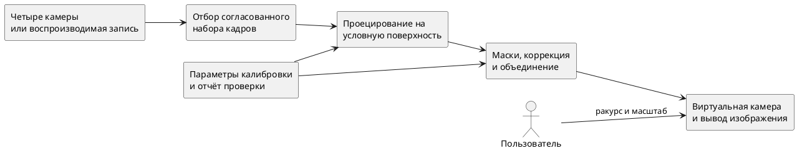
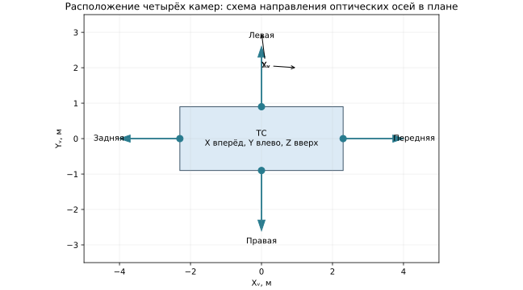
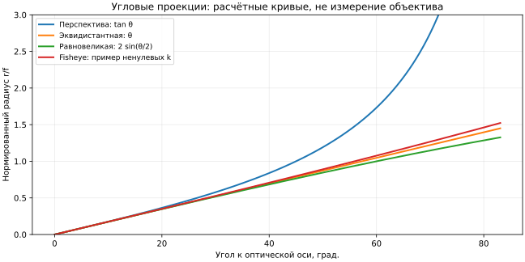
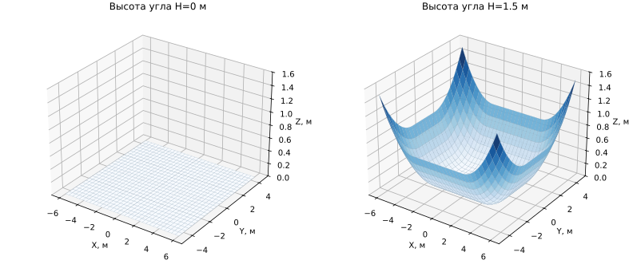
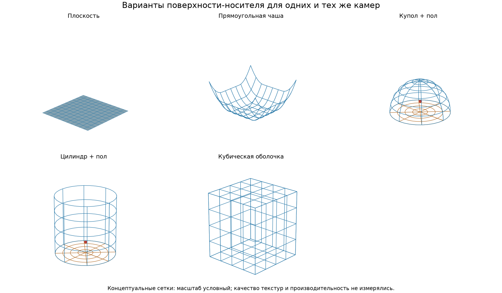
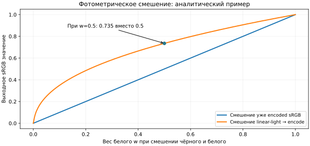
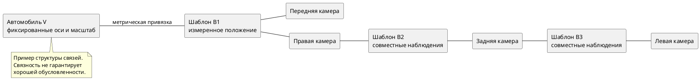
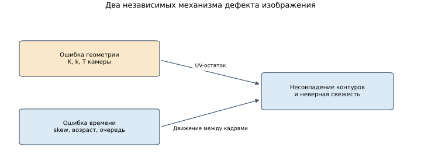
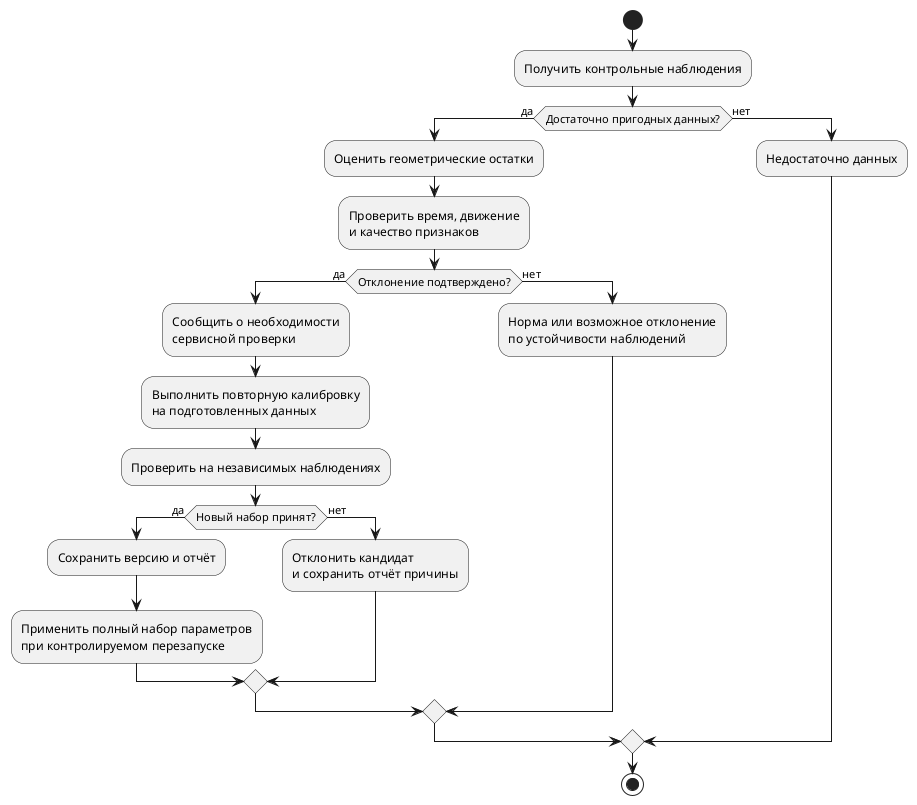

---
aliases:
  - Глава 1. Теоретические основы построения интерактивных систем кругового обзора
tags:
  - diploma
  - surround-view
  - calibration
status: draft
updated: 2026-10-04
---

# Глава 1. Теоретические основы построения интерактивных систем кругового обзора

> Рабочая редакция первой главы по теме «Исследование и разработка системы отображения и методик калибровки функции интерактивного кругового обзора ТС для ОС Аврора». Теоретические положения отделены от проектных следствий. Численные примеры являются расчётами, а не результатами испытаний разработанной системы.

Назначение главы — определить математические и технологические основания системы, объединяющей изображения четырёх широкоугольных камер транспортного средства. Рассматриваются способы отображения окружающего пространства, калибровка, причины нарушения согласованности изображений и ограничения вычислительного конвейера. Анализ должен ответить на три связанных вопроса: какое представление можно построить по имеющимся данным, какие параметры необходимо определить для его корректности и как проверить пригодность выбранного решения для ОС Аврора.

Для настоящей работы интерактивность означает изменение положения и направления виртуальной камеры, масштаба и предустановленного ракурса. Трёхмерность относится к поверхности отображения. Построение полной геометрической модели сцены, включая невидимые участки, не входит в обязательный результат. Это определение существенно для интерпретации качества: визуально объёмное представление не является метрически достоверной реконструкцией всех препятствий.

Структура соответствует [[planning/THESIS|плану диссертации]]. Постановка исследования хранится в [[research/TOPIC]], математические соглашения реализации — в [[architecture/MATHEMATICS]]. Ссылки вида [S04] ведут к внешним первоисточникам; сведения об их проверке и ограничения применимости находятся в [[references/README|едином каталоге источников]].

## 1.1 Назначение и состав систем кругового обзора транспортного средства

### 1.1.1 Назначение и типовая конфигурация

Система кругового обзора формирует согласованное представление ближнего окружения транспортного средства из изображений нескольких камер. Основной сценарий применения — наблюдение при парковке и маневрировании, когда водитель должен оценивать взаимное расположение автомобиля, дорожной разметки и препятствий. В промышленном описании Texas Instruments рассмотрена конфигурация с широкоугольными камерами и разделением обработки на геометрическое преобразование, фотометрическую коррекцию и синтез изображения. В том же источнике показан переход от плоского обзора к GPU-отображению на чашеобразную поверхность с изменяемой виртуальной точкой наблюдения [S44] (разделы «2D surround view» и «3D surround view»).

В исследуемой конфигурации четыре камеры ориентированы вперёд, назад, влево и вправо. Они имеют различные оптические центры, поэтому сцена наблюдается с параллаксом: один объект занимает разные положения относительно фона. Области перекрытия соседних камер нужны для объединения изображений и контроля взаимной геометрии. Однако наличие четырёх камер само по себе не гарантирует полного покрытия. Итоговая наблюдаемость зависит от угла обзора, высоты установки, корпуса автомобиля и масок изображения.

Состав системы целесообразно разделить по функциям. Источники передают кадры и сведения о времени их получения. Геометрический модуль сопоставляет поверхность отображения с исходными изображениями. Модуль объединения выбирает и смешивает наблюдения. Виртуальная камера определяет экранный ракурс, интерфейс принимает команды пользователя, а калибровочный модуль подготавливает параметры и отчёт об их качестве. Такая декомпозиция позволяет проверять причины дефектов по отдельности.

*Рисунок 1.1 — Функциональная схема формирования интерактивного кругового обзора. Схема составлена для настоящего исследования; она не описывает уже реализованные компоненты.*

*Рисунок 1.2 — Схема расположения четырёх камер в плане и направлений их осей. Размеры автомобиля взяты из контрольной конфигурации; это геометрическая иллюстрация, а не измеренная установка.*

### 1.1.2 Вид сверху и интерактивное представление

Вид сверху, или bird’s-eye view, отображает преимущественно дорожную плоскость. При корректной геометрии разметка и точки контакта объектов с дорогой оказываются согласованы между камерами. Такое представление удобно для контроля свободного пространства около автомобиля, поскольку экранные направления можно связать с продольной и поперечной осями транспортного средства.

Интерактивное представление допускает наклонный ракурс и вращение точки наблюдения. Плоскость при этом видна под углом, а искривлённая поверхность может показывать периферийное окружение. Появляется дополнительное ограничение: область, хорошо воспринимаемая сверху, может выглядеть растянутой или закрытой моделью автомобиля в другом ракурсе. Поэтому качество следует оценивать на наборе виртуальных положений, а не по одному удачно выбранному изображению.

Необходимо различать изменение виртуального ракурса и перемещение физических камер. Первое меняет отображение уже построенной поверхности на экран. Второе меняет связь поверхности с входными изображениями и требует проверки внешней калибровки. Смешение этих операций привело бы к ошибочному объяснению геометрических дефектов настройками пользовательского интерфейса.

### 1.1.3 Ограничения проекционного представления

Пусть наблюдаемый объект находится в точке $P$, а алгоритм переносит цвет соответствующего луча на пересечение с поверхностью $S$. Если $P\notin S$, отображаемое положение является условным. На плоскости дорожная разметка может передаваться правильно, а вертикальный столб — растягиваться. При смене виртуального ракурса изменяется вид условной поверхности, но фактическая глубина объекта из этого не возникает.

Параллакс особенно заметен около швов: соседние камеры отображают разные лучи на одну условную точку. Смешивание делает переход плавнее, но не гарантирует совпадения контуров. За объектами остаются невидимые области; они не восстанавливаются по цвету уже доступных пикселей. Эти ограничения следуют из выбранного отображения и должны учитываться при оценке проекта: не всякое двоение свидетельствует о неправильной калибровке.

### 1.1.4 Классификация ошибок

Для анализа дефектов вводятся четыре группы причин.

| Группа | Пример причины | Наблюдаемый эффект | Способ разделения причин |
|---|---|---|---|
| Геометрия камеры и установки | Ошибка модели объектива, поворота или положения камеры | Смещение соответствующих точек, искривление разметки | Проверочные точки и остатки репроекции |
| Представление сцены | Высокий объект не лежит на выбранной поверхности | Растяжение и параллакс даже при верных параметрах | Сцены с известной высотой объектов |
| Время | Разные моменты экспозиции, очереди и пропуски | Расхождение движущихся объектов | Временные метки и контролируемый временной сдвиг |
| Фотометрия | Разная экспозиция, баланс белого, блики | Полосы яркости и цвета у швов | Сравнение статичных перекрытий при неизменной геометрии |

Для проекта из этой классификации следует порядок проверки: сначала подтвердить модель на известных неподвижных точках, затем исключить рассинхронизацию, после этого оценивать фотометрическую согласованность и ограничения поверхности. Попытка исправить все эффекты одним коэффициентом смешивания скрывает причину, но не устраняет её.

## 1.2 Математические модели широкоугольных камер

### 1.2.1 Перспективная модель и оптические искажения

В центральной модели камера связывает пространственную точку с лучом, проходящим через оптический центр. Для точки $P_C=(X_C,Y_C,Z_C)^T$, $Z_C>0$, перспективная проекция задаётся нормированными координатами $x=X_C/Z_C$, $y=Y_C/Z_C$. Без искажений координаты изображения равны

$$
\begin{pmatrix}u\\v\\1\end{pmatrix}
=K\begin{pmatrix}x\\y\\1\end{pmatrix},\qquad
K=\begin{pmatrix}f_x&s&c_x\\0&f_y&c_y\\0&0&1\end{pmatrix}.
\tag{1.1}
$$

Здесь $f_x,f_y$ выражены в пикселях, $(c_x,c_y)$ — главная точка, $s$ — скос осей. Для рассматриваемого профиля принимается $s=0$. Распространённая модель искажений дополняет перспективную проекцию радиальными и тангенциальными членами:

$$
\begin{aligned}
r^2&=x^2+y^2,\\
L(r)&=1+k_1r^2+k_2r^4+k_3r^6,\\
x_d&=xL(r)+2p_1xy+p_2(r^2+2x^2),\\
y_d&=yL(r)+p_1(r^2+2y^2)+2p_2xy.
\end{aligned}
\tag{1.2}
$$

Проекция получается подстановкой $(x_d,y_d)$ в (1.1). Формулы и примеры калибровки приведены в документации OpenCV [S03]. Коэффициенты этой модели нельзя автоматически переносить в fisheye-модель: совпадение обозначений $k_i$ не означает совпадения функций.

### 1.2.2 Угловые модели широкоугольной камеры

Для широкоугольного объектива удобнее связывать расстояние от главной точки с углом луча к оптической оси. В работе Kannala и Brandt сравниваются перспективная, стереографическая, эквидистантная, равновеликая и ортографическая проекции, после чего вводится более гибкая полиномиальная модель [S06] (раздел II-A). Идеализированные зависимости представлены в таблице 1.2.

| Проекция | Радиус изображения $\rho(\theta)$ | Свойство при приближении $\theta$ к $\pi/2$ |
|---|---|---|
| Перспективная | $f\tan\theta$ | Радиус неограниченно растёт |
| Стереографическая | $2f\tan(\theta/2)$ | Радиус остаётся конечным |
| Эквидистантная | $f\theta$ | Равным угловым приращениям соответствуют равные радиальные |
| Равновеликая | $2f\sin(\theta/2)$ | Нелинейная угловая зависимость |
| Ортографическая | $f\sin\theta$ | Радиальная чувствительность уменьшается у края полусферы |

Это модели идеальных проекций, а не паспорт конкретного объектива. Форму реального отображения необходимо оценивать по наблюдениям. Один заявленный угол обзора не определяет коэффициенты камеры и не заменяет калибровку.

Для исходного математического профиля проекта выбрана модель fisheye, описанная в OpenCV. При $a=X_C/Z_C$, $b=Y_C/Z_C$, $r=\sqrt{a^2+b^2}$, $\theta=\arctan r$ определяются

$$
\theta_d=\theta(1+k_1\theta^2+k_2\theta^4+k_3\theta^6+k_4\theta^8),
\qquad
q=\begin{cases}\theta_d/r,&r>0,\\1,&r=0,\end{cases}
\tag{1.3}
$$

$$
u=f_xaq+c_x,\qquad v=f_ybq+c_y.
\tag{1.4}
$$

Модель в источнике также допускает скос, который здесь фиксирован нулевым [S04]. Ограничение $Z_C>\varepsilon$, принятое в начальном профиле проекта, означает использование передней полусферы. Оно не является утверждением о предельном угле всех fisheye-объективов. Поддержка лучей за этой границей потребовала бы отдельно определённой модели направления и её проверки.

Из (1.3) следует проверка монотонности радиального отображения:

$$
\frac{d\theta_d}{d\theta}
=1+3k_1\theta^2+5k_2\theta^4+7k_3\theta^6+9k_4\theta^8>0.
\tag{1.5}
$$

Условие контролируется на рабочем угловом диапазоне. Если полином разворачивается, разные направления могут получить один радиус. Низкая средняя ошибка на нескольких центральных наблюдениях не исключает такого дефекта на периферии. Эта проверка является математическим следствием выбранной модели, а не сообщением о результатах калибровки проекта.

*Рисунок 1.3 — Расчётное сравнение нормированного радиуса перспективной, эквидистантной, равновеликой и полиномиальной fisheye-проекций. Коэффициенты кривой приведены в `plot_system.py`; кривые не являются измерениями конкретного объектива.*

### 1.2.3 Внешние параметры и соглашения о координатах

Внутренние параметры описывают преобразование луча в пиксель. Внешние параметры определяют положение камеры относительно автомобиля. В данной работе принимаются следующие правые системы координат.

| Система | Оси и начало | Назначение |
|---|---|---|
| Транспортное средство $V$ | $X$ вперёд, $Y$ влево, $Z$ вверх; начало в центре наземной проекции автомобиля | Общая метрическая геометрия |
| Физическая камера $C_i$ | $X$ вправо на изображении, $Y$ вниз, $Z$ вперёд вдоль оптической оси | Модель получения изображения |
| Поверхность $S$ | Параметры $(\xi,\eta)$, точка $S(\xi,\eta)$ задана в $V$ | Условное размещение наблюдаемой сцены |
| Виртуальная камера $Q$ | $X$ вправо, $Y$ вверх; видимые точки имеют отрицательное $Z$ в соглашении OpenGL | Экранный ракурс |

Векторы считаются столбцами; расстояния измеряются в метрах, углы — в радианах. Преобразование точки из автомобиля в физическую камеру записывается как

$$
P_{C_i}=R_{C_i\leftarrow V}P_V+t_{C_i\leftarrow V},
\qquad R^TR=I,\quad \det R=1.
\tag{1.6}
$$

Если центр камеры в автомобильной системе равен $C_i^V$, то $t_{C_i\leftarrow V}=-R_{C_i\leftarrow V}C_i^V$. Следовательно, вектор переноса в (1.6) не совпадает с координатами места установки. Обратное преобразование имеет вид $P_V=R^T(P_{C_i}-t)$. Проверка этих равенств на контрольных точках позволяет выявить перепутанное направление преобразования до GPU-обработки.

### 1.2.4 От точки поверхности к исходному пикселю

Последовательность преобразований задаётся композицией

$$
p_i(\xi,\eta)=\pi_i\!\left(R_iS(\xi,\eta)+t_i\right).
\tag{1.7}
$$

Функция $\pi_i$ — выбранная модель физической камеры. Именно $p_i$ указывает, откуда брать цвет входного кадра. Отдельное преобразование $P_{\mathrm{clip}}=P_QV_Q(S^T,1)^T$, где $V_Q$ — матрица вида, а $P_Q$ — матрица виртуальной проекции, определяет, куда точка попадёт на экран. Обозначения $P_Q$ и $P_{\mathrm{clip}}$ здесь относятся к матрице и однородной точке соответственно.

Разделение этих отображений имеет практическое следствие: изменение виртуальной камеры не требует заново оценивать параметры физических камер. Для фиксированной поверхности можно повторно использовать её связь с исходными изображениями. При изменении самой поверхности или внешней калибровки соответствующие отображения должны быть пересчитаны.

Пиксельные центры задаются координатами $(0,0),\ldots,(W-1,H-1)$. Для нормированных координат текстуры применяется $U=(u+0.5)/W$, $V=(v+0.5)/H$, после явного согласования направления строк. При масштабировании изображения с коэффициентами $s_x,s_y$ и отображением центров $u'=s_x(u+0.5)-0.5$ получаются

$$
f'_x=s_xf_x,\quad c'_x=s_x(c_x+0.5)-0.5,
\qquad
f'_y=s_yf_y,\quad c'_y=s_y(c_y+0.5)-0.5.
\tag{1.8}
$$

При обрезке дополнительно вычитается смещение области. Формула (1.8) выведена для указанного правила ресэмплинга; при другом правиле преобразование центров следует изменить. Вместе с калибровкой поэтому необходимо хранить исходное разрешение, параметры обрезки и ориентацию изображения. Иначе одинаковые матрицы будут иметь различный смысл в разных участках конвейера.

## 1.3 Способы формирования представления окружающего пространства

### 1.3.1 Плоская, цилиндрическая и сферическая поверхности

Выбор поверхности означает введение предположения о расположении наблюдаемых точек. Для плоскости $S(\xi,\eta)=(\xi,\eta,0)^T$ предполагается, что значимая часть сцены лежит на дороге. В перспективной модели отображение плоскости описывается гомографией. У fisheye-камеры к нему добавляется нелинейная проекция объектива; одной матрицы гомографии для исходного искажённого кадра недостаточно.

Цилиндр можно задать как $S(\varphi,h)=(R\cos\varphi,R\sin\varphi,h)^T$. Он распределяет окружение по азимуту и высоте, но не предоставляет естественной плоской области дороги под автомобилем. Сфера $S(\varphi,\psi)=R(\cos\psi\cos\varphi,\cos\psi\sin\varphi,\sin\psi)^T$ задаёт непрерывную угловую поверхность; её внутреннее или внешнее использование требует явно определить наблюдаемую сторону.

Ни цилиндр, ни сфера не устраняют параллакс между разнесёнными физическими камерами. Их геометрия задаёт место размещения цвета, а не оценку реальной дальности. Поэтому сравнение поверхностей должно учитывать пригодность для дорожной области и допустимых виртуальных ракурсов, а не только отсутствие заметного края панорамы.

| Представление | Основное предположение | Полезный сценарий | Главный предел |
|---|---|---|---|
| Плоскость | Наблюдаемые точки находятся на дороге | Вид сверху, контроль разметки | Искажение высоких объектов |
| Цилиндр | Окружение размещено на боковой поверхности | Азимутальное представление периферии | Нет естественной наземной центральной области |
| Сфера | Сцена представлена на угловой оболочке | Обзор направлений | Ближняя геометрия и параллакс остаются условными |
| Чаша, или bowl | Дорога в центре переходит в поднятую периферию | Совместный вид ближней зоны и окружения | Высота объектов не восстанавливается |
| Геометрия с глубиной | Дальность точек оценивается из данных | Более достоверные новые ракурсы в наблюдаемой области | Ошибки глубины, окклюзии, дополнительные вычисления |

Таблица представляет аналитическое сравнение для постановки настоящей работы. Она не является рейтингом, полученным на измеренных изображениях.

### 1.3.2 Чашеобразная поверхность с плоской центральной областью

Сочетание плоской центральной части и искривлённой периферии позволяет оставить дорожную область удобной для вида сверху и поднять удалённое окружение в наклонном ракурсе. GPU-реализация bowl-представления с изменяемой точкой наблюдения ранее описана в промышленном решении [S44]. Само использование чаши и интерактивного ракурса поэтому не рассматривается как научная новизна настоящей работы.

В документации проекта определён собственный параметрический вариант поверхности. Пусть $A>a>0$, $B>b>0$, $H\geq0$, $\xi\in[-A,A]$, $\eta\in[-B,B]$. Введём

$$
d_x=\frac{\max(|\xi|-a,0)}{A-a},\qquad
 d_y=\frac{\max(|\eta|-b,0)}{B-b},
\tag{1.9}
$$

$$
S(\xi,\eta)=\left(\xi,\eta,\frac{H}{2}(d_x^2+d_y^2)\right)^T.
\tag{1.10}
$$

В прямоугольнике $|\xi|\leq a$, $|\eta|\leq b$ высота равна нулю. На границе центральной области высота и первая производная непрерывны: производная квадрата положительной части обращается в ноль при переходе. В углах внешней области высота равна $H$, а в серединах её сторон — $H/2$. При $H=0$ получается плоскость. Это позволяет построить сопоставимые базовые варианты в рамках одной параметризации.

Параметры $a,b,A,B,H$ определяют представление, а $K_i,D_i,R_i,t_i$ — физические камеры. Изменение положения камеры не должно автоматически менять чашу: иначе дефект калибровки можно ошибочно компенсировать деформацией отображения. Габариты автомобиля задают центральную скрытую область и служат геометрическим ориентиром, но не заменяют измерений камеры. Развёрнутые соглашения находятся в [[architecture/MATHEMATICS]].

### 1.3.3 Дискретизация поверхности и новые виртуальные ракурсы

*Рисунок 1.4 — Расчётные поверхности контрольного профиля: плоскость и bowl с плоским центром. Высота угла H=1.5 m; геометрия отображения не является восстановленной геометрией дороги.*

Для GPU поверхность обычно представляется треугольной сеткой. Координаты её вершин и параметры получения цвета определяются заранее или вычисляются в шейдере. При интерполяции UV внутри треугольника нелинейное отображение (1.7) заменяется приближением. Увеличение плотности сетки может уменьшать эту составляющую ошибки, но не исправляет неправильную модель объектива или неверную высоту объекта.

Критерии дискретизации следует разделять. Отклонение вершины от аналитической поверхности измеряется в метрах; ошибка исходных координат — в пикселях камеры; отклонение видимого контура зависит от виртуальной камеры и измеряется в пикселях результата. При сравнении сеток одного количества треугольников недостаточно. Нужны независимые проверочные точки, несколько ракурсов, контроль разрывов между соседними элементами и ограничения памяти.

В данном исследовании равномерная сетка служит воспроизводимым исходным вариантом. Адаптация по оценке ошибки остаётся дополнительным опытом [[research/EXPERIMENTS|E-MESH-01]]. Проверка в нескольких точках элемента даёт численную оценку, а не доказанную верхнюю границу ошибки всей поверхности. Вывод об ускорении требует измерения GPU-времени: меньшее число вершин может не помочь, если основная стоимость приходится на чтение текстур и обработку фрагментов.

### 1.3.4 Альтернативные носители: купол, цилиндр и куб

Круговой вход можно трактовать как функцию направления или как цвет, назначаемый пространственной точке выбранной поверхности. Полусфера задаётся направлением $(\phi,\lambda)$:

$$
D(\phi,\lambda)=R(\cos\lambda\cos\phi,\cos\lambda\sin\phi,\sin\lambda),\quad
0\leq\phi<2\pi,\quad0\leq\lambda\leq\frac{\pi}{2}.
\tag{1.10a}
$$

Сфера даёт непрерывную угловую оболочку, но стандартная UV-параметризация увеличивает площадь texel у полюсов. Кубическая карта делит направления на шесть перспективных граней; seamless-фильтрация сглаживает выборку через их ребро, однако не выбирает правильный шов между камерами [S70]. Цилиндр удобен около горизонта, а bowl и конструкция «пол + купол» объединяют обзорную периферию с локальной областью пола.

*Рисунок 1.5 — Концептуальные wireframe-сетки плоскости, bowl, купола с полом, цилиндра с полом и кубической оболочки. Рисунок создан скриптом [[research/plot_projection_models.py]]; это иллюстрация параметризаций, а не результат испытания текстур.*

Ни одна оболочка не восстанавливает отсутствующую глубину. Для автомобильного top view плоскость обеспечивает прямую координатную интерпретацию дороги; для свободного наблюдения изнутри оболочки полезны сферические/кубические представления; для общей системы нужен компромисс поверхности и области виртуальных ракурсов. Публикация о Burger model рассматривает сложный составной носитель вместе с seam selection и blending, то есть геометрия и слияние образуют совместные, но раздельно измеряемые факторы [S68].

### 1.3.5 Представление с восстановлением глубины

Методы многовидовой геометрии используют соответствия между наблюдениями для оценки пространственного положения точек. Их математическая основа изложена у Hartley и Zisserman [S07]. В отличие от условной поверхности, оценённая глубина позволяет размещать часть видимых объектов ближе к их реальному положению. Однако результат зависит от точности соответствий, калибровки и достаточного перекрытия.

Для четырёх широкоугольных камер особенно существенны различия ракурсов, слабая текстура, движущиеся объекты и зоны, видимые только одной камерой. Новая виртуальная точка наблюдения может открыть участки, отсутствующие во всех исходных кадрах. Даже корректная глубина доступных точек не обеспечивает их заполнения. Обзор задач восприятия с такими камерами приведён в [S13]; это более широкий класс задач, чем визуальное проекционное отображение.

Включение реконструкции изменило бы объект экспериментального сравнения и потребовало отдельной программы оценки глубины и окклюзий. Поэтому обязательный результат ограничивается условными поверхностями. Это ограничение позволяет последовательно изучить калибровку, диагностику и переносимость конвейера; расширение с глубиной может рассматриваться после получения базового результата.

## 1.4 Методы объединения изображений камер

### 1.4.1 Области видимости и маски валидности

Для каждой камеры вводится признак $m_i(P)$, который показывает допустимость получения цвета точки поверхности. Условие включает конечность вычисленных координат, принадлежность рабочему угловому диапазону, попадание в изображение, маску активной области объектива и исключение частей кузова. Отдельно учитывается наличие достаточно свежего кадра. Попадание UV в прямоугольник текстуры не означает, что соответствующий пиксель действительно содержит полезное наблюдение.

Нормированная координата на самой границе может использовать соседние texel при фильтрации. Поэтому поведение края — ограничение координат, дополнительный запас или маска — задаётся явно. Недопустимые наблюдения не должны превращаться в цвет растянутого крайнего пикселя. Если все камеры невалидны, выводится обозначенная область отсутствия данных.

Полезно различать геометрическое покрытие и фактическую доступность. Первое вычисляется по калибровке и маскам. Второе зависит от состояния потоков. Такое разделение позволит отличить слепую зону установки от временного отказа источника и корректно измерять долю покрытой области.

### 1.4.2 Предварительные отображения и выбор источника

Для фиксированной поверхности связь (1.7) можно сохранить в таблицах отображения, или LUT. В таблицу включаются координаты исходного изображения, маска и дополнительные веса. Точность зависит от разрешения таблицы, формата чисел и способа интерполяции. Таблица, рассчитанная для одного разрешения или набора параметров камеры, не должна использоваться после их изменения без проверки совместимости.

Существуют два различных типа предварительных данных. Отображение «параметр поверхности → исходный пиксель» может сохраняться при изменении виртуальной камеры. Отображение «экранный пиксель → исходный пиксель», напротив, зависит от ракурса и выходного разрешения. Это различие определяет, какие вычисления действительно можно вынести из покадрового цикла.

В области перекрытия возможен жёсткий выбор одной камеры. Он исключает одновременное появление двух несовпадающих контуров, но делает шов заметнее и может вызывать скачок при переключении. Плавное смешивание распределяет вклад нескольких наблюдений, но при параллаксе формирует двойные контуры. Выбор метода должен опираться на содержание сцены и устойчивость во времени.

### 1.4.3 Весовое смешивание, feathering и положение шва

Пусть $C_i(p_i(P))$ — цвет исходного изображения после согласованной фотометрической обработки. Введём неотрицательные веса $w_i(P)=m_i(P)a_i(P)f_i(P)$, где $a_i$ учитывает доступность источника, а $f_i$ плавно уменьшает вклад около выбранной границы. Тогда

$$
C(P)=\frac{\sum_i w_i(P)C_i(p_i(P))}{\sum_i w_i(P)},
\qquad \sum_iw_i(P)>\varepsilon.
\tag{1.11}
$$

При нулевой сумме веса не нормируются. После отказа одной камеры веса оставшихся пересчитываются лишь там, где они имеют валидное наблюдение; восстановить ненаблюдаемую область нормировкой невозможно.

Feathering задаёт постепенное изменение веса в полосе перекрытия. Увеличение ширины полосы уменьшает резкий переход яркости, однако расширяет область двоения несовпадающих объектов. Положение шва определяет, где происходит переход между источниками. Шов можно задавать геометрически или выбирать по стоимости различий изображений. Во втором случае нужны ограничения на резкие изменения между кадрами, иначе движущийся объект будет вызывать визуальное перемещение границы.

Brown и Lowe рассматривают компенсацию усиления и многополосное смешивание в панорамном сшивании [S09] (разделы 6–7). Пирамидальное объединение развивает принцип согласования различных пространственных частот [S10]. Эти методы полезны для классификации способов смешивания, но их результаты нельзя непосредственно переносить на автомобиль: камеры разнесены, близкие объекты имеют параллакс, а вход представляет собой видео. Для проекта простое весовое смешивание образует контролируемый базовый вариант; более сложный метод потребует отдельного сравнения стоимости и временной устойчивости.

Графовый seam finder решает отдельную задачу выбора метки камеры для области перекрытия. Стоимость метки может учитывать невалидность, размытие и фотометрические/градиентные различия; штраф границы влияет на положение шва. Multi-band blending объединяет уже warp-нутые источники по пространственным частотам [S68], [S69], [S71]. В паре эти методы уменьшают разные типы артефактов: graph cut выбирает путь шва, pyramid blend смягчает переход. Ни один из них не совмещает контуры при параллаксе и не гарантирует temporal stability в видео без temporal penalty.

### 1.4.4 Фотометрическая согласованность и причины артефактов

Если два согласованных пикселя отличаются только экспозицией, можно оценить коэффициенты усиления по статичным участкам перекрытия. Для цветовой коррекции рассматриваются коэффициенты отдельных каналов или более общая модель преобразования. При оценивании следует исключать насыщенные пиксели, блики, глубокие тени и движущиеся объекты. Иначе модель будет компенсировать различие содержания вместо различия камер.

Смешивание выполняется в линейном цветовом пространстве. Например, среднее чёрного и белого в линейной интенсивности равно $0.5$, что после стандартного sRGB-кодирования соответствует приблизительно $0.735$; функция преобразования приведена в [S51]. Среднее кодированных значений $0$ и $1$ даёт $0.5$, то есть более тёмный результат. Этот расчёт показывает необходимость определить transfer function входных данных; для YUV дополнительно фиксируются диапазон и матрица перехода в RGB. Нельзя предполагать sRGB для любого видеопотока.

Геометрический разрыв возникает при несовпадении отображений, двойной контур — при одновременном смешивании разных положений объекта, цветовая полоса — при различии фотометрии. Задержка одной камеры способна создать двойной контур даже на идеально откалиброванной системе. Поэтому проверка объединения должна включать неподвижную плоскую сцену, высокие объекты, движение, изменение света и искусственный временной сдвиг. Эти случаи относятся к разным механизмам возникновения ошибки.

*Рисунок 1.6 — Аналитический пример смешения чёрного и белого. При одинаковом весе линейное смешение с последующим sRGB encoding даёт 0.735, а смешение encoded значений — 0.5. Основание преобразования — [S51].*

## 1.5 Методы калибровки многокамерной системы

### 1.5.1 Внутренняя калибровка отдельной камеры

Калибровка определяет параметры модели по наблюдениям объектов с известной геометрией. Для каждой камеры требуется оценить внутреннюю матрицу и коэффициенты выбранной модели объектива. Набор данных должен охватывать центр и периферию кадра, различные наклоны и положения шаблона. Повторение почти одинаковых фронтальных кадров увеличивает число наблюдений, но не обязательно улучшает определимость параметров.

Метод Zhang использует несколько изображений плоского шаблона: начальная оценка получается из гомографий, затем параметры уточняются нелинейной минимизацией ошибки [S05] (разделы 2–4). По указанной ссылке доступен технический отчёт MSR-TR-98-71, а не отдельная журнальная публикация. Для fisheye-камеры сохраняется принцип известной геометрии и оптимизации, однако функция проекции должна соответствовать широкоугольной модели [S06].

Практическая процедура включает измерение размеров шаблона, обнаружение его точек, проверку их порядка, оценивание и сохранение параметров вместе с разрешением и идентификатором камеры. Размытые или частично закрытые наблюдения необходимо выявлять до оптимизации. Удаление данных только потому, что они дают большую ошибку, требует объяснения: такая ошибка может указывать на неподходящую модель объектива, а не на некачественный кадр.

Одновременно с параметрами сохраняются происхождение наблюдений, версия модели и условия съёмки. Камеры с одинаковым названием объектива могут иметь различия сборки; паспортные сведения полезны как начальное приближение, но не подтверждают точность конкретного экземпляра.

### 1.5.2 Внешняя калибровка относительно автомобиля

Внешняя калибровка должна связать каждую камеру с одной автомобильной системой координат. Если положение шаблона известно в этой системе, наблюдения его точек позволяют оценивать $R_i,t_i$ при фиксированной внутренней модели. Если шаблон свободно перемещается, необходимо дополнительно определить его положение относительно автомобиля или ввести измеренные опорные точки.

Независимая внутренняя калибровка четырёх камер не определяет взаимное расположение их оптических центров. Даже точная оценка положения каждой камеры относительно собственного неизвестного шаблона не создаёт общей системы координат. Для метрического результата требуется согласовать масштаб и привязать геометрию к автомобилю: например, использовать площадку с измеренными контрольными точками и явно заданными осями.

В промышленном примере TI калибровочная утилита использует сведения об объективе и положении шаблонов, обнаружение точек и оценивание позы, после чего формирует файл для приложения кругового обзора [S11]. Для настоящего проекта существенен сам принцип разделения наблюдений, оценивания и артефакта калибровки. Формат CALMAT.BIN и аппаратные узлы TI не являются требованиями к реализации для Авроры.

### 1.5.3 Совместное уточнение и определимость параметров

При совместной калибровке неизвестные параметры нескольких камер и, при необходимости, положения шаблонов оцениваются в одной задаче. Пусть $X_j$ — известные точки шаблона, $T_{V\leftarrow B,k}$ — его положение в момент наблюдения $k$, а $z_{ijk}$ — найденная точка изображения. Остаток и целевая функция записываются как

$$
r_{ijk}=z_{ijk}-\pi_i\!\left(T_{C_i\leftarrow V}
T_{V\leftarrow B,k}\begin{pmatrix}X_j\\1\end{pmatrix}\right),
\qquad
\min_{\beta}\sum_{(i,j,k)\in\mathcal O}
\rho\!\left(r_{ijk}^T\Sigma_{ijk}^{-1}r_{ijk}\right).
\tag{1.12}
$$

В (1.12) функция $\pi_i$ применяется к трём пространственным компонентам результата однородного преобразования. Вектор $\beta$ содержит выбранные неизвестные, $\mathcal O$ — реально доступные наблюдения, $\Sigma$ — модель неопределённости обнаружения, $\rho$ — функция потерь. При обычном методе наименьших квадратов $\rho(s)=s$; устойчивый вариант уменьшает влияние отдельных выбросов. Общий механизм таких задач описан в документации Ceres [S25]. Выбор устойчивой функции не устраняет систематическую ошибку или неопределимость параметров.

Связи наблюдений удобно представлять графом: вершины соответствуют камерам, положениям шаблона и фиксированной системе автомобиля. Ребро означает наличие данных, связывающих две вершины. Если неизвестные части графа не имеют связи с общим опорным узлом, их взаимное положение не определяется. Связность необходима, но недостаточна: почти одинаковые положения и вырожденная геометрия могут оставлять параметры плохо обусловленными.

*Рисунок 1.7 — Пример графа калибровочных наблюдений с привязкой к автомобилю. Расположение и число шаблонов должны определяться реальной площадкой.*

Если вся геометрия оценивается только из относительных наблюдений, остаётся свобода выбора общего положения и ориентации. Без метрического ориентира может оставаться и свобода масштаба. Поэтому перед оптимизацией фиксируется опорная система и документируется, какие параметры измерены, какие оценены, а какие удержаны постоянными. При совместном уточнении внутренних и внешних параметров нужно также проверять, не компенсирует ли один набор ошибку другого.

### 1.5.4 Фотометрическая калибровка

Геометрическая калибровка устанавливает соответствие точек; фотометрическая — согласование наблюдаемого цвета. Для простого профиля можно оценивать усиления каналов по общей статичной области при заданной геометрии. Один источник принимается опорным либо вводится условие нормировки, поскольку относительные различия сами по себе не определяют абсолютную яркость.

Параметры, полученные при одном освещении, не всегда применимы к автоматической экспозиции во время работы. Поэтому следует различать постоянную коррекцию камеры и изменяемую компенсацию кадра. Быстрое покадровое изменение усиления может вызывать мерцание; устойчивый вариант требует ограничений скорости изменения и контроля достаточности данных. Фотометрическая процедура запускается после проверки геометрии, чтобы не подменять различия объектов различиями чувствительности камер.

### 1.5.5 Критерии качества и независимая проверка

Для наблюдений, не участвовавших в оценивании, определяется ошибка репроекции

$$
e_n=\|z_n-\widehat z_n\|_2,\qquad
\mathrm{RMSE}_{\mathrm{repr}}=
\sqrt{\frac{1}{N}\sum_{n=1}^{N}e_n^2}.
\tag{1.13}
$$

В (1.13) $N$ — число точек, а ошибка измеряется в пикселях исходного изображения. Это RMS евклидовой ошибки точки; определение отличается от RMS отдельных координат на множитель $\sqrt{2}$. При сравнении отчётов необходимо проверять принятую нормировку.

Кроме общего RMSE нужны значения по каждой камере и положению шаблона, медиана, верхние квантили, максимальная ошибка и пространственная карта остатков. Небольшое среднее может скрывать неудовлетворительную периферию или одну проблемную камеру. Проверка на тех же кадрах характеризует подгонку, а проверка на независимых положениях — способность модели объяснять новые наблюдения.

Дополнительно контролируются допустимость матриц вращения, направление оптических осей, метрический масштаб, угловая монотонность, покрытие и совпадение дорожных ориентиров в перекрытии. Порог ошибки следует связывать с разрешением, точностью обнаружения шаблона и назначением изображения. В этой главе универсальное числовое значение не назначается: основания порогов и проверочный набор относятся к аналитической и экспериментальной частям.

Итог калибровки — не только набор коэффициентов, но и отчёт, показывающий область их применимости. Для проекта это обосновывает отдельную offline-утилиту и независимый CPU-расчёт контрольных проекций. Их будущая реализация описана в [[research/CALIBRATION]] и [[requirements/CONFIGURATOR]].

## 1.6 Контроль нарушения калибровки

### 1.6.1 Причины изменения параметров и наблюдаемые признаки

Удар, ремонт, замена зеркала или камеры, изменение крепления могут нарушить её положение относительно автомобиля. Замена объектива или изменение обработки входного кадра способны затронуть внутреннюю модель. Следовательно, повторная проверка должна учитывать не только поворот камеры, но и её идентичность, разрешение, обрезку и оптические параметры.

Для малого изменения позы связь параметров и остатка можно локально выразить как

$$
\Delta p\approx J_{\xi}\Delta\xi,
\qquad \Delta\xi=(\Delta t_x,\Delta t_y,\Delta t_z,
\Delta\omega_x,\Delta\omega_y,\Delta\omega_z)^T.
\tag{1.14}
$$

Якобиан $J_{\xi}$ зависит от модели камеры и положения наблюдаемой точки. Поэтому одинаковый поворот даёт различные ошибки в разных частях изображения. Это объясняет, почему контроль нескольких центральных точек может не выявить заметного нарушения периферийного шва.

Однако остаток не определяется одной позой. Для движущейся точки временной сдвиг добавляет член приблизительно $\dot p\Delta t$; также действуют ошибки локализации и несоответствие реальной поверхности условной. При диагностике необходимо проверять эти конкурирующие объяснения.

### 1.6.2 Контроль по шаблону, опорным точкам и перекрытиям

*Рисунок 1.8 — Разделение геометрического и временного механизма рассогласования. Сходство видимых двойных контуров требует независимого контроля UV-ошибки и времени, а не автоматической коррекции калибровки по одному признаку.*

Контроль по измеренному шаблону наиболее непосредственно связывает наблюдаемый дефект с моделью. Если положение контрольных точек относительно автомобиля известно, можно вычислить ожидаемые проекции и сравнить их с новыми наблюдениями. Он требует подготовленной площадки, но обеспечивает воспроизводимую сервисную проверку.

Контроль по известным точкам автомобиля может использовать постоянно видимые элементы с измеренными координатами. Его применимость ограничена числом, расположением и устойчивостью таких точек. Малый участок рядом с камерой не обязательно позволяет надёжно разделить все компоненты перемещения; пластичная деталь кузова сама может менять положение.

Контроль по признакам соседних изображений не требует специального шаблона. Но совпадающие признаки должны принадлежать согласованной сцене и удовлетворять выбранной геометрии. При переносе на дорожную плоскость предпочтительны статичные наземные участки; признаки на высоких объектах могут давать параллакс при исправной калибровке. Слабая текстура, темнота, дождь, блики и перекрытие движущимися объектами уменьшают надёжность проверки.

Исследование Li и соавторов рассматривает автоматическое уточнение внешних параметров surround-камер в дорожной сцене и использует поиск от грубого к точному для работы с большой начальной ошибкой [S14]. Для настоящей работы источник показывает, что задача уточнения отличается от простой подгонки в окрестности известного решения. Описание метода в аннотации не подтверждает его пригодность для выбранных камер и устройства; перенос требует изучения полного алгоритма и независимого эксперимента.

| Метод | Что известно заранее | Преимущество | Ограничение для диагностики |
|---|---|---|---|
| Измеренный шаблон | Геометрия и привязка к автомобилю | Проверяемая метрическая ошибка | Нужна площадка и корректная установка |
| Опорные точки автомобиля | Их координаты и стабильность | Возможность регулярной проверки | Недостаточная геометрия или изменение самих точек |
| Признаки в перекрытии | Соответствия и допустимая модель сцены | Проверка без специального шаблона | Параллакс, движение, слабая текстура |

### 1.6.3 Локализация проблемной камеры

При четырёх камерах можно измерять согласованность соседних пар. Если ухудшились обе пары с участием одной камеры, возникает гипотеза её смещения. Но такой признак не является доказательством: тот же рисунок ошибок могут дать задержка её потока, изменение экспозиции или закрытие объектива. Кроме того, нарушение геометрии двух камер может иметь несколько взаимно неразличимых объяснений.

Для локализации полезно объединить попарные остатки, индивидуальную проверку опорных точек, качество признаков и временную согласованность. Результат должен содержать предполагаемую камеру, величину отклонения, качество подтверждающих наблюдений и альтернативную причину, если она не исключена. При отсутствии опоры нельзя приписывать одной камере нарушение только по общему визуальному впечатлению.

### 1.6.4 Диагностика, коррекция и повторная калибровка

Диагностика устанавливает, согласуются ли данные с действующей калибровкой. Коррекция оценивает новый набор параметров. Успешное обнаружение отклонения не означает, что исходных данных достаточно для однозначного восстановления позы. Для эксплуатации эти операции следует разделить.

В проекте предусмотрены диагностические состояния «норма», «возможное отклонение», «требуется повторная калибровка» и «недостаточно данных». Последнее необходимо для ситуаций, в которых метод не может сделать обоснованный вывод. Диагностическое состояние также отделяется от доступности потоков: отсутствие кадров относится к состоянию ввода, а не доказывает геометрическое смещение.

*Рисунок 1.9 — Разделение контроля, повторного оценивания и принятия калибровки. Это проектная последовательность, а не результат испытаний диагностического алгоритма.*

Повторная калибровка необходима после подтверждённого изменения установки, замены компонентов или устойчивого превышения обоснованного порога на пригодных контрольных наблюдениях. Новый набор проверяется целиком, получает идентификатор и сохраняется с предыдущей версией. Для начального профиля предусматривается применение при перезапуске; самопроизвольное изменение параметров во время покадровой обработки не требуется.

Порог и число подтверждений определяются на отдельных данных. В проверочных опытах измеряются доля обнаруженных нарушений, частота ложных срабатываний на исправной системе, время обнаружения, правильность локализации и доля случаев «недостаточно данных». Если метод всегда отказывается от вывода, он может иметь мало ложных тревог, но не решает задачу. Эта система показателей позволяет оценивать полезность диагностики вместе с её областью применимости.

## 1.7 GPU-обработка и ограничения целевых устройств

### 1.7.1 Текстуры, шейдеры и framebuffer

GPU-конвейер получает изображения как текстуры, преобразует вершины поверхности и вычисляет цвет экранных фрагментов. Vertex shader определяет положение вершин относительно виртуальной камеры. Fragment shader получает цвета камер по подготовленным координатам либо вычисляет проекцию, проверяет маски и объединяет допустимые вклады. Результат может записываться в текстуру, присоединённую к framebuffer object, или в поверхность вывода. Набор функций и форматов определяется выбранной версией OpenGL ES и её расширениями [S26].

Перенос обработки на GPU не означает автоматического ускорения всего приложения. Если кадры сначала декодируются в CPU-память, затем копируются в текстуры, а результат возвращается на CPU и вновь загружается для интерфейса, значительная стоимость возникает вне шейдеров. Поэтому измеряемый путь должен включать ввод, подготовку, GPU-работу и представление клиенту.

Вычисление UV на каждой вершине и интерполяция уменьшают число вычислений проекции, но добавляют ошибку дискретизации. Проекция на каждый фрагмент устраняет именно эту интерполяционную составляющую, однако требует больше арифметических операций и всё ещё зависит от точности чисел и модели поверхности. Предварительная таблица заменяет часть арифметики чтением памяти. Выбор между вариантами определяется измерением на конкретном устройстве, а не только количеством операций в формуле.

### 1.7.2 Копирования и синхронизация

Необходимо учитывать каждый переход владения буфером: источник, очередь сервера, загрузка в GPU, выходной буфер, транспорт и клиент. Копируемый путь проще для первоначальной проверки, поскольку явно задаёт данные и время жизни. В документации проекта он принят как исходный стенд [[architecture/DECISIONS|ADR-002]]. Его стоимость должна измеряться отдельно, чтобы оптимизация шейдера не скрывала задержку передачи результата.

Передача общего буфера может уменьшить число копирований, но требует подтверждённой совместимости форматов и механизмов импорта, прав доступа, времени жизни и сигнализации готовности. Наличие общей памяти CPU и GPU само по себе не обеспечивает корректный доступ без синхронизации. Аналогично наличие EGL-расширения в реестре не означает его поддержку драйвером устройства. Такие возможности проверяются при формировании паспорта платформы.

GPU исполняет команды асинхронно. Измерение времени вокруг вызова отрисовки на CPU обычно показывает время подачи команд, а не длительность их исполнения. При наличии соответствующего расширения применяются GPU timer queries, результаты считываются позднее без ожидания каждого кадра. Спецификация EXT_disjoint_timer_query требует учитывать признак недостоверности таймеров после disjoint-события [S52]. Если таймер недоступен, метод измерения и его ограничения указываются явно.

Принудительное ожидание завершения всей GPU-работы в каждом кадре меняет характер конвейера. Оно допустимо как отдельный диагностический режим, но не должно незаметно входить в основной опыт. Аналогичный эффект может давать синхронное чтение framebuffer: очередь исполнения простаивает, а измеренный результат зависит от места ожидания.

### 1.7.3 Разрешение, формат и бюджет времени

Для $N_c$ камер, кадров $W\times H$, $b$ байт на пиксель и частоты $F$ объём полезных несжатых данных равен

$$
B_{\mathrm{input}}=N_cWHbF.
\tag{1.15}
$$

Например, при четырёх входах $1280\times720$, RGB8 и 30 кадрах/с получается $331\,776\,000$ байт/с, то есть около 331.8 MB/s или 2.65 Gbit/s в десятичных единицах. Один выход RGBA8 того же разрешения и частоты даёт $110\,592\,000$ байт/с. Это арифметический пример полезного потока, а не измеренная пропускная способность и не зафиксированный профиль Авроры.

Каждая дополнительная копия, чтение текстуры, запись промежуточного изображения и повторный проход увеличивают внутренний трафик. Поэтому (1.15) не является оценкой всей нагрузки памяти. Идеализированный YUV 4:2:0 без дополнительного выравнивания требует 1.5 байта на пиксель, но переход к нему добавляет необходимость определить размещение плоскостей, цветовую матрицу, диапазон и поддержку текстур. Сжатый поток уменьшает транспортный объём ценой декодирования и возможной задержки.

Период выдачи кадра при 30 кадрах/с равен приблизительно 33.3 мс. Это бюджет темпа конвейера, а не автоматически допустимая сквозная задержка: при очередях система способна выдавать 30 кадров/с и показывать значительно устаревшую сцену. Число треугольников влияет на обработку вершин, а разрешение результата, число читаемых камер и проходов — на фрагменты и память. Для выбора оптимизации требуется установить фактическое ограничение.

### 1.7.4 Метрики и временные границы

| Показатель | Определение для будущего опыта | Что нельзя заключать по нему одному |
|---|---|---|
| Частота выдачи | Число новых обработанных кадров за интервал | Свежесть сцены и отсутствие пропусков |
| Время CPU | Подготовка и подача работы, с заданными границами | Длительность асинхронного GPU-исполнения |
| Время GPU | Выполнение измеряемых GPU-команд | Полная задержка ввода и интерфейса |
| Сквозная программная задержка | От выбранной входной временной метки до события представления результата | Момент появления света на дисплее |
| Задержка управления | От команды изменения ракурса до первого связанного с ней результата | Обновление действительно свежих входных кадров |
| Разброс времени | Распределение интервалов, медиана и верхние квантили | Длительная устойчивость без повторных запусков |
| Память | CPU-буферы, GPU-ресурсы, очереди и процессные показатели | Универсальная стоимость на другой платформе |

Для набора из четырёх кадров измеряется рассинхронизация $\Delta t=\max_i t_i-\min_i t_i$. В качестве возраста всего набора можно использовать наиболее старый вход: $L=t_{\mathrm{present}}-\min_i t_i$. Однако необходимо указать смысл $t_i$: начало или конец экспозиции, получение драйвером либо выпуск кадра producer. Измерение от выпуска producer характеризует программный тракт и не включает неучтённые задержки сенсора.

Метки разных устройств нельзя непосредственно вычитать только потому, что они выражены в наносекундах. Требуется общий домен времени либо оценённое преобразование $t_{\mathrm{local}}=a t_{\mathrm{source}}+b$ с неопределённостью. Документация GStreamer различает clock, running-time и временные преобразования потока [S31]; в проекте время сценария replay также отделяется от реального времени исполнения. Событие передачи кадра оконной системе фиксирует программную границу, а физическая задержка дисплея требует отдельного измерения.

Для задержек и времени кадров сохраняется распределение, включая верхние квантили и выбросы. Отдельно считаются пропуски, повторное предъявление одного результата, отказы и глубина очередей. Прогрев, длительность опыта, версия драйвера и режим измерения фиксируются в протоколе. Целевые пороги определяются во второй главе; текущие предварительные значения из [[requirements/NFR]] не являются полученными результатами.

### 1.7.5 Дискретный GPU и встроенное устройство

Настольный стенд удобен для проверки математического и программного поведения, но его запас ресурсов не переносится автоматически на встроенное устройство. У систем могут различаться организация памяти, стоимость CPU/GPU-передач, архитектура отрисовки, поддержка форматов, разрешение дисплея и доступные таймеры. Совместимость исходного кода не означает одинаковой стоимости исполнения.

На мобильном устройстве длительная нагрузка может менять рабочие частоты и доступный тепловой режим. Поэтому начальное короткое измерение и продолжительный прогон отвечают на разные вопросы. Если доступна телеметрия температуры и частот, она сохраняется вместе с результатом; если нет, ограничение отмечается. Сравниваются одинаковые входы и ракурсы, а аппаратные характеристики приводятся отдельно. Вывод о работе для Авроры должен опираться на целевое устройство, а не на один Linux-стенд.

## 1.8 Особенности разработки для ОС Аврора

### 1.8.1 Нативная разработка и разделение ответственности

Официальная документация Авроры предусматривает разработку приложений с использованием Aurora SDK [S20]. Qt описан как основная среда разработки приложений; в перечне модулей присутствуют Qt Core, Qt GUI, Qt Quick, Qt QML, Qt Network, Qt D-Bus и Qt Multimedia [S22]. Эти сведения позволяют рассматривать C++ и Qt Quick/QML как основу приложения, но не определяют характеристики конкретного устройства.

Для настоящей работы вычислительное ядро целесообразно отделить от пользовательского интерфейса. Проекция, проверка параметров и расчёт диагностических признаков не требуют QML и должны проверяться на независимых контрольных данных. C++-слой предоставляет интерфейсу состояние, команды ракурса и доступ к подготовленному результату. QML описывает органы управления и представление диагностических сообщений. Такое разделение уменьшает зависимость математической проверки от платформенного интерфейса.

Это проектное следствие, а не готовая архитектурная реализация. Границы `sv-core`, `sv-server`, `sv-client` и offline-конфигуратора уточняются в [[architecture/SYSTEM]] и аналитической главе. В частности, размещение каждого компонента на отдельном процессе или устройстве требует оценки транспортной стоимости.

### 1.8.2 Qt Quick, QML и графический поток

Qt Quick использует граф сцены; в документации Qt 5.15 описаны разные циклы отрисовки, включая вариант с отдельным render thread. Операции с графическими ресурсами должны выполняться в соответствующем контексте и потоке [S47]. Поэтому нельзя считать GUI-поток подходящим местом для произвольного обращения к текстуре, созданной сервером или другим контекстом.

Видеорезультат должен иметь явно заданные формат, владельца, состояние готовности и время жизни. Уничтожение или повторное использование буфера до завершения клиентского чтения ведёт к дефектам, которые могут напоминать ошибки проекции. Конкретный способ интеграции — загрузка копированного изображения, текстурный узел или иной доступный механизм — выбирается после проверки Qt и драйвера на устройстве.

Непрерывное получение видеокадров также не должно вызывать лишнюю перестройку всего интерфейса. Команды пользователя и данные диагностики передаются через ограниченный API, а тяжёлые вычисления выполняются вне обработчиков QML. Проверка отзывчивости включает движение ракурса при работающем видеоконвейере, а не только отдельную анимацию элементов интерфейса.

### 1.8.3 Графические, мультимедийные и межпроцессные API

Существование модуля Qt Multimedia не подтверждает возможность одновременно захватывать четыре выбранные камеры с нужными форматами. Аналогично доступность сетевых функций не определяет задержку передачи кадров. Для каждого адаптера требуется проверить реальное перечисление устройств, согласование формата, временные метки, разрешения и ограничения очередей.

Важное платформенное различие обнаруживается уже в документации: отдельные модули Qt OpenGL и Qt Widgets не входят в перечисленный стек Авроры [S22]. Отсутствие модуля Qt OpenGL нельзя трактовать как отсутствие GPU-отрисовки вообще; графический профиль определяется доступными интерфейсами Qt GUI/Qt Quick, EGL/OpenGL ES и драйвером. Но использовать настольный QWidget-интерфейс или зависимость от Qt OpenGL без отдельного обоснования нельзя.

IPC проектируется с разделением команд, небольших диагностических сообщений и видеоданных. Передача кадров требует ограничений размера и очередей, контроля версии протокола и совместимости форматов. Встроенный таймер процесса не решает вопрос согласования времени с удалённым producer. При выборе транспорта следует оценивать всю цепочку, включая сериализацию и клиентскую загрузку.

### 1.8.4 Допустимые зависимости и пакетирование

Официальный перечень Авроры содержит допустимые библиотеки и модули, RPM-зависимости, разделяемые библиотеки и связанные разрешения. При проверке пакета учитывается профиль безопасности; некоторые компоненты отмечены как deprecated [S21]. Поэтому доступность пакета в настольной системе или возможность его ручной сборки не являются достаточным основанием для зависимости приложения.

Для выбранного выпуска формируется таблица: компонент, версия, назначение, доступный API, пакет или способ включения, требуемые разрешения, лицензионные условия и подтверждение установки. В частности, использование OpenCV в offline-конфигураторе на ПК и его включение в клиент Авроры — разные решения. Разделение этих частей позволяет не переносить калибровочную зависимость на устройство без необходимости.

При подготовке пакета проверяются целевая архитектура, загрузка библиотек, пути к ресурсам и конфигурации, запуск и чтение данных в фактическом профиле приложения. Процедура считается подтверждённой только после установки и запуска собранного артефакта. Наличие успешной сборки само по себе не подтверждает работоспособность видеотракта.

### 1.8.5 SDK, эмулятор и реальное устройство

Просмотренные 04.10.2026 страницы документации Авроры обозначены как документация ОС 5.2.1. Это характеристика источников, а не установленная версия целевой платформы проекта. До выбора графического профиля необходимо зафиксировать фактические версии ОС, SDK, Qt, компилятора, CPU/GPU, EGL, OpenGL ES, расширений, дисплея и источников кадров.

Эмулятор полезен для проверки интерфейса, пакетирования и базового взаимодействия компонентов. Его графическая и аппаратная среда отличается от реального устройства; полученные там FPS или задержки не подтверждают целевой производительности. На устройстве последовательно проверяются контекст и форматы, простая текстура, offscreen-отрисовка, передача результата в Qt Quick и полный четырёхкамерный путь.

В руководстве Авроры QML-профайлер предлагается для анализа JavaScript, привязок и событий графа сцены; для C++ предусмотрены инструменты общего профилирования [S39]. Это позволяет разделять задержки интерфейса и вычислительного тракта. Показатели GPU требуют отдельного доступного измерительного механизма, описанного в разделе 1.7.

Итак, платформа является частью исследуемого решения: алгоритм должен не только выдавать корректное изображение на ПК, но и иметь подтверждённый способ сборки, исполнения, вывода и измерения на выбранном устройстве. При отсутствии устройства допустим вывод о математике и настольном стенде; вывод о достигнутых характеристиках Авроры остаётся открытым.

## Выводы по первой главе

Система интерактивного кругового обзора объединяет геометрию физических камер, условную поверхность сцены, правила получения цвета и виртуальный ракурс. Эти части связаны, но требуют независимой проверки. Четырёхкамерная конфигурация обеспечивает несколько наблюдений окружения, а её фактическое покрытие определяется установкой, масками и состоянием потоков.

Плоскость представляет естественный базовый вариант для дорожной области. Чашеобразная поверхность позволяет исследовать переход к наклонным ракурсам, сохраняя плоский центр. Ни одно из этих представлений не восстанавливает глубину; ошибки высоких объектов следует отделять от нарушения калибровки. Полная реконструкция выделена за границы обязательного результата.

Внутренняя калибровка определяет оптическую модель, внешняя связывает камеры с автомобилем, а совместное уточнение требует наблюдаемой и метрически закреплённой геометрии. Качество подтверждается независимой репроекцией и проверкой перекрытий. Диагностика должна допускать недостаточность данных и учитывать время, движение и фотометрию. Автоматическое обнаружение отклонения и автоматическая коррекция параметров являются разными задачами.

Для GPU-конвейера необходимо измерять вычисления, передачи данных и представление результата. Частота кадров, GPU-время и сквозная задержка не взаимозаменяемы. Возможности ОС Аврора подтверждаются для конкретного выпуска и устройства; настольный стенд и эмулятор имеют отдельную область применимости.

На этой основе во второй главе предстоит обосновать следующие решения.

| Обнаруженная проблема | Решение, требующее выбора и проверки | Проверяемое основание |
|---|---|---|
| Неоднозначный смысл «3D-обзора» | Условная поверхность и допустимая область виртуальных ракурсов | Отдельные сцены дороги и высоких объектов |
| Ошибки координат и модели объектива | Единые соглашения и независимый CPU-расчёт | Контрольные точки, разрешения и граничные лучи |
| Компромисс поверхности и стоимости | Сопоставление plane/bowl/dome-floor и исследовательских cube/cylinder вариантов | Геометрическая ошибка, покрытие, несколько ракурсов и GPU-время |
| Несогласованность камер | Метрическая калибровка и отчёт на независимых данных | Ошибка по камерам, периферии и перекрытиям |
| Неоднозначная причина расхождения | Диагностика с контролем времени и достаточности данных | Управляемые смещения, временные сдвиги, свет и движение |
| Стоимость копирований и очередей | Ограниченный буферный конвейер и измеряемые границы | Возраст результата, пропуски, память и задержки |
| Неподтверждённая переносимость | Паспорт целевого устройства и последовательные проверки API | Сборка, установка, графический вывод и длительный опыт |

Эти направления соответствуют задачам [[research/TOPIC|R1–R6]]. Требования, архитектурные контракты и численные пороги остаются в профильных документах; настоящая глава формирует основания для их выбора, не заменяя результаты будущих опытов.

## Источники, использованные в главе

Сведения о просмотренных разделах приведены в соответствующих записях каталога. Дата обращения для этой редакции — **06.10.2026**. Для научных работ и руководств ниже обозначена часть, использованная в тексте; наличие ссылки не означает полного изучения всех материалов или воспроизведения описанного алгоритма.

| ID | Источник и использованная часть | Запись каталога |
|---|---|---|
| [S03] | OpenCV, Camera calibration: перспективная модель и искажения | [[references/VISION#S03\|S03]] |
| [S04] | OpenCV, Fisheye camera model: проекция и параметры | [[references/VISION#S04\|S04]] |
| [S05] | Zhang, технический отчёт MSR-TR-98-71: постановка и этапы калибровки | [[references/VISION#S05\|S05]] |
| [S06] | Kannala–Brandt: раздел II-A, угловые модели | [[references/VISION#S06\|S06]] |
| [S07] | Hartley–Zisserman, второе издание: доступные главы Introduction и Epipolar Geometry | [[references/VISION#S07\|S07]] |
| [S09] | Brown–Lowe: компенсация усиления и multiband blending | [[references/VISION#S09\|S09]] |
| [S10] | Burt–Adelson: принцип многомасштабного объединения, доступный фрагмент раздела 3 | [[references/VISION#S10\|S10]] |
| [S68] | Zhang и соавторы: четыре камеры, graph-cut, multiband и Burger carrier; введение и метод | [[references/VISION#S68\|S68]] |
| [S69] | Burt–Adelson: частотные уровни и масштабы переходной полосы | [[references/VISION#S69\|S69]] |
| [S70] | Khronos OpenGL ES 3.0: seamless filtering на рёбрах cubemap | [[references/VISION#S70\|S70]] |
| [S71] | OpenCV stitching API: варианты warp, seam selection и blender | [[references/VISION#S71\|S71]] |
| [S11] | TI Vision Apps: входы и артефакт процедуры калибровки | [[references/VISION#S11\|S11]] |
| [S13] | Kumar и соавторы: обзор класса задач surround-view perception, аннотация | [[references/DEVELOPMENT#S13\|S13]] |
| [S14] | Li и соавторы, arXiv:2305.16840v1: аннотация и постановка уточнения поз | [[references/VISION#S14\|S14]] |
| [S20] | Аврора: раздел о разработке приложений и SDK | [[references/PLATFORM#S20\|S20]] |
| [S21] | Аврора: допустимые зависимости и профиль приложения | [[references/PLATFORM#S21\|S21]] |
| [S22] | Аврора: фреймворк Qt, используемые и отсутствующие модули | [[references/PLATFORM#S22\|S22]] |
| [S25] | Ceres Solver: постановка нелинейных наименьших квадратов | [[references/DEVELOPMENT#S25\|S25]] |
| [S26] | Khronos: реестр версий OpenGL ES и расширений | [[references/DEVELOPMENT#S26\|S26]] |
| [S31] | GStreamer: clock и running-time | [[references/DEVELOPMENT#S31\|S31]] |
| [S39] | Аврора: анализ производительности QML | [[references/PLATFORM#S39\|S39]] |
| [S44] | TI, SPRY270A, 2015: разделы о 2D и 3D Surround View | [[references/DEVELOPMENT#S44\|S44]] |
| [S47] | Qt Quick Scene Graph, документация 5.15: граф сцены и потоки | [[references/DEVELOPMENT#S47\|S47]] |
| [S51] | W3C CSS Color 4, рабочий проект: функции преобразования linear-light/sRGB | [[references/VISION#S51\|S51]] |
| [S52] | Khronos EXT_disjoint_timer_query: асинхронные измерения и валидность | [[references/DEVELOPMENT#S52\|S52]] |

[S03]: https://docs.opencv.org/4.13.0/d4/d94/tutorial_camera_calibration.html
[S04]: https://docs.opencv.org/4.13.0/db/d58/group__calib3d__fisheye.html
[S05]: https://www.microsoft.com/en-us/research/wp-content/uploads/2016/02/tr98-71.pdf
[S06]: https://oulu3dvision.github.io/calibgeneric/Kannala_Brandt_calibration.pdf
[S07]: https://www.robots.ox.ac.uk/~vgg/hzbook/
[S09]: https://www.cs.ubc.ca/~lowe/papers/07brown.pdf
[S10]: https://persci.mit.edu/pub_pdfs/spline83.pdf
[S11]: https://software-dl.ti.com/jacinto7/esd/processor-sdk-rtos-jacinto7/latest/exports/docs/vision_apps/docs/user_guide/group_apps_srv_demos_app_srv_calibration.html
[S13]: https://arxiv.org/abs/2205.13281v2
[S14]: https://arxiv.org/abs/2305.16840v1
[S20]: https://developer.auroraos.ru/doc/software_development
[S21]: https://developer.auroraos.ru/doc/software_development/reference/public_api
[S22]: https://developer.auroraos.ru/doc/platform/architecture/qt
[S25]: https://ceres-solver.readthedocs.io/latest/nnls_tutorial.html
[S26]: https://registry.khronos.org/OpenGL/index_es.php
[S31]: https://gstreamer.freedesktop.org/documentation/application-development/advanced/clocks.html
[S39]: https://developer.auroraos.ru/doc/sdk/app_development/work/application_profiling/qml_profiler
[S44]: https://www.ti.com/lit/wp/spry270a/spry270a.pdf
[S47]: https://doc.qt.io/archives/qt-5.15/qtquick-visualcanvas-scenegraph.html
[S51]: https://www.w3.org/TR/2026/CRD-css-color-4-20260930/#color-conversion-code
[S52]: https://registry.khronos.org/OpenGL/extensions/EXT/EXT_disjoint_timer_query.txt
[S68]: https://cslinzhang.github.io/home/files/ICIP2019.pdf
[S69]: https://ai.stanford.edu/~kosecka/burt-adelson-spline83.pdf
[S70]: https://registry.khronos.org/OpenGL/specs/es/3.0/es_spec_3.0.withchanges.pdf
[S71]: https://docs.opencv.org/4.x/d1/d46/group__stitching.html
