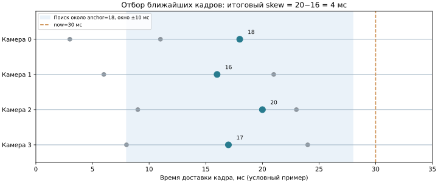
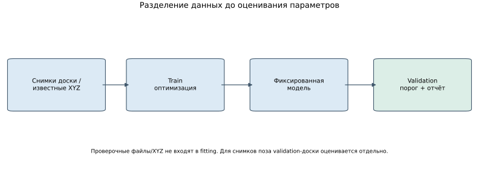
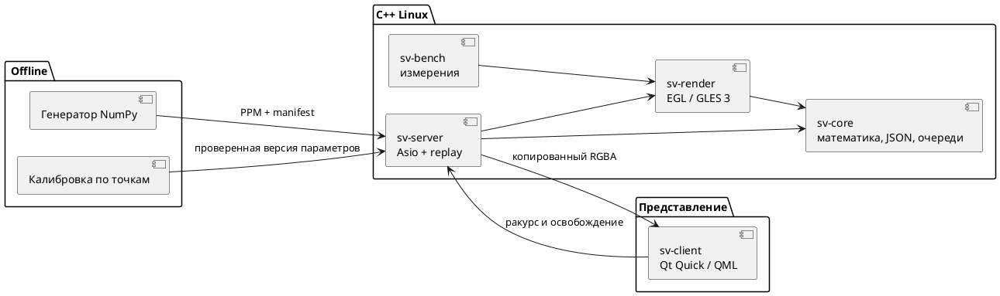
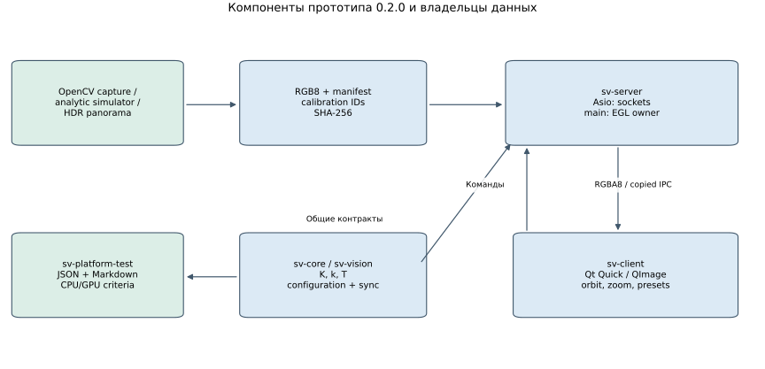

---
aliases:
  - Глава 2. Анализ требований и выбор методов построения системы
tags: [diploma, requirements, architecture]
status: draft
updated: 2026-10-05
---

# Глава 2. Анализ требований и выбор методов построения системы

> Рабочая редакция по теме «Исследование и разработка системы отображения и методик калибровки функции интерактивного кругового обзора ТС для ОС Аврора». Аналитические решения уже связаны с Linux-прототипом. Аппаратный профиль Авроры остаётся открытым: целевого устройства и SDK для испытаний пока нет.

Теоретический анализ первой главы показал, что качество кругового обзора определяется несколькими независимыми механизмами: оптической моделью, установкой камер, поверхностью, согласованием времени и смешиванием. Поэтому задача разработки не сводится к выбору одной функции сшивания. Необходимы единые координаты, проверяемые входные данные, отдельная процедура калибровки и измеримый тракт передачи результата. В этой главе выбираются исходные методы и архитектурные границы, по которым создан первый прототип.

## 2.1 Постановка задачи исследования

Объектом исследования является формирование интерактивного представления окружения транспортного средства по данным многокамерной системы. Предмет включает проецирование, объединение, калибровку, диагностику нарушения установки и характеристики исполнения. Тема, цель и задачи R1–R6 определены в [[research/TOPIC]]; они сохраняются при переходе от теории к коду.

Вход образуют четыре изображения с известными ID камер, внутренними и внешними параметрами, размерами и временем получения. Выход — изображение с заданной виртуальной точки, признаки доступности входов и сведения, позволяющие связать результат с принятой командой. Условная трёхмерная поверхность не должна интерпретироваться как измеренная форма всех окружающих объектов.

Для первого этапа выбраны известные синтетические камеры и воспроизводимый Linux replay. Такой набор позволяет отделить ошибку реализации от ошибки оценивания параметров. Промышленный пример TI содержит и bowl-отображение, и GPU-рендер с изменяемой точкой наблюдения [S44]. Поэтому предполагаемый вклад работы связан с проверкой, восстановлением калибровки и обоснованием целевого профиля, а не с объявлением этих приёмов новыми.

Исследовательские вопросы формулируются операционно: совпадают ли CPU/GPU-проекции, как изменяются качество и стоимость при переходе плоскость→bowl, восстанавливаются ли параметры на независимых точках и при каких наблюдениях смещение камеры можно обнаружить. Каждому вопросу назначается свой набор проверок; один красивый итоговый кадр не отвечает на все вопросы.

## 2.2 Функциональные требования

Функции разделены по входам, вычислениям, управлению и обслуживанию. Исходный обязательный результат включает четыре камеры, плоскость и bowl, изменение ракурса, первоначальную и повторную калибровку, диагностическое состояние и наблюдаемую обработку отказов. Полный нормативный перечень хранится в [[requirements/SYSTEM]] и связанных спецификациях. Здесь рассматриваются основания выбора, а не создаётся второй реестр MUST.

| Функция | Причина необходимости | Исходный Linux-профиль |
|---|---|---|
| Согласование четырёх входов | Разные моменты съёмки создают двойные контуры | Ограниченные очереди и окно skew |
| Изменение виртуального ракурса | Пользователь должен осматривать ближнюю зону | Orbit, zoom, top/front/rear |
| Валидность и отсутствие данных | Потеря камеры не должна выглядеть как наблюдение | Нулевой вклад недоступного входа |
| Калибровка | Паспортные параметры не подтверждают геометрию экземпляра | Оценивание по известным 3D-точкам |
| Контроль смещения | Ремонт или удар изменяют установку | Сервисная проверка по независимым точкам |
| Версия результата | Нужно отличать принятый ракурс от ранее построенного | `frame_id`, `state_revision`, ID команды |
| Повторяемость | Вывод должен проверяться отдельным запуском | Manifest, effective config, seed и сохранённые отчёты |

Клиент управляет виртуальной камерой и показывает результат сервера. Калибровочная утилита оценивает параметры offline. Это предотвращает их неконтролируемое изменение в покадровом цикле. Потеря входа и нарушение геометрии сохраняются как различные состояния: исправная геометрия может сопровождаться недоступностью кадров, а полный набор кадров — неправильной калибровкой.

## 2.3 Нефункциональные требования

Для принятия решения нужны точность, своевременность, ограниченность ресурсов и наблюдаемость. Частота выдачи не заменяет задержку. Если очередь содержит $q$ старых кадров и обрабатывается с темпом $F$, добавочная задержка приблизительно равна $q/F$ при стационарном режиме. Поэтому очереди ограничиваются, а возраст входа контролируется отдельно.

Для геометрии используются ошибка исходных UV, корректность валидности, покрытие области и ошибка контрольных объектов. Для времени — длительность отдельных стадий, верхние квантили, пропуски и возраст результата. Для ресурсов — пределы буферов, число объектов GPU и память процессов. Неподтверждённые пороги нормативного профиля нельзя заменять удачным числом из настольного smoke-теста.

| Критерий | Единица/область | Основание проверки |
|---|---|---|
| Численная ошибка проекции | Пиксели исходной камеры | CPU/NumPy/GPU на одинаковых точках |
| Калибровка | RMSE, p95 по камерам | Независимая выборка соответствий |
| Покрытие | Доля заданной наземной ROI | Одна и та же выборка, исключённая маска автомобиля |
| Время обработки | Мс, с точными границами | Распределение отдельных измерений |
| Свежесть | Мс от определённой входной метки | Общий домен времени и ID набора |
| Ограниченность | Количество/размер объектов | Перегрузка и отказ потребителя |
| Переносимость | Конкретное устройство и выпуск | Установка и полный запуск, не только компиляция |

Для начального сравнения выбран малый вход 4×320×180 RGB8. Он нужен для быстрой проверки полного пути и не заменяет целевые 1280×720-условия. Нефункциональная приёмка большого профиля остаётся отдельным этапом [[requirements/NFR]].

*Рисунок 2.1 — Условный пример отбора кадров: anchor=18 ms, ближайшие допустимые наблюдения дают итоговый skew=4 ms. Цветом выделены выбранные кадры; схема иллюстрирует критерий и не является аппаратной временной трассой.*

## 2.4 Сравнение способов формирования обзора

Выбор рассматривается по двум группам критериев: соответствие дорожной задаче и управляемость эксперимента. Плоскость имеет простую геометрическую интерпретацию и удобна для проверки наземных ориентиров. Bowl добавляет поднятую периферию и позволяет исследовать наклонный ракурс в том же математическом семействе. Сфера и цилиндр полезны как альтернативы углового представления, но требуют отдельного решения центральной дорожной зоны.

| Вариант | Контроль дороги | Наклонный ракурс | Параллакс разнесённых камер | Решение для первого опыта |
|---|---|---|---|---|
| Плоскость | Естественный | Периферия остаётся плоской | Не устраняется | Обязательный baseline |
| Цилиндр | Нужна отдельная центральная часть | Подходит для периферии | Не устраняется | Обзорный вариант |
| Сфера | Метрическая дорога не естественна | Непрерывная оболочка | Не устраняется | Обзорный вариант |
| Bowl | Плоский центр, поднятый край | Управляется высотой | Не устраняется | Основной сравниваемый вариант |
| Реконструкция глубины | Зависит от точности реконструкции | Более достоверна в наблюдаемой области | Требует оценки геометрии | Расширение после baseline |

Для реализованного семейства $S(\xi,\eta)=(\xi,\eta,H(d_x^2+d_y^2)/2)$ переход к плоскости осуществляется при $H=0$. Не требуется менять модели камер, порядок источников или интерфейс. Это уменьшает число одновременно меняющихся факторов. Высоты $H=0$ и $H=1.5$ м являются параметрами сравнения, а не оценкой действительной высоты окружающей сцены.

Основной GPU-вариант проецирует интерполированную пространственную точку в fragment shader. Так ошибка интерполяции готовых UV не смешивается с первым численным сравнением. Дискретизация самой поверхности остаётся источником приближения и проверяется отдельно. LUT и адаптивная сетка сохраняются как дальнейшие варианты, когда будет установлен фактический предел производительности.

## 2.5 Выбор первоначальной калибровки

Из теории известны несколько уровней задачи: оценивание внутренней модели отдельной камеры, определение её позы относительно измеренной площадки и совместное уточнение нескольких камер с неизвестными положениями шаблонов. Zhang обосновывает использование нескольких наблюдений плоского шаблона [S05], а Kannala–Brandt рассматривает широкоугольную модель [S06]. Эти основания не означают, что любая совокупность фронтальных снимков определяет все параметры.

Для первого измеримого этапа выбраны известные трёхмерные соответствия в автомобильной системе. Это позволяет оценивать восемь внутренних и шесть внешних параметров каждой камеры без дополнительной свободы общего масштаба и неизвестных поз шаблона. Совокупность контрольных точек должна иметь разнообразную неплоскую геометрию; отдельные реальные плоские шаблоны можно объединить через измеренные положения, но такой сбор данных ещё не реализован.

Задача записывается как

$$
\min_{\beta_i}\sum_{j\in\mathcal T_i}
\rho\!\left(\|\pi_i(T_iX_j;K_i,D_i)-z_{ij}\|_2^2\right),
\tag{2.1}
$$

где $\mathcal T_i$ — обучающие наблюдения, а проверочные точки в сумму не входят. Форма устойчивой нелинейной оптимизации соответствует общему подходу, описанному в документации Ceres [S25]; текущий прототип использует собственное NumPy-оценивание и не зависит от Ceres.

| Метод | Известные данные | Удобство независимой проверки | Объём начальной реализации |
|---|---|---|---|
| Только intrinsics | Размеры и наблюдения шаблона | Проверяет оптику | Недостаточен для общего обзора |
| Известные точки в системе автомобиля | XYZ и пиксели, начальное приближение | Прямая независимая репроекция | Выбран для первого прототипа |
| Совместные неизвестные позы шаблонов | Общие наблюдения, метрическая опора | Нужен контроль определимости всей системы | Следующий калибровочный этап |
| Автоматическое уточнение дорожной сцены | Пригодные признаки или фотометрия | Сильно зависит от условий сцены | Исследовательское расширение |

Калибровочный результат по известным XYZ принимается по независимым точкам, рангу нормированного якобиана и допустимости модели. В версии 0.2.0 добавлен второй путь: реальный OpenCV-детектор снимков доски и `fisheye::calibrate` для intrinsics. Он не определяет внешнюю привязку к автомобилю; проверочная поза доски оценивается отдельно. Совместная многокамерная задача и измеренная площадка остаются следующим этапом.

*Рисунок 2.2 — Разделение данных до оптимизации и приёмка фиксированной модели. Для image-based intrinsics held-out остаток включает отдельно оцененную позу доски; для известных XYZ проверяется прямая репроекция.*

## 2.6 Выбор контроля смещения

Измеренный шаблон, известные точки автомобиля и признаки перекрытия имеют разную наблюдаемость. Первый метод допускает воспроизводимое сервисное решение; второй зависит от стабильности опор; третий позволяет работать без специальной площадки, но должен отделять параллакс, движение и изменение света. Работа Li и соавторов показывает необходимость аккуратного начального приближения и более сложного поиска при автоматическом уточнении дорожной сцены [S14].

Для начального метода выбран p95 евклидовой ошибки независимых контрольных точек. В smoke-сценарии фиксированы пороги 0.5 пикселя для SUSPECT и 1 пиксель для RECALIBRATION_REQUIRED. Эти значения служат проверке ветвей алгоритма; они не получены обучением статистически представительного классификатора и не являются универсальными эксплуатационными нормами.

Состояние INDETERMINATE возвращается при недостаточной совокупности контрольных точек. Камеры-кандидаты определяются индивидуально по их проверочным остаткам. Попарная локализация только по перекрытию пока не реализована. Для её оценки потребуется отдельная выборка исправных и нарушенных сцен, на которой измеряются ложные тревоги, пропуски и доля отказов от вывода.

## 2.7 Аппаратные платформы и расчёт полосы

Linux-стенд использует AMD Ryzen 9 9950X и NVIDIA GeForce RTX 5070 Ti. Вне ограниченной среды `nvidia-smi` подтвердил драйвер 615.71.09 и 16303 MiB памяти GPU. Фактический EGL-рендерер также сохранён в результатах; отдельно выполнен программный профиль Mesa llvmpipe. Это две среды одного настольного исследования, а не эталонная и целевая Аврора.

$$
B=N_cWHbF.
\tag{2.2}
$$

При $N_c=4$, $W=320$, $H=180$, $b=3$, $F=30$ полезный вход равен 20 736 000 байт/с. Выход 640×360 RGBA8 при 30 кадрах/с составляет 27 648 000 байт/с. Проектный вход 4×1280×720 RGB8 требует 331 776 000 байт/с, поэтому его нельзя считать совместимым с гигабитным каналом без изменения формата или сжатия. Внутренние чтения и копии в эти оценки не входят.

Паспорт Авроры не заполнен. Выбор версии API, Qt и разрешённых зависимостей выполняется по фактическому выпуску и публичному перечню [S21], [S22]. Результаты RTX не позволяют назначать бюджет встроенному GPU без дополнительного измерения.

## 2.8 Архитектура программного комплекса

Разделение ответственности имеет два уровня. Математическое ядро не зависит от интерфейса и сокетов. Host-компоненты организуют данные и время жизни. В прототипе GPU-часть выделена в `sv-render`, чтобы CPU-тесты могли собираться без EGL и Qt.

*Рисунок 2.3 — Выбранная декомпозиция прототипа. Проектное развитие к Авроре описано в [[architecture/SYSTEM]].*

Одно владение GL-контекстом предотвращает произвольный доступ из socket callback. Очередь команд является мостом между Asio и рендером. Кадр передаётся клиенту как копия, поэтому номер GL-текстуры не становится межпроцессным дескриптором. Улучшение передачи через общий GPU-буфер требует отдельного контракта синхронизации.

*Рисунок 2.4 — Соответствие функциональных обязанностей исполняемым инструментам версии 0.2.0. OpenCV capture создаёт запись для replay; прямой аппаратный producer в сервер пока не встроен.*

## 2.9 Технологии и протоколы

Для ядра выбран C++17. GLM используется для view/perspective с явным соглашением правой системы и OpenGL clip range [S54]. Boost.JSON обслуживает конфигурацию и metadata [S53]. Boost.Asio позволяет выполнять обработчики сокетов в отдельном потоке `io_context`; увеличение числа runner-потоков потребовало бы сериализации доступа к общим объектам [S55]. Поэтому один runner выбран как достаточный первый вариант.

В локальном IPC сохранён 24-байтовый префикс SV01, big-endian поля, JSON-заголовок и двоичная нагрузка. Control и data имеют отдельные соединения. Идентификаторы uint64 передаются десятичными строками, чтобы QML не терял точность. Handshake связывает каналы с сессией, а release подтверждает завершение использования серверной копии.

| Решение | Почему выбрано | Условие пересмотра |
|---|---|---|
| GLES 3 + EGL | Один явный графический backend для Linux-опыта | Проверка профиля целевого устройства |
| Системные GLM/Boost/OpenCV/OpenSSL | Явные CMake/RPM dependencies, сборка без скачивания | Наличие packages в выбранном target |
| Asio, один IO-поток | Отделение сокетов от GL | Несколько клиентов, декодирование, измеренное узкое место |
| Копированный RGBA | Простой проверяемый lifetime | Измеренная стоимость readback/IPC/upload |
| QQuickImageProvider | Быстрый проверяемый desktop-показ | Переход к native texture и требования Авроры |
| OpenCV C++ + Python/NumPy offline | Реальная оптика/изображения и отдельный known-XYZ solver | Большие реальные данные и измеренная площадка |

Это подмножество полного протокола [[requirements/PROTOCOL]]. Capability replay не означает наличия TCP producer, CAN или удалённых часов. Версии библиотек первого стенда также не являются разрешённым списком Авроры.

## 2.10 Программа опытов

Программа включает численную проверку, сравнение поверхностей, калибровку, управляемый дрейф и отказ потребителя. Для рендера порядок вариантов чередуется между независимыми процессами; используются одинаковые входы и виртуальная камера. Сохраняются все времена кадров, эффективная конфигурация, хэш manifest и фактический backend. Это позволяет строить график из первичных значений, а не из вручную подобранного среднего.

Калибровочные точки разделены до оптимизации. Дрейф задаётся поворотом одной камеры и проверяется на прежних независимых точках. После повторного оценивания сравнивается восстановление. Тесты IPC проверяют частичное чтение, отклонение повреждённого пакета, pause/orbit, release timeout и reconnect. Реальные камеры, память, нагрев и физическая задержка включаются в последующий этап.

Ожидаемый итог программы — не заранее заданная победа bowl или GPU, а возможность объяснить полученные различия и ограничения. Первые результаты приведены в [[diploma/04_EXPERIMENTAL_STUDY]]. Полная программа диссертации остаётся в [[research/EXPERIMENTS]]; выполненный smoke-профиль не закрывает её автоматически.

## Выводы по второй главе

Для первого рабочего этапа выбраны четыре fisheye-камеры, плоскость и параметрическая чаша, явная автомобильная система координат, калибровка по известным пространственным точкам и сервисная диагностика. Эти решения создают наблюдаемую основу, на которой ошибки реализации можно отделить от качества оценивания и свойств условной поверхности.

Архитектура разделяет вычислительное ядро, GPU-ресурсы, Asio-сервер, интерфейс и offline-инструменты. Linux-профиль уже реализован; согласование Авроры, реальных наблюдений и полного протокола остаётся открытой частью исследования. В следующей главе описываются код, потоки и конкретные границы текущего прототипа.

## Источники

Проверенные части работ и библиографические сведения находятся в каталоге: [[references/DEVELOPMENT#S44|S44]], [[references/VISION#S05|S05]], [[references/VISION#S06|S06]], [[references/DEVELOPMENT#S25|S25]], [[references/VISION#S14|S14]], [[references/PLATFORM#S21|S21]], [[references/PLATFORM#S22|S22]], [[references/DEVELOPMENT#S53|S53]], [[references/DEVELOPMENT#S54|S54]], [[references/DEVELOPMENT#S55|S55]]. Дата обращения — 05.10.2026; сведения о собственном коде подтверждаются исходниками и [[prototype/MEASUREMENTS]].

[S44]: https://www.ti.com/lit/wp/spry270a/spry270a.pdf
[S05]: https://www.microsoft.com/en-us/research/wp-content/uploads/2016/02/tr98-71.pdf
[S06]: https://oulu3dvision.github.io/calibgeneric/Kannala_Brandt_calibration.pdf
[S25]: https://ceres-solver.readthedocs.io/latest/nnls_tutorial.html
[S14]: https://arxiv.org/abs/2305.16840v1
[S21]: https://developer.auroraos.ru/doc/software_development/reference/public_api
[S22]: https://developer.auroraos.ru/doc/platform/architecture/qt
[S53]: https://www.boost.org/doc/libs/latest/libs/json/doc/html/index.html
[S54]: https://github.com/g-truc/glm/blob/1.0.3/manual.md
[S55]: https://www.boost.org/doc/libs/latest/doc/html/boost_asio/overview/core/threads.html
