---
aliases:
  - Глава 3. Разработка системы интерактивного кругового обзора
tags: [diploma, implementation, prototype]
status: draft
updated: 2026-10-06
---

# Глава 3. Разработка системы интерактивного кругового обзора

> Описывается Linux-прототип версии **0.6.0**. Введена поверхность «круглый пол + текстурированный купол» с виртуальной камерой внутри; bowl остаётся отдельным вариантом для сравнительных опытов. Используются OpenCV, native квалификация и offline RPM-профили. Целевые SDK/устройство Авроры и полная приёмка требований ещё не проверены. Результаты 0.1.0/0.2.0 в главе 4 сохранены как исторические baselines.

Результатом этапа разработки является воспроизводимый программный путь от четырёх известных камер до управляемого изображения в отдельном Qt Quick-клиенте. Математическое ядро, графический backend и host-приложения собраны как разные CMake targets. Помимо визуализации реализованы независимая проверка проекции, offline-оценивание параметров и сервисный критерий нарушения калибровки. Эти части дают основу для экспериментального раздела, хотя не заменяют весь комплекс для целевой платформы.

## 3.1 Формат конфигурации и калибровочных данных

Файл `configs/synthetic.json` задаёт профиль `linux-prototype-v1`, единицы m/rad/ns, размеры автомобиля, четыре камеры, bowl-поверхность, начальный ракурс, выходное разрешение и пределы синхронизации. Отдельный `street-demo.json` использует `dome_floor_v1`. Схема имеет явную версию 1. Неизвестные ключи и отсутствующие обязательные поля отклоняются до создания EGL-ресурсов. Матрицы записываются строками и применяются к столбцам.

Текущий профиль намеренно использует компактный набор полей. Это не полная реализация прежнего YAML-примера [[requirements/CONFIGURATION]]: отсутствуют произвольные маски, metadata resize/crop, все транспортные настройки и полноценный report-контракт. Вместо утверждения совместимости этих форматов граница зафиксирована в [[prototype/STATUS]]. Эффективный JSON сохраняется в каждом benchmark-каталоге; серия добавляет SHA-256 этого файла.

| Объект | Реализованная проверка | Причина |
|---|---|---|
| Версия и ключи | Версия 1, точный набор полей | Исключение молчаливого игнорирования |
| Камеры | Ровно четыре ID 0…3 | Однозначное соответствие текстурам |
| Матрица установки | Нижняя строка, $R^TR\approx I$, $\det R\approx1$ | Запрет отражения и неравномерного масштаба |
| Fisheye | Положительные фокусы, четыре коэффициента, нулевой скос | Соответствие выбранной модели |
| Угловой диапазон | $0<\theta_{max}<\pi/2$, положительный Z-порог | Передняя полусфера начального профиля |
| Монотонность | Минимум производной по краям и стационарным точкам | Однозначность радиального отображения |
| Поверхность | Центральная маска внутри плоской части, внешние размеры больше внутренних | Допустимая геометрия |
| Ракурс | Высота над поверхностью, расстояние и clip range | Устойчивый look-at и наблюдение сверху |
| Изображения | Размеры ограничены до выделения памяти | Согласование payload и буфера |

Для монотонности используется полином от $x=\theta^2$: $g(x)=1+3k_1x+5k_2x^2+7k_3x^3+9k_4x^4$. Проверяются концы интервала и все действительные корни $g'(x)$ внутри него. Корни находятся рекурсивным разделением интервала по корням производной и бисекцией. Это сильнее проверки только нескольких равномерных углов, хотя численные допуски всё равно ограничивают утверждение точности.

Ошибки JSON и диапазонов завершают запуск с причиной. Подробный путь любого неверного числового поля пока сообщается не во всех ветвях; это остаётся работой для полной машинной схемы. Код проверки: [config.cpp](../../src/core/config.cpp).

## 3.2 Математическое ядро

Ядро содержит векторные операции, преобразования, независимую аналитическую fisheye-проекцию, поверхность, сетку и преобразование sRGB. В `sv-vision` подключена **реальная OpenCV 5.0.0**: `cv::fisheye::projectPoints` даёт эталонные CPU-пиксели для `sv-project`, benchmark и native GPU-проверки [S04]. Аналитический double-путь сохранён для независимого сравнения; он не выдаётся за вызов библиотеки.

При вычислении используются double. Неконечные точки, Z за рабочей границей, превышение угла и выход из изображения делают наблюдение невалидным. Центральный луч имеет отдельный устойчивый предел. Виртуальные view/perspective получаются через GLM с явным `lookAtRH` и `perspectiveRH_NO` [S54], после чего приводятся к документированной строковой форме. Перед GLSL-загрузкой матрица преобразуется в column-major; transpose-флаг остаётся false, как требует используемый путь GLES.

Сетка строится по равномерным осям с дополнительными линиями $\xi=\pm a$, $\eta=\pm b$. Благодаря этому границы плоской области совпадают с рёбрами. Дубликаты координат удаляются, каждая ячейка содержит два одинаково ориентированных треугольника. При исходных 32 ячейках на ось фактическое добавление границ даёт 2312 треугольников; при 64 — 8712. Поэтому подпись «32×32» не должна подменять фактическое число элементов.

Независимый NumPy-эталон использует $\theta=\operatorname{atan2}(\sqrt{X_C^2+Y_C^2},Z_C)$ и направление луча. `independent_math` сравнивает с OpenCV 8000 точек и признаки валидности: по 1000 на камеру при нулевой и ненулевой дисторсии. Native suite дополнительно сравнивает аналитический C++ и OpenCV на 8192 точках. Проверяются единичная длина синтетических лучей и обратная проекция пикселей. GLSL-kernel возвращает пиксельные координаты в float-FBO и сравнивается непосредственно с OpenCV, проверяя матричную загрузку и шейдерную арифметику отдельно от растеризации поверхности.

Полный CPU-растеризатор итогового изображения не реализован. Следовательно, CPU/GPU-проверка подтверждает проекцию и отдельные геометрические инварианты, а не все пиксели готового изображения. Код: [math.cpp](../../src/core/math.cpp), [test_math.py](../../tests/test_math.py).

## 3.3 Первоначальная калибровка

Калибровочная утилита принимает уже найденные соответствия XYZ↔UV. Для каждой камеры оцениваются $f_x,f_y,c_x,c_y$, четыре коэффициента искажений, три компоненты малого вращения и три компоненты переноса. Фокусы параметризуются логарифмами, главная точка нормируется на размер изображения, перенос — на фиксированный масштаб. Это уменьшает различие размеров численных шагов.

Обновление вращения записывается как $R=\exp([\omega]_\times)R_0$ и вычисляется формулой Родрига. Резидуал — разность проекций и измеренных пикселей. Численный якобиан получается центральными разностями. Шаг демпфированного метода имеет вид

$$
(J^TWJ+\lambda D)\Delta\beta=-J^TWr,
\qquad D=\operatorname{diag}\bigl(\max(\operatorname{diag}(J^TWJ),1)\bigr).
\tag{3.1}
$$

Здесь $W$ соответствует Huber-взвешиванию с переходом 2 пикселя. Кандидат принимается только при уменьшении той же Huber-функции; демпфирование уменьшается при успехе и увеличивается при отказе. Общая форма устойчивых нелинейных наименьших квадратов описана в [S25]. Собственная реализация нужна для доступного первого опыта; её нельзя без дополнительных проверок считать заменой промышленному solver во всех условиях.

Обучающие и проверочные совокупности не могут содержать одинаковые XYZ. Требуются ≥30 соответствий на выборку и неплоская совокупная геометрия. После оценивания вычисляются ошибки по обеим выборкам и обусловленность нормированного якобиана. Новый набор принимается при полном численном ранге, допустимой монотонности и p95 проверочной ошибки не выше заданного порога.

В историческом known-XYZ опыте наблюдения имеют известные пространственные координаты и добавленный пиксельный шум; детектор изображений в этом опыте не участвовал. В версии 0.2.0 добавлен описанный ниже детектор шахматной доски. Получение настоящих снимков и метрическая привязка площадки ещё нужны перед выводами о реальных камерах; детектор маркированного шаблона не реализован.

Для снимков создан native `sv-calibrate`: режим `detect` использует `findChessboardCornersSB` и сохраняет annotated PNG/UV/XYZ доски [S65]; режим `intrinsics` оценивает оптическую модель реальным `fisheye::calibrate` [S04]. Требуются минимум шесть train и три validation views. Повторные файлы в обеих выборках отвергаются по SHA-256. Проверочный остаток вычисляется при фиксированных intrinsics и отдельно найденной `solvePnP`-позе доски. Его область отличается от ошибки известных XYZ автомобиля.

Export выполняется только при конечных параметрах, положительных focal, допустимой производной радиального отображения на 1025 углах заявленного домена и p95≤порога. Эта сеточная проверка в fitter не заменяет проверку стационарных точек полинома при загрузке полного config. Путь не изменяет внешнюю матрицу, не перезаписывает принятую конфигурацию и сохраняет происхождение каждого снимка. Код: [calibration.cpp](../../src/vision/calibration.cpp), [calibrate.cpp](../../src/apps/calibrate.cpp).

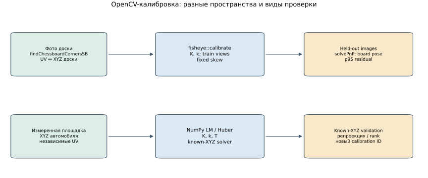

*Рисунок 3.1 — Image-based intrinsics через OpenCV и known-XYZ оценивание общей модели. Системы доски и автомобиля различаются; результаты двух методов нельзя интерпретировать одной метрикой без учёта pose fitting.*

## 3.4 Контроль нарушения калибровки

Сервисный алгоритм применяет текущие параметры к независимым контрольным точкам. Для каждой камеры вычисляется p95 остатка. Состояния NORMAL, SUSPECT и RECALIBRATION_REQUIRED определяются фиксированными порогами; недостаточные или непригодные точки дают INDETERMINATE. Список кандидатов содержит камеры, для которых превышен основной порог.

Алгоритм не меняет конфигурацию при обнаружении отклонения. Повторное оценивание выполняется отдельной командой, после чего требуется проверка и экспорт. Эта граница предотвращает обратную связь, в которой диагностический признак автоматически становится непроверенной новой калибровкой.

Испытание задаёт вращение задней камеры от 0 до 2° при неизменных наблюдениях. Результаты не распространяются на случай недостаточной текстуры, дождя или движения: текущий метод не извлекает признаки из перекрытия. Его назначение — подтвердить связь геометрического смещения с контролируемой ошибкой и корректность ветвей сервисной процедуры. Перед диагностикой проверяются полный набор четырёх ID и конечные положительные пороги; неполная таблица не может молча дать NORMAL. Код: [configurator.py](../../tools/configurator.py).

## 3.5 Реализация сервера

Сервер включает загрузку конфигурации, чтение manifest, ограниченные очереди и две независимые Unix stream-сессии. Основной поток владеет EGL-контекстом, наборами кадров и виртуальной камерой. Один дополнительный поток исполняет `io_context::run()` Boost.Asio. Сокеты, таймеры и их outgoing-очереди обслуживаются только этим потоком; команды передаются рендеру через mutex-защищённую очередь.

| Ресурс | Предел текущего профиля | Поведение при нехватке |
|---|---:|---|
| Входная очередь камеры | 3 кадра по конфигурации | Удаление старейшего, счётчик |
| Очередь команд | 64 | Отрицательный ACK `control_queue_full` |
| Обработка команд за цикл | До 16 | Остальные остаются в ограниченной очереди |
| Выходной кадр | Один ожидающий release | Следующий кадр не ставится в IO-очередь |
| Очередь control-записей | 64 | Закрытие перегруженного соединения |
| Header/payload | 64 KiB / 64 MiB | Отказ до выделения полного сообщения |
| Handshake/неполное сообщение | 2 с | Закрытие соединения |
| Release | 250 мс | Закрытие data; control продолжает работу |

При сборе набора используется опорное время среди свежих последних входов, а остальные выбираются по близости в пределах окна. Будущие и просроченные кадры исключаются. Итоговое окно набора контролируется отдельно: два наблюдения по разные стороны опоры не должны вместе нарушить общий skew. При неполном наборе возвращается DEGRADED; при отсутствии пригодных — NO_INPUT.

После pause сохраняется набор и отмечается `paused`; команды ракурса продолжают создавать результаты. При сохранённых входах upload-счётчик не растёт. Step выпускает следующую строку сценария. Полный replay-clock с speed и перерасчётом anchors пока отсутствует: строки идут с периодом около 33.3 мс, исходное время остаётся metadata. Это важное отличие от полного проектного контракта времени.

Декодирование PPM/PNG/JPEG пока выполняется основным потоком и использует кэш последних файлов каждой камеры. PNG/JPEG читает OpenCV с явным BGR→RGB. Отделение декодирования в worker pool является следующим улучшением. Добавление множества Asio runner-потоков без изменения владения объектами не решает эту задачу [S55]. Код: [server.cpp](../../src/apps/server.cpp).

## 3.6 GPU-конвейер

Используется EGL-контекст GLES 3 с небольшим pbuffer и отдельным framebuffer результата. Для Mesa выбирается surfaceless platform [S56], для NVIDIA — device platform с перечислением EGL-устройств [S58]. Эти расширения относятся к проверенным настольным профилям; на Авроре backend потребуется подтвердить отдельно.

Четыре RGB8-текстуры обновляются при изменении владельца входного изображения. Сетка хранится в VBO/EBO. Vertex shader преобразует её вершины в виртуальный ракурс; fragment shader получает интерполированную пространственную точку, рассчитывает четыре проекции, валидность и веса. Граничный feather-вес зависит от расстояния до края исходного кадра. Цвет переводится из sRGB в linear RGB, смешивается с нормировкой и кодируется обратно. Это прямое объединение в процессе рисования поверхности: отдельная общая panorama/cubemap texture сейчас не строится. Graph cut, multi-band, LUT-atlas и альтернативные носители описаны как направления исследования [[research/PROJECTION_AND_STITCHING]], а не функции текущего продукта.

Прямоугольная маска исключает чужие изображения внутри footprint автомобиля на полу. Поверх пола и дальней поверхности отдельным draw рисуется процедурная ego-модель из 132 треугольников: кузов, остекление, крыша, колёса и фары. Это визуальная опора ракурса, а не точный CAD автомобиля. Купол и пол остаются непрозрачными даже при отсутствии входа: для таких областей используется нейтральная заливка, не интерпретируемая как измерение. Depth attachment обеспечивает перекрытие поверхности и кузова.

GPU-результат читается как RGBA8 и один раз переворачивается по строкам в top-left. После этого ни IPC, ни UI не выполняют повторного переворота. Путь соответствует используемым правилам framebuffer, форматов и шейдеров GLES [S26]. Внутренние промежуточные readback не нужны, но финальный readback синхронен и входит в измеренное время.

Диагностический float-FBO возвращает прямую проекцию точек и требует float color attachment. Добавлены optional `EXT_disjoint_timer_query` вокруг surface+vehicle draw [S52], CPU-учёт upload и readback/flip. Query читается после финального readback; disjoint/неготовый результат исключается, причина сохраняется. Native report содержит valid GPU distributions либо null. Прежний metrics-контракт `sv-bench` сохраняет `gpu_time_ms=null`; расширенные измерения выполняет `sv-platform-test`. Полные UV/mask/weight diagnostic views и LUT пока отсутствуют.

## 3.7 Desktop-клиент Qt Quick и граница переноса

Клиент создаёт QGuiApplication и QQmlApplicationEngine, подключает C++-мост и QML-окно. Control handshake устанавливает сессию, после чего подключается data-сокет. Проверенные байты RGBA копируются в QImage, передаются thread-safe image provider и освобождают серверный слот. QQuickImageProvider является штатным механизмом предоставления изображений Qt Quick [S57]. Он выбран для проверяемого desktop-пути; проектный QQuickItem/QSGTexture остаётся последующим вариантом.

Интерфейс содержит изображение, три пресета, pause/resume/step и строку состояния. Drag-смещения объединяются за 33 мс, колесо меняет расстояние. Это уменьшает поток команд при частых mouse events. Команда содержит собственный ID; metadata кадра — принятую `state_revision`, что позволяет отличить новое положение от ранее выданного кадра.

После готовности изображения и события `frameSwapped` записывается `ui_present_submit`. Offscreen-тест подтверждает `ui_receive` и `ui_present_submit`; проверены Qt 6.11.2 и отдельная сборка Qt 5.15.19. Это свидетельство software-представления Qt, а не физического дисплея или ABI Авроры. QML включён в `.qrc`; GLSL — в generated C++ header, поэтому установка не зависит от checkout.

При проверке завершения обнаружено обращение socket callback к полям во время разрушения Bridge. Деструктор теперь отключает эти соединения до уничтожения строк/буферов и закрывает оба сокета. Повторный IPC-тест выполнен три раза; ошибка закрытия устранена. Это пример необходимости проверять завершение потока и владение ресурсами вместе с получением кадра.

Клиент восстанавливает соединение после отключения. Политика непрерывной stale-индикации и полная диагностика calibration state пока не реализованы. Код: [Main.qml](../../examples/sv-client/Main.qml), [bridge.cpp](../../examples/sv-client/bridge.cpp).

## 3.8 Offline-конфигуратор

CLI имеет режимы `calibrate` и `diagnose`. Первый читает конфигурацию и наблюдения, оценивает камеры, формирует отчёт и экспортирует принятый набор. Второй только сравнивает действующую геометрию с независимыми наблюдениями. SHA-256 наблюдений участвует в идентификаторе новой калибровки.

Принятая конфигурация записывается через временный файл с последующим rename. Уже существующий `calibrated.json` не перезаписывается: для новой версии выбирается другой каталог. Старые параметры сохраняются в исходном конфигурационном файле. Экспорт отвергается, если контроль качества не выполнен. Это даёт проверяемую историю первоначальной и повторной процедуры.

Python CLI решает известную пространственную задачу; отдельный OpenCV CLI — внутреннюю image-based калибровку. GUI отбора снимков, полный журнал площадки и совместная привязка нескольких камер к неизвестным позам шаблонов отсутствуют. Следовательно, наличие двух проверенных tools ещё не закрывает все CAL-F-001…006 для реального объекта. Команды и форматы — [[engineering/USAGE]].

## 3.9 Генератор и контролируемые данные

Генератор NumPy создаёт четыре широкоугольные камеры в известных позах. Каждый пиксель задаёт луч; для выбранных коэффициентов радиальный полином обращается численным методом. Лучи пересекают наземную плоскость и приподнятый сферический объект. Плоскость содержит клетчатую текстуру, метровые линии и движущийся наземный маркер.

Таким образом, вход строится из известной геометрии, а не из цветовой таблицы, уже рассчитанной C++-рендерером. Сфера используется для визуального показа искажений объекта, который не принадлежит условной поверхности. Этот признак особенно важен при сравнении плоскости и bowl: нельзя считать такое искажение случайной ошибкой калибровки.

Данные сохраняются в PPM и manifest с исходными временами, путями, calibration IDs, offset-полями и SHA-256. Null исключает вход, offset задаёт временное нарушение. Native suite проверяет все файловые hashes перед опытом; обычный replay-loader пока ограничивается IDs и форматом. В 0.6.0 добавлена потоковая программа `tools/producer.py`, описанная в §3.16. Код: [simulator.py](../../tools/simulator.py).

Добавлен `sv-capture` с реальным `cv::VideoCapture`: четыре `grab`, четыре `retrieve`, запись PNG/manifest и host delivery timestamps [S64]. Он проверен на четырёх видеофайлах; реальные устройства пока отсутствуют. Размеры кадров обязаны соответствовать калибровке, скрытого resize нет. Метки после retrieve не являются временем экспозиции датчика, а текущий сервер сохраняет фиксированную частоту replay 30 Hz.

Для демонстрации окружения `sv-scene` преобразует HDR-панораму улицы **Urban Street 01** автора Andreas Mischok, Poly Haven, CC0 [S63], в четыре fisheye-входа. В `street-demo.json` камеры горизонтально направлены на четыре стороны и имеют общий оптический центр на высоте 1.6 m. Это согласованно проецирует моноскопическую панораму, но не воспроизводит параллакс настоящих разнесённых камер.

Рендерер 0.3.0 создаёт круглый пол в `z=0` и отдельную верхнюю полусферу радиусом 12 m. На обе поверхности проецируются реальные входные текстуры согласно fisheye-калибровкам; валидные области смешиваются в линейном RGB. На полу применяется маска кузова, на куполе — нет. Автомобиль перекрывает дальнюю стенку по depth buffer. Виртуальная камера имеет расстояние 8.5 m от центра при радиусе купола 12 m; parser и обработчик orbit не позволяют ей выйти за оболочку.

На направлениях без входа, включая часть зенита за пределом FOV, шейдер рисует непрозрачный sky gradient; пропуски на полу закрываются цветом покрытия. Это убирает прозрачные отверстия и вид через пустую поверхность, но не подменяет ими измеренные камерные пиксели. Панорамный набор остаётся без параллакса и служит только визуальной демонстрацией. Код геометрии и ограничения качества — [[architecture/MATHEMATICS]] и [[engineering/SCENE]].

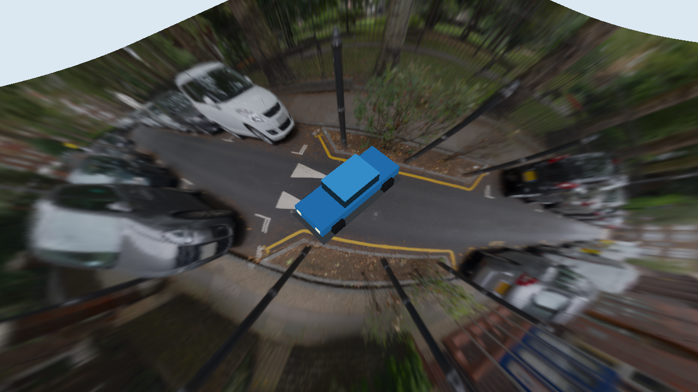

*Рисунок 3.2 — GLES readback купола и круглого пола: текстура улицы обволакивает процедурную модель автомобиля. Вход — моноскопическая HDR-панорама с общим оптическим центром, не запись установленного на ТС rig.*

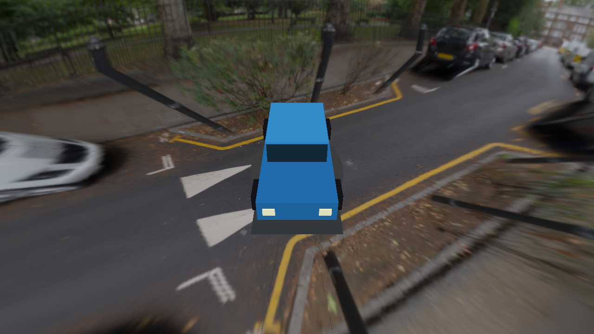

*Рисунок 3.3 — Тот же фотографический купол и нижний пол при ракурсе со стороны передней камеры; виртуальная камера остаётся внутри оболочки.*

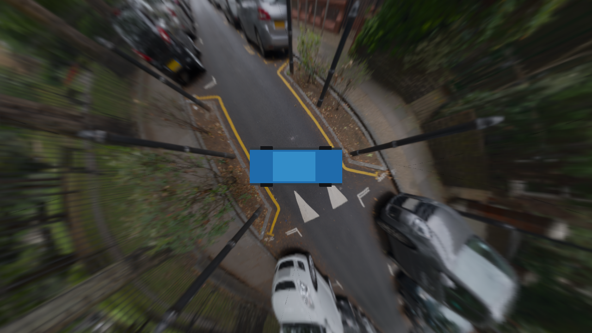

*Рисунок 3.4 — Вид сверху изнутри купола при тех же кадрах. Оболочка закрывает фон, положение препятствий не является метрическим ground truth.*

## 3.10 Протокол и жизненный цикл буфера

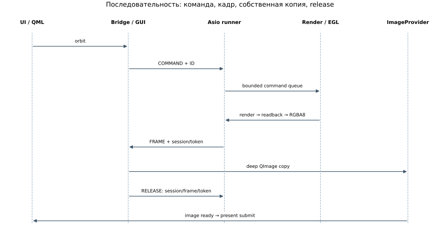

*Рисунок 3.5 — Обмен между GUI-мостом, Asio, EGL-владельцем и ImageProvider. Собственная QImage-копия отделяет server release от последующего представления кадра.*

Framing использует префикс SV01 длиной 24 байта, версию 1, тип, header size, payload size и нулевые flags. Затем следуют UTF-8 JSON и байты. Decoder накапливает неполные части, проверяет пределы и может выдавать несколько сообщений из одного чтения. Однобайтовая подача и объединённые сообщения проверены C++-тестом.

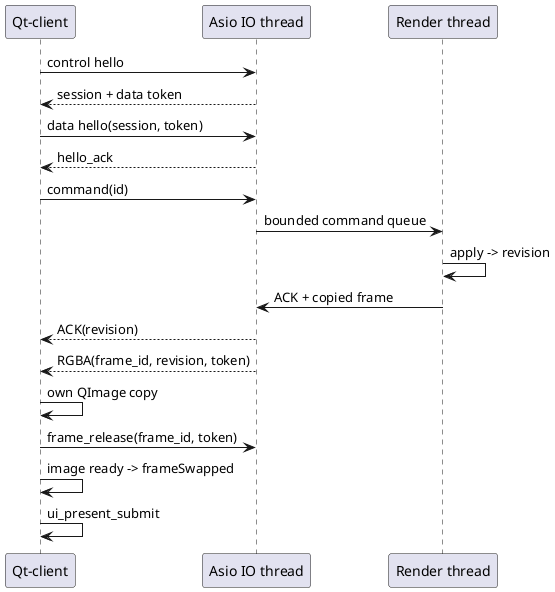
```plantuml
@startuml
participant "Qt-client" as UI
participant "Asio IO thread" as IO
participant "Render thread" as GL
UI -> IO : control hello
IO --> UI : session + data token
UI -> IO : data hello(session, token)
IO --> UI : hello_ack
UI -> IO : command(id)
IO -> GL : bounded command queue
GL -> GL : apply -> revision
GL -> IO : ACK + copied frame
IO --> UI : ACK(revision)
IO --> UI : RGBA(frame_id, revision, token)
UI -> UI : own QImage copy
UI -> IO : frame_release(frame_id, token)
UI -> UI : image ready -> frameSwapped
UI -> UI : ui_present_submit
@enduml
```

*Рисунок 3.6 — Handshake, ревизия команды и токен освобождения в текущем IPC-контракте; момент release не является моментом физического показа.*

Выходной пакет сохраняет ID кадра, набора, принятой ревизии и последней применённой команды, состав входов и runtime-метки. Клиент возвращает session/frame/token. Дублированный или поздний release не должен освобождать другой кадр. При reconnect создаётся новая control-сессия.

Полная схема протокола также требует source IDs, всех событий времени, capabilities и списка коалесцированных команд. Эти элементы реализованы частично. Поэтому текущий framing рассматривается как совместимая основа, а не доказательство полного PRO-F-001…011. Пределы и точное подмножество опубликованы в [[prototype/STATUS]].

## 3.11 Offline-сборка, RPM и подготовка переноса

Рабочая сборка проверена для Linux, Mesa/NVIDIA и Qt 5/6. CPU без EGL/Qt проходит ASan/UBSan. Все dependencies берутся из packages: CMake использует REQUIRED и **не содержит FetchContent**. SV_AURORA отключает host Python-tests; архитектуру и sysroot задаёт SDK, а не этот флаг.

Перенос начинается с проверки реального SDK, разрешённых зависимостей, EGL/backend, форматов и Qt integration [S20], [S21]. После этого следует собрать минимальный target-путь и повторить известные точки и контроль ориентации строк. Если Boost/GLM требуют другого способа включения, архитектурная граница позволяет изменить адаптер или dependency profile без изменения математического контракта.

Созданы GPU- и CPU-spec-профили с Source0, BuildRequires, `%cmake -GNinja`, `%ninja_build`, `%ninja_install` и точным payload [S59], [S60], [S67]. Source0 экспортируется только из чистого Git HEAD и содержит revision. Native Linux RPM обоих профилей собраны и распакованы; из установленного payload, без checkout, прошли core checks, native report, HDR generation, а для GPU — renderer. Эта проверка подтверждает упаковку и runtime resources на Linux, но **не** target ABI, RPM validator profile, подпись и установку Авроры [S61], [S62].

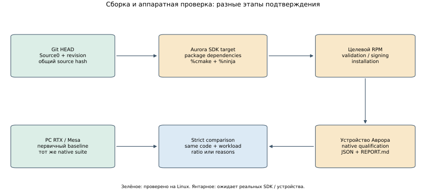

*Рисунок 3.7 — Путь от зафиксированных исходников до аппаратного сравнения. Янтарные этапы требуют фактических SDK/устройства; Linux RPM smoke не заменяет их.*

Подробные инструкции по зависимостям, native export, mb2, release rpmbuild, validation/signing, установке и возврату отчётов находятся в [[engineering/AURORA]]. Клиент остаётся desktop prototype; AuroraApp/Silica lifecycle и launcher являются отдельным этапом интеграции.

## 3.12 Переносимый отчёт и сравнение платформ

`sv-platform-test` в 0.4.0 выполняет 25 CPU/GPU-критериев без Python на целевой стороне. Проверяет analytic/OpenCV/GPU projections, config, mesh, цвета и ориентацию, синхронизацию, очереди, framing, детектор и fitter, cached uploads и десять render-вариантов, fusion-oracles и coverage замкнутых оболочек. Записывает SHA-256 реализации/config/fixture, библиотечные версии, GL/EGL capabilities, uname/CPU/memory и UTC-время. Каждый повтор создаёт новый EGL-контекст в одном процессе; raw времена сохраняются вместе с квантилями.

Первичные данные представлены JSON и Markdown с полным JSON-блоком. `compare_reports.py` допускает отношения времён только при совпадении кода/нагрузки/методики и успешной квалификации обеих сторон. Различия аппаратуры и библиотек сохраняются как характеристики платформ. При несовпадении выводится причина, ratio=null. Результаты будущего устройства можно сопоставить с сохранёнными PC baselines, повторив ПК при изменении реализации.

Оптимизация начинается с измеренных границ upload/draw/readback. Optional GPU query не включает финальное чтение; CPU-readback уже содержит ожидание GPU, поэтому эти времена нельзя складывать. IPC/UI и physical display latency пока не измерены native suite, dedicated GPU memory остаётся null. Подробные критерии, пороги, команды и ограничения — [[engineering/PLATFORM_TEST]].

## 3.13 Независимый объёмный источник кадров

Моноскопическая панорама полезна для проверки визуального окружения, но не содержит параллакса разнесённых камер. Для следующего исследования создан отдельный метрический мир в Blender: дорога, разметка, бордюры, здания, деревья, два припаркованных автомобиля и вертикальные столбики. Ego-автомобиль имеет процедурный кузов, стекло, зеркала и колёса. Модели формируются исходным Python-кодом без внешних ассетов. Авторинг и экспорт выполнены через проверенное MCP-подключение; существующая пользовательская сцена сохранена.

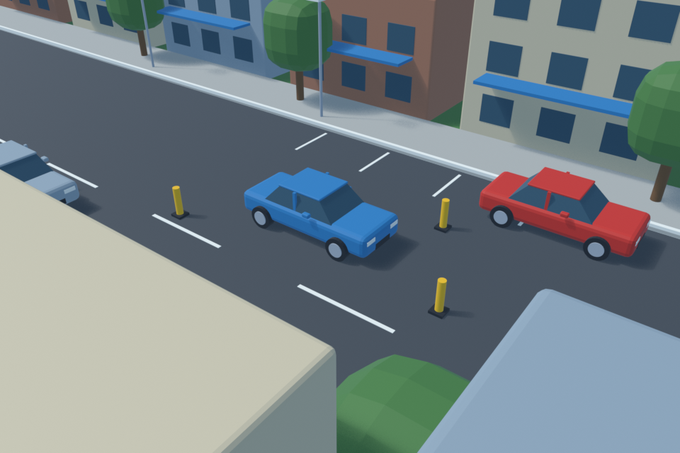

*Рисунок 3.8 — Истинная объёмная сцена источника, рендер Blender EEVEE. Изображение снято внешней камерой и показывает геометрию до реконструкции обзорной оболочкой.*

Четыре оптических центра находятся на переднем и заднем бамперах и снаружи боковых зеркал. Для системы V приняты оси +X вперёд, +Y влево, +Z вверх. Оптическая система C использует +X вправо, +Y вниз, +Z вперёд. Матрицы `T_camera_from_vehicle` постоянны относительно кузова; сценарное движение задаёт `T_world_from_vehicle(t)`. Для camera i истинная поза получается как

$$
T_{W\leftarrow C_i}(t)=T_{W\leftarrow V}(t)\,T_{C_i\leftarrow V}^{-1}. \tag{3.1}
$$

На данном этапе траектория — прямолинейное перемещение со скоростью 2 м/с. Она обеспечивает воспроизводимое изменение входных изображений, но не задаёт динамику шин, подвески или интерактивное управление. Поза внутри одного четырёхкамерного набора фиксируется; последовательный offline render не создаёт межкамерного scenario skew.

Blender последовательно рендерит пять 90-градусных перспективных граней из каждого центра. Выбор такой схемы отделяет создание геометрической сцены от конкретной fisheye-реализации render engine. Для оптического направления d выбирается доминирующая компонента; локальные координаты грани приводятся к пикселям:

$$
u={N\over2}\left(1+{d_x^f\over d_z^f}\right)-{1\over2},\qquad
v={N\over2}\left(1+{d_y^f\over d_z^f}\right)-{1\over2}. \tag{3.2}
$$

Здесь N — размер квадратной грани, а оси f направлены вправо, вниз и вперёд. Отрицательная оптическая Z-грань не используется: поддерживаемый предел угла 1.48 rad меньше π/2. Переход от Blender camera-local −Z/+Y к системе C задаётся явной матрицей. Перед capture выполняется независимая проверка перспективной проекции через Blender `world_to_camera_view` и pixel-center conventions. Свойства оптики и batch API описаны в официальной документации Blender; численная совместимость с установленной версией проверяется локально [[engineering/BLENDER]].

Для каждого fisheye-пикселя конвертер строит обратный луч, выбирает нужную грань и выполняет bilinear sampling в линейном RGB. Результат кодируется в sRGB RGB8 PPM. Экспорт включает совместимые config/manifest, SHA-256, scenario timestamps и истинные позы камер. Опциональный Blender EXR Z-pass сохраняется для шести граней каждой камеры и конвертируется в radial-range NPY; smoke-отчёт описывает покрытие и численные границы. Сглаживание через границы cube faces пока ограничено clamp-to-edge; semantic/object-ID labels и произвольные body-occlusion masks остаются следующими задачами.

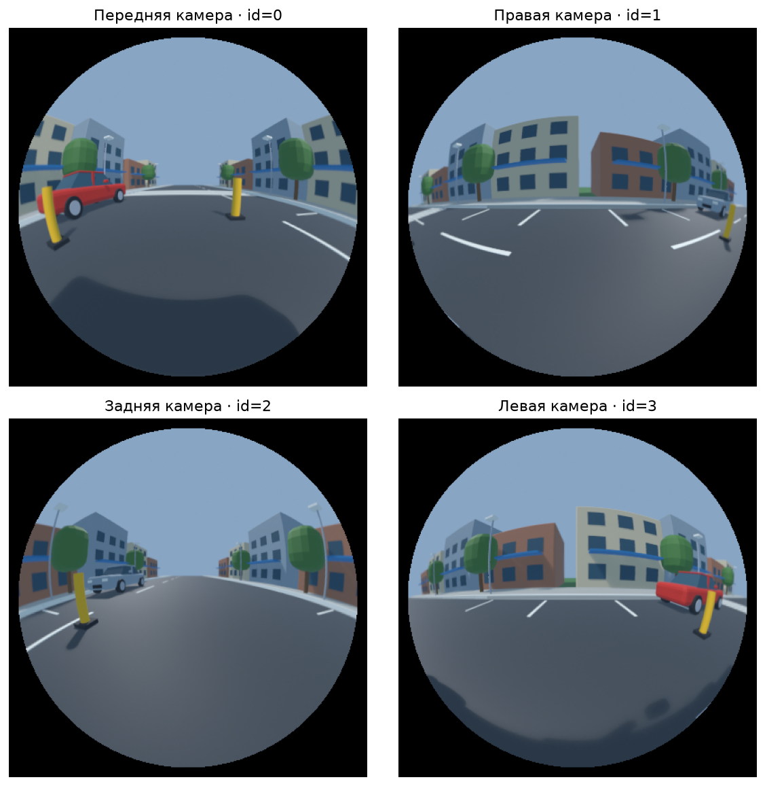

*Рисунок 3.9 — Реальные выходы offline Blender→fisheye конвертера, четыре разнесённых центра. Чёрная область лежит вне заявленного theta-bound и не считается наблюдением камеры.*

Набор поступает в существующий `sv-server` как replay-manifest. В 0.6.0 запись также можно передать через четыре Unix/TCP source endpoints; генерация самой 3D-записи остаётся offline. После projection/fusion сервер формирует изображение купола и нижнего пола, виртуальная камера находится внутри оболочки.

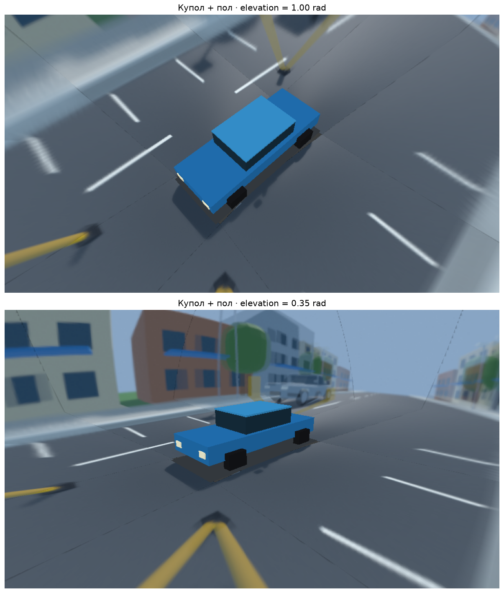

*Рисунок 3.10 — GLES readbacks одного набора на поверхности «купол + пол»: сверху elevation=1.00 rad (NVIDIA), снизу elevation=0.35 rad (Mesa llvmpipe). Это иллюстрация двух ракурсов, а не сравнение backend timings. Растяжения столбиков и двоение объектов показывают ограничения текущей surface projection и feather blending.*

Уличная геометрия содержит объёмные объекты, поэтому соответствие предположению о плоском полу нарушается наблюдаемым способом. При правильной калибровке такая ошибка сохраняется: калибровочная точность и качество переноса сцены на условный носитель — разные критерии. Новый depth capture создаёт основу для E-STITCH-01, но его точность на аналитических примитивах и независимые validation scenes ещё требуется проверить.

Скрипты мира и иллюстраций хранятся обычным Git. По решению пользователя Git LFS не используется; готовый авторский `.blend` сохранён в `assets/scenes/metric-street/` с provenance, а полные capture/replay-серии остаются в локальном `artifacts/`. Каталог исходных материалов и восстановление мира — [[engineering/ASSETS]]. Инструкция [[engineering/BLENDER]] задаёт команды повторения, [[validation/BLENDER_SMOKE]] — выполненные проверки. Скрипт рисунков [plot_blender.py](plot_blender.py) расположен рядом с этой главой.

## 3.14 Варианты носителя и диагностика вклада камер

В 0.4.0 добавлены цилиндр с круглыми полом/крышкой и кубическая оболочка с четырьмя стенами, квадратным полом и крышей. Они используют тот же fragment projection, что купол: заранее сшитая карта не создаётся. Форма замыкает видимое пространство виртуальной камеры, но не делает стену истинной геометрией окружающих объектов. Существующее разделение между носителем и texture representation [S26], изложенное в главе 1, сохраняется.

Parser и команды сервера используют одну функцию `safe_view`. Она проверяет зазор 0.25 m до пола и границ оболочки; sphere использует длину eye, cylinder — XY-радиус и высоту, cube — абсолютные X/Y и высоту. Outward winding проверяется CPU-тестами; три оболочки проверены GLES readback на 36 ракурсах без входных камер. Диагностика позволяет отличить opaque fallback от действительно наблюдаемого изображения.

Пусть $e_i$ — расстояние проекции до ближайшего края изображения, $\theta_i$ — угол к оси камеры, $\delta$ — ширина перехода, $p$ — степень. Реализованы:

$$
b_i=\min(1,\max(0,e_i/\delta)),\qquad a_i=\cos^p\theta_i.
$$

Edge-feather использует $w_i=b_i$, angular-feather — $w_i=b_i a_i$. Hard best-angle выбирает валидную камеру с максимальным $a_i$; при равенстве побеждает меньший ID. Угловое предпочтение — инженерная эвристика; оно не является photometric correction или seam optimization. Feather нормирует linear-RGB сумму при положительном знаменателе; hard не усредняет источники. При отсутствии наблюдения выводится заливка. Нормированное смешивание рассмотрено в [[diploma/01_THEORETICAL_FOUNDATIONS]]; graph-cut/multi-band остаются следующими методами.

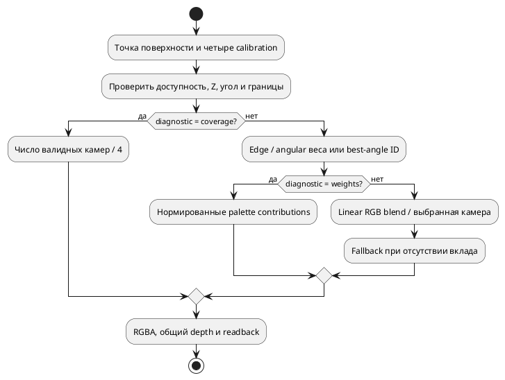
```plantuml
@startuml
start
:Точка поверхности и четыре calibration;
:Проверить доступность, Z, угол и границы;
if (diagnostic = coverage?) then (да)
  :Число валидных камер / 4;
else (нет)
  :Edge / angular веса или best-angle ID;
  if (diagnostic = weights?) then (да)
    :Нормированные palette contributions;
  else (нет)
    :Linear RGB blend / выбранная камера;
    :Fallback при отсутствии вклада;
  endif
endif
:RGBA, общий depth и readback;
stop
@enduml
```

*Рисунок 3.11 — Реализованные ветви fusion и диагностики. Маска кузова обрабатывается на полу до проекции; в диагностике ego-модель не перекрывает карту.*

Native `GPU_FUSION_MODES` проверяет независимые ожидаемые RGB для равных и угловых весов, равенство/отказ hard-selection и coverage от нуля до четырёх камер. Например, равная linear-смесь red/green/blue/white даёт sRGB около (188,188,188), а не (128,128,128). Канонические тесты не используют ground truth самой Blender-сцены. Контракт JSON и команды — [[engineering/RENDERING]], первый screening — §4.12.

## 3.15 Универсальный клиент и конфигурация транспорта

В 0.5.0 общий SV01 codec выделен в `sv-wire`, а асинхронное подключение/сессия/команды/кадры — в `sv-client-lib`. Публичный C++17 API не зависит от Qt/OpenCV/EGL; installed target `sv::client` используется самостоятельным CMake consumer. GUI Bridge переносит события библиотеки на UI thread, копирует QImage и освобождает серверный буфер. Headless probe использует тот же API.

| Ответственность | Реализация | Проверка |
|---|---|---|
| Транспорт | Asio generic stream socket, Unix/TCP adapters | Native/headless/Qt TCP и прежний Python Unix |
| Разрешённые listeners | Строгий блок connections; только явно включённые endpoints | Unix-only без IP sockets в `/proc`, TCP-only без Unix files, combined |
| Сессия | Control handshake, случайный token связывает data | Restart/reconnect; новая сессия не повторяет pending команды |
| Результат | Immutable owning Message, RGBA/stride/origin/IDs validation, explicit release | Invalid payload, copied frame, installed consumer |
| Завершение | Stop/join/close и ограниченные очереди | Native lifecycle, CPU ASan/UBSan |

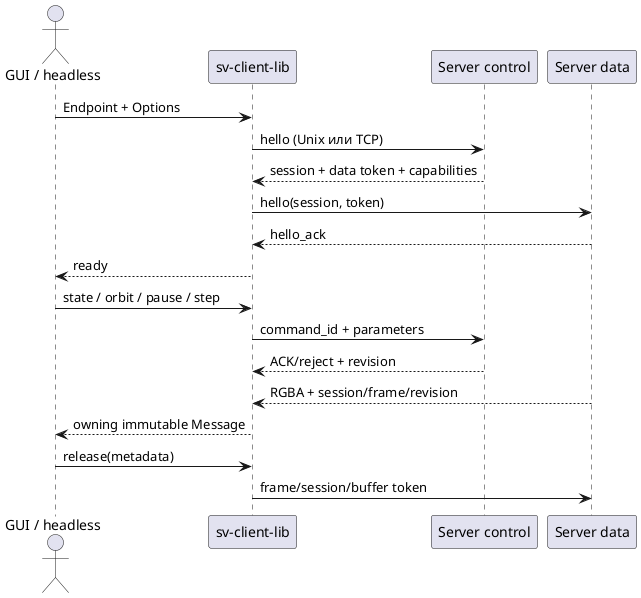
```plantuml
@startuml
actor "GUI / headless" as App
participant "sv-client-lib" as Lib
participant "Server control" as Ctl
participant "Server data" as Data
App -> Lib : Endpoint + Options
Lib -> Ctl : hello (Unix или TCP)
Ctl --> Lib : session + data token + capabilities
Lib -> Data : hello(session, token)
Data --> Lib : hello_ack
Lib --> App : ready
App -> Lib : state / orbit / pause / step
Lib -> Ctl : command_id + parameters
Ctl --> Lib : ACK/reject + revision
Data --> Lib : RGBA + session/frame/revision
Lib --> App : owning immutable Message
App -> Lib : release(metadata)
Lib -> Data : frame/session/buffer token
@enduml
```

*Рисунок 3.12 — Одинаковый клиентский контракт для Unix и TCP. Сервер не открывает отключённые transport endpoints; UDP не реализован.*

`state` возвращает авторитетные view/paused/fusion/revision без мутации. После нового data handshake сервер повторяет готовый результат даже на паузе. Replay использует интервалы scenario timestamps manifest; decode/upload/mesh counters позволяют проверить повторное использование входов при повороте. Сетевые часы не считаются локальными: GUI не вычитает server monotonic timestamp из client timestamp.

Библиотека покрывает опубликованные команды текущего сервера. Runtime calibration/source-management/config editing, UDP и несколько клиентов остаются расширениями. Полный рабочий API, defaults/deadlines, server JSON и примеры — [[engineering/CLIENT_LIBRARY]]. Испытание между двумя физическими машинами и Аврора остаются открытыми.

## 3.16 Асинхронные источники и виртуальные камеры

Покадровое чтение файлов в GL-потоке связывало отзывчивость виртуальной камеры с диском и декодированием. Например, команда orbit при уже имеющихся текстурах могла ждать очередного PNG. Решение выделяет подготовку входов в `sv-sources`: интерфейс `FrameSource` возвращает owning кадры и завершения команд через ограниченный mailbox. Выбранный при запуске backend имеет один worker; OpenGL и Synchronizer остаются у основного потока. Общий thread pool здесь не требуется: replay сериализует свою временную шкалу, а socket worker обслуживает четыре независимых потока Asio.

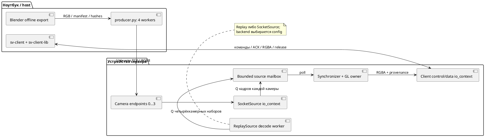
```plantuml
@startuml
left to right direction
package "Ноутбук / host" {
  [Blender offline export] as B
  [producer.py: 4 workers] as P
  [sv-client + sv-client-lib] as C
}
package "Устройство сервера" {
  [Camera endpoints 0…3] as E
  [SocketSource io_context] as S
  [ReplaySource decode worker] as R
  [Bounded source mailbox] as Q
  [Synchronizer + GL owner] as G
  [Client control/data io_context] as N
}
B --> P : RGB / manifest / hashes
P -> E : Unix или TCP / RGB8
E --> S
S -> Q : Q кадров каждой камеры
R -> Q : Q четырёхкамерных наборов
Q --> G : poll
G --> N : RGBA + provenance
C <-> N : команды / ACK / RGBA / release
note bottom of R : Replay либо SocketSource;\nbackend выбирается config
@enduml
```

*Рисунок 3.13 — Раздельные producer и client endpoints; аппаратный adapter пока не реализован. Двухмашинное размещение показано как поддерживаемая топология, проверена передача на localhost.*

| Решаемая проблема | Механизм | Проверяемое следствие |
|---|---|---|
| Decode задерживает обработку ракурса | Worker и неблокирующие request/poll | Injected blocked loader не блокирует API GL-владельца |
| Команда pause обгоняет незавершённый decode | Source completion barrier | После ACK нет нового decode; step даёт ровно один набор |
| Общая очередь вытесняет одну из четырёх камер | Отдельная квота Q на camera ID | При насыщении остаются Q последних кадров каждой камеры |
| Producer переподключается с sequence=0 | Новая session, сохранение локального sequence | Synchronizer принимает новые кадры без ложного duplicate |
| Время ноутбука принимается за время устройства | Сохранение source clock domain отдельно от server delivery | Не выполняется вычитание несопоставленных monotonic clocks |
| Повреждённый поток останавливает весь сервер | Отдельный channel и deadline | Закрывается только проблемный camera endpoint |

Для socket source принимаются RGB8 top-left без padding, размеры и calibration ID должны совпасть с конфигурацией. Handshake выдаёт source session, последующие сообщения содержат source sequence и timestamps. Ограничение возраста и skew пока использует server delivery. Следовательно, READY нельзя интерпретировать как синхронность экспозиции: сеть, decode и планировщик способны изменить задержки. Для аппаратного опыта необходимо измерить sensor timestamps, смещение часов и неопределённость сопоставления. Исходная временная метка сохраняется в output provenance и не теряется при преобразовании.

На паузе socket worker продолжает читать и проверять поток, но отбрасывает новые входы. Это предотвращает накопление старого видео до resume; принятые до pause кадры обрабатываются перед completion. `step` имеет смысл только для конечной replay-последовательности, поэтому socket backend отклоняет его без изменения revision. Клиент узнаёт доступные операции из capabilities.

Host producer проверяет хэши и calibration IDs записи, читает изображения четырьмя потоками и передаёт их в отдельные сокеты. Он позволяет использовать сохранённый Blender-мир как источник данных без создания `/dev/video*`. Он пока не рендерит интерактивный мир; автоматический reconnect с ограниченным budget и новыми сессиями реализован в следующем подразделе. Прямой VideoCapture backend отложен до реализации ограниченного shutdown: блокирующий вызов драйвера нельзя считать отменяемым только потому, что он перенесён в thread.

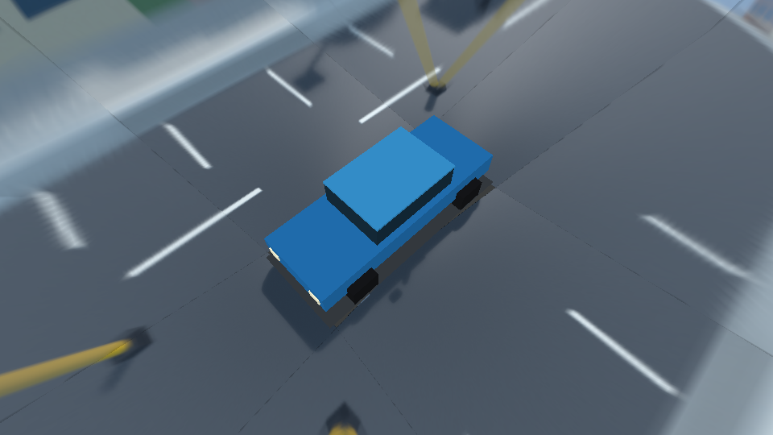

*Рисунок 3.14 — Actual RGBA readback `sv-server` на RTX 5070 Ti: Blender recording → четыре Unix producer sockets → купол + пол. Показано сохранённое окружение автомобиля; растяжения и швы текущей проекции остаются предметом исследования качества. Рисунок публикует `plot_blender.py --socket-validation`; это не рендер внешней Blender-камеры.*

Решение и пределы подтверждаются собственным кодом: [source.hpp](../../include/sv/source.hpp), [replay.cpp](../../src/sources/replay.cpp), [socket.cpp](../../src/sources/socket.cpp), [producer.py](../../tools/producer.py). Подробный контракт и команды — [[engineering/SOURCES]], результаты — [[validation/SOURCES_SMOKE]]. Свойства thread pool, драйверов и realtime Blender, которые в коде отсутствуют, этим компонентам не приписываются.

## 3.17 Восстановление producer и сохранение актуальности

Однократное подключение завершало camera worker при первом разрыве. Это мешало независимо перезапускать сервер во время настройки: остальные процессы приходилось запускать заново. Host producer теперь различает transport failure, ошибку протокола и пользовательскую остановку. Каждая камера имеет собственные retry budget, socket timeout и interruptible backoff. EOF/timeout закрывает текущий socket целиком; новый handshake создаёт новую session, source sequence начинается с 0. Успешный send сбрасывает budget, malformed handshake завершает данную камеру без повторов.

При восстановлении недостаточно повторить все пропущенные кадры: такой burst создаёт запоздалое видео и быстро переполняет bounded server queue. Producer сохраняет общий epoch записи и перед очередным send сравнивает текущее monotonic время с запланированным. Если lateness превышает настроенный budget, ряд учитывается как пропущенный. Проверка повторяется после handshake, поскольку сам connect мог задержать кадр. Это ограничение возраста до send, а не гарантия свежести sensor exposure на сервере.

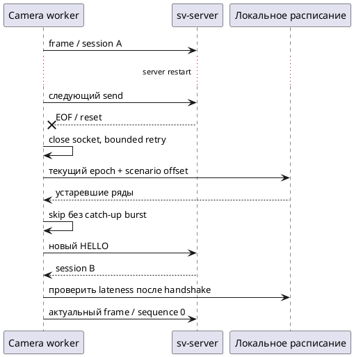
```plantuml
@startuml
participant "Camera worker" as P
participant "sv-server" as S
participant "Локальное расписание" as T
P -> S : frame / session A
... server restart ...
P -> S : следующий send
S --x P : EOF / reset
P -> P : close socket, bounded retry
P -> T : текущий epoch + scenario offset
T --> P : устаревшие ряды
P -> P : skip без catch-up burst
P -> S : новый HELLO
S --> P : session B
P -> T : проверить lateness после handshake
P -> S : актуальный frame / sequence 0
@enduml
```

*Рисунок 3.15 — Восстановление одного источника без накопления application backlog. Уже переданные в kernel байты не отзываются; камеры восстанавливаются независимо.*

JSON/Markdown отчёт содержит четыре camera records с числами отправок, late/missing skips, transport errors, reconnects и временем блокировки send. Запись отчёта не создаёт unbounded history: сохраняются счётчики и последняя session/error. `completed` описывает завершение расписания; type 10 не имеет ACK обработки, поэтому sent нельзя объявлять числом кадров, использованных рендерером. При stop сохраняются частичные результаты; отказ одной камеры не завершает workers остальных камер.

Испытания используют настоящий sv-server с перезапуском на Unix/TCP и отдельные socket receivers для blocked handshake/slow read. Наблюдается восстановление четырёх READY inputs с новыми sessions, а просроченные ряды пропускаются. Методика/первичные отчёты — [[validation/PRODUCER_RECOVERY]], рабочие параметры — [[engineering/SOURCES]]. Двухмашинная синхронизация часов, долговременный RSS и аппаратный capture этим опытом не подтверждаются.

## Выводы по третьей главе

Создан рабочий Linux-прототип с четырёхкамерным отображением, управляемым ракурсом, независимыми математическими проверками, калибровкой по известным точкам и локальным IPC. Использование GLM и Boost.Asio связано с конкретными обязанностями: матрицами виртуальной камеры и отдельным потоком сокетов. Владение GL и ограничения очередей остаются явными.

Прототип теперь включает реальный OpenCV, photo-demo, native отчёты, начальный локальный OpenCV/V4L2 source и проверенную Linux RPM-упаковку. Реальные камеры ещё не подключались, длительные измерения и приложение Авроры не проверены. Эти ограничения определяют границы выводов следующей главы.

## Источники

Каталог: [[references/VISION#S04|S04]], [[references/DEVELOPMENT#S25|S25]], [[references/DEVELOPMENT#S26|S26]], [[references/PLATFORM#S20|S20]], [[references/PLATFORM#S21|S21]], [[references/DEVELOPMENT#S54|S54]], [[references/DEVELOPMENT#S55|S55]], [[references/DEVELOPMENT#S56|S56]], [[references/DEVELOPMENT#S57|S57]], [[references/DEVELOPMENT#S58|S58]], [[references/DEVELOPMENT#S64|S64]]. Дата обращения — 05.10.2026. Собственные алгоритмы и ограничения соотносятся с исходниками, а не приписываются этим источникам.

[S04]: https://docs.opencv.org/4.13.0/db/d58/group__calib3d__fisheye.html
[S25]: https://ceres-solver.readthedocs.io/latest/nnls_tutorial.html
[S26]: https://registry.khronos.org/OpenGL/specs/es/3.0/es_spec_3.0.pdf
[S20]: https://developer.auroraos.ru/doc/software_development
[S21]: https://developer.auroraos.ru/doc/software_development/reference/public_api
[S54]: https://github.com/g-truc/glm/blob/1.0.3/manual.md
[S55]: https://www.boost.org/doc/libs/latest/doc/html/boost_asio/overview/core/threads.html
[S56]: https://registry.khronos.org/EGL/extensions/MESA/EGL_MESA_platform_surfaceless.txt
[S57]: https://doc.qt.io/qt-6/qquickimageprovider.html
[S58]: https://registry.khronos.org/EGL/extensions/EXT/EGL_EXT_platform_device.txt
[S52]: https://registry.khronos.org/OpenGL/extensions/EXT/EXT_disjoint_timer_query.txt
[S59]: https://developer.auroraos.ru/doc/sdk/tools/mb2
[S60]: https://developer.auroraos.ru/doc/software_development/guidelines/rpm_requirements/spec_requirements
[S61]: https://developer.auroraos.ru/doc/sdk/tools/rpm_validator
[S62]: https://developer.auroraos.ru/doc/sdk/tools/rpmsign_external
[S63]: https://polyhaven.com/a/urban_street_01
[S64]: https://docs.opencv.org/4.13.0/d8/dfe/classcv_1_1VideoCapture.html
[S65]: https://docs.opencv.org/4.13.0/d9/d0c/group__calib3d.html
[S67]: https://developer.auroraos.ru/doc/5.1.4/sdk/app_development/work/create/create_new_project

## Дополнение: воспроизводимые ошибки монтажа и extrinsics solver

`tools/blender/scenario.py` валидирует компактный world recipe и формирует фактический rig из nominal. `src/vision/extrinsics.cpp` реализует known-intrinsics pose fitting с настоящим OpenCV, отдельный CLI adapter находится в `src/apps/calibrate_extrinsics.cpp`. Comparison service `tools/calibration/study.py` вызывается через существующий configurator и пригоден для дальнейшей интеграции в simulator GUI. Каждый слой отделяет train input от evaluator truth; численные результаты и рисунки — [[diploma/04_EXPERIMENTAL_STUDY#4.17 Восстановление положения камер при ошибках монтажа]]. Native solver ещё не подключён к серверному job API; offline export не меняет active config.

Добавлена команда `sv-calibrate board-observations`: она детектирует chessboard corners реальным OpenCV на четырёх наборах изображений и строит metric XYZ в координатах автомобиля из измеренных поз шаблона. Для симметричного узора оператор явно сверяет порядок углов с маркировкой и нумерованным preview. Качество детектора и точность по физическим камерам не измерены; предыдущая сравнительная серия остаётся синтетической. Формат, ограничения и запуск приведены в [[engineering/USAGE#OpenCV: внешняя калибровка по изображениям]].

## 3.18 Первые runtime-инструменты камеры, калибровки и задержек

После подготовки этого раздела в server loop добавлен `CalibrationJobManager`: клиент отправляет training и отдельные validation наблюдения, получает асинхронный job ID, запрашивает метрики и может применить вычисленную позу камеры. На validation наборе вычисляются RMSE и максимальная ошибка; применение блокируется при RMSE >3 px или максимуме >8 px. Это временные программные пороги, требующие подбора на физических данных. Применение строит candidate renderer до сохранения новой конфигурации, затем записывает JSON и переключает renderer; ошибка подготовки или persistence оставляет прежнюю пару config/renderer. Jobs ограничены по очереди/памяти и принадлежат control-session; отдельная команда отменяет задания, отключение клиента также помечает его jobs отменёнными. Вызов OpenCV нельзя прервать внутри, поэтому текущий solver заканчивается, но его результат отбрасывается. Revision-checked persistence отвергает второй кандидат, если после старта job активная конфигурация изменилась; отдельный stress-тест race двух одновременных apply не проводился. Подтверждение позы реальной камерой не реализовано. Клиент обязан передавать validation данные, не участвовавшие в подборе, но сервер пока не может доказать их независимость. Кнопка запуска калибровки в `sv-simulator` отключена, поскольку GUI пока не собирает достоверные observations.

Для локальных камер сервер теперь выбирает `source.type=camera`, открывает четыре пути `/dev/video*` через OpenCV `VideoCapture`, приводит BGR/grayscale/BGRA к RGB8 и отбрасывает неожиданные разрешения. Метка времени ставится на host после получения кадра; она не является сенсорным timestamp. OpenCV скрывает детали backend устройства, а `read()` может блокироваться внутри драйвера, поэтому поведение остановки и повторного подключения ещё надо измерить с целевыми камерами [[references/DEVELOPMENT#S64|S64]]. Конфигурация `configs/v4l2-camera.json` содержит синтетические размеры и параметры калибровки и служит только примером формата.

В trace и кадр-метаданные включены измеряемые coarse intervals: время опроса источника, подготовка до рендера, wall time рендера, nullable GPU draw query, CPU upload/readback-copy и enqueue результата. Значение `server_receive_to_render_ms` опирается на локальную шкалу доставки кадров. Эти интервалы частично перекрываются и их нельзя суммировать; раздельные decode, очередь, синхронизация, projection/fusion и клиентский present пока не измеряются. См. [[engineering/USAGE#Запуск сервера с локальными V4L2 камерами]] и [[engineering/CLIENT_LIBRARY]].

## 3.19 Переключение исследуемых режимов на работающем сервере

Для исследования важна возможность сравнивать альтернативы в том же серверном pipeline, который используется конечным клиентом. Поэтому исследовательская сборка сохраняет набор алгоритмов и их параметров; выбор единственной эксплуатационной конфигурации является результатом опытов, а не предварительным сокращением реализации.

Первый реализованный контракт `fusion_runtime_v1` предоставляет каталог трёх GPU-режимов (`edge_feather`, `hard_best_angle`, `angular_feather`), переключение `color/coverage/weights`, ширины feather и степени углового веса. Клиентская библиотека предоставляет типизированные методы получения каталога и изменения настроек. Сервер проверяет параметры общей схемой конфигурации и сопоставляет `base_config_revision` с активной версией. Валидированный snapshot применяется между вызовами render; shader uniforms используют весь новый набор параметров. GPU-ресурсы и входные текстуры для этого не пересоздаются.

```plantuml
@startuml
participant "Клиент через sv-client-lib" as C
participant "sv-server / command loop" as S
participant "ConfigStore" as K
participant "Renderer / GPU" as R
C -> S : fusion_catalog / state
S --> C : modes, limits, fusion, config_revision
C -> S : configure_fusion(base revision, full fusion)
S -> S : parse_config: проверка кандидата
S -> K : update_runtime_if_revision
alt актуальная revision и валидные параметры
  K --> S : новый temporary snapshot
  S -> R : set_fusion между render calls
  S --> C : accepted + revisions + settings
  S -> R : render того же paused frame set
  R --> C : RGBA через server data channel
config_revision + settings + input IDs
else ошибка или stale revision
  K --> S : отказ без публикации
  S --> C : rejected, прежнее состояние
end
@enduml
```

*Рисунок 3.19 — Реализованный порядок изменения fusion. Общий сценарный исполнитель и переключение остальных стадий пока не реализованы.*

Интеграционная проверка останавливает replay, переключает каждый режим и сверяет идентичность входных frame IDs, отсутствие повторных upload/mesh rebuild, а также версию и параметры результата. После восстановления полного исходного fusion проверяется побайтовое совпадение RGB; дополнительно проверяются неизвестные поля, недопустимые параметры и stale revision. GTest проверяет валидацию и отсутствие записи temporary snapshot в файл. Эти проверки доказывают механизм управления, но не превосходство алгоритмов и не их целевую производительность.

Настройки не сохраняются командой `configure_fusion`; они доступны до последующих изменений/завершения сервера. Существующее persistent применение калибровки сохраняет весь актуальный snapshot, поэтому в этой версии требуется восстановление baseline до него. Ограниченный lease с автоматическим rollback fusion/pause при disconnect реализован в §3.21; history reset, общий ConfigService и GUI сценариев остаются следующими этапами. Полный контракт: [[engineering/PROTOCOL_IMPLEMENTED]], план: [[architecture/RESEARCH_RUNTIME]].

## 3.20 Декларативный сценарий сравнения серверных реализаций

Общий application service `examples/common/research` отделён от Qt и CLI. `svctl research` читает версионированный JSON и вызывает этот сервис; будущий GUI сможет вызывать его в рабочем потоке с callback прогресса и cancellation token. Сервис общается с сервером только через `sv-client-lib`, не читает и не переписывает server config. Строгая схема запрещает неизвестные поля и исполняемые команды, ограничивает количество вариантов и кадров.

Первый сценарий сравнивает режимы fusion на текущем остановленном READY frame set. На каждом полном блоке порядок вариантов перемешивается с фиксированным seed; измерительные блоки следуют после прогревочных. Применение каждого профиля подтверждается ACK, а получение нужного результата проверяется по state/config revision, actual fusion и input IDs. RGBA SHA-256 позволяет проверить повторяемость каждого профиля и восстановление исходного изображения. Для настоящего парного опыта с последовательностями далее требуется reset/seek временной истории и одинаковый набор кадров для всех методов.

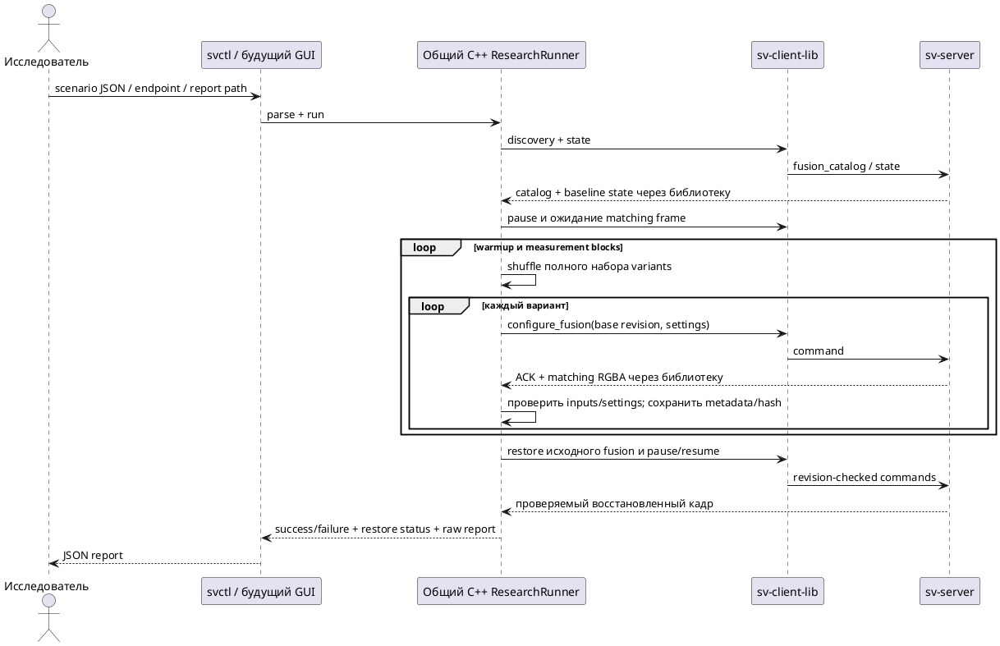
```plantuml
@startuml
actor "Исследователь" as U
participant "svctl / будущий GUI" as A
participant "Общий C++ ResearchRunner" as E
participant "sv-client-lib" as L
participant "sv-server" as S
U -> A : scenario JSON / endpoint / report path
A -> E : parse + run
E -> L : discovery + state
L -> S : fusion_catalog / state
S --> E : catalog + baseline state через библиотеку
E -> L : pause и ожидание matching frame
loop warmup и measurement blocks
  E -> E : shuffle полного набора variants
  loop каждый вариант
    E -> L : configure_fusion(base revision, settings)
    L -> S : command
    S --> E : ACK + matching RGBA через библиотеку
    E -> E : проверить inputs/settings; сохранить metadata/hash
  end
end
E -> L : restore исходного fusion и pause/resume
L -> S : revision-checked commands
S --> E : проверяемый восстановленный кадр
E --> A : success/failure + restore status + raw report
A --> U : JSON report
@enduml
```

*Рисунок 3.20 — Сценарное управление существующими серверными алгоритмами. Независимая оценка качества и GUI пока не подключены.*

Отчёт содержит нормализованный сценарий и его SHA-256, исходное состояние, GPU/backend, revision и fingerprint серверных исходников, фактический порядок вариантов, метаданные и хеши кадров. p50/p95 вычисляются nearest-rank методом отдельно для каждого варианта, исключая warmup; raw samples сохраняются. На столь малой выборке квантили описательны и не дают доказательства устойчивого преимущества.

Принципиальное ограничение — warm-render одного набора: нет новых capture/decode/upload для каждого sample. Поэтому эти значения не превращаются в оценку sustained FPS и не смешиваются с live pipeline performance. Input IDs не заменяют content hashes независимого dataset. Сравнение качества требует отдельного evaluator с Blender/physical truth, заранее выбранных метрик и новых сцен.

Контрактные тесты проверяют схему и бюджет; Unix/TCP интеграция использует настоящие библиотеку и сервер, сверяет полные блоки, inputs, hashes и неизменность config file. Native GTest на живом endpoint проверяет cancel и исключение progress callback после первого кадра с успешным restore. Report отмечает restore failure клиента; ограниченный server lease/watchdog из §3.21 восстанавливает fusion/pause независимо от штатного cleanup клиента, пока server loop продолжает выполняться. Подробная приёмка: [[validation/RESEARCH_RUNTIME]].

## 3.21 Серверный lease и восстановление после потери исследовательского клиента

Клиентский cleanup недостаточен при аварии ноутбука, процесса или сети. Поэтому добавлен ограниченный lease `experiment_lease_v1`, принадлежащий control session. При acquire сервер фиксирует исходные fusion и pause; срок составляет 250..30000 ms по серверным монотонным часам. Renew продлевает тот же lease; старый или чужой ID не позволяет изменять состояние. Runner продлевает lease перед trial и cleanup, а client library предоставляет типизированные acquire/renew/release и передачу ID в mutations.

Пока lease активен, допускаются изменения fusion/surface и pause/resume владельцем; изменение view и calibration mutations блокируется. Расширение §3.31 допускает также owner step при capability experiment_step_v1, без восстановления replay cursor. Это ограничение удерживает область восстановления проверяемой и препятствует persistent сохранению временного fusion через apply_calibration. Общая транзакция всех параметров сервера ещё не реализована.

```plantuml
@startuml
[*] --> Idle
Idle --> Active : acquire(owner, TTL)
сохранить fusion/pause
Active --> Active : renew от владельца
Active --> Restoring : release / TTL expired / control closed
Restoring --> Idle : config восстановлен
source ACK соответствует baseline pause
Restoring --> Failed : config/source error или timeout
Failed --> Failed : мутации отклоняются
поздний ACK не снимает ошибку
Failed --> [*] : требуется перезапуск
@enduml
```

*Рисунок 3.21 — Реализованная машина состояний ограниченного эксперимента.*

Recovery выполняется на render thread между обработками кадров. Новый config snapshot возвращает fusion, затем при необходимости отправляется асинхронный source pause/resume. ACK release подтверждает лишь переход в restoring; клиент ждёт idle либо failed. Ошибка подготовки или source recovery сохраняется в status/trace, а мутации остаются заблокированными. Timeout recovery составляет 5 s при выполняющемся server loop; watchdog не прерывает зависший GPU/драйвер и не переживает аварию самого сервера. Истечение TTL использует серверные часы и не требует синхронизации с ноутбуком.

Native tests проверяют deadlines/ownership/conflicts, интеграционные — expiry, disconnect, running/paused baseline, неизменность файла и новый lease после восстановления. Они не доказывают восстановление при half-open сети раньше TTL, ограниченность зависших физических драйверов или hard realtime. Восстанавливаются настройки и pause/resume, но не playback cursor, временная история и прежний RGB после движения записи. Durable checkpoint клиентского отчёта также остаётся открытым. Контракт и проверки: [[engineering/PROTOCOL_IMPLEMENTED]], [[validation/RESEARCH_RUNTIME]].

## 3.22 Перенос исследуемых методов сшивки в сервер

Для сравнения на целевой платформе недостаточно offline Python-реализаций: их стоимость включает другую проекцию, дискретизацию и среду исполнения. В исследовательский сервер добавлены native реализации distance feather, binary graph-cut, multiband и graph-cut/multiband. Вместе с тремя прежними GPU-вариантами каталог содержит семь режимов. Выбор выполняется командой `configure_fusion` между обработками кадров; Python сервером не запускается. Универсальный ConfigService для этого среза не требуется.

Математическое основание многомасштабного слияния — Gaussian/Laplacian representation Burt–Adelson ([[references/VISION#S10|S10]]); выбор шва отделён от blending, как в пространстве вариантов [[references/VISION#S71|S71]]. Здесь используются собственные определения offline-эталона, а не вызов `cv::Stitcher`: известные fisheye intrinsics/extrinsics и геометрия носителя сохраняются. Выбор шва не исправляет параллакс, обусловленный неверной глубиной ([[references/VISION#S73|S73]]).

Пусть $C_{i,l}$ — Laplacian уровень linear RGB камеры $i$, а $W_{i,l}$ — Gaussian уровень её маски. Смешанный уровень определяется как

$$B_l(p)=\frac{\sum_i W_{i,l}(p)C_{i,l}(p)}{\sum_i W_{i,l}(p)},$$

при ненулевой сумме весов; иначе используется ноль. Восстановление выполняется от грубого уровня к точному: $R_l=B_l+\operatorname{upsample}(R_{l+1})$. Параметр pyramid_levels ограничен 1..8; фактическое число уровней ограничивается размером изображения. В multiband исходная маска определяется краевым feather; в graph-cut/multiband сначала рассчитывается бинарный шов, затем маска сглаживается Gaussian sigma=2, ограничивается validity и нормируется. Binary энергия приведена в §4.40. В 3–4-way overlap остаётся centrality fallback, глобальная многометочная оптимизация не заявляется.

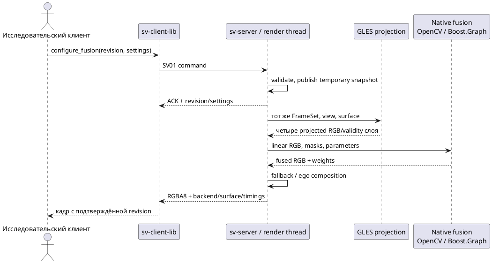
```plantuml
@startuml
actor "Исследовательский клиент" as client
participant "sv-client-lib" as lib
participant "sv-server / render thread" as server
participant "GLES projection" as gpu
participant "Native fusion\nOpenCV / Boost.Graph" as cpu
client -> lib : configure_fusion(revision, settings)
lib -> server : SV01 command
server -> server : validate, publish temporary snapshot
server --> lib : ACK + revision/settings
server -> gpu : тот же FrameSet, view, surface
gpu --> server : четыре projected RGB/validity слоя
server -> cpu : linear RGB, masks, parameters
cpu --> server : fused RGB + weights
server -> server : fallback / ego composition
server --> lib : RGBA8 + backend/surface/timings
lib --> client : кадр с подтверждённой revision
@enduml
```

*Рисунок 3.22 — Реализованное переключение и выполнение четырёх дополнительных алгоритмов на сервере.*

Новые методы используют гибридный путь: GLES проецирует камеры в конечный viewport, CPU выполняет EDT/cut/pyramids и композицию. Слои RGB8 добавляют квантизацию относительно float offline-эталона; edge weights упакованы в alpha с шагом 1/254. Поэтому численное соответствие ядра отдельно от соответствия полного raster pipeline. Дополнительные readbacks являются частью измеряемой стоимости, а три локальных GPU-метода остаются прежним одним проходом. Для CPU backend введён предел 262144 выходных пикселя, предотвращающий неограниченный рост графа и пирамид.

Геометрия также меняется без перезапуска: `configure_surface` принимает plane/bowl, dome+floor, cylinder+floor или cube+floor. Сервер проверяет параметры и безопасность текущей view, готовит mesh/GPU buffers, затем публикует snapshot. Ошибка подготовки сохраняет активную конфигурацию. Камерные изображения повторно не загружаются; перестроение сетки учитывается отдельным счётчиком. Lease расширен до fusion/surface/pause; отсутствующая surface в варианте сценария означает исходный носитель, поэтому randomized порядок не переносит геометрию предыдущего варианта.

В отчёт включены backend, surface, mesh_triangles и CPU spans. Для гибридного пути gpu_draw равен null: прежний query измерял лишь базовый draw и не характеризует четыре дополнительных прохода. Render wall включает весь renderer, а layer_readback включает ожидание GPU. Такой контракт позволяет сравнивать реализации, сохраняя различие между качеством алгоритма, стоимостью его backend и накладными расходами вывода. Проверки и ограничения: [[validation/NATIVE_FUSION]].

## 3.23 Инспекция проекционных слоёв и конвенция ненаблюдаемых данных

Для проверки полного рендера добавлен явно запрашиваемый `RenderInspection`: actual projected linear RGB, validity/edge weights, базовый fallback RGBA и depth-tested ego overlay. Обычный сервер не запрашивает capture. Этот render-thread API не является сетевой подпиской и не добавляет Python-зависимость серверу. Проверочный executable использует тот же Renderer и позволяет независимо пересчитать fusion/композицию средствами NumPy/SciPy. При capture и без него изображение совпадает, входы повторно не загружаются.

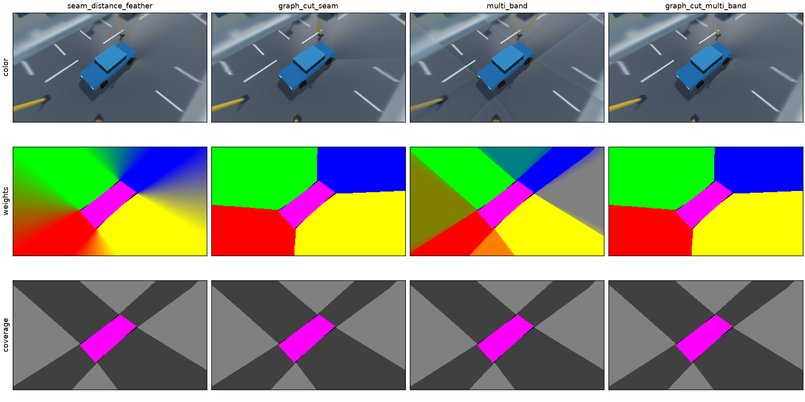

*Рисунок 3.23 — Фактические GLES/CPU изображения Blender-улицы: четыре native метода, строки color/weights/coverage, output 320×180, dome+floor. Это один replay frame и один ракурс, не сравнительная выборка качества. В weights graph-cut/multiband показана исходная cut mask до smoothing; она не описывает вклады всех частотных уровней. Рисунок сформирован `plot_native_fusion.py` из raw RGBA; config, source fingerprint и хэши сохранены рядом в JSON.*

Важное условие pyramid filtering — определение RGB за границей validity. Если сохранять там случайный либо clamped RGB, Gaussian/Laplacian уровни могут переносить ненаблюдаемые значения в наблюдаемую область. В версии validity_zero_extension_v2 используется $\widetilde I_i(p)=M_i(p)I_i(p)$ до построения цветовой пирамиды. Проверяется инвариант: изменение $I_i$ при $M_i=0$ не меняет результат. Нулевое продолжение определяет поведение метода, но не восстанавливает скрытые поверхности; оно само может давать тёмные полосы, видимые на иллюстрации multiband. Другие способы продолжения и нормированная свёртка требуют отдельного сравнения.

Проверка готового изображения разделена на три уровня: композиция из actual layers, независимая analytic plane sampling и доставка того же RGBA через настоящий SV01 сервер (§4.42). Shared fallback/ego passes не считаются независимой истиной геометрии автомобиля. Это позволяет локализовать ошибки алгоритма, координат/квантизации и транспорта, не приписывая регрессионному тесту значение физического эксперимента.

## 3.24 Настройка серверного алгоритма из компилируемого клиента

Серверные реализации должны быть доступны любому клиенту через общую библиотеку. Поэтому GUI симулятора расширен адаптером `RuntimeSettings` на C++, а не вызовом Python configurator. Адаптер получает снимок fusion/surface и каталоги ограничений; пользователь редактирует полный объект и отправляет его с ревизией загруженного снимка. Вычисления и проверка физической допустимости поверхности остаются в сервере. Поля fusion преобразуются в типизированный `FusionSettings`; дробное число уровней пирамиды отклоняется без неявного усечения.

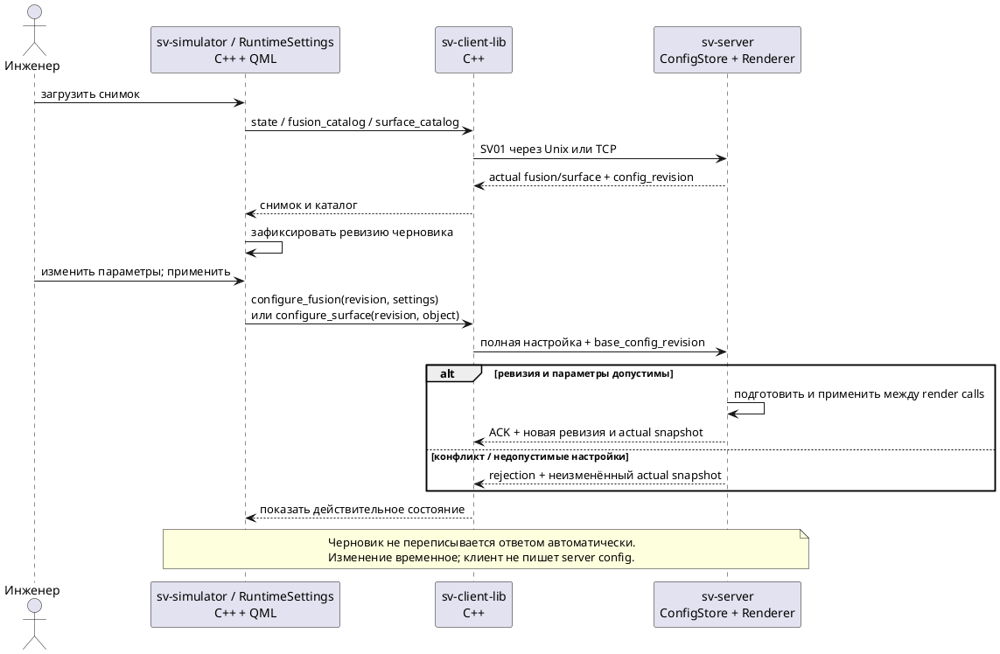
```plantuml
@startuml
actor "Инженер" as User
participant "sv-simulator / RuntimeSettings\nC++ + QML" as GUI
participant "sv-client-lib\nC++" as Lib
participant "sv-server\nConfigStore + Renderer" as Server
User -> GUI : загрузить снимок
GUI -> Lib : state / fusion_catalog / surface_catalog
Lib -> Server : SV01 через Unix или TCP
Server --> Lib : actual fusion/surface + config_revision
Lib --> GUI : снимок и каталог
GUI -> GUI : зафиксировать ревизию черновика
User -> GUI : изменить параметры; применить
GUI -> Lib : configure_fusion(revision, settings)\nили configure_surface(revision, object)
Lib -> Server : полная настройка + base_config_revision
alt ревизия и параметры допустимы
  Server -> Server : подготовить и применить между render calls
  Server --> Lib : ACK + новая ревизия и actual snapshot
else конфликт / недопустимые настройки
  Server --> Lib : rejection + неизменённый actual snapshot
end
Lib --> GUI : показать действительное состояние
note over GUI, Server
  Черновик не переписывается ответом автоматически.
  Изменение временное; клиент не пишет server config.
end note
@enduml
```

*Рисунок 3.24 — Реализованный путь редактирования fusion/surface через библиотеку. Сервер остаётся владельцем алгоритмов и конфигурации; Python не участвует в пользовательской операции.*

Ревизия защищает от потери промежуточной правки: повторное применение старого черновика отвергается, даже если интерфейс уже получил более новый actual state. При переподключении черновики очищаются. Это узкий runtime API; общий ConfigService, GUI сценариев и безопасная отдельная операция постоянного сохранения ещё требуют разработки. Протокол существующего persistent apply_calibration сохраняет весь активный snapshot, поэтому временные настройки нужно восстановить до его вызова вне lease.

Проверка включает настоящий сервер на Unix/TCP, применение, отрицательные ответы и восстановление через C++ GTest; harness проверяет неизменность файла конфигурации. Такая проверка подтверждает доступность управления и ownership, но не превосходство алгоритма, интерактивную эргономику или готовность Авроры. Независимые Python эталоны и скрипты рисунков сохраняются как исследовательские средства, отдельно от продукта: [[validation/RESEARCH_RUNTIME]].

При локальном отказе очереди библиотека выдаёт отдельный Error с command_id; ожидание ACK должно завершаться и по этому пути. Адаптер сопоставляет ID, снимает pending и показывает неподтверждённый исход, сохраняя отсутствие автоматического повторения. При потере сессии нельзя заключить из транспортной ошибки, что сервер не применил запрос. В Qt клиентах frame budget отделён от доставки ACK/lifecycle, а отброшенные кадры освобождаются. Реальный локальный отказ библиотеки покрыт отдельным C++ тестом; длительный overload GUI остаётся самостоятельной проверкой: [[validation/RESEARCH_RUNTIME]].

Отдельная ошибка обнаружена в конкуренции command/release submission: общий счётчик позволял потоку команд занять всю ёмкость и отказать освобождению уже полученного кадра. В библиотеке введены два независимых ограниченных бюджета, каждый размера command_capacity; ограничение data write queue сохраняется. Это изоляция ёмкости, а не гарантия приоритета или deadline. TCP mock с capacity=1 воспроизвёл дефект до исправления и проверил доставку RELEASE после исправления. При смене сессии GUI очищает прежнее изображение и метрики; симулятор также сбрасывает implicit calibration job. Поздний QML image-ready старого кадра не должен создавать событие present новой сессии. Проверки не заменяют длительный two-host overload: [[validation/RESEARCH_RUNTIME]].

## 3.25 Время жизни изображения при смене сессии

Идентификатор frame_id имеет смысл внутри сессии. Новый сервер или переподключение может снова выдать кадр с номером 1; поэтому Qt image URL включает percent-encoded session_id и frame_id. При потере сессии очищаются URL, изображение provider, информация об источнике и timings. Запоздалое image-ready сравнивается с текущим полным URL и не подтверждает показ изображения другой сессии, даже при совпадении frame_id.

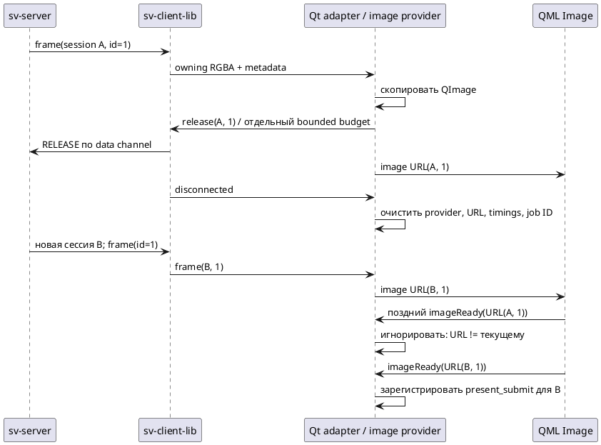
```plantuml
@startuml
participant "sv-server" as Server
participant "sv-client-lib" as Lib
participant "Qt adapter / image provider" as UI
participant "QML Image" as QML
Server -> Lib : frame(session A, id=1)
Lib -> UI : owning RGBA + metadata
UI -> UI : скопировать QImage
UI -> Lib : release(A, 1) / отдельный bounded budget
Lib -> Server : RELEASE по data channel
UI -> QML : image URL(A, 1)
Lib -> UI : disconnected
UI -> UI : очистить provider, URL, timings, job ID
Server -> Lib : новая сессия B; frame(id=1)
Lib -> UI : frame(B, 1)
UI -> QML : image URL(B, 1)
QML -> UI : поздний imageReady(URL(A, 1))
UI -> UI : игнорировать: URL != текущему
QML -> UI : imageReady(URL(B, 1))
UI -> UI : зарегистрировать present_submit для B
@enduml
```

*Рисунок 3.25 — Разделение освобождения серверного кадра и показа клиентской копии, защита от запоздалого callback прежней сессии. Diagram описывает реализованный Qt adapter; физический момент вывода панели не измеряется.*

Симулятор дополнительно сбрасывает неявно выбранную calibration job: владение задачей связано с серверной сессией, а одинаковый текстовый ID на другом сервере не означает ту же задачу. Новые endpoint и timeout проверяются до остановки прежнего клиента. Эти свойства проверяются на событийной границе GUI; wire path проверяется отдельно: [[validation/RESEARCH_RUNTIME]].

### 3.26. Завершение команды и ошибки обработки ответа

Подтверждение команды нельзя считать завершённым, пока не проверены обязательные поля ACK. Иначе повреждённое поле `accepted` после удаления записи pending оставляет потребителя без результата и без уведомления о неопределённом исходе. Реализация сначала проверяет идентификатор, boolean `accepted` и строковый `reason` при отказе, затем удаляет pending и передаёт ACK. При ошибке протокола сессия закрывается, а ожидающая команда получает `session_lost`. Это не доказательство того, что сервер не выполнил изменение: автоматическое повторение мутации запрещено политикой клиента.

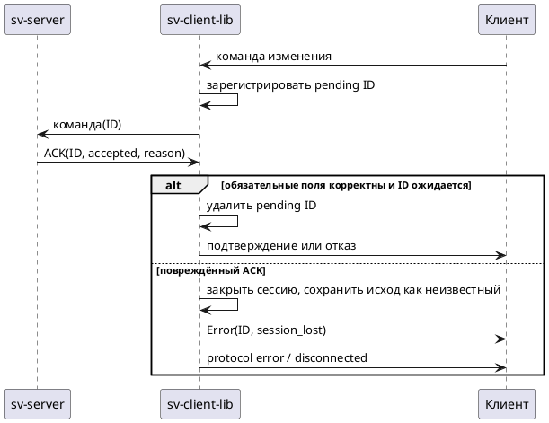
```plantuml
@startuml
participant "sv-server" as Server
participant "sv-client-lib" as Lib
participant "Клиент" as Client
Client -> Lib : команда изменения
Lib -> Lib : зарегистрировать pending ID
Lib -> Server : команда(ID)
Server -> Lib : ACK(ID, accepted, reason)
alt обязательные поля корректны и ID ожидается
  Lib -> Lib : удалить pending ID
  Lib -> Client : подтверждение или отказ
else повреждённый ACK
  Lib -> Lib : закрыть сессию, сохранить исход как неизвестный
  Lib -> Client : Error(ID, session_lost)
  Lib -> Client : protocol error / disconnected
end
@enduml
```

*Рисунок 3.26 — Проверка ACK перед завершением команды; повреждённый ответ не подтверждает и не отменяет серверное изменение.*

Дополнительная граница ошибок реализована на GUI-потоке: прикладные поля кадра и диагностики могут быть некорректны даже при допустимом транспортном конверте. Исключение закрывает соединение и очищает изображение, метрики и частичный snapshot. Симулятор инвалидирует отложенные callbacks и позволяет подключиться явно; автомобильный пример блокирует последующие события и требует перезапуска. Полная автоматическая реконструкция GUI после такой ошибки не реализована. Числа JSON допускают целую и дробную запись: нулевой GPU timing должен отображаться как измерение, а не отсутствие timer. Native mock проверяет повреждённые ACK; C++ GTest проверяет оба Qt-адаптера на событийной границе. Эти проверки не заменяют испытаний на физическом экране и Авроре: [[validation/RESEARCH_RUNTIME]].

### 3.27. Переключаемая поддержка границ pyramid fusion

В native C++ fusion добавлен `pyramid_boundary=zero|normalized`. Default zero сохраняет прежние результаты; normalized отдельно фильтрует цветовую массу и поддержку, затем делит их на каждом уменьшенном уровне. Laplacian reconstruction и fusion weights сохранены. Начальная validity остаётся критерием наблюдаемости; нормализованный вариант не создаёт новых измерений камеры.

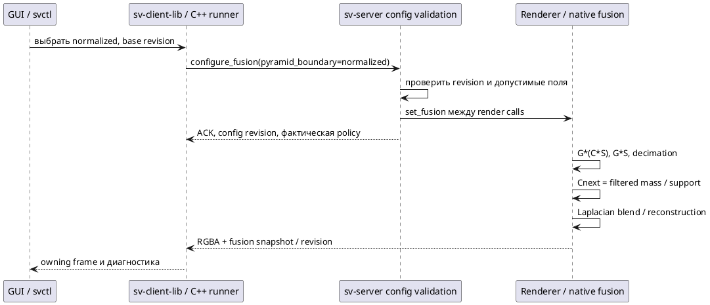
```plantuml
@startuml
participant "GUI / svctl" as UI
participant "sv-client-lib / C++ runner" as Lib
participant "sv-server config validation" as Server
participant "Renderer / native fusion" as Render
UI -> Lib : выбрать normalized, base revision
Lib -> Server : configure_fusion(pyramid_boundary=normalized)
Server -> Server : проверить revision и допустимые поля
Server -> Render : set_fusion между render calls
Server --> Lib : ACK, config revision, фактическая policy
Render -> Render : G*(C*S), G*S, decimation
Render -> Render : Cnext = filtered mass / support
Render -> Render : Laplacian blend / reconstruction
Render --> Lib : RGBA + fusion snapshot / revision
Lib --> UI : owning frame и диагностика
@enduml
```

*Рисунок 3.27 — Управление исследовательским вариантом через серверный протокол. Файл конфигурации клиент не изменяет; настройка temporary. GPU projection и CPU fusion остаются прежними стадиями гибридного backend.*

Каталог версии 3 сообщает варианты и identifier `normalized_support_v1`. Типизированная библиотека опускает default zero при отправке, сохраняя прежний формат запроса; normalized требует поддержки каталога. GUI принимает шесть базовых полей и optional policy, C++ scenario runner сохраняет её в manifest опыта. Проверки численных свойств, actual RGBA и wire, включая ограничения constant-field controls, приведены в [[validation/PYRAMID_BOUNDARY]].

### 3.28. Сценарный контракт и порядок команд библиотеки

Для воспроизводимого управления сервером составлен каталог всех 18 реализованных команд и 11 сценариев: [[engineering/PROTOCOL_SCENARIOS]]. Пять PlantUML диаграмм фиксируют подключение двух каналов, revision-aware настройку, lease/recovery, frame/release и жизненный цикл библиотеки. Каталог отделяет принятый запрос, фактическое завершение операции и получение кадра: эти события нельзя считать взаимозаменяемыми. Потеря ACK оставляет исход мутации неизвестным; автоматического повторения pending команд нет.

Проверка сценария конкурентной отправки выявила ошибку: atomic выдача command ID не гарантировала порядок последующего post в worker. При восьми отправителях сервер мог получить `3,4,5,1,2` и отвергнуть команды 1 и 2, хотя приложение не повторяло их. Выдача ID, предварительная encode validation и post теперь выполняются под одним mutex; обработчик сети и release сохраняют отдельные пути. Проверка production библиотеки через TCP mock получает 256 возрастающих IDs и accepted ACK. Полная регрессия после исправления — 49/49 наборов; результаты и пределы проверки: [[validation/CLIENT_SMOKE]]. Это обеспечение порядка внутри одного Client, а не реализация нескольких независимых сессий сервера.

### 3.29. Разделение геометрических чисел и индексов камер

Серверный parser должен отличать вещественные измерения от дискретных идентификаторов. Для геометрии записи JSON `0` и `0.0` имеют одинаковый смысл: XYZ/UV и параметры виртуальной камеры принимают конечные int64/uint64/double с преобразованием в double. Bool, строки и коллекции числами не считаются. Для camera_id допускается только целочисленный тип и диапазон 0..3; проверка выполняется до преобразования в int. Идентификаторы/revisions в decimal strings сохраняют отдельный точный uint64 parser.

Ранее XYZ/UV читались через as_double, а camera_id сужался до проверки диапазона. На Linux native regression запросы 4294967296 и 4294967297 создали jobs для камер 0 и 1. Этот дефект мог направить вычисление калибровки другой камере; отдельная команда применения ещё требовалась, но ошибочное задание уже принималось. Новый helper `src/apps/command_parameters.hpp` устраняет обе неоднозначности до выделения job ID.

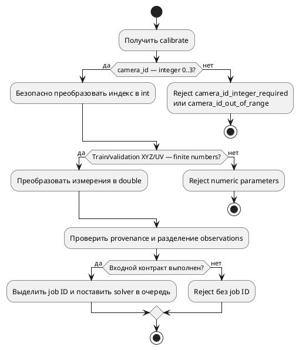
```plantuml
@startuml
start
:Получить calibrate;
if (camera_id — integer 0..3?) then (да)
  :Безопасно преобразовать индекс в int;
else (нет)
  :Reject camera_id_integer_required\nили camera_id_out_of_range;
  stop
endif
if (Train/validation XYZ/UV — finite numbers?) then (да)
  :Преобразовать измерения в double;
else (нет)
  :Reject numeric parameters;
  stop
endif
:Проверить provenance и разделение observations;
if (Входной контракт выполнен?) then (да)
  :Выделить job ID и поставить solver в очередь;
else (нет)
  :Reject без job ID;
endif
stop
@enduml
```

*Рисунок 3.29 — Предварительная проверка калибровочного запроса. Проверка индекса предшествует сужению, validation входов — постановке задания.*

GTest проверяет типы, границы и nonfinite values. Настоящий сервер отклоняет восемь некорректных camera IDs и четыре нечисловых входа без изменения config/state revisions; численно эквивалентные double и mixed integer/double запросы завершаются с совпадающими метриками до девяти десятичных знаков. Полная регрессия после исправления — 50/50, 11.10.2026. Это проверка корректности входного API, не новое подтверждение точности метода калибровки: [[validation/CALIBRATION_PROVENANCE]].

### 3.30. Проверка frame release на двух границах

Выходной кадр удерживает ограниченный серверный слот до release или закрытия data connection. Поэтому ошибки сообщения освобождения должны обрабатываться явно. В библиотеке размер metadata проверяется синхронно до post и до расходования release budget. Это предотвращает ситуацию, когда слишком большой token впервые вызывает исключение encode внутри network worker. Типы полей проверяются в том же вызывающем потоке; правильный release сохраняет независимую от command submission очередь.

На серверной границе type 22 обязан иметь пустой binary payload. Раньше достаточно было совпадения session/frame/token, даже при лишнем бинарном теле: native-server integration test получил следующий кадр. Теперь такой пакет закрывает data connection без ACK; слот возвращается при cleanup, а control ещё способен отвечать на state. Штатная библиотека при data EOF завершает свои оба канала и следует reconnect policy. Два GTest cases проверяют release до ready и при насыщении command queue; integration проверяет malformed packet и продолжение control. Результаты и границы проверки: [[validation/CLIENT_SMOKE]].

### 3.31. Последовательный native ExperimentRunner

Для парного исследования серверных алгоритмов общий C++ application service расширен до последовательности replay frame sets. Декларативный сценарий задаёт frames, варианты, warmup/repeats/seed и native RGBA capture; библиотека передаёт только команды и кадры. Python не участвует в исполнении сценария или product fusion. Сервер объявляет `experiment_step_v1` только для replay и разрешает step владельцу действующего lease. Настройки меняет сервер с проверкой revision.

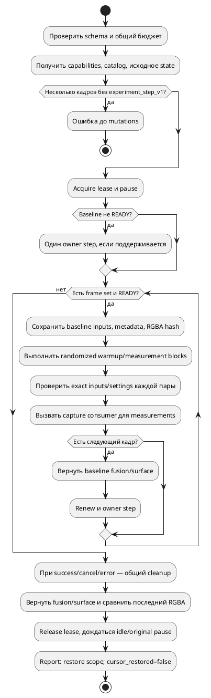
```plantuml
@startuml
start
:Проверить schema и общий бюджет;
:Получить capabilities, catalog, исходное state;
if (Несколько кадров без experiment_step_v1?) then (да)
  :Ошибка до mutations;
  stop
endif
:Acquire lease и pause;
if (Baseline не READY?) then (да)
  :Один owner step, если поддерживается;
endif
while (Есть frame set и READY?) is (да)
  :Сохранить baseline inputs, metadata, RGBA hash;
  :Выполнить randomized warmup/measurement blocks;
  :Проверить exact inputs/settings каждой пары;
  :Вызвать capture consumer для measurements;
  if (Есть следующий кадр?) then (да)
    :Вернуть baseline fusion/surface;
    :Renew и owner step;
  endif
endwhile (нет)
:При success/cancel/error — общий cleanup;
:Вернуть fusion/surface и сравнить последний RGBA;
:Release lease, дождаться idle/original pause;
:Report: restore scope; cursor_restored=false;
stop
@enduml
```

*Рисунок 3.31 — Жизненный цикл многокадрового native опыта. Исключение capture/progress или отмена выходят в общий cleanup; стрелки основного пути не обещают восстановления cursor/history.*

CLI создаёт отдельную свежую папку raw RGBA и сохраняет ссылки/hashes в samples. Report включает per-frame baseline и summaries; старый однофреймовый сценарий работает с defaults. Между кадрами исходная fusion/surface возвращаются перед step, поэтому следующий baseline не зависит от последнего случайного варианта. Watchdog защищает настройки, но lease не хранит replay cursor/history: состояние после опыта не тождественно состоянию до него по всем параметрам. Tests проверяют Unix/TCP, hash capture, отмену после перехода, исключение consumer и stale NO_INPUT preparation. Контракт и проверки: [[engineering/PROTOCOL_SCENARIOS]], [[validation/RESEARCH_RUNTIME]]; полученные исследовательские результаты — §4.45.
