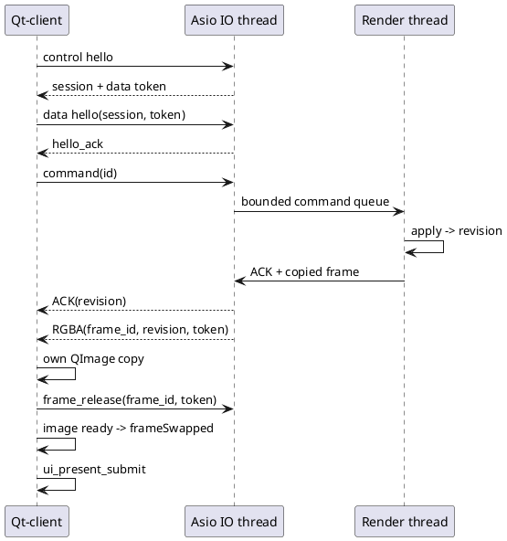

---
aliases:
  - Глава 3. Разработка системы интерактивного кругового обзора
tags: [diploma, implementation, prototype]
status: draft
updated: 2026-10-05
---

# Глава 3. Разработка системы интерактивного кругового обзора

> Описывается работающий Linux-прототип версии 0.1.0 и его проверенные ограничения. Клиент Авроры, детектор реального шаблона и полная приёмка проектных требований пока не реализованы. Текущая глава различает имеющийся код и необходимое дальнейшее развитие.

Результатом этапа разработки является воспроизводимый программный путь от четырёх известных камер до управляемого изображения в отдельном Qt Quick-клиенте. Математическое ядро, графический backend и host-приложения собраны как разные CMake targets. Помимо визуализации реализованы независимая проверка проекции, offline-оценивание параметров и сервисный критерий нарушения калибровки. Эти части дают основу для экспериментального раздела, хотя не заменяют весь комплекс для целевой платформы.

## 3.1 Формат конфигурации и калибровочных данных

Файл `configs/synthetic.json` задаёт профиль `linux-prototype-v1`, единицы m/rad/ns, размеры автомобиля, четыре камеры, bowl-поверхность, начальный ракурс, выходное разрешение и пределы синхронизации. Схема имеет явную версию 1. Неизвестные ключи и отсутствующие обязательные поля отклоняются до создания EGL-ресурсов. Матрицы записываются строками и применяются к столбцам.

Текущий профиль намеренно использует компактный набор полей. Это не полная реализация прежнего YAML-примера [[requirements/CONFIGURATION]]: отсутствуют произвольные маски, metadata resize/crop, все транспортные настройки и полноценный report-контракт. Вместо утверждения совместимости этих форматов граница зафиксирована в [[prototype/STATUS]]. Эффективный JSON сохраняется в каждом benchmark-каталоге; серия добавляет SHA-256 этого файла.

| Объект | Реализованная проверка | Причина |
|---|---|---|
| Версия и ключи | Версия 1, точный набор полей | Исключение молчаливого игнорирования |
| Камеры | Ровно четыре ID 0…3 | Однозначное соответствие текстурам |
| Матрица установки | Нижняя строка, $R^TR\approx I$, $\det R\approx1$ | Запрет отражения и неравномерного масштаба |
| Fisheye | Положительные фокусы, четыре коэффициента, нулевой скос | Соответствие выбранной модели |
| Угловой диапазон | $0<\theta_{max}<\pi/2$, положительный Z-порог | Передняя полусфера начального профиля |
| Монотонность | Минимум производной по краям и стационарным точкам | Однозначность радиального отображения |
| Поверхность | Центральная маска внутри плоской части, внешние размеры больше внутренних | Допустимая геометрия |
| Ракурс | Высота над поверхностью, расстояние и clip range | Устойчивый look-at и наблюдение сверху |
| Изображения | Размеры ограничены до выделения памяти | Согласование payload и буфера |

Для монотонности используется полином от $x=\theta^2$: $g(x)=1+3k_1x+5k_2x^2+7k_3x^3+9k_4x^4$. Проверяются концы интервала и все действительные корни $g'(x)$ внутри него. Корни находятся рекурсивным разделением интервала по корням производной и бисекцией. Это сильнее проверки только нескольких равномерных углов, хотя численные допуски всё равно ограничивают утверждение точности.

Ошибки JSON и диапазонов завершают запуск с причиной. Подробный путь любого неверного числового поля пока сообщается не во всех ветвях; это остаётся работой для полной машинной схемы. Код проверки: [config.cpp](../../src/core/config.cpp).

## 3.2 Математическое ядро

Ядро содержит векторные операции, преобразования, fisheye-проекцию, модель поверхности, сетку и преобразование sRGB. Внешняя матрица переводит точку автомобиля в физическую камеру. Проекция соответствует формулам документации OpenCV [S04], но реализована на C++ без зависимости от библиотеки OpenCV.

При вычислении используются double. Неконечные точки, Z за рабочей границей, превышение угла и выход из изображения делают наблюдение невалидным. Центральный луч имеет отдельный устойчивый предел. Виртуальные view/perspective получаются через GLM с явным `lookAtRH` и `perspectiveRH_NO` [S54], после чего приводятся к документированной строковой форме. Перед GLSL-загрузкой матрица преобразуется в column-major; transpose-флаг остаётся false, как требует используемый путь GLES.

Сетка строится по равномерным осям с дополнительными линиями $\xi=\pm a$, $\eta=\pm b$. Благодаря этому границы плоской области совпадают с рёбрами. Дубликаты координат удаляются, каждая ячейка содержит два одинаково ориентированных треугольника. При исходных 32 ячейках на ось фактическое добавление границ даёт 2312 треугольников; при 64 — 8712. Поэтому подпись «32×32» не должна подменять фактическое число элементов.

Независимый NumPy-эталон использует $\theta=\operatorname{atan2}(\sqrt{X_C^2+Y_C^2},Z_C)$ и направление луча. C++-путь использует нормированные $X/Z,Y/Z$ и atan. На передней полусфере они математически эквивалентны, но не являются одной скопированной функцией. Проверка сравнивает 8000 точек и все признаки валидности: по 1000 точек на камеру при нулевой и ненулевой дисторсии. Дополнительно проверяются единичная длина синтетических лучей и обратная проекция пикселей. Отдельный GLSL-kernel возвращает пиксельные координаты в float-FBO; это проверяет матричную загрузку и шейдерную арифметику без смешивания с растеризацией поверхности.

Полный CPU-растеризатор итогового изображения не реализован. Следовательно, CPU/GPU-проверка подтверждает проекцию и отдельные геометрические инварианты, а не все пиксели готового изображения. Код: [math.cpp](../../src/core/math.cpp), [test_math.py](../../tests/test_math.py).

## 3.3 Первоначальная калибровка

Калибровочная утилита принимает уже найденные соответствия XYZ↔UV. Для каждой камеры оцениваются $f_x,f_y,c_x,c_y$, четыре коэффициента искажений, три компоненты малого вращения и три компоненты переноса. Фокусы параметризуются логарифмами, главная точка нормируется на размер изображения, перенос — на фиксированный масштаб. Это уменьшает различие размеров численных шагов.

Обновление вращения записывается как $R=\exp([\omega]_\times)R_0$ и вычисляется формулой Родрига. Резидуал — разность проекций и измеренных пикселей. Численный якобиан получается центральными разностями. Шаг демпфированного метода имеет вид

$$
(J^TWJ+\lambda D)\Delta\beta=-J^TWr,
\qquad D=\operatorname{diag}\bigl(\max(\operatorname{diag}(J^TWJ),1)\bigr).
\tag{3.1}
$$

Здесь $W$ соответствует Huber-взвешиванию с переходом 2 пикселя. Кандидат принимается только при уменьшении той же Huber-функции; демпфирование уменьшается при успехе и увеличивается при отказе. Общая форма устойчивых нелинейных наименьших квадратов описана в [S25]. Собственная реализация нужна для доступного первого опыта; её нельзя без дополнительных проверок считать заменой промышленному solver во всех условиях.

Обучающие и проверочные совокупности не могут содержать одинаковые XYZ. Требуются ≥30 соответствий на выборку и неплоская совокупная геометрия. После оценивания вычисляются ошибки по обеим выборкам и обусловленность нормированного якобиана. Новый набор принимается при полном численном ранге, допустимой монотонности и p95 проверочной ошибки не выше заданного порога.

Детектор шахматного или маркированного шаблона отсутствует. Наблюдения в выполненном опыте имеют известные пространственные координаты и добавленный пиксельный шум. Этап реального получения изображений, поиска точек и метрической привязки площадки должен быть реализован перед выводом о реальных камерах.

## 3.4 Контроль нарушения калибровки

Сервисный алгоритм применяет текущие параметры к независимым контрольным точкам. Для каждой камеры вычисляется p95 остатка. Состояния NORMAL, SUSPECT и RECALIBRATION_REQUIRED определяются фиксированными порогами; недостаточные или непригодные точки дают INDETERMINATE. Список кандидатов содержит камеры, для которых превышен основной порог.

Алгоритм не меняет конфигурацию при обнаружении отклонения. Повторное оценивание выполняется отдельной командой, после чего требуется проверка и экспорт. Эта граница предотвращает обратную связь, в которой диагностический признак автоматически становится непроверенной новой калибровкой.

Испытание задаёт вращение задней камеры от 0 до 2° при неизменных наблюдениях. Результаты не распространяются на случай недостаточной текстуры, дождя или движения: текущий метод не извлекает признаки из перекрытия. Его назначение — подтвердить связь геометрического смещения с контролируемой ошибкой и корректность ветвей сервисной процедуры. Перед диагностикой проверяются полный набор четырёх ID и конечные положительные пороги; неполная таблица не может молча дать NORMAL. Код: [configurator.py](../../tools/configurator.py).

## 3.5 Реализация сервера

Сервер включает загрузку конфигурации, чтение manifest, ограниченные очереди и две независимые Unix stream-сессии. Основной поток владеет EGL-контекстом, наборами кадров и виртуальной камерой. Один дополнительный поток исполняет `io_context::run()` Boost.Asio. Сокеты, таймеры и их outgoing-очереди обслуживаются только этим потоком; команды передаются рендеру через mutex-защищённую очередь.

| Ресурс | Предел текущего профиля | Поведение при нехватке |
|---|---:|---|
| Входная очередь камеры | 3 кадра по конфигурации | Удаление старейшего, счётчик |
| Очередь команд | 64 | Отрицательный ACK `control_queue_full` |
| Обработка команд за цикл | До 16 | Остальные остаются в ограниченной очереди |
| Выходной кадр | Один ожидающий release | Следующий кадр не ставится в IO-очередь |
| Очередь control-записей | 64 | Закрытие перегруженного соединения |
| Header/payload | 64 KiB / 64 MiB | Отказ до выделения полного сообщения |
| Handshake/неполное сообщение | 2 с | Закрытие соединения |
| Release | 250 мс | Закрытие data; control продолжает работу |

При сборе набора используется опорное время среди свежих последних входов, а остальные выбираются по близости в пределах окна. Будущие и просроченные кадры исключаются. Итоговое окно набора контролируется отдельно: два наблюдения по разные стороны опоры не должны вместе нарушить общий skew. При неполном наборе возвращается DEGRADED; при отсутствии пригодных — NO_INPUT.

После pause сохраняется набор и отмечается `paused`; команды ракурса продолжают создавать результаты. При сохранённых входах upload-счётчик не растёт. Step выпускает следующую строку сценария. Полный replay-clock с speed и перерасчётом anchors пока отсутствует: строки идут с периодом около 33.3 мс, исходное время остаётся metadata. Это важное отличие от полного проектного контракта времени.

Чтение PPM пока выполняется основным потоком и использует кэш последних файлов каждой камеры. Отделение декодирования в worker pool является следующим улучшением. Добавление множества Asio runner-потоков без изменения владения объектами не решает эту задачу [S55]. Код: [server.cpp](../../src/apps/server.cpp).

## 3.6 GPU-конвейер

Используется EGL-контекст GLES 3 с небольшим pbuffer и отдельным framebuffer результата. Для Mesa выбирается surfaceless platform [S56], для NVIDIA — device platform с перечислением EGL-устройств [S58]. Эти расширения относятся к проверенным настольным профилям; на Авроре backend потребуется подтвердить отдельно.

Четыре RGB8-текстуры обновляются при изменении владельца входного изображения. Сетка хранится в VBO/EBO. Vertex shader преобразует её вершины в виртуальный ракурс; fragment shader получает интерполированную пространственную точку, рассчитывает четыре проекции, валидность и веса. Граничный feather-вес зависит от расстояния до края исходного кадра. Цвет переводится из sRGB в linear RGB, смешивается с нормировкой и кодируется обратно.

Прямоугольная маска автомобиля имеет собственный нейтральный цвет. Недоступная область результата получает нулевую alpha; отсутствующий вход не заменяется крайним пикселем. Depth attachment обеспечивает корректное перекрытие треугольников в выбранном ракурсе. Детализированная модель кузова отсутствует.

GPU-результат читается как RGBA8 и один раз переворачивается по строкам в top-left. После этого ни IPC, ни UI не выполняют повторного переворота. Путь соответствует используемым правилам framebuffer, форматов и шейдеров GLES [S26]. Внутренние промежуточные readback не нужны, но финальный readback синхронен и входит в измеренное время.

Диагностический float-FBO возвращает прямую проекцию точек. Он зависит от поддержки float color attachment и сообщает ошибку при отсутствии. Полные UV/mask/weight-экранные режимы, LUT и чистые GPU timer queries пока не реализованы. Поэтому цифры benchmark имеют подпись `CPU wall render + readback`, а поле `gpu_time_ms` равно null.

## 3.7 Desktop-клиент Qt Quick и граница переноса

Клиент создаёт QGuiApplication и QQmlApplicationEngine, подключает C++-мост и QML-окно. Control handshake устанавливает сессию, после чего подключается data-сокет. Проверенные байты RGBA копируются в QImage, передаются thread-safe image provider и освобождают серверный слот. QQuickImageProvider является штатным механизмом предоставления изображений Qt Quick [S57]. Он выбран для проверяемого desktop-пути; проектный QQuickItem/QSGTexture остаётся последующим вариантом.

Интерфейс содержит изображение, три пресета, pause/resume/step и строку состояния. Drag-смещения объединяются за 33 мс, колесо меняет расстояние. Это уменьшает поток команд при частых mouse events. Команда содержит собственный ID; metadata кадра — принятую `state_revision`, что позволяет отличить новое положение от ранее выданного кадра.

После готовности изображения и события `frameSwapped` записывается `ui_present_submit`. Проверенный offscreen-тест подтверждает оба события: `ui_receive` и `ui_present_submit`. Это свидетельство software-представления Qt, а не измерение физического дисплея. На текущем стенде фактически загружен Qt 6.11.2; наличие синтаксиса QML 2.x не делает бинарный файл приложением Авроры.

Клиент восстанавливает соединение после отключения. Политика непрерывной stale-индикации и полная диагностика calibration state пока не реализованы. Код: [Main.qml](../../src/client/Main.qml), [bridge.cpp](../../src/client/bridge.cpp).

## 3.8 Offline-конфигуратор

CLI имеет режимы `calibrate` и `diagnose`. Первый читает конфигурацию и наблюдения, оценивает камеры, формирует отчёт и экспортирует принятый набор. Второй только сравнивает действующую геометрию с независимыми наблюдениями. SHA-256 наблюдений участвует в идентификаторе новой калибровки.

Принятая конфигурация записывается через временный файл с последующим rename. Уже существующий `calibrated.json` не перезаписывается: для новой версии выбирается другой каталог. Старые параметры сохраняются в исходном конфигурационном файле. Экспорт отвергается, если контроль качества не выполнен. Это даёт проверяемую историю первоначальной и повторной процедуры.

GUI отбора снимков, полный журнал площадки и совместное уточнение неизвестных поз шаблонов отсутствуют. Следовательно, offline CLI решает известную пространственную задачу, но ещё не закрывает все CAL-F-001…006 для реального объекта. Наличие отчёта синтетического набора не заменяет данные реальной установки.

## 3.9 Генератор и контролируемые данные

Генератор NumPy создаёт четыре широкоугольные камеры в известных позах. Каждый пиксель задаёт луч; для выбранных коэффициентов радиальный полином обращается численным методом. Лучи пересекают наземную плоскость и приподнятый сферический объект. Плоскость содержит клетчатую текстуру, метровые линии и движущийся наземный маркер.

Таким образом, вход строится из известной геометрии, а не из цветовой таблицы, уже рассчитанной C++-рендерером. Сфера используется для визуального показа искажений объекта, который не принадлежит условной поверхности. Этот признак особенно важен при сравнении плоскости и bowl: нельзя считать такое искажение случайной ошибкой калибровки.

Данные сохраняются в PPM и manifest с исходными временами, путями, calibration IDs, offset-полями и SHA-256 файлов. Null-путь позволяет исключить вход, offset — задать временное нарушение. При текущей загрузке автоматическая сверка всех SHA-256 ещё не выполняется; сохранённые хэши служат происхождению и воспроизводимости. Отдельная потоковая producer-программа не создана. Код: [simulator.py](../../tools/simulator.py).

## 3.10 Протокол и жизненный цикл буфера

Framing использует префикс SV01 длиной 24 байта, версию 1, тип, header size, payload size и нулевые flags. Затем следуют UTF-8 JSON и байты. Decoder накапливает неполные части, проверяет пределы и может выдавать несколько сообщений из одного чтения. Однобайтовая подача и объединённые сообщения проверены C++-тестом.

*Рисунок 3.1 — Фактический копируемый путь прототипа; момент release не является моментом физического показа.*

Выходной пакет сохраняет ID кадра, набора, принятой ревизии и последней применённой команды, состав входов и runtime-метки. Клиент возвращает session/frame/token. Дублированный или поздний release не должен освобождать другой кадр. При reconnect создаётся новая control-сессия.

Полная схема протокола также требует source IDs, всех событий времени, capabilities и списка коалесцированных команд. Эти элементы реализованы частично. Поэтому текущий framing рассматривается как совместимая основа, а не доказательство полного PRO-F-001…011. Пределы и точное подмножество опубликованы в [[prototype/STATUS]].

## 3.11 Подготовка переноса и оптимизации

Рабочая сборка проверена для Linux, Mesa и NVIDIA. Программная сборка CPU также выполнена без EGL/Qt с ASan/UBSan. Это подтверждает отделение математических проверок от graphical host, но не ABI и пакетирование Авроры.

Перенос начинается с проверки реального SDK, разрешённых зависимостей, EGL/backend, форматов и Qt integration [S20], [S21]. После этого следует собрать минимальный target-путь и повторить известные точки и контроль ориентации строк. Если Boost/GLM требуют другого способа включения, архитектурная граница позволяет изменить адаптер или dependency profile без изменения математического контракта.

Оптимизация проводится после установления стоимости: сначала разделяются upload, draw, readback, IPC и UI; затем выбирается изменение буферного пути, сетки или формата. В текущем варианте отсутствует чистое GPU-время, поэтому короткий benchmark не позволяет назвать fragment shader единственным узким местом. Результаты RTX также не определяют параметры встроенного устройства.

## Выводы по третьей главе

Создан рабочий Linux-прототип с четырёхкамерным отображением, управляемым ракурсом, независимыми математическими проверками, калибровкой по известным точкам и локальным IPC. Использование GLM и Boost.Asio связано с конкретными обязанностями: матрицами виртуальной камеры и отдельным потоком сокетов. Владение GL и ограничения очередей остаются явными.

Прототип даёт данные для первого экспериментального этапа. При этом реальная калибровочная площадка, изображенческий детектор, полный FrameSource/protocol-контракт, расширенные измерения и приложение Авроры остаются необходимыми работами. Их отсутствие прямо влияет на допустимые выводы следующей главы.

## Источники

Каталог: [[references/VISION#S04|S04]], [[references/DEVELOPMENT#S25|S25]], [[references/DEVELOPMENT#S26|S26]], [[references/PLATFORM#S20|S20]], [[references/PLATFORM#S21|S21]], [[references/DEVELOPMENT#S54|S54]], [[references/DEVELOPMENT#S55|S55]], [[references/DEVELOPMENT#S56|S56]], [[references/DEVELOPMENT#S57|S57]], [[references/DEVELOPMENT#S58|S58]]. Дата обращения — 05.10.2026. Собственные алгоритмы и ограничения соотносятся с исходниками, а не приписываются этим источникам.

[S04]: https://docs.opencv.org/4.13.0/db/d58/group__calib3d__fisheye.html
[S25]: https://ceres-solver.readthedocs.io/latest/nnls_tutorial.html
[S26]: https://registry.khronos.org/OpenGL/specs/es/3.0/es_spec_3.0.pdf
[S20]: https://developer.auroraos.ru/doc/software_development
[S21]: https://developer.auroraos.ru/doc/software_development/reference/public_api
[S54]: https://github.com/g-truc/glm/blob/1.0.3/manual.md
[S55]: https://www.boost.org/doc/libs/latest/doc/html/boost_asio/overview/core/threads.html
[S56]: https://registry.khronos.org/EGL/extensions/MESA/EGL_MESA_platform_surfaceless.txt
[S57]: https://doc.qt.io/qt-6/qquickimageprovider.html
[S58]: https://registry.khronos.org/EGL/extensions/EXT/EGL_EXT_platform_device.txt
