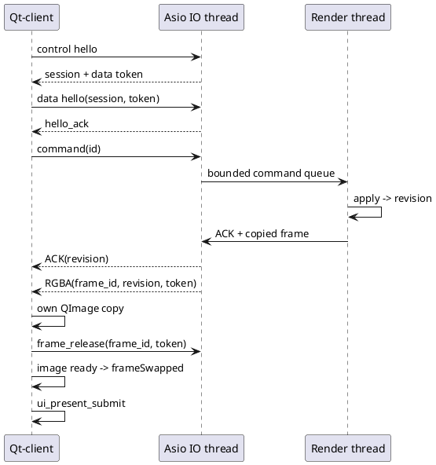
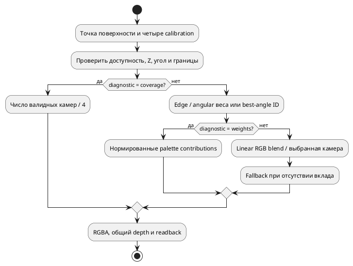

---
aliases:
  - Глава 3. Разработка системы интерактивного кругового обзора
tags: [diploma, implementation, prototype]
status: draft
updated: 2026-10-06
---

# Глава 3. Разработка системы интерактивного кругового обзора

> Описывается Linux-прототип версии **0.4.0**. Введена поверхность «круглый пол + текстурированный купол» с виртуальной камерой внутри; bowl остаётся отдельным вариантом для сравнительных опытов. Используются OpenCV, native квалификация и offline RPM-профили. Целевые SDK/устройство Авроры и полная приёмка требований ещё не проверены. Результаты 0.1.0/0.2.0 в главе 4 сохранены как исторические baselines.

Результатом этапа разработки является воспроизводимый программный путь от четырёх известных камер до управляемого изображения в отдельном Qt Quick-клиенте. Математическое ядро, графический backend и host-приложения собраны как разные CMake targets. Помимо визуализации реализованы независимая проверка проекции, offline-оценивание параметров и сервисный критерий нарушения калибровки. Эти части дают основу для экспериментального раздела, хотя не заменяют весь комплекс для целевой платформы.

## 3.1 Формат конфигурации и калибровочных данных

Файл `configs/synthetic.json` задаёт профиль `linux-prototype-v1`, единицы m/rad/ns, размеры автомобиля, четыре камеры, bowl-поверхность, начальный ракурс, выходное разрешение и пределы синхронизации. Отдельный `street-demo.json` использует `dome_floor_v1`. Схема имеет явную версию 1. Неизвестные ключи и отсутствующие обязательные поля отклоняются до создания EGL-ресурсов. Матрицы записываются строками и применяются к столбцам.

Текущий профиль намеренно использует компактный набор полей. Это не полная реализация прежнего YAML-примера [[requirements/CONFIGURATION]]: отсутствуют произвольные маски, metadata resize/crop, все транспортные настройки и полноценный report-контракт. Вместо утверждения совместимости этих форматов граница зафиксирована в [[prototype/STATUS]]. Эффективный JSON сохраняется в каждом benchmark-каталоге; серия добавляет SHA-256 этого файла.

| Объект | Реализованная проверка | Причина |
|---|---|---|
| Версия и ключи | Версия 1, точный набор полей | Исключение молчаливого игнорирования |
| Камеры | Ровно четыре ID 0…3 | Однозначное соответствие текстурам |
| Матрица установки | Нижняя строка, $R^TR\approx I$, $\det R\approx1$ | Запрет отражения и неравномерного масштаба |
| Fisheye | Положительные фокусы, четыре коэффициента, нулевой скос | Соответствие выбранной модели |
| Угловой диапазон | $0<\theta_{max}<\pi/2$, положительный Z-порог | Передняя полусфера начального профиля |
| Монотонность | Минимум производной по краям и стационарным точкам | Однозначность радиального отображения |
| Поверхность | Центральная маска внутри плоской части, внешние размеры больше внутренних | Допустимая геометрия |
| Ракурс | Высота над поверхностью, расстояние и clip range | Устойчивый look-at и наблюдение сверху |
| Изображения | Размеры ограничены до выделения памяти | Согласование payload и буфера |

Для монотонности используется полином от $x=\theta^2$: $g(x)=1+3k_1x+5k_2x^2+7k_3x^3+9k_4x^4$. Проверяются концы интервала и все действительные корни $g'(x)$ внутри него. Корни находятся рекурсивным разделением интервала по корням производной и бисекцией. Это сильнее проверки только нескольких равномерных углов, хотя численные допуски всё равно ограничивают утверждение точности.

Ошибки JSON и диапазонов завершают запуск с причиной. Подробный путь любого неверного числового поля пока сообщается не во всех ветвях; это остаётся работой для полной машинной схемы. Код проверки: [config.cpp](../../src/core/config.cpp).

## 3.2 Математическое ядро

Ядро содержит векторные операции, преобразования, независимую аналитическую fisheye-проекцию, поверхность, сетку и преобразование sRGB. В `sv-vision` подключена **реальная OpenCV 5.0.0**: `cv::fisheye::projectPoints` даёт эталонные CPU-пиксели для `sv-project`, benchmark и native GPU-проверки [S04]. Аналитический double-путь сохранён для независимого сравнения; он не выдаётся за вызов библиотеки.

При вычислении используются double. Неконечные точки, Z за рабочей границей, превышение угла и выход из изображения делают наблюдение невалидным. Центральный луч имеет отдельный устойчивый предел. Виртуальные view/perspective получаются через GLM с явным `lookAtRH` и `perspectiveRH_NO` [S54], после чего приводятся к документированной строковой форме. Перед GLSL-загрузкой матрица преобразуется в column-major; transpose-флаг остаётся false, как требует используемый путь GLES.

Сетка строится по равномерным осям с дополнительными линиями $\xi=\pm a$, $\eta=\pm b$. Благодаря этому границы плоской области совпадают с рёбрами. Дубликаты координат удаляются, каждая ячейка содержит два одинаково ориентированных треугольника. При исходных 32 ячейках на ось фактическое добавление границ даёт 2312 треугольников; при 64 — 8712. Поэтому подпись «32×32» не должна подменять фактическое число элементов.

Независимый NumPy-эталон использует $\theta=\operatorname{atan2}(\sqrt{X_C^2+Y_C^2},Z_C)$ и направление луча. `independent_math` сравнивает с OpenCV 8000 точек и признаки валидности: по 1000 на камеру при нулевой и ненулевой дисторсии. Native suite дополнительно сравнивает аналитический C++ и OpenCV на 8192 точках. Проверяются единичная длина синтетических лучей и обратная проекция пикселей. GLSL-kernel возвращает пиксельные координаты в float-FBO и сравнивается непосредственно с OpenCV, проверяя матричную загрузку и шейдерную арифметику отдельно от растеризации поверхности.

Полный CPU-растеризатор итогового изображения не реализован. Следовательно, CPU/GPU-проверка подтверждает проекцию и отдельные геометрические инварианты, а не все пиксели готового изображения. Код: [math.cpp](../../src/core/math.cpp), [test_math.py](../../tests/test_math.py).

## 3.3 Первоначальная калибровка

Калибровочная утилита принимает уже найденные соответствия XYZ↔UV. Для каждой камеры оцениваются $f_x,f_y,c_x,c_y$, четыре коэффициента искажений, три компоненты малого вращения и три компоненты переноса. Фокусы параметризуются логарифмами, главная точка нормируется на размер изображения, перенос — на фиксированный масштаб. Это уменьшает различие размеров численных шагов.

Обновление вращения записывается как $R=\exp([\omega]_\times)R_0$ и вычисляется формулой Родрига. Резидуал — разность проекций и измеренных пикселей. Численный якобиан получается центральными разностями. Шаг демпфированного метода имеет вид

$$
(J^TWJ+\lambda D)\Delta\beta=-J^TWr,
\qquad D=\operatorname{diag}\bigl(\max(\operatorname{diag}(J^TWJ),1)\bigr).
\tag{3.1}
$$

Здесь $W$ соответствует Huber-взвешиванию с переходом 2 пикселя. Кандидат принимается только при уменьшении той же Huber-функции; демпфирование уменьшается при успехе и увеличивается при отказе. Общая форма устойчивых нелинейных наименьших квадратов описана в [S25]. Собственная реализация нужна для доступного первого опыта; её нельзя без дополнительных проверок считать заменой промышленному solver во всех условиях.

Обучающие и проверочные совокупности не могут содержать одинаковые XYZ. Требуются ≥30 соответствий на выборку и неплоская совокупная геометрия. После оценивания вычисляются ошибки по обеим выборкам и обусловленность нормированного якобиана. Новый набор принимается при полном численном ранге, допустимой монотонности и p95 проверочной ошибки не выше заданного порога.

В историческом known-XYZ опыте наблюдения имеют известные пространственные координаты и добавленный пиксельный шум; детектор изображений в этом опыте не участвовал. В версии 0.2.0 добавлен описанный ниже детектор шахматной доски. Получение настоящих снимков и метрическая привязка площадки ещё нужны перед выводами о реальных камерах; детектор маркированного шаблона не реализован.

Для снимков создан native `sv-calibrate`: режим `detect` использует `findChessboardCornersSB` и сохраняет annotated PNG/UV/XYZ доски [S65]; режим `intrinsics` оценивает оптическую модель реальным `fisheye::calibrate` [S04]. Требуются минимум шесть train и три validation views. Повторные файлы в обеих выборках отвергаются по SHA-256. Проверочный остаток вычисляется при фиксированных intrinsics и отдельно найденной `solvePnP`-позе доски. Его область отличается от ошибки известных XYZ автомобиля.

Export выполняется только при конечных параметрах, положительных focal, допустимой производной радиального отображения на 1025 углах заявленного домена и p95≤порога. Эта сеточная проверка в fitter не заменяет проверку стационарных точек полинома при загрузке полного config. Путь не изменяет внешнюю матрицу, не перезаписывает принятую конфигурацию и сохраняет происхождение каждого снимка. Код: [calibration.cpp](../../src/vision/calibration.cpp), [calibrate.cpp](../../src/apps/calibrate.cpp).

*Рисунок 3.1 — Image-based intrinsics через OpenCV и known-XYZ оценивание общей модели. Системы доски и автомобиля различаются; результаты двух методов нельзя интерпретировать одной метрикой без учёта pose fitting.*

## 3.4 Контроль нарушения калибровки

Сервисный алгоритм применяет текущие параметры к независимым контрольным точкам. Для каждой камеры вычисляется p95 остатка. Состояния NORMAL, SUSPECT и RECALIBRATION_REQUIRED определяются фиксированными порогами; недостаточные или непригодные точки дают INDETERMINATE. Список кандидатов содержит камеры, для которых превышен основной порог.

Алгоритм не меняет конфигурацию при обнаружении отклонения. Повторное оценивание выполняется отдельной командой, после чего требуется проверка и экспорт. Эта граница предотвращает обратную связь, в которой диагностический признак автоматически становится непроверенной новой калибровкой.

Испытание задаёт вращение задней камеры от 0 до 2° при неизменных наблюдениях. Результаты не распространяются на случай недостаточной текстуры, дождя или движения: текущий метод не извлекает признаки из перекрытия. Его назначение — подтвердить связь геометрического смещения с контролируемой ошибкой и корректность ветвей сервисной процедуры. Перед диагностикой проверяются полный набор четырёх ID и конечные положительные пороги; неполная таблица не может молча дать NORMAL. Код: [configurator.py](../../tools/configurator.py).

## 3.5 Реализация сервера

Сервер включает загрузку конфигурации, чтение manifest, ограниченные очереди и две независимые Unix stream-сессии. Основной поток владеет EGL-контекстом, наборами кадров и виртуальной камерой. Один дополнительный поток исполняет `io_context::run()` Boost.Asio. Сокеты, таймеры и их outgoing-очереди обслуживаются только этим потоком; команды передаются рендеру через mutex-защищённую очередь.

| Ресурс | Предел текущего профиля | Поведение при нехватке |
|---|---:|---|
| Входная очередь камеры | 3 кадра по конфигурации | Удаление старейшего, счётчик |
| Очередь команд | 64 | Отрицательный ACK `control_queue_full` |
| Обработка команд за цикл | До 16 | Остальные остаются в ограниченной очереди |
| Выходной кадр | Один ожидающий release | Следующий кадр не ставится в IO-очередь |
| Очередь control-записей | 64 | Закрытие перегруженного соединения |
| Header/payload | 64 KiB / 64 MiB | Отказ до выделения полного сообщения |
| Handshake/неполное сообщение | 2 с | Закрытие соединения |
| Release | 250 мс | Закрытие data; control продолжает работу |

При сборе набора используется опорное время среди свежих последних входов, а остальные выбираются по близости в пределах окна. Будущие и просроченные кадры исключаются. Итоговое окно набора контролируется отдельно: два наблюдения по разные стороны опоры не должны вместе нарушить общий skew. При неполном наборе возвращается DEGRADED; при отсутствии пригодных — NO_INPUT.

После pause сохраняется набор и отмечается `paused`; команды ракурса продолжают создавать результаты. При сохранённых входах upload-счётчик не растёт. Step выпускает следующую строку сценария. Полный replay-clock с speed и перерасчётом anchors пока отсутствует: строки идут с периодом около 33.3 мс, исходное время остаётся metadata. Это важное отличие от полного проектного контракта времени.

Декодирование PPM/PNG/JPEG пока выполняется основным потоком и использует кэш последних файлов каждой камеры. PNG/JPEG читает OpenCV с явным BGR→RGB. Отделение декодирования в worker pool является следующим улучшением. Добавление множества Asio runner-потоков без изменения владения объектами не решает эту задачу [S55]. Код: [server.cpp](../../src/apps/server.cpp).

## 3.6 GPU-конвейер

Используется EGL-контекст GLES 3 с небольшим pbuffer и отдельным framebuffer результата. Для Mesa выбирается surfaceless platform [S56], для NVIDIA — device platform с перечислением EGL-устройств [S58]. Эти расширения относятся к проверенным настольным профилям; на Авроре backend потребуется подтвердить отдельно.

Четыре RGB8-текстуры обновляются при изменении владельца входного изображения. Сетка хранится в VBO/EBO. Vertex shader преобразует её вершины в виртуальный ракурс; fragment shader получает интерполированную пространственную точку, рассчитывает четыре проекции, валидность и веса. Граничный feather-вес зависит от расстояния до края исходного кадра. Цвет переводится из sRGB в linear RGB, смешивается с нормировкой и кодируется обратно. Это прямое объединение в процессе рисования поверхности: отдельная общая panorama/cubemap texture сейчас не строится. Graph cut, multi-band, LUT-atlas и альтернативные носители описаны как направления исследования [[research/PROJECTION_AND_STITCHING]], а не функции текущего продукта.

Прямоугольная маска исключает чужие изображения внутри footprint автомобиля на полу. Поверх пола и дальней поверхности отдельным draw рисуется процедурная ego-модель из 132 треугольников: кузов, остекление, крыша, колёса и фары. Это визуальная опора ракурса, а не точный CAD автомобиля. Купол и пол остаются непрозрачными даже при отсутствии входа: для таких областей используется нейтральная заливка, не интерпретируемая как измерение. Depth attachment обеспечивает перекрытие поверхности и кузова.

GPU-результат читается как RGBA8 и один раз переворачивается по строкам в top-left. После этого ни IPC, ни UI не выполняют повторного переворота. Путь соответствует используемым правилам framebuffer, форматов и шейдеров GLES [S26]. Внутренние промежуточные readback не нужны, но финальный readback синхронен и входит в измеренное время.

Диагностический float-FBO возвращает прямую проекцию точек и требует float color attachment. Добавлены optional `EXT_disjoint_timer_query` вокруг surface+vehicle draw [S52], CPU-учёт upload и readback/flip. Query читается после финального readback; disjoint/неготовый результат исключается, причина сохраняется. Native report содержит valid GPU distributions либо null. Прежний metrics-контракт `sv-bench` сохраняет `gpu_time_ms=null`; расширенные измерения выполняет `sv-platform-test`. Полные UV/mask/weight diagnostic views и LUT пока отсутствуют.

## 3.7 Desktop-клиент Qt Quick и граница переноса

Клиент создаёт QGuiApplication и QQmlApplicationEngine, подключает C++-мост и QML-окно. Control handshake устанавливает сессию, после чего подключается data-сокет. Проверенные байты RGBA копируются в QImage, передаются thread-safe image provider и освобождают серверный слот. QQuickImageProvider является штатным механизмом предоставления изображений Qt Quick [S57]. Он выбран для проверяемого desktop-пути; проектный QQuickItem/QSGTexture остаётся последующим вариантом.

Интерфейс содержит изображение, три пресета, pause/resume/step и строку состояния. Drag-смещения объединяются за 33 мс, колесо меняет расстояние. Это уменьшает поток команд при частых mouse events. Команда содержит собственный ID; metadata кадра — принятую `state_revision`, что позволяет отличить новое положение от ранее выданного кадра.

После готовности изображения и события `frameSwapped` записывается `ui_present_submit`. Offscreen-тест подтверждает `ui_receive` и `ui_present_submit`; проверены Qt 6.11.2 и отдельная сборка Qt 5.15.19. Это свидетельство software-представления Qt, а не физического дисплея или ABI Авроры. QML включён в `.qrc`; GLSL — в generated C++ header, поэтому установка не зависит от checkout.

При проверке завершения обнаружено обращение socket callback к полям во время разрушения Bridge. Деструктор теперь отключает эти соединения до уничтожения строк/буферов и закрывает оба сокета. Повторный IPC-тест выполнен три раза; ошибка закрытия устранена. Это пример необходимости проверять завершение потока и владение ресурсами вместе с получением кадра.

Клиент восстанавливает соединение после отключения. Политика непрерывной stale-индикации и полная диагностика calibration state пока не реализованы. Код: [Main.qml](../../src/client/Main.qml), [bridge.cpp](../../src/client/bridge.cpp).

## 3.8 Offline-конфигуратор

CLI имеет режимы `calibrate` и `diagnose`. Первый читает конфигурацию и наблюдения, оценивает камеры, формирует отчёт и экспортирует принятый набор. Второй только сравнивает действующую геометрию с независимыми наблюдениями. SHA-256 наблюдений участвует в идентификаторе новой калибровки.

Принятая конфигурация записывается через временный файл с последующим rename. Уже существующий `calibrated.json` не перезаписывается: для новой версии выбирается другой каталог. Старые параметры сохраняются в исходном конфигурационном файле. Экспорт отвергается, если контроль качества не выполнен. Это даёт проверяемую историю первоначальной и повторной процедуры.

Python CLI решает известную пространственную задачу; отдельный OpenCV CLI — внутреннюю image-based калибровку. GUI отбора снимков, полный журнал площадки и совместная привязка нескольких камер к неизвестным позам шаблонов отсутствуют. Следовательно, наличие двух проверенных tools ещё не закрывает все CAL-F-001…006 для реального объекта. Команды и форматы — [[engineering/USAGE]].

## 3.9 Генератор и контролируемые данные

Генератор NumPy создаёт четыре широкоугольные камеры в известных позах. Каждый пиксель задаёт луч; для выбранных коэффициентов радиальный полином обращается численным методом. Лучи пересекают наземную плоскость и приподнятый сферический объект. Плоскость содержит клетчатую текстуру, метровые линии и движущийся наземный маркер.

Таким образом, вход строится из известной геометрии, а не из цветовой таблицы, уже рассчитанной C++-рендерером. Сфера используется для визуального показа искажений объекта, который не принадлежит условной поверхности. Этот признак особенно важен при сравнении плоскости и bowl: нельзя считать такое искажение случайной ошибкой калибровки.

Данные сохраняются в PPM и manifest с исходными временами, путями, calibration IDs, offset-полями и SHA-256. Null исключает вход, offset задаёт временное нарушение. Native suite проверяет все файловые hashes перед опытом; обычный replay-loader пока ограничивается IDs и форматом. Отдельная потоковая producer-программа не создана. Код: [simulator.py](../../tools/simulator.py).

Добавлен `sv-capture` с реальным `cv::VideoCapture`: четыре `grab`, четыре `retrieve`, запись PNG/manifest и host delivery timestamps [S64]. Он проверен на четырёх видеофайлах; реальные устройства пока отсутствуют. Размеры кадров обязаны соответствовать калибровке, скрытого resize нет. Метки после retrieve не являются временем экспозиции датчика, а текущий сервер сохраняет фиксированную частоту replay 30 Hz.

Для демонстрации окружения `sv-scene` преобразует HDR-панораму улицы **Urban Street 01** автора Andreas Mischok, Poly Haven, CC0 [S63], в четыре fisheye-входа. В `street-demo.json` камеры горизонтально направлены на четыре стороны и имеют общий оптический центр на высоте 1.6 m. Это согласованно проецирует моноскопическую панораму, но не воспроизводит параллакс настоящих разнесённых камер.

Рендерер 0.3.0 создаёт круглый пол в `z=0` и отдельную верхнюю полусферу радиусом 12 m. На обе поверхности проецируются реальные входные текстуры согласно fisheye-калибровкам; валидные области смешиваются в линейном RGB. На полу применяется маска кузова, на куполе — нет. Автомобиль перекрывает дальнюю стенку по depth buffer. Виртуальная камера имеет расстояние 8.5 m от центра при радиусе купола 12 m; parser и обработчик orbit не позволяют ей выйти за оболочку.

На направлениях без входа, включая часть зенита за пределом FOV, шейдер рисует непрозрачный sky gradient; пропуски на полу закрываются цветом покрытия. Это убирает прозрачные отверстия и вид через пустую поверхность, но не подменяет ими измеренные камерные пиксели. Панорамный набор остаётся без параллакса и служит только визуальной демонстрацией. Код геометрии и ограничения качества — [[architecture/MATHEMATICS]] и [[engineering/SCENE]].

*Рисунок 3.2 — GLES readback купола и круглого пола: текстура улицы обволакивает процедурную модель автомобиля. Вход — моноскопическая HDR-панорама с общим оптическим центром, не запись установленного на ТС rig.*

*Рисунок 3.3 — Тот же фотографический купол и нижний пол при ракурсе со стороны передней камеры; виртуальная камера остаётся внутри оболочки.*

*Рисунок 3.4 — Вид сверху изнутри купола при тех же кадрах. Оболочка закрывает фон, положение препятствий не является метрическим ground truth.*

## 3.10 Протокол и жизненный цикл буфера

*Рисунок 3.5 — Обмен между GUI-мостом, Asio, EGL-владельцем и ImageProvider. Собственная QImage-копия отделяет server release от последующего представления кадра.*

Framing использует префикс SV01 длиной 24 байта, версию 1, тип, header size, payload size и нулевые flags. Затем следуют UTF-8 JSON и байты. Decoder накапливает неполные части, проверяет пределы и может выдавать несколько сообщений из одного чтения. Однобайтовая подача и объединённые сообщения проверены C++-тестом.

*Рисунок 3.6 — Handshake, ревизия команды и токен освобождения в текущем IPC-контракте; момент release не является моментом физического показа.*

Выходной пакет сохраняет ID кадра, набора, принятой ревизии и последней применённой команды, состав входов и runtime-метки. Клиент возвращает session/frame/token. Дублированный или поздний release не должен освобождать другой кадр. При reconnect создаётся новая control-сессия.

Полная схема протокола также требует source IDs, всех событий времени, capabilities и списка коалесцированных команд. Эти элементы реализованы частично. Поэтому текущий framing рассматривается как совместимая основа, а не доказательство полного PRO-F-001…011. Пределы и точное подмножество опубликованы в [[prototype/STATUS]].

## 3.11 Offline-сборка, RPM и подготовка переноса

Рабочая сборка проверена для Linux, Mesa/NVIDIA и Qt 5/6. CPU без EGL/Qt проходит ASan/UBSan. Все dependencies берутся из packages: CMake использует REQUIRED и **не содержит FetchContent**. SV_AURORA отключает host Python-tests; архитектуру и sysroot задаёт SDK, а не этот флаг.

Перенос начинается с проверки реального SDK, разрешённых зависимостей, EGL/backend, форматов и Qt integration [S20], [S21]. После этого следует собрать минимальный target-путь и повторить известные точки и контроль ориентации строк. Если Boost/GLM требуют другого способа включения, архитектурная граница позволяет изменить адаптер или dependency profile без изменения математического контракта.

Созданы GPU- и CPU-spec-профили с Source0, BuildRequires, `%cmake -GNinja`, `%ninja_build`, `%ninja_install` и точным payload [S59], [S60], [S67]. Source0 экспортируется только из чистого Git HEAD и содержит revision. Native Linux RPM обоих профилей собраны и распакованы; из установленного payload, без checkout, прошли core checks, native report, HDR generation, а для GPU — renderer. Эта проверка подтверждает упаковку и runtime resources на Linux, но **не** target ABI, RPM validator profile, подпись и установку Авроры [S61], [S62].

*Рисунок 3.7 — Путь от зафиксированных исходников до аппаратного сравнения. Янтарные этапы требуют фактических SDK/устройства; Linux RPM smoke не заменяет их.*

Подробные инструкции по зависимостям, native export, mb2, release rpmbuild, validation/signing, установке и возврату отчётов находятся в [[engineering/AURORA]]. Клиент остаётся desktop prototype; AuroraApp/Silica lifecycle и launcher являются отдельным этапом интеграции.

## 3.12 Переносимый отчёт и сравнение платформ

`sv-platform-test` в 0.4.0 выполняет 25 CPU/GPU-критериев без Python на целевой стороне. Проверяет analytic/OpenCV/GPU projections, config, mesh, цвета и ориентацию, синхронизацию, очереди, framing, детектор и fitter, cached uploads и десять render-вариантов, fusion-oracles и coverage замкнутых оболочек. Записывает SHA-256 реализации/config/fixture, библиотечные версии, GL/EGL capabilities, uname/CPU/memory и UTC-время. Каждый повтор создаёт новый EGL-контекст в одном процессе; raw времена сохраняются вместе с квантилями.

Первичные данные представлены JSON и Markdown с полным JSON-блоком. `compare_reports.py` допускает отношения времён только при совпадении кода/нагрузки/методики и успешной квалификации обеих сторон. Различия аппаратуры и библиотек сохраняются как характеристики платформ. При несовпадении выводится причина, ratio=null. Результаты будущего устройства можно сопоставить с сохранёнными PC baselines, повторив ПК при изменении реализации.

Оптимизация начинается с измеренных границ upload/draw/readback. Optional GPU query не включает финальное чтение; CPU-readback уже содержит ожидание GPU, поэтому эти времена нельзя складывать. IPC/UI и physical display latency пока не измерены native suite, dedicated GPU memory остаётся null. Подробные критерии, пороги, команды и ограничения — [[engineering/PLATFORM_TEST]].

## 3.13 Независимый объёмный источник кадров

Моноскопическая панорама полезна для проверки визуального окружения, но не содержит параллакса разнесённых камер. Для следующего исследования создан отдельный метрический мир в Blender: дорога, разметка, бордюры, здания, деревья, два припаркованных автомобиля и вертикальные столбики. Ego-автомобиль имеет процедурный кузов, стекло, зеркала и колёса. Модели формируются исходным Python-кодом без внешних ассетов. Авторинг и экспорт выполнены через проверенное MCP-подключение; существующая пользовательская сцена сохранена.

*Рисунок 3.8 — Истинная объёмная сцена источника, рендер Blender EEVEE. Изображение снято внешней камерой и показывает геометрию до реконструкции обзорной оболочкой.*

Четыре оптических центра находятся на переднем и заднем бамперах и снаружи боковых зеркал. Для системы V приняты оси +X вперёд, +Y влево, +Z вверх. Оптическая система C использует +X вправо, +Y вниз, +Z вперёд. Матрицы `T_camera_from_vehicle` постоянны относительно кузова; сценарное движение задаёт `T_world_from_vehicle(t)`. Для camera i истинная поза получается как

$$
T_{W\leftarrow C_i}(t)=T_{W\leftarrow V}(t)\,T_{C_i\leftarrow V}^{-1}. \tag{3.1}
$$

На данном этапе траектория — прямолинейное перемещение со скоростью 2 м/с. Она обеспечивает воспроизводимое изменение входных изображений, но не задаёт динамику шин, подвески или интерактивное управление. Поза внутри одного четырёхкамерного набора фиксируется; последовательный offline render не создаёт межкамерного scenario skew.

Blender последовательно рендерит пять 90-градусных перспективных граней из каждого центра. Выбор такой схемы отделяет создание геометрической сцены от конкретной fisheye-реализации render engine. Для оптического направления d выбирается доминирующая компонента; локальные координаты грани приводятся к пикселям:

$$
u={N\over2}\left(1+{d_x^f\over d_z^f}\right)-{1\over2},\qquad
v={N\over2}\left(1+{d_y^f\over d_z^f}\right)-{1\over2}. \tag{3.2}
$$

Здесь N — размер квадратной грани, а оси f направлены вправо, вниз и вперёд. Отрицательная оптическая Z-грань не используется: поддерживаемый предел угла 1.48 rad меньше π/2. Переход от Blender camera-local −Z/+Y к системе C задаётся явной матрицей. Перед capture выполняется независимая проверка перспективной проекции через Blender `world_to_camera_view` и pixel-center conventions. Свойства оптики и batch API описаны в официальной документации Blender; численная совместимость с установленной версией проверяется локально [[engineering/BLENDER]].

Для каждого fisheye-пикселя конвертер строит обратный луч, выбирает нужную грань и выполняет bilinear sampling в линейном RGB. Результат кодируется в sRGB RGB8 PPM. Экспорт включает совместимые config/manifest, SHA-256, scenario timestamps и истинные позы камер. Сглаживание через границы cube faces пока ограничено clamp-to-edge; dense depth/semantic truth и произвольные body-occlusion masks остаются следующими задачами.

*Рисунок 3.9 — Реальные выходы offline Blender→fisheye конвертера, четыре разнесённых центра. Чёрная область лежит вне заявленного theta-bound и не считается наблюдением камеры.*

Набор поступает в существующий `sv-server` как replay-manifest. Новый source generator не меняет текущий Unix transport и не выдаётся за realtime socket producer. После projection/fusion сервер формирует изображение купола и нижнего пола, виртуальная камера находится внутри оболочки.

*Рисунок 3.10 — GLES readbacks одного набора на поверхности «купол + пол»: сверху elevation=1.00 rad (NVIDIA), снизу elevation=0.35 rad (Mesa llvmpipe). Это иллюстрация двух ракурсов, а не сравнение backend timings. Растяжения столбиков и двоение объектов показывают ограничения текущей surface projection и feather blending.*

Уличная геометрия содержит объёмные объекты, поэтому соответствие предположению о плоском полу нарушается наблюдаемым способом. При правильной калибровке такая ошибка сохраняется: калибровочная точность и качество переноса сцены на условный носитель — разные критерии. Новый набор создаёт основу для E-STITCH-01; измеримые depth/visibility ground truth и независимые validation scenes ещё требуется добавить.

Скрипты мира и иллюстраций хранятся обычным Git. По решению пользователя Git LFS не используется; готовый авторский `.blend` сохранён в `assets/scenes/metric-street/` с provenance, а полные capture/replay-серии остаются в локальном `artifacts/`. Каталог исходных материалов и восстановление мира — [[engineering/ASSETS]]. Инструкция [[engineering/BLENDER]] задаёт команды повторения, [[validation/BLENDER_SMOKE]] — выполненные проверки. Скрипт рисунков [plot_blender.py](plot_blender.py) расположен рядом с этой главой.

## 3.14 Варианты носителя и диагностика вклада камер

В 0.4.0 добавлены цилиндр с круглыми полом/крышкой и кубическая оболочка с четырьмя стенами, квадратным полом и крышей. Они используют тот же fragment projection, что купол: заранее сшитая карта не создаётся. Форма замыкает видимое пространство виртуальной камеры, но не делает стену истинной геометрией окружающих объектов. Существующее разделение между носителем и texture representation [S26], изложенное в главе 1, сохраняется.

Parser и команды сервера используют одну функцию `safe_view`. Она проверяет зазор 0.25 m до пола и границ оболочки; sphere использует длину eye, cylinder — XY-радиус и высоту, cube — абсолютные X/Y и высоту. Outward winding проверяется CPU-тестами; три оболочки проверены GLES readback на 36 ракурсах без входных камер. Диагностика позволяет отличить opaque fallback от действительно наблюдаемого изображения.

Пусть $e_i$ — расстояние проекции до ближайшего края изображения, $\theta_i$ — угол к оси камеры, $\delta$ — ширина перехода, $p$ — степень. Реализованы:

$$
b_i=\min(1,\max(0,e_i/\delta)),\qquad a_i=\cos^p\theta_i.
$$

Edge-feather использует $w_i=b_i$, angular-feather — $w_i=b_i a_i$. Hard best-angle выбирает валидную камеру с максимальным $a_i$; при равенстве побеждает меньший ID. Угловое предпочтение — инженерная эвристика; оно не является photometric correction или seam optimization. Feather нормирует linear-RGB сумму при положительном знаменателе; hard не усредняет источники. При отсутствии наблюдения выводится заливка. Нормированное смешивание рассмотрено в [[diploma/01_THEORETICAL_FOUNDATIONS]]; graph-cut/multi-band остаются следующими методами.

*Рисунок 3.11 — Реализованные ветви fusion и диагностики. Маска кузова обрабатывается на полу до проекции; в диагностике ego-модель не перекрывает карту.*

Native `GPU_FUSION_MODES` проверяет независимые ожидаемые RGB для равных и угловых весов, равенство/отказ hard-selection и coverage от нуля до четырёх камер. Например, равная linear-смесь red/green/blue/white даёт sRGB около (188,188,188), а не (128,128,128). Канонические тесты не используют ground truth самой Blender-сцены. Контракт JSON и команды — [[engineering/RENDERING]], первый screening — §4.12.

## Выводы по третьей главе

Создан рабочий Linux-прототип с четырёхкамерным отображением, управляемым ракурсом, независимыми математическими проверками, калибровкой по известным точкам и локальным IPC. Использование GLM и Boost.Asio связано с конкретными обязанностями: матрицами виртуальной камеры и отдельным потоком сокетов. Владение GL и ограничения очередей остаются явными.

Прототип теперь включает реальный OpenCV, photo-demo, native отчёты и проверенную Linux RPM-упаковку. Реальная калибровочная площадка, аппаратные камеры, полный FrameSource/protocol-контракт, длительные измерения и приложение Авроры остаются необходимыми работами. Их отсутствие определяет границы выводов следующей главы.

## Источники

Каталог: [[references/VISION#S04|S04]], [[references/DEVELOPMENT#S25|S25]], [[references/DEVELOPMENT#S26|S26]], [[references/PLATFORM#S20|S20]], [[references/PLATFORM#S21|S21]], [[references/DEVELOPMENT#S54|S54]], [[references/DEVELOPMENT#S55|S55]], [[references/DEVELOPMENT#S56|S56]], [[references/DEVELOPMENT#S57|S57]], [[references/DEVELOPMENT#S58|S58]]. Дата обращения — 05.10.2026. Собственные алгоритмы и ограничения соотносятся с исходниками, а не приписываются этим источникам.

[S04]: https://docs.opencv.org/4.13.0/db/d58/group__calib3d__fisheye.html
[S25]: https://ceres-solver.readthedocs.io/latest/nnls_tutorial.html
[S26]: https://registry.khronos.org/OpenGL/specs/es/3.0/es_spec_3.0.pdf
[S20]: https://developer.auroraos.ru/doc/software_development
[S21]: https://developer.auroraos.ru/doc/software_development/reference/public_api
[S54]: https://github.com/g-truc/glm/blob/1.0.3/manual.md
[S55]: https://www.boost.org/doc/libs/latest/doc/html/boost_asio/overview/core/threads.html
[S56]: https://registry.khronos.org/EGL/extensions/MESA/EGL_MESA_platform_surfaceless.txt
[S57]: https://doc.qt.io/qt-6/qquickimageprovider.html
[S58]: https://registry.khronos.org/EGL/extensions/EXT/EGL_EXT_platform_device.txt
[S52]: https://registry.khronos.org/OpenGL/extensions/EXT/EXT_disjoint_timer_query.txt
[S59]: https://developer.auroraos.ru/doc/sdk/tools/mb2
[S60]: https://developer.auroraos.ru/doc/software_development/guidelines/rpm_requirements/spec_requirements
[S61]: https://developer.auroraos.ru/doc/sdk/tools/rpm_validator
[S62]: https://developer.auroraos.ru/doc/sdk/tools/rpmsign_external
[S63]: https://polyhaven.com/a/urban_street_01
[S64]: https://docs.opencv.org/4.13.0/d8/dfe/classcv_1_1VideoCapture.html
[S65]: https://docs.opencv.org/4.13.0/d9/d0c/group__calib3d.html
[S67]: https://developer.auroraos.ru/doc/5.1.4/sdk/app_development/work/create/create_new_project
