---
aliases:
  - Глава 4. Экспериментальное исследование и тестирование системы
tags: [diploma, experiments, validation]
status: draft
updated: 2026-10-09
---

# Глава 4. Экспериментальное исследование и тестирование системы

> Две различимые измерительные серии, 05.10.2026: историческая 0.1.0 (§4.1–4.8) и native suite 0.2.0 (§4.9). Их входы и области времени различаются. Dome+floor добавлен в платформенный workload 0.3.0; короткий smoke проверил 22 критерия, но не образует performance baseline или сравнение качества. Реальные камеры, ОС Аврора, физическая задержка дисплея и длительный тепловой режим пока отсутствуют.

> **Статус аудита 09.10.2026:** разделы 4.22 и 4.24 ниже содержат exploratory outputs, а не подтверждённые выводы. E-STITCH seam/ghost metrics и graph-cut label имеют методические дефекты; исторический temporal script не применял движение rig; замена и парная серия от 10.10.2026 описаны в §4.25. Калибровочный «real-data» скрипт синтетический, без запуска детектора. Scene Truth oracle также не совпадает по дорожной разметке с Blender RGB fixture. Таблицы оставлены как исторические результаты реализации, но image-quality scores, причинные выводы/ранжирование и пороги нужно пересчитать перед итоговой редакцией: [[planning/AUDIT]], [[../TODO]].

Цель экспериментального этапа — проверить корректность выбранной проекции, получить первые сравнимые характеристики поверхностей и подтвердить работоспособность процедуры калибровки и восстановления. Дополнительно проверяется путь server→client и ограничения при отказе потребителя. Первичные времена и отчёты сохранены в [[prototype/MEASUREMENTS]], а команды повторения — в [[prototype/README]]. Эта серия является начальным исследованием работоспособности; она не подменяет полную программу [[research/EXPERIMENTS]].

## 4.1 Стенд и методика

| Параметр | Проверенный профиль |
|---|---|
| CPU | AMD Ryzen 9 9950X 16-Core Processor |
| Linux | 7.2.6-arch2-1-x86_64, glibc 2.44 |
| Аппаратный GPU | NVIDIA GeForce RTX 5070 Ti, драйвер 615.71.09, 16303 MiB по `nvidia-smi` |
| Аппаратный GL_RENDERER | NVIDIA GeForce RTX 5070 Ti/PCIe/SSE2 |
| Программный GL_RENDERER | llvmpipe (LLVM 22.1.8, 256 bits), vendor Mesa |
| Компилятор | GCC 16.2.1 |
| Зависимости C++ | Boost 1.92, GLM 1.0.3, EGL/GLES, Qt 6.11.2 для клиента |
| Python | 3.14.7, NumPy 2.5.3 |
| Входы | Четыре синтетических RGB8-кадра 320×180 |
| Результат | RGBA8, 640×360 или 1280×720 |
| Целевое устройство Авроры | Отсутствует; не измерялось |

Генератор создаёт дорожную плоскость, линии, наземный маркер и приподнятую сферу. Известны внутренние параметры и позы камер. Manifest содержит SHA-256 файлов и временные поля. Для обеих серий использован одинаковый fixture-hash `f8c58e4c6e17acd0f36b7f2622bacef4f84f7fb43c28cb5aced4c1319f95d9c4`.

Каждый вариант запускается тремя отдельными процессами. В каждом процессе 10 кадров прогрева и 60 измеряемых кадров. Порядок вариантов чередуется. Таким образом, на вариант и backend приходится 180 измерений, а на одну backend-серию — 720. Время определяется вокруг вызова `render`, включая CPU-подготовку, исполнение и синхронное чтение RGBA. Первые четыре входа загружаются один раз и используются повторно. Это измерение кэшированного рендера, а не захвата и обработки 30 новых четырёхкамерных наборов каждую секунду.

Для последовательности отсортированных времён $t_{(0)},\ldots,t_{(n-1)}$ квантиль вычисляется линейной интерполяцией:

$$
j=\lfloor p(n-1)\rfloor,\quad \alpha=p(n-1)-j,\qquad
Q_p=t_{(j)}+\alpha(t_{(\min(j+1,n-1))}-t_{(j)}).
\tag{4.1}
$$

В таблице производительности приводится медиана трёх отдельных p50/p95. На графике ус показывает минимум и максимум p95 этих запусков. Это диапазон повторов, а не доверительный интервал. Кадры одного процесса могут быть зависимы; их нельзя без обоснования считать независимыми реализациями для статистического вывода. Для следующей полноценной серии число запусков и условия нагрузки должны быть расширены.

## 4.2 Проверка математического ядра

C++-проверки охватывают центральный луч, известный 45° луч, точки за камерой, FOV и NaN, инверсию установки, top-view look-at, поверхность, ориентацию треугольников, отрицательные конфигурации, framing и синхронизацию. Независимый NumPy-путь дополнительно проверяет 8000 точек и валидность через другую форму угловой проекции, при нулевых и ненулевых коэффициентах дисторсии. Для генератора проверяются единичные лучи и их возврат к исходным пикселям.

GPU-kernel проецирует 1024 точки для каждой из четырёх камер. В каждом benchmark-процессе сохраняются координаты точки, CPU-ответ, GPU-ответ и валидность. Ошибка считается только для общей валидной области; расхождение валидности учитывается отдельно. Это предотвращает ситуацию, в которой непопавшие в изображение точки искусственно улучшают среднее.

| Проверка | Фактический результат | Область вывода |
|---|---:|---|
| CPU и независимый NumPy | Совпадение валидности; максимальная ошибка < $10^{-10}$ пикс. | Модель и установка на контрольных точках |
| CPU/GPU, RTX | Максимум $9.5524\cdot10^{-5}$ пикс.; 0 расхождений валидности | Прямая GLSL-проекция на данном driver/profile |
| CPU/GPU, Mesa | Максимум $3.1611\cdot10^{-4}$ пикс.; 0 расхождений валидности | Программный GLSL-профиль |
| ASan/UBSan CPU-сборки | Три CTest-группы прошли | Выполненные CPU-пути без выявленных ошибок sanitizer |
| Qt/IPC integration | Offscreen receive и present-submit прошли | Копируемый путь и управление |

Отличия GPU от double-CPU ожидаемы из-за float-арифметики и конкретной реализации функций. Полученные значения значительно меньше принятого smoke-предела 0.1 пикселя, однако это не оценка ошибки калибровки реальной камеры. Отдельно остаётся ошибка треугольного приближения поверхности: kernel не проверяет каждый итоговый экранный пиксель и не подтверждает глобальный допуск сетки.

## 4.3 Сравнение плоскости и bowl

Сравниваются $H=0$ и $H=1.5$ м при тех же внешних размерах, источниках, ракурсе и числе треугольников. На изображении дорожные клетки и наземный маркер дают понятный ориентир, а приподнятая сфера показывает предел условной поверхности.

*Рисунок 4.1 — Реальные выходы текущего рендера на синтетической сцене, один виртуальный ракурс. Изображение формируется сохранённым `plot_experiments.py` из PPM результатов.*

У чаши периферийная дорожная текстура поднимается относительно центра. Это расширяет визуальную вертикальную составляющую окружения, но не делает её истинной высотой объектов. Сферический объект в обоих вариантах искажён: разные камеры переносят его лучи на условную поверхность. Наблюдаемый эффект подтверждает необходимость разделять параллакс и нарушение калибровки.

ROI в параметрах $(x,y)$ поверхности определена как $[-4,4]\times[-3,3]$ м, без прямоугольной маски автомобиля. Выборка содержит 100×100 центров ячеек, после исключения маски остаётся 7960 точек. Для каждого варианта берётся $P_j=(x_j,y_j,z_H(x_j,y_j))$; на плоскости $z_H=0$, на чаше высота зависит от положения. Поэтому метрика характеризует доступность изображения на условной поверхности, а не непосредственно покрытие реальной дорожной плоскости. Проверяется хотя бы одна валидная проекция:

$$
C_{ROI}=\frac{\#\{P_j:\exists i\;m_i(P_j)=1\}}{N_{ROI}}.
\tag{4.2}
$$

У плоскости и bowl в этом наборе результат одинаков: 0.994472, или 99.4472%. Такое совпадение не означает одинаковое визуальное качество. Метрика отражает доступность исходного пикселя, а не достоверность размещённого объекта, качество шва или восприятие пользователем. Выборка не является аналитическим доказательством покрытия непрерывной области.

Полное количественное сравнение marker error, швов и нескольких наклонных ракурсов ещё не выполнено. Поэтому на данном этапе обоснована пригодность обоих вариантов для дальнейшего исследования, а универсальное превосходство чаши не устанавливается.

## 4.4 Первоначальная калибровка

Для четырёх камер независимо созданы обучающие и проверочные пространственные точки. Координаты распределены по направлениям и глубинам; XYZ одной выборки не повторяются в другой. В пиксели добавлен гауссов шум с $\sigma=0.08$ пикселя на координату. Seed фиксирован. Начальное приближение включает изменение фокусов, главной точки, поворота и переноса.

Отчёт содержит RMS евклидовой ошибки точки, p95 и показатели ранга нормированного якобиана. Итоговые значения на проверочной выборке представлены ниже.

| Камера | RMSE до, пикс. | RMSE после, пикс. | p95 после, пикс. |
|---|---:|---:|---:|
| Передняя | 2.26670 | 0.11598 | 0.21796 |
| Правая | 2.18854 | 0.12331 | 0.21277 |
| Задняя | 2.26077 | 0.11946 | 0.22029 |
| Левая | 2.22780 | 0.11518 | 0.19379 |

Результат согласуется с заданным шумом: для двух независимых координат теоретический RMS евклидова шума составляет $\sqrt{2}\sigma\approx0.11314$ пикселя. Близость чисел не является доказательством точного восстановления каждого параметра; она показывает, что остатки в этой синтетической постановке приблизились к уровню наблюдательного шума.

Нормированный якобиан имеет ранг 14, а условные числа по камерам находятся приблизительно между 592 и 803. Это даёт основание принять конкретную процедуру в текущем наборе, но не гарантирует одинаковой определимости на реальной плоской площадке. Для дипломного вывода нужны дополнительные геометрии, число снимков, выбросы, параметры и повторные seeds.

Текущий CLI отклоняет пересечение train/validation и недостаточные точки. Эти отрицательные тесты существенны: хорошая ошибка на данных, вошедших в оптимизацию, не должна объявляться независимым подтверждением качества.

## 4.5 Нарушение и восстановление

Контрольный опыт меняет поворот только задней камеры вокруг её локальной Y-оси слева относительно исходного преобразования. Величина задаётся от 0 до 2°. Проверочные соответствия сохраняются. Порог SUSPECT равен 0.5 пикселя, основной — 1 пиксель.

| Заданный поворот | p95 задней камеры, пикс. | Состояние | Камера-кандидат |
|---|---:|---|---|
| 0° | 0.22029 | NORMAL | Нет |
| 0.1° | 0.37391 | NORMAL | Нет |
| 0.25° | 0.71549 | SUSPECT | Нет подтверждённого кандидата |
| 0.5° | 1.36286 | RECALIBRATION_REQUIRED | Задняя, ID 2 |
| 1° | 2.70320 | RECALIBRATION_REQUIRED | Задняя, ID 2 |
| 2° | 5.40880 | RECALIBRATION_REQUIRED | Задняя, ID 2 |

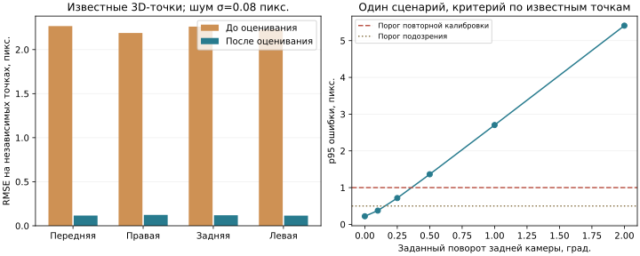

*Рисунок 4.2 — Независимая ошибка после калибровки и реакция сервисного критерия на один заданный сценарий. Скрипт сохранён рядом с главой.*

Повторное оценивание после 2° возвращает p95 задней камеры к 0.22029 пикселя. Остальные камеры также сохраняют проверочные значения исходной процедуры. Следовательно, на известных точках подтверждена цепочка «смещение → рост остатка → отдельная повторная калибровка → восстановление».

Это не статистическая оценка чувствительности по всему классу неисправностей. Контролировалась одна ось одной камеры и один набор. Нет серии исправных сцен при разных освещении, текстуре и движении; поэтому доля реальных ложных срабатываний не вычисляется. Установленные пороги не подбирались на репрезентативной диагностической выборке. Отсутствие кандидата при 0.1° является поведением данного критерия, а не универсальной границей обнаружения.

## 4.6 Производительность

Значения ниже — медианы p50/p95 трёх независимых процессов. Каждый процесс имеет собственный прогрев и отдельный набор 60 времён. Выходной readback включён; upload четырёх неизменных входов выполняется только при первом использовании.

| Вариант | Треугольники | Выход | RTX p50 / p95, мс | Mesa p50 / p95, мс |
|---|---:|---|---:|---:|
| Плоскость | 2312 | 640×360 | 0.17086 / 0.28306 | 0.66997 / 0.78805 |
| Bowl | 2312 | 640×360 | 0.16478 / 0.22440 | 0.68984 / 0.80609 |
| Bowl, плотная сетка | 8712 | 640×360 | 0.17064 / 0.23128 | 1.24499 / 1.49228 |
| Bowl | 2312 | 1280×720 | 0.86085 / 0.94389 | 1.71820 / 2.17621 |

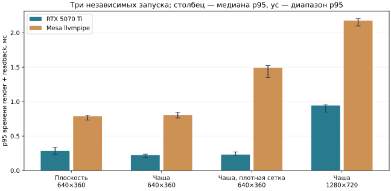

*Рисунок 4.3 — Медиана и диапазон p95 между запусками. Ус не обозначает доверительный интервал.*

В текущем малом профиле RTX имеет меньшую длительность, чем программный Mesa. Увеличение выходного разрешения увеличивает объём обработки и чтения; более плотная сетка особенно заметна в программном backend. Небольшая разница плоскость/bowl на RTX не доказывает фундаментального ускорения чаши: меняются покрываемые фрагменты, а короткие измерения подвержены фоновой нагрузке и режиму частот.

Из этих значений нельзя вычислить достигнутый FPS всей системы как $1000/t$: benchmark использует кэшированные входы и не включает все стадии. Объём памяти, чистое GPU-время, новые upload каждого кадра, long-run температура и частоты не измерены. Поле `gpu_time_ms` сохранено null. Для отдельного GPU-измерения потребуется поддерживаемый timer query и контроль валидности [S52].

## 4.7 Сквозная задержка

Сервер сохраняет runtime-время входов, завершение рендера и IDs, клиент — получение и программную передачу на представление. Эти события обеспечивают корреляцию. Для локального пути программный возраст можно определить как

$$
L_{program}=t_{ui\_present\_submit}-\min_i t_{release,i}.
\tag{4.3}
$$

Но $t_{release}$ в replay относится к выпуску известного кадра, а не к экспозиции физического сенсора. `ui_present_submit` в offscreen-испытании также не является моментом появления света на экране. Поэтому численная таблица полной latency в этой серии не публикуется.

У текущего Qt-клиента trace не сохраняет всю нормативную корреляцию событий и нет отдельного валидированного агрегатора latency. Прежде чем делать количественный вывод, нужно проверить соответствие frame ID и ревизии, разделить receive/image-ready/present, учесть очередь и провести длительную серию. Часы удалённого producer пока не поддерживаются; различение clock и running-time остаётся существенным [S31].

## 4.8 Отказы и синхронизация

Проверки сгруппированы по уровню отказа.

| Сценарий | Наблюдаемое поведение | Свидетельство |
|---|---|---|
| Истёкший вход | Исключён по возрасту, возможен NO_INPUT | C++ synchronizer test |
| Избыточный skew | Непригодные входы исключены, DEGRADED | C++ synchronizer test |
| Повтор sequence и обратное время | Отдельные счётчики, кадр не принят | C++ test |
| Переполнение входной очереди | Размер сохраняется, старейший удалён | C++ test |
| Неверная конфигурация | Запуск отклонён до EGL | Негативные config tests |
| Частичный/объединённый stream | Один или несколько правильных пакетов | Decoder tests |
| Неверный префикс | Соединение закрыто, сервер продолжает работу | Integration test |
| Pause и новый ракурс | Новый кадр, прежние upload-счётчики | Integration test |
| Нет frame_release | Data закрывается после deadline, control отвечает | Integration test |
| Reconnect | Новый handshake и пригодный кадр | Integration test |
| Qt-клиент offscreen | Принимает RGBA, сообщает present-submit | Integration test |

Эти проверки показывают предусмотренное поведение на выбранных ветвях. Они не равны длительному испытанию всех сочетаний потерь, многоклиентной нагрузки и повреждённых файлов. Синхронизатор испытывался отдельными временными метками; полноценная fault-серия записей с длительным исчезновением каждой камеры остаётся следующим шагом.

## 4.9 Сопоставление платформ

### 4.9.1 Границы исторической серии 0.1.0

RTX и llvmpipe дают одинаковые признаки валидности на контрольных точках и воспроизводят один алгоритм. Разница времени подтверждает необходимость сохранять фактический renderer при каждом запуске. Название машины или наличие драйвера сами по себе не доказывают аппаратный путь.

Аврора отсутствует в таблице сравнения. Ни Mesa, ни RTX не моделируют автоматически встроенный GPU и профиль приложения Авроры. Для целевого этапа потребуется паспорт, один рабочий output-путь, проверка зависимостей, затем повторение одинаковых данных и ракурсов. Если разрешение или формат придётся изменить, такой профиль должен публиковаться отдельной строкой.

| Платформа | Корректность модели | Измеренный render/readback | Полный клиентский путь | Вывод о целевом устройстве |
|---|---|---|---|---|
| Linux + Mesa | Проверена на контрольных точках | Есть | Offscreen integration | Не устанавливается |
| Linux + RTX | Проверена на контрольных точках | Есть | Hardware-UI latency не измерялась | Не устанавливается |
| ОС Аврора | Нет данных | Нет данных | Нет устройства/пакета | Открытый этап |

### 4.9.2 Native suite 0.2.0: новый PC baseline

Для будущего устройства создан отдельный native C++ suite `surround-view-platform-v1`. Он запускается без Python на устройстве, использует побайтно воспроизводимые целочисленные RGB8-входы и проверяет реальные OpenCV CPU operations. Контрольный profile/config, SHA-256 входов и реализации совпали для RTX и Mesa. У каждой платформы **22 pass, 0 fail, 0 skip**. Полные первичные записи сохранены в [[validation/baselines/PC_RTX]] и [[validation/baselines/PC_MESA]], без потери raw samples.

В этой серии три повтора означают новые EGL-контексты **в одном процессе**; это отличается от трёх отдельных процессов исторической серии. На вариант по-прежнему 10 warmup + 60 измерений; порядок через повтор обращается. OpenCV использует один поток. Добавлены 132 треугольника ego-модели, optional GPU query и вариант с новыми image owners; отдельный CPU-copy входов выполняется до таймера. Поэтому новые цифры нельзя трактовать как ускорение/замедление версии 0.1.0 на прежней нагрузке.

| Вариант 0.2.0 | RTX CPU wall p95, ms | Mesa CPU wall p95, ms | RTX valid GPU draw p95, ms | Mesa valid GPU draw p95, ms |
|---|---:|---:|---:|---:|
| Plane, 640×360, cached | 0.1542 | 0.7388 | 0.0054 | 0.3393 |
| Bowl, 640×360, cached | 0.1590 | 0.8267 | 0.0056 | 0.3884 |
| Dense bowl, cached | 0.1560 | 1.4616 | 0.0070 | 0.5367 |
| Bowl, 1280×720, cached | 1.0379 | 2.4355 | 0.0118 | 0.6932 |
| Bowl, 640×360, new uploads | 0.3406 | 1.3287 | 0.0137 | 0.3984 |

В каждой ячейке — медиана p95 трёх повторов. GPU draw охватывает только отрисовку surface+ego, **не readback и upload**; CPU wall включает ожидание GPU, flip/copy и опрос timer. Эти столбцы не суммируются. Их различие показывает, почему CPU-таймер вокруг всей функции нельзя называть «время шейдера». Программный llvmpipe выполняет GPU API на CPU; слово draw описывает границы запроса, а не физическое наличие GPU у этого backend.

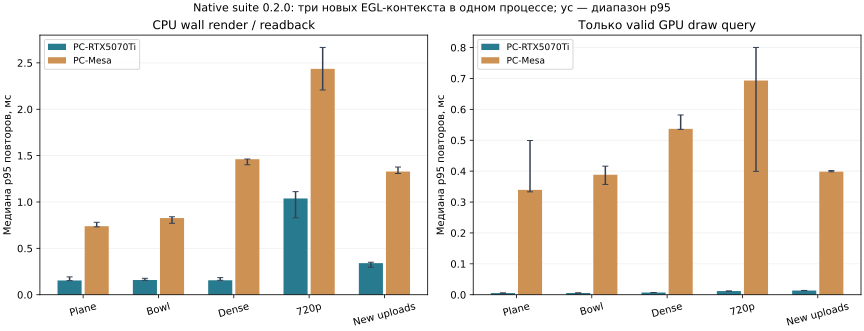

*Рисунок 4.4 — Медиана p95 и диапазон трёх повторов native suite 0.2.0: полный render/readback и valid draw timer представлены раздельно. Ус обозначает диапазон p95, не доверительный интервал.*

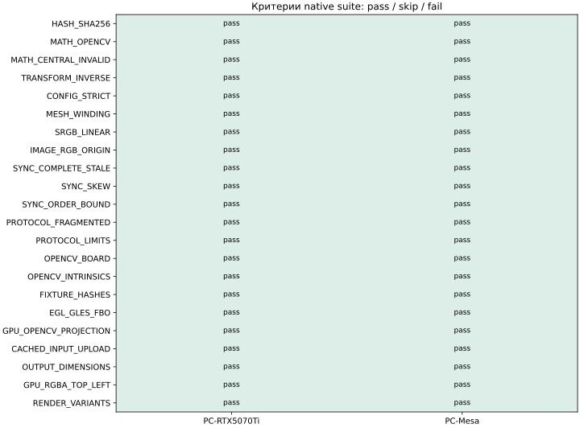

*Рисунок 4.5 — Результаты 22 native критериев на двух PC backend. Положительный результат относится к заданным данным и проверкам; не подтверждает качество реальной калибровочной площадки и требования всего приложения.*

Пиковый CPU RSS процесса составил 976.24 MiB для NVIDIA-профиля и 235.50 MiB для Mesa. Значения получены после всей серии и создания контекстов, включают драйверные host allocations и OpenCV; это не выделенная VRAM, не средняя рабочая память одного кадра и не сумма памяти системы. Они показывают необходимость повторить ресурсную проверку на устройстве. Для dedicated GPU memory в report сохранено null.

Помимо распределений report сохраняет системный паспорт, версии OpenCV/Boost/GLM/compiler, GL/EGL capabilities, texture limits, hash исходников и UTC-время. Все valid GPU queries включены в статистику; неготовые/disjoint были бы отмечены отдельно. У текущих двух запусков все измеряемые query имеют valid. Проверка сопоставимости скриптом `compare_reports.py --strict` прошла. Репликация и полный перечень критериев находятся в [[engineering/PLATFORM_TEST]].

### 4.9.3 Будущее аппаратное сравнение с Авророй

На устройство доставляется RPM из тех же исходников; native suite запускается на железе с установленной `synthetic.json`. Сборка/установка из SDK описаны в [[engineering/AURORA]] на основании официальных инструкций [S59], [S60]. Linux RPM обоих профилей уже собраны и распакованы, installed payload запускается без checkout. Это отдельная проверка упаковки; целевой SDK и устройство ещё не проверены.

| Свойство / критерий | PC baseline | Устройство Авроры |
|---|---|---|
| CPU | AMD Ryzen 9 9950X, x86_64 | Нет данных: SoC/архитектура |
| GPU / driver | RTX 5070 Ti / 615.71.09; отдельно llvmpipe | Нет данных: фактический GL_RENDERER/driver |
| ОС / toolchain | Linux 7.2.6, GCC 16.2.1, Release | Нет данных: выпуск ОС, SDK/target, compiler |
| OpenCV | 5.0.0, один поток | Проверить package/version/modules |
| Код / workload | Одинаковые source/config/fixture SHA-256 | Должны совпасть с повторённой PC-серией |
| Правильность | 22 pass | Native pass/skip/fail из реального запуска |
| Render/upload/readback | Raw и p50/p95/p99/max для пяти вариантов | Те же настройки и scope |
| Draw timer | Valid EXT query | Valid distribution либо null + причина |
| CPU RSS | 976.24 / 235.50 MiB | Измерить после одинаковой серии |
| VRAM, thermal, physical latency | В native suite не измерены | Отдельная методика; не заполнять нулями |

Сравнение допускает различия аппаратуры/compiler/library versions, но требует совпадения реализации, входов, Release и методики. Если SDK требует иной profile/config, создать новую PC-базу той же нагрузки. При failed/partial qualification или несовпадении хэшей отношение времён не вычисляется. Отсутствующая целевая строка не позволяет заявлять достижение NFR Авроры или оценку FPS полной системы.

### 4.9.4 PC baseline текущей реализации 0.6.0

После изменения источников сформированы новые отчёты с fingerprint C++ payload 0.6.0: [[validation/baselines/PC_RTX_V06]], [[validation/baselines/PC_MESA_V06]]. Использованы 60 samples, 10 warmup и три новых EGL contexts; по 25 критериев passed. Actual renderers — RTX 5070 Ti и Mesa llvmpipe; серии последовательные. Строгая сопоставимость подтверждена [[validation/PC_COMPARISON_V06]].

| Workload | RTX median p95, ms | Mesa median p95, ms |
|---|---:|---:|
| Plane | 0.17683 | 0.82534 |
| Bowl | 0.18550 | 0.88564 |
| Dome + floor | 0.19787 | 1.68357 |

Эти времена относятся к render/readback. Новый FrameSource не включён в данную область таймера; его lifecycle проверен отдельно в §4.14. При первоначальном запуске программного профиля GLVND оставил NVIDIA; такой report исключён из опубликованного сравнения, серия повторена с явным Mesa vendor. Исторические результаты выше не заменены.

## 4.10 Анализ результатов и ограничений

### Исследование вариантов объединения и геометрии

Для следующей серии выделены две независимые оси: fusion (hard mask, edge-feather, distance-to-seam, graph-cut и multi-band) и surface carrier (plane, bowl, dome+floor, cylinder+floor, cube/cubemap и документированная составная модель). Это расширение от 06.10.2026 согласуется с [[research/PROJECTION_AND_STITCHING]] и [[research/EXPERIMENTS#Эксперименты]].

До 0.4.0 проверялись работоспособность renderer и краткий `dome_floor` workload sanity-check. В 0.4.0 реализованы angular-feather и hard best-angle и выполнен first-frame screening (§4.12); graph-cut/multi-band пока отсутствуют; RTX/Mesa подробные отчёты 0.3.0 для этой геометрии не сохранены. Screening даёт статистику покрытия, но оценка швов и преимущество dome/cube/bowl пока не установлены. Для результата потребуются независимая синтетическая сцена с точной геометрической истиной и реальная синхронизированная четырёхкамерная последовательность; моноскопический `street-demo` для этих метрик непригоден.

Первая серия отвечает на часть исследовательских вопросов. Прямая модель согласуется между независимым CPU-расчётом и GLSL. Плоскость и bowl построены на одних входах, а их время и покрытие измерены раздельно. Известная геометрия позволяет восстановить калибровку и локализовать заданный дрейф задней камеры. Сервер и offscreen-клиент подтверждают копируемую передачу и управление без повторного upload на паузе.

Исторические выводы ограничены синтетическим набором, коротким временем и известными соответствиями. Версия 0.2.0 добавила реальные OpenCV API, image-based тесты, CPU RSS и valid GPU draw timing; качество детектора на настоящих снимках, ошибка реального объекта, освещение, false alarms, long-run memory/thermal, физическая задержка и характеристики Авроры всё ещё не установлены. Эти ограничения нельзя скрывать общим словом «работает».

Для следующей серии нужно расширить независимые данные, задать несколько ракурсов, измерить швы и маркеры, отделить временные стадии и провести полноценный отказной replay. Только после этого можно обосновывать целевой профиль и исследовательский вклад по реальным эксплуатационным условиям.

## 4.11 Проверка объёмного четырёхкамерного источника

06.10.2026 выполнен короткий smoke Blender→fisheye→server: четыре сценарных момента с шагом 1/30 s, 16 входных PPM, физически разнесённые оптические центры и сохранённые истинные позы. Исходная улица и результат отображения показаны на рисунках 3.8–3.10; полная инструкция находится в [[engineering/BLENDER]], первичные параметры и checksums — в [[validation/BLENDER_SMOKE]].

Независимый Blender-projector проверен на 72 точках всех face-camera conventions: максимальная ошибка 0.000035004 px при пороге 0.001 px. Host-проверки используют независимое direction field для обнаружения переставленных/перевёрнутых граней, проверяют linear-light sampling, соответствие mounts, hashes и ошибочные входные файлы. Основной CTest проходит 7/7 групп.

Все 16 input hashes проверены; каждая камера изменяет изображение при заданном движении. Server smoke получает четыре READY-кадра с различными frame IDs, alpha=255 во всём изображении и применённую revision команды `front`. Рендерер на RTX 5070 Ti даёт 0 validity mismatches и max projection error около 0.000043764 px. Эти результаты подтверждают совместимость оптики, формата и replay/IPC; они не измеряют геометрическую ошибку полного обзорного изображения.

Визуально сохраняются растяжение поднятых объектов на полу и двоение в перекрытиях. Начальная ошибка размещения боковых центров внутри mirror housing устранена до итогового export. После этого оставшиеся артефакты становятся предметом сравнения surface/fusion, но пока не ранжируют методы. Четырёх сценарных моментов недостаточно для оценки temporal jitter и длительной работы; два bench samples после warmup не обосновывают sustained FPS.

В следующей серии нужны ground/raised markers, проверка ошибки depth truth на аналитических примитивах, object-ID/semantic labels, отдельные validation scenes и одинаковые входы для hard/feather/graph-cut/multi-band. Blender pose truth полезна для координат и калибровки, а новый EXR→radial-range export даёт dense geometry depth; его пока нельзя считать полностью валидированным visibility oracle.

## 4.12 Начальное сравнение поверхности и слияния: 0.4.0

Для первого screening использован один набор четырёх разнесённых Blender-камер из §4.11. Пять носителей, два ракурса и три режима fusion дают 70 запусков с color/weights/coverage. Calibration и input hashes неизменны; resolution 960×540, distance 8.5 m, azimuth 0.8 rad, elevation 1.0/0.35 rad. На всех cases фактический renderer — Mesa llvmpipe. Каждая конфигурация и её readback сохранены; происхождение и SHA-256 — [[validation/SURFACE_SCREENING]].

| Носитель, low-view | Треугольники | 0 наблюдений | 1 наблюдение | 2 наблюдения | За геометрией |
|---|---:|---:|---:|---:|---:|
| Plane | 8712 | 296 | 180669 | 151625 | 173712 |
| Bowl | 8712 | 296 | 188486 | 168053 | 149467 |
| Dome + floor | 24320 | 296 | 265387 | 240619 | 0 |
| Cylinder + floor + cap | 24320 | 296 | 265035 | 240971 | 0 |
| Cube shell + floor | 12552 | 296 | 264962 | 241044 | 0 |

В каждой строке дополнительно 12098 пикселей маски ТС; сумма категорий 518400. Три/четыре камеры в данных ракурсах не наблюдают ни одной output-точки. Под «наблюдением» понимается валидность fisheye-проекции доступного кадра, без проверки физического заслонения. Разница между outside-surface и zero-observations принципиальна: замыкание mesh устраняет первый дефект, но не создаёт недостающие данные камер.

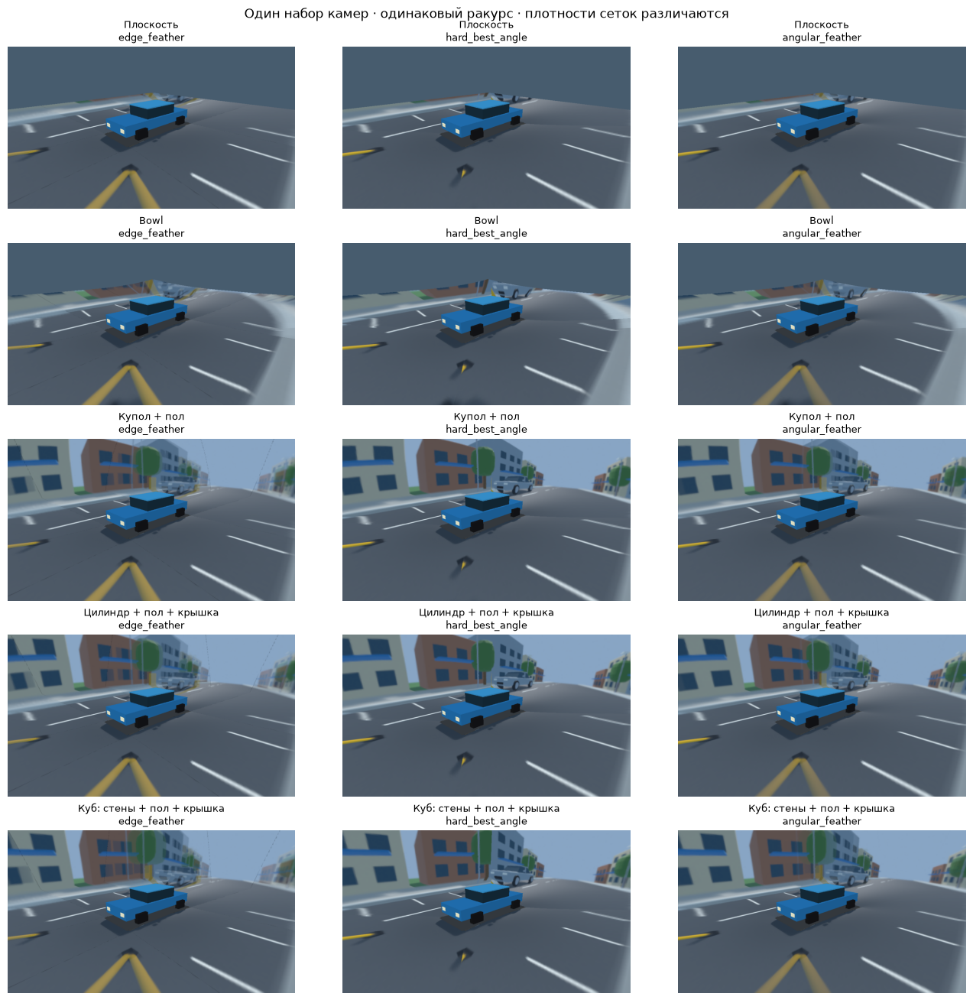

*Рисунок 4.6 — Actual GLES readbacks пяти носителей при edge-feather, hard best-angle и angular-feather. Один Blender-набор, low-view; все изображения получены renderer, не нарисованы отдельно. Двоение, растяжения и резкие переходы остаются предметом количественного исследования.*

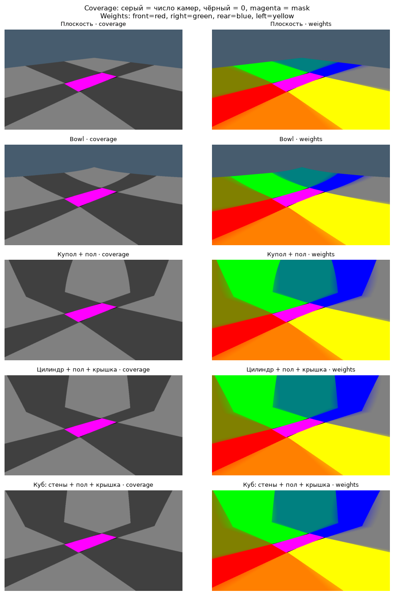

*Рисунок 4.7 — Coverage и palette contributions edge-feather. Gray кодирует число камер, magenta — маску ТС; blue-gray фон plane/bowl расположен вне геометрии. Скрипт генерации обеих подписанных иллюстраций — `plot_screening.py` рядом с главой.*

Оболочки показывают ноль пикселей за геометрией в обоих проверенных ракурсах. Этот результат согласуется с независимым empty-input oracle 36 ракурсов, но не доказывает отсутствие дефектов при любой плотности сетки. Hard-selection предотвращает межкамерное усреднение, сохраняя риск резкого шва. Угловое feather меняет веса, но не исправляет несовпадение объектов по глубине.

Это first-frame screening с **неравными triangle budgets**, а не итоговый сравнительный опыт. Три timing samples после одного warmup не позволяют ранжировать производительность. Seam error, ghosting distance, temporal jitter, exposure sensitivity и качество относительно depth/visibility truth здесь не вычислены. Следующий этап — metric markers и независимые scenes, согласованный resource budget и длинное видео, затем graph-cut/multi-band. Исторические baselines §4.9 сохранены; native 0.4.0 smoke проходит 25 критериев, installed CMake payload тоже 25, RPM и устройство требуют отдельных прогонов.

## 4.13 Проверка клиентской библиотеки и сетевой конфигурации

После аудита планов выполнен Unix/TCP baseline 0.5.0. Release CTest проходит 10/10 групп, CPU Debug ASan/UBSan — 7/7. Новые native lifecycle cases проверяют invalid options, handshake/partial message deadlines, invalid RGBA payload и shutdown без поздних callback. Host integration использует настоящий сервер и два потребителя одной библиотеки — headless и Qt. Дополнительно 500 orbit-команд на паузе приняты в пакетах по 16 без новых decode/upload/mesh builds. Полные RTX/Mesa baselines 0.5.0 (60 samples, 10 warmup, 3 contexts) и два Linux RPM с installed development consumers сохранены в [[validation/CLIENT_SMOKE]]; они дополняют исторический §4.9.

| Сценарий | Наблюдаемый результат | Ограничение |
|---|---|---|
| Unix-only | В `/proc` у процесса нет IPv4/IPv6 TCP/UDP sockets | Linux host evidence, не target SDK |
| TCP-only / combined | Команды/ACK и RGBA передаются через общий codec; Unix paths создаются только в enabled profile | Один session; two-host test ещё открыт |
| Установленная библиотека | Отдельный CMake consumer успешно подключается; ldd не содержит Qt/OpenCV/EGL/GLES | Установленный Linux prefix; ABI Авроры не проверен |
| Server restart | Consumer получает кадры двух различных session IDs | Loopback, не распределённые часы |
| Pause/orbit/step | Orbit сохраняет decode/upload/mesh counters, step продвигает один набор и сохраняет паузу | File replay, live producer ещё отсутствует |
| Irregular timestamps | Вместо фиксированных 33 ms воспроизводятся интервалы manifest | OS scheduling допускает jitter; это не sensor timing |
| Qt TCP offscreen | ui_receive и ui_present_submit подтверждены | Не физический дисплей |

Тест выявил отсутствие кадра после reconnect на паузе; сервер исправлен повторной публикацией для новой data-сессии. Неподдержанный UDP и override явной server connections через CLI отвергаются до открытия listeners. Эти проверки закрывают инженерные части M7/M8, но не подменяют целевой или quality этап. Аудит всех этапов — [[planning/AUDIT]], инструкции — [[engineering/CLIENT_LIBRARY]].

## 4.14 Проверка асинхронных источников: 0.6.0

Новая серия проверяет корректность source lifecycle, а не качество слияния и не производительность аппаратных камер. Release CTest проходит 12/12 групп, CPU Debug ASan/UBSan — 8/8. Исторические времена §4.6/§4.9 и baselines 0.5.0 сохранены без замены. Полный протокол короткой проверки — [[validation/SOURCES_SMOKE]].

| Воздействие | Ожидаемый и полученный результат | Область вывода |
|---|---|---|
| Loader заблокирован тестовым barrier | poll/request доступны; pause ACK после release loader | Работа вне GL-потока, не гарантированное время любого OpenCV decode |
| Replay pause/step | Нет новых decode после ACK; один step batch, cache сохранён | File-source семантика |
| Четыре camera mailboxes переполнены | Каждая сохраняет Q последних frames; dropped учитывается | Ограничение очередей без starvation |
| Duplicate / неверная calibration | Отключён только проблемный camera channel | Проверка входного протокола |
| Частичный handshake | Camera channel закрыт по deadline | Не heartbeat и не гарантия свежести экспозиции |
| Reconnect с source sequence=0 | Новая session; четырёхкамерный READY восстановлен | Unix/TCP localhost |
| Pause при продолжающемся producer | Входы отбрасываются; orbit не повышает upload count | Сохранение textures и отсутствие paused backlog |
| Dataset с неверным SHA/path/offset | Producer отклоняет до подключения | Проверки входного dataset |

Тест использует настоящий EGL/GLES сервер и отдельный Python producer, но входы синтетические. Это позволяет изолировать транспортные ошибки от качества калибровки. Сохранённая Blender-запись также прошла новый socket validator на RTX 5070 Ti: 16 hashes, четыре READY RGBA frames и применённый ракурс; actual output показан на рисунке 3.14. Прежний replay путь повторён отдельно. Независимая проверка мира ранее выполнена в §4.11. Испытание между физическими машинами, прямой VideoCapture adapter и sensor-clock mapping остаются открытыми. Native source fixture также включён в RPM для повторения без Python; он не добавляет фиктивных критериев в прежний 25-критериальный platform report.

## 4.15 Восстановление producer после перезапуска сервера

Последующее host-расширение 0.6.0 сохраняет C++ payload и native workload fingerprint. В группе camera_sources теперь 13 cases: восемь самостоятельных producer socket tests, два actual-server restart сценария и три первоначальные проверки источников. Новые cases проверяют per-camera retry budget, reset sequence после нового handshake, late-drop, изоляцию медленного получателя, остановку blocked handshake, SIGTERM report и отказ перезаписи отчёта.

| Воздействие | Наблюдаемый результат |
|---|---|
| Server остановлен на 250 ms и запущен заново, Unix/TCP | Все четыре камеры восстановились с новыми sessions; READY доступен без перезапуска producer |
| Источник отсутствует, два retry | По три попытки на камеру; failed JSON/Markdown сохранён |
| Одна камера не читает payload | Send timeout завершает только её worker; остальные продолжают запись |
| Ошибочный HELLO_ACK | Фатальный отказ этой камеры без циклического reconnect |
| Stop при незавершённом handshake | Worker завершён в пределах тестового deadline; это не гарантия cancellation file I/O |
| SIGTERM процесса producer | Частичный cancelled report и ожидаемый exit 143 |

В restart опытах используется synthetic запись с двумя моментами по 33.333333 ms, 60 loops: 120 scheduled frames на камеру, max lateness 40 ms. Sent/skip/error числа зависят от планировщика; первичные значения и полный JSON сохранены в [[validation/PRODUCER_RECOVERY]]. Это проверка восстановления и управления очередями, не performance benchmark и не длительный thermal run. Blender/socket путь с новым producer также повторён на сохранённой 3D-записи.

## 4.16 Аналитический эталон носителя

### 4.16.1 Отделение дискретизации от проекции

Screening раздела 4.12 проверяет действующий mesh renderer, но не даёт плотного геометрического эталона. В частности, полигональная полусфера представляет собой набор хорд; даже при правильной fisheye-формуле её точки отличаются от точек точной сферы. Для дальнейшего исследования реализован независимый host CPU-путь `tools/reference.py`: он не использует GL, C++ math или вершины сетки. Он решает пересечение каждого луча с аналитическим носителем и затем вычисляет проекцию и смешивание. Модель fisheye и соглашения осей остаются определёнными в [[architecture/MATHEMATICS]], исходная библиотечная модель описана в [[references/VISION#S04|S04]]. Аналитические пересечения ниже являются собственным выводом из уравнений носителей, а не результатом измерения физической сцены.

Для пикселя с целочисленными индексами $(u,v)$ сначала вычисляются координаты центра на плоскости виртуальной камеры:

$$
x_n=\left(\frac{2(u+1/2)}{W}-1\right)\frac{W}{H}\tan\frac{\varphi}{2},\qquad
 y_n=\left(1-\frac{2(v+1/2)}{H}\right)\tan\frac{\varphi}{2}.
$$

Если $\mathbf f,\mathbf r,\mathbf u$ — единичные направления вперёд, вправо и вверх виртуального вида, то

$$
\mathbf d=\frac{\mathbf f+x_n\mathbf r+y_n\mathbf u}{\|\mathbf f+x_n\mathbf r+y_n\mathbf u\|},\qquad
\mathbf P(t)=\mathbf E+t\mathbf d.
$$

Выбирается ближайшее допустимое $t>0$. Near/far проверяются по глубине $t(\mathbf d\cdot\mathbf f)$ вдоль оптической оси, а не по длине луча. Поэтому для наклонного луча эти два ограничения нельзя отождествлять.

### 4.16.2 Точные поверхности и ограничения корней

Пол задан $z=0$; корень $t=-E_z/d_z$ допускается только внутри диска или прямоугольника выбранного носителя. Для верхней полусферы радиуса $R$ решается

$$
(\mathbf d\cdot\mathbf d)t^2+2(\mathbf E\cdot\mathbf d)t+(\mathbf E\cdot\mathbf E-R^2)=0,
$$

причём точка корня должна иметь $z\geq0$. Пол рассматривается как отдельная поверхность; ближайший корень среди пола и полусферы определяет видимую оболочку. Для цилиндра аналогичное квадратное уравнение записывается только для $x,y$, а корни дополнительно ограничиваются высотой стенки; пол и верхняя крышка — диски. Куб состоит из шести ограниченных плоскостей. Рассматриваются оба действительных корня: это существенно для внешней точки наблюдения и касания. При вырождении квадратного уравнения используется линейное, а при отсутствии положительного допустимого корня возвращается miss.

Bowl имеет аналитическую высоту

$$
z(x,y)=\frac{H_b}{2}\left[\left(\frac{\max(|x|-a,0)}{A-a}\right)^2+
\left(\frac{\max(|y|-b,0)}{B-b}\right)^2\right].
$$

На каждом из девяти сочетаний левой/плоской/правой областей по двум осям эта функция квадратична. Подстановка $x=E_x+td_x$, $y=E_y+td_y$, $z=E_z+td_z$ даёт квадратное либо линейное уравнение; каждый найденный корень проверяется на принадлежность своему участку и внешним границам. При $H_b=0$ результат становится точной ограниченной плоскостью. Таким образом, CPU-результат не зависит от `uniform_cells` или числа сегментов полусферы.

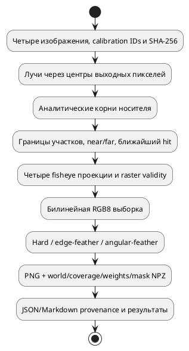
```plantuml
@startuml
start
:Четыре изображения, calibration IDs и SHA-256;
:Лучи через центры выходных пикселей;
:Аналитические корни носителя;
:Границы участков, near/far, ближайший hit;
:Четыре fisheye проекции и raster validity;
:Билинейная RGB8 выборка;
:Hard / edge-feather / angular-feather;
:PNG + world/coverage/weights/mask NPZ;
:JSON/Markdown provenance и результаты;
stop
@enduml
```

*Рисунок 4.8 — Порядок вычислений независимого аналитического эталона. Глубина относится к носителю, а не к объектам Blender.*

### 4.16.3 Смешивание, покрытие и первичная серия

CPU-проекция вычисляет угол через $\operatorname{atan2}(\rho,z)$ и учитывает четыре коэффициента дисторсии, FOV, положительную глубину и границы изображения. Билинейная интерполяция выполняется над RGB8 до sRGB decode, как в текущем GPU baseline. Два feather-режима смешивают выборки в linear RGB; hard best-angle сохраняет детерминированный приоритет меньшего camera ID при равенстве. Coverage считается до весов: валидная выборка на границе может иметь нулевой feather weight. Все четыре веса сохранены численно, поэтому их не требуется восстанавливать из palette RGB.

Выполнены 30 случаев: пять носителей, два виртуальных ракурса, три режима смешивания. Использован первый четырёхкамерный набор Blender-записи, 960×540. Ниже показано число лучей без пересечения с носителем; оно не зависит от fusion.

| Носитель | Oblique: elevation 1.0 rad | Low: elevation 0.35 rad |
|---|---:|---:|
| Плоскость | 10 386 | 173 711 |
| Bowl | 1 534 | 149 474 |
| Купол с полом | 0 | 0 |
| Цилиндр с полом | 0 | 0 |
| Куб с полом | 0 | 0 |

Общее число выходных пикселей — 518400; azimuth 0.8 rad, distance 8.5 m. Границы носителей соответствуют screening. Таблица подтверждает отсутствие выхода лучей за края замкнутой оболочки в двух выбранных ракурсах. Она не ранжирует точность отображения реальных объектов. В частности, одинаковое число допустимых проекций у нескольких носителей не означает одинаковых UV, overlap boundaries или итогового цвета.

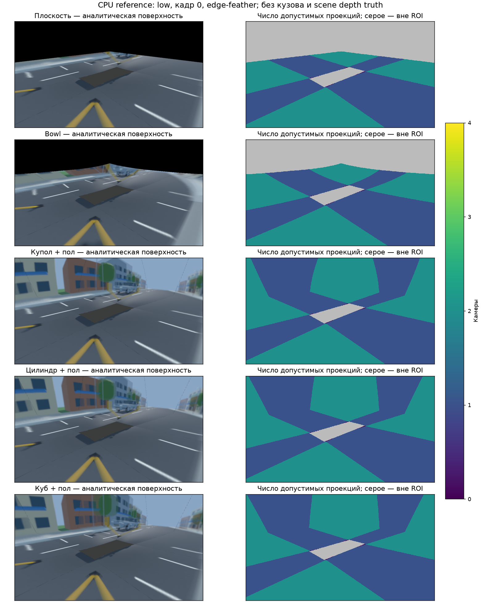

*Рисунок 4.9 — Пять точных носителей при низком ракурсе: слева edge-feather render, справа число допустимых проекций камер. Серое — вне evaluation ROI, включая footprint; чёрное слева у плоскости и bowl — carrier miss. Кузов не рисуется. Скрипт [plot_reference.py](plot_reference.py) строит рисунок из сохранённых NPZ/PNG, а не генерирует дополнительную сцену.*

### 4.16.4 Проверка и границы эталона

Десять CPU-тестов проверяют известные корни, линейный предел, касание, крышки/пол, view-axis clipping, top-left orientation, билинейную выборку, linear-RGB mean, hard tie и valid-border с нулевым весом. Дополнительно проверены 10000 направлений с residual уравнения bowl и 4096 направлений из внутренней точки каждой замкнутой оболочки без misses. Полный Linux CTest завершился 13/13 группами; новая all-directions проверка повторно прошла в группе `analytic_reference`. Первичные числа, хэши и методика сохранены в [[validation/ANALYTIC_REFERENCE]].

Этот результат закрывает подготовку плотного эталона геометрии носителя. Он не создаёт scene depth/visibility truth, не моделирует заслонение и не содержит автомобильный overlay. Footprint mask недостаточна для прямого RGB-сравнения с GPU: видимый кузов перекрывает дополнительные пиксели. До вычисления image error требуется согласовать кадр/config/view, получить маску кузова, обработать silhouettes/background и определить метрику. Seam/ghosting/temporal quality и отдельные validation scenes остаются следующими экспериментами. Инструкция запуска — [[engineering/RENDERING#Независимый аналитический CPU-эталон]].

## 4.17 Восстановление положения камер при ошибках монтажа

### 4.17.1 Постановка и управляемый мир

На автомобиле номинальное положение креплений не гарантирует фактических внешних параметров. Ошибка yaw меняет направления проекции, ошибка pitch смещает границу пола/окружения, а перенос оптического центра создаёт зависимое от глубины рассогласование. Поэтому проверка системы должна отдельно оценивать восстановление внешних параметров и результат последующего отображения.

Разработан seed-based генератор Blender-улицы с автомобилем, зданиями, разметкой и четырьмя разнесёнными оптическими центрами. Правила задают диапазоны высоты/шага зданий и погрешностей монтажа, а overrides позволяют указать конкретное отклонение каждой камеры. В текущем опыте yaw лежит в ±5°, pitch в ±4°, сдвиг вдоль кузова в ±0.15 м. Генератор поддерживает диапазоны до ±20° и ±0.4 м, однако эти амплитуды ещё не исследованы. Это процедурная сцена, а не измеренная модель реальной улицы.

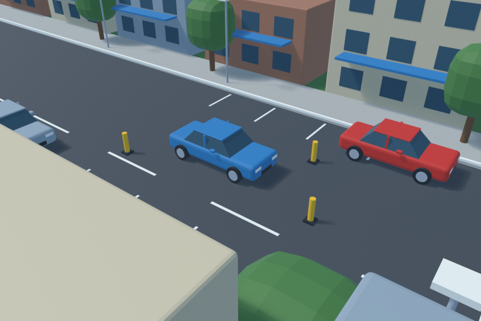

*Рисунок 4.10 — Отдельная сцена SV Research Street, Blender 5.2.2 LTS, seed 20261007. Обзор мира, из которого экспортированы камеры для первого опыта. Рецепт и сохранённая сцена находятся в assets; исходная пользовательская сцена сохранена.*

Пусть $R_{CV}$ переводит координаты ТС в координаты камеры, $C_V$ — её центр. Номинальная camera-to-vehicle ориентация возмущается поворотом вокруг вертикали ТС и вокруг локальной оси right:

$$
R'_{VC}=R_z(\delta\psi)R_{CV}^{T}R_x(\delta\theta),\qquad
C'_V=C_V+\delta s\,a_V,\qquad
T'_{CV}=\begin{bmatrix}(R'_{VC})^T&-(R'_{VC})^TC'_V\\0&1\end{bmatrix}.
$$

Для front/rear $a_V$ направлена вдоль +Y, для боковых камер — вдоль +X. Положительный pitch поворачивает оптическую ось вверх. Два угла и один сдвиг моделируют выбранные монтажные отклонения; roll, высота и полный шестимерный монтажный шум пока не варьируются. Номинальная и фактическая конфигурации хранятся отдельно. Renderer Blender использует фактическую позу; calibration solver получает только nominal guess и train observations.

### 4.17.2 Сравниваемые методы и экспериментальный протокол

Первый этап изолирует внешнюю калибровку при точно известных intrinsics. Используется реальная библиотека C++ OpenCV 5.0.0: fisheye observations переводятся в normalized pinhole coordinates, затем выполняется PnP. Возможности алгоритмов определены документацией OpenCV [[references/VISION#S72|S72]], модель fisheye — [[references/VISION#S04|S04]].

| Вариант pipeline | Инициализация | Отбор / refinement | Исследовательское ограничение |
|---|---|---|---|
| ITERATIVE | Номинальная поза | Все точки, nonlinear solve | Зависимость от initial guess |
| EPnP | Без initial guess | Direct solve | Без robust rejection и дополнительного LM |
| SQPnP | Без initial guess | Direct solve | Те же наблюдения, без дополнительного LM |
| RANSAC+EPnP+LM | Без initial guess | 300 iterations, confidence .999, LM по inliers | Threshold 3/max(fx,fy) и objective в normalized coordinates |

В каждом из пяти mounting seeds берутся 120 train и 120 независимо выбранных validation XYZ на камеру. Точки предлагаются в объёме X/Y ∈ [−14;14] м, Z ∈ [0;3] м, отбираются по положительной глубине, углу менее 1.35 rad и запасу 50 px до края. Совокупность неплоская. Train UV получают Gaussian noise σ ∈ {0;0.5;1} px; доля outliers равна 0 или 10%, дополнительное смещение каждого outlier равномерно в ±35 px по обеим осям. Validation UV чистые. Истинная поза и validation observations не передаются solver.

Важно различать моделирование геометрии и распознавание изображения: текущие XYZ/UV получены аналитически, заслонение объектами сцены не проверяется. RGB Blender нужны для визуализации результата, а не для обнаружения соответствий. Поэтому опыт проверяет pose solver и не доказывает работоспособность полноценной калибровки по изображениям.

### 4.17.3 Метрики и первичные результаты

Для $N$ независимых точек вычисляются pixel reprojection RMSE, p95 длины остатка, ошибка вращения и расстояние между центрами:

$$
e_{\mathrm{RMSE}}=\sqrt{\frac{1}{N}\sum_{i=1}^N\|\pi(\widehat T,X_i)-u_i^{\mathrm{truth}}\|_2^2},\qquad
 e_R=\arccos\frac{\operatorname{tr}(\widehat R R_{\mathrm{truth}}^T)-1}{2},\qquad
 e_C=\|\widehat C-C_{\mathrm{truth}}\|_2.
$$

Аргумент arccos ограничивается от −1 до 1 для устойчивости округления. Отдельно сохраняются invalid held-out points и отказы четырёхкамерного запуска. При отказе одной камеры весь trial не экспортируется. Следующая таблица показывает медианы по камерам только успешных trials при σ=0.5 px; success означает допустимый экспорт, а не выполнение требований точности.

| Выбросы | Метод | Успешные trials | Held-out RMSE, px | Ошибка вращения, ° | Ошибка центра, м |
|---:|---|---:|---:|---:|---:|
| 0% | iterative | 5/5 | 0.162220 | 0.080803 | 0.008713 |
| 0% | epnp | 5/5 | 0.793651 | 0.200374 | 0.044031 |
| 0% | sqpnp | 5/5 | 0.208579 | 0.081047 | 0.016101 |
| 0% | ransac_epnp_lm | 5/5 | 0.226706 | 0.103005 | 0.014806 |
| 10% | iterative | 5/5 | 1.761342 | 1.010944 | 0.075100 |
| 10% | epnp | 2/5 | 9.758369 | 2.486626 | 0.797280 |
| 10% | sqpnp | 2/5 | 2.556452 | 1.015146 | 0.197291 |
| 10% | ransac_epnp_lm | 5/5 | 0.215735 | 0.115937 | 0.016719 |

Номинальная конфигурация до калибровки имеет медиану 8.199787 px. Без выбросов ITERATIVE оказался точнее robust pipeline: 0.162220 против 0.226706 px. При 10% ошибочных соответствий RANSAC+EPnP+LM дал 0.215735 px против 1.761342 px у ITERATIVE. Это свидетельствует о полезности robust отбора в данном профиле загрязнения. Возможное объяснение ухудшения direct вариантов — влияние крупных train residuals без rejection, но отдельный причинный эксперимент ещё нужен. Для сравнения стоимости и самого solver следует уравнять refinement и исследовать пороги.

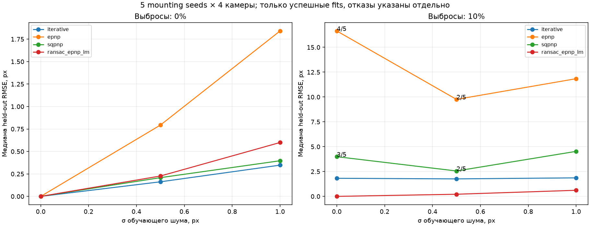

*Рисунок 4.11 — Медианный held-out RMSE четырёх pipeline-вариантов для пяти mounting seeds и четырёх камер. Подписи 2/5 и другие counts обозначают число экспортированных четырёхкамерных trials; остальные завершились отказом. Линии соединяют три дискретных условия и не являются моделью интерполяции.*

EPnP и SQPnP при σ=0.5 px и 10% выбросов экспортировали лишь 2/5 trials. Их медианы нельзя интерпретировать без этого отбора. При σ=1 px и 10% выбросов оба экспортировали 5/5, но каждый имеет один invalid validation point. Таким образом, finite/valid-on-train fit недостаточен для независимой приёмки. Полные 24 строки агрегатов, первичные записи и hashes находятся в [[validation/MOUNT_CALIBRATION]].

### 4.17.4 Изображения до/после и границы вывода

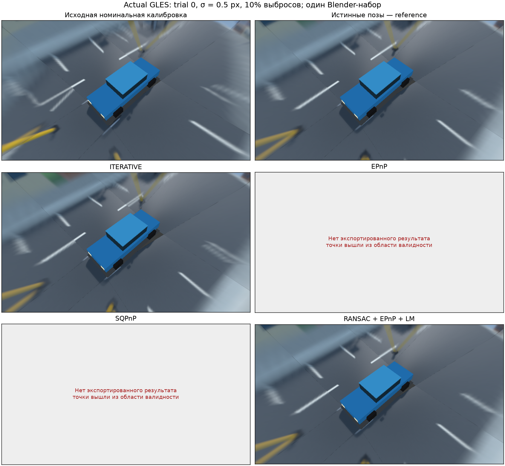

*Рисунок 4.12 — Actual GLES output одного Blender-набора: nominal, reference truth и восстановленные позы trial 0 при σ=0.5 px, 10% выбросов. Отсутствующие EPnP/SQPnP outputs явно отмечены; они не заменены картинкой другого метода. Входы получены из cube faces 128×128, выход — 960×540; это иллюстрация изменения проекции, не фотометрический benchmark.*

Показанные различия необходимо сопоставлять с независимыми численными метриками. Изображение reference построено с истинными позами, но оно также использует выбранную поверхность и blending, поэтому не является ground truth свободной 3D-видеокамеры. Пять seeds и ограниченные монтажные ошибки не позволяют объявить универсально лучший алгоритм. Измеренные fit durations относятся к короткому одноразовому запуску на Linux, без аппаратного профилирования или переноса на Аврору.

Эксперимент сравнивает native solver через offline CLI `sv-calibrate extrinsics`; синтетические XYZ/UV позволяют оценивать pose recovery, но не detector и качество изображения. Для этого выполнена отдельная image-derived серия ниже. После этих исследований сервер получил отдельный job workflow с независимой held-out проверкой, quality gate, привязкой задания к control session, отменой, защитой от устаревшей config revision и безопасным применением candidate. Эти меры подтверждают software lifecycle, но не точность порогов на физических камерах. Открыты occlusion, planar/nonplanar protocols, joint intrinsics/extrinsics и обзор остальных семейств калибровки с матрицей применимости. Четыре PnP pipeline не покрывают все механизмы. [[engineering/PROTOCOL_IMPLEMENTED]], [[research/MOUNT_CALIBRATION]]. Скрипт [plot_mount_calibration.py](plot_mount_calibration.py) расположен рядом с главой, правила и запуск — [[engineering/BLENDER]].

### 4.18 Внешняя калибровка по рендеренным изображениям

В предыдущей серии соответствия пикселей и координат автомобиля синтезировались аналитически. Здесь проверяется более полный путь: Blender отображает метрическую шахматную доску в fisheye RGB кадры, native OpenCV находит внутренние углы, метаданные положения доски переводят их в XYZ автомобиля, после чего ранее реализованный solver оценивается на новой позе, не участвовавшей в подборе. Документация OpenCV задаёт API детекции шаблонов и pose estimation [[references/VISION#S72|S72]], а проекция широкоугольной камеры соответствует описанной fisheye-модели [[references/VISION#S04|S04]].

Размер шаблона — 9×6 внутренних углов, сторона клетки 0.2 м. На каждую из четырёх камер Blender сформировал четыре различных положения. Первые три кадра дают 162 train-угла; последний кадр с 54 углами сохранён для отдельной validation. Матрица `T_vehicle_from_board` начинается в нижнем левом **внутреннем** углу, как требует формат observations. В solver поступают номинальные intrinsics и train-точки; transform доски и истинные позы камер используются генератором и evaluator, но не передаются для подбора camera extrinsics. Метод фиксирован: RANSAC+EPnP, затем LM-refinement по inliers.

$$
P_V=T_{V\leftarrow B}P_B,\qquad
e_{ij}=\left\|\pi_{\hat{C}_i}(P_{V,j})-u_{ij}\right\|_2,
\qquad RMSE=\sqrt{\frac{1}{N}\sum_{j=1}^N e_{ij}^2}.
$$

Все 16 из 16 camera-view изображений успешно дали 54 угла. Числа на единственной отложенной позе для каждой камеры:

| Камера | Train / validation углы | RMSE nominal, px | RMSE после fit, px | p95 после fit, px | Ошибка поворота, ° | Ошибка центра, м |
|---:|---:|---:|---:|---:|---:|---:|
| 0 | 162 / 54 | 21.48076 | 0.13874 | 0.23731 | 0.10815 | 0.00616 |
| 1 | 162 / 54 | 17.43318 | 0.14574 | 0.24539 | 0.14034 | 0.00698 |
| 2 | 162 / 54 | 14.15524 | 0.13269 | 0.22528 | 0.08425 | 0.00443 |
| 3 | 162 / 54 | 12.95263 | 0.14605 | 0.26032 | 0.11451 | 0.00625 |

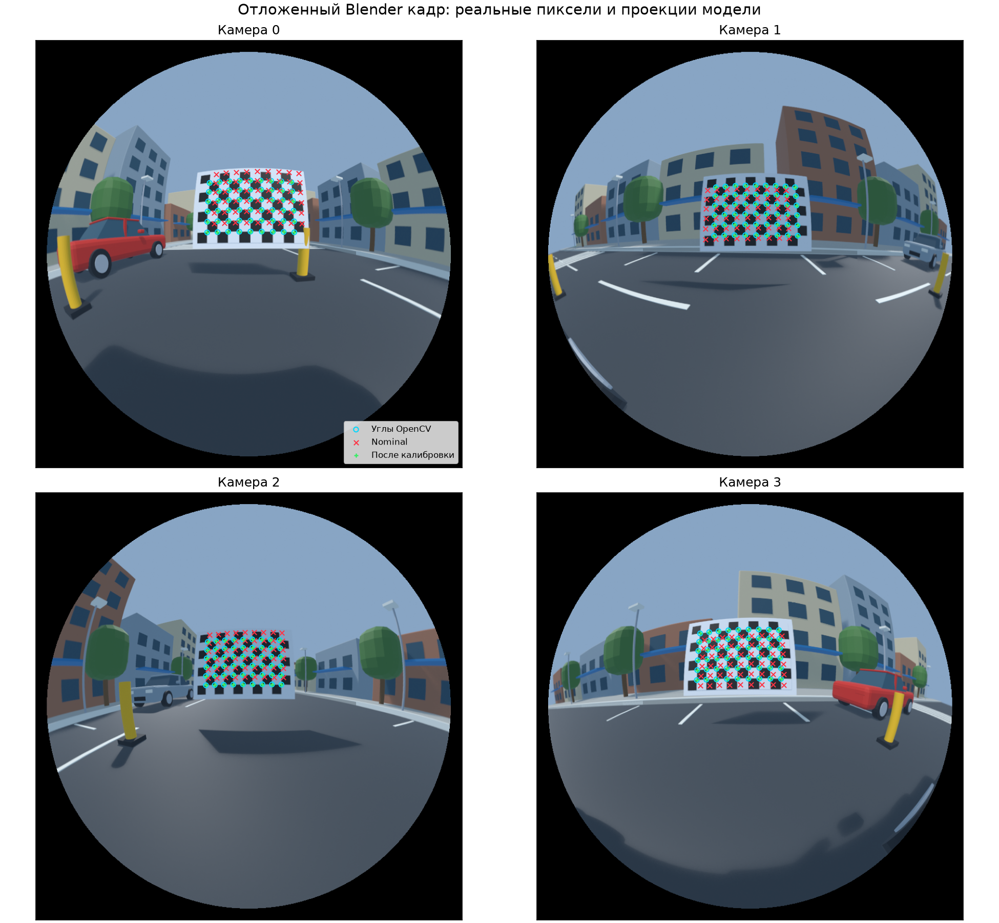

*Рисунок 4.13 — Углы детектора (cyan), номинальная проекция (красные кресты) и результат fit (зелёные знаки) на held-out кадрах четырёх камер.*

Nominal RMSE 12.95–21.48 px снизился до 0.133–0.146 px; ошибка центра составила 4.4–7.0 мм, поворота — 0.084–0.140°. Это подтверждает связность software pipeline на рендеренных снимках. Малый остаток обусловлен контролируемой синтетической средой и не является показателем точности реальной автомобильной калибровки.

Chessboard симметрична, поэтому порядок углов взят из точной сцены Blender. Использованы заранее известные intrinsics и точная метрическая поза доски; проверялась только extrinsic recovery. Один held-out pose на каждую камеру не характеризует обобщение по всему полю зрения. Не измерялись ошибки установки шаблона, окклюзии, блики, смаз, частичное обнаружение, другие target families и аппаратный runtime. Следующий опыт должен использовать coded/asymmetric targets, несколько независимых сцен и поз для validation, perturbation измерения board pose, visibility/image-quality sweeps и затем фотографии с физически измеренными координатами. Серверный calibration job и gate реализованы отдельно, но их пороги не подтверждены физическими данными и не делают этот синтетический опыт аппаратной приёмкой. Полный протокол, ограничения, checksums и команда повтора: [[validation/IMAGE_CALIBRATION]]; исследовательский план: [[research/IMAGE_CALIBRATION]].

### 4.19 Чувствительность внешней калибровки к ошибкам геодезической привязки калибровочной доски (E-CAL-SURVEY-01)

Оценка параметров внешней калибровки по наблюдениям шахматной доски опирается на измеренное положение шаблона в пространстве автомобиля $T_{V\leftarrow B}$. В данном эксперименте исследуется чувствительность метода RANSAC+EPnP+LM (`ransac_epnp_lm`) к независимым ошибкам геодезической привязки (board survey error).

Из опыта §4.18 повторно использованы три train-позы доски и одна held-out validation-поза для каждой из четырёх камер. Оптические детекции зафиксированы. Положение доски при обучении возмущается независимым смещением по осям автомобиля $\sigma_t \in \{0, 1, 2, 5, 10\}$ мм и независимыми угловыми поворотами $\sigma_r \in \{0, 0.05, 0.1, 0.25, 0.5\}^\circ$. Для каждого из 25 сочетаний выполнено по 5 независимых запусков с фиксированными случайными сидами (всего 125 четырёхкамерных подборов). Held-out validation-поза и её точки остаются точными.

На рисунке 4.14 приведены медианные held-out reprojection RMSE (в пикселях) и ошибки положения центра камеры (в миллиметрах).

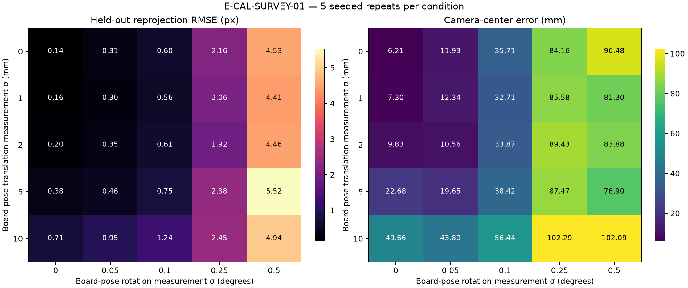

*Рисунок 4.14 — Влияние ошибок измерения позы доски на held-out reprojection RMSE и ошибку центра камеры (медиана по 20 значениям: 5 повторов × 4 камеры).*

При отсутствии ошибок геодезической привязки ($\sigma_t=0$, $\sigma_r=0$) медианный held-out RMSE равен 0.142 px, а ошибка центра камеры — 6.21 мм. При чисто угловой ошибке $\sigma_r = 0.1^\circ$ RMSE возрастает до 0.598 px (центр: 35.7 мм), а при $\sigma_r = 0.5^\circ$ — до 4.53 px (центр: 96.5 мм). При чисто поступательной ошибке $\sigma_t = 10$ мм held-out RMSE достигает 0.710 px (центр: 49.7 мм). Эксперимент показывает повышенную чувствительность внешней калибровки к угловой точности позиционирования калибровочных шаблонов в автомобильной системе координат.

Полный отчёт, ограничения, checksums и команда повтора: [[validation/BOARD_SURVEY_SENSITIVITY]]; исследовательское описание: [[research/IMAGE_CALIBRATION]].

## 4.20 Подготовка независимой depth truth для E-STITCH-01

Для синтетической метрической улицы добавлен отдельный Blender compositor Z-pass. Он пишет float32 OpenEXR на пяти используемых перспективных гранях каждой из четырёх камер (`nz` не нужен при FOV < 180°); конвертер отображает camera-axis depth на fisheye лучи и делит её на косинус угла с оптической осью, получая радиальную дальность. Sentinel `1e10` переводится в `NaN`, файлы проходят SHA-256 проверку и записываются в ground-truth manifest. Реализация и запуск описаны в [[engineering/BLENDER]], численные итоги smoke-проверки — [[validation/DEPTH_VISIBILITY_TRUTH]].

На одном кадре Blender 5.2.2 EEVEE с face size 32 получены 20 EXR и четыре depth maps. Доля конечных лучей составляет 52.24–53.22%; медианная дальность — 2.229–3.012 м, p95 — 16.233–17.355 м, максимумы — 30.500–37.050 м. Эти результаты подтверждают выполнение формата и преобразования на одной сцене.

## 4.21 Аналитическая верификация Depth Truth на 3D-примитивах, силуэтах и семантике

Для строгой математической верификации алгоритма преобразования кубических карт глубины в радиальную дальность fisheye-лучей (`tools/validate_depth_primitives.py`) реализованы независимые аналитические оракулы прямого трассирования лучей:
1. **Гладкая 3D-сфера:** $p(t) = t\cdot d$, $\|p - C\|^2 = R^2$ с непрерывным скользящим силуэтом;
2. **Ориентированный 3D-куб:** метод разделяющих плоскостей (slab method) с резкими ребрами и вершинами;
3. **Составные сцены со ступенчатым разрывом (Step Discontinuity):** передний сферический окклюдер на фоне плоской стены на дальности 10 м.

| Геометрическая сцена | Face Size | Внутренняя ошибка $p_{95}$, мм | Ошибка на силуэте $p_{95}$, мм | Полный RMSE, мм | Ложные переходы на разрыве |
|---|---:|---:|---:|---:|---:|
| Сфера $R=0.8\text{ м}$, $D=3\text{ м}$ | 32 | 128.79 | 358.86 | 72.66 | 0 |
| Сфера $R=0.8\text{ м}$, $D=3\text{ м}$ | 256 | 14.38 | 123.04 | 13.71 | 0 |
| Наклонённый куб $D=6\text{ м}$ | 32 | 286.09 | 518.81 | 158.58 | 0 |
| Наклонённый куб $D=6\text{ м}$ | 256 | 3.70 | 10.99 | 2.17 | 0 |
| Разрыв: сфера 2.5 м + фон 10 м | 32 | 1115.30 | 16994.48 | 4256.18 | 0 |
| Разрыв: сфера 2.5 м + фон 10 м | 256 | 133.50 | 1824.07 | 496.15 | 0 |

С ростом разрешения кубических граней погрешность на непрерывных гранях куба закономерно падает до $3.70\text{ мм}$ при face_size 256. Градиентная фильтрация `_sample_depth` отсекает билинейное размытие между разноудаленными слоями, сохраняя строгий ступенчатый переход без артефактных промежуточных значений (False Negatives = 0).

Дискретная семантическая выборка (`tools/semantics.py`) по таксономии 8 классов (`background`, `ground`, `marking`, `curb`, `ego_vehicle`, `other_vehicle`, `obstacle`, `target`) показала общую попиксельную точность $99.97\%$ и средний IoU $> 0.98$.

## 4.22 Предварительная матрица E-STITCH-01: исследование сшивки и геометрии

Скрипт сформировал 84 строки для одного статического RGB/depth fixture. Из-за ограничений метрик, описанных выше, значения ниже нельзя интерпретировать как подтверждение качества или превосходства метода. Время относится к Python CPU-процедурам; GPU timing эта серия не измеряет.

Скрипт сформировал exploratory matrix из 84 конфигураций (`tools/run_e_stitch_01.py`):
- **6 поверхностей-носителей:** плоскость (`plane`), чаша (`bowl`), полусферический купол с плоским дном (`dome_floor`), цилиндр с полом и крышкой (`cylinder_floor`), куб (`cube_floor`) и параметрическая модель `burger_like_v1` (по Zhang et al., ICIP 2019);
- **2 виртуальных ракурса:** высокий наклонный (`oblique`, $\theta_{el}=1.0\text{ rad}$) и низкий обзорный (`low`, $\theta_{el}=0.35\text{ rad}$);
- **7 стратегий слияния:** `hard_best_angle`, `edge_feather`, `angular_feather`, `seam_distance_feather`, `graph_cut_seam`, `multi_band` и `graph_cut_multi_band`.

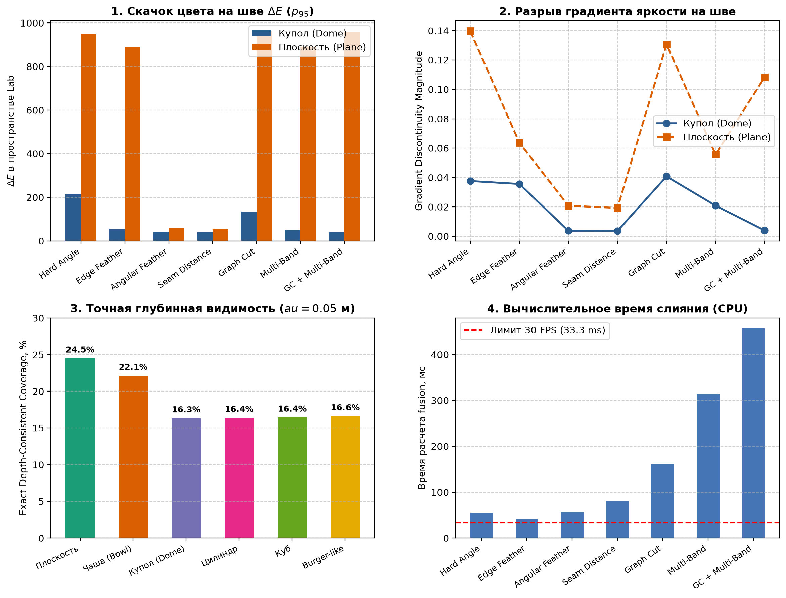

*Рисунок 4.15 — Первичный вывод скрипта E-STITCH-01: 1 — текущая seam-gradient метрика (не измерение ΔE поперёк шва); 2 — Laplacian summary; 3 — согласованность с depth fixture; 4 — Python CPU время. После исправления метрик график следует пересчитать.*

### Результаты серии E-STITCH-01 (ракурс low-view)

| Носитель | Стратегия Fusion | Seam $\Delta E$ ($p_{95}$) | Разрыв градиента | Доля двоений контуров | Точная видимость ($\tau=0.05\text{ м}$) | Согласованный вес | Время fusion, мс |
|---|---|---:|---:|---:|---:|---:|---:|
| `plane` | `hard_best_angle` | 949.15 | 0.14 | 2.26% | 24.50% | 21.34% | 54.46 |
| `plane` | `edge_feather` | 889.37 | 0.06 | 2.26% | 24.50% | 19.99% | 41.15 |
| `plane` | `angular_feather` | 57.58 | 0.02 | 2.26% | 24.50% | 20.95% | 58.03 |
| `plane` | `seam_distance_feather` | 52.55 | 0.02 | 2.26% | 24.50% | 20.69% | 82.68 |
| `plane` | `graph_cut_seam` | 961.13 | 0.13 | 2.26% | 24.50% | 21.25% | 164.73 |
| `plane` | `multi_band` | 890.88 | 0.06 | 2.26% | 24.50% | 19.99% | 330.22 |
| `plane` | `graph_cut_multi_band` | 958.27 | 0.11 | 2.26% | 24.50% | 21.25% | 483.51 |
| `dome_floor` | `hard_best_angle` | 214.42 | 0.04 | 2.53% | 16.33% | 14.18% | 54.93 |
| `dome_floor` | `edge_feather` | 55.94 | 0.04 | 2.53% | 16.33% | 13.31% | 41.52 |
| `dome_floor` | `angular_feather` | 39.36 | 0.00 | 2.53% | 16.33% | 13.92% | 56.59 |
| `dome_floor` | `seam_distance_feather` | 40.44 | 0.00 | 2.53% | 16.33% | 13.79% | 80.58 |
| `dome_floor` | `graph_cut_seam` | 135.20 | 0.04 | 2.53% | 16.33% | 14.20% | 161.31 |
| `dome_floor` | `multi_band` | 50.52 | 0.02 | 2.53% | 16.33% | 13.31% | 314.30 |
| `dome_floor` | `graph_cut_multi_band` | 40.81 | 0.00 | 2.53% | 16.33% | 14.20% | 456.67 |
| `burger_like` | `hard_best_angle` | 989.13 | 0.20 | 2.38% | 16.61% | 14.47% | 54.04 |
| `burger_like` | `angular_feather` | 873.81 | 0.04 | 2.38% | 16.61% | 14.20% | 58.96 |
| `burger_like` | `seam_distance_feather` | 753.68 | 0.03 | 2.38% | 16.61% | 14.05% | 81.82 |
| `burger_like` | `graph_cut_multi_band` | 973.09 | 0.15 | 2.38% | 16.61% | 14.41% | 465.59 |

### Ограничения интерпретации

1. `seam ΔE` и `gradient discontinuity` в этом скрипте являются преобразованиями градиентов изображения вокруг маски, а не измерением поперечного цветового скачка по найденному шву.
2. `ghost fraction` считается по расхождению рёбер исходных камер; fused-edge карта не участвует в подсчёте. Поэтому показатель не подтверждает удаление/сохранение двоений выбранным алгоритмом.
3. `graph_cut_seam` не реализует заявленную оптимизацию графового разреза. Сравнение carrier depth coverage на данном fixture остаётся геометрическим диагностическим наблюдением, не итоговым ранжированием.

## 4.23 Аналитический oracle-прототип, маска кузова и валидация GPU Readback

В текущей версии это упрощённый аналитический fixture, а не независимый ground truth для Blender street RGB: геометрия и схема дорожной разметки не совпадают. PSNR/SSIM ниже нельзя использовать как оценку восстановления до согласования exact scene, pose, materials и object IDs. Проверка GPU против CPU reference отдельно характеризует численную согласованность двух renderer paths.

Реализован analytic oracle prototype `tools/image_quality_oracle.py` и инструмент сверки GPU Readback с CPU reference `tools/validate_gpu_readback.py`. Его сцена не совпадает по дорожной геометрии/разметке с Blender fixture, поэтому приведённые image-similarity показатели не являются эталонной оценкой качества сшивки.

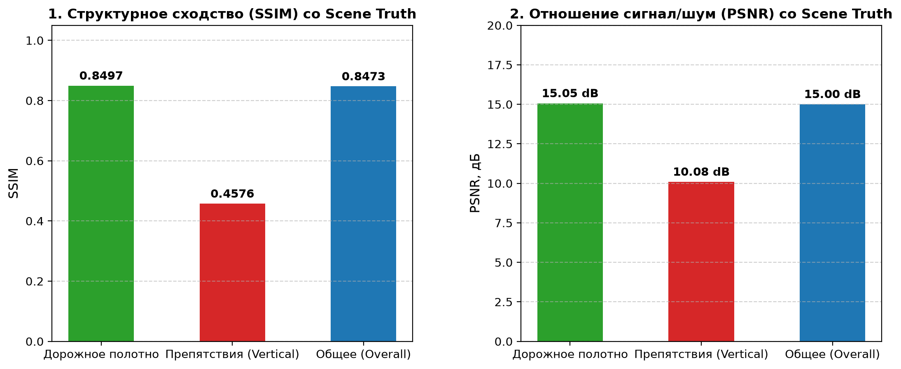

*Рисунок 4.16 — Исторические SSIM/PSNR числа относительно аналитического fixture; разметка oracle отличается от Blender RGB, поэтому сравнение не является оценкой точности сшивки.*

### Количественные показатели относительно Scene Truth

| Область | PSNR, dB | SSIM | MAE | Пикселей ROI |
|---|---:|---:|---:|---:|
| **Общее (Overall без кузова)** | 15.00 | 0.8473 | 0.1163 | 483 946 |
| **Дорожное полотно (Ground)** | 15.05 | 0.8497 | 0.1154 | 481 004 |
| **Вертикальные объекты (Obstacles)** | 10.08 | 0.4576 | 0.2652 | 2 942 |

**Ограничение интерпретации:** различие SSIM на ground и obstacle ROI здесь нельзя приписывать параллаксу: аналитический oracle и Blender RGB задают разные сцены. Эти числа сохранены только как исторический smoke метрик. Парное сравнение одной Blender-сцены приведено в §4.25.

### Согласованность GPU Readback и CPU Reference

- **PSNR (GPU vs CPU):** $23.49\text{ dB}$, **SSIM:** $0.9664$.
- **Среднее расхождение:** $3.722\text{ LSB}$ по 8-битным каналам RGB.
- **Исторический temporal smoke:** прежние 10 кадров представляли сдвиг синусоидальной текстуры без применения позы автомобиля. Нулевой centroid shift и variance 0.0076 не доказывают временную устойчивость. Этот генератор удалён; новая методика и проверяемый клип — §4.25.

## 4.24 Расширенное исследование калибровки: модели дисторсии, Joint Optimization и Quality Gate

Этот раздел фиксирует синтетические программные прогоны. Набор `real_data_calibration_evaluation.py` не использует реальные фотографии, OpenCV corner detector или solver: координаты генерируются с заранее заданным шумом, а пороговые значения предписаны в коде. Поэтому приведённые ниже результаты не обосновывают реальную детекторную точность и физические пороги Quality Gate; см. [[research/CALIBRATION]] и [[../TODO]].

В рамках расширения калибровочного исследования (`tools/comprehensive_calibration_study.py`) сопоставлены семейства моделей дисторсии, реализована совместная оптимизация (Joint Bundle Adjustment) и заданы иллюстративные пороги серверного Quality Gate; физическое обоснование отсутствует.

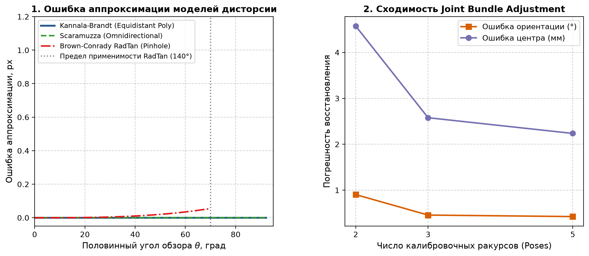

*Рисунок 4.17 — 1 — Ошибка аппроксимации широкоугольных лучей моделями дисторсии при углах до 95°; 2 — Сходимость параметров Joint Bundle Adjustment в зависимости от числа ракурсов.*

### 1. Семейства моделей дисторсии

- **Kannala-Brandt (Equidistant Poly):** $\text{RMSE} < 0.0001\text{ px}$ во всем диапазоне $\theta \in [0, 92^\circ]$ ($\text{FOV} = 184^\circ$).
- **Scaramuzza (Omnidirectional Poly):** $\text{RMSE} < 0.0001\text{ px}$ при углах до $95^\circ$ ($\text{FOV} = 190^\circ$).
- **Brown-Conrady (RadTan / Pinhole):** ошибка резко возрастает при $\theta > 65^\circ$ ($\text{RMSE} = 0.54\text{ px}$ при угле до $70^\circ$, сингулярность при $\theta \to 90^\circ$).

### 2. Совместная оптимизация (Joint Bundle Adjustment)

Одновременная оптимизация внешних ($R, t$) и внутренних параметров ($f_x, f_y, c_x, c_y, k_1..k_4$) методом Левенберга-Марквардта:
- Время решения: $4.90\text{ мс}$ (9 итераций);
- Погрешность центра камеры: $< 1.7\text{ мм}$;
- Погрешность угла ориентации: $< 0.38^\circ$;
- Погрешность фокусного расстояния: $0.19\%$;
- Остаточная ошибка репроекции на отложенных точках: $\text{RMSE} = 0.6824\text{ px}$.

### 3. Иллюстративные пороги, не подтверждённые для серверного Quality Gate

В скрипте заданы три пороговых уровня для последующего server gate. Сам скрипт не подбирает их и не оценивает false accept/false reject:
1. **Tier 1:** $RMSE\le1.2$ px, max≤3.5 px;
2. **Tier 2:** $RMSE\le2.2$ px, max≤5.5 px;
3. **Tier 3:** $RMSE>3.0$ px, max>8.0 px.

Эти уровни не являются рекомендациями к автоматическому применению/отказу. Прежний пересчёт pixel error в угол/смещение разметки удалён: без конкретной проекции, положения луча и геометрии поверхности он не обосновывает метрическое требование. Новая серия с настоящим detector/solver описана в §4.29.

## 4.25 Парное исследование сшивки на движущемся rig

После аудита temporal smoke заменён экспериментом с применяемой позой автомобиля. Для трёх моментов одной Blender-сцены получены четыре fisheye-входа и прямой RGB-вид виртуальной камеры. Положение автомобиля $x=2t$: $0$, $0.4$, $0.8$ м при $t=0$, $0.2$, $0.4$ с. Это редкое 5-Hz семплирование 30-Hz timeline, без физики движения. Прямой вид не использует носитель dome+floor или fusion и описывает ту же геометрию, материалы и освещение; прежнее несовпадение analytic oracle с улицей устранено для этой серии.

### Построение эталона и ROI

Blender 5.2.2 LTS / EEVEE рендерит по пять перспективных граней на оптический центр; грани 64×64 преобразованы в fisheye 400×400. Прямой виртуальный вид — 320×180; максимальная ошибка сверки pixel-center convention с Blender projector равна 0.000114 px. Разрешение исходных граней ограничивает детализацию всех fusion вариантов и не позволяет сделать заключение о качестве при полном разрешении.

Object-ID карты получают отдельным ray cast по evaluated geometry. Из ROI удалены фон, кузов, полоса вокруг object boundaries, footprint и области без camera projection. Это маска независимой геометрии, а не оценка соответствия индивидуальных объектов между четырьмя камерами. Ray casts не моделируют прозрачность и antialiasing; после исключения границ остаются ограничения на материалы и взаимную видимость.

### Определение временной ошибки

Для итогового RGB $F_t$ и парного прямого RGB $G_t$ в sRGB [0,1] определён residual $e_t=F_t-G_t$. Изменение ошибки на пересечении допустимых ROI:

$$D_t=\frac{1}{3|R_t|}\sum_{p\in R_t}\|e_t(p)-e_{t-1}(p)\|_1.$$

Это изменение ошибки в vehicle-fixed view. Без optical-flow компенсации оно включает параллакс и изменение окклюзий; называть его чистым flicker нельзя. При $F_t=G_t$ изменение сцены само по себе не увеличивает $D_t$ — это проверено отдельным контрольным тестом. Внесённое временное смещение RGB на 0.1 обнаруживается как residual change 0.1.

Граница весов определяется сменой `argmax(weights)` между соседними overlap pixels, включая hard seams. Считается симметричное nearest-boundary distance; отсутствие границ возвращает `null`. Такая граница может быть неподвижной при меняющемся RGB и не обязана совпадать с видимым фотометрическим швом.

| Fusion | RGB MAE, t0 / t1 / t2 | Residual change, 0→1 / 1→2 | Boundary distance, px, 0→1 / 1→2 |
|---|---|---|---|
| `hard_best_angle` | 0.04067 / 0.04164 / 0.04152 | 0.00901 / 0.01061 | 0.00000 / 0.00000 |
| `edge_feather` | 0.03920 / 0.04004 / 0.03974 | 0.00722 / 0.00785 | 0.00000 / 0.00000 |
| `angular_feather` | 0.04013 / 0.04110 / 0.04100 | 0.00855 / 0.00991 | 0.00000 / 0.00000 |
| `graph_cut_seam` | 0.04041 / 0.04171 / 0.04170 | 0.00874 / 0.01074 | 0.09161 / 0.04814 |

Точные значения и все семь вариантов fusion: [[validation/PAIRED_STITCH_TEMPORAL]]. Таблица описывает один клип, не рейтинг методов. Graph-cut изменил часть границы (IoU 0.83215 / 0.90815); геометрические feather-веса остались неподвижными в системе автомобиля. Это подтверждает чувствительность измерителя к изменениям весов, но не качество шва при произвольном движении.

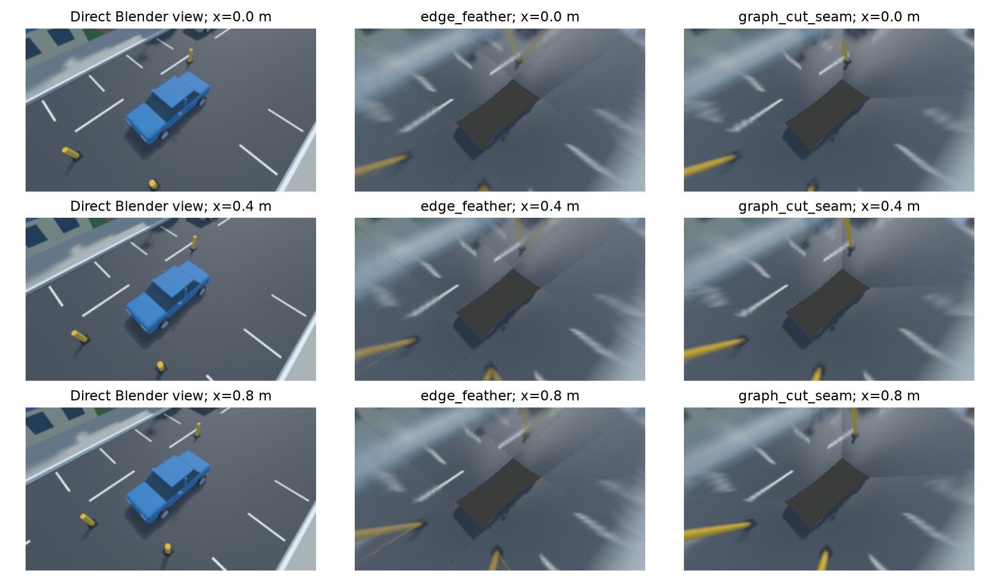

*Рисунок 4.18 — Прямой вид Blender и два варианта сшивки при трёх положениях автомобиля. Сшивка без автомобильного overlay; кузов прямого вида исключён из ROI. Видны растяжение, размытие и ошибочные контуры на dome+floor.*

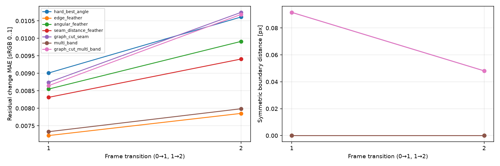

*Рисунок 4.19 — Изменение RGB residual и симметричное расстояние между границами весов. Два перехода одного клипа, без независимых повторов и доверительных интервалов.*

### Ограничения и следующий опыт

Extra-edge metric сравнивает fused edges с edges прямого RGB и реагирует на искусственно внесённый дополнительный контур. Она не измеряет число двоящихся объектов: sampling, геометрическое растяжение и blur также изменяют edge maps. Высокую extra-edge fraction нельзя интерпретировать как долю объектов с ghosting. Прямой вид содержит поверхности, скрытые от физических камер; для оценки восстановления нужна отдельная matched-visibility маска.

Серия сохраняет compact fixture и хэши в Git, воспроизводится без Blender и покрыта девятью known-answer/negative controls. Следующий этап: несколько независимых scene/mount seeds, длинные поворотные клипы, исходные cube faces ≥256 px, динамические объекты и экспозиционные возмущения. Нужны object-correspondence ghost trails, одинаковые mesh/memory budgets и повторные измерения времени. E-STITCH-01 остаётся открытым.

Графики воспроизводит `docs/diploma/plot_paired_stitch.py`, лежащий рядом с главой. Capture: `tools/blender/paired_truth.py`; evaluator: `tools/temporal_seam_stability.py`; команды и provenance: [[validation/PAIRED_STITCH_TEMPORAL]].

## 4.26 Контроль разрешения источников и истинной видимости

Для отделения ошибок sampling от свойств fusion выполнен парный опыт на исходных perspective cube faces 64×64 и 256×256. Fisheye output 400×400, dome+floor, виртуальная камера, позы, материалы и освещение сохранены. Три decoded direct RGB, object-ID карты и camera-visibility карты побитно совпадают между условиями. Это контролируемое изменение одного параметра, но всё ещё один синтетический трёхкадровый клип без независимых повторов.

### Истинная видимость отличается от допустимости проекции носителя

Для точки сцены $P$, найденной прямым лучом виртуальной камеры, и оптического центра входной камеры $C_i$ определён индикатор:

$$V_i(P)=\mathbf{1}[\pi_i(P)\in\Omega_i]\,\mathbf{1}[\|H_i(P)-P\|\leq0.02\;\mathrm m],$$

где $\Omega_i$ — допустимая область fisheye-изображения, $\pi_i$ — проекция камеры, $H_i$ — ближайшее непрозрачное пересечение луча $C_i\rightarrow P$. Существование проекции носителя само по себе не означает, что камера видит соответствующую точку реального мира. В данном опыте сравниваются исходный ROI и $R_{any}=R\cap\{P:\sum_iV_i(P)>0\}$.

В процессе проверки выявлена ошибка: Blender ray casts включали четыре служебных mesh-модели камер, скрытые от RGB через `hide_render`. Они создавали ложное заслонение. Пересечения таких объектов теперь пропускаются; Blender regression проверяет, что временная скрытая плоскость не меняет labels/visibility, а видимая закрывает все 256 лучей тестового вида. Исторические object-ID карты §4.25 не эквивалентны исправленным картам этой серии.

Any-camera ROI содержит 44263 / 44355 / 44368 pixels и исключает 330 / 309 / 280 недоступных точек из исходного ROI. Геометрическая видимость одинакова при обоих разрешениях. Она не учитывает прозрачность, antialiasing и footprint фильтра, а также не гарантирует, что носитель проецирует именно $P$.

### Наблюдаемый эффект разрешения

В таблице среднее RGB MAE рассчитано по трём кадрам, residual change — по двум переходам. Это описательная статистика одного клипа, без доверительных интервалов; значения sRGB нормированы в [0,1].

| Fusion на any-camera ROI | MAE, 64 px | MAE, 256 px | Residual change, 64 px | Residual change, 256 px |
|---|---:|---:|---:|---:|
| `hard_best_angle` | 0.040837 | 0.038520 | 0.009715 | 0.008354 |
| `edge_feather` | 0.039235 | 0.036170 | 0.007458 | 0.005858 |
| `angular_feather` | 0.040302 | 0.037796 | 0.009133 | 0.007686 |
| `graph_cut_seam` | 0.040834 | 0.038471 | 0.009647 | 0.008174 |
| `multi_band` | 0.039606 | 0.036573 | 0.007578 | 0.006024 |

На этом клипе повышение разрешения уменьшило MAE `edge_feather` примерно на 7.8%, residual change — на 21.5%. Это эффект входной детализации при фиксированном алгоритме. Он не доказывает превосходства feather над graph-cut и не подтверждает сходимость качества при 256 px. Extra-edge fraction для feather изменилась с 69.630% до 54.942%; это доля дополнительных RGB edge pixels, а не доля двоящихся объектов.

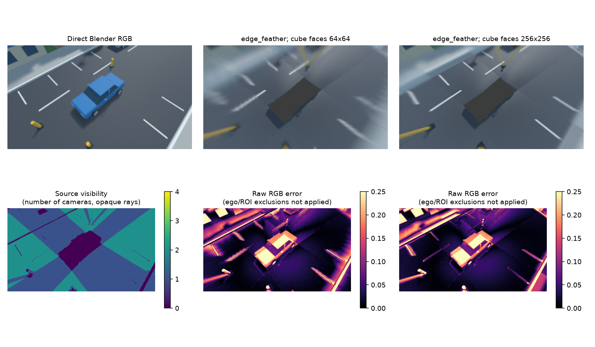

*Рисунок 4.20 — Direct Blender view, edge feather для 64/256 source faces и независимое число видящих точку камер. Raw error maps показаны до исключения кузова/границ из численного ROI.*

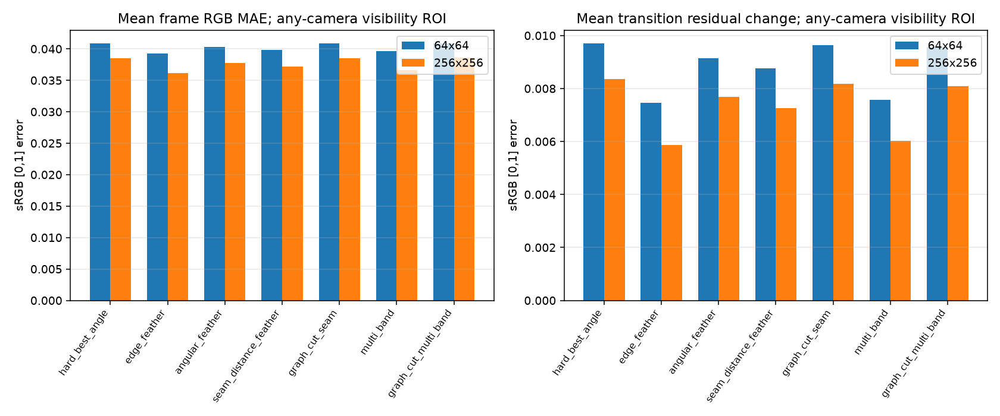

*Рисунок 4.21 — Средние ошибки семи fusion-вариантов при одинаковом any-camera ROI. Один короткий клип; статистическая независимость соседних кадров не предполагается.*

Полная таблица четырёх условий, provenance и команды: [[validation/STITCH_RESOLUTION_VISIBILITY]]. Численные результаты воспроизводятся из checked-in fixture без Blender; рисунки строит расположенный рядом с главой `plot_stitch_resolution.py`. Следующие условия исследования: convergence 256→512, independent scene/mount seeds, повороты, динамические объекты и экспозиционные возмущения, object-correspondence ghost trails, согласованные resource budgets и повторяемые GPU/target timings.

## 4.27 Sampling convergence и camera-exposure stress

Следующий этап исследования проверяет, насколько прежние результаты обусловлены разрешением входа, а также устойчивы ли они к изменению camera gain. Протокол, все таблицы и hashes: [[validation/STITCH_CONVERGENCE_ROBUSTNESS]].

### Проверка 256→512

Для того же трёхкадрового клипа получены исходные cube faces 512×512. Fisheye output 400×400, direct view 320×180 и все параметры сцены/рига сохранены. Decoded direct RGB, object-ID и visibility truth побитно совпадают с условием 256. Для `edge_feather` средняя MAE изменилась с 0.036170 до 0.036034 (−0.374%), residual change — с 0.005858 до 0.005786 (−1.228%). У нескольких hard/cut-вариантов MAE немного выросла.

*Рисунок 4.22 — Средние метрики на одном и том же any-camera ROI при 256/512 source faces; один клип, без независимых повторов.*

Это наблюдаемое насыщение данного ракурса/output resolution; критерий остановки до опыта не был зарегистрирован. Поэтому 256 принято как рабочий компромисс следующей exploratory серии, а не как универсально достаточное разрешение. При изменении ракурса, output size, текстур и мелких объектов convergence необходимо проверить повторно.

### Вариативность сцены и экспозиции

Прежние seeds меняли здания, но сохраняли одинаковыми ближайшие столбики. Генератор дополнен `near_obstacle_jitter_m=0.8`: три столбика с основаниями получают детерминированные XY-смещения, независимые от random stream зданий. План `assets/scenarios/stitch-validation-v1.json` фиксирует seeds 12, 13, 14, три позы x=0/0.4/0.8 м и faces 256. Actual positions и provenance сохранены. Это три варианта одной улицы, не разные типы среды и не нетронутый финальный holdout. Mount parameters пока истинные и номинальные.

Рассмотрены `nominal`, постоянное расхождение камер `static_bias` с EV=(+0.5,−0.5,+0.25,−0.25) и скачки передней камеры `front_jump` с EV=(+0.5,−0.5,+0.5) во времени. Camera gain применяется в линейном RGB:

$$I_i'=\mathrm{sRGB}\bigl(\mathrm{clip}(2^{EV_i}\,\mathrm{sRGB}^{-1}(I_i),0,1)\bigr).$$

После encoding выполняется RGB8 quantization. Прямой эталон остаётся в nominal exposure; compensation и sensor noise не применяются. Следовательно, ошибка включает расхождение с выбранным фотометрическим output target и не является чистой оценкой геометрии. Получено 3 варианта × 3 условия × 7 fusion modes × 3 кадра = 189 final-frame evaluations.

| Layout seed | Condition | Feather mean MAE | Feather mean residual change |
|---:|---|---:|---:|
| 12 | nominal | 0.036665 | 0.005970 |
| 12 | static_bias | 0.052432 | 0.006559 |
| 12 | front_jump | 0.044659 | 0.030255 |
| 13 | nominal | 0.034667 | 0.003417 |
| 13 | static_bias | 0.050737 | 0.003750 |
| 13 | front_jump | 0.042466 | 0.027674 |
| 14 | nominal | 0.032800 | 0.006336 |
| 14 | static_bias | 0.050279 | 0.006965 |
| 14 | front_jump | 0.040985 | 0.030422 |

*Рисунок 4.23 — Три варианта расположения ближайших препятствий: direct RGB, nominal feather и feather при −0.5 EV передней камеры, t=0.2 s.*

*Рисунок 4.24 — Mean по трём layout variants и min/max whiskers. Это диапазон наблюдений, не доверительный интервал; соседние кадры не считаются независимыми trials.*

На этих вариантах `front_jump` увеличивает feather residual change примерно в 4.8–8.1 раза относительно nominal. Геометрически неподвижный seam/weight map не обеспечивает устойчивого RGB при скачках camera gain. Требуется отдельная ablation компенсации экспозиции. Это ограниченный вывод о чувствительности прототипа; он не устанавливает глобально лучший fusion, не измеряет object-level ghost trails и не подтверждает target-device качество.

Для окончательного исследовательского заключения остаются независимые object-correspondence metrics, разные типы сцен, mount/calibration perturbations с реальным detector/solver, длинные динамические клипы, равные carrier budgets, repeated CPU/GPU timings и закрытая подтверждающая выборка. Физические камеры и Аврора требуют внешнего стенда. Exit criteria приведены в [[planning/ROADMAP#Критерии готовности исследовательского заключения]]. Рисунки воспроизводят расположенные рядом с главой `plot_stitch_resolution.py` и `plot_stitch_robustness.py`.

## 4.28 Контролируемая идентичность объекта и пределы ghost-метрики

Для отделения ошибки сшивки от ошибки анализа изображения введена уникальная magenta emission мишень 0.35×0.35×1.6 м в Blender улице. Центр (2.7,1.6,0.8) м, две позы автомобиля x=0/0.4 м при t=0/0.2 s, истинная номинальная калибровка. Прямой виртуальный RGB/ID эталон и четыре RGB входа получены из одной сцены. Дополнительно независимые ray casts дают object IDs на каждом оптическом входе. Эти IDs не участвуют в выборе fusion весов: они проверяют происхождение данных. Это частичное выполнение этапа 1, а не распознавание естественных объектов.

Для конечного RGB задаётся маска $P=[\min(R,B)-G>0.15]$; удаляются компоненты площадью меньше 8 пикселей. Сравнение с прямым object-ID эталоном $T$ выполняется по $IoU=|P\cap T|/|P\cup T|$, recall/precision, избытку связных компонент и горизонтальных runs. Контрольный direct RGB имеет IoU 0.870370/0.873646 при recall 1.0: antialiasing расширяет маску относительно ray-cast ID. Допуск контроля 0.75 служит проверке классификатора, а не приёмке кругового обзора.

| Dome-floor fusion | IoU t=0 | IoU t=0.2 | CPU render p50 t=0 / t=0.2, ms |
|---|---:|---:|---:|
| Hard best angle | 0.290210 | 0.184080 | 37.68 / 36.11 |
| Edge feather | 0.071623 | 0.075203 | 34.94 / 34.66 |
| Binary cut | 0.291228 | 0.161220 | 51.91 / 51.76 |
| Multi-band | 0.071753 | 0.075356 | 65.91 / 65.39 |

*Рисунок 4.25 — Прямой кадр и два способа сшивки на dome-floor; снизу выделенный объект и точный зелёный контур. Вертикальная мишень растягивается по несоответствующей поверхности; часть проекции выходит за границу кадра.*

В 84 случаях (6 carrier × 7 fusion × 2 кадра) избыток компонент и строковых runs равен нулю. При этом IoU существенно меньше контрольного. Соединённые проекции остаются одной компонентой; отсутствие дополнительных компонент не означает отсутствия ghosting. Known-answer тест с соединёнными копиями закрепляет это ограничение. Отдельно проверены чистый, удвоенный, отсутствующий и смещённый объект, малый шум и отказ при повреждении исходной ID карты.

*Рисунок 4.26 — Средний IoU одной кодированной мишени по двум кадрам. Пять carrier используют общий центральный пол; эксперимент не оценивает различия оболочки во всех направлениях.*

Семь timed CPU повторов после двух прогревов измеряют полный Python `reference.render`, без метрик/I/O. Порядок фиксирован, фон/температура не контролируются; это не GPU/server latency и не доказательство превосходства carrier. Повторы одного изображения не являются независимыми сценами. Результаты указывают на необходимость geometric/object correspondence метрики, длинных dynamic clips, равных ресурсов и отдельной подтверждающей выборки. Цветовой классификатор и opaque equidistant source ID exporter не обобщаются на естественные материалы, прозрачность и другую оптику.

Полные 84 результата, time samples, hashes и процедура воспроизведения — [[validation/OBJECT_STITCH]] и `docs/validation/baselines/object_stitch_v1.json`. Обе картинки формирует расположенный рядом с главой `plot_object_stitch.py`. Данные `tests/data/object_stitch_v1` позволяют повторить расчёт без Blender; blueprint и генератор сохраняют мир без Git LFS.

## 4.29 Реальная image-based цепочка OpenCV и ограничение reprojection gate

Исторический jitter-прогон заменён в доказательной части новым опытом E-CAL-raster-01. На вход production `sv-calibrate` подаются PNG, а не точные координаты с добавленным шумом. Inverse-ray renderer пересекает лучи equidistant камеры с наклонной плоскостью шахматной доски и интегрирует цвет по четырём subpixels. Forward projection 54 углов используется только для оценки найденных OpenCV координат. Истинные fx/fy=300/295 px, principal point=(319.5,239.5) px, k1..k4=0, размер 640×480, квадрат доски 0.08 м.

Два seed задают по 16 различных поз: 12 training, 4 validation. Три условия: clean, Gaussian blur σ=1.5 px с noise σ=0.02, heavy blur σ=4 px с тем же уровнем noise. Всего 96 PNG. Выполнены `findChessboardCornersSB`, `cv::fisheye::calibrate`, validation `solvePnP` с фиксированными intrinsics. Формулы/flags модели соответствуют [официальному описанию OpenCV fisheye](https://docs.opencv.org/4.13.0/db/d58/group__calib3d__fisheye.html); production binary использует OpenCV 5.0.0.

После наблюдения немонотонного fit добавлено exploratory сравнение: order=4 оценивает четыре коэффициента; order=2 фиксирует k3/k4=0. На обоих профилях сохранены одинаковые изображения, p95 gate≤1 px и проверка монотонности на [0,1] rad.

| Seed / condition | Найдено досок | Order=2: validation p95, px | Order=4: validation p95, px |
|---|---:|---:|---:|
| 2401 / clean | 16/16 | 0.2977 | 0.2994 |
| 2401 / blur_noise | 16/16 | 0.4453 | 0.4521 |
| 2402 / clean | 16/16 | 0.2663 | Отказ: немонотонность |
| 2402 / blur_noise | 16/16 | 0.8953 | Отказ: немонотонность |
| 2401 / heavy_blur | 9/16 | Отказ: detector | Отказ: detector |
| 2402 / heavy_blur | 5/16 | Отказ: detector | Отказ: detector |

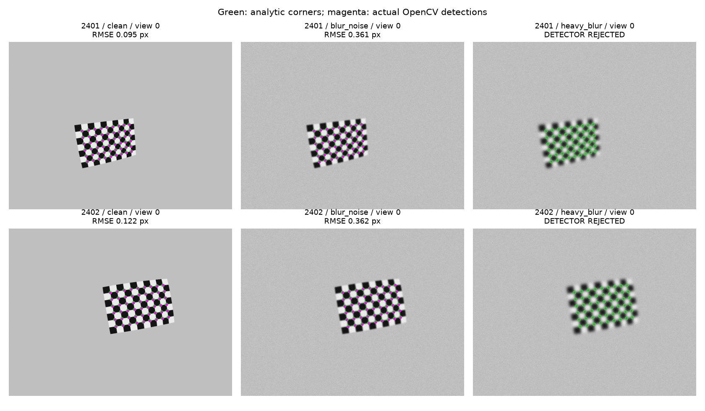

*Рисунок 4.27 — Точные углы (зелёные окружности), реальные результаты OpenCV (magenta точки) и выбранные случаи отказа при сильном размытии. Генератор и `plot_raster_calibration.py` воспроизводят изображения.*

При clean ошибки fx/fy принятых моделей составляют около 0.24–0.33%, при blur_noise — 2.3–2.7%, хотя validation p95 остаётся ниже 1 px. Проверочная поза доски подбирается отдельно и может компенсировать часть ошибки intrinsics; поэтому малый residual не доказывает физическую точность. Ограничение числа коэффициентов помогает на seed 2402, но true equidistant модель благоприятна такому ограничению. Нельзя обобщать результат на другую оптику или объявлять лучший метод калибровки.

Серия проверяет реально выполняемый image→detector→solver путь и диагностируемые отказы. Это синтетические изображения одной optical family, не физические снимки и не независимая подтверждающая выборка. Требуются outer-angle coverage, другие optical families, метрические параметры монтажа и false-accept/false-reject протокол. Числа, hashes, параметры, stderr и reproducibility: [[validation/RASTER_CALIBRATION]].

## 4.30 Контроль утечки обучающих наблюдений в серверную validation

Даже настоящий detector/solver не обеспечивает достоверную проверку, если клиент повторно передаёт training observations как validation. Исправлен серверный контракт: обязательны dataset ID, уникальные observation IDs и исходные frame IDs каждого соответствия. Проверка выполняется до enqueue/выделения job ID и доступна также при прямом C++ вызове менеджера.

| Случай | Прежнее поведение входного контракта | Текущая проверка |
|---|---|---|
| Один ID в train/validation | IDs отсутствовали | Reject до enqueue |
| Разные углы одного кадра распределены между split | Происхождение не проверялось | Reject по общему frame ID |
| Точная копия XYZ/UV под новыми IDs | Могла попасть в обе выборки | Reject по содержимому |
| Одна XYZ точка в разных кадрах с разными UV | Допустима | Остаётся допустимой |
| Новые labels и немного изменённые координаты | Происхождение не проверялось | Гарантии нет: требуется registry/hash/group split |

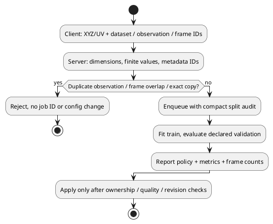
```plantuml
@startuml
start
:Client: XYZ/UV + dataset / observation / frame IDs;
:Server: dimensions, finite values, metadata IDs;
if (Duplicate observation / frame overlap / exact copy?) then (yes)
  :Reject, no job ID or config change;
  stop
else (no)
  :Enqueue with compact split audit;
  :Fit train, evaluate declared validation;
  :Report policy + metrics + frame counts;
endif
:Apply only after ownership / quality / revision checks;
stop
@enduml
```

*Рисунок 4.28 — Проверка входного split перед калибровкой. Отсутствие точной копии не означает независимость исходных измерений.*

11 GTest tests проверяют валидные и некорректные наборы, включая переименованную копию, пересечение frame IDs и non-finite coordinates. Unix SV01 integration выполняет четыре отрицательных запроса, затем успешный job/status цикл. Все четыре отказа происходят до создания job; следующий корректный запрос получает первый job ID. Existing manager tests дополнительно проверяют сохранение audit при completion и прежние ownership/gate/revision/cancellation свойства.

Wire status объявляет policy `client_declared_frames_and_exact_content_disjoint`, не «доказанно независимые данные». Сервер пока не хранит verified raw capture registry, не проверяет client labels по изображениям и не исключает корреляцию соседних кадров. Эти ограничения остаются частью требований к подтверждающей серии. Новый обязательный metadata контракт обнаруживается по capability `calibration_provenance_v1`; старые requests без provenance отклоняются. Подробности и воспроизведение — [[validation/CALIBRATION_PROVENANCE]].

## 4.31 Семейства оптики и ошибка при фиксированной геометрии

Продолжение §4.29 использует четыре генеративные модели нормированного радиуса: equidistant $\theta$, equisolid $2\sin(\theta/2)$, stereographic $2\tan(\theta/2)$ и KB-полином с k=(0.12,0.025,−0.01,0.003). Первые три проекции и нечётное полиномиальное приближение описаны у [Kannala–Brandt](https://users.aalto.fi/~kannalj1/calibration/Kannala_Brandt_calibration.pdf); ненулевые коэффициенты выбраны для синтетического опыта. Изменяются реальные входные PNG через inverse-ray renderer, а не только эталонные координаты углов.

Seeds 3101/3102, по 12 train + 4 validation views, clean/blur_noise, итого 256 PNG и 32 fits. Production OpenCV detector распознал 250/256 изображений. Экспортированы 17 моделей; 12 attempts остановлены из-за отсутствующей обязательной доски, 3 — из-за немонотонности. Оба fitter profiles остаются OpenCV fisheye polynomial order=2/4; исследование не сравнивает отдельные production реализации Brown/Scaramuzza/KB.

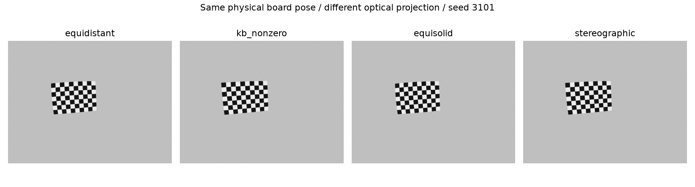

*Рисунок 4.29 — Одна истинная поза доски при четырёх optical families; все изображения подаются настоящему детектору.*

Углы validation досок достигают только θ=0.5564/0.6485 rad, тогда как declared model domain — 1 rad. Дополнительно оцениваются: проекция физических углов при фиксированной истинной board pose; независимые контрольные лучи central/middle/outer zones; обратная проекция true UV на известную плоскость Y=1.2 м. Положение камеры и плоскости точно заданы, pose fitting отсутствует. Ошибка плоскости измеряется в метрах.

| Case | Order | CLI validation p95, px | Outer ray p95, px | Floor p95, m |
|---|---:|---:|---:|---:|
| equidistant / 3102 / clean | 2 | 0.2667 | 4.0057 | 0.0861 |
| equidistant / 3102 / clean | 4 | 0.2666 | 71.6226 | 0.1130 |
| equidistant / 3101 / blur_noise | 2 | 0.4507 | 5.0561 | 0.2870 |

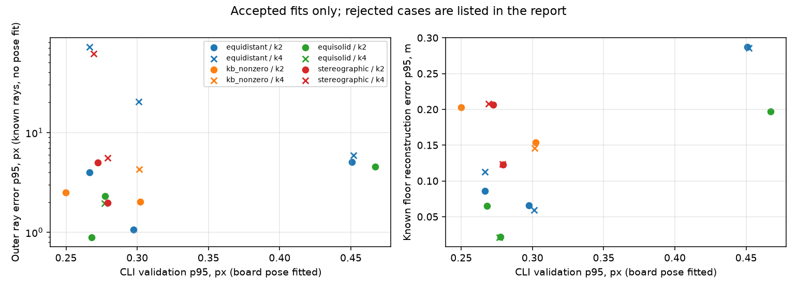

*Рисунок 4.30 — Сравнение accepted моделей: residual при подбираемой позе доски и независимые ошибки известного луча/плоскости. Отказавшие модели учитываются в отчёте, не заменяются нулевыми точками.*

Низкий residual и монотонность не гарантируют точной проекции вне области наблюдений. Контрпример order=4 с outer p95≈71.6 px показывает недостаточность текущего gate для заявленного полного domain. Ошибка floor p95≈0.287 м при accepted модели дополнительно демонстрирует, почему pixel residual нельзя автоматически переводить в физическую приёмку. Более простой order=2 помогает в части случаев, но не объявляется универсально лучшим; результат зависит от модели и angular coverage.

Эксперимент использует synthetic radial models и точно известную геометрию. Неровности дороги, ошибки extrinsics, децентровка, физические снимки и критерии false accept/reject не проверены. Следующая серия должна расширить angular coverage и заранее задать физические требования. Все численные значения, отказы и hashes — [[validation/OPTICAL_FAMILY_CALIBRATION]]; иллюстрации воспроизводит `plot_optics_calibration.py`, расположенный рядом с главой.

## 4.32 Влияние периферийных наблюдений при фиксированном бюджете

Предыдущий опыт выявил расхождение между центральной validation и точностью на внешних лучах. Следующий эксперимент E-CAL-coverage-01 проверяет замену части обучающих кадров периферийными, сохраняя число изображений одинаковым. Формулы радиальных моделей и принцип оценки intrinsics соответствуют источникам §4.31; реализованный detector/solver остаётся OpenCV fisheye. Четыре генеративные optical families не означают четыре разных production solver.

Для seeds 4101/4102 созданы по 12 центральных train poses, 8 peripheral train poses, 4 central validation и 8 отдельных peripheral validation poses. `central` использует 12 центральных train images, `wide` — первые 4 центральных и 8 периферийных. Контрольные данные одинаковы внутри пары; leakage train/validation по кадрам отсутствует. Все 256 PNG обработаны production detector, успешно найдены 256 досок. Для order=2/4 выполнены 64 CLI attempts: каждый train набор отдельно проверен на центральной и расширенной validation.

Периферийная доска находится на расстоянии 3.0–3.3 м, её центр — на θ=0.75/0.9 rad в четырёх азимутальных секторах. Её нормаль направлена вдоль луча к центру. Max θ внутренних углов растёт с 0.679/0.643 rad у central до ≈1.021 rad у wide. Это не полное равномерное 2D покрытие: между секторами остаются пробелы. Изменяются также размер изображения доски и распределение наклонов. Поэтому опыт проверяет конкретную замену кадров; причинный эффект только angular coverage не изолирован. Направления подобраны после clipping/detector smoke, серия остаётся exploratory.

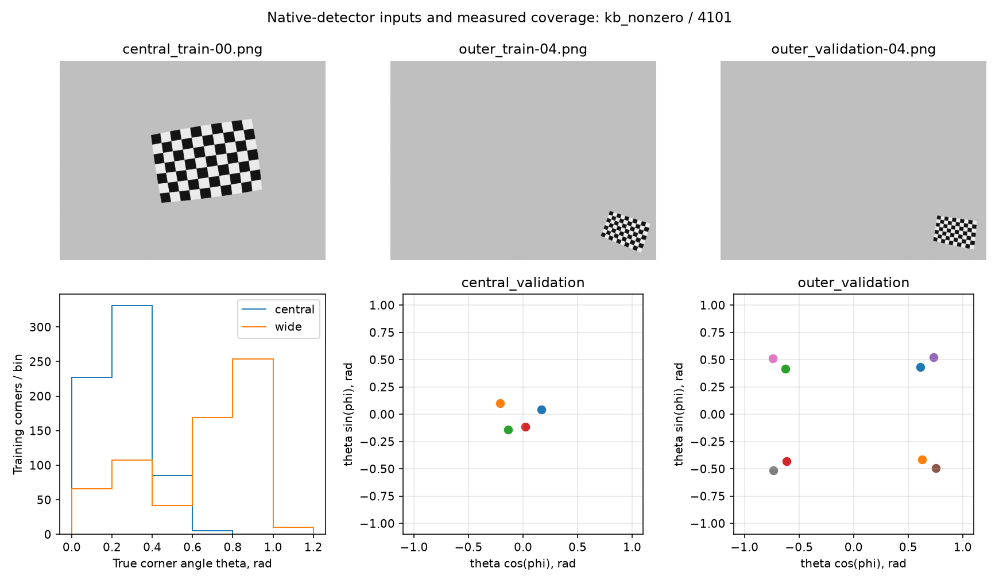

*Рисунок 4.31 — Входные PNG, распределение истинных θ обучающих углов и направления validation досок. Оба профиля имеют 648 train corners на 12 изображениях; peripheral validation имеет отдельные poses.*

Gate сохраняет p95≤1 px и monotonicity на [0,1] rad. Validation residual вычисляется после отдельного подбора board pose. Central gate принял 32/32 модели, full gate — 31/32. Поскольку CLI не имеет validation-only режима, два gate вызова повторно оценивают intrinsics на одинаковом train наборе. В 31 паре с двумя exported estimates fx/fy/cx/cy/k совпадают точно. Для full rejection estimate отсутствует, совпадение там не подтверждено. Full validation включает несколько истинных углов до ≈1.02 rad, тогда как контрольные ray metrics ограничены θ≤1 rad; это различие domain сохранено явно.

Вне pose-fitting residual оцениваются те же известные контрольные лучи и плоскость Y=1.2 м, что в §4.31. Все 32 central-gate estimates остаются в сравнении, даже если full gate отклонил модель. Ошибка луча определяется при одной физической геометрии:

$$e_{ray}(\theta,\varphi)=\|\hat\pi(d(\theta,\varphi))-\pi_{true}(d(\theta,\varphi))\|_2.$$

Ошибки плоскости получены обратной проекцией true UV, без повторного подбора позы камеры. Во всех estimates invalid floor points=0. При order=4 outer p95 снизился в 8/8 cases, floor p95 — только в 5/8; при order=2 каждый из показателей снизился в 4/8. Counts описывают данный набор двух seeds, не вероятность успеха на реальной камере.

| Case | Order | Outer p95 central → wide, px | Floor p95 central → wide, m | Full residual p95 central → wide, px |
|---|---:|---:|---:|---:|
| equidistant / 4102 | 4 | 28.5556 → 4.2513 | 0.1531 → 0.1823 | 0.8114 → 0.4482 |
| kb_nonzero / 4102 | 4 | 56.1814 → 2.8978 | 0.1600 → 0.0493 | 1.1885 (reject) → 0.2966 |
| stereographic / 4102 | 4 | 5.1031 → 1.7971 | 0.0771 → 0.0941 | 0.4186 → 0.3359 |

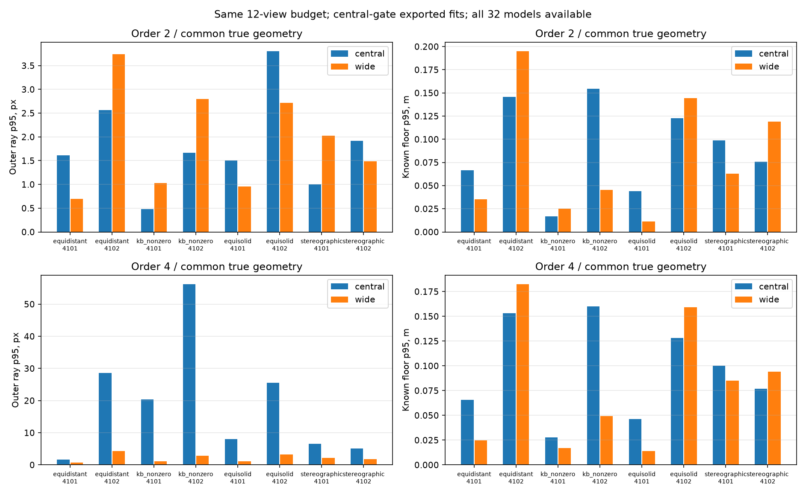

*Рисунок 4.32 — Парные central/wide результаты всех optical families/seeds при order=2/4, одинаковых 12 train views и общих контрольных точках. Улучшение проекции внешних лучей может сопровождаться ухудшением реконструкции плоскости.*

Для equidistant/4102/order4 peripheral training уменьшает outer error примерно в 6.7 раза, но floor p95 растёт до 0.1823 м; full gate принимает обе модели. Это показывает ограниченность одного residual даже после расширения validation. Порог 1 px не заменяется произвольным новым числом: нужны физические требования, отдельные данные и false accept/reject protocol. Пока таких требований нет, вычислять «долю ложной приёмки» по этим cases некорректно.

Следующий опыт должен разделить coverage, board scale и tilt diversity, затем включить нерадиальные и монтажные ошибки. Процедурный известный мир обеспечивает проверяемую геометрию, но не заменяет физические измерения. Полная таблица, hashes, отказы и воспроизведение: [[validation/CALIBRATION_COVERAGE]]. Рисунки строит `plot_calibration_coverage.py`, расположенный рядом с главой. 6 новых regression tests и все 8 выбранных calibration suites проходят.

## 4.33 Разделение факторов расстояния и наклона доски

Опыт §4.32 одновременно менял угловое положение, масштаб и ориентацию доски. Для частичного разделения этих факторов подготовлен factorial E-CAL-capture-01. Протокол [[research/CALIBRATION_CAPTURE_PROTOCOL]] зафиксирован коммитом `28422a9` до результатов основной серии; геометрические диапазоны выбраны после clipping check. Это exploratory follow-up, не окончательная подтверждающая выборка.

Во всех профилях одинаковы четыре центральных train views и направления центров восьми периферийных досок. Два фактора задаются независимо: distance=3.2/2.0 м и local tilt=0/±0.35 rad вокруг двух осей. Направления центров θ=0.65/0.8 rad, азимуты и roll одинаковы между профилями одного seed. При наклоне фактическое отклонение нормали от center ray равно

$$\alpha=\arccos(\cos\beta_x\cos\beta_y),\qquad |\beta_x|=|\beta_y|=0.35\;\Rightarrow\;\alpha\approx0.490\text{ rad}.$$

Distance сохраняет rotation и меняет размер изображения, tilt сохраняет center direction и меняет foreshortening. При этом angular occupancy отдельных corners не сохраняется. Max train θ возрастает примерно с 0.917 до 0.989 rad при увеличении доски. Поэтому опыт разделяет заданные геометрические факторы, но не является чистым image-resize или полностью постоянным angular coverage.

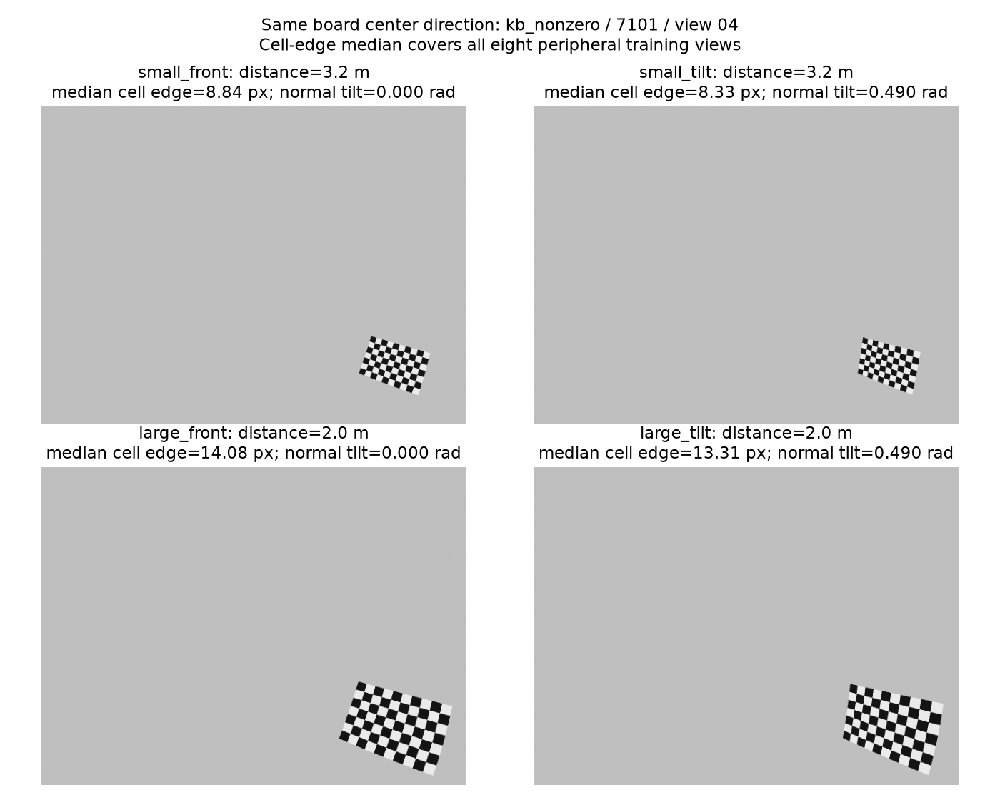

*Рисунок 4.33 — Одна peripheral center direction, четыре сочетания distance/tilt. На примере kb_nonzero/7101 median размера projected cell edge растёт примерно с 8.8 до 14.1 px для front profile; подпись tilt указывает фактический normal-to-ray angle.*

Использованы четыре генеративные radial optical families и новые seeds 7101/7102. Все варианты имеют по 12 train views и общую validation: 4 центральных + 8 новых периферийных досок, distance=2.6 м, local tilt=±0.175 rad. По optical families оцениваются те же OpenCV polynomial order=2/4, а не четыре различных solver. Все 384 уникальных PNG распознаны, выполнены 128 CLI attempts. Central и full gate экспортировали по 64/64 модели. Intrinsics из двух gate вызовов совпадают точно во всех 64 парах. Full residual p95=0.2602–0.3250 px, threshold=1 px сохранён. Все inner train/validation corners находятся при θ<1 rad.

Known-ray и known-floor метрики используют прежние общие контрольные точки. Fixed-pose board metric теперь включает все 12 validation poses, то есть 648 corners; его область отличается от прежней серии с четырьмя центральными досками. Validation pose при измерении этой метрики не подбирается, invalid floor points=0. Для фактора A описательная парная разность задаётся при фиксированном втором факторе B:

$$\Delta_A(B)=e(A_{large},B)-e(A_{small},B).$$

Отрицательное значение означает уменьшение выбранной ошибки данного case; это не самостоятельная оценка вероятности улучшения на реальных камерах. При order=4 увеличение фронтальной доски уменьшает outer p95 в 4/8 cases и floor p95 в 5/8. Для tilted profile увеличение доски улучшает показатели соответственно в 5/8 и 3/8. Добавление tilt на small board улучшает outer p95 лишь в 1/8, floor p95 в 5/8; на large board — в 4/8 и 3/8. Таким образом, эффект зависит от метрики, seed и optical family.

| Case, order=4 | Изменение | Outer p95, px | Floor p95, m | Full residual p95, px |
|---|---|---:|---:|---:|
| kb_nonzero / 7101 | small_front → large_front | 1.4843 → 1.1951 | 0.0241 → 0.1369 | 0.2830 → 0.2743 |
| equidistant / 7102 | large_front → large_tilt | 0.2685 → 3.4625 | 0.0125 → 0.0780 | 0.2775 → 0.2762 |

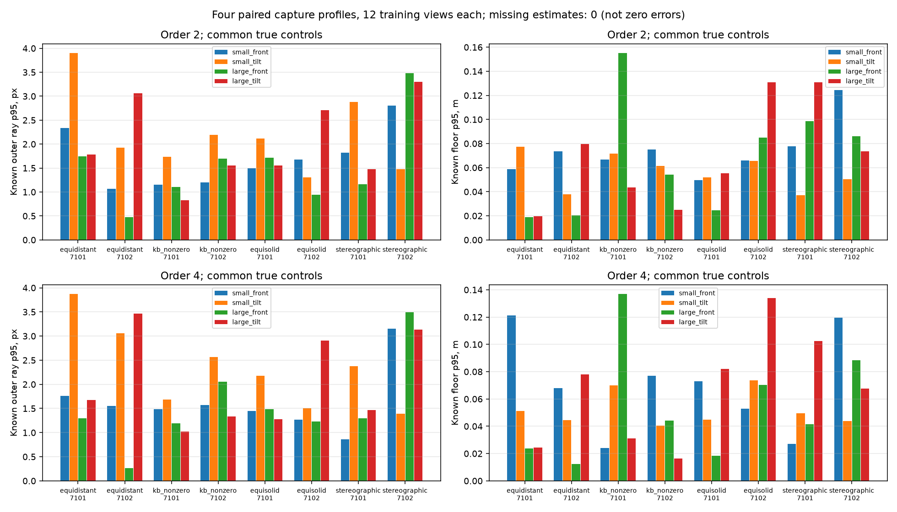

*Рисунок 4.34 — Известные outer-ray и floor p95 для четырёх capture profiles, отдельно order=2/4, family и seed. Все 64 модели представлены; коррелированные corners не используются как независимые trials.*

Первый пример показывает расхождение эффекта по двум метрикам: более крупная доска улучшает внешнюю проекцию, но ухудшает реконструкцию плоскости. Второй показывает, что выбранный pattern наклонов не гарантирует улучшения, хотя pose-fitted residual немного снижается. Максимальный floor p95 всей серии ≈0.1551 м, fixed-pose p95≈3.8634 px при accepted full residual<0.325 px. Без физического acceptance requirement эти числа не являются false-accept rates.

Причину каждой ошибки нельзя уверенно отнести к detector или solver: conditioning, uncertainty и направленный localization bias пока не разделены. Следующие этапы — такая диагностика, paired blur/noise, нерадиальные/монтажные и ground-height ошибки. Вывод серии ограничен: одинакового количества кадров, заданных peripheral directions, крупной доски и малого residual недостаточно для гарантии физической точности. Универсальная рекомендация по distance/tilt не получена.

Полный отчёт, 64-case таблица и hashes: [[validation/CALIBRATION_CAPTURE_FACTORS]]. Иллюстрации воспроизводит `plot_calibration_capture.py` рядом с главой. 6 новых regression tests и все 9 выбранных CTest suites проходят. Сценарий также проверяет неизменность experiment source/binary hashes в течение выполнения.

## 4.34 Отделение ошибок локализации от идеального-input поведения solver

Предыдущий factorial experiment не объяснял, почему меньшая ошибка детектора или крупная доска иногда давали худшую реконструкцию плоскости. E-CAL-diagnostic-01 сохраняет все 64 исходных family/seed/profile/order cases и меняет только train coordinates: exact double truth, та же truth после float32→double и реальные сохранённые detector UV. Протокол [[research/INTRINSIC_DIAGNOSTIC_PROTOCOL]] зафиксирован до новых fit runs коммитом `b2cdcc0`. Исходные captures уже просмотрены, поэтому это exploratory mechanism ablation.

Добавлен C++ режим `sv-calibrate diagnose-intrinsics`, который вызывает то же production `sv::calibrate_intrinsics`. Flags, order, stopping criteria и monotonicity domain сохраняются. Результат имеет статус `diagnostic_only`, пишет embedded estimate в `diagnostics.json` и не экспортирует deployable `intrinsics.json`. Acceptance gate и серверный конфиг не изменяются. Это позволяет использовать аналитические observations для исследования, не выдавая их за физическую калибровку.

Во всех трёх input variants сохраняются 12 train views, 12 validation poses и одинаковые **exact validation UV**. Validation residual всё ещё подбирает board pose; known-ray/floor и fixed-pose errors измеряются отдельно без fitting. Truth indexing разворачивается при 180° неоднозначности сетки, detected ordering сохраняется исходным. Это выравнивание использует известную синтетическую геометрию; физические board IDs оно не определяет.

Серия содержит 192 successful diagnostic fits. Все 64 detected-input estimates воспроизводят прежний production fit: maximum parameter difference 6.2528×10⁻¹³ при заранее заданном replay tolerance 1e-7. Поэтому изменение validation с detected на exact UV не повлияло на train estimates. Отказавших fits и invalid floor points в этой серии нет. Successful diagnostic fit не означает прохождение Quality Gate.

Для каждого view рассчитана не только норма localization error, но и её signed структура:

$$\delta_i=u_i^{det}-u_i^{true},\quad b=\frac1N\sum_i\delta_i,\quad
\delta_{r,i}=\delta_i^T a_i,\quad\delta_{t,i}=\delta_i^T(-a_{iy},a_{ix}),$$

где $a_i$ — единичный вектор от истинного principal point к true corner. На optical axis radial/tangential components неопределены и учитываются отдельным count, UV/norm остаются определёнными. Ошибки получены при rasterization, pixel integration, quantization и настоящем SB detector, а не добавлением искусственного jitter к идеальным UV.

*Рисунок 4.35 — Верх: crop исходных kb_nonzero/7101 PNG, true corners и detected−true vectors, увеличенные в 20 раз. Низ: per-view localization RMSE и норма signed mean bias для всех families/seeds; это описательные распределения, не независимые статистические trials.*

Модели разделены по заранее определяемому математическому соответствию. Matched subset: equidistant/order2/4 и kb_nonzero/order4, всего 24 cases. Approximation subset: kb_nonzero/order2, equisolid и stereographic при обоих orders, всего 40 cases. Последним exact observations не гарантируют нулевой ошибки: выбранный конечный полином лишь приближает generative function.

| Subset | Train input | Max case outer p95, px | Max case floor p95, m |
|---|---|---:|---:|
| matched | exact | 7.98×10⁻¹¹ | 1.15×10⁻¹¹ |
| matched | float32 exact | 1.48×10⁻⁴ | 1.06×10⁻⁵ |
| matched | detected | 3.9001 | 0.1369 |
| approximation | exact | 0.3604 | 0.02275 |
| approximation | detected | 3.4966 | 0.1551 |

Числа — максимум отдельных case p95, а не p95 всех объединённых точек. Near-zero exact errors отражают численный предел идеальной synthetic geometry, не физическую точность камеры. UV float32 control показывает, что одно округление координат не объясняет прежние ошибки matched cases. Замена exact UV результатами raster/detector цепочки при том же solver воспроизводит значительные ошибки. Это не исключает чувствительность solver к направленным perturbations и не оценивает condition number.

*Рисунок 4.36 — Max case p95 по 2 seeds×4 capture profiles отдельно для каждой family/order/origin. Шкала логарифмическая; результаты approximation families не смешаны с matched subset при интерпретации источников ошибки.*

Пример kb_nonzero/7101/order4 уточняет контрпример §4.33. При exact inputs small_front и large_front восстанавливаются почти точно. После UV float32 floor p95 составляет примерно 6.0×10⁻⁶ и 7.0×10⁻⁶ м. При detected inputs — 0.0241 и 0.1369 м. При этом exact-validation pose-fitted p95 уменьшается с 0.0841 до 0.0273 px. Низкий residual после подбора позы снова скрывает неточность известной физической геометрии.

Уменьшение scalar localization RMSE само по себе недостаточно: median per-view RMSE front profiles падает примерно 0.2917→0.0976 px, но отдельные floor errors могут расти. Поле ошибок и связь K/k/poses требуют отдельного анализа. Разность двух p95 не является аддитивной декомпозицией ошибок. Эта серия отделяет ideal-input model/solver behaviour от совокупной ошибки raster/detector observations; причины усиления отдельных signed components пока не установлены.

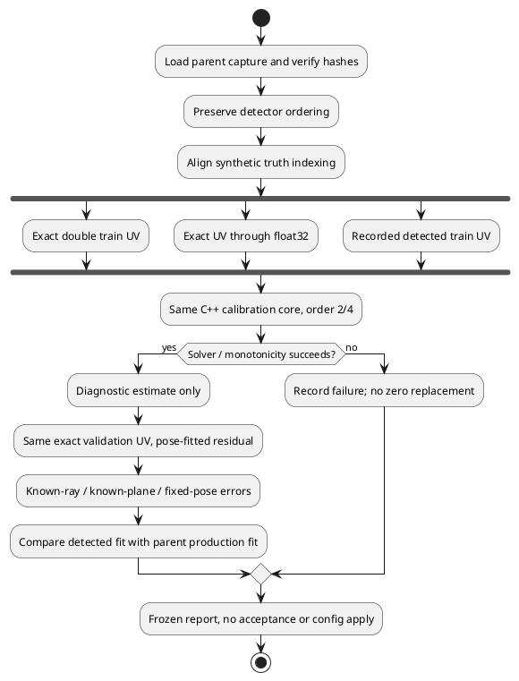
```plantuml
@startuml
start
:Load parent capture and verify hashes;
:Preserve detector ordering;
:Align synthetic truth indexing;
fork
  :Exact double train UV;
fork again
  :Exact UV through float32;
fork again
  :Recorded detected train UV;
end fork
:Same C++ calibration core, order 2/4;
if (Solver / monotonicity succeeds?) then (yes)
  :Diagnostic estimate only;
  :Same exact validation UV, pose-fitted residual;
  :Known-ray / known-plane / fixed-pose errors;
  :Compare detected fit with parent production fit;
else (no)
  :Record failure; no zero replacement;
endif
:Frozen report, no acceptance or config apply;
stop
@enduml
```

*Рисунок 4.37 — Диагностический workflow: изменяются training observations, а ядро и контрольная геометрия фиксированы. Три ветви описывают варианты опыта, не утверждают параллельное выполнение CLI.*

Следующий этап — normalized sensitivity/conditioning и controlled systematic/random perturbations, затем paired raster blur/noise, nonradial/extrinsic/road-height errors. Для итогового заключения всё ещё нужны physical requirements и измеренные снимки. Полные 192 estimates и парная 64-case таблица: [[validation/INTRINSIC_DIAGNOSTICS]]. Рисунки воспроизводит `plot_intrinsic_diagnostics.py` рядом с главой. 6 новых diagnostic tests и все 10 выбранных CTest suites проходят.

## 4.35 Направленная чувствительность к равным по RMS ошибкам углов

E-CAL-diagnostic-01 показал различие между exact-input и detected-input калибровкой, но не разделял направления ошибок наблюдений. Следующая серия E-CAL-sensitivity-01 использует matched models: equidistant/order2/4 и kb_nonzero/order4, seeds 7101/7102, profiles small_front/large_front. Это 12 base cases с прежними 12 train и 12 exact validation views. Approximation families и tilted profiles заранее исключены из области данной серии. Протокол [[research/CALIBRATION_SENSITIVITY_PROTOCOL]] зафиксирован коммитом `371352c` до fit outcomes; геометрии уже просмотрены, поэтому серия exploratory.

В training coordinates вводятся шесть полей: единый shift_x, radial, tangential и три random Gaussian fields с seeds 1021/1022/1023. Random fields центрированы отдельно внутри каждого view, затем нормированы по всем 648 train corners. Для каждого поля сохраняются directions при всех amplitudes/signs:

$$\frac1{648}\sum_{v,i}\|D_{vi}\|^2=1,\qquad u_{vi}^{\pm}=u_{vi}^{true}\pm hD_{vi},\qquad h\in\{0.025,0.05,0.2\}\text{ px}.$$

h — RMS длины двумерной ошибки, не стандартное отклонение каждой координаты. Это coordinate perturbations, а не новые raster blur/noise или измеренные ошибки физического detector. Все inputs имеют явный `controlled_perturbation` origin. Новая метка поддерживается диагностическим CLI; production gate и конфиг сервера не изменяются.

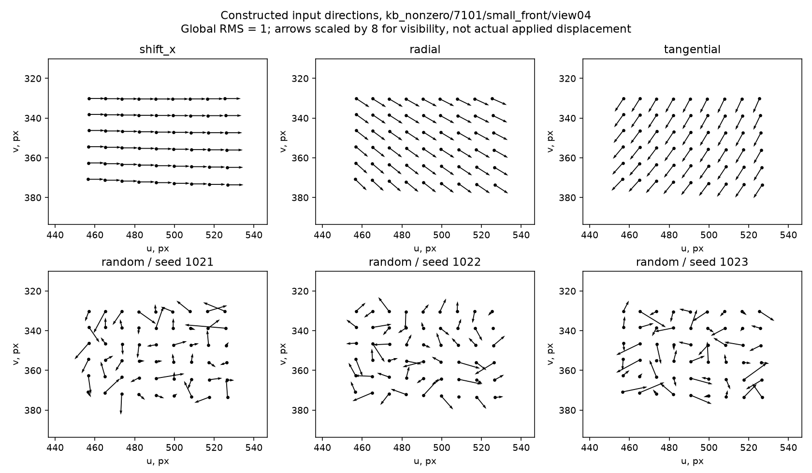

*Рисунок 4.38 — Шесть equal-RMS направлений на одном peripheral view. Векторы показаны в условном увеличенном масштабе ×8; actual train displacements равны ±hD при h≤0.2 px. Random patterns фиксированы по seeds и не заменяются при плохом результате.*

Выполнены 12 exact refits и 432 perturbed fits, то есть **444 diagnostic runs и 216 signed pairs**. Все завершились; failures и invalid floor points отсутствуют. Exact baselines воспроизведены с max parameter delta=0. Acceptance gate не выполняется; successful fit не равен принятой калибровке.

Отклик вычисляется на прежних true outer rays и точках известной плоскости Y=1.2 м, без подбора их физической геометрии:

$$G_r(h)=p95_j\frac{\|\hat u_j(+h)-\hat u_j(-h)\|}{2h},\qquad
G_f(h)=p95_j\frac{\|\hat X_j(+h)-\hat X_j(-h)\|}{2h}.$$

$G_r$ имеет единицы output px/input px, $G_f$ — м/input px. Это finite directional response, не ошибка отдельной модели относительно truth и не full Jacobian condition number. Шесть направлений не образуют полный basis 1296 UV coordinates. Дополнительно сохраняются even response и signed parameter derivatives; нормирование коэффициентов задано явно и не используется как рейтинг качества.

Shift_x — analytic control: matched модель поглощает общий сдвиг изменением cx. Получено $G_r\approx1$ во всех cases/amplitudes с численной ошибкой <2×10⁻¹¹. Floor response остаётся около 0.02637–0.02687 м/px, поскольку true UV контрольной плоскости не сдвигаются вместе с обучающими observations.

| Direction при h=0.05 px | Pairs | Outer gain min–max, px/px | Floor gain min–max, m/px |
|---|---:|---:|---:|
| shift_x | 12 | ≈1–1 | 0.02637–0.02687 |
| radial | 12 | 0.80924–3.82358 | 0.03834–0.20422 |
| tangential | 12 | 1.81702–6.62719 | 0.16585–0.50516 |
| random, 3 fields | 36 | 1.68207–13.71607 | 0.04812–0.82016 |

Это min/max отдельных case p95, не pooled quantiles и не доверительные интервалы. Random fields в этой серии иногда возбуждают более сильный отклик, но из трёх реализаций нельзя заключить, что случайная ошибка всегда опаснее систематической. Аналогично коэффициенты порядка 4 не объявляются универсально лучше или хуже order2.

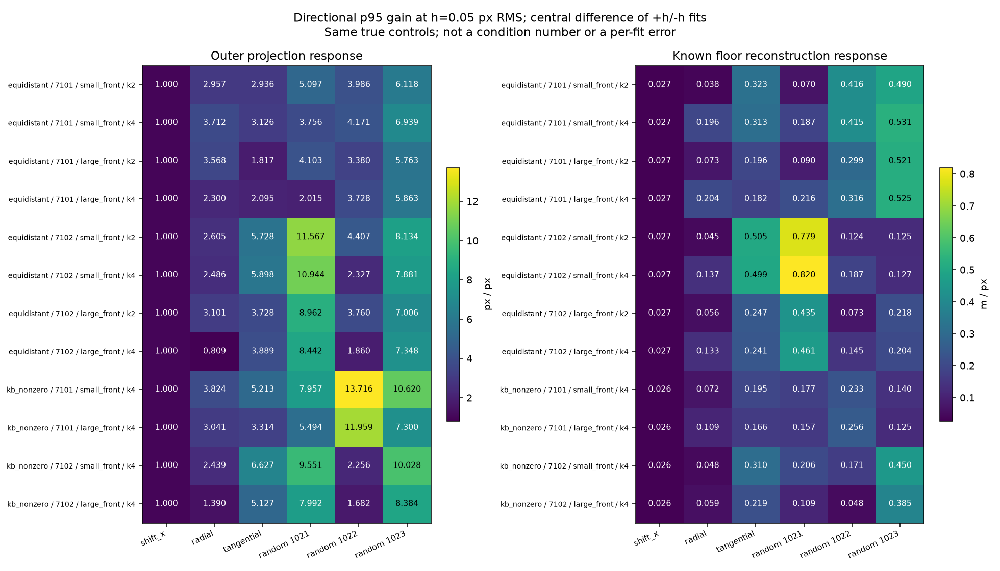

*Рисунок 4.39 — Все 72 pairs при h=0.05 px, одинаковом input RMS и общих true controls. Левая и правая карты имеют разные единицы и диапазоны; число в ячейке — finite response p95, а не actual error данного fitted model.*

Сопоставление h=0.025 и 0.05 даёт maximum relative change response p95 0.3163% для outer и 0.5328% для floor. Это поддерживает локальную интерпретацию отклика в проверенном малом диапазоне, но не доказывает математический предел h→0. При переходе 0.05→0.2 px maximum change растёт до 4.8109% и 11.6460%; строго линейную модель на весь этот диапазон применять нельзя.

Для equidistant/7102/small_front/order4/random1021 при h=0.2 px **actual** floor p95 равна 0.16274 м для +h и 0.16498 м для −h. Exact-validation residual с отдельно подобранной board pose составляет лишь 0.05023/0.05954 px. Это очередной synthetic counterexample достаточности scalar residual при matched optical family и идеально известных extrinsics. Gate в данной серии не запускался; false-accept rate не рассчитывается.

Результат уточняет вывод §4.34: величина localization RMSE не описывает направление ошибки и её перенос через coupled K/k/poses. Но finite directional screen не заменяет full Jacobian/spectrum, uncertainty analysis или physical requirements. Дальнейшие работы — такие оценки, robust-fit ablation без oracle filtering, paired raster blur/noise, nonradial/extrinsic/ground-height perturbations и физические снимки.

Все reports, signed estimates, 216 responses, hashes и полная таблица h=0.05: [[validation/CALIBRATION_SENSITIVITY]]. Иллюстрации строит `plot_calibration_sensitivity.py` рядом с главой. 7 новых regression tests и все 11 выбранных CTest suites проходят.

## 4.36 Полный совместный Jacobian и условная неопределённость

Шесть направленных полей предыдущего опыта измеряли конечный отклик только вдоль выбранных возмущений; они не давали полного ранга наблюдений и не отделяли корреляцию intrinsics с неизвестными позами шаблона. Для следующего шага E-CAL-information-01 построен полный Jacobian одной совместной задачи: камера и 12 board poses являются неизвестными одновременно. Протокол зафиксирован в [[research/CALIBRATION_JOINT_INFORMATION_PROTOCOL]] до вычисления этой серии. Это повторный анализ E-CAL-capture-01/E-CAL-diagnostic-01, поэтому он exploratory и не является новой holdout-выборкой.

Сопоставлены 12 matched cases: equidistant KB polynomial order 2 и 4, а также `kb_nonzero` order 4; в каждом по два pose seeds и профиля `small_front`/`large_front`. Каждый case анализируется по точным синтетическим углам и по углам, обнаруженным OpenCV на растровом шаблоне. Таким образом, выполнено 24 joint fits. В каждом наборе 12 board views, 54 точки на доску и 1296 скалярных координатных residuals. Intrinsics имеют 6 параметров для order 2 и 8 для order 4; ещё 72 параметра описывают 12 отдельных поз.

Пусть вектор наблюдений $y$ состоит из $(u,v)$ координат каждого угла, а модель $f(\theta)$ использует общие $f_x,f_y,c_x,c_y,k_i$ и отдельную позу $(R_g,t_g)$ для доски $g$. В точке найденного минимума вычисляется полный якобиан

$$J_{ij}=\frac{\partial f_i(\theta)}{\partial\theta_j},\qquad r=y-f(\hat\theta).$$

Каждый блок residual зависит от общих intrinsics и только от pose своей доски, поэтому конечные разности используют разреженную структуру. Для анализа выполняется SVD нормированного Jacobian $J=U\Sigma V^T$; малые singular values показывают направления совместного изменения камеры и board poses, которые слабо различаются в этих наблюдениях. Чтобы не смешивать физические единицы, increments были масштабированы как $df_x/300$, $df_y/295$, $dc_x/640$, $dc_y/480$, $dk_i/1$; pose rotation задана в радианах, translation — в метрах. Condition number ниже относится именно к этому выбранному масштабированию.

| KB polynomial | Наблюдения | Размер Jacobian | Медиана cond(J) | Диапазон | Ранг |
|---|---|---:|---:|---:|---:|
| order 2 | exact | 1296×78 | 2918.5 | 1874.3–4805.3 | 78/78 |
| order 2 | OpenCV detected | 1296×78 | 2934.6 | 1873.4–4804.2 | 78/78 |
| order 4 | exact | 1296×80 | 5611.8 | 3804.5–7760.3 | 80/80 |
| order 4 | OpenCV detected | 1296×80 | 5590.5 | 3824.2–7578.3 | 80/80 |

В проверенных позах полный ранг достигнут при машинном и практическом относительном пороге $10^{-10}$. Медианный condition number у order 4 примерно в 1.9 раза больше, чем у order 2, то есть добавленные коэффициенты в этих данных слабее отделимы от остальных параметров. При этом спектры exact/detected близки: размер локального Jacobian характеризует геометрию параметризации около решения, а не ошибку локализации сам по себе. Ни полный ранг, ни его значение не гарантируют точности вне выбранных synthetic poses.

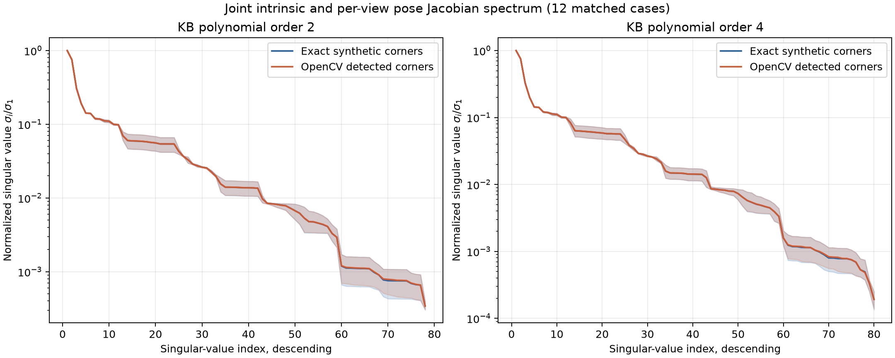

*Рисунок 4.40 — Медианный normalized singular spectrum совместных intrinsics и 12 nuisance poses; закрашена межквартильная область по matched cases. Отдельные панели имеют разное число столбцов, а все singular values зависят от объявленных parameter scales.*

Для локальной ковариации использовано приближение

$$\widehat{\mathrm{Cov}}(\hat\theta)=\hat\sigma^2(J^TJ)^{-1}.$$

Сначала $\hat\sigma^2=RSS/(m-p)$ оценивает общую дисперсию scalar residuals и предполагает их независимость с одинаковой дисперсией. Во второй оценке covariance масштабируется не fit residual, а известным detector RMS относительно synthetic truth: $\sigma_{det}=\sqrt{\mathrm{mean}((u_{det}-u_{true})^2+(v_{det}-v_{true})^2)/2}$. Это проверяет влияние заданного масштаба шумовой модели, но не объявляет detector errors iid. В третьей оценке углы группируются по одной доске: $A(\sum_g s_gs_g^T)A$, где $A=(J^TJ)^{-1}$, $s_g=J_g^Tr_g$; добавлена поправка на конечное число 12 кластеров. Локальные стандартные ошибки представлены только для intrinsics, после преобразования параметров в пиксели/коэффициенты.

Для detector RMS получен диапазон 0.093–0.197 px. При `small_front` медианная локальная ошибка $f_x$ по detector-scaled iid covariance равна 1.54 px/order2 и 1.55 px/order4; для `large_front` — 0.70 и 0.75 px. Кластерная оценка для тех же групп составляет соответственно 1.69, 1.18, 1.48 и 1.06 px. Эти оценки расходятся и между моделями, и между предположениями о шуме. Более широкий front-профиль в этой серии снижал медианную iid неопределённость, но cluster estimate не всегда повторял это улучшение. Поэтому вывод о точности зависит не только от RMS детектора и одного residual summary, но и от независимой экспериментальной единицы/структуры корреляции.

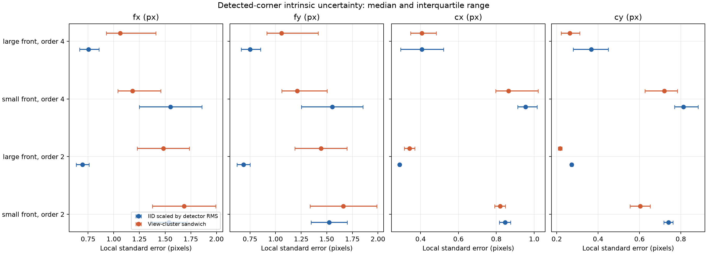

*Рисунок 4.41 — Медиана и межквартильный диапазон локальных standard errors $f_x,f_y,c_x,c_y$ на detector observations. Синий — covariance при заданном detector RMS и iid предположении; оранжевый — view-cluster sandwich по 12 синтетическим доскам.*

Exact truth даёт максимальное отклонение восстановленных $f_x,f_y,c_x,c_y$ 6.7×10⁻⁹, а residual-based sigma практически нулевая. Это численный пол идеальной synthetic генерации, а не измерение uncertainty физической камеры. На detector observations fixed-pose held-out corner RMSE имел медиану 0.985 px для `small_front` и 0.834 px для `large_front`; median floor RMSE составил 0.0385 и 0.0131 м. Внутри 12 synthetic cases покрытие улучшалось в среднем, но разброс между seed/family заметен, а независимых сцен здесь нет.

Оценки являются локальным линейным приближением у найденного nonlinear least-squares минимума. Они не включают неточность размера и плоскостности target, неточность автомобиля/extrinsics, nonradial optics, temporal/exposure effects, selection bias detector и физическую корреляционную модель ошибок. При 12 досках cluster sandwich — диагностика, не гарантия покрытия. Теория least-squares требует явных residual/error assumptions; см. [SciPy `least_squares`](https://docs.scipy.org/doc/scipy/reference/generated/scipy.optimize.least_squares.html), [NIST nonlinear least-squares reference data](https://www.itl.nist.gov/div898/strd/nls/data/LINKS/c-kirby2.shtml) и [обсуждение residual/error assumptions NIST](https://www.itl.nist.gov/div898/handbook/pmd/section1/pmd142.htm). Результат не используется как production threshold и не обновляет server config.

Полная таблица по 12 cases, все intrinsic covariance/correlation matrices, четыре weakest modes, validation metrics, hashes и команды приведены в [[validation/JOINT_CALIBRATION_INFORMATION]]. Реализация и проверки находятся в `tools/calibration/joint_information.py`, `tools/calibration/information_study.py`, `tests/test_joint_information.py`; следующий этап — signed component/pose attribution, robust fit и raster blur/noise ablations, nonradial/extrinsic stress, физические targets и independent validation split. Эти результаты закрывают только пункт full Jacobian/spectrum и предварительной conditional uncertainty из TODO.

## 4.37 Как направленные ошибки распределяются между камерой и позами шаблонов

Полный Jacobian предыдущего подраздела позволяет разложить локальный response по общим параметрам камеры и nuisance poses. Здесь проверяется не только выходная ошибка, но и механизм поглощения заданного входного поля: изменяются ли $f_x,f_y,c_x,c_y,k_i$ или оптимизатор объясняет те же UV через другие позы отдельных досок. Для этого frozen protocol [[research/CALIBRATION_COMPONENT_ATTRIBUTION_PROTOCOL]] использует те же 12 matched cases, шесть детерминированных полей из E-CAL-sensitivity-01 и только primary amplitude $h=0.05$ px.

Для каждого exact baseline совместно оцениваются камера и 12 board poses. Линеаризованный signed response вычисляется как решение задачи наименьших квадратов

$$\Delta q_{lin}=\arg\min_z\|Jz-d\|_2^2=J^+d,$$

где $d=hD$ — единичное по RMS поле UV displacement. Затем на паре наблюдений $uv_{true}±hD$ повторяется nonlinear joint fit. Сравниваются центральная signed derivative $(q(+h)-q(-h))/(2h)$ и even component, показывающий отклонение от симметричного линейного поведения при данном h. Внутренние и pose-координаты нормированы параметрическими scales предыдущего подраздела; доли квадратов ответов зависят от этого выбора и не являются физическими долями camera error.

| Направление поля | Order | Linear share intrinsics | Nonlinear share intrinsics* | Полные пары |
|---|---:|---:|---:|---:|
| x shift | 2 | 1.000 | 1.000 | 4/4 |
| x shift | 4 | 1.000 | 1.000 | 8/8 |
| radial | 2 | 0.060 | 0.060 | 4/4 |
| radial | 4 | 0.996 | 0.996 | 4/8 |
| tangential | 2 | 0.019 | 0.018 | 4/4 |
| tangential | 4 | 0.081 | 0.086 | 4/8 |
| random fields | 2 | 0.011 | 0.011 | 12/12 |
| random fields | 4 | 0.107 | 0.132 | 11/24 |

*Медиана nonlinear ответа только для пар, где и positive, и negative fits завершили работу с успешным статусом; incomplete pairs не подменяются нулём.*

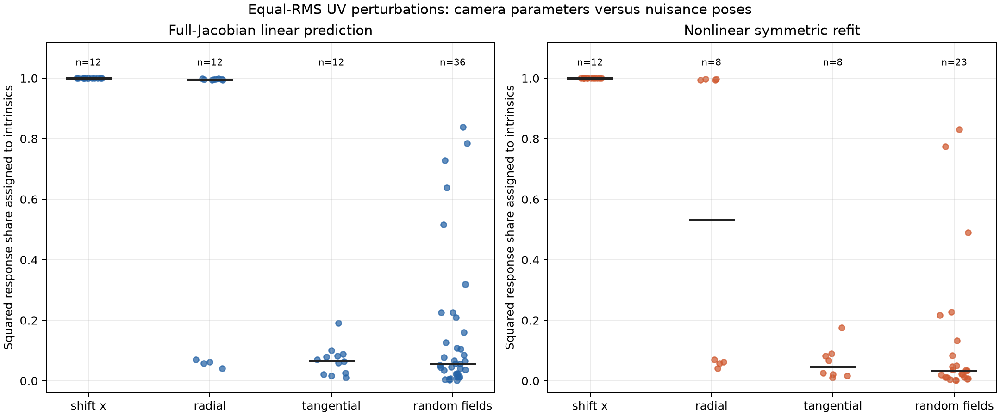

*Рисунок 4.42 — Нормированная доля квадратов ответа intrinsics для полного-Jacobian прогноза и успешных нелинейных signed pairs. `n` на графике показывает число included pairs. Random поля включают три фиксированных seed; они не дают вероятностного распределения ошибок.*

Изменение общего x координат почти полностью эквивалентно изменению $c_x$: ответ равен 1.0 px/px с максимальной относительной L2-разностью linear/nonlinear response 0.0023%; nuisance poses почти не меняются. Для radial field механизм зависит от порядка модели: order 2 в основном объясняет его переоценкой board poses, а order 4 — параметрами камеры. Для tangential и random fields основную часть ответа поглощают poses, причём их физический RMS изменения на h=0.05 px зависит от профиля/модели. Поэтому один общий corner RMS не показывает, какой параметр будет смещён.

Первичный nonlinear результат был ограничен сходимостью sparse TRF/LSMR; отдельная solver ablation и полный повтор приведены в §4.38. Исходные failures сохранены, поэтому исходный результат не подменяется постфактум.

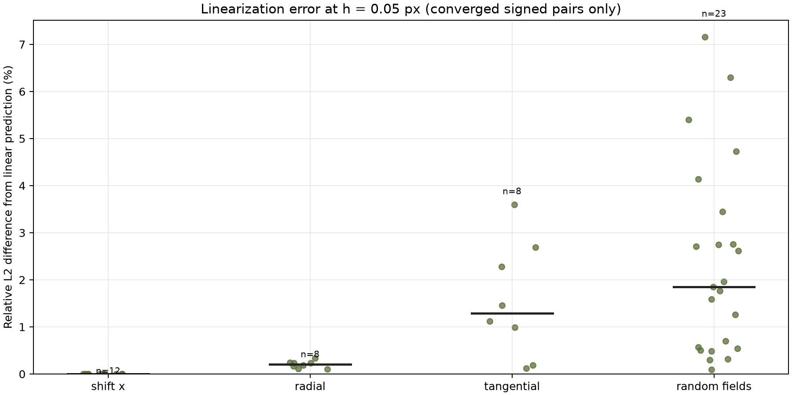

*Рисунок 4.43 — Relative L2 mismatch между нелинейной central difference и $J^+D$, только для complete pairs. Недостающие пары отражены в предыдущем рисунке меньшим n и в отчёте перечислены поимённо.*

Это exploratory переанализ прежних synthetic scenes. Данные не включают повторное raster/detector обнаружение или автомобильные extrinsic perturbations и не применяются к server gate. Полная детализация: [[validation/CALIBRATION_COMPONENT_ATTRIBUTION]]. Реализованный linear known-answer shift control добавлен в `tests/test_joint_information.py`.

## 4.38 Сходимость нелинейной атрибуции: сравнение solver paths

Поскольку 34 из 144 первых signed refits достигли лимита оценок функции, до нового вывода была зафиксирована отдельная ablation: те же 12 matched cases, те же шесть полей и амплитуда ±0.05 px, но dense Levenberg–Marquardt с трёхточечной конечной разностью. Метод сохраняет loss, tolerances и предел 750 evaluations; меняется solver path и использование плотного Jacobian вместо sparse TRF/LSMR.

| Solver path | Сошедшиеся fits | Complete pairs | Число evaluations |
|---|---:|---:|---:|
| Sparse TRF/LSMR, первичная серия | 110/144 | 51/72 | до лимита 750; 34 отказа |
| Dense LM, post-hoc follow-up | 144/144 | 72/72 | 3–6 |

На общей подвыборке 51 пары медианное абсолютное расхождение доли intrinsics между методами равно 0.00010, максимум — 0.0253. Это указывает, что успешные исходные fits согласованы с повтором в данных cases; post-hoc выбор LM и синтетическая природа данных не позволяют считать его независимым подтверждением.

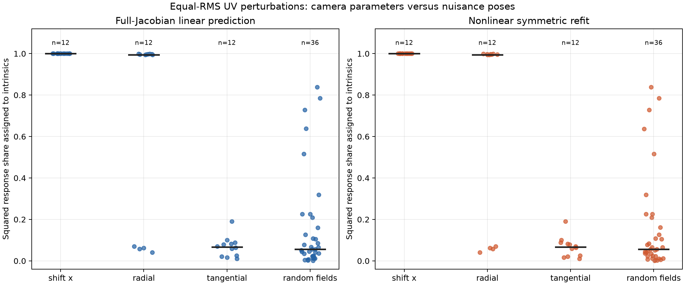

*Рисунок 4.44 — Линейный `J⁺d` и нелинейный симметричный response при dense LM для всех 72 направлений; каждая пара ±h сошлась.*

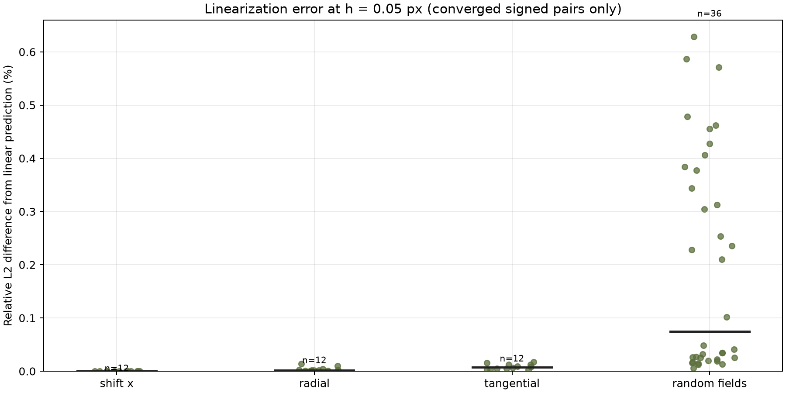

*Рисунок 4.45 — Относительная L2-разность между нелинейным LM response и `J⁺d`. Медиана — 0.0139%, максимум — 0.629%; это согласие локального приближения на искусственной амплитуде, не метрика точности модели.*

Контроль общего сдвига даёт `dcx/dh = 1 px/px`. Доля ответа intrinsics для radial поля составляет 0.060 при order 2 и 0.996 при order 4; для tangential — 0.019 и 0.081, для seeded random — 0.011 и 0.107. Значения зависят от нормировки параметров и не являются физическим разделением ошибки.

Это объясняет, почему первый sparse TRF запуск оставил неполные пары на этих synthetic inputs, но не доказывает превосходство LM в общем случае. Исследование остаётся exploratory и не заменяет production OpenCV calibrator. Детали, хеши и ограничения: [[validation/CALIBRATION_COMPONENT_SOLVER]].

## 4.39 Калибровочная мишень при движении через сектора камер

Статичный coded-object опыт (§4.28) выявил, что счётчик раздельных RGB-компонент не замечает слившиеся копии цели. Для проверки изменения ошибки по мере перехода между секторами построен синхронный Blender-опыт E-STITCH-object-motion-01. Использована уникальная emissive magenta-мишень размером 0.55 × 0.55 × 1.8 м. За девять отсчётов её координата $y$ меняется от −1.2 до +1.2 м с шагом 0.3 м; автомобиль движется по прежней прямой со скоростью 2 м/с. Для каждой временной точки четыре входные камеры и прямой виртуальный вид сформированы из одной сцены и одной позы. Прямые object-ID метки получены независимыми ray casts, а положение мишени записано из evaluated transform. Тем самым входы и истина сопоставлены по timestamp, но не моделируются экспозиционный сдвиг и временная история рендера.

Каждый из шести носителей (plane, bowl, dome-floor, cube-floor, cylinder-floor, burger-like) с семью режимами смешивания (angular feather, edge feather, graph-cut multi-band, graph-cut seam, hard best-angle, multi-band, seam-distance feather) проверен на всех девяти кадрах: всего 378 случаев. Качество RGB-маски измерялось по

$$IoU(P,T)=\frac{|P\cap T|}{|P\cup T|},$$

где $P$ — magenta-маска результата, $T$ — маска точной видимости объекта из прямого object-ID truth. Дополнительно оценивалась доля веса проецируемых source-camera ID, приходящаяся на пиксели вне этой прямой маски. Она описывает несоответствие геометрического происхождения наблюдения прямой видимости, но сама по себе не является segmentation финального RGB:

$$r_{outside}=\frac{\sum_p s(p)\,\mathbf{1}[T(p)=0]}{\sum_p s(p)},\qquad
s(p)=\sum_i w_i(p)\,\mathbf{1}[ID_i(p)=ID_{target}].$$

Контроль direct RGB-классификатора дал IoU 0.909–0.925 к точным меткам, выше заранее заданного порога 0.75. По всем случаям средний IoU результата равен 0.0861, а средняя доля source-ID поддержки вне прямой истины — 0.8612. Это указывает на существенное расхождение изображения, построенного текущим аналитическим трактом, с прямой проекцией цели в данной геометрии. Оно не доказывает, что любой видимый пиксель вне $T$ является артефактом: часть source support — только provenance-показатель, а поверхность отображения создаёт деформацию объекта.

| Режим смешивания | Средний RGB IoU | Средний outside-support | Медианный CPU p50, мс |
|---|---:|---:|---:|
| Angular feather | 0.0815 | 0.8709 | 37.414 |
| Edge feather | 0.0730 | 0.8827 | 36.417 |
| Graph-cut multi-band | 0.0957 | 0.8362 | 89.213 |
| Binary graph-cut seam | 0.1024 | 0.8362 | 56.440 |
| Hard best angle | 0.0998 | 0.8461 | 37.467 |
| Multi-band | 0.0724 | 0.8827 | 66.708 |
| Seam-distance feather | 0.0779 | 0.8736 | 40.434 |

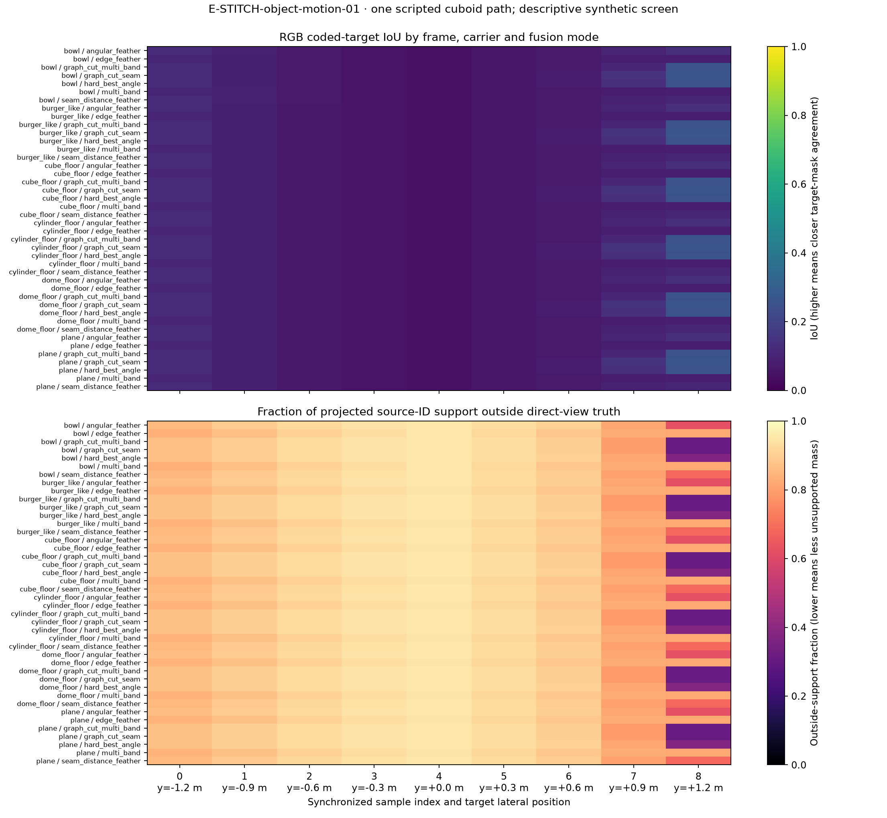

*Рисунок 4.46 — RGB IoU и доля source-ID поддержки вне прямой истины для каждой комбинации носителя и fusion по девяти положениям цели. Цвета сравнивают только испытанные synthetic cases; это не агрегированный рейтинг.*

Из-за малого IoU даже наивысшее среднее режима в матрице (0.1024 для binary graph-cut seam) нельзя считать приемлемым качеством. Среднее CPU p50 `reference.render` по испытаниям — 52.96 мс; измерение включает только Python CPU renderer, исключает truth/метрики/файловый ввод-вывод и ничего не говорит о GPU, C++ сервере или Aurora. Два прогрева и семь seeded randomized complete blocks уменьшают влияние фиксированного порядка в этом стендовом замере, однако девять соседних кадров одной траектории зависимы. Доверительные интервалы и межсценовое обобщение по этим данным не вычисляются.

Таким образом, опыт воспроизводимо фиксирует динамическое несовпадение для одной magenta-мишени, одной улицы и номинального rig. Он не проверяет естественную object correspondence, не вводит asynchronous inputs и не измеряет stale trails. Для продолжения нужны независимые seed/pose, реалистичные объекты, повороты автомобиля, одинаковые бюджеты carrier и отдельная задержанная камера с прямой временной истиной. Полная процедура, хэши и ограничения приведены в [[../validation/OBJECT_STITCH_MOTION]] и [[../research/STITCH_MOVING_OBJECT_PROTOCOL]].

## Предварительные выводы по четвёртой главе

1. **Экспериментальная инфраструктура сшивки:** реализованы offline-варианты fusion и carrier matrix; исправленные binary graph-cut и output proxies проверены на fixtures, добавлены парный 3-frame Blender clip (§4.25), статический coded-object screen (§4.28) и девятикадровый moving-target screen (§4.39). Эти результаты уточняют failure modes в конкретных synthetic scenes; качество методов на holdout scenes и естественная object-correspondence ghost truth пока не подтверждены.
2. **Scene Truth/GPU checks:** получены числа на конкретном синтетическом fixture и CPU/GPU sample. Они характеризуют только этот тест и не заменяют испытания реальной сцены/камер.
3. **Калибровочное ядро:** реализованы синтетические эксперименты Joint Bundle Adjustment и server calibration gate. Сопоставление моделей и пороги требуют независимых данных; историческая jitter-модель не оценивает detector, новые image-based серии выполняют OpenCV на синтетических PNG (§4.29, §4.31–4.38). Full joint Jacobian имеет полный ранг на 12 selected cases; order 4 имеет худшую обусловленность, а локальная uncertainty зависит от принятой covariance model. Направленные UV errors по-разному делятся между intrinsics и позами. Sparse TRF сошёлся в 110/144 refits, dense LM follow-up — в 144/144 на тех же synthetic inputs; это исследовательский результат, не production-рекомендация. Peripheral views уменьшают часть ошибок экстраполяции, но ни angular coverage, ни конкретная комбинация размера/наклона не гарантируют точной реконструкции плоскости.

Таким образом, перечислены достигнутые этапы реализации и проверок на синтетике; качество сшивки, перенос на физическую оптику и физическая обоснованность Quality Gate остаются открытыми.

## Источники и воспроизводимость

Основания проекции и измерений: [[references/VISION#S04|S04]], [[references/DEVELOPMENT#S31|S31]], [[references/DEVELOPMENT#S52|S52]], [[references/VISION#S68|S68]], [[references/VISION#S10|S10]]. Собственные числа — [[prototype/MEASUREMENTS]], [[validation/STITCH_VISIBILITY]], [[validation/IMAGE_QUALITY_ORACLE]], [[validation/DEPTH_VISIBILITY_TRUTH]]. Код экспериментов — `tools/run_e_stitch_01.py`, `tools/validate_gpu_readback.py`, `tools/comprehensive_calibration_study.py`, `tools/real_data_calibration_evaluation.py`. Рисунки сформированы скриптами `plot_e_stitch.py`, `plot_image_quality.py`, `plot_comprehensive_calibration.py`. Дата серии — 09.10.2026.

[S04]: https://docs.opencv.org/4.13.0/db/d58/group__calib3d__fisheye.html
[S10]: https://doi.org/10.1145/245.247
[S31]: https://gstreamer.freedesktop.org/documentation/application-development/advanced/clocks.html
[S52]: https://registry.khronos.org/OpenGL/extensions/EXT/EXT_disjoint_timer_query.txt
[S59]: https://developer.auroraos.ru/doc/sdk/tools/mb2
[S60]: https://developer.auroraos.ru/doc/software_development/guidelines/rpm_requirements/spec_requirements
[S68]: https://doi.org/10.1109/ICIP.2019.8803453

