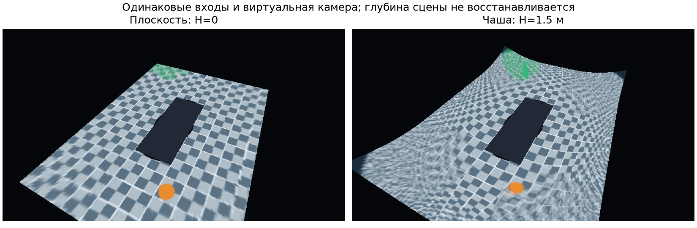

---
aliases:
  - Глава 4. Экспериментальное исследование и тестирование системы
tags: [diploma, experiments, validation]
status: draft
updated: 2026-10-05
---

# Глава 4. Экспериментальное исследование и тестирование системы

> Первая фактически выполненная серия Linux-прототипа, 05.10.2026. Приведены измеренные значения и границы их интерпретации. Результаты реальных камер, ОС Аврора, физической задержки дисплея и длительного теплового режима пока отсутствуют.

Цель экспериментального этапа — проверить корректность выбранной проекции, получить первые сравнимые характеристики поверхностей и подтвердить работоспособность процедуры калибровки и восстановления. Дополнительно проверяется путь server→client и ограничения при отказе потребителя. Первичные времена и отчёты сохранены в [[prototype/MEASUREMENTS]], а команды повторения — в [[prototype/README]]. Эта серия является начальным исследованием работоспособности; она не подменяет полную программу [[research/EXPERIMENTS]].

## 4.1 Стенд и методика

| Параметр | Проверенный профиль |
|---|---|
| CPU | AMD Ryzen 9 9950X 16-Core Processor |
| Linux | 7.2.6-arch2-1-x86_64, glibc 2.44 |
| Аппаратный GPU | NVIDIA GeForce RTX 5070 Ti, драйвер 615.71.09, 16303 MiB по `nvidia-smi` |
| Аппаратный GL_RENDERER | NVIDIA GeForce RTX 5070 Ti/PCIe/SSE2 |
| Программный GL_RENDERER | llvmpipe (LLVM 22.1.8, 256 bits), vendor Mesa |
| Компилятор | GCC 16.2.1 |
| Зависимости C++ | Boost 1.92, GLM 1.0.3, EGL/GLES, Qt 6.11.2 для клиента |
| Python | 3.14.7, NumPy 2.5.3 |
| Входы | Четыре синтетических RGB8-кадра 320×180 |
| Результат | RGBA8, 640×360 или 1280×720 |
| Целевое устройство Авроры | Отсутствует; не измерялось |

Генератор создаёт дорожную плоскость, линии, наземный маркер и приподнятую сферу. Известны внутренние параметры и позы камер. Manifest содержит SHA-256 файлов и временные поля. Для обеих серий использован одинаковый fixture-hash `f8c58e4c6e17acd0f36b7f2622bacef4f84f7fb43c28cb5aced4c1319f95d9c4`.

Каждый вариант запускается тремя отдельными процессами. В каждом процессе 10 кадров прогрева и 60 измеряемых кадров. Порядок вариантов чередуется. Таким образом, на вариант и backend приходится 180 измерений, а на одну backend-серию — 720. Время определяется вокруг вызова `render`, включая CPU-подготовку, исполнение и синхронное чтение RGBA. Первые четыре входа загружаются один раз и используются повторно. Это измерение кэшированного рендера, а не захвата и обработки 30 новых четырёхкамерных наборов каждую секунду.

Для последовательности отсортированных времён $t_{(0)},\ldots,t_{(n-1)}$ квантиль вычисляется линейной интерполяцией:

$$
j=\lfloor p(n-1)\rfloor,\quad \alpha=p(n-1)-j,\qquad
Q_p=t_{(j)}+\alpha(t_{(\min(j+1,n-1))}-t_{(j)}).
\tag{4.1}
$$

В таблице производительности приводится медиана трёх отдельных p50/p95. На графике ус показывает минимум и максимум p95 этих запусков. Это диапазон повторов, а не доверительный интервал. Кадры одного процесса могут быть зависимы; их нельзя без обоснования считать независимыми реализациями для статистического вывода. Для следующей полноценной серии число запусков и условия нагрузки должны быть расширены.

## 4.2 Проверка математического ядра

C++-проверки охватывают центральный луч, известный 45° луч, точки за камерой, FOV и NaN, инверсию установки, top-view look-at, поверхность, ориентацию треугольников, отрицательные конфигурации, framing и синхронизацию. Независимый NumPy-путь дополнительно проверяет 8000 точек и валидность через другую форму угловой проекции, при нулевых и ненулевых коэффициентах дисторсии. Для генератора проверяются единичные лучи и их возврат к исходным пикселям.

GPU-kernel проецирует 1024 точки для каждой из четырёх камер. В каждом benchmark-процессе сохраняются координаты точки, CPU-ответ, GPU-ответ и валидность. Ошибка считается только для общей валидной области; расхождение валидности учитывается отдельно. Это предотвращает ситуацию, в которой непопавшие в изображение точки искусственно улучшают среднее.

| Проверка | Фактический результат | Область вывода |
|---|---:|---|
| CPU и независимый NumPy | Совпадение валидности; максимальная ошибка < $10^{-10}$ пикс. | Модель и установка на контрольных точках |
| CPU/GPU, RTX | Максимум $9.5524\cdot10^{-5}$ пикс.; 0 расхождений валидности | Прямая GLSL-проекция на данном driver/profile |
| CPU/GPU, Mesa | Максимум $3.1611\cdot10^{-4}$ пикс.; 0 расхождений валидности | Программный GLSL-профиль |
| ASan/UBSan CPU-сборки | Три CTest-группы прошли | Выполненные CPU-пути без выявленных ошибок sanitizer |
| Qt/IPC integration | Offscreen receive и present-submit прошли | Копируемый путь и управление |

Отличия GPU от double-CPU ожидаемы из-за float-арифметики и конкретной реализации функций. Полученные значения значительно меньше принятого smoke-предела 0.1 пикселя, однако это не оценка ошибки калибровки реальной камеры. Отдельно остаётся ошибка треугольного приближения поверхности: kernel не проверяет каждый итоговый экранный пиксель и не подтверждает глобальный допуск сетки.

## 4.3 Сравнение плоскости и bowl

Сравниваются $H=0$ и $H=1.5$ м при тех же внешних размерах, источниках, ракурсе и числе треугольников. На изображении дорожные клетки и наземный маркер дают понятный ориентир, а приподнятая сфера показывает предел условной поверхности.

*Рисунок 4.1 — Реальные выходы текущего рендера на синтетической сцене, один виртуальный ракурс. Изображение формируется сохранённым `plot_experiments.py` из PPM результатов.*

У чаши периферийная дорожная текстура поднимается относительно центра. Это расширяет визуальную вертикальную составляющую окружения, но не делает её истинной высотой объектов. Сферический объект в обоих вариантах искажён: разные камеры переносят его лучи на условную поверхность. Наблюдаемый эффект подтверждает необходимость разделять параллакс и нарушение калибровки.

ROI в параметрах $(x,y)$ поверхности определена как $[-4,4]\times[-3,3]$ м, без прямоугольной маски автомобиля. Выборка содержит 100×100 центров ячеек, после исключения маски остаётся 7960 точек. Для каждого варианта берётся $P_j=(x_j,y_j,z_H(x_j,y_j))$; на плоскости $z_H=0$, на чаше высота зависит от положения. Поэтому метрика характеризует доступность изображения на условной поверхности, а не непосредственно покрытие реальной дорожной плоскости. Проверяется хотя бы одна валидная проекция:

$$
C_{ROI}=\frac{\#\{P_j:\exists i\;m_i(P_j)=1\}}{N_{ROI}}.
\tag{4.2}
$$

У плоскости и bowl в этом наборе результат одинаков: 0.994472, или 99.4472%. Такое совпадение не означает одинаковое визуальное качество. Метрика отражает доступность исходного пикселя, а не достоверность размещённого объекта, качество шва или восприятие пользователем. Выборка не является аналитическим доказательством покрытия непрерывной области.

Полное количественное сравнение marker error, швов и нескольких наклонных ракурсов ещё не выполнено. Поэтому на данном этапе обоснована пригодность обоих вариантов для дальнейшего исследования, а универсальное превосходство чаши не устанавливается.

## 4.4 Первоначальная калибровка

Для четырёх камер независимо созданы обучающие и проверочные пространственные точки. Координаты распределены по направлениям и глубинам; XYZ одной выборки не повторяются в другой. В пиксели добавлен гауссов шум с $\sigma=0.08$ пикселя на координату. Seed фиксирован. Начальное приближение включает изменение фокусов, главной точки, поворота и переноса.

Отчёт содержит RMS евклидовой ошибки точки, p95 и показатели ранга нормированного якобиана. Итоговые значения на проверочной выборке представлены ниже.

| Камера | RMSE до, пикс. | RMSE после, пикс. | p95 после, пикс. |
|---|---:|---:|---:|
| Передняя | 2.26670 | 0.11598 | 0.21796 |
| Правая | 2.18854 | 0.12331 | 0.21277 |
| Задняя | 2.26077 | 0.11946 | 0.22029 |
| Левая | 2.22780 | 0.11518 | 0.19379 |

Результат согласуется с заданным шумом: для двух независимых координат теоретический RMS евклидова шума составляет $\sqrt{2}\sigma\approx0.11314$ пикселя. Близость чисел не является доказательством точного восстановления каждого параметра; она показывает, что остатки в этой синтетической постановке приблизились к уровню наблюдательного шума.

Нормированный якобиан имеет ранг 14, а условные числа по камерам находятся приблизительно между 592 и 803. Это даёт основание принять конкретную процедуру в текущем наборе, но не гарантирует одинаковой определимости на реальной плоской площадке. Для дипломного вывода нужны дополнительные геометрии, число снимков, выбросы, параметры и повторные seeds.

Текущий CLI отклоняет пересечение train/validation и недостаточные точки. Эти отрицательные тесты существенны: хорошая ошибка на данных, вошедших в оптимизацию, не должна объявляться независимым подтверждением качества.

## 4.5 Нарушение и восстановление

Контрольный опыт меняет поворот только задней камеры вокруг её локальной Y-оси слева относительно исходного преобразования. Величина задаётся от 0 до 2°. Проверочные соответствия сохраняются. Порог SUSPECT равен 0.5 пикселя, основной — 1 пиксель.

| Заданный поворот | p95 задней камеры, пикс. | Состояние | Камера-кандидат |
|---|---:|---|---|
| 0° | 0.22029 | NORMAL | Нет |
| 0.1° | 0.37391 | NORMAL | Нет |
| 0.25° | 0.71549 | SUSPECT | Нет подтверждённого кандидата |
| 0.5° | 1.36286 | RECALIBRATION_REQUIRED | Задняя, ID 2 |
| 1° | 2.70320 | RECALIBRATION_REQUIRED | Задняя, ID 2 |
| 2° | 5.40880 | RECALIBRATION_REQUIRED | Задняя, ID 2 |

*Рисунок 4.2 — Независимая ошибка после калибровки и реакция сервисного критерия на один заданный сценарий. Скрипт сохранён рядом с главой.*

Повторное оценивание после 2° возвращает p95 задней камеры к 0.22029 пикселя. Остальные камеры также сохраняют проверочные значения исходной процедуры. Следовательно, на известных точках подтверждена цепочка «смещение → рост остатка → отдельная повторная калибровка → восстановление».

Это не статистическая оценка чувствительности по всему классу неисправностей. Контролировалась одна ось одной камеры и один набор. Нет серии исправных сцен при разных освещении, текстуре и движении; поэтому доля реальных ложных срабатываний не вычисляется. Установленные пороги не подбирались на репрезентативной диагностической выборке. Отсутствие кандидата при 0.1° является поведением данного критерия, а не универсальной границей обнаружения.

## 4.6 Производительность

Значения ниже — медианы p50/p95 трёх независимых процессов. Каждый процесс имеет собственный прогрев и отдельный набор 60 времён. Выходной readback включён; upload четырёх неизменных входов выполняется только при первом использовании.

| Вариант | Треугольники | Выход | RTX p50 / p95, мс | Mesa p50 / p95, мс |
|---|---:|---|---:|---:|
| Плоскость | 2312 | 640×360 | 0.17086 / 0.28306 | 0.66997 / 0.78805 |
| Bowl | 2312 | 640×360 | 0.16478 / 0.22440 | 0.68984 / 0.80609 |
| Bowl, плотная сетка | 8712 | 640×360 | 0.17064 / 0.23128 | 1.24499 / 1.49228 |
| Bowl | 2312 | 1280×720 | 0.86085 / 0.94389 | 1.71820 / 2.17621 |

*Рисунок 4.3 — Медиана и диапазон p95 между запусками. Ус не обозначает доверительный интервал.*

В текущем малом профиле RTX имеет меньшую длительность, чем программный Mesa. Увеличение выходного разрешения увеличивает объём обработки и чтения; более плотная сетка особенно заметна в программном backend. Небольшая разница плоскость/bowl на RTX не доказывает фундаментального ускорения чаши: меняются покрываемые фрагменты, а короткие измерения подвержены фоновой нагрузке и режиму частот.

Из этих значений нельзя вычислить достигнутый FPS всей системы как $1000/t$: benchmark использует кэшированные входы и не включает все стадии. Объём памяти, чистое GPU-время, новые upload каждого кадра, long-run температура и частоты не измерены. Поле `gpu_time_ms` сохранено null. Для отдельного GPU-измерения потребуется поддерживаемый timer query и контроль валидности [S52].

## 4.7 Сквозная задержка

Сервер сохраняет runtime-время входов, завершение рендера и IDs, клиент — получение и программную передачу на представление. Эти события обеспечивают корреляцию. Для локального пути программный возраст можно определить как

$$
L_{program}=t_{ui\_present\_submit}-\min_i t_{release,i}.
\tag{4.3}
$$

Но $t_{release}$ в replay относится к выпуску известного кадра, а не к экспозиции физического сенсора. `ui_present_submit` в offscreen-испытании также не является моментом появления света на экране. Поэтому численная таблица полной latency в этой серии не публикуется.

У текущего Qt-клиента trace не сохраняет всю нормативную корреляцию событий и нет отдельного валидированного агрегатора latency. Прежде чем делать количественный вывод, нужно проверить соответствие frame ID и ревизии, разделить receive/image-ready/present, учесть очередь и провести длительную серию. Часы удалённого producer пока не поддерживаются; различение clock и running-time остаётся существенным [S31].

## 4.8 Отказы и синхронизация

Проверки сгруппированы по уровню отказа.

| Сценарий | Наблюдаемое поведение | Свидетельство |
|---|---|---|
| Истёкший вход | Исключён по возрасту, возможен NO_INPUT | C++ synchronizer test |
| Избыточный skew | Непригодные входы исключены, DEGRADED | C++ synchronizer test |
| Повтор sequence и обратное время | Отдельные счётчики, кадр не принят | C++ test |
| Переполнение входной очереди | Размер сохраняется, старейший удалён | C++ test |
| Неверная конфигурация | Запуск отклонён до EGL | Негативные config tests |
| Частичный/объединённый stream | Один или несколько правильных пакетов | Decoder tests |
| Неверный префикс | Соединение закрыто, сервер продолжает работу | Integration test |
| Pause и новый ракурс | Новый кадр, прежние upload-счётчики | Integration test |
| Нет frame_release | Data закрывается после deadline, control отвечает | Integration test |
| Reconnect | Новый handshake и пригодный кадр | Integration test |
| Qt-клиент offscreen | Принимает RGBA, сообщает present-submit | Integration test |

Эти проверки показывают предусмотренное поведение на выбранных ветвях. Они не равны длительному испытанию всех сочетаний потерь, многоклиентной нагрузки и повреждённых файлов. Синхронизатор испытывался отдельными временными метками; полноценная fault-серия записей с длительным исчезновением каждой камеры остаётся следующим шагом.

## 4.9 Сопоставление платформ

RTX и llvmpipe дают одинаковые признаки валидности на контрольных точках и воспроизводят один алгоритм. Разница времени подтверждает необходимость сохранять фактический renderer при каждом запуске. Название машины или наличие драйвера сами по себе не доказывают аппаратный путь.

Аврора отсутствует в таблице сравнения. Ни Mesa, ни RTX не моделируют автоматически встроенный GPU и профиль приложения Авроры. Для целевого этапа потребуется паспорт, один рабочий output-путь, проверка зависимостей, затем повторение одинаковых данных и ракурсов. Если разрешение или формат придётся изменить, такой профиль должен публиковаться отдельной строкой.

| Платформа | Корректность модели | Измеренный render/readback | Полный клиентский путь | Вывод о целевом устройстве |
|---|---|---|---|---|
| Linux + Mesa | Проверена на контрольных точках | Есть | Offscreen integration | Не устанавливается |
| Linux + RTX | Проверена на контрольных точках | Есть | Hardware-UI latency не измерялась | Не устанавливается |
| ОС Аврора | Нет данных | Нет данных | Нет устройства/пакета | Открытый этап |

## 4.10 Анализ результатов и ограничений

Первая серия отвечает на часть исследовательских вопросов. Прямая модель согласуется между независимым CPU-расчётом и GLSL. Плоскость и bowl построены на одних входах, а их время и покрытие измерены раздельно. Известная геометрия позволяет восстановить калибровку и локализовать заданный дрейф задней камеры. Сервер и offscreen-клиент подтверждают копируемую передачу и управление без повторного upload на паузе.

Полученные выводы ограничены синтетическим набором, коротким временем и известными соответствиями. Не установлены качество детектора шаблона, ошибка реального объекта, чувствительность к освещению, статистика ложных тревог, long-run memory/thermal, чистое GPU-время, физическая задержка и характеристики Авроры. Эти ограничения не следует скрывать общим словом «работает».

Для следующей серии нужно расширить независимые данные, задать несколько ракурсов, измерить швы и маркеры, отделить временные стадии и провести полноценный отказной replay. Только после этого можно обосновывать целевой профиль и исследовательский вклад по реальным эксплуатационным условиям.

## Выводы по четвёртой главе

Подтверждена работоспособность первого Linux-прототипа и создан воспроизводимый набор проверок и первичных измерений. Численная GPU-проекция совпадает с независимой моделью в пределах малой float-ошибки; сервисная калибровка снижает независимый остаток до уровня синтетического шума; контролируемое смещение обнаруживается и устраняется отдельной повторной процедурой.

Сравнение времени относится к кэшированному render/readback-пути двух настольных backend. Оно обосновывает дальнейшее измерение конкретных стадий, но не завершает требования всей системы и целевого переноса. Итоговые выводы диссертации должны быть обновлены после реальных наблюдений и устройства Аврора.

## Источники и воспроизводимость

Основания проекции и измерений: [[references/VISION#S04|S04]], [[references/DEVELOPMENT#S31|S31]], [[references/DEVELOPMENT#S52|S52]]. Собственные числа — [[prototype/MEASUREMENTS]], код серии — [run_experiments.py](../../tools/run_experiments.py). Python-скрипт рисунков [plot_experiments.py](plot_experiments.py) расположен рядом с главой. Дата серии и обращения — 05.10.2026.

[S04]: https://docs.opencv.org/4.13.0/db/d58/group__calib3d__fisheye.html
[S31]: https://gstreamer.freedesktop.org/documentation/application-development/advanced/clocks.html
[S52]: https://registry.khronos.org/OpenGL/extensions/EXT/EXT_disjoint_timer_query.txt
