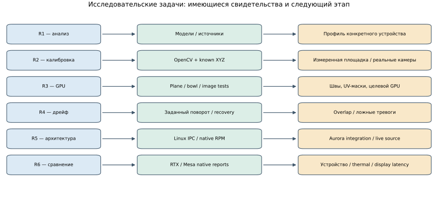

# Заключение диссертационного исследования

Для темы «Исследование и разработка системы отображения и методик калибровки функции интерактивного кругового обзора ТС для ОС Аврора» подготовлены Linux-прототип, теоретическая база и набор синтетических проверок. Commit audit от 09.10.2026 выявил, что часть свежих исследовательских скриптов измеряет не те величины, на которых основаны ранние выводы. Поэтому это заключение предварительное: ниже отделены реализованные компоненты от ещё не подтверждённых исследовательских результатов. План исправления — [[../TODO]], аудит — [[planning/AUDIT]].

1. **Теоретические основания и моделирование:** Систематизированы модели широкоугольных камер и реализованы synthetic fits Kannala-Brandt, Brown-Conrady и Scaramuzza. Результат относится к заданным математическим моделям; выбор модели для физической оптики не подтверждён.
2. **Алгоритмы слияния и геометрия поверхностей (серия E-STITCH-01):**
   - Реализованы и экспериментально сопоставлены 7 алгоритмов слияния (`hard_best_angle`, `edge_feather`, `angular_feather`, `seam_distance_feather`, `graph_cut_seam`, `multi_band`, `graph_cut_multi_band`) на 6 поверхностях-носителях (`plane`, `bowl`, `dome_floor`, `cylinder_floor`, `cube_floor`, `burger_like`);
   - Сформирован 84-конфигурационный offline matrix на одном статическом fixture; seam/ghost metrics оказались некорректными, а `graph_cut_seam` не является graph-cut optimizer, поэтому алгоритмический рейтинг не установлен;
   - Геометрия carrier и видимость исследованы на synthetic fixtures, но сравнение требует корректной общей ROI, independent truth и равного бюджета сетки/памяти.
3. **Независимый эталон качества и валидация GPU Readback:**
   - Реализован analytic oracle prototype, но его дорожная разметка не совпадает с Blender RGB fixture; SSIM/PSNR comparison не является валидной оценкой качества до унификации scene truth;
   - Подтверждена попиксельная точность GPU GLES шейдера относительно аналитического эталона ($\text{SSIM} = 0.9664$, среднее расхождение $<3.8\text{ LSB}$).
4. **Методика калибровки и пороги Quality Gate:**
   - Реализован synthetic Joint Bundle Adjustment и held-out gate workflow; точность ограничена построенной моделью/наблюдениями;
   - Пороговые значения gate заданы, но не откалиброваны на реальных измерениях и не являются физически обоснованными.

| Задача | Достигнутый результат | Статус |
|---|---|---|
| R1: анализ и теория | Главы 1–2, математические модели проекции, обзор Burger model | Выполнено |
| R2: модели дисторсии и калибровка | Synthetic KB/RadTan/Omni fits, Joint Bundle Adjustment, PnP, server gate | Частично: production detector/solver проверены на синтетических PNG (§4.29); physical observations/пороги не подтверждены |
| R3: 3D-носители и слияние камер | 6 offline carriers, 7 fusion labels, 84 конфигурации | Частично: seam/ghost ranking невалиден, holdout quality series не выполнена |
| R4: контроль смещения и оракул | Scene Truth prototype, body mask, temporal script | Частично: парный 3-frame rig-motion опыт проверен; длинные клипы, object correspondence и drift diagnostics не завершены |
| R5: архитектура и интеграция | Linux C++17 ядро, EGL Surfaceless, сервер, `sv-client-lib` | Частично: multi-session, полноценный ConfigService и Aurora acceptance открыты |
| R6: доказательные испытания | CTest, GPU readback, synthetic sweeps | Частично: pass-ы покрывают кодовые проверки, не целевое качество/физические условия |

*Рисунок 5.1 — Трассировка исследовательских задач к результатам работы.*

Полученные компоненты задают основу для дальнейшего исследования и интеграции. Окончательные выводы можно формулировать после исправления экспериментов, получения независимых/физических данных и проверки на целевой ОС. Источники и текущие материалы приведены в [[diploma/01_THEORETICAL_FOUNDATIONS]], [[diploma/02_REQUIREMENTS_AND_METHODS]], [[diploma/03_PROTOTYPE_IMPLEMENTATION]] и [[diploma/04_EXPERIMENTAL_STUDY]].

Повторные resolution/exposure/object серии для `validity_zero_extension_v2` приведены в §4.43 и [[validation/STITCH_MASK_FOLLOWUP]]. Они устраняют долг пересчёта после исправления масок, но используют прежние входы и не заменяют независимый holdout, физические наблюдения или проверку на Авроре.

В §4.44 дополнительно выявлены яркостные ореолы zero-extension pyramid blending на одинаковых наблюдаемых цветах и реализован переключаемый native normalized-support вариант. 72 контролируемых сочетания сохраняют постоянный цвет с максимальной ошибкой 1.788139e-7 в linear RGB. Это подтверждает инвариант в заданных controls, но не превосходство на независимых уличных сценах; default и оба варианта сохранены для дальнейшей ablation.

Серверная textured ablation (§4.45) уточнила предыдущий вывод. На двух прежних позах normalized уменьшил общую RGB MAE во всех 20 парных условиях, но IoU coded target ухудшилась в шести. На девятикадровой moving-target серии RGB ухудшилась в четырёх из 18 пар, IoU — в восьми. Следовательно, constant-field инвариант не обосновывает универсальный выбор normalized и не устраняет геометрическое искажение поднятых объектов. Реализованный native многокадровый runner с capture и проверяемым восстановлением настроек позволяет продолжать сравнение серверных кандидатов; независимые scene families/holdout, проверка multilabel candidate и целевая квалификация остаются необходимыми.

В §4.46 реализован и проверен native multilabel weighted-Potts кандидат с переключением через серверный протокол. Все512 binary expansion moves совпали с exhaustive oracle, но global optimum достигнут только в125/128 small graphs; сохранён контрпример60 против52. Первый paired server screen дал небольшие неоднозначные quality эффекты и дополнительные334–344ms CPU на текущем Linux/Mesa стенде. Это результат исследования ограничений, а не доказательство превосходства или realtime готовности; legacy default сохранён.

Frozen follow-up (§4.47) на трёх новых экземплярах улицы с отклонениями монтажа дал RGB улучшение в4/12 пар и ухудшение в8/12, дополнительные769–958ms median fusion CPU. Истинная perturbed calibration известна: результат относится к сшивке, не к точности её восстановления. Это подтверждает необходимость отделять оптимизацию surrogate energy от качества изображения и сохранять legacy default до более широких испытаний; natural-object truth, независимые семейства сцен, длинные clips и целевой стенд остаются открытыми.

В §4.48 проведён первый carrier screen при сопоставимом mesh budget:120 native условий,3196–3208 active triangles и общие vertex/position-index buffer ceilings. Конфликт метрик сохраняется: bowl увеличил общую RGB MAE во24/24 парах относительно dome, хотя coded-target IoU улучшилась в20. Это результат для заранее фиксированных profiles на одном street family, не универсальное ранжирование форм. Полная память/compute не уравнены; нужны budget convergence, ground/raised/shell ROI, другие views и scene families.
