# Метрическая 3D-сцена Blender и четырёхкамерный replay

Проверено 06.10.2026: Blender MCP отвечает, add-on 1.8 / protocol 13 совместимы, Blender **5.2.2 LTS** имеет доступ к проекту. Подключение использовано для создания отдельной сцены `SV Research Street`; исходная пользовательская сцена сохранена. Внешние asset libraries и генераторы на данном подключении отключены. Авторские скрипты создают все объекты самостоятельно.

## Что реализовано

`tools/blender/scene.py` строит метрическую улицу: дорогу, разметку, бордюры, здания, деревья, припаркованные автомобили и столбики. Процедурный автомобиль имеет кузов, остекление, колёса и зеркала; это упрощённая геометрия, точная CAD-модель реального автомобиля ещё нужна. Размер кузова 4.6 × 1.8 м. Движение задаётся траекторией `x=2t` м; автомобильная физика и интерактивное управление не реализованы.

В `tools/blender/rig.py` заданы четыре **разнесённых** оптических центра:

| ID | Камера | Центр в V, м | Азимут |
|---|---|---|---|
| 0 | front | (2.36, 0, 0.85) | 0 |
| 1 | right | (0.35, −1.10, 1.12) | −π/2 |
| 2 | rear | (−2.36, 0, 0.85) | π |
| 3 | left | (0.35, 1.10, 1.12) | π/2 |

Каждая ось наклонена вниз на 12°. Система автомобиля: +X вперёд, +Y влево, +Z вверх; оптическая система: +X вправо, +Y вниз, +Z вперёд. Экспортируется `T_camera_from_vehicle`, а для каждого момента — `T_world_from_vehicle` и `T_world_from_camera`. Камеры располагаются снаружи геометрии кузова и зеркал. Видимые элементы собственного автомобиля могут закрывать часть изображения; произвольные оптические masks в renderer пока отсутствуют.

## Оптический конвейер

Из каждого центра Blender рендерит пять перспективных квадратных граней с FOV 90°. Вспомогательная camera последовательно посещает центры; поза сцены внутри одного набора неизменна. Отрицательная оптическая Z-грань не нужна при `theta_max=1.48 < π/2`. Blender использует ось взгляда −Z и верх +Y; матрица каждого face-camera учитывает это отличие. API камеры: [Blender Camera](https://docs.blender.org/api/5.3/bpy.types.Camera.html); batch rendering: [официальная документация](https://developer.blender.org/docs/handbook/building_blender/python_module/).

`convert.py` преобразует эти изображения в четыре RGB8 PPM 400 × 400. Модель — equidistant частный случай OpenCV fisheye: `fx=fy=128`, `cx=cy=199.5`, `k=0`, `alpha=0`. Обратные лучи вычисляет независимый Python-generator; выбор face выполняется по доминирующей компоненте. Bilinear sampling работает в линейном RGB с последующим sRGB encoding. На краях face применяется clamp; seamless cross-face filtering пока не реализована. Вне `theta_max` входной пиксель чёрный, renderer отдельно проверяет FOV.

```plantuml
@startuml
left to right direction
component "Метрическая улица\nи поза автомобиля" as World
component "4 оптических центра\n5 перспективных граней на центр" as Capture
component "Обратные fisheye-лучи\nlinear RGB sampling" as Convert
artifact "config + PPM + manifest\nпозы и SHA-256" as Data
component "sv-server replay\nUnix control/data" as Server
component "GLES: купол + пол\nвиртуальная камера внутри" as Render
World --> Capture
Capture --> Convert
Convert --> Data
Data --> Server
Server --> Render
@enduml
```



*Рисунок Б.1 — Выполненный offline-путь от объёмной сцены до существующего серверного входа. Сетевая передача producer→server остаётся следующим этапом.*

## Зависимости и запуск

Blender нужен только на машине генерации. Конвертер и dataset smoke требуют Python, NumPy, Pillow; Python-модуль OpenCV не требуется. Рендерер и native-инструменты используют настоящую C++ OpenCV по [[engineering/BUILD]]. Никаких загрузок через CMake нет; Blender не входит в runtime-зависимости RPM для Авроры.

Из корня проекта:

```sh
blender --background --python tools/blender/scene.py -- \
  --output artifacts/blender-street-capture --frames 4 --face-size 256
python3 tools/blender/convert.py \
  --capture artifacts/blender-street-capture --output artifacts/blender-street
python3 tools/blender/validate.py --build build \
  --dataset artifacts/blender-street --output artifacts/blender-validation-ipc
```

Если Blender отсутствует в PATH, указать полный путь к исполняемому файлу. На проверенном ПК: `/home/bogdan/.local/share/Steam/steamapps/common/Blender/blender`. Headless-команда приведена как способ повторения; фактический набор этой серии создан через MCP в работающем Blender с EEVEE. `scene.py` берёт engine текущей сцены. Перед длительной серией зафиксировать его выбор, hardware/backend и версии; GPU-изображения разных движков/драйверов не обязаны совпадать побитово.

В консоли открытого Blender / через MCP:

```python
import sys
sys.path.insert(0, '/path/to/surround-view/tools/blender')
import scene
street = scene.build_scene()
scene.capture(street, '/path/to/new/capture', frames=4, face_size=256)
```

MCP вызовы имеют отдельные пространства переменных: в следующем вызове заново импортировать модуль и выбирать сцену через `bpy.data.scenes`. В интерфейсе переключиться на `SV Research Street`, чтобы редактировать созданный мир. Capture проверяет Blender pixel-center conventions на 72 точках до записи кадров. Диапазоны CLI: `frames=1..300`, `face-size=32..2048`, `start-frame>=0`; большие серии требуют соответствующего диска и времени.

Каждый output-каталог должен быть новым. При ошибке неполный каталог остаётся для диагностики; `capture.json` / `manifest.json` публикуется только после успешной генерации соответствующего набора. Конвертер проверяет SHA-256 входных PNG и запрещает выход файлов за capture-каталог.

## Использование в сервере

```sh
EGL_PLATFORM=surfaceless SV_EGL_PLATFORM=surfaceless build/sv-server \
  --config artifacts/blender-street/config.json \
  --manifest artifacts/blender-street/manifest.json \
  --ipc-dir /tmp/sv-blender --trace artifacts/blender-server.jsonl
```

В другом терминале: `build/sv-client /tmp/sv-blender`. См. [[engineering/USAGE]] для управления и EGL backends. Сервер пока читает replay-manifest с фиксированным шагом ≈33.3 ms. Здесь такой шаг соответствует сценарию 30 FPS; это не реальная скорость Blender capture. Расположенные в другом процессе или на другом ПК виртуальные камеры пока не отправляют live-кадры серверу.

`validate.py` проверяет все manifest hashes, изменение каждого входа при движении, запуск `sv-bench`, получение четырёх READY RGBA-кадров сервера, непрозрачность выхода и применение команды ракурса. Сохраняет `smoke.json`, bench-результаты и server trace. Нужен доступ к Unix sockets. Фактический GL vendor/renderer берётся из результата; переменная `LIBGL_ALWAYS_SOFTWARE` сама по себе не гарантирует выбор Mesa при NVIDIA EGL. Для настоящего backend/performance comparison использовать [[engineering/PLATFORM_TEST]].

## Файлы и сохранение мира без LFS

| Файл | Содержимое |
|---|---|
| `tools/blender/scene.py`, `rig.py` | Полный исходник процедурного мира, масштаб, rig и траектория; обычный Git |
| `assets/scenes/metric-street/street.blend` | Сохранённый авторский мир; обычный Git, metadata в `provenance.json` |
| `capture/street.blend` | Снимок сцены очередного capture; результат выполнения в `artifacts/` |
| `capture/capture.json` | Оптика, позы, движок, версии, checksums PNG/скриптов и optics check |
| `capture/overview.png` | Истинная 3D-сцена для визуальной проверки |
| `replay/config.json`, `manifest.json` | Строго совместимые входы текущего прототипа |
| `replay/ground_truth.json` | Сценарные позы и происхождение; dense depth/semantic truth пока отсутствует |

По решению пользователя **Git LFS не используется**. Исходный мир сохранён обычным Git в `assets/scenes/metric-street/street.blend` вместе с provenance; его также можно воссоздать скриптами. Каталог и восстановление всех исходных материалов — [[engineering/ASSETS]]. Новые capture-снимки и полные входные серии сохраняются в игнорируемом `artifacts/`. В документацию входят небольшие PNG реальных рендеров. Для переноса на другой компьютер передать архив capture/replay напрямую либо повторить генерацию. Для сравнения качества на разных платформах предпочтительнее один архив с одинаковыми байтами и SHA-256.

Иллюстрации глав:

```sh
python3 docs/diploma/plot_blender.py \
  --capture artifacts/blender-street-capture --dataset artifacts/blender-street \
  --validation artifacts/blender-validation-ipc --low-view artifacts/blender-low-view
```

Последний каталог создаётся отдельным `sv-bench` с той же конфигурацией и `virtual_camera.elevation_rad=0.35`. Остальные параметры сохраняются; исходную запись менять не нужно.

## Следующие этапы

1. Depth/visibility/semantic truth и независимые метрические маркеры; отдельные сцены подбора и оценки.
2. Измерить ошибки разметки и вертикальных объектов, швы/ghosting и temporal stability; сравнить fusion и carriers по [[research/PROJECTION_AND_STITCHING]].
3. Добавить интерактивную траекторию и четыре live producer после `FrameSource` и socket-input контракта.
4. Добавить реалистичную модель автомобиля и материалы с фиксированной лицензией; текущий мир процедурный.

## Источники кадров в рабочем профиле 0.6.0

Реализованы replay worker и четыре независимых виртуальных входа Unix/TCP. Нормативное описание полей `source`, producer handshake/type 10, границы времени и очередей: [[engineering/SOURCES]]. Команды Blender → producer → server → client: [[engineering/USAGE#Blender-запись через виртуальные камеры]]. Полный проектный контракт выше не объявляется завершённым; аппаратный backend, UDP и интерактивное вождение остаются открытыми.

## Сквозная проверка virtual-camera producer

```sh
python3 tools/blender/validate.py --dataset artifacts/blender-street \
  --output artifacts/blender-virtual-new --source socket
```

Validator создаёт временные Unix endpoints, запускает настоящий server и отдельный producer, проверяет четыре READY RGBA output и применённый ракурс, сохраняет `server-view.png`, trace/config и `smoke.json`. Output должен быть новым; `--source replay` (default) сохраняет прежнюю проверку. В 0.6.0 оба пути прошли на RTX 5070 Ti: [[validation/SOURCES_SMOKE]]. Это finite recording streaming, не realtime Blender rendering.

Socket validator также сохраняет `producer.json`/`producer.md`; в конце finite smoke он штатно останавливает длительный producer через SIGTERM, поэтому status cancelled/exit 143 ожидаемы. Проверка этого lifecycle — [[validation/PRODUCER_RECOVERY]].
