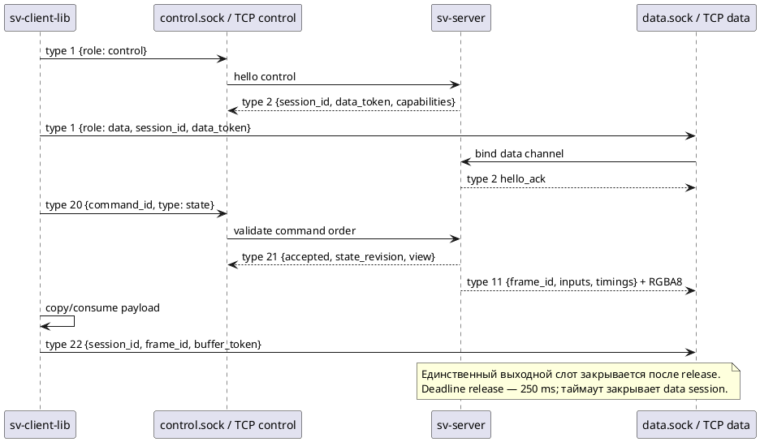
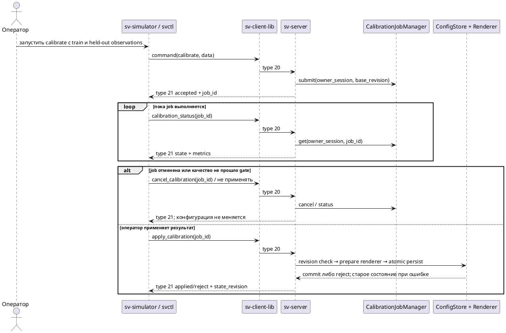

# Реализованный протокол SV01

Срез реализации Linux 0.6.x. Это описание текущего wire-контракта, сверенное с `include/sv/protocol.hpp`, `src/core/protocol.cpp`, `src/apps/server.cpp` и `src/client_library/client.cpp`. Целевая расширенная архитектура и подписки описаны отдельно в [[architecture/CLIENT_SERVER_MODEL]] и пока не являются возможностями сервера.

## Транспорт и кадрирование

Один логический клиент использует две независимые stream-связи: control и data. Поддерживаются Unix domain sockets либо TCP; транспорт выбирается только конфигурацией endpoint/listeners. Клиентская библиотека сама не переключается на другой транспорт. UDP, TLS, несколько одновременных клиентов и control-only пока отсутствуют. Серверная сторона ограничена одной сессией: второй клиент не образует независимое пространство состояния.

Сообщение содержит 24-байтовый префикс: ASCII `SV01`, версия 1, тип uint16, полная длина заголовка uint32, длина payload uint64, flags uint32=0; числа big-endian. За ним следуют JSON UTF-8 и binary payload. Пределы — 64 KiB header и 64 MiB payload. TCP-чтение не совпадает с границами сообщений, поэтому decoder буферизует частичные и пакетированные сообщения.

| Тип | Направление и смысл в текущем коде |
|---:|---|
| 1 | Клиент → сервер: hello; на control `{role:"control"}`, на data `{role:"data", session_id, data_token}` |
| 2 | Сервер → клиент: hello_ack с `session_id`, `data_token`, `profile`, `capabilities` |
| 3 | Библиотека → callback: локальное событие потери ожидающей команды (`session_lost`); отдельный wire error пока не реализован |
| 11 | Сервер → клиент по data: финальный RGBA8 кадр и provenance/timing metadata |
| 20 | Клиент → сервер по control: команда с монотонным в рамках сессии `command_id`, `type` и параметрами |
| 21 | Сервер → клиент по control: ACK/reject с `accepted`, `reason`, `state_revision` и результатом операции |
| 22 | Клиент → сервер по data: release с `session_id`, `frame_id`, `buffer_token` |

## Порядок открытия сессии и доставки кадра



Если release теряется или задерживается, библиотека/клиент не получает второй кадр в этом stream; по deadline сервер закрывает соединение. Отправлять release нужно после копирования данных в собственный буфер. Client callback работает на worker thread; UI обязан передать событие в свой executor и не блокировать остановку клиента внутри callback.

## Команды

Все команды имеют заголовок `{command_id: decimal-string, type: string, ...parameters}`. Повторный или меньший ID отклоняется как `duplicate_or_out_of_order`. ACK несёт `command_id`, `accepted`, при отказе — `reason`; состояние/результат включается в ACK. Потерянные при разрыве pending-команды получают локальную ошибку `session_lost` и автоматически не воспроизводятся после reconnect.

| Команда | Параметры | Эффект / отказ |
|---|---|---|
| `state` | нет | Read-only view, fusion, pause и revision |
| `orbit` | `azimuth_delta_rad`, `elevation_delta_rad` | Изменение virtual view с ограничением elevation и проверкой clearance |
| `zoom` | `distance_delta_m` | Изменение дистанции, диапазон 6–18 m |
| `preset` | `name=top/front/rear` | Переключение стандартного ракурса; иначе `unknown_preset` |
| `pause`, `resume`, `step` | нет | Управление replay; для не-replay `step_unsupported_for_source` |
| `calibrate` | см. ниже | Асинхронная job, результатом ACK является `job_id` |
| `calibration_status` | `job_id` | Только владелец сессии; статус, fit/validation metrics |
| `cancel_calibration` | `job_id` | Только владелец; running solver отменяется кооперативно после возврата OpenCV |
| `apply_calibration` | `job_id` | Только владелец; новый renderer подготовлен до сохранения, проверяется base revision и held-out gate |

Неизвестная операция возвращает `unknown_command`; malformed/non-finite parameters возвращают reject с причиной. Config revision/state revision не меняются на read-only и rejected операциях. Калибровка применима только если validation RMSE ≤3 px, max error ≤8 px и базовая revision ещё актуальна. Лимиты 3/8 px предварительны и должны быть пересмотрены на физических данных.

Пример сокращённого запроса калибровки:

```json
{
  "command_id": "17",
  "type": "calibrate",
  "camera_id": 0,
  "method": "ransac_epnp_lm",
  "points": [[1.0, 0.2, 0.1], [2.0, -0.4, 0.2]],
  "pixels": [[413.2, 250.1], [382.0, 214.4]],
  "validation_points": [[1.5, 0.1, 0.4], [3.0, 0.7, 0.2]],
  "validation_pixels": [[400.0, 230.0], [355.0, 190.0]]
}
```

Фактически сервер требует не менее шести train и шести независимых validation соответствий; координаты точек имеют три конечные метрические компоненты, пиксели — две. Пример выше показывает только форму и намеренно не является исполняемым минимумом. Источник, единицы, независимое измерение, detector, hashes observations и распределение поз остаются обязанностью вызывающего инструмента. GUI не должен генерировать псевдоизмерения.



## Метаданные и гарантии

Кадр 11 включает `frame_id`, `frame_set_id`, `state_revision`, `applied_command_id`, token, размер/stride, `RGBA8`, top-left origin, source/fusion/view IDs, четыре записи `inputs`, health и spans pipeline. Он не является промежуточной stitched texture и не содержит control subscriptions. `local_monotonic` timestamp нельзя вычитать из часов удалённого ноутбука; текущие показатели server-side, а не физическая sensor-to-display задержка.

Очереди и payload bounded. Network delivery не подтверждает источник-съёмку: текущий camera source timestamp соответствует host delivery, если драйвер не предоставляет проверенный capture timestamp. Утилита должна сохранять endpoint, версии, config/calibration revision, IDs и hashes данных в отчёте эксперимента.

## Планируемое расширение и проверка

Несколько независимых клиентов, control-only, per-session view, config snapshot/update, subscriptions (`final_frame=false`), canvas/coverage/weights, trace stream, typed library API, UDP и двуххостовой clock mapping не реализованы. Их normative target contract — [[requirements/PROTOCOL]] и [[architecture/CLIENT_SERVER_MODEL]]. Protobuf не нужен для текущего небольшого JSON-header/binary-frame профиля: менять codec следует при появлении совместного schema/codegen требования, а не ради замены формата.

Основные тесты текущего протокола: `client_lifecycle`, `client_transports`, `server_session`, `calibration_job`, `config_store`, `replay_ipc`. Пробелы: fuzz/property decoder, контрольные vectors для каждого message type, command ID overflow/wrap policy, длительный release/backpressure, cancellation race, и межмашинное TCP испытание.
