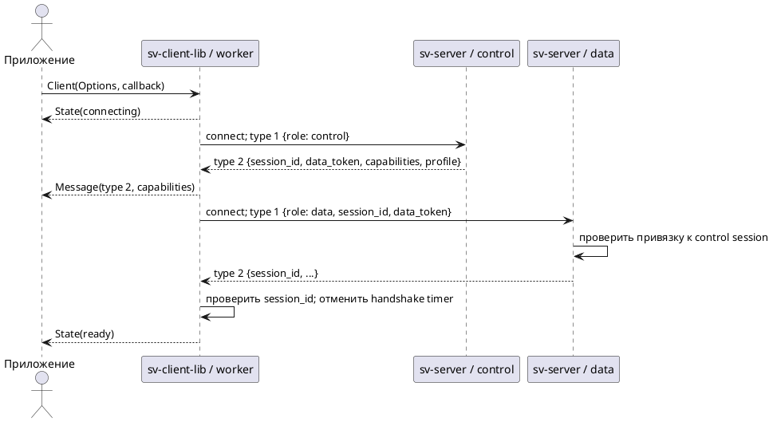
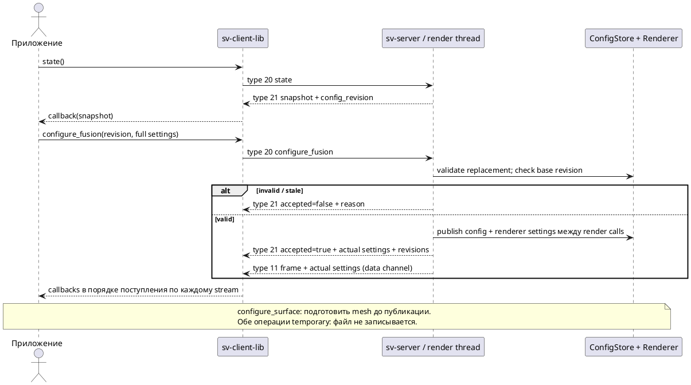
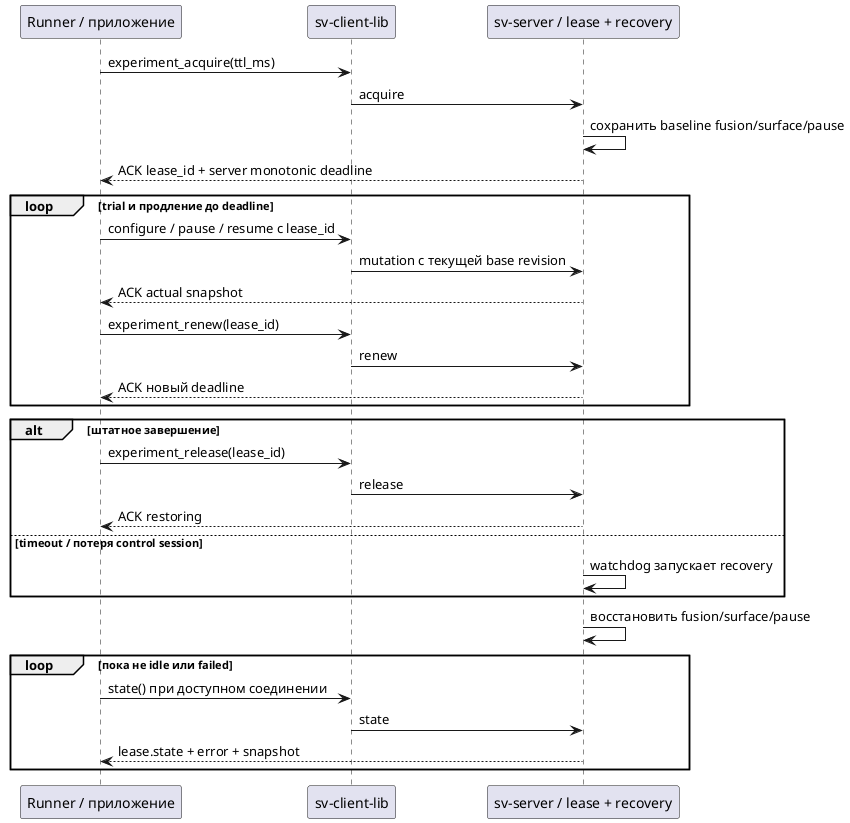
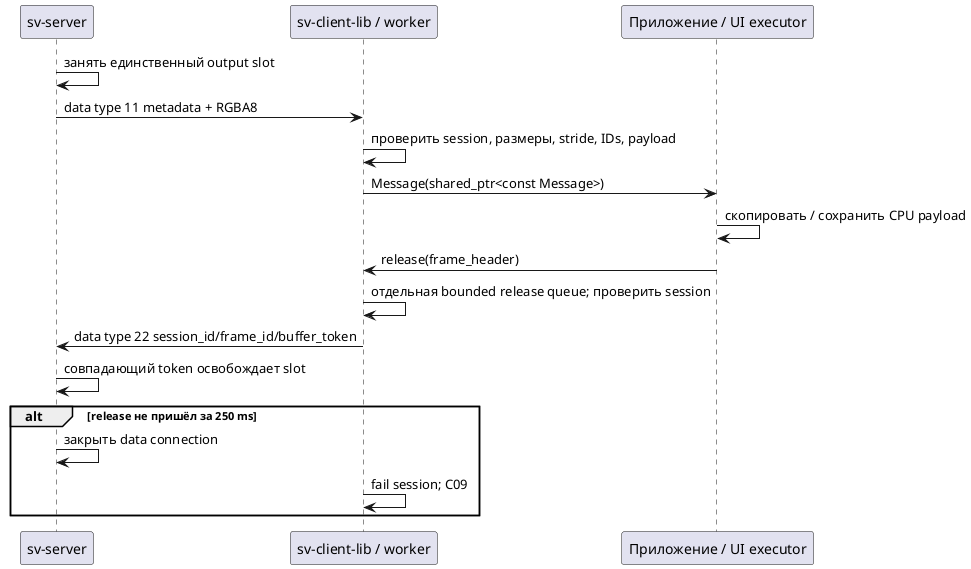
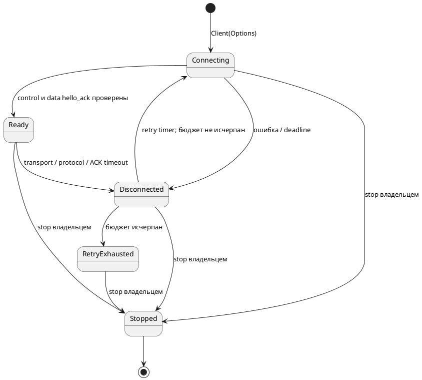

# Сценарии взаимодействия sv-server и sv-client-lib

Сверено с кодом 10.10.2026. Это каталог **реализованных** взаимодействий SV01, а не обещание полного ConfigService. Формат сообщений, параметры и ограничения: [[engineering/PROTOCOL_IMPLEMENTED]]. Целевые расширения: [[architecture/CLIENT_SERVER_MODEL]], [[requirements/PROTOCOL]]. Любое клиентское приложение выполняет описанные операции через `sv-client-lib`; конфигурационный файл изменяет только сервер.

## Границы и обозначения

Реализация: `include/sv/client.hpp`, `src/client_library/client.cpp`, `src/apps/server.cpp`, `src/core/protocol.cpp`, `include/sv/experiment_lease.hpp`. Unix и TCP используют одинаковые сообщения, но разные явно выбранные endpoints. Одна сессия требует двух stream-соединений: control и data. Producer изображений — отдельный входной протокол [[engineering/SOURCES]], не data channel клиентской библиотеки.

В диаграммах «Приложение» означает sv-simulator, автомобильный sv-client, svctl или внешний потребитель библиотеки. Стрелка callback выполняется на worker библиотеки: UI переносит обработку в свой executor. Библиотека не вызывает Qt и не редактирует конфиг сервера.

## Полный каталог текущих операций

Все 18 серверных команд передаются как type 20; результат — type 21. Typed API перечислен там, где он есть; остальные доступны через `command(type, parameters)`. Наличие generic API не означает поддержку неизвестной команды сервером.

| Команда | Запрос помимо command_id/type | Успешный результат / сценарий |
|---|---|---|
| `state` | Нет | Snapshot, revisions, lease; С02 |
| `fusion_catalog` | Нет | Каталог fusion версии 3, capabilities параметров; С02 |
| `surface_catalog` | Нет | Типы носителей и описание plane; С02 |
| `orbit` | `azimuth_delta_rad`, `elevation_delta_rad` | Допустимый view; С03 |
| `zoom` | `distance_delta_m` | Допустимая дистанция; С03 |
| `preset` | `name=top/front/rear` | Выбранный view; С03 |
| `pause` | Optional `lease_id` | Источник подтвердил паузу; С04 |
| `resume` | Optional `lease_id` | Источник подтвердил продолжение; С04 |
| `step` | Нет | Один следующий replay frame set и пауза; С04 |
| `configure_fusion` | `base_config_revision`, полный `fusion`, optional `lease_id` | Temporary replacement; С05 |
| `configure_surface` | `base_config_revision`, полный `surface`, optional `lease_id` | Подготовленная и применённая mesh; С05 |
| `experiment_acquire` | Целый `ttl_ms` 250..30000 | Lease для replay; С06 |
| `experiment_renew` | `lease_id` | Новый deadline с исходным TTL; С06 |
| `experiment_release` | `lease_id` | Начало restoring; С06 |
| `calibrate` | `camera_id`, train/validation XYZ/UV, `provenance`, optional `method` | `job_id`, политика validation; С07 |
| `calibration_status` | `job_id` | Состояние и доступные метрики job владельца; С07 |
| `cancel_calibration` | `job_id` | Кооперативная отмена; С07 |
| `apply_calibration` | `job_id` | Подготовка renderer и persistent config commit; С07 |

С01 и С08–С11 — жизненный цикл и отказы, не дополнительные серверные команды. Форматы вложенных fusion/surface/provenance не дублируются: [[engineering/PROTOCOL_IMPLEMENTED]], [[engineering/RENDERING]], [[validation/CALIBRATION_PROVENANCE]].

## С01. Подключение и привязка data channel

Предусловие: сервер слушает выбранный транспорт, приложение владеет объектом Client. Конструктор библиотеки запускает подключение асинхронно. До события `ready` приложение не должно отправлять рабочие команды.

*Рисунок ПС.1 — Открытие обязательных control/data каналов. Получение control hello ещё не означает ready.*

При ошибке connect/hello или deadline — С09. В текущем сервере нет независимых одновременных клиентских сессий и control-only режима; второй клиент не должен использоваться как параллельный конфигуратор.

## С02. Чтение состояния и возможностей

После ready приложение читает `state`, `fusion_catalog`, `surface_catalog`, сопоставляет handshake capabilities со своими операциями. `state()` и методы catalog возвращают локальный command ID немедленно; сам результат приходит callback-ом с тем же ID. Эти read-only команды не меняют state/config revisions. Каталог fusion содержит ограничения параметров и идентификаторы реализации; поддержку normalized boundary нужно проверять по каталогу.

Приложение хранит серверный snapshot как подтверждённое состояние, а локальные формы — как черновик. Это основа будущего интерфейса с регуляторами, а не требование ручного JSON ввода. Ошибка/таймаут не превращаются в подтверждение применённых настроек.

## С03. Управление view и получение результата

`orbit/zoom/preset` изменяют виртуальную камеру после серверной проверки диапазонов и clearance. Принятая команда обновляет state revision; отвергнутая оставляет её прежней. ACK сообщает итоговый view, но не содержит RGBA. Результат рендера приходит отдельно по data, только когда свободен выходной слот.

ACK и frame идут разными streams: приложение не должно предполагать общий порядок их прихода. Для выбора актуального результата проверять `state_revision`, `config_revision` и фактические view/fusion/surface metadata. `applied_command_id` не является универсальным журналом выполнения всех операций: в частности, read-only/job/lease команды не обязаны менять его. Сопоставление ответа конкретной команде выполняется только по ACK command ID.

## С04. Pause, resume и step

Сервер передаёт управление источнику; ACK отправляется после source control event, а не при одном помещении запроса в очередь. При ожидании source event остальные команды сохраняются для последующей обработки. Причины отказа включают `source_control_queue_full`; step для источника кроме replay — `step_unsupported_for_source`.

Pause сохраняет текущий согласованный набор, но не гарантирует READY: можно остановиться на NO_INPUT/устаревшем наборе. Перед исследовательским trial проверять health и входные frame IDs. Step продвигает replay и оставляет его на паузе. Seek к произвольному кадру и сброс temporal history не реализованы. В активном lease допускаются pause/resume владельца с lease ID, но step запрещён его guard-ом.

## С05. Temporary настройка fusion и носителя

*Рисунок ПС.2 — Revision-aware замена исследовательских настроек. Межканальный порядок ACK/frame не гарантирован.*

Вложенный объект полностью заменяет секцию; пропуски optional полей получают defaults. Типизированная библиотека опускает default `pyramid_boundary=zero` для совместимости со старым сервером. Нормализованный вариант отправляется явно. При stale revision перечитать state и предложить/перепроверить новый черновик; не повторять старую мутацию вслепую.

Сохранение этих temporary настроек отдельной командой отсутствует. Вне lease восстановление — отдельная replacement команда с исходной секцией и **текущей** revision. `apply_calibration` сохраняет весь активный snapshot, поэтому перед ним восстановить исследовательский baseline, если эти временные значения не должны попасть в файл.

## С06. Ограниченный исследовательский lease

Предусловия: replay source, idle lease. Библиотека предоставляет acquire/renew/release, а общий C++ runner использует их для одного paused frame set. Lease хранит исходные fusion/surface/pause, но не playback cursor/изображения/temporal history.

*Рисунок ПС.3 — Lease и автоматическое восстановление. ACK release подтверждает начало recovery, не его завершение.*

Active lease пропускает read-only state/catalog/calibration_status; мутации ограничены configure_fusion/configure_surface/pause/resume/renew/release владельца. Orbit, step, новые calibration jobs и persistent apply заблокированы. Старый lease ID не становится обычной мутацией после expiry. В failed состоянии проверить error и серверный журнал; не считать baseline восстановленным. Состояние deadline относится к часам сервера, его нельзя вычитать из часов ноутбука.

## С07. Калибровочная job, отмена и применение

`camera_id` проверяется как JSON integer 0..3 до сужения типа. XYZ/UV принимают конечные JSON integers/doubles без приведения bool/string. Пример `camera_id=4294967296` должен отклоняться, а координата `0` должна иметь тот же смысл, что `0.0`. Точные причины numeric rejects: [[engineering/PROTOCOL_IMPLEMENTED#Команды]]. Эти проверки предшествуют выделению job ID.

Порядок: `calibrate` с train/held-out observations и provenance → ACK `job_id` → polling `calibration_status` → решение оператора → `apply_calibration` либо отмена. Подробная sequence diagram и точные validation требования: [[engineering/PROTOCOL_IMPLEMENTED#Команды]]. Все job операции проверяют владельца session; reconnect не переносит владение job.

ACK calibrate означает постановку задания, а не завершение solver и не применение калибровки. Cancellation кооперативная: текущий вызов OpenCV заканчивается, результат после отмены не применяется. Read-only status не сохраняет файл. Apply требует completed job, предварительного held-out gate и актуальной base config revision; сервер сначала готовит renderer, затем атомарно сохраняет snapshot и публикует активную пару. При отказе сохраняется прежняя конфигурация. Применение временных fusion/surface через persistent snapshot — ограничение С05.

При disconnect сервер отменяет jobs старой session. Клиент должен архивировать запрос/данные/ответы самостоятельно: компактный статус не является полным архивом observations. Проверки split и их ограничения: [[validation/CALIBRATION_PROVENANCE]].

## С08. Приём кадра и release

*Рисунок ПС.4 — Владение выходным слотом и CPU-буфером. Release не уничтожает shared_ptr клиента.*

Release посылается один раз после копирования/получения собственного безопасного владения данными. Output token не является GL handle. Пока слот занят, новый кадр этому stream не публикуется. Несовпадающий frame/token не освобождает слот; release старой session библиотека отбрасывает. Очередь release имеет собственный лимит, поэтому насыщение command submission само по себе не отнимает её ёмкость. Насыщение самой release queue всё ещё является ошибкой.

Release содержит только metadata, без binary body. Непустой payload закрывает серверный data connection без отдельного ACK, включая случай правильного token. Control остаётся жив; штатная библиотека воспринимает data EOF как потерю своей сессии (С09). На стороне API oversized metadata отклоняются до post и до расходования release submission budget, даже до ready. Вызывающий код получает synchronous exception; worker не должен обнаруживать эту ошибку впервые при send.

## С09. Ошибка, потерянный ACK и reconnect

Транспортная ошибка, malformed response, handshake/partial-message/command deadline переводят библиотеку в disconnected: оба канала закрываются, session/token очищаются. Каждая ожидающая ACK команда получает локальное Error `session_lost` с command ID; затем выдаются причина сбоя и State(disconnected). Это локальные события type 3, не отдельные серверные wire сообщения.

Если мутация уже была отправлена, `session_lost` означает **неизвестный результат**, а не доказанный rollback: сервер мог применить её до потери ACK. Pending команды автоматически не воспроизводятся. Reconnect создаёт новую сессию на том же endpoint; после ready приложение повторно читает capabilities/state. На исчерпании max_retries приходит retry_exhausted; новый ready сбрасывает счётчик последовательных ошибок. Operation ID deduplication и восстановление исходного ACK по ID пока отсутствуют.

*Рисунок ПС.5 — Жизненный цикл библиотеки. Stopped — терминальное состояние конкретного Client.*

## С10. Параллельные команды, отказ и границы очередей

`command()` разрешён из нескольких потоков потребителя. Выдача ID, предварительная encode validation и post в worker сериализованы одним mutex: меньший отправленный ID не обгоняется большим. Порядок одновременно начатых вызовов между потоками не определён заранее. ID монотонны в пределах объекта Client, не сбрасываются при reconnect; сервер проверяет возрастание в пределах control connection. Пропуски ID после синхронной ошибки допустимы. При исчерпании uint64 библиотека выбрасывает overflow_error; wrap в 0 запрещён, нужен новый Client.

Невалидный размер/полная submission queue дают синхронное исключение. Если отправка уже поставлена в worker, но тот ещё не ready или заполнен pending ACK budget, приходит локальный Error `not_ready_or_queue_full` с ID, запрос не отправляется серверу. На уровне сервера повторный/меньший ID получает reject `duplicate_or_out_of_order`; этот ранний ACK может не содержать полного state snapshot. Неизвестная команда — `unknown_command`, invalid command parameters — reject. Ошибка framing/handshake закрывает connection и не обязана возвращать command ACK.

Тест `client_command_order`: восемь конкурентных отправителей, 256 команд с неравным объёмом encoding, TCP mock с настоящими SV01 codec и библиотекой, проверка всех IDs на wire и принятых ACK. До исправления воспроизведён порядок 3,4,5,1,2 и серверный reject; после — возрастающий порядок без reject. Это тест транспорта/библиотеки, не подтверждение multi-client сервера.

## С11. Остановка владельцем

Владелец сериализует `stop()`/destruction с вызовами command/release. Stop отменяет работу, присоединяет worker и закрывает sockets; после возврата callbacks не выполняются. Остановка не обещает ACK/terminal Error для каждой queued команды. Callback не должен вызывать blocking stop или уничтожать Client: остановку нужно запланировать во владеющем потоке. Повторный stop допустим.

## Проверки и оставшиеся сценарии

| Сценарии | Существующее покрытие |
|---|---|
| С01–С04, С08–С09 | `client_lifecycle`, `client_transports`, `replay_ipc`, `server_session` |
| С05 | `render_fusion_parity`, `native_fusion_parity`, runtime GUI probes внутри `client_transports` |
| С06 | `experiment_lease`, `experiment_watchdog`, `research_scenarios`, lease/runtime checks внутри `client_transports` |
| С07 | `command_parameters`, `calibration_job`, `calibration_observations`, `config_store_persistence`, provenance/numeric checks внутри `replay_ipc` |
| С08, С10 | `client_release_budget`, `client_command_order` |
| С11 | `client_lifecycle` и cleanup остальных library suites |

Названия — точки входа проверок, а не утверждение о полном покрытии всех ветвей. Длительный overload, два физических узла, fuzz decoder, cancellation/ACK races и fault injection persistence ещё требуют расширения. Multi-session, control-only, subscriptions/intermediate products, общий persistent ConfigService и UDP находятся в TODO; не добавлять их в список текущих возможностей без реализации и тестов.
