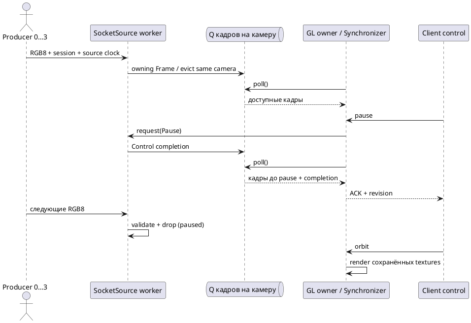

# Источники кадров: replay и виртуальные камеры

Linux-профиль **0.6.0**. Реализован C++ `FrameSource` с отдельным worker, неблокирующими `request`/`poll`, ограниченными очередями и явной остановкой. GL-ресурсы остаются в основном потоке сервера. `sv-sources` — внутренний target; публичная `sv-client-lib` принимает готовый RGBA-результат, а не входы камер. Подключение клиента и отправка камер имеют разные endpoints.

## Выбор источника

Блок `source` необязателен: прежние `--manifest FILE --loop true|false` сохраняют replay. Если `source` присутствует, эти CLI-параметры запрещены, даже когда совпадают с конфигурацией. Неизвестные ключи/типы отвергаются. Hot reload и смешивание replay/аппаратных камер пока не поддерживаются.

```json
"source": {"type": "replay", "manifest": "recording/manifest.json", "loop": true}
```

Путь здесь разрешается относительно **каталога config**. CLI `--manifest` остаётся относительно рабочего каталога. `loop` по умолчанию true. Временная шкала задаёт интервалы между завершёнными наборами; decode и scheduling добавляют задержку. На wrap используется первый интервал, при одном ряде — 33.333333 ms. Это воспроизведение интервалов без гарантии realtime pacing. Отрицательные/положительные `offset_ns` manifest моделируют skew относительно server delivery.

```json
"source": {
  "type": "socket",
  "message_timeout_ms": 2000,
  "cameras": [
    {"camera_id": 0, "transport": "unix", "path": "/tmp/sv-input/front.sock"},
    {"camera_id": 1, "transport": "unix", "path": "/tmp/sv-input/right.sock"},
    {"camera_id": 2, "transport": "tcp", "address": "127.0.0.1", "port": 48082},
    {"camera_id": 3, "transport": "tcp", "address": "127.0.0.1", "port": 48083}
  ]
}
```

Обязательны ровно четыре уникальных `camera_id` 0…3. Unix path абсолютный, ≤100 байт; существующий путь не удаляется и вызывает ошибку запуска. Сервер удаляет только созданные им пути при штатной остановке. TCP address — явный IP-литерал, port 1…65535. `message_timeout_ms` — целое 10…60000, default 2000: handshake и получение неполного сообщения; молчащий уже подключённый producer не отключается, свежесть контролирует Synchronizer. Одна активная producer-сессия на камеру; дополнительное подключение закрывается.

`connections` управляет клиентскими endpoints независимо. Unix-only для **всего процесса** получается при Unix client connections и всех четырёх Unix camera endpoints; TCP source открывает IP sockets даже при Unix-only client connections. Без явного socket source сервер не открывает порты камер. Нет UDP, TLS и аутентификации producer; session ID отделяет переподключения и не является учётными данными. TCP применять в доверенной сети; не выдавать его за защищённый публичный сервис.

## Worker, буферы и команды

| Свойство | Replay worker | Socket worker |
|---|---|---|
| Работа вне GL-потока | Decode PPM/OpenCV PNG/JPEG, cache | Asio accept/read/decode, проверка RGB8 |
| Очередь кадров | До Q четырёхкамерных наборов | До Q кадров **каждой** камеры, суммарно 4Q |
| Переполнение | Вытеснение старого набора | Вытеснение старого кадра той же камеры |
| Pause ACK | После завершения текущего decode; новых decode нет | После обработки команды в source io_context; новые входы проверяются и отбрасываются |
| Step | Один следующий набор, затем пауза | Reject `step_requires_replay`, revision не меняется |
| Resume | Следующий ряд немедленно | Публикуются только вновь принятые кадры |
| Stop | Notify/join; ожидание текущего file decode | Stop io_context/join/close/cleanup |

Q = `runtime.input_queue_per_camera`. У replay cache содержит до четырёх последних изображений. У socket decoder ограничен общим SV01 payload limit 64 MiB на соединение; очередь содержит owning RGB8 buffers, не ссылки на переиспользуемый read buffer. Для больших разрешений учитывать память 4Q × W × H × 3 плюс decoder/current frames и GL textures. Source request queue ограничена 64 запросами; socket status mailbox — 16 событиями. Старые уведомления могут быть пропущены при избытке ошибок, но не отключают остальные камеры.

File decode нельзя принудительно прервать внутри OpenCV/файловой системы: для replay нет жёсткой границы shutdown при зависшем чтении. Для обычных локальных файлов пауза и shutdown проверены. Аппаратный backend потребует собственного решения cancellation/timeouts; наивный блокирующий `VideoCapture::read` не объявляется завершённым live-адаптером.



*Рисунок И.1 — Разделение source worker и владельца GL; pause подтверждается после source barrier.*

## Протокол producer

Используется существующий framing SV01: 24-byte prefix, JSON header, binary payload; partial/coalesced reads допустимы. Числовые счётчики/наносекунды передаются десятичными строками uint64. Поля размеров и camera ID — JSON integers.

1. Producer → type **1**, payload пустой: `role="producer"`, `camera_id`, `calibration_id`, `width`, `height`, `pixel_format="RGB8"`, `row_origin="top_left"`, `clock_domain` (непустая строка ≤128 байт).
2. Server → type **2**: `session_id`, `camera_id`, `timestamp_basis="server_delivery"`; payload пустой.
3. Producer → type **10**: session/id/calibration/resolution/format/origin/clock из handshake; `stride_bytes=width*3`, строки `sequence_id`, `source_timestamp_ns`, `scenario_timestamp_ns`. Payload ровно width × height × 3, RGB, строки сверху вниз, без padding. ACK каждого кадра отсутствует.

В рамках сессии sequence строго возрастает, source timestamp не убывает. Переподключение начинает новую сессию и может сбросить source sequence в 0; локальный sequence Synchronizer продолжает возрастать. Неверные метаданные, payload или порядок закрывают только данный вход. Доставка TCP подтверждает байты транспортом, но не гарантирует, что кадр не был вытеснен перед рендером.

Выходной type 11 содержит `source_type`, `timestamp_basis`, `source_received`, `source_rejected`, `source_dropped_batches`, `source_queue_depth`, `decode_count`; счётчики строковые, глубина очереди integer. Drop unit — replay batch либо один socket camera frame. Depth наблюдается после poll и не является измерением пикового заполнения. Для used inputs добавлены `source_session_id`, `source_clock_domain`, `source_sequence_id`, `source_timestamp_ns`. Независимые source clocks **не вычитаются** из server clock: Synchronizer использует server delivery. READY означает свежий набор по этой шкале, а не доказанную синхронность экспозиции камер.

## Producer из Blender-записи

`tools/producer.py` — host-утилита Python + Pillow; framing из `tools/ipc.py`. Она проверяет calibration IDs, timeline, безопасные dataset paths и SHA-256 **до подключения**, затем четыре независимых потока читают RGB и передают кадры. В памяти кешируется последнее изображение каждой камеры. `--loops N` ограничивает продолжительность; `--host IP` меняет TCP destination, не серверную политику listeners. Nonzero replay offsets отвергаются: сетевой producer пока не симулирует timestamp skew. Перезапуск утилиты создаёт новые сессии; автоматического reconnect/retry нет. Ошибка одной камеры не закрывает сокеты остальных; итоговый exit ненулевой. Ctrl+C останавливает ожидание расписания; блокирующий socket ограничен timeout 3 s.

Полные команды: [[engineering/USAGE#Blender-запись через виртуальные камеры]]. Это сетевое воспроизведение готовой 3D-записи, не интерактивное вождение/рендер Blender. Сервер и producer могут работать на разных машинах по TCP, но проверены Unix/localhost; physical two-host acceptance и распределённые часы остаются открытыми.

Socket pipeline дополнительно проверена на сохранённой Blender-улице с RTX 5070 Ti; actual readback опубликован в главе 3 (рисунок 3.14). Проверки и ограничения: [[validation/SOURCES_SMOKE]]. Исходники: `include/sv/source.hpp`, `src/sources/replay.cpp`, `src/sources/socket.cpp`, `tests/source_tests.cpp`, `tests/test_sources.py`.
