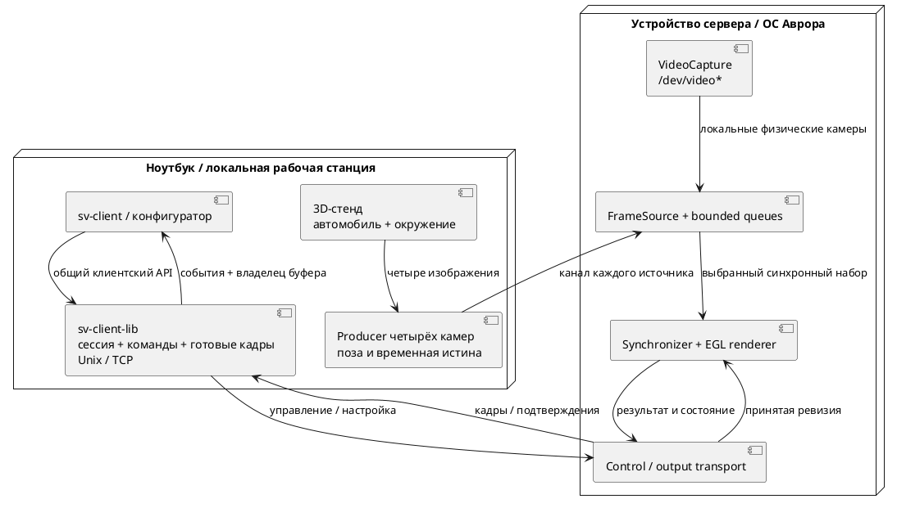

# Подробный план реализации

Единственный действующий план полного проекта. Стартовый чеклист находится в корневом `TODO.md`; содержание диссертации — [[planning/THESIS]]. Тема и обязательный результат: [[research/TOPIC]]. На 06.10.2026 рабочий Linux-профиль 0.5.0 содержит математическое ядро, GPU/replay, калибровочные инструменты, пять носителей/три fusion-режима, screening, Unix/TCP сервер и общую клиентскую библиотеку с GUI/headless consumers. Проверка каждого этапа и незакрытые условия — [[planning/AUDIT]]. Ни один полный целевой этап не объявляется завершённым по одному Linux smoke. Реальные данные, полный контракт, UDP/live sources и Аврора остаются открытыми. Свидетельства — [[prototype/STATUS]], [[research/PROJECTION_AND_STITCHING]], [[prototype/MEASUREMENTS]].

## Зависимости и результаты

| Этап | Зависит от | Работа | Артефакт и условие завершения |
|---|---|---|---|
| M1 — постановка и платформа | — | Согласовать тему, исследовательский вклад, срок и устройство; начать обзор; проверить SDK, Qt, GPU/API и первый кадр | Паспорт ПК/Авроры, таблица аналогов, закрытые критические вопросы ADR-001; пробное приложение на устройстве |
| M2 — данные и контракты | M1 | Координаты, четыре камеры, шаблон, запись/manifest, схема конфигурации и временная шкала | Контрольные точки проверены независимо; полная конфигурация читается; известны источник и права на данные |
| M3 — CPU-математика и калибровка | M2 | Прямая fisheye-проекция, матрицы, валидность, plane/bowl/dome-floor; первая offline-калибровка | E-MATH-01 и E-CALIB-01; отчёт обучающей/отложенной репроекции; экспорт параметров |
| M4 — одна камера на GPU | M1, M3 | EGL/FBO, текстура, проекция, виртуальная камера, асинхронное измерение GPU | GPU соответствует независимому CPU; ограниченная смена ракурса использует прежние ресурсы |
| M5 — четырёхкамерный baseline | M4 | FileFrameSource, подбор наборов, маски, нормализованный blending и replay | Plane/bowl/dome-floor доступны в коде; quality сравнение fusion/surface отдельно в E-STITCH-01 |
| M6 — контроль смещения | M3, M5 | Сервисная проверка; исследование перекрытий, порогов и неопределённости; повторная калибровка | E-DRIFT-01/E-RECOVERY-01; чувствительность, ложные тревоги, камеры-кандидаты, восстановление |
| M7 — сервер, клиентская библиотека и UI | M5 | `sv-client-lib` с общим API локального/удалённого подключения; `sv-client` через библиотеку, bounded IPC/TCP, QML, orbit/zoom/preset, calibration/health status | Один клиентский API проходит Unix/loopback/две машины; полный trace, 500 команд на паузе; измерен первый представленный кадр принятой ревизии |
| M8 — воспроизводимость и отказы | M6, M7 | Producer, skew/drops/disconnect, перегрузка, reconnect, clocks, shutdown | E-ROBUST-01; ограниченные ресурсы, различимые состояния, повтор опыта |
| M9 — целевой конвейер Авроры | Разведка M1; M5, M7 | Сборка/пакетирование, источники, GPU/server, клиент и зависимости на реальном устройстве | Полный путь работает на устройстве; собственный паспорт, формат/разрешение и timings; эмулятор недостаточен для вывода о производительности |
| M10 — основные опыты | M6, M8, M9 | Зафиксировать пороги; сравнить surface carriers и методы слияния, калибровку, дрейф, ресурсы и задержку ПК/устройства | Воспроизводимые отчёты по [[research/EXPERIMENTS]], отдельно E-SURFACE-01/E-STITCH-01; все MUST имеют свидетельства |
| M11 — текст и демонстрация | Пишется с M1; итог после M10 | Связать обзор, модели, реализацию и результаты; показать ограничения | Главы, таблица методов fusion/geometry, пакет повторного запуска и сценарий защиты |
| M12 — резерв | M11 | Замечания руководителя, повторная сборка и запуск | Финальная версия, восстановимая среда и проверенные материалы |

Проверку устройства начинать на M1, повторять после M4/M5. M9 завершает перенос; откладывать первую проверку Авроры до конца проекта нельзя. В 0.5.0 доступны OpenCV tools, native suite с 25 критериями и десятью render variants, Unix/TCP и installed client CMake package. Подробные PC baselines относятся к прежней revision; новый полный аппаратный baseline ещё нужен. Spec-профили подготовлены; результаты Linux RPM фиксируются с отдельной revision. Целевые SDK/устройство всё ещё не предоставлены, поэтому M9 открыт. Следующий путь: [[engineering/AURORA]] → [[engineering/PLATFORM_TEST]].

## M1–M2: техническая разведка

Получить CPU/GPU, RAM/VRAM, ОС/SDK, компилятор, версии Qt и API, backend EGL, список расширений и форматов. Проверить GUI и отдельный GPU-процесс. Собрать эксперимент «текстура → FBO → готовый кадр → QML» и измерить выходной readback/IPC/upload. Выписать запрещённые или недоступные зависимости и решение о графическом профиле.

Обзор вести сравнительной таблицей: входы, поверхность, калибровка, контроль смещения, бюджет ресурсов, метрики и конкретное отличие опыта. Для данных сохранить источник, условия использования, хэши, истину/калибровку и независимые наблюдения. Выделить наборы настройки и итоговой оценки до подбора порогов.

Исследование от 06.10.2026: сначала завершить чтение аналогов и выбрать малозатратные варианты слияния; обзор — [[research/PROJECTION_AND_STITCHING]]. Две оси сравнивать раздельно: (1) hard/feather/distance/graph-cut/multi-band; (2) plane/bowl/dome+floor/cylinder/cube/Burger. Сначала выбрать finalists на synthetic screen-опыте, затем подтвердить на независимой реальной 4-camera записи. Cube-map — направленное texture representation, она автоматически не заменяет поверхность дороги.

## M3–M5: корректность до оптимизации

Сначала проверить оси, инверсию позы, центральный луч, границы FOV, resize/crop и сингулярности. Затем проверить калибровку и поверхности. На GPU начать с одной камеры и прямой проекции, добавить четыре источника, masks/weights и replay. Численную ошибку GPU, ошибку сетки, калибровку и несоответствие условной поверхности реальной сцене измерять отдельно.

Первый четырёхкамерный результат должен сохранять карты покрытия, ошибки маркеров и двойные контуры. При смене только виртуальной камеры не повторять decode/upload входов и mesh rebuild. Между внутренними GPU-проходами не делать обязательный full-frame readback; стоимость выхода учитывать отдельно.

## M6–M9: диагностика и интеграция

Начать диагностику с наблюдаемого контроля по шаблону, затем исследовать перекрытия. Отделить смещение от экспозиции, движущихся объектов и skew. Порог выбрать на отдельной выборке; поддержать INDETERMINATE. Повторную калибровку проверять на прежней независимой сцене.

Интеграция должна сохранять session/sequence/calibration/frame/command IDs. Render thread не блокируется сетью, файлами или UI. Команды и видео имеют разные ограниченные очереди. Проверить политику stale, отказ каждой камеры, reconnect, release буфера, остановку и новую сессию.

На Авроре измерить тот же алгоритм с фактически поддержанным API. Данные, профиль и условия сравнения ПК/устройства сохраняются. Если профиль приходится снижать, публиковать отдельную строку; мощный ПК не определяет бюджет целевого GPU.

## M10–M12: эксперимент и текст

Порядок вариантов чередовать; прогрев и независимые повторы заданы в [[validation/ACCEPTANCE]]. Сохранять распределения, максимумы, пропуски, повторы, очереди, частоты и температуру при доступности. Гипотеза может дать отрицательный результат. После опыта не менять пороги в той же версии протокола.

Для E-STITCH-01 зафиксировать цветовую компенсацию, маски и RGB-пространство. Сначала измерить reference-quality при плотной сетке, затем ограничить triangle/memory budget и исследовать adaptive mesh. Не называть проекционную визуализацию reconstruction: скрытые направления и глубина остаются unknown.

Обзор писать во время чтения, математическую главу — вместе с CPU-моделью, архитектуру — во время реализации, результаты — сразу после опыта. Последний этап предназначен для редактуры и воспроизведения демонстрации.

## Сроки и сокращение объёма

В исходниках были ориентиры 26 недель и 12 месяцев. Они относятся к разному объёму, поэтому не используются одновременно как обещание. После M1 привязать этапы к сроку защиты, недельной нагрузке, доступу к устройству и резерву; исторический календарь: [[archive/BASELINE_PLAN]].

Если нет достоверной CPU-проекции — остановить UI/сеть до исправления. Если нет четырёхкамерного baseline — отложить сложный симулятор и CAN. Если нет наблюдаемости смещения — сузить метод до сервисной проверки и описать пределы диагностики. Если нет устройства — продолжать ПК-исследование, но не объявлять завершённым целевой этап.

Дополнительные исследовательские работы: E-MESH-01, динамическая фотометрия/шов, zero-copy и pan. Уточнение ниже выделяет live-источники, удалённое управление и 3D-стенд в следующий инженерный этап; они больше не остаются неописанной идеей «игрового мира».

## Следующий этап: источники, удалённое управление и 3D-окружение

Это требования пользователя от 05.10.2026, **план с частичной реализацией в 0.5.0**. Unix/TCP и клиентская библиотека реализованы; FrameSource/live/UDP/управляемый мир остаются планом. Рабочие команды сохраняются в [[engineering/USAGE]]; состояние кода — [[prototype/STATUS]].

| Порядок | Решение и граница | Что проверить |
|---|---|---|
| 1. Общий источник кадров | `FrameSource` для replay, OpenCV VideoCapture на устройстве сервера и сокета виртуальной камеры; выбор по camera ID в версионированном config | RGB/origin/resolution/calibration ID, bounded очередь, остановка, отсутствие блокирующего capture/decode в GL-потоке |
| 2. Виртуальный producer | Отдельный канал каждой камеры с handshake, sequence, source/session IDs и описанием timestamps; кадры подаются в общий synchronizer | Фрагментация, неверные размеры, stale/skew, disconnect/reconnect и slow consumer; потеря одной камеры не останавливает остальные |
| 3. Клиентская библиотека | Отдельная C++17 `sv-client-lib` без Qt/GPU; общий API подключения, команд, статусов и готовых кадров. Локальный Unix и TCP используют один контракт; `sv-client` обращается через Qt-адаптер библиотеки (реализовано в 0.5.0; two-host acceptance открыта) | [[requirements/CLIENT#Клиентская библиотека sv-client-lib (план)\|Контракт CLIB-F-001…010]]; один headless consumer проходит Unix/loopback, framing, reconnect, таймауты, backpressure и shutdown; установленный CMake-пакет используется вне checkout |
| 4. Удалённый клиент и конфигуратор | Настраиваемые transport/host/ports для control и output video; тот же `sv-client` через `sv-client-lib` запускается локально либо на ноутбуке. Камеры `/dev/video*` открывает процесс на устройстве сервера | Общий API проверен между двумя машинами; согласование версии, bounded пакеты, command revision, подтверждение изменения, переподключение и независимость control от больших видеокадров |
| 5. Полный 3D-источник | Сцена с дорогой, препятствиями и моделью автомобиля; управление движением. Четыре физические камеры закреплены на кузове, отдельная виртуальная камера наблюдает результат surround view | Общая шкала времени и поза ТС; разные optical centers, параллакс, occlusion, экспозиции; известные marker XYZ и независимая render-truth |
| 6. Заполнение окружения | Базовая полусфера и плоский пол реализованы в `dome_floor_v1`; измерить ими coverage и стоимость. Затем расширить вывод для реалистичных не наблюдаемых направлений реального источника | Mesh/camera-inside checks в C++; GPU marker and rendered dome checks; дальнейшее исследование coverage, seam, pole, inside winding, extreme orbit и фактического camera FOV |
| 7. Проверка и упаковка | Интеграционные сценарии источников/сети/симулятора, install/export клиентской библиотеки, воспроизводимые записи и обновлённый native профиль при изменении нагрузки | Новые baselines только после изменения source/config hash; source/RPM/install smoke, главы и инструкции обновляются в тех же коммитах |

Выделение codec/библиотеки, Unix/TCP адаптеры, серверный профиль и перевод Qt `Bridge` выполнены в 0.5.0. Loopback, restart/reconnect и внешний installed consumer проверяются автоматически; отдельный ноутбук остаётся этапом приёмки. Эта работа не зависит от готовности 3D-мира. Будущий удалённый конфигуратор переиспользует клиентский API; для нынешнего Python offline-инструмента способ привязки к C++ определяется отдельно.

Предварительная схема взаимодействия следующего этапа:

*Рисунок П.1 — Предлагаемое взаимодействие следующего этапа. `sv-client-lib` отделяет клиентский API от Unix/TCP; выбор аппаратных или виртуальных входов задаётся серверной конфигурацией. В 0.5.0 библиотека и Unix/TCP реализованы; схема FrameSource/live producer остаётся проектной.*

Unix/TCP поля `connections` и пример портов описаны в [[engineering/CLIENT_LIBRARY]]; UDP-профиль ещё предстоит закрепить в [[requirements/PROTOCOL]] и [[requirements/CONFIGURATION]]; текущие Unix socket paths не являются TCP endpoints. Для управления через сеть предусмотреть явную настройку доступа; локальный режим по умолчанию привязывается к loopback. Не использовать время получения пакета как время экспозиции: при разных машинах сохранить clock domain и измеренный способ сопоставления часов.

Замкнутая геометрия сама по себе не создаёт отсутствующие наблюдения. Версия 0.3.0 закрывает незаполненные области купола sky gradient, пола — покрытием; каждое такое место непрозрачно, но не является текстурой камеры. Для будущего 3D-источника сохранить видимую coverage отдельно от fallback-масок и проверить влияние на метрическую ошибку. Геометрический baseline bowl 0.2.0 сохранён отдельно.

### Материалы для 3D-стенда

Процедурную сцену можно создать непосредственно в графическом коде; Blender MCP для этого не обязателен. Для детального автомобиля и реалистичного окружения нужны модель с известными размерами/осями, материалы/текстуры и зафиксированная лицензия/происхождение ассетов. 06.10.2026 создан procedural Blender-стенд: улица, упрощённый автомобиль, четыре разнесённых оптических центра и движение по заданной траектории. Offline export проверен через replay/IPC. Полноценная автомобильная CAD-модель, физика и управление остаются открытыми.

Blender MCP подключён и проверен (5.2.2 LTS / protocol 13). Скрипты, параметры мира и исходный `.blend` в `assets/scenes/metric-street/` хранятся обычным Git; входные серии остаются в `artifacts/`. Git LFS отменён по решению пользователя. Каталог и происхождение исходных материалов — [[engineering/ASSETS]]. Повторение: [[engineering/BLENDER]]; свидетельства: [[validation/BLENDER_SMOKE]]. Следующие шаги: depth/visibility truth, независимые validation scenes, интерактивная траектория и realtime producer после FrameSource.

GTest разрешён для новых проверок. При его выборе использовать установленный `GTest` CMake package и явный `BuildRequires` целевого SDK; правило offline dependencies из [[engineering/BUILD]] сохраняется.

## Выполненный шаг 0.4.0 и следующий приоритет

Реализованы `cylinder_floor_v1`, `cube_floor_v1`, shared containment, hard best-angle и angular-feather вместе с прежним edge-feather, coverage/weights и native орacles. [[engineering/RENDERING]] задаёт рабочий контракт, [[validation/SURFACE_SCREENING]] — 70 first-frame cases. Native suite расширена до 25 критериев и 10 workload. Эти результаты закрывают инженерный baseline оболочек/дешёвого fusion, но не quality acceptance E-STITCH-01.

Следующий исследовательский шаг: metric markers, depth/visibility truth, photometric perturbations и видео; сравнение при общем resource budget, затем graph-cut/multi-band. Следующий инженерный шаг остаётся `FrameSource`, bounded producers и `sv-client-lib` с Unix/TCP согласно таблице выше. RPM 0.4.0 нужно перепроверить; целевой SDK и аппаратный baseline остаются отдельными этапами. Общую редактуру диплома выполнить после реализации и приёмки этих функций.

## Универсальная клиентская библиотека: уточнение 06.10.2026

`sv-client-lib` предназначена для любых клиентов сервера. Перед расширением API составить каталог всех опубликованных операций/capabilities, результатов, событий и ошибок с примерами GUI/headless/configurator. Управление настройками, источниками и диагностикой включать по мере реализации серверных возможностей. Требования — CLIB-F-009/010.

Unix/TCP реализовать первыми; UDP планировать отдельным datagram-профилем с проверкой потерь, перестановки, повторов, сборки кадров и подтверждения команд. Серверная конфигурация управляет разрешёнными listeners (CFG-F-012/SRV-F-013): Unix-only не открывает IP endpoints. Проверить отсутствие listeners, а не только отказ handshake. Числовые порты и окончательный формат полей определить при реализации; клиентские endpoints отделить от producer endpoints.

## Закрытые инженерные пункты аудита 0.5.0

Реализованы `sv-client-lib`/`sv-wire`, installed `sv::client`, GUI migration, Unix/TCP/combined listeners и Unix-only без IP sockets. Добавлены query state, paused reconnect frame, decode/mesh counters, step acceptance и manifest-driven replay intervals. Использование — [[engineering/CLIENT_LIBRARY]], проверка и оставшиеся пункты — [[planning/AUDIT]].
