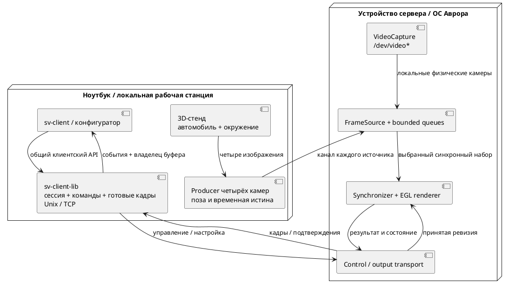

# Подробный план реализации

Единственный действующий план полного проекта. Актуальные открытые задачи находятся в корневом `TODO.md`; содержание диссертации — [[planning/THESIS]]. Тема и обязательный результат: [[research/TOPIC]]. На 09.10.2026 Linux-профиль 0.6.x содержит математическое ядро, GPU/replay, калибровочные инструменты, пять носителей/три fusion-режима, screening, Unix/TCP сервер и `sv-client-lib` с GUI/headless consumers. Протокол реально реализованных операций отделён от целевой архитектуры. `sv-simulator` имеет Qt Quick 3D driving preview, пока не подключённый как live camera producer. Depth truth v1 экспортируется, но не прошёл валидацию на аналитических сценах. Проверка этапов — [[planning/AUDIT]]. Реальные данные, multi-session/config/subscription API, UDP, target SDK и Aurora acceptance остаются открытыми. Свидетельства — [[prototype/STATUS]], [[research/PROJECTION_AND_STITCHING]], [[prototype/MEASUREMENTS]].

## Зависимости и результаты

| Этап | Зависит от | Работа | Артефакт и условие завершения |
|---|---|---|---|
| M1 — постановка и платформа | — | Согласовать тему, исследовательский вклад, срок и устройство; начать обзор; проверить SDK, Qt, GPU/API и первый кадр | Паспорт ПК/Авроры, таблица аналогов, закрытые критические вопросы ADR-001; пробное приложение на устройстве |
| M2 — данные и контракты | M1 | Координаты, четыре камеры, шаблон, запись/manifest, схема конфигурации и временная шкала | Контрольные точки проверены независимо; полная конфигурация читается; известны источник и права на данные |
| M3 — CPU-математика и калибровка | M2 | Прямая fisheye-проекция, матрицы, валидность, plane/bowl/dome-floor; первая offline-калибровка | E-MATH-01 и E-CALIB-01; отчёт обучающей/отложенной репроекции; экспорт параметров |
| M4 — одна камера на GPU | M1, M3 | EGL/FBO, текстура, проекция, виртуальная камера, асинхронное измерение GPU | GPU соответствует независимому CPU; ограниченная смена ракурса использует прежние ресурсы |
| M5 — четырёхкамерный baseline | M4 | FileFrameSource, подбор наборов, маски, нормализованный blending и replay | Plane/bowl/dome-floor доступны в коде; quality сравнение fusion/surface отдельно в E-STITCH-01 |
| M6 — контроль смещения | M3, M5 | Сервисная проверка; исследование перекрытий, порогов и неопределённости; повторная калибровка | E-DRIFT-01/E-RECOVERY-01; чувствительность, ложные тревоги, камеры-кандидаты, восстановление |
| M7 — сервер, клиентская библиотека и UI | M5 | `sv-client-lib` с общим API локального/удалённого подключения; `sv-client` через библиотеку, bounded IPC/TCP, QML, orbit/zoom/preset, calibration/health status | Один клиентский API проходит Unix/loopback/две машины; полный trace, 500 команд на паузе; измерен первый представленный кадр принятой ревизии |
| M8 — воспроизводимость и отказы | M6, M7 | Producer, skew/drops/disconnect, перегрузка, reconnect, clocks, shutdown | E-ROBUST-01; ограниченные ресурсы, различимые состояния, повтор опыта |
| M9 — целевой конвейер Авроры | Разведка M1; M5, M7 | Сборка/пакетирование, источники, GPU/server, клиент и зависимости на реальном устройстве | Полный путь работает на устройстве; собственный паспорт, формат/разрешение и timings; эмулятор недостаточен для вывода о производительности |
| M10 — основные опыты | M6, M8, M9 | Зафиксировать пороги; сравнить surface carriers и методы слияния, калибровку, дрейф, ресурсы и задержку ПК/устройства | Воспроизводимые отчёты по [[research/EXPERIMENTS]], отдельно E-SURFACE-01/E-STITCH-01; все MUST имеют свидетельства |
| M11 — текст и демонстрация | Пишется с M1; итог после M10 | Связать обзор, модели, реализацию и результаты; показать ограничения | Главы, таблица методов fusion/geometry, пакет повторного запуска и сценарий защиты |
| M12 — резерв | M11 | Замечания руководителя, повторная сборка и запуск | Финальная версия, восстановимая среда и проверенные материалы |

Проверку устройства начинать на M1, повторять после M4/M5. M9 завершает перенос; откладывать первую проверку Авроры до конца проекта нельзя. В 0.5.0 доступны OpenCV tools, native suite с 25 критериями и десятью render variants, Unix/TCP и installed client CMake package. Подробные PC baselines относятся к прежней revision; новый полный аппаратный baseline ещё нужен. Spec-профили подготовлены; результаты Linux RPM фиксируются с отдельной revision. Целевые SDK/устройство всё ещё не предоставлены, поэтому M9 открыт. Следующий путь: [[engineering/AURORA]] → [[engineering/PLATFORM_TEST]].

## M1–M2: техническая разведка

Получить CPU/GPU, RAM/VRAM, ОС/SDK, компилятор, версии Qt и API, backend EGL, список расширений и форматов. Проверить GUI и отдельный GPU-процесс. Собрать эксперимент «текстура → FBO → готовый кадр → QML» и измерить выходной readback/IPC/upload. Выписать запрещённые или недоступные зависимости и решение о графическом профиле.

Обзор вести сравнительной таблицей: входы, поверхность, калибровка, контроль смещения, бюджет ресурсов, метрики и конкретное отличие опыта. Для данных сохранить источник, условия использования, хэши, истину/калибровку и независимые наблюдения. Выделить наборы настройки и итоговой оценки до подбора порогов.

Исследование от 06.10.2026: сначала завершить чтение аналогов и выбрать малозатратные варианты слияния; обзор — [[research/PROJECTION_AND_STITCHING]]. Две оси сравнивать раздельно: (1) hard/feather/distance/graph-cut/multi-band; (2) plane/bowl/dome+floor/cylinder/cube/Burger. Сначала выбрать finalists на synthetic screen-опыте, затем подтвердить на независимой реальной 4-camera записи. Cube-map — направленное texture representation, она автоматически не заменяет поверхность дороги.

## M3–M5: корректность до оптимизации

Сначала проверить оси, инверсию позы, центральный луч, границы FOV, resize/crop и сингулярности. Затем проверить калибровку и поверхности. На GPU начать с одной камеры и прямой проекции, добавить четыре источника, masks/weights и replay. Численную ошибку GPU, ошибку сетки, калибровку и несоответствие условной поверхности реальной сцене измерять отдельно.

Первый четырёхкамерный результат должен сохранять карты покрытия, ошибки маркеров и двойные контуры. При смене только виртуальной камеры не повторять decode/upload входов и mesh rebuild. Между внутренними GPU-проходами не делать обязательный full-frame readback; стоимость выхода учитывать отдельно.

## M6–M9: диагностика и интеграция

Начать диагностику с наблюдаемого контроля по шаблону, затем исследовать перекрытия. Отделить смещение от экспозиции, движущихся объектов и skew. Порог выбрать на отдельной выборке; поддержать INDETERMINATE. Повторную калибровку проверять на прежней независимой сцене.

Интеграция должна сохранять session/sequence/calibration/frame/command IDs. Render thread не блокируется сетью, файлами или UI. Команды и видео имеют разные ограниченные очереди. Проверить политику stale, отказ каждой камеры, reconnect, release буфера, остановку и новую сессию.

На Авроре измерить тот же алгоритм с фактически поддержанным API. Данные, профиль и условия сравнения ПК/устройства сохраняются. Если профиль приходится снижать, публиковать отдельную строку; мощный ПК не определяет бюджет целевого GPU.

## M10–M12: эксперимент и текст

Порядок вариантов чередовать; прогрев и независимые повторы заданы в [[validation/ACCEPTANCE]]. Сохранять распределения, максимумы, пропуски, повторы, очереди, частоты и температуру при доступности. Гипотеза может дать отрицательный результат. После опыта не менять пороги в той же версии протокола.

Для E-STITCH-01 зафиксировать цветовую компенсацию, маски и RGB-пространство. Сначала измерить reference-quality при плотной сетке, затем ограничить triangle/memory budget и исследовать adaptive mesh. Не называть проекционную визуализацию reconstruction: скрытые направления и глубина остаются unknown.

Обзор писать во время чтения, математическую главу — вместе с CPU-моделью, архитектуру — во время реализации, результаты — сразу после опыта. Последний этап предназначен для редактуры и воспроизведения демонстрации.

## Сроки и сокращение объёма

В исходниках были ориентиры 26 недель и 12 месяцев. Они относятся к разному объёму, поэтому не используются одновременно как обещание. После M1 привязать этапы к сроку защиты, недельной нагрузке, доступу к устройству и резерву; исторический календарь: [[archive/BASELINE_PLAN]].

Если нет достоверной CPU-проекции — остановить UI/сеть до исправления. Если нет четырёхкамерного baseline — отложить сложный симулятор и CAN. Если нет наблюдаемости смещения — сузить метод до сервисной проверки и описать пределы диагностики. Если нет устройства — продолжать ПК-исследование, но не объявлять завершённым целевой этап.

Дополнительные исследовательские работы: E-MESH-01, динамическая фотометрия/шов, zero-copy и pan. Уточнение ниже выделяет live-источники, удалённое управление и 3D-стенд в следующий инженерный этап; они больше не остаются неописанной идеей «игрового мира».

## Следующий этап: источники, удалённое управление и 3D-окружение

Это требования пользователя от 05.10.2026 с частичной реализацией в 0.6.x. В таблице ниже оставлены только незавершённые действия; выполненные Unix/TCP, library, FrameSource, producer-recording, V4L2 adapter и visual preview описаны в [[prototype/STATUS]] и [[engineering/SOURCES]]. Физический capture, two-host acceptance, live producer из driving preview и UDP остаются открытыми. Рабочие команды: [[engineering/USAGE]].

| Порядок | Решение и граница | Что проверить |
|---|---|---|
| 1. Физический источник | Проверить существующий OpenCV/V4L2 `FrameSource` на `/dev/video*` | Negotiated format/resolution, sensor timestamp, unplug/reconnect, timeout и ограниченное завершение для целевого драйвера |
| 2. Двухмашинная работа | Проверить текущие TCP client/data endpoints между ноутбуком и целевым устройством | Часы/skew, полоса, потери, reconnect, slow client isolation, длительные RSS/thermal; localhost не считается приемкой |
| 3. Общее удалённое управление | Реализовать typed ConfigService и client API поверх текущего SV01 | Revision-aware validate/update/status/apply, persistence errors, operation IDs, pending restart, TLS/access policy по необходимости |
| 4. Управляемый 3D producer | Подключить visual driving preview к четырём camera producers | Синхронные перспективные кадры с реальных virtual camera poses, known timestamps/pose/depth/visibility truth, pause/reset/replay |
| 5. Исследование оболочки/fusion | Сравнить реализованные dome-floor/bowl/cylinder/cube/plane и существующие hard/feather режимы | Depth/semantic truth, seam/ghosting/temporal metrics, graph-cut/multi-band, equal triangle/memory budget, честное coverage/fallback |
| 6. Aurora acceptance | Проверить SDK dependencies, CPU/GPU RPM, Qt application lifecycle и native suite на target | Target ABI/validator/install/launch, camera/display/GPU support, timings и сопоставимый platform report |

Текущие SV01 operations и gaps перечислены в [[engineering/PROTOCOL_IMPLEMENTED]]; target config/subscription/process flows — в [[architecture/CLIENT_SERVER_MODEL]]. Не переносить completed Unix/TCP/library/client migration в TODO повторно. Все оставшиеся действия собраны в корневом [[../TODO]].

Предварительная схема взаимодействия следующего этапа:

*Рисунок П.1 — Целевая схема взаимодействия. `sv-client-lib` отделяет клиентский API от Unix/TCP; выбор аппаратных или виртуальных входов задаётся серверной конфигурацией. Библиотека и replay/socket FrameSource реализованы; V4L2 адаптер не проверен с физической камерой. Qt Quick 3D driving preview реализован отдельно, но пока не является camera producer.*

Unix/TCP поля `connections` и пример портов описаны в [[engineering/CLIENT_LIBRARY]]; UDP-профиль ещё предстоит закрепить в [[requirements/PROTOCOL]] и [[requirements/CONFIGURATION]]; текущие Unix socket paths не являются TCP endpoints. Для управления через сеть предусмотреть явную настройку доступа; локальный режим по умолчанию привязывается к loopback. Не использовать время получения пакета как время экспозиции: при разных машинах сохранить clock domain и измеренный способ сопоставления часов.

Замкнутая геометрия сама по себе не создаёт отсутствующие наблюдения. Версия 0.3.0 закрывает незаполненные области купола sky gradient, пола — покрытием; каждое такое место непрозрачно, но не является текстурой камеры. Для будущего 3D-источника сохранить видимую coverage отдельно от fallback-масок и проверить влияние на метрическую ошибку. Геометрический baseline bowl 0.2.0 сохранён отдельно.

### Материалы для 3D-стенда

Процедурная Blender-сцена содержит улицу, упрощённый автомобиль, четыре разнесённых оптических центра и scripted motion; offline export проверен через replay/IPC. В laptop GUI также есть отдельный процедурный визуальный мир с машиной и keyboard steering/follow camera. Это не физическая CAD-модель, не Blender simulation и пока не источник четырёх кадров для сервера. Полноценные vehicle dynamics/asset fidelity и связанный live producer остаются открытыми.

Blender MCP подключён и проверен (5.2.2 LTS / protocol 13). Скрипты, параметры мира и исходный `.blend` хранятся в обычном Git; входные серии остаются в `artifacts/`, Git LFS не используется. Каталог ассетов: [[engineering/ASSETS]]. Blender float-Z → radial-range depth truth v1 добавлена и smoke-проверена; повторение и границы: [[engineering/BLENDER]], [[validation/DEPTH_VISIBILITY_TRUTH]]. Далее: проверка глубины на аналитических сценах, object-ID/semantic visibility, независимые validation scenes и подключение driving preview как realtime producer.

GTest разрешён для новых проверок. При его выборе использовать установленный `GTest` CMake package и явный `BuildRequires` целевого SDK; правило offline dependencies из [[engineering/BUILD]] сохраняется.

## Текущий исследовательский backlog

Подробные незакрытые пункты, сгруппированные по приоритету, собраны только в [[../TODO]]. Подтверждённые результаты, чтобы не превращать их в повторные задачи: аналитический carrier reference — [[validation/ANALYTIC_REFERENCE]], Blender depth truth smoke — [[validation/DEPTH_VISIBILITY_TRUTH]], E-CAL-MOUNT-01 — [[validation/MOUNT_CALIBRATION]], image-derived synthetic calibration — [[validation/IMAGE_CALIBRATION]], producer recovery — [[validation/PRODUCER_RECOVERY]]. Эти отчёты являются свидетельствами; их повторное выполнение не требуется, кроме расширений и независимых подтверждений, перечисленных в TODO.

Серверный calibration-job workflow (held-out gate, session ownership/cancel, stale revision rejection и revision-checked atomic apply) описан в [[engineering/PROTOCOL_IMPLEMENTED]]. Он не равен общему ConfigService. Целевая схема multi-session/subscriptions/products дана в [[architecture/CLIENT_SERVER_MODEL]] и ещё не реализована.

После завершения основных quality/platform опытов обновить выводы и выполнить общую редактуру глав [[diploma/README]]. Отчёт аудита текущих расхождений: [[planning/AUDIT]].
