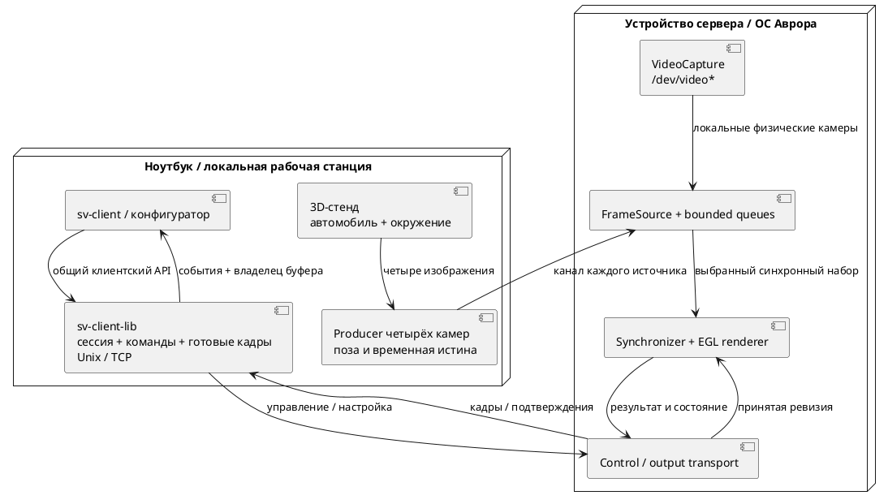

# Подробный план реализации

Единственный действующий план полного проекта. Актуальные открытые задачи находятся в корневом `TODO.md`; содержание диссертации — [[planning/THESIS]]. Тема и обязательный результат: [[research/TOPIC]]. На 09.10.2026 Linux runtime 0.6.x содержит математическое ядро, GPU/replay, калибровочные инструменты, пять носителей/три fusion-режима, Unix/TCP сервер и `sv-client-lib` с GUI/headless consumers. Offline study содержит 6 carriers × 7 fusion variants на одном статическом Blender capture. После аудита бинарные pairwise s-t cuts и output-based seam/ghost proxies добавлены с known-answer tests; 84-case matrix пересчитана от проверяемого fixture и опубликована в [[validation/E_STITCH_01_V2]]. Это всё ещё exploratory screening: одна сцена, исторический статический fixture без независимой object-ID/edge truth и holdout; новые paired/object-ID screens описаны ниже; для overlap зон трёх/четырёх камер используется fallback, не global four-label optimization. Исторический sine-shift temporal test заменён парным Blender capture с pose/calibration validation и residual change; это ещё не чистая flicker/ghost-trail метрика. Аналитический Scene Truth RGB не совпадает с Blender улицей; новый direct Blender truth согласован с камерными входами. Исторический «real-data» прогон помечен synthetic jitter; новая серия [[validation/RASTER_CALIBRATION]] реально выполняет production OpenCV detector/solver на растровых синтетических изображениях. Детали — [[planning/AUDIT]] и [[../TODO]]. `sv-simulator` имеет Qt Quick 3D driving preview, пока не подключённый как live camera producer. Depth truth прошёл smoke export, аналитическую проверку на плоскостях, 3D-примитивах (сфера, куб) и силуэтных ступенях глубины; реализованы семантическая разметка и маркеры. Depth-visibility screening выполнен на одной синтетической записи; ни 30-case, ни 84-case output не является независимым подтверждением качества. Реальные данные, multi-session/config/subscription API, UDP, target SDK и Aurora acceptance остаются открытыми. Свидетельства — [[prototype/STATUS]], [[research/PROJECTION_AND_STITCHING]], [[validation/DEPTH_VISIBILITY_TRUTH]], [[validation/STITCH_VISIBILITY]], [[validation/E_STITCH_01_V2]], [[prototype/MEASUREMENTS]].

## Зависимости и результаты

| Этап | Зависит от | Работа | Артефакт и условие завершения |
|---|---|---|---|
| M1 — постановка и платформа | — | Согласовать тему, исследовательский вклад, срок и устройство; начать обзор; проверить SDK, Qt, GPU/API и первый кадр | Паспорт ПК/Авроры, таблица аналогов, закрытые критические вопросы ADR-001; пробное приложение на устройстве |
| M2 — данные и контракты | M1 | Координаты, четыре камеры, шаблон, запись/manifest, схема конфигурации и временная шкала | Контрольные точки проверены независимо; полная конфигурация читается; известны источник и права на данные |
| M3 — CPU-математика и калибровка | M2 | Прямая fisheye-проекция, матрицы, валидность, plane/bowl/dome-floor; первая offline-калибровка | E-MATH-01 и E-CALIB-01; отчёт обучающей/отложенной репроекции; экспорт параметров |
| M4 — одна камера на GPU | M1, M3 | EGL/FBO, текстура, проекция, виртуальная камера, асинхронное измерение GPU | GPU соответствует независимому CPU; ограниченная смена ракурса использует прежние ресурсы |
| M5 — четырёхкамерный baseline | M4 | FileFrameSource, подбор наборов, маски, нормализованный blending и replay | Plane/bowl/dome-floor доступны в runtime; исправленная offline E-STITCH-01 matrix и парный 3-frame Blender fixture существуют; quality confirmation на holdout scenes и object-correspondence ghost truth остаётся открытой |
| M6 — контроль смещения | M3, M5 | Сервисная проверка; исследование перекрытий, порогов и неопределённости; повторная калибровка | E-DRIFT-01/E-RECOVERY-01; чувствительность, ложные тревоги, камеры-кандидаты, восстановление |
| M7 — сервер, клиентская библиотека и UI | M5 | `sv-client-lib` с общим API локального/удалённого подключения; `sv-client` через библиотеку, bounded IPC/TCP, QML, orbit/zoom/preset, calibration/health status | Один клиентский API проходит Unix/loopback/две машины; полный trace, 500 команд на паузе; измерен первый представленный кадр принятой ревизии |
| M8 — воспроизводимость и отказы | M6, M7 | Producer, skew/drops/disconnect, перегрузка, reconnect, clocks, shutdown | E-ROBUST-01; ограниченные ресурсы, различимые состояния, повтор опыта |
| M9 — целевой конвейер Авроры | Разведка M1; M5, M7 | Сборка/пакетирование, источники, GPU/server, клиент и зависимости на реальном устройстве | Полный путь работает на устройстве; собственный паспорт, формат/разрешение и timings; эмулятор недостаточен для вывода о производительности |
| M10 — основные опыты | M6, M8, M9 | Подтверждающие E-SURFACE-01/E-STITCH-01 серии: image-based seam/ghosting/temporal metrics, равные mesh/resource budgets, calibration/drift и задержка на ПК/целевом устройстве | Воспроизводимые отчёты по [[research/EXPERIMENTS]]; E-STITCH-01 protocol и single-frame depth-visibility screening закрыты, quality confirmation и MUST evidence остаются открыты |
| M11 — текст и демонстрация | Пишется с M1; итог после M10 | Связать обзор, модели, реализацию и результаты; показать ограничения | Главы, таблица методов fusion/geometry, пакет повторного запуска и сценарий защиты |
| M12 — резерв | M11 | Замечания руководителя, повторная сборка и запуск | Финальная версия, восстановимая среда и проверенные материалы |

Проверку устройства начинать на M1, повторять после M4/M5. M9 завершает перенос; откладывать первую проверку Авроры до конца проекта нельзя. В 0.5.0 доступны OpenCV tools, native suite с 25 критериями и десятью render variants, Unix/TCP и installed client CMake package. Подробные PC baselines относятся к прежней revision; новый полный аппаратный baseline ещё нужен. Spec-профили подготовлены; результаты Linux RPM фиксируются с отдельной revision. Целевые SDK/устройство всё ещё не предоставлены, поэтому M9 открыт. Следующий путь: [[engineering/AURORA]] → [[engineering/PLATFORM_TEST]].

## M1–M2: техническая разведка

Получить CPU/GPU, RAM/VRAM, ОС/SDK, компилятор, версии Qt и API, backend EGL, список расширений и форматов. Проверить GUI и отдельный GPU-процесс. Собрать эксперимент «текстура → FBO → готовый кадр → QML» и измерить выходной readback/IPC/upload. Выписать запрещённые или недоступные зависимости и решение о графическом профиле.

Обзор вести сравнительной таблицей: входы, поверхность, калибровка, контроль смещения, бюджет ресурсов, метрики и конкретное отличие опыта. Для данных сохранить источник, условия использования, хэши, истину/калибровку и независимые наблюдения. Выделить наборы настройки и итоговой оценки до подбора порогов.

Исследовательский вопрос и primary-source review завершены 09.10.2026; quality confirmation остаётся открытым. Две оси сравнивать раздельно: (1) hard/feather/distance/binary graph-cut/multi-band; (2) plane/bowl/dome+floor/cylinder/cube/parameterized burger-like. Имеются аналитические depth checks, один Blender capture, initial 30-case screen и пересчитанная 84-case exploratory matrix. Следом нужны независимые сцены, exact image/object truth, динамические clips, повторяемые pose seeds и равные mesh/memory budgets. Cube-map — направленное texture representation, она автоматически не заменяет поверхность дороги.

## M3–M5: корректность до оптимизации

Сначала проверить оси, инверсию позы, центральный луч, границы FOV, resize/crop и сингулярности. Затем проверить калибровку и поверхности. На GPU начать с одной камеры и прямой проекции, добавить четыре источника, masks/weights и replay. Численную ошибку GPU, ошибку сетки, калибровку и несоответствие условной поверхности реальной сцене измерять отдельно.

Первый четырёхкамерный результат должен сохранять карты покрытия, ошибки маркеров и двойные контуры. При смене только виртуальной камеры не повторять decode/upload входов и mesh rebuild. Между внутренними GPU-проходами не делать обязательный full-frame readback; стоимость выхода учитывать отдельно.

## M6–M9: диагностика и интеграция

Начать диагностику с наблюдаемого контроля по шаблону, затем исследовать перекрытия. Отделить смещение от экспозиции, движущихся объектов и skew. Порог выбрать на отдельной выборке; поддержать INDETERMINATE. Повторную калибровку проверять на прежней независимой сцене.

Интеграция должна сохранять session/sequence/calibration/frame/command IDs. Render thread не блокируется сетью, файлами или UI. Команды и видео имеют разные ограниченные очереди. Проверить политику stale, отказ каждой камеры, reconnect, release буфера, остановку и новую сессию.

На Авроре измерить тот же алгоритм с фактически поддержанным API. Данные, профиль и условия сравнения ПК/устройства сохраняются. Если профиль приходится снижать, публиковать отдельную строку; мощный ПК не определяет бюджет целевого GPU.

## M10–M12: эксперимент и текст

Порядок вариантов чередовать; прогрев и независимые повторы заданы в [[validation/ACCEPTANCE]]. Сохранять распределения, максимумы, пропуски, повторы, очереди, частоты и температуру при доступности. Гипотеза может дать отрицательный результат. После опыта не менять пороги в той же версии протокола.

Для E-STITCH-01 в [[research/PROJECTION_AND_STITCHING]] зафиксированы photometric policy, masks, RGB space, сцены, критерии и бюджеты. Python path содержит pairwise binary s-t cut, Laplacian-pyramid blend, output-based seam step и source-disagreement ghost proxy; known-answer fixtures проходят, 84-case matrix пересчитана от checked-in inputs. Проверить метрики по independent object/edge truth и разобраться с высоким одно-кадровым seam proxy/CPU cost graph-cut, затем добавить holdout scenes/clips и равные triangle/memory budgets; после этого исследовать adaptive mesh. Не называть проекционную визуализацию reconstruction: скрытые направления и глубина остаются unknown.

Обзор писать во время чтения, математическую главу — вместе с CPU-моделью, архитектуру — во время реализации, результаты — сразу после опыта. Последний этап предназначен для редактуры и воспроизведения демонстрации.

## Сроки и сокращение объёма

В исходниках были ориентиры 26 недель и 12 месяцев. Они относятся к разному объёму, поэтому не используются одновременно как обещание. После M1 привязать этапы к сроку защиты, недельной нагрузке, доступу к устройству и резерву; исторический календарь: [[archive/BASELINE_PLAN]].

Если нет достоверной CPU-проекции — остановить UI/сеть до исправления. Если нет четырёхкамерного baseline — отложить сложный симулятор и CAN. Если нет наблюдаемости смещения — сузить метод до сервисной проверки и описать пределы диагностики. Если нет устройства — продолжать ПК-исследование, но не объявлять завершённым целевой этап.

Дополнительные исследовательские работы: E-MESH-01, динамическая фотометрия/шов, zero-copy и pan. Уточнение ниже выделяет live-источники, удалённое управление и 3D-стенд в следующий инженерный этап; они больше не остаются неописанной идеей «игрового мира».

## Следующий этап: источники, удалённое управление и 3D-окружение

Это требования пользователя от 05.10.2026 с частичной реализацией в 0.6.x. В таблице ниже оставлены только незавершённые действия; выполненные Unix/TCP, library, FrameSource, producer-recording, V4L2 adapter и visual preview описаны в [[prototype/STATUS]] и [[engineering/SOURCES]]. Физический capture, two-host acceptance, live producer из driving preview и UDP остаются открытыми. Рабочие команды: [[engineering/USAGE]].

| Порядок | Решение и граница | Что проверить |
|---|---|---|
| 1. Физический источник | Проверить существующий OpenCV/V4L2 `FrameSource` на `/dev/video*` | Negotiated format/resolution, sensor timestamp, unplug/reconnect, timeout и ограниченное завершение для целевого драйвера |
| 2. Двухмашинная работа | Проверить текущие TCP client/data endpoints между ноутбуком и целевым устройством | Часы/skew, полоса, потери, reconnect, slow client isolation, длительные RSS/thermal; localhost не считается приемкой |
| 3. Общее удалённое управление | Реализовать typed ConfigService и client API поверх текущего SV01 | Revision-aware validate/update/status/apply, persistence errors, operation IDs, pending restart, TLS/access policy по необходимости |
| 4. Управляемый 3D producer | Подключить visual driving preview к четырём camera producers | Синхронные перспективные кадры с реальных virtual camera poses, known timestamps/pose/depth/visibility truth, pause/reset/replay |
| 5. Исследование оболочки/fusion | Проверить offline-реализации carrier/fusion и пересчитать E-STITCH-01 | Исправленные seam/ghost truth metrics, настоящий graph-cut либо честное имя эвристики, динамические последовательности с движущим rig, holdout scenes и равные triangle/memory budgets |
| 6. Aurora acceptance | Проверить SDK dependencies, CPU/GPU RPM, Qt application lifecycle и native suite на target | Target ABI/validator/install/launch, camera/display/GPU support, timings и сопоставимый platform report |

Текущие SV01 operations и gaps перечислены в [[engineering/PROTOCOL_IMPLEMENTED]]; target config/subscription/process flows — в [[architecture/CLIENT_SERVER_MODEL]]. Не переносить completed Unix/TCP/library/client migration в TODO повторно. Все оставшиеся действия собраны в корневом [[../TODO]].

Предварительная схема взаимодействия следующего этапа:

*Рисунок П.1 — Целевая схема взаимодействия. `sv-client-lib` отделяет клиентский API от Unix/TCP; выбор аппаратных или виртуальных входов задаётся серверной конфигурацией. Библиотека и replay/socket FrameSource реализованы; V4L2 адаптер не проверен с физической камерой. Qt Quick 3D driving preview реализован отдельно, но пока не является camera producer.*

Unix/TCP поля `connections` и пример портов описаны в [[engineering/CLIENT_LIBRARY]]; UDP-профиль ещё предстоит закрепить в [[requirements/PROTOCOL]] и [[requirements/CONFIGURATION]]; текущие Unix socket paths не являются TCP endpoints. Для управления через сеть предусмотреть явную настройку доступа; локальный режим по умолчанию привязывается к loopback. Не использовать время получения пакета как время экспозиции: при разных машинах сохранить clock domain и измеренный способ сопоставления часов.

Замкнутая геометрия сама по себе не создаёт отсутствующие наблюдения. Версия 0.3.0 закрывает незаполненные области купола sky gradient, пола — покрытием; каждое такое место непрозрачно, но не является текстурой камеры. Для будущего 3D-источника сохранить видимую coverage отдельно от fallback-масок и проверить влияние на метрическую ошибку. Геометрический baseline bowl 0.2.0 сохранён отдельно.

### Материалы для 3D-стенда

Процедурная Blender-сцена содержит улицу, упрощённый автомобиль, четыре разнесённых оптических центра и scripted motion; offline export проверен через replay/IPC. В laptop GUI также есть отдельный процедурный визуальный мир с машиной и keyboard steering/follow camera. Это не физическая CAD-модель, не Blender simulation и пока не источник четырёх кадров для сервера. Полноценные vehicle dynamics/asset fidelity и связанный live producer остаются открытыми.

Blender MCP подключён и проверен (5.2.2 LTS / protocol 13). Скрипты, параметры мира и исходный `.blend` хранятся в обычном Git; входные серии остаются в `artifacts/`, Git LFS не используется. Каталог ассетов: [[engineering/ASSETS]]. Blender float-Z → radial-range depth truth прошла smoke export, аналитическую front/tilted-plane validation, 3D sphere/cube и silhouette tests; зафиксированы discrete semantics и ground/raised markers; выполнен depth-visibility screen. Далее: исправить метрики/graph-cut-вариант E-STITCH-01, провести корректную image/temporal проверку на holdout сценах и подключить driving preview как realtime producer.

GTest разрешён для новых проверок. При его выборе использовать установленный `GTest` CMake package и явный `BuildRequires` целевого SDK; правило offline dependencies из [[engineering/BUILD]] сохраняется.

## Текущий исследовательский backlog

Подробные незакрытые пункты, сгруппированные по приоритету, собраны только в [[../TODO]]. Подтверждённые результаты: analytic carrier reference — [[validation/ANALYTIC_REFERENCE]], depth conversion/visibility — [[validation/DEPTH_VISIBILITY_TRUTH]], [[validation/STITCH_VISIBILITY]], E-CAL-MOUNT-01 — [[validation/MOUNT_CALIBRATION]], image-derived synthetic calibration — [[validation/IMAGE_CALIBRATION]], producer recovery — [[validation/PRODUCER_RECOVERY]]. Повтор этих узких опытов не требуется; TODO перечисляет только расширения и независимые подтверждения.

Серверный calibration-job workflow (held-out gate, session ownership/cancel, stale revision rejection и revision-checked atomic apply) описан в [[engineering/PROTOCOL_IMPLEMENTED]]. Он не равен общему ConfigService. Целевая схема multi-session/subscriptions/products дана в [[architecture/CLIENT_SERVER_MODEL]] и ещё не реализована.

После завершения основных quality/platform опытов обновить выводы и выполнить общую редактуру глав [[diploma/README]]. Отчёт аудита текущих расхождений: [[planning/AUDIT]].

## Парная Blender-проверка 10.10.2026

[[validation/PAIRED_STITCH_TEMPORAL]]: новый multi-frame fixture содержит фактическое движение rig, matched direct RGB и ray-cast object IDs. Старый sine-shift temporal test заменён; измеряются residual change, реальные границы argmax-weight labels и independent RGB extra edges, undefined ROI/seams возвращают null. Это smoke методики на одном 3-frame clip (5 Hz sampling), не завершение M10. Следующая серия: ≥256px cube faces, независимые scene/mount seeds, длинные клипы/повороты, динамические объекты, экспозиция, matching visibility и object-correspondence ghost trails; только затем повторяемые бюджеты/тайминги и выводы диплома.

## Контроль разрешения и source visibility, 10.10.2026

[[validation/STITCH_RESOLUTION_VISIBILITY]]: при совпадающих decoded direct RGB и object/visibility truth выполнено сравнение 64/256 cube faces и ignore/any-camera ROI, по семи fusion-вариантам. Исправлена ложная окклюзия от hide-render mesh-моделей камер; Blender regression проходит. Это закрывает начальный sampling/visibility smoke, но не M10: нужны 256→512 convergence, независимые scene/mount seeds и длинные клипы, photometric/dynamic trials, object-correspondence ghost trails, equal budgets/repeated timing.

## Критерии готовности исследовательского заключения

Состояние 10.10.2026: [[validation/STITCH_CONVERGENCE_ROBUSTNESS]]. Convergence 256→512 выполнен на одном ракурсе; три seed-варианта близких препятствий и static/jumping exposure stress измерены. Это exploratory evidence, не финальная подтверждающая выборка. Для итогового заключения нужны следующие этапы в указанном порядке.

| Этап | Текущий статус | Что нужно получить до вывода |
|---|---|---|
| 1. Проверяемые метрики и честные методы | RGB/object/visibility truth и source-camera IDs есть; coded-target RGB controls/84 cases: [[validation/OBJECT_STITCH]]; natural-object ghost truth нет | Расширить coded-target диагностику до natural-object correspondences и ghost trails; соединённые копии не выявляются счётчиком компонент; seam metric отделяет реальные scene edges. Проверить binary-cut energy/fallback; зафиксировать preprocessing/body/visibility masks одинаково для методов |
| 2. Разные сцены и установки камер | Три варианта одной улицы, true nominal rig | Сцены с разметкой, близкими столбами, стенами, машинами и недостатком текстуры; отдельные scene seeds и mount seeds, погрешности yaw/pitch/along-body. Nominal, true и estimated calibration сравниваются на общих held-out данных |
| 3. Реальная калибровочная цепочка | Production OpenCV image detector/solver: 96 raster images, order=2/4; [[validation/RASTER_CALIBRATION]]; одна equidistant family | Расширить уже выполненную image-based цепочку на несколько семейств оптики и независимую метрическую geometry/outer-angle validation. Reprojection и физическая/стыковочная ошибка, ложные accept/reject и диагностируемые отказы; thresholds выбираются по требованиям и отдельным данным |
| 4. Временная и фотометрическая устойчивость | 3-frame straight clips и digital EV stress; компенсации нет | Согласованная шкала времени Blender/trajectory, длинные повороты и движущиеся объекты/окклюзии, exposure/noise perturbations и отдельная ablation compensation. Ghost trails и residual отделены от реального движения; единица повторения — клип |
| 5. Carrier/fusion при равных ресурсах | 6 carriers/7 offline modes; true visibility/sampling и coded-object screen (общий центральный пол) | Зафиксировать carrier parameter ranges, camera views, triangle/texture/memory budgets и общие inputs/masks. Отделить carrier effects, fusion effects и CPU/GPU implementation. Качество анализируется по типу сцены/ROI, а не одним pooled score |
| 6. Производительность и воспроизводимость | Host platform tools; coded-object CPU render: 2 warmup/7 repeats, p50/p95; фиксированный порядок, не server/GPU | Прогрев, повторения/чередование порядка, p50/p95/p99 stage latencies, drops/age, CPU/GPU/memory и температурный режим; совпадающие quality/output profiles. Все raw reports и hashes доступны; повторы одного детерминированного изображения не выдаются за новую сцену |
| 7. Подтверждающая выборка и формулировка вывода | Текущие seeds просмотрены и являются exploratory | До финальной серии заморозить implementations/params, hypotheses, metrics, split и критерии. Новые сцены/клипы и отдельные calibration validation observations; paired differences и разброс между scene/clip units, ограничения и отрицательные результаты. Если данных мало — ограничить область вывода |
| 8. Реальные камеры и Аврора | Физический стенд отсутствует | Записи с измеренными targets и реальные `/dev/video*`; версия ОС/SDK/драйверов и целевой экран; RPM install/launch, качество и latency тем же протоколом. Без стенда возможен только вывод о Linux/синтетическом prototype, не о подтверждённой работоспособности/скорости на Авроре |

Программно доступны этапы 1–7 и подготовка протокола/пакетов этапа 8. Реальные данные, устройство и параметры SDK/драйверов нужны извне. Подготовка итогового текста не должна заменять недостающий эксперимент. «Лучший метод» допустим только относительно объявленного набора методов, условий, метрик и ресурсного бюджета; универсальное превосходство не заявляется.
