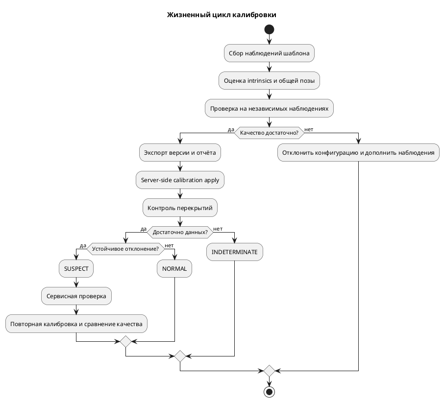

# Первоначальная калибровка и контроль смещения

Методика и незакрытые части R2/R4. Синтетические известные-XYZ, image-derived, mount-error/board-survey опыты и серверный calibration-job workflow уже существуют: [[research/IMAGE_CALIBRATION]], [[research/MOUNT_CALIBRATION]], [[validation/BOARD_SURVEY_SENSITIVITY]], [[engineering/PROTOCOL_IMPLEMENTED]]. Это не полный обзор семейств и не физическая приёмка. Порог сервера 3 px RMSE / 8 px maximum пока предварительный. Требования: [[requirements/CONFIGURATOR]]; математика: [[architecture/MATHEMATICS]]; план опытов: [[research/EXPERIMENTS]].

## Первоначальная калибровка

1. Выбрать шаблон и сохранить его размеры, единицы, систему координат и точность изготовления. Для четырёх камер нужны наблюдения, связывающие их с общей системой автомобиля; четыре независимых набора intrinsic-параметров не определяют взаимную позу камер.
2. Собрать разные положения шаблона, достаточное покрытие изображения и условия экспозиции. Записать источник, разрешение, timestamps, маски и качество обнаруженных точек.
3. Оценить intrinsics каждой камеры выбранной fisheye-моделью. Проверить стабильность при изменении набора кадров и остаточную ошибку по каждому виду.
4. Оценить `T_camera_from_vehicle` по известным точкам и/или совместным наблюдениям; зафиксировать одну систему координат и масштаб. Совместное уточнение включать только при достаточной связности наблюдений.
5. Проверить результат на отложенных точках и видах. Сохранить распределение репроекции, ошибки положения/ориентации при известной синтетической истине, coverage и примеры неудачных кадров.
6. Экспортировать конфигурацию с `calibration_id`, хэшем, моделью, разрешением, наблюдениями и отчётом. Несогласованные или вырожденные результаты не становятся рабочей конфигурацией.

CPU-реализация и OpenCV проверяются независимыми аналитическими точками; не использовать один и тот же ошибочный генератор как единственное подтверждение.

## Диагностика нарушения

Начать с сервисного контроля по шаблону, затем исследовать признаки в перекрывающихся изображениях. Метод не обязан автоматически восстанавливать extrinsics во время движения.

Для перекрытий выбирать валидные области с достаточной текстурой, небольшим skew и приемлемой экспозицией. Сопоставлять признаки либо измерять согласованность геометрии по выбранной модели; робастно исключать движущиеся объекты и вырожденные соответствия. Яркостное расхождение само по себе не доказывает сдвиг камеры.

Состояния диагностики отделены от доступности видеовходов:

| Состояние | Смысл |
|---|---|
| `NORMAL` | Проверка в допустимых условиях не выявила отклонения |
| `SUSPECT` | Устойчивое отклонение требует дополнительной проверки |
| `RECALIBRATION_REQUIRED` | Сервисная проверка подтвердила необходимость повторной калибровки |
| `INDETERMINATE` | Недостаточно наблюдений, текстуры, временной согласованности или геометрической наблюдаемости |

Порог и число подтверждающих наблюдений выбрать на отдельной выборке до итоговых испытаний. Для локализации камеры анализировать несколько её перекрытий; если виновника нельзя однозначно установить, возвращать набор кандидатов и причину неопределённости.

## Повторная калибровка

Сохранить прежнюю конфигурацию и отчёт; повторить сбор наблюдений, оценивание и независимую проверку. Offline-кандидат пользователь может проверить до отправки; серверный workflow уже принимает training и held-out observations, выполняет quality gate и применяет одобренную позу через revision-checked atomic config/renderer update. Это не общий ConfigService и не приёмка на физической камере. Невалидная/устаревшая версия отклоняется; фактический `calibration_id` передаётся в кадрах.

Схема — полный целевой сервисный сценарий; в текущем коде реализованы сбор training/held-out observations через calibration job, gate, ownership/cancel и атомарное server-side применение candidate. Автоматическая диагностика сдвига по межкамерным перекрытиям и состояния `NORMAL/SUSPECT` остаются проектом, а не работающей feature.

## Проверки

- E-CALIB-01: известные параметры, различное число/расположение шаблонов, шум и часть ошибочных наблюдений; ошибки intrinsics, extrinsics и отложенной репроекции.
- E-DRIFT-01: смещение каждой камеры ±1°/±2° и 2/5 см; эти числа — контролируемые воздействия. Отдельно отрицательные сценарии освещения, движения, слабой текстуры и skew.
- Показатели диагностики: чувствительность, ложные тревоги, precision/recall, матрица ошибок, время обнаружения, доля `INDETERMINATE`; минимально обнаруживаемое смещение указывается только для проверенных условий.
- E-RECOVERY-01: показатели до смещения, после смещения и после повторной калибровки на одной независимой проверочной сцене.

Источники: [[references/VISION|OpenCV, Zhang, Kannala–Brandt, TI и исследования extrinsic-калибровки]].
