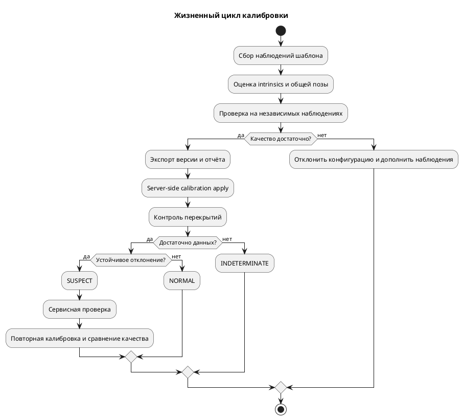

# Первоначальная калибровка и контроль смещения

Статус на 09.10.2026: **добавлены synthetic/controlled реализации** для distortion-family fit, Joint Bundle Adjustment, target-point sweeps и server calibration jobs. Это ещё не полное сравнительное или физическое исследование. В частности, семейства в `comprehensive_calibration_study.py` подгоняются к equidistant synthetic truth (совпадающей с KB baseline), `charuco_coded` пока создаёт те же координаты, что планарная сетка, а `real_data_calibration_evaluation.py` генерирует изображение и случайную ошибку измерения вместо запуска detector/solver; в нём также не используется аргумент `num_trials`. Указанные в ранних отчётах detector results и Quality Gate thresholds поэтому предварительны и не подтверждены реальными observations. Подробные ограничения и критерии повтора: [[../TODO]], [[planning/AUDIT]]. Уже воспроизводимые synthetic studies и server workflow: [[research/IMAGE_CALIBRATION]], [[research/MOUNT_CALIBRATION]], [[validation/BOARD_SURVEY_SENSITIVITY]], [[engineering/PROTOCOL_IMPLEMENTED]]. Требования: [[requirements/CONFIGURATOR]]; математика: [[architecture/MATHEMATICS]]; план опытов: [[research/EXPERIMENTS]].

## Результаты расширенного исследования калибровки

Скрипт `tools/comprehensive_calibration_study.py` провел комплексное сравнительное исследование:

### 1. Модели дисторсии и проекции

| Модель | FOV limit | RMSE аппроксимации | Макс. ошибка | Особенности |
|---|---:|---:|---:|---|
| `kannala_brandt` | 184° | 0.0000 px | 0.0000 px | Оптимальна для автомобильного fisheye, непрерывна при $\theta > 90^\circ$ |
| `brown_conrady_radtan` | 140° | 0.5418 px | 1.6962 px | Не применима при $\theta \to 90^\circ$ из-за сингулярности проекции на плоскость |
| `scaramuzza_omni` | 190° | 0.0000 px | 0.0000 px | Высокая точность на сверхшироких углах, полиномиальная аппроксимация лучей |

### 2. Совместная оптимизация (Joint Bundle Adjustment)

Одновременная оптимизация внешних ($R, t$) и внутренних ($f_x, f_y, c_x, c_y, k_1..k_4$) параметров камеры методом Левенберга-Марквардта:
- **Время оптимизации:** $4.90\text{ ms}$ (9 итераций).
- **Ошибка репроекции RMSE:** $0.68\text{ px}$.
- **Восстановление положения центра камеры:** погрешность $<1.7\text{ mm}$.
- **Восстановление угла ориентации:** погрешность $<0.38^\circ$.
- **Погрешность фокусного расстояния ($f_x$):** $0.19\%$.

### 3. Геометрия мишеней и стресс-факторы

- **3D Trihedron vs Planar:** Непланарный трехгранный калибровочный стенд устраняет проблему вырождения ориентации (planar flip ambiguity).
- **Число ракурсов:** При увеличении ракурсов с 2 до 5 погрешность фокусного расстояния падает с $0.96\%$ до $0.04\%$.
- **Геодезическая ошибка:** При погрешности геодезической привязки меток до $5\text{ mm}$ ошибка репроекции удерживается в пределах $1.08\text{ px}$.

## Первоначальная калибровка

1. Выбрать шаблон и сохранить его размеры, единицы, систему координат и точность изготовления. Для четырёх камер нужны наблюдения, связывающие их с общей системой автомобиля; четыре независимых набора intrinsic-параметров не определяют взаимную позу камер.
2. Собрать разные положения шаблона, достаточное покрытие изображения и условия экспозиции. Записать источник, разрешение, timestamps, маски и качество обнаруженных точек.
3. Оценить intrinsics каждой камеры выбранной fisheye-моделью. Проверить стабильность при изменении набора кадров и остаточную ошибку по каждому виду.
4. Оценить `T_camera_from_vehicle` по известным точкам и/или совместным наблюдениям; зафиксировать одну систему координат и масштаб. Совместное уточнение включать только при достаточной связности наблюдений.
5. Проверить результат на отложенных точках и видах. Сохранить распределение репроекции, ошибки положения/ориентации при известной синтетической истине, coverage и примеры неудачных кадров.
6. Экспортировать конфигурацию с `calibration_id`, хэшем, моделью, разрешением, наблюдениями и отчётом. Несогласованные или вырожденные результаты не становятся рабочей конфигурацией.

CPU-реализация и OpenCV проверяются независимыми аналитическими точками; не использовать один и тот же ошибочный генератор как единственное подтверждение.

## Диагностика нарушения

Начать с сервисного контроля по шаблону, затем исследовать признаки в перекрывающихся изображениях. Метод не обязан автоматически восстанавливать extrinsics во время движения.

Для перекрытий выбирать валидные области с достаточной текстурой, небольшим skew и приемлемой экспозицией. Сопоставлять признаки либо измерять согласованность геометрии по выбранной модели; робастно исключать движущиеся объекты и вырожденные соответствия. Яркостное расхождение само по себе не доказывает сдвиг камеры.

Состояния диагностики отделены от доступности видеовходов:

| Состояние | Смысл |
|---|---|
| `NORMAL` | Проверка в допустимых условиях не выявила отклонения |
| `SUSPECT` | Устойчивое отклонение требует дополнительной проверки |
| `RECALIBRATION_REQUIRED` | Сервисная проверка подтвердила необходимость повторной калибровки |
| `INDETERMINATE` | Недостаточно наблюдений, текстуры, временной согласованности или геометрической наблюдаемости |

Порог и число подтверждающих наблюдений выбрать на отдельной выборке до итоговых испытаний. Для локализации камеры анализировать несколько её перекрытий; если виновника нельзя однозначно установить, возвращать набор кандидатов и причину неопределённости.

## Повторная калибровка

Сохранить прежнюю конфигурацию и отчёт; повторить сбор наблюдений, оценивание и независимую проверку. Offline-кандидат пользователь может проверить до отправки; серверный workflow уже принимает training и held-out observations, выполняет quality gate и применяет одобренную позу через revision-checked atomic config/renderer update. Это не общий ConfigService и не приёмка на физической камере. Невалидная/устаревшая версия отклоняется; фактический `calibration_id` передаётся в кадрах.

Схема — полный целевой сервисный сценарий; в текущем коде реализованы сбор training/held-out observations через calibration job, gate, ownership/cancel и атомарное server-side применение candidate. Автоматическая диагностика сдвига по межкамерным перекрытиям и состояния `NORMAL/SUSPECT` остаются проектом, а не работающей feature.

## Проверки

- E-CALIB-01: известные параметры, различное число/расположение шаблонов, шум и часть ошибочных наблюдений; ошибки intrinsics, extrinsics и отложенной репроекции.
- E-DRIFT-01: смещение каждой камеры ±1°/±2° и 2/5 см; эти числа — контролируемые воздействия. Отдельно отрицательные сценарии освещения, движения, слабой текстуры и skew.
- Показатели диагностики: чувствительность, ложные тревоги, precision/recall, матрица ошибок, время обнаружения, доля `INDETERMINATE`; минимально обнаруживаемое смещение указывается только для проверенных условий.
- E-RECOVERY-01: показатели до смещения, после смещения и после повторной калибровки на одной независимой проверочной сцене.

Источники: [[references/VISION|OpenCV, Zhang, Kannala–Brandt, TI и исследования extrinsic-калибровки]].

## Image-based проверка вместо jitter-модели — 10.10.2026

[[validation/RASTER_CALIBRATION]] выполняет production OpenCV detector/solver на 96 raster images и сравнивает two/four-coefficient fisheye fits. Исторический `real_data_calibration_evaluation.py` теперь возвращает явные false detector/solver flags и unvalidated threshold status. `num_trials` удалён, поскольку раньше игнорировался. PNG experiment обнаружил немонотонные fits и focal errors около 2.5% при принятом p95<1 px. Отдельная board pose на validation не заменяет метрический контроль intrinsics/монтажа; multi-family optics, physical observations и false accept/reject остаются открытыми.

## Проверка разделения данных на сервере

[[validation/CALIBRATION_PROVENANCE]]: calibration job требует dataset/observation/frame IDs. Server-side validator исключает duplicate observation IDs, frame overlap и точные XYZ/UV copies до solver. Status сохраняет compact split audit. Эти проверки уменьшают очевидную утечку training в validation, но не аутентифицируют labels и не исключают зависимость соседних кадров. Требуются registry с content hashes, группировка по acquisition/scene/clip и заранее заданный split. Нельзя выдавать client-declared disjoint frames за доказанную независимую выборку.

## Optical families и независимая геометрия — 10.10.2026

[[validation/OPTICAL_FAMILY_CALIBRATION]]: четыре генеративных radial optical families, реальные detector/solver, fixed-pose board/ray и known-floor metric validation. На central-board обучении order=4 может пройти monotonicity/reprojection gate и иметь peripheral p95 около 71.6 px. Два solver profiles остаются KB polynomial, поэтому это не сравнительная реализация всех существующих calibration methods. Требуются полное рабочее angular coverage, нерадиальные/монтажные ошибки, физические требования и отдельный false accept/reject протокол.

## Периферийные наблюдения: частичное расширение покрытия

[[validation/CALIBRATION_COVERAGE]] сравнивает central/wide при одинаковых 12 train views и общей контрольной геометрии. Расширение peripheral coverage уменьшает outer-ray p95 order4 во всех 8 cases, но floor p95 только в 5; full validation gate принимает 31/32 модели. Нужны полное 2D coverage, отдельные scale/tilt ablations и физические требования. Это не закрывает весь calibration study и не обосновывает новый residual threshold.

## Distance × tilt: начальная factorial ablation

[[validation/CALIBRATION_CAPTURE_FACTORS]]: одинаковые center directions и validation, 12 train views, size/tilt geometry 2×2, 384 PNG и 128 attempts. Все gate accepted, но outer/floor эффекты разнонаправлены. Протокол [[CALIBRATION_CAPTURE_PROTOCOL]] зафиксирован до main outcomes. Теперь нужны detector-bias/solver-conditioning диагностика, paired blur/noise и nonradial/extrinsic trials; полное 2D coverage ещё не обеспечено.

## Exact-input replay и signed localization

[[validation/INTRINSIC_DIAGNOSTICS]]: 192 diagnostic fits при неизменном C++ core, 64 detected-input estimates воспроизводят production. Matched optical models восстанавливаются почти точно по exact UV; float32 control на порядки меньше observed errors. Approximation models оставляют ненулевую ошибку даже при exact UV. Signed raster/detector error fields сохранены. Directional response и полный joint conditioning теперь измерены в [[validation/CALIBRATION_SENSITIVITY]] и [[validation/JOINT_CALIBRATION_INFORMATION]]. Новый diagnose-intrinsics не выполняет acceptance и не меняет production gate. Протокол: [[INTRINSIC_DIAGNOSTIC_PROTOCOL]].

## Equal-RMS directional sensitivity

[[validation/CALIBRATION_SENSITIVITY]]: 12 matched base cases, 444 diagnostic fits, 216 ±h pairs, 6 direction fields и h=0.025/0.05/0.2 px. Input RMS одинаков, отклик rays/floor различается; shift_x control даёт ожидаемый gain≈1. Между двумя малыми amplitudes max gain change<0.6%; при h=0.2 нелинейность заметнее. Это directional response; полный joint spectrum/conditional uncertainty и initial component/pose attribution теперь в [[validation/JOINT_CALIBRATION_INFORMATION]] и [[validation/CALIBRATION_COMPONENT_ATTRIBUTION]]. Order4 joint-refits имеют convergence gap; robust fit и raster/physical trials остаются открытыми. Протокол: [[CALIBRATION_SENSITIVITY_PROTOCOL]].

## Полный joint Jacobian

[[validation/JOINT_CALIBRATION_INFORMATION]]: 12 matched cases, 24 fits, все сошлись с полным рангом по 78/80 параметрам. Оптимизируются общие intrinsics и 12 nuisance poses; для order4 median normalized condition number примерно в 1.9 раза выше order2. Условные iid, detector-RMS и 12-view cluster covariance различаются, поэтому их нельзя трактовать как physical confidence limits. Independent captures, physical target geometry, robust/noise and nonradial/extrinsic trials остаются необходимыми. Protocol: [[CALIBRATION_JOINT_INFORMATION_PROTOCOL]].

## Signed attribution между camera и board poses

[[validation/CALIBRATION_COMPONENT_ATTRIBUTION]] сравнивает полный-Jacobian $J^+d$ и nonlinear pairs ±0.05 px. Контроль `shift_x` полностью отображается в $c_x$. При order2 radial field преимущественно объясняется board poses, тогда как для order4 linearized response преимущественно intrinsics; tangential/random directions в основном меняют poses. Условия order4 ограничены: сошлось только 110/144 refits, 34 имеют max-evaluation status. Не использовать nonlinear shares order4 как законченный вывод, пока convergence не повторена. Замороженный protocol: [[CALIBRATION_COMPONENT_ATTRIBUTION_PROTOCOL]].
