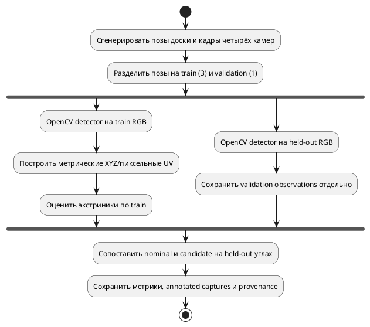

# Исследование image-derived калибровки внешних параметров

**Идентификатор:** E-CAL-IMG-01. **Первый этап выполнен:** 07.10.2026.
**Итоговые данные и воспроизведение:** [[validation/IMAGE_CALIBRATION]].

## Исследовательский вопрос

Можно ли пройти полный начальный путь от изображения калибровочной мишени к метрическим соответствиям и восстановленной внешней позе камеры, используя существующие Blender-источники, OpenCV detector и native solver? В отличие от E-CAL-MOUNT-01, где UV вычислялись аналитически, здесь углы сначала извлекаются из RGB.

## Метод

Сцена формирует четыре пространственно разнесённые камеры и метрическую шахматную доску. В каждом из четырёх кадров доска получает новую позу. Dataset хранит PNG/PPM, checksum, внутренние углы доски и `T_vehicle_from_board`. Detector находит углы в изображениях и переносит их в систему автомобиля. Первые три позы используются при подборе, четвёртая остаётся независимой проверкой. Intrinsics, модель fisheye и board poses заранее известны; solver оценивает только экстриники.

Переход координат для точки доски $P_B=[x_B,y_B,0,1]^T$:

$$P_V=T_{V\leftarrow B}P_B,\qquad u_{ij}=D_i\left(R_{C_i\leftarrow V}P_V+t_{C_i\leftarrow V}\right)+\epsilon_{ij}.$$

Здесь $D_i$ — принятая для камеры проекция fisheye, а ошибка оценивается только на углах независимой позы. Для оценки внешней позы используется уже реализованный `ransac_epnp_lm`; этим опытом алгоритмы между собой не сравниваются.

*Рисунок 1 — Разделение обнаружения и оценки: validation-изображения не передаются калибратору.*

## Первый результат и смысл

Все 16 видов доски успешно детектированы, в каждом виде получено 54 из 54 внутренних углов. По каждой камере solver получил 162 train-точки и был оценён на 54 углах одной отложенной позы. RMSE на отложенном кадре снизился с 12.95–21.48 px для nominal mounts до 0.133–0.146 px. Ошибка центра камеры составила 4.4–7.0 мм, ошибка поворота — 0.084–0.140°. Таблица по камерам, p95, изображение и hashes размещены в [[validation/IMAGE_CALIBRATION]].

Результат показывает, что генерация данных, детектор, формирование соответствий, solver и held-out оценка соединены без аналитической подмены пиксельных наблюдений. Малый остаток ожидаем в синтетической сцене: параметры камеры и положение доски заданы точно, а рендер не добавляет реалистичный шум матрицы/оптики. Это доказательство работоспособности software pipeline, не оценка точности на реальной машине.

## Ограничения и следующий этап

Chessboard симметрична, поэтому порядок углов поступает из известной Blender-сцены. Для реальных камер необходимы coded/asymmetric targets или проверка ориентации оператором. Один held-out ракурс не даёт оценку обобщения по всему полю зрения; планарная доска не исследует degeneracy и совместное восстановление intrinsics. Blender truth не содержит измерительной ошибки, а этот запуск не проверял окклюзии, блики, размытие и частичное обнаружение.

Следующая серия должна сравнить checkerboard с ChArUco/AprilTag-подобными мишенями, планарные и поднятые точки, разнообразие положения и наклона шаблона, ошибки измерения board pose, шум/blur/glare и self-occlusion. Нужны несколько независимых Blender-сцен и validation-поз, затем реальные измеренные фотографии. Экспериментальные чекбоксы ведутся в `TODO.md`; серверная калибровочная job остаётся отдельной задачей с quality gate и транзакционным применением конфигурации.

## Источники и артефакты

OpenCV описывает функции обнаружения шахматных углов и pose estimation в официальной документации [[references/VISION#S72|S72]]; принятая fisheye-модель описана в [[references/VISION#S04|S04]]. Программный протокол и точные метрики — [[validation/IMAGE_CALIBRATION]]. Генератор, конвертер и команды — [[engineering/BLENDER]] и [[engineering/USAGE#OpenCV: внешняя калибровка по изображениям]].
