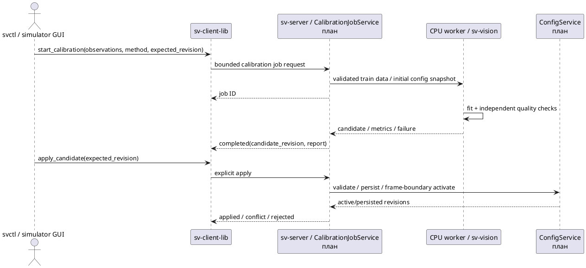

# E-CAL-MOUNT-01: калибровка при ошибках крепления

Дата: 07.10.2026. Цель — проверить восстановление положения четырёх камер при отклонении монтажа от nominal rig. Это отдельный исследовательский пункт к [[research/CALIBRATION]] и [[research/TOPIC]]. Первичный результат — [[validation/MOUNT_CALIBRATION]].

## Постановка первого опыта

Реальные intrinsics сначала предполагаются известными и фиксированными. Неизвестны внешние параметры `T_camera_from_vehicle`. Генератор задаёт yaw/pitch и сдвиг вдоль кузова; evaluator знает фактические позы, solver получает только nominal config и train XYZ/UV. Held-out XYZ/UV не передаются в native CLI. Объединение разных семейств intrinsics и pose solvers в один рейтинг без общих предпосылок было бы некорректным.

| Вариант | Вход и обработка | Ограничение сравнения |
|---|---|---|
| ITERATIVE | Fisheye undistort → normalized PnP, nominal pose как initial guess | Зависит от начального приближения; использует все train точки |
| EPnP | Те же normalized observations, direct PnP | Без robust отбора и дополнительного LM |
| SQPnP | Те же normalized observations, direct PnP | Без robust отбора и дополнительного LM |
| RANSAC+EPnP+LM | 300 iterations, confidence .999, threshold 3/max(fx,fy); LM по inliers | Threshold и objective в normalized coordinates, не точный fisheye pixel threshold |

Методы и требования OpenCV: [официальный solvePnP guide ветки 5.x](https://github.com/opencv/opencv/blob/5.x/modules/geometry/doc/solvePnP.markdown), [fisheye API](https://docs.opencv.org/4.13.0/db/d58/group__calib3d__fisheye.html), [[references/VISION#S72|S72]]. Проверенная реализация — C++ OpenCV 5.0.0. IPPE предназначен для planar inputs и должен сравниваться в отдельном planar опыте; в текущем профиле явно требуются noncoplanar aggregate XYZ.

## Данные и метрики

Пять mounting seeds, четыре камеры, шесть условий: σ 0/0.5/1 px × outlier fraction 0/0.1. На каждую камеру 120 train и 120 независимо выбранных validation points. XYZ равномерно предложены в метрическом объёме вокруг ТС, затем отфильтрованы по видимости в математической модели камеры с запасом до границ; actual scene occlusion не проверяется. Train UV получают Gaussian noise и uniform displacement ±35 px у случайных 10% точек. Validation UV остаются чистыми. Эти наблюдения **синтезированы**, а не извлечены detector из Blender RGB.

Метрики: held-out reprojection RMSE/p95, geodesic rotation error, camera-center error, invalid validation count, failure counts и fit duration. Success trial означает экспорт четырёх finite/valid-on-train poses, а не выполнение quality threshold; одна отказавшая камера делает весь четырёхкамерный trial неуспешным. Медианы считаются по успешным trials × 4 камеры, поэтому рядом обязательно указывать число отказов. Пять seeds — предварительная серия, не достаточное основание для универсальных выводов или доверительных интервалов.

Сначала сравниваются одинаковые наблюдения/параметры. Отдельно нужны sweep порогов RANSAC, одинаковые refinement stages и проверка generalized noise/повторяемости; текущая серия сравнивает pipeline-варианты с разной стоимостью. Близость к truth на synthetic data не доказывает реальную калибровку.

## Воспроизведение без новых launch scripts

После экспорта по [[engineering/BLENDER]]:

```sh
python3 tools/configurator.py compare-mounts \
  --dataset artifacts/blender-mount-v1 --build build \
  --output artifacts/mount-comparison-new --trials 5 --render
MPLCONFIGDIR=/tmp/sv-mount-mpl python3 docs/diploma/plot_mount_calibration.py \
  --study artifacts/mount-comparison-new --capture artifacts/blender-mount-capture-v1
```

Сравнение встроено в существующий configurator; доменная логика — `tools/calibration/study.py`, которую можно подключить к будущему laptop GUI. Native computation — `sv::calibrate_extrinsics` в sv-vision, `sv-calibrate extrinsics` является offline harness. Standalone операция для собственных наблюдений:

```sh
build/sv-calibrate extrinsics --config nominal.json \
  --observations observations.json --method ransac_epnp_lm --output artifacts/pose-candidate
```

Observation JSON: `schema_version: 1`, четыре `cameras` в порядке ID 0…3; каждый record имеет `id`, `points` (N×3 в метрах ТС), `pixels` (N×2 top-left). Требуются ≥6 noncoplanar finite соответствий и корректная конфигурация с известными intrinsics. Результат — candidate `config.json` и provenance `report.json`; calibration ID включает method и hash наблюдений. Утилита не меняет активный config работающего сервера. Для применения необходимы независимая quality gate и серверный ConfigService.

Чтобы получить соответствия непосредственно из снимков, `sv-calibrate board-observations` использует OpenCV `findChessboardCornersSB`. JSON задаёт `inner_corners`, метрический `square_size_m`, для каждого image — measured `T_vehicle_from_board` и проверенный вручную `corner_order`. Инструмент сохраняет нумерованные detection-изображения, observations и SHA-256 report; затем observations можно передать extrinsics CLI. Это первый image-derived путь, но он требует внешнего измерения pose доски. Симметрия шахматного узора создаёт неоднозначность ориентации: порядок сверяется по маркировке на шаблоне; автоматического asymmetric-marker detector пока нет. Несколько досок/позиций должны дать noncoplanar aggregate XYZ. Инструкция и пример schema: [[engineering/USAGE#OpenCV: внешняя калибровка по изображениям]]. Экспериментальные метрики главы 4 от этих кадров пока не получены.

## Следующий серверный workflow



*Рисунок КАЛ.1 — Целевая серверная калибровка. sv-vision solver уже реализован; job API, quality gate и серверное сохранение ещё отсутствуют.*

Продолжение: image-based chessboard/ChArUco и metric targets, planar/nonplanar comparison, joint intrinsics/extrinsics, overlap/bundle-adjustment families, влияние illumination/skew/blur/occlusion, amplitude sweep и held-out scenes. Сравнить буквально все существующие механизмы невозможно; нужен систематический обзор с обоснованным выбором реализуемых методов и явными исключениями.
