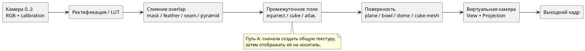
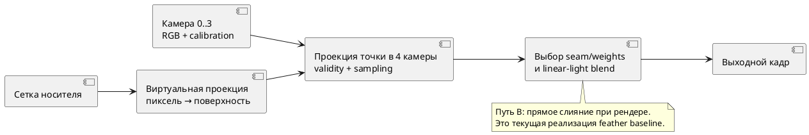

# Исследование сшивки четырёх камер и геометрии отображения

Статус на 06.10.2026: **начато; обзор источников и постановка эксперимента выполнены, сравнительные измерения ещё не проводились**. Документ фиксирует текущую реализацию отдельно от гипотез, которые предстоит проверить. Общие обозначения находятся в [[architecture/MATHEMATICS]], план работ — [[planning/ROADMAP]], полный перечень опытов — [[research/EXPERIMENTS]].

## 1. Исследовательский вопрос

Как при фиксированных кадрах четырёх калиброванных широкоугольных камер, позах, виртуальной камере, выходном разрешении и бюджете времени получить круговое изображение с приемлемым покрытием, малым геометрическим двоением и незаметными швами? Вопрос состоит из двух частей, которые нельзя смешивать в одном сравнении:

1. **Слияние источников:** какой пиксель/вес выбрать в перекрытии и в какой цветовой модели объединять валидные выборки?
2. **Поверхность-носитель:** на какую геометрию проецировать точки камер и по какой сетке её дискретизировать?

Сшивка устраняет переходы между текстурами, но не восстанавливает скрытую геометрию и не исправляет параллакс от пространственно разнесённых камер. Поверхность меняет видимые искажения, но сама по себе не устраняет разницу экспозиции и времени съёмки. Эти причины оцениваются раздельно.

## 2. Что делает текущая версия

Текущий путь **не строит заранее одну panorama-текстуру**. Для каждой растеризуемой точки поверхности fragment shader преобразует её в систему каждой камеры, применяет модель fisheye, проверяет поле зрения и границы исходного изображения, выбирает пиксель и складывает доступные цвета с весом, который растёт от края изображения к центру. Сумма нормируется, цвета декодируются в linear RGB перед смешиванием и снова кодируются в sRGB. Вес — простая функция расстояния до границы кадра; он не учитывает межкамерную яркостную разницу, движущиеся объекты или стоимость шва. Код: `src/render/surface.frag`.

В `dome_floor_v1` четыре входа напрямую проецируются на верхнюю полусферу и отдельный круглый пол. `rectangular_bowl_v1` оставлен как контрольный вариант. Вне покрытия задаётся непрозрачная нейтральная заливка, а не восстановленное наблюдение. Фото-сцена `street-demo` получена из одной моноскопической панорамы; она подходит для демонстрации оболочки, но не для оценки параллакса или реальных автомобильных камер. Фактическое состояние — [[prototype/STATUS]], ограничения сцены — [[engineering/SCENE]].

## 3. Стратегии объединения камер

| Метод | Идея | Сильные стороны | Ограничения и риск | Роль в сравнении |
|---|---|---|---|---|
| Жёсткая маска / выбор камеры | Для каждой точки заранее выбирается одна камера; в перекрытии действует фиксированная граница | Дешёвая выборка, нет усреднения двух несовпадающих контуров | Резкий шов, чувствительность к калибровке/положению объекта; фиксированная граница может проходить по объекту | Контроль минимальной стоимости |
| Нормированное feather-смешивание | Несколько кадров смешиваются весами валидности и расстояния до границы | Просто, стабильно и дёшево; текущий baseline | Двоение контуров сохраняется; общий край кадра не равен хорошему шву; экспозиция не компенсируется | Исходный алгоритм |
| Вес по расстоянию до seam/оптического качества | Веса учитывают расстояние до границы перекрытия, угол наблюдения, размытие и качество локального соответствия | Можно предпочесть более надёжный ракурс локально | Нужны карты качества; метрика качества может переключать источник между кадрами | Следующий недорогой вариант |
| Графовый поиск шва | Выбирается разделяющая линия с малой ценой цветового/градиентного разрыва и штрафом за невалидность | Не усредняет область вне выбранного перехода; можно обходить заметные объекты | Больше вычислений и подготовки; движение даёт дрожание шва, нужны временная регуляризация и GPU/CPU-профиль | Кандидат для локальных перекрытий |
| Multi-band / Laplacian pyramid | Маски смешиваются отдельно по пространственным частотам и затем собираются | Скрывает плавные различия экспозиции без одинакового размытия всех деталей | Не исправляет геометрический параллакс; широкое смешивание может удвоить объект и требует нескольких уровней/буферов | Сравнивать после фиксированного выбора шва |
| Совместный графовый шов + multi-band | Граф выбирает области, пирамидный blend смягчает фотометрический переход | Исследованная комбинация для 3D surround view; разделяет выбор границы и смешивание | Сложность и память; результаты чувствительны к геометрии, движениям и регистрации | Наиболее содержательный продвинутый baseline |
| Геометрически/глубинно-зависимый warp | Точки привязываются к известной плоскости, нескольким слоям или глубине сцены перед слиянием | Может уменьшить параллакс у соответствующего слоя | Глубина/слои должны быть измерены; ошибки глубины превращаются в двоение, нужен иной набор ground truth | Исследовать отдельно, не включать в первую серию без данных |

Для каждого метода сначала задаётся маска валидности `m_i(x)`, затем неотрицательный вес `w_i(x)`. Нормированное смешивание имеет вид:

$$
I(x)=\frac{\sum_{i=0}^{3}m_i(x)w_i(x)\,I_i(\pi_i(X(x)))}{\sum_{i=0}^{3}m_i(x)w_i(x)},\quad \sum_i m_iw_i>\varepsilon.
$$

Здесь `X(x)` — точка поверхности, видимая в выходном пикселе `x`, `π_i` — калиброванная проекция в камеру `i`. Если знаменатель меньше порога, алгоритм возвращает явную маску отсутствия наблюдения/описанный fallback. Fallback не должен попадать в статистику камерного покрытия.

Графовый вариант может минимизировать, например, энергию `E(L)=Σ_p D_p(L_p)+λΣ_(p,q) V_pq(L_p,L_q)`: `D` штрафует невалидный источник, плохой угол/резкость или фотометрическое отличие; `V` штрафует разрыв вдоль границы. Это общая постановка, **конкретные члены и веса в проекте ещё не реализованы и не выбраны**. В живом видео нужен дополнительный член временной стабильности, иначе минимальный шов может перемещаться каждый кадр.

Многополосное смешивание строит гауссовы/лапласовы пирамиды изображений и масок: `L_out^k = Σ_i G_i^k L_i^k / Σ_i G_i^k` при положительном знаменателе; изображение восстанавливается последовательно через expand и сложение лапласовых уровней, а не простой суммой массивов разных размеров. Ширина перехода зависит от масштаба уровня. Метод следует сравнивать только после одинакового геометрического warping и выбранных масок; иначе сравнение одновременно меняет несколько факторов.

## 4. Поверхности-носители

| Геометрия | Отображение и ожидаемое поведение | Достоинства | Основные искажения/риски |
|---|---|---|---|
| Плоскость / ground plane | Каждая камера проецируется на `z=0`; классический top-down/BEV | Смысл дорожных координат ясен, наземные объекты сохраняют метрическую привязку при корректной калибровке | Вертикальные объекты сдвигаются/растягиваются; участок за пределами обзора не возникает автоматически |
| Bowl (плоская середина + подъём по краям) | Аналитическая поверхность с параметрами авто и высоты | Совмещает центральную область пола с боковыми стенками; привычный 3D Surround View baseline, опубликованный и в промышленных примерах | Перелом/кривизна искажает удалённые объекты; результат зависит от заданной формы и ракурса |
| Пол + верхняя полусфера | Дисковый пол z=0 и сферическая стенка радиуса R; камера обзора внутри | Даёт замкнутую обзорную оболочку сверху и отдельную плоскую область под машиной; подходит для свободного виртуального ракурса | Переход на экваторе, сингулярная верхушка в угловой параметризации, FOV-дыры и растяжение на дальних участках |
| Цилиндр + пол/крышка | Боковой охват развёрнут на постоянном радиусе | Простая угловая параметризация и равномерная детализация по азимуту; хороша для уровня горизонта | Шов по азимуту; вертикальная геометрия деформируется; без крышки остаётся верхняя/нижняя дыра |
| Внутренний куб / cube map | Шесть плоских граней охватывают направления, виртуальная камера внутри; возможна текстура как 6 faces | Простая адресация направлений, равномернее широтно-долготной сферы возле полюсов, удобные квадратные буферы; ES 3.0 задаёт seamless cube-map filtering | Угловые искажения на краях граней, рёбра требуют согласованности, плоские грани не являются дорожной геометрией; куб не выбирает правильный шов между камерами |
| Сферический купол/сфера | Лучи задаются направлением на оболочке; сферическая UV-развёртка либо direction sampling | Нет особого направления по азимуту; естественная 360°-оболочка для виртуального наблюдателя | У полюсов уменьшается телесный угол одного texel долготно-широтной UV, что приводит к избыточной выборке и сингулярности долгот; сфера не задаёт истинную высоту объектов и нижний ground view |
| Burger/сложная составная поверхность | Комбинируются центральная площадка, плавная переходная зона и окружающая стенка | Публикация 3D-SV использует такую форму вместе с graph-cut и multi-band blend как попытку уменьшить резкие переходы и искажения | Требуется восстановить точное определение и сравнить при общей калибровке; название само по себе не является геометрическим контрактом |
| Адаптивная по цели сетка / составной custom mesh | Геометрию и плотность подбирают по ROI, рабочему ракурсу и бюджету ошибки | Может тратить вершины на видимые критические области и непрерывно соединять пол/стену | Риск переобучить сетку к выбранным точкам; критерий, ограничения, бесшовные стыки и бюджет нужно проверять независимо |

Кубическая карта — в первую очередь **представление направлений/текстуры**, тогда как купол, bowl и пол — **геометрия, по которой строится изображение виртуальной камеры**. Сравнивать их как взаимозаменяемые варианты можно только после явного определения общего pipeline: `4 кадра → общая направленная карта → носитель` либо `точка носителя → 4 проекции → слияние`. OpenGL ES 3.0 поддерживает seamless filtering кубических карт, но это устраняет артефакт фильтрации границы граней, а не калибровочный шов или параллакс между физическими камерами [[references/VISION#S70|S70]].

### 4.1 Направленная карта и геометрический carrier — разные сущности

Если центры камер считаются общими и объекты достаточно удалены, каждый fisheye-пиксель можно обратить в луч `r_i(p)`, повернуть в систему автомобиля и поместить на общую карту направлений. Координаты equirectangular full sphere можно определить так:

$$
u=W\frac{\operatorname{atan2}(d_y,d_x)+\pi}{2\pi},\qquad
v=H\frac{\arccos(d_z)}{\pi}.
$$

Это формат промежуточной текстуры; при равномерной сетке UV телесный угол одного texel пропорционален sinθ и уменьшается к полюсам. Растяжение в плоской развёртке и избыточная выборка там возрастают. Для cubemap грань выбирается по компоненте `|d_k|=max(|d_x|,|d_y|,|d_z|)`, а поперечные face-coordinates получают делением соответствующих компонент на `|d_k|`. Гномонический масштаб грани растёт к её краям; seamless-фильтрация обрабатывает выборку texel через edge, но source masks и изображения камер на соседних faces должны быть согласованы до фильтрации [[references/VISION#S70|S70]].

Для цилиндрического carrier направление даёт долготу `φ=atan2(d_y,d_x)`, но высота точки зависит от сцены: один луч её не определяет. Bowl и dome+floor, напротив, задают пространственную точку `X` и проецируют её в физические камеры `p_i=π_i(T_iX)`. Такая схема сохраняет явную зависимость от расположения камеры и выбранной поверхности, но не делает условный carrier истинной геометрией.

Если оптические центры камер разнесены, свёртка пикселей только по направлениям теряет параллакс: одна 3D-точка имеет разные направления из разных центров, а направленная координата не задаёт её глубину. Поэтому panorama/cubemap intermediate корректен как baseline при общей точке съёмки/удалённых объектах или заданной плоскости/слое глубины. Для близких препятствий нужны point/surface-based projection, depth layers либо 3D ground truth. Этот риск включён в E-STITCH-01.

## 5. Два порядка конвейера

*Рисунок 1 — Альтернативный порядок стадий. Оба пути используют одну модель калибровки, но имеют разную память, повторное использование и цену пересэмплирования.*

Путь A отделяет сборку panorama от просмотра и даёт переиспользуемую карту, но добавляет проекцию, промежуточную запись/чтение и ещё один этап ресемплинга. Путь B уже реализован и избегает полной intermediate-карты, но повторяет четыре проекции для каждого фрагмента выходной поверхности. Нужен ещё третий baseline: заранее вычисленные карты координат/весов (LUT) с динамической подстановкой пикселей; он переносит часть вычислений в подготовку и расходует память, а точность зависит от интерполяции LUT.

## 6. Предварительная оценка по критериям

Оценка до опыта — инженерная гипотеза, не результат измерения.

| Критерий | Direct surface sampling | Panorama/atlas intermediate | Cube-map intermediate | Составной ground+dome mesh |
|---|---|---|---|---|
| Повторное использование общей карты | Низкое: напрямую в каждый view | Высокое | Высокое по направлению | Неприменимо само по себе |
| Дополнительная память | Низкая | Средняя/высокая, зависит от разрешения | Шесть face-буферов | Геометрия мала; больше видимых фрагментов зависит от ракурса |
| Пересэмплирование | Один этап вход→выход | Минимум два этапа | Вход→face и face→выход | Один этап вход→выход на каждой поверхности |
| Шов между камерами | Управляется per-pixel blend | Сначала решается при построении карты | Всё ещё решается на границах camera regions | Всё ещё решается blend-масками |
| Ошибка наземной геометрии | Определяется выбранной поверхностью | Не устраняется промежуточной картой | Не устраняется кубом | Явно даёт плоскую дорожную область |
| Параллакс/вертикальные предметы | Зависит от точки-поверхности и позиции камеры | Обычная panorama теряет глубину | Обычная cubemap теряет глубину | Всё ещё аппроксимация; нужна истинная сцена для сравнения |
| Переносимость GLES/целевого GPU | Текущий проверенный путь | Нужны память и проходы | Нужна поддержка/корректная сборка cubemap | Использует уже поддерживаемые VBO/EBO/FBO |

## 7. План доказательного эксперимента

### 7.1 Зафиксировать вход и эталон

Использовать одинаковые синхронизированные кадры, intrinsics/extrinsics, RGB/origin, экспозицию, виртуальную позу, разрешение, color space, радиус/размеры поверхности и тайминг. Наборы должны содержать: ровный пол с сеткой, низкие препятствия около автомобиля, высокие вертикальные объекты, предметы в межкамерном overlap, удалённые объекты, движущиеся объекты и сцену с отсутствующим входом. Нужен ground truth из рендерера с известной 3D-геометрией либо размеченные контрольные точки в реальной сцене; `street-demo` не предоставляет такую истину.

Разбить тест на два уровня: (а) детерминированные synthetic сцены для метрического ground truth; (б) реальные четыре камеры для фотометрии/времени. Не подбирать форму и веса по финальным validation-сценам. Публиковать hashes, калибровки, effective config, backend, build и порядок вариантов.

### 7.2 Этапы, чтобы не смешать факторы

1. На существующей конфигурации сравнить fixed hard mask, текущий feather и distance-to-seam feather при неизменной bowl и затем dome+floor.
2. Для лучшей простой маски добавить graph-cut seam; сначала оценить CPU-время подготовки и временную стабильность. Затем подключить один multiband baseline, сохранив те же маски.
3. С фиксированным fusion сравнить plane, bowl, dome+floor, cylinder+floor, cube/cubemap и, после восстановления точного описания из статьи, burger surface. Сначала использовать плотную reference-сетку, чтобы не смешать ошибку формы и дискретизации.
4. Затем приёмлемую форму сравнить с одинаковым бюджетом треугольников: равномерная сетка против error-driven/adaptive сетки. Отдельно провести sweep плотности.
5. Сравнить direct, LUT и intermediate panorama/cubemap с одинаковыми семантическими входами и итоговым view. Измерить расход памяти и каждый проход отдельно.

Нельзя сразу запускать полный factorial, если дорого вычислять графовый шов на каждом кадре. Screen-опыты выбирают кандидатов; подтверждающая серия использует независимый dataset и полный профиль.

### 7.3 Метрики

| Группа | Метрика | Как интерпретировать |
|---|---|---|
| Покрытие | Доля ROI с хотя бы одним валидным источником; доля без данных; доля областей fallback | Fallback не засчитывается покрытием |
| Геометрия | reprojection error контрольных точек, BEV position error для объектов пола, pixel error относительно независимого рендера; p50/p95/p99/max | Разделять по классу высоты/глубины объекта и углу обзора |
| Двоение | расстояние/число дублированных контуров в overlap; доля объектов со вторым краем выше порога | Считать только видимые в обеих камерах объекты; заслонение учитывать отдельно |
| Шов | цветовой ΔE/linear-RGB скачок по нормали к seam; gradient discontinuity; seam length/visibility; локальная резкость | Измерять до и после blend, иначе сглаживание скроет причину |
| Временная стабильность | перемещение шва и изменение итогового цвета на статичных сценах, flicker при движении | Требует синхронизированного video-sequence, не одиночных изображений |
| Вычислительная цена | GPU draw/pass, CPU seam solve/precompute, upload/readback, p50/p95/p99/max, память, число выборок/фрагментов | Стадии не складывать без определения перекрытий ожиданий |
| Чувствительность | вариация intrinsics/extrinsics, skew, экспозиции, отказ одной камеры, размытие | Контролируемые perturbations не выдавать за частоту реальных отказов |

### 7.4 Предварительные гипотезы

- **H1:** direct feather остаётся самым дешёвым базовым путём, но не минимизирует двоение для объектов близко к автомобилю.
- **H2:** graph cut уменьшает заметность шва/двойного контура в отдельных статичных сценах; без временного члена может увеличить мерцание видео.
- **H3:** multi-band уменьшает фотометрический разрыв при согласной геометрии, но сам по себе не исправляет параллакс.
- **H4:** cube map выгодна как промежуточное направленное представление при свободном круговом виртуальном обзоре, но не заменяет surface geometry для метрического вида земли.
- **H5:** сочетание плоской зоны пола с полусферой лучше закрывает оболочку и поддерживает близкий BEV, но не обязано минимизировать ошибку для вертикальных объектов.

Каждая гипотеза считается неподтверждённой до повторяемого измерения с указанными данными и эталоном. Возможен отрицательный результат или зависимость от класса сцены.

## 8. Вывод обзора и границы

Литература демонстрирует как минимум три совместно проектируемых решения: geometric warping, выбор seam и blending, затем перенос на 3D-носитель. Автомобильная работа о Burger model прямо сочетает graph-cut, multi-band и новую форму носителя; TI описывает bowl-подход как промышленный/embedded baseline. Документация OpenCV содержит независимые реализации plane/spherical/cylindrical warper, seam finder, exposure compensation и feather/multiband blender [[references/VISION#S68|S68]] [[references/VISION#S10|S10]] [[references/VISION#S71|S71]].

Обзор не доказывает, что любая опубликованная форма будет лучше для этого проекта: различаются расположение объективов, высоты, FOV, виртуальные ракурсы, display intent и требования реального времени. На текущих данных можно подтвердить только работоспособность dome+floor-сцены; ни качество шва, ни преимущество купола относительно куба/цилиндра/составной поверхности пока не измерены.

## Литература для этого сравнения

- Burt, P. J.; Adelson, E. H. *A Multiresolution Spline with Application to Image Mosaics*. ACM Transactions on Graphics, 2(4), 1983, pp. 217–236. [[references/VISION#S10|S10]].
- Zhang, L. et al. *Seamless 3D Surround View with a Novel Burger Model*. ICIP 2019, pp. 4150–4154. DOI: 10.1109/ICIP.2019.8803453. [[references/VISION#S68|S68]].
- Texas Instruments. *Surround View Camera System for ADAS on TI’s TDAx SoCs*. SPRY270A, Rev. A. [[references/DEVELOPMENT#S44|S44]].
- OpenCV. *Seam Estimation* and *Images Stitching*. Official OpenCV documentation. [[references/VISION#S71|S71]].
- Khronos Group. *OpenGL ES 3.0 Specification*, §3.8.9.1 seamless cube-map filtering. [[references/VISION#S70|S70]].

## Выполненная подготовка данных 06.10.2026

Создан объёмный Blender-источник с разнесёнными optical centers и заданным движением: [[engineering/BLENDER]], [[validation/BLENDER_SMOKE]]. Установлены pose truth и replay compatibility; dense depth/visibility, количественные seam/ghosting metrics и сравнительные результаты вариантов ещё отсутствуют. Растяжение вертикальных объектов и двоение в перекрытиях уже наблюдаются на действующем dome-floor baseline.
