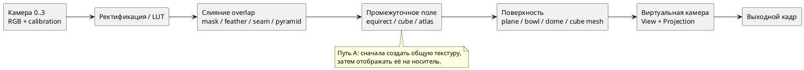
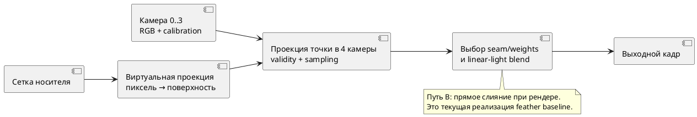

# Исследование сшивки четырёх камер и геометрии отображения

Статус на 09.10.2026: **обзор Burger и протокол E-STITCH-01 зафиксированы; offline-код содержит 7 вариантов fusion и 6 carriers, а скрипт сформировал 84 строки на одной статической Blender-сцене. Это лишь exploratory run, не подтверждающее сравнение качества. Повторный аудит выявил, что вариант `graph_cut_seam` — пиксельная distance-эвристика, seam-оценка считает Sobel-gradient, а ghost-score не анализирует fused edges. Числа и выводы ниже не считать рейтингом и не переносить в итоговые выводы до исправления метода/метрик и повторения на holdout сценах.** Реальное runtime ядро содержит меньше вариантов; см. [[engineering/RENDERING]]. Общие обозначения — [[architecture/MATHEMATICS]], план — [[planning/ROADMAP]], каталог опытов — [[research/EXPERIMENTS]], список исправлений — [[../TODO]].

## 1. Исследовательский вопрос

Как при фиксированных кадрах четырёх калиброванных широкоугольных камер, позах, виртуальной камере, выходном разрешении и бюджете времени получить круговое изображение с приемлемым покрытием, малым геометрическим двоением и незаметными швами? Вопрос состоит из двух частей, которые нельзя смешивать в одном сравнении:

1. **Слияние источников:** какой пиксель/вес выбрать в перекрытии и в какой цветовой модели объединять валидные выборки?
2. **Поверхность-носитель:** на какую геометрию проецировать точки камер и по какой сетке её дискретизировать?

Сшивка устраняет переходы между текстурами, но не восстанавливает скрытую геометрию и не исправляет параллакс от пространственно разнесённых камер. Поверхность меняет видимые искажения, но сама по себе не устраняет разницу экспозиции и времени съёмки. Эти причины оцениваются раздельно.

## 2. Что делает текущая версия

Текущий путь **не строит заранее одну panorama-текстуру**. Для каждой растеризуемой точки поверхности fragment shader преобразует её в систему каждой камеры, применяет модель fisheye, проверяет поле зрения и границы исходного изображения, выбирает пиксель и складывает доступные цвета с весом, который растёт от края изображения к центру. Сумма нормируется, цвета декодируются в linear RGB перед смешиванием и снова кодируются в sRGB. Вес — простая функция расстояния до границы кадра; он не учитывает межкамерную яркостную разницу, движущиеся объекты или стоимость шва. Код: `src/render/surface.frag`. В 0.4.0 дополнительно доступны angular-feather и hard best-angle; формулы, ограничения и диагностика — [[engineering/RENDERING]]. Угловой вес является эвристикой. Screening — [[validation/SURFACE_SCREENING]].

В `dome_floor_v1` четыре входа напрямую проецируются на верхнюю полусферу и отдельный круглый пол. `rectangular_bowl_v1` оставлен как контрольный вариант; cylinder+floor+cap и cube walls+floor+roof также реализованы. Кубический носитель не создаёт cubemap-текстуру. Вне покрытия задаётся непрозрачная нейтральная заливка, а не восстановленное наблюдение. Фото-сцена `street-demo` получена из одной моноскопической панорамы; она подходит для демонстрации оболочки, но не для оценки параллакса или реальных автомобильных камер. Фактическое состояние — [[prototype/STATUS]], ограничения сцены — [[engineering/SCENE]].

## 3. Стратегии объединения камер

| Метод | Идея | Сильные стороны | Ограничения и риск | Роль в сравнении |
|---|---|---|---|---|
| Жёсткая маска / выбор камеры | Для каждой точки заранее выбирается одна камера; в перекрытии действует фиксированная граница | Дешёвая выборка, нет усреднения двух несовпадающих контуров | Резкий шов, чувствительность к калибровке/положению объекта; фиксированная граница может проходить по объекту | Контроль минимальной стоимости |
| Нормированное feather-смешивание | Несколько кадров смешиваются весами валидности и расстояния до границы | Просто, стабильно и дёшево; текущий baseline | Двоение контуров сохраняется; общий край кадра не равен хорошему шву; экспозиция не компенсируется | Исходный алгоритм |
| Вес по расстоянию до seam/оптического качества | Веса учитывают расстояние до границы перекрытия, угол наблюдения, размытие и качество локального соответствия | Можно предпочесть более надёжный ракурс локально | Нужны карты качества; метрика качества может переключать источник между кадрами | Следующий недорогой вариант |
| Графовый поиск шва | Выбирается разделяющая линия с малой ценой цветового/градиентного разрыва и штрафом за невалидность | Не усредняет область вне выбранного перехода; можно обходить заметные объекты | Больше вычислений и подготовки; движение даёт дрожание шва, нужны временная регуляризация и GPU/CPU-профиль | Кандидат для локальных перекрытий |
| Multi-band / Laplacian pyramid | Маски смешиваются отдельно по пространственным частотам и затем собираются | Скрывает плавные различия экспозиции без одинакового размытия всех деталей | Не исправляет геометрический параллакс; широкое смешивание может удвоить объект и требует нескольких уровней/буферов | Сравнивать после фиксированного выбора шва |
| Совместный графовый шов + multi-band | Граф выбирает области, пирамидный blend смягчает фотометрический переход | Исследованная комбинация для 3D surround view; разделяет выбор границы и смешивание | Сложность и память; результаты чувствительны к геометрии, движениям и регистрации | Наиболее содержательный продвинутый baseline |
| Геометрически/глубинно-зависимый warp | Точки привязываются к известной плоскости, нескольким слоям или глубине сцены перед слиянием | Может уменьшить параллакс у соответствующего слоя | Глубина/слои должны быть измерены; ошибки глубины превращаются в двоение, нужен иной набор ground truth | Исследовать отдельно, не включать в первую серию без данных |

Для каждого метода сначала задаётся маска валидности `m_i(x)`, затем неотрицательный вес `w_i(x)`. Нормированное смешивание имеет вид:

$$
I(x)=\frac{\sum_{i=0}^{3}m_i(x)w_i(x)\,I_i(\pi_i(X(x)))}{\sum_{i=0}^{3}m_i(x)w_i(x)},\quad \sum_i m_iw_i>\varepsilon.
$$

Здесь `X(x)` — точка поверхности, видимая в выходном пикселе `x`, `π_i` — калиброванная проекция в камеру `i`. Если знаменатель меньше порога, алгоритм возвращает явную маску отсутствия наблюдения/описанный fallback. Fallback не должен попадать в статистику камерного покрытия.

Графовый вариант может минимизировать, например, энергию `E(L)=Σ_p D_p(L_p)+λΣ_(p,q) V_pq(L_p,L_q)`: `D` штрафует невалидный источник, плохой угол/резкость или фотометрическое отличие; `V` штрафует разрыв вдоль границы. Это общая постановка, **конкретные члены и веса в проекте ещё не реализованы и не выбраны**. В живом видео нужен дополнительный член временной стабильности, иначе минимальный шов может перемещаться каждый кадр.

Многополосное смешивание строит гауссовы/лапласовы пирамиды изображений и масок: `L_out^k = Σ_i G_i^k L_i^k / Σ_i G_i^k` при положительном знаменателе; изображение восстанавливается последовательно через expand и сложение лапласовых уровней, а не простой суммой массивов разных размеров. Ширина перехода зависит от масштаба уровня. Метод следует сравнивать только после одинакового геометрического warping и выбранных масок; иначе сравнение одновременно меняет несколько факторов.

## 4. Поверхности-носители

| Геометрия | Отображение и ожидаемое поведение | Достоинства | Основные искажения/риски |
|---|---|---|---|
| Плоскость / ground plane | Каждая камера проецируется на `z=0`; классический top-down/BEV | Смысл дорожных координат ясен, наземные объекты сохраняют метрическую привязку при корректной калибровке | Вертикальные объекты сдвигаются/растягиваются; участок за пределами обзора не возникает автоматически |
| Bowl (плоская середина + подъём по краям) | Аналитическая поверхность с параметрами авто и высоты | Совмещает центральную область пола с боковыми стенками; привычный 3D Surround View baseline, опубликованный и в промышленных примерах | Перелом/кривизна искажает удалённые объекты; результат зависит от заданной формы и ракурса |
| Пол + верхняя полусфера | Дисковый пол z=0 и сферическая стенка радиуса R; камера обзора внутри | Даёт замкнутую обзорную оболочку сверху и отдельную плоскую область под машиной; подходит для свободного виртуального ракурса | Переход на экваторе, сингулярная верхушка в угловой параметризации, FOV-дыры и растяжение на дальних участках |
| Цилиндр + пол/крышка | Боковой охват развёрнут на постоянном радиусе | Простая угловая параметризация и равномерная детализация по азимуту; хороша для уровня горизонта | Шов по азимуту; вертикальная геометрия деформируется; без крышки остаётся верхняя/нижняя дыра |
| Внутренний куб / cube map | Шесть плоских граней охватывают направления, виртуальная камера внутри; возможна текстура как 6 faces | Простая адресация направлений, равномернее широтно-долготной сферы возле полюсов, удобные квадратные буферы; ES 3.0 задаёт seamless cube-map filtering | Угловые искажения на краях граней, рёбра требуют согласованности, плоские грани не являются дорожной геометрией; куб не выбирает правильный шов между камерами |
| Сферический купол/сфера | Лучи задаются направлением на оболочке; сферическая UV-развёртка либо direction sampling | Нет особого направления по азимуту; естественная 360°-оболочка для виртуального наблюдателя | У полюсов уменьшается телесный угол одного texel долготно-широтной UV, что приводит к избыточной выборке и сингулярности долгот; сфера не задаёт истинную высоту объектов и нижний ground view |
| Burger/сложная составная поверхность | Замкнутая поверхность вращения; meridian из полуокружности радиуса R, двух 90° дуг радиуса d и отрезка длиной 2(R−d) | Статья связывает её с panorama, graph-cut seam и multi-band blend | Топология и отношения длин описаны, но численные R/d, координаты стыков, mesh density и объективные метрики не опубликованы; точную репликацию по статье выполнить нельзя |
| Адаптивная по цели сетка / составной custom mesh | Геометрию и плотность подбирают по ROI, рабочему ракурсу и бюджету ошибки | Может тратить вершины на видимые критические области и непрерывно соединять пол/стену | Риск переобучить сетку к выбранным точкам; критерий, ограничения, бесшовные стыки и бюджет нужно проверять независимо |

Кубическая карта — в первую очередь **представление направлений/текстуры**, тогда как купол, bowl и пол — **геометрия, по которой строится изображение виртуальной камеры**. Сравнивать их как взаимозаменяемые варианты можно только после явного определения общего pipeline: `4 кадра → общая направленная карта → носитель` либо `точка носителя → 4 проекции → слияние`. OpenGL ES 3.0 поддерживает seamless filtering кубических карт, но это устраняет артефакт фильтрации границы граней, а не калибровочный шов или параллакс между физическими камерами [[references/VISION#S70|S70]].

### 4.1 Направленная карта и геометрический carrier — разные сущности

Если центры камер считаются общими и объекты достаточно удалены, каждый fisheye-пиксель можно обратить в луч `r_i(p)`, повернуть в систему автомобиля и поместить на общую карту направлений. Координаты equirectangular full sphere можно определить так:

$$
u=W\frac{\operatorname{atan2}(d_y,d_x)+\pi}{2\pi},\qquad
v=H\frac{\arccos(d_z)}{\pi}.
$$

Это формат промежуточной текстуры; при равномерной сетке UV телесный угол одного texel пропорционален sinθ и уменьшается к полюсам. Растяжение в плоской развёртке и избыточная выборка там возрастают. Для cubemap грань выбирается по компоненте `|d_k|=max(|d_x|,|d_y|,|d_z|)`, а поперечные face-coordinates получают делением соответствующих компонент на `|d_k|`. Гномонический масштаб грани растёт к её краям; seamless-фильтрация обрабатывает выборку texel через edge, но source masks и изображения камер на соседних faces должны быть согласованы до фильтрации [[references/VISION#S70|S70]].

Для цилиндрического carrier направление даёт долготу `φ=atan2(d_y,d_x)`, но высота точки зависит от сцены: один луч её не определяет. Bowl и dome+floor, напротив, задают пространственную точку `X` и проецируют её в физические камеры `p_i=π_i(T_iX)`. Такая схема сохраняет явную зависимость от расположения камеры и выбранной поверхности, но не делает условный carrier истинной геометрией.

Если оптические центры камер разнесены, свёртка пикселей только по направлениям теряет параллакс: одна 3D-точка имеет разные направления из разных центров, а направленная координата не задаёт её глубину. Поэтому panorama/cubemap intermediate корректен как baseline при общей точке съёмки/удалённых объектах или заданной плоскости/слое глубины. Для близких препятствий нужны point/surface-based projection, depth layers либо 3D ground truth. Этот риск включён в E-STITCH-01.

## 5. Два порядка конвейера





*Рисунок 1 — Альтернативный порядок стадий. Оба пути используют одну модель калибровки, но имеют разную память, повторное использование и цену пересэмплирования.*

Путь A отделяет сборку panorama от просмотра и даёт переиспользуемую карту, но добавляет проекцию, промежуточную запись/чтение и ещё один этап ресемплинга. Путь B уже реализован и избегает полной intermediate-карты, но повторяет четыре проекции для каждого фрагмента выходной поверхности. Нужен ещё третий baseline: заранее вычисленные карты координат/весов (LUT) с динамической подстановкой пикселей; он переносит часть вычислений в подготовку и расходует память, а точность зависит от интерполяции LUT.

## 6. Предварительная оценка по критериям

Оценка до опыта — инженерная гипотеза, не результат измерения.

| Критерий | Direct surface sampling | Panorama/atlas intermediate | Cube-map intermediate | Составной ground+dome mesh |
|---|---|---|---|---|
| Повторное использование общей карты | Низкое: напрямую в каждый view | Высокое | Высокое по направлению | Неприменимо само по себе |
| Дополнительная память | Низкая | Средняя/высокая, зависит от разрешения | Шесть face-буферов | Геометрия мала; больше видимых фрагментов зависит от ракурса |
| Пересэмплирование | Один этап вход→выход | Минимум два этапа | Вход→face и face→выход | Один этап вход→выход на каждой поверхности |
| Шов между камерами | Управляется per-pixel blend | Сначала решается при построении карты | Всё ещё решается на границах camera regions | Всё ещё решается blend-масками |
| Ошибка наземной геометрии | Определяется выбранной поверхностью | Не устраняется промежуточной картой | Не устраняется кубом | Явно даёт плоскую дорожную область |
| Параллакс/вертикальные предметы | Зависит от точки-поверхности и позиции камеры | Обычная panorama теряет глубину | Обычная cubemap теряет глубину | Всё ещё аппроксимация; нужна истинная сцена для сравнения |
| Переносимость GLES/целевого GPU | Текущий проверенный путь | Нужны память и проходы | Нужна поддержка/корректная сборка cubemap | Использует уже поддерживаемые VBO/EBO/FBO |

## 7. План доказательного эксперимента

### 7.1 Зафиксировать вход и эталон

Использовать одинаковые синхронизированные кадры, intrinsics/extrinsics, RGB/origin, экспозицию, виртуальную позу, разрешение, color space, радиус/размеры поверхности и тайминг. Наборы должны содержать: ровный пол с сеткой, низкие препятствия около автомобиля, высокие вертикальные объекты, предметы в межкамерном overlap, удалённые объекты, движущиеся объекты и сцену с отсутствующим входом. Нужен ground truth из рендерера с известной 3D-геометрией либо размеченные контрольные точки в реальной сцене; `street-demo` не предоставляет такую истину.

Разбить тест на два уровня: (а) детерминированные synthetic сцены для метрического ground truth; (б) реальные четыре камеры для фотометрии/времени. Не подбирать форму и веса по финальным validation-сценам. Публиковать hashes, калибровки, effective config, backend, build и порядок вариантов.

### 7.2 Этапы, чтобы не смешать факторы

1. На существующей конфигурации сравнить fixed hard mask, текущий feather и distance-to-seam feather при неизменной bowl и затем dome+floor.
2. Для лучшей простой маски добавить graph-cut seam; сначала оценить CPU-время подготовки и временную стабильность. Затем подключить один multiband baseline, сохранив те же маски.
3. С фиксированным fusion сравнить plane, bowl, dome+floor, cylinder+floor, cube/cubemap и явно маркированную parameterized `burger-like` форму. Источник задаёт профиль Burger качественно, но не сообщает достаточных параметров для точного mesh reproduction. Сначала использовать плотную reference-сетку, чтобы не смешать ошибку формы и дискретизации.
4. Затем приёмлемую форму сравнить с одинаковым бюджетом треугольников: равномерная сетка против error-driven/adaptive сетки. Отдельно провести sweep плотности.
5. Сравнить direct, LUT и intermediate panorama/cubemap с одинаковыми семантическими входами и итоговым view. Измерить расход памяти и каждый проход отдельно.

Нельзя сразу запускать полный factorial, если дорого вычислять графовый шов на каждом кадре. Screen-опыты выбирают кандидатов; подтверждающая серия использует независимый dataset и полный профиль.

### 7.3 Метрики

| Группа | Метрика | Как интерпретировать |
|---|---|---|
| Покрытие | Доля ROI с хотя бы одним валидным источником; доля без данных; доля областей fallback | Fallback не засчитывается покрытием |
| Геометрия | reprojection error контрольных точек, BEV position error для объектов пола, pixel error относительно независимого рендера; p50/p95/p99/max | Разделять по классу высоты/глубины объекта и углу обзора |
| Двоение | расстояние/число дублированных контуров в overlap; доля объектов со вторым краем выше порога | Считать только видимые в обеих камерах объекты; заслонение учитывать отдельно |
| Шов | цветовой ΔE/linear-RGB скачок по нормали к seam; gradient discontinuity; seam length/visibility; локальная резкость | Измерять до и после blend, иначе сглаживание скроет причину |
| Временная стабильность | перемещение шва и изменение итогового цвета на статичных сценах, flicker при движении | Требует синхронизированного video-sequence, не одиночных изображений |
| Вычислительная цена | GPU draw/pass, CPU seam solve/precompute, upload/readback, p50/p95/p99/max, память, число выборок/фрагментов | Стадии не складывать без определения перекрытий ожиданий |
| Чувствительность | вариация intrinsics/extrinsics, skew, экспозиции, отказ одной камеры, размытие | Контролируемые perturbations не выдавать за частоту реальных отказов |

### 7.4 Предварительные гипотезы

- **H1:** direct feather остаётся самым дешёвым базовым путём, но не минимизирует двоение для объектов близко к автомобилю.
- **H2:** graph cut уменьшает заметность шва/двойного контура в отдельных статичных сценах; без временного члена может увеличить мерцание видео.
- **H3:** multi-band уменьшает фотометрический разрыв при согласной геометрии, но сам по себе не исправляет параллакс.
- **H4:** cube map выгодна как промежуточное направленное представление при свободном круговом виртуальном обзоре, но не заменяет surface geometry для метрического вида земли.
- **H5:** сочетание плоской зоны пола с полусферой лучше закрывает оболочку и поддерживает близкий BEV, но не обязано минимизировать ошибку для вертикальных объектов.

Каждая гипотеза считается неподтверждённой до повторяемого измерения с указанными данными и эталоном. Возможен отрицательный результат или зависимость от класса сцены.

## 8. Вывод обзора и границы

Литература демонстрирует как минимум три совместно проектируемых решения: geometric warping, выбор seam и blending, затем перенос на 3D-носитель. Автомобильная работа о Burger model прямо сочетает graph-cut, multi-band и новую форму носителя; TI описывает bowl-подход как промышленный/embedded baseline. Документация OpenCV содержит независимые реализации plane/spherical/cylindrical warper, seam finder, exposure compensation и feather/multiband blender [[references/VISION#S68|S68]] [[references/VISION#S10|S10]] [[references/VISION#S71|S71]].

Обзор не доказывает, что любая опубликованная форма будет лучше для этого проекта: различаются расположение объективов, высоты, FOV, виртуальные ракурсы, display intent и требования реального времени. Реализованы пять носителей и три fusion-режима; depth-truth screening измерил соответствие проекций 3D-поверхностям известной глубине в одной синтетической сцене. Это не измерение визуальной привлекательности, качества шва или полноценного ghosting. Преимущество одной формы/стратегии сшивки пока не установлено.

## Литература для этого сравнения

- Burt, P. J.; Adelson, E. H. *A Multiresolution Spline with Application to Image Mosaics*. ACM Transactions on Graphics, 2(4), 1983, pp. 217–236. [[references/VISION#S10|S10]].
- Zhang, L. et al. *Seamless 3D Surround View with a Novel Burger Model*. ICIP 2019, pp. 4150–4154. DOI: 10.1109/ICIP.2019.8803453. [[references/VISION#S68|S68]].
- Texas Instruments. *Surround View Camera System for ADAS on TI’s TDAx SoCs*. SPRY270A, Rev. A. [[references/DEVELOPMENT#S44|S44]].
- OpenCV. *Seam Estimation* and *Images Stitching*. Official OpenCV documentation. [[references/VISION#S71|S71]].
- Khronos Group. *OpenGL ES 3.0 Specification*, §3.8.9.1 seamless cube-map filtering. [[references/VISION#S70|S70]].

## 9. E-STITCH-01: что именно известно о Burger model

Первоисточник Zhang et al. описывает последовательность `4 fisheye (>180°) → undistort → panorama stitch → texture mapping`. Соседние кадры предварительно выравниваются признаками SURF и homography; overlap разбивается graph-cut seam, а переход сглаживается multi-band blending. Потом panorama сначала текстурируется на сферу, затем переносится на Burger-поверхность по лучам из центра O: точка на сфере и точка пересечения того же направления с Burger получают одинаковые UV. Это panorama-first pipeline, а не текущее per-fragment смешивание четырёх физических камер [[references/VISION#S68|S68]].

Meridian Burger model — полуокружность радиуса R, две четверти окружности радиуса d и прямой отрезок `2(R−d)`, вращаемые вокруг оси L. В статье сказано, что переход гладкий и поверхность замкнута. Публикация не даёт численных R/d, координат центра O относительно автомобиля, точек стыка в координатах, разрешения/числа полигонов и UV seam policy. Поэтому воспроизводима **семейство формы**, но не exact mesh эксперимента. В реализации проекта допустима только явно маркированная параметрическая аппроксимация `burger-like`, с опубликованными собственными `R`, `d` и стыковкой; её нельзя представлять как оригинальную сетку авторов.

Условия исходного опыта, сообщённые в статье: четыре автомобильные fisheye-камеры по 184° FOV; общая частота panorama 20 fps на Intel Core i5 2.7 GHz; graph-cut seam пересчитывался раз в 50 кадров, занимал около 0.5 s и считался параллельно panorama stitching. Авторская оценка преимущества формы и fusion дана визуальными примерами/описанием; разрешение входов, pose/baseline, численные значения R и d, тестовые координаты, quantitative seam/ghosting score, память и error bars не приведены. 20 fps нельзя переносить как сравнимый benchmark без совпадения аппаратуры и pipeline. Источник: [полный текст ICIP 2019](https://cslinzhang.github.io/home/files/ICIP2019.pdf), страницы 4150–4154.

Практический вывод: graph-cut выбирает, где соединить две view, а multi-band смягчает частотный/фотометрический переход; сами по себе они не восстанавливают 3D и не устраняют параллакс. Работа Zhang & Liu формулирует ту же границу: seam+blend недостаточны при значительном parallax без локального warp, а homography ограничена сценами с малым параллаксом [[references/VISION#S73|S73]].

```plantuml
@startuml
left to right direction
rectangle "4 fisheye images\n184° each" as In
rectangle "Undistort" as U
rectangle "SURF matches +\nadjacent homographies" as A
rectangle "Graph-cut seam\nin each overlap" as G
rectangle "Multi-band\npanorama blend" as B
rectangle "2D panorama\n/ spherical UV" as P
rectangle "Ray transfer from O\nto Burger carrier" as R
rectangle "Free virtual\nviewpoint" as V
In --> U --> A --> G --> B --> P --> R --> V
note bottom of R
Texture coordinates are transferred
along a ray; scene depth is not recovered.
end note
@enduml
```

*Рисунок 2 — Pipeline статьи Zhang et al.; он отличается от текущего direct-sampling renderer, где четыре камеры проецируются непосредственно на точку carrier и смешиваются в fragment shader.*

## 10. Зафиксированный экспериментальный контракт

### 10.1 Факторы, которые менять по одному

Сравнение разбивается на три независимые оси. (A) **Fusion на общей геометрии:** hard best-angle/fixed mask, edge-feather, angular-feather, seam-distance feather, graph-cut mask, graph-cut + multi-band. (B) **Carrier при зафиксированной fusion:** plane, bowl, dome+floor, cylinder+floor, cube shell; отдельно parameterized `burger-like`, когда профиль будет реализован. (C) **Порядок вычисления:** direct surface sampling, direction-space panorama/cubemap, lookup table. Результаты разных осей не сводить в единый рейтинг; сначала фиксируется одна ось и общие входы. Кубический carrier не равен cubemap texture.

### 10.2 Фикстуры и разбиение

Базовый синтетический набор должен включать фиксированные ID: **S0** плоский метрический grid/checker и контрольные точки; **S1** низкая стойка/блок рядом с overlap; **S2** вертикальная панель/столб на шве; **S3** foreground occluder и второй фоновой объект; **S4** одинаковая сцена с контролируемыми per-camera gain/white-balance; **S5** объект, проходящий через seam на видео; **S6** drop/black кадр одной камеры. У каждого кадра — независимые Blender depth и object-ID/semantic pass, camera pose truth, время, SHA-256 и неизменяемый ROI. Камерные pose/noise seeds 0–7 относятся к tuning, 8–11 — holdout; результаты на tuning нельзя выдавать за validation. Реальная четырёхкамерная запись остаётся отдельным transfer-набором.

Существующий `blender_metric_street_v1` содержит один синхронный статический кадр, 4 camera images и radial depth maps. Он достаточен для smoke и первого геометрического visibility screening, но не покрывает весь S0–S6. Фото-ассет `street-demo` в метрики не включается.

### 10.3 Фиксированные условия сравнения

Для fusion-серии замораживаются RGB input bytes, intrinsics/extrinsics, exposure, effective config, camera ordering, virtual pose, output 960×540, ROI, sampler и carrier mesh. Основной профиль не применяет exposure compensation; если входы линейные, смешение выполняется в linear RGB, иначе transfer function и decode фиксируются для всех вариантов. Затем отдельный stress-factor задаёт известный gain/WB bias; компенсация экспозиции включается отдельным, одинаково настроенным фактором. Не менять цветовую компенсацию одновременно с seam finder.

Геометрию сначала сравнивать на плотной reference сетке, затем на mesh-бюджетах около 10k/25k/50k triangles (фактическое число сообщать и держать в пределах ±2%). Входы — четыре RGB8 400×400; выход — RGB8 960×540. Дополнительную память для panorama/cubemap/LUT/pyramids измерять отдельно, не считать память входов общей выгодой. Целевой display cadence для оценки — 30 fps (33.3 ms/frame); report отдельно показывает render p50/p95/p99/max, подготовку/обновление seam, transfer/readback и максимальный дополнительный working set. PC/llvmpipe — диагностическая платформа, не заменяет GPU Aurora passport. Для seam, который пересчитывается периодически, фиксировать возраст карты seam и overhead обновления, а не прятать его усреднением.

### 10.4 Метрики и критерии

Coverage считать отдельно как (1) проекционная valid coverage и (2) геометрическая точная видимость. Для carrier point X и камеры i измерить radial depth `d_i` из truth и расстояние `r_i=||T_iX||`; источник засчитывается exact-visible, если `|d_i−r_i| ≤ max(0.05 m, 0.01 r_i)`. Затем считать долю ROI с хотя бы одним exact-visible camera и долю суммарного fusion веса, пришедшую от exact-visible/foreground-occluded/no-return sample. Это metric переноса 3D-точек, не эстетический score.

Порог `0.05 m / 1%` — начальный операционный tolerance, а не физическая константа. В sensitivity sweep повторить как минимум 0.02/0.05/0.10 м при том же relative term; публиковать все пороги рядом и применять заранее выбранный threshold к holdout. Увеличение tolerance повышает coverage, поэтому выбирать его после просмотра финальных результатов запрещено.

Для image quality требуются object-ID/edge truth: дубль контура — два соответствующих edge response для одного объекта вне заданного допускового коридора; указывать смещение вторичного контура в пикселях/метрах и долю объектов с ghost. Шов измерять до/после blend: ΔE00 или linear-RGB jump, нормальный градиент, длина шва через salient object. Для видео — frame-to-frame seam displacement p50/p95, flicker на статичной ROI и ghost trail у движущегося объекта. Отчёт давать раздельно по высоте/дальности объекта, а не одним средним.

Один screening кадр не является независимым повтором. Итоговая серия: минимум 3 scene seeds × 3 mount perturbation seeds × 3 прогона в случайном/чередующемся порядке; temporal sequence анализировать по clips, а не объявлять соседние кадры независимыми наблюдениями. Значения p50/p95/p99/max и confidence spread считать между сценами/прогонами. В отсутствие физического Aurora target comparative timing остаётся host-only.

### 10.5 Результаты уже выполненного screening

`tools/compare_visibility.py` проверил 30 сочетаний: 5 текущих carriers × 2 ракурса × 3 direct fusion modes на одном Blender frame. Он сопоставляет лучшую fused sample по её RGB-весу с radial depth конкретной камеры. Точность совпадения depths ограничена текущим face-size=32 capture; проверки ошибок на независимой плоскости описаны в [[validation/DEPTH_VISIBILITY_TRUTH]], полный машинный отчёт — [[validation/STITCH_VISIBILITY]].

В low view у купола проекционная coverage составляет 99.94%, но точная depth-visible coverage — 16.20%; доля fusion weight, выборка которой совпадает с 3D-точкой, — 13.18% для edge-feather и 14.05% для hard-best-angle. Для plane те же значения 99.91%, 24.31%, 19.81% и 21.17%; для bowl — 99.92%, 21.96%, 17.89% и 18.93%. Sensitivity check для dome/plane при absolute tolerance 0.02/0.05/0.10 м сохраняет тот же порядок, но exact-depth coverage купола меняется от 11.12% до 27.12%, плоскости — от 16.59% до 40.94%. Значит, даже порядок кандидатов выглядит устойчивым только в пределах одного кадра/набора, а абсолютные числа чувствительны к порогу. Это показывает, что `valid projection coverage` нельзя читать как физическую видимость. Малые различия hard/feather в одном кадре не достаточны для выбора способа сшивки. Это visibility proxy, а не visual seam/ghosting ranking; carriers имеют разный ROI, и все оценки относятся к одному синтетическому кадру.

## 11. Exploratory output матрицы E-STITCH-01 — не подтверждающие выводы

Скрипт `tools/run_e_stitch_01.py` сформировал 84 конфигурации:
- **6 носителей:** `plane`, `bowl`, `dome_floor`, `cylinder_floor`, `cube_floor`, `burger_like`.
- **2 виртуальных ракурса:** `oblique` ($\theta_{el}=1.0\text{ rad}$) и `low` ($\theta_{el}=0.35\text{ rad}$).
- **7 стратегий fusion:** `hard_best_angle`, `edge_feather`, `angular_feather`, `seam_distance_feather`, `graph_cut_seam`, `multi_band`, `graph_cut_multi_band`.

### Сводные показатели качества сшивки и видимости (low view)

| Carrier | Fusion Mode | Seam ΔE (p95) | Gradient Disc. | Ghost Frac % | Exact Depth Cov % (0.05m) | Consistent Weight % | Fusion ms |
|---|---|---:|---:|---:|---:|---:|---:|
| `plane` | `hard_best_angle` | 949.15 | 0.14 | 2.26% | 24.50% | 21.34% | 54.46 |
| `plane` | `edge_feather` | 889.37 | 0.06 | 2.26% | 24.50% | 19.99% | 41.15 |
| `plane` | `angular_feather` | 57.58 | 0.02 | 2.26% | 24.50% | 20.95% | 58.03 |
| `plane` | `seam_distance_feather` | 52.55 | 0.02 | 2.26% | 24.50% | 20.69% | 82.68 |
| `plane` | `graph_cut_seam` | 961.13 | 0.13 | 2.26% | 24.50% | 21.25% | 164.73 |
| `plane` | `multi_band` | 890.88 | 0.06 | 2.26% | 24.50% | 19.99% | 330.22 |
| `plane` | `graph_cut_multi_band` | 958.27 | 0.11 | 2.26% | 24.50% | 21.25% | 483.51 |
| `dome_floor` | `hard_best_angle` | 214.42 | 0.04 | 2.53% | 16.33% | 14.18% | 54.93 |
| `dome_floor` | `edge_feather` | 55.94 | 0.04 | 2.53% | 16.33% | 13.31% | 41.52 |
| `dome_floor` | `angular_feather` | 39.36 | 0.00 | 2.53% | 16.33% | 13.92% | 56.59 |
| `dome_floor` | `seam_distance_feather` | 40.44 | 0.00 | 2.53% | 16.33% | 13.79% | 80.58 |
| `dome_floor` | `graph_cut_seam` | 135.20 | 0.04 | 2.53% | 16.33% | 14.20% | 161.31 |
| `dome_floor` | `multi_band` | 50.52 | 0.02 | 2.53% | 16.33% | 13.31% | 314.30 |
| `dome_floor` | `graph_cut_multi_band` | 40.81 | 0.00 | 2.53% | 16.33% | 14.20% | 456.67 |
| `burger_like` | `hard_best_angle` | 989.13 | 0.20 | 2.38% | 16.61% | 14.47% | 54.04 |
| `burger_like` | `angular_feather` | 873.81 | 0.04 | 2.38% | 16.61% | 14.20% | 58.96 |
| `burger_like` | `seam_distance_feather` | 753.68 | 0.03 | 2.38% | 16.61% | 14.05% | 81.82 |
| `burger_like` | `graph_cut_multi_band` | 973.09 | 0.15 | 2.38% | 16.61% | 14.41% | 465.59 |

Матрица использует один статический RGB/depth frame; вычисляемые `fusion_ms` — время Python/NumPy/SciPy на CPU. Она не включает GPU-путь и не даёт независимых повторов по сценам. Вызов и сохранённые значения полезны для отладки, но после аудита метрик не являются сравнительным подтверждением.

### 11.1 Статус гипотез

1. **H1 — стоимость и двоение простых feather-вариантов:** не подтверждена этой матрицей как вывод о runtime/GPU. Python CPU wall нельзя сравнивать с GPU timing; двоение должно измеряться по независимой object/edge truth, а не по расхождению входных источников.
2. **H2 — graph-cut:** не проверена. `compute_graph_cut_seam_mask` не решает graph-cut задачу: добавляемый к обеим меткам `edge_cost` сокращается в сравнении, фактический выбор следует distance transform.
3. **H3 — multi-band и фотометрический шов:** не подтверждена текущей метрикой. Код имеет Laplacian-pyramid blend, но `gradient_discontinuity` сейчас среднее Laplacian вокруг маски seam, а `seam ΔE` — величина Sobel-градиента Lab, не поперечный цветовой скачок на границе.
4. **H4 — carrier quality:** geometric projection/coverage наблюдается на выбранном fixture; заявление о 100% сфере или превосходстве для дорожной зоны не следует из этой матрицы без фиксированного ROI, равного mesh-budget и независимых сцен.

Также ghost metric вычисляет источник-источник edge disagreement, а рассчитанную edge map готового fused image не использует; поэтому её значение одинаково для разных fusion modes и не показывает, что алгоритм удалил дубль. Сырые числа и процедура сохранены в [[validation/STITCH_VISIBILITY]]; критерии исправления — [[../TODO]].

