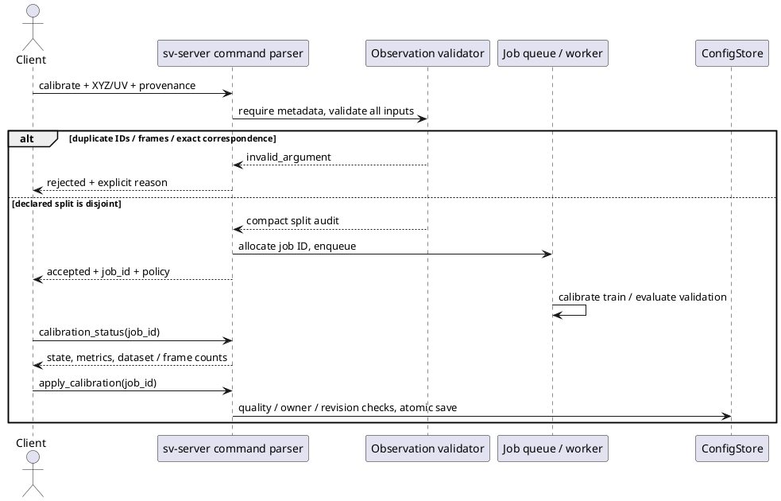

# Серверная проверка разделения калибровочных наблюдений

Дата: 10.10.2026. Исправление риска повторного использования training observations для validation в [[planning/AUDIT]] и [[../TODO]]. Это проверка входного контракта, не новый результат точности калибровки и не доказательство независимости физических измерений.

## Реализация

### Дополнение 11.10.2026: числовой входной контракт

Исправлены два дефекта wire parser перед job manager. Он требовал `as_double()` для XYZ/UV и отклонял корректные целые JSON числа. Кроме того, проверка camera_id выполнялась после `int64 → int`: на проверенном Linux `4294967296` превращалось в индекс 0, а `4294967297` — в 1. До исправления настоящий сервер создал две jobs вместо reject; расширенный `replay_ipc` воспроизвёл оба случая.

`src/apps/command_parameters.hpp` теперь отделяет конечную геометрию от строгих индексов. Geometry принимает int64/uint64/double; bool/string/null/collections не конвертируются. Camera index проверяется в исходном целочисленном типе и только затем сужается. Общий helper применяется к train/validation XYZ/UV и вещественным view commands. Схема SV01, provenance, solver и gate не изменены.

Новый C++ GTest `command_parameters` проверяет три numeric representations, uint64 max для вещественной геометрии, nonfinite values, неподходящие типы и индексные границы до сужения. Интеграционный `replay_ipc` проверяет восемь недопустимых camera IDs и четыре неверных типа в train/validation XYZ/UV: reject без job ID и без изменения config/state revisions. Затем два численно одинаковых запроса — исходный double и mixed integer/double — завершают calibration jobs с quality accepted и совпадающими train/validation/max-error метриками до 9 десятичных знаков. Это проверка представления входных данных, не независимый опыт качества калибровки. NaN/Inf проверяются напрямую в native helper; тест не заявляет передачу этих нестандартных JSON токенов по wire.

### Проверка provenance и разделения наблюдений

После numeric fix полная сборка успешна; `ctest --test-dir build --output-on-failure -j4` — **50/50**, 18.42 s, 11.10.2026. Отдельный targeted запуск `command_parameters|replay_ipc` также прошёл. Данные ниже описывают прежнюю проверку разделения observations; результаты numeric regression не расширяют её выводы о независимости измерений.

`include/sv/calibration_observations.hpp` задаёт логические подструктуры provenance/split/audit. `src/vision/calibration_observations.cpp` разбирает wire metadata и проверяет содержимое. `CalibrationJobManager::submit_job` всегда вызывает validator до блокировки очереди, выделения job ID и вызова calibrator; прямой C++ вызов также обязан передать provenance. Некорректная job не занимает очередь и не меняет конфигурацию.

Условия: по 6..10000 соответствий, одна observation/frame запись на XYZ/UV пару, ограниченные непустые IDs, finite XYZ/UV, valid pixels, уникальные observation IDs. Frame IDs могут повторяться внутри split для разных углов одного снимка, но train/validation frame sets не пересекаются. Точные одинаковые пятёрки `(X,Y,Z,u,v)` не допускаются даже под разными labels. Повторное измерение одной XYZ точки с другим UV и frame ID допустимо. Сравнение exact-content выполняется через ordered set конечных значений: порядок массива и переименование IDs не скрывают точную копию; near duplicates не выявляются.

Результат job сохраняет bounded audit: dataset ID, число наблюдений и уникальных кадров по split. Status доступен только владельцу сессии, как и раньше. Сводка переносится из pending в completed/failed/cancelled результат. Полные ID списки не сохраняются в retained job, исходный dataset/request нужно архивировать на клиенте. Gate 3/8 px, ownership, cancellation и revision-aware apply не изменены.



*Рисунок 1 — Дефектные наблюдения отклоняются до создания асинхронной задачи; применение остаётся отдельной серверной операцией.*

## Воспроизведение проверок

```sh
cmake -S . -B build -DSV_GTEST_TESTS=ON
cmake --build build -j 4
ctest --test-dir build -R 'calibration_observations|calibration_job|replay_ipc|client_transports|server_session' --output-on-failure
```

GTest suite `calibration_observations` содержит 11 tests: допустимая группировка углов по кадрам; общая физическая точка с разными UV; дубли IDs внутри/между split; общие frame IDs; переименованная точная копия; копия внутри train; недостаточные/недопустимые IDs; invalid/non-finite observations; отсутствие enqueue/расхода job ID при reject; malformed JSON. Existing manager test дополнен проверкой сохранения audit после завершения solver и сохраняет ownership/gate/revision/cancellation проверки.

`tests/test_integration.py` запускает настоящий сервер и выполняет четыре отрицательных запроса через Unix SV01: отсутствующее provenance, общий frame, общий observation ID и exact duplicate с разными labels. После них корректный запрос получает `calib-job-1`, завершается accepted quality и возвращает dataset/split counts. Существующие replay/reconnect и Qt offscreen проверки исполняются в том же suite.

## Границы гарантии и миграция

Новая capability `calibration_provenance_v1` объявляется в handshake. Calibration requests без metadata теперь отклоняются; актуальный пример запроса — [[engineering/PROTOCOL_IMPLEMENTED]]. Generic `sv-client-lib` command может передать этот JSON, отдельного typed calibration service пока нет. Сервер не обращается к клиентскому файловому пути и не верифицирует исходный RGB/hash acquisition history.

Клиент может скрыть происхождение данных, изменив ID и координаты; проверка этого не предотвращает. Не обеспечивается независимость соседних кадров одной траектории, разных crop одного кадра с ложными IDs или пересекающихся scene/clip units. Дальнейшая работа: серверный registry записей с проверяемыми content hashes и group-based split; аудит происхождения raw observations; train/validation/test protocol по scene/clip units. До этого validation_policy явно называется `client_declared_frames_and_exact_content_disjoint`, без заявления о доказанной независимости. Методические требования к физической калибровке остаются в [[research/CALIBRATION]] и [[validation/RASTER_CALIBRATION]].

## Выполненная проверка

Полная Linux CMake сборка прошла. 8/8 CTest suites прошли: `calibration_job`, `server_session`, `core`, `vision_tools`, `raster_calibration`, `replay_ipc`, `client_transports`, `calibration_observations`. Последний suite содержит 11 GTest tests; `replay_ipc` — 3 Python integration tests, включая новый calibration protocol case. Полный локальный лог — `artifacts/calibration-provenance-tests.log`; это лог тестов, не latency benchmark или приёмка на Авроре.
