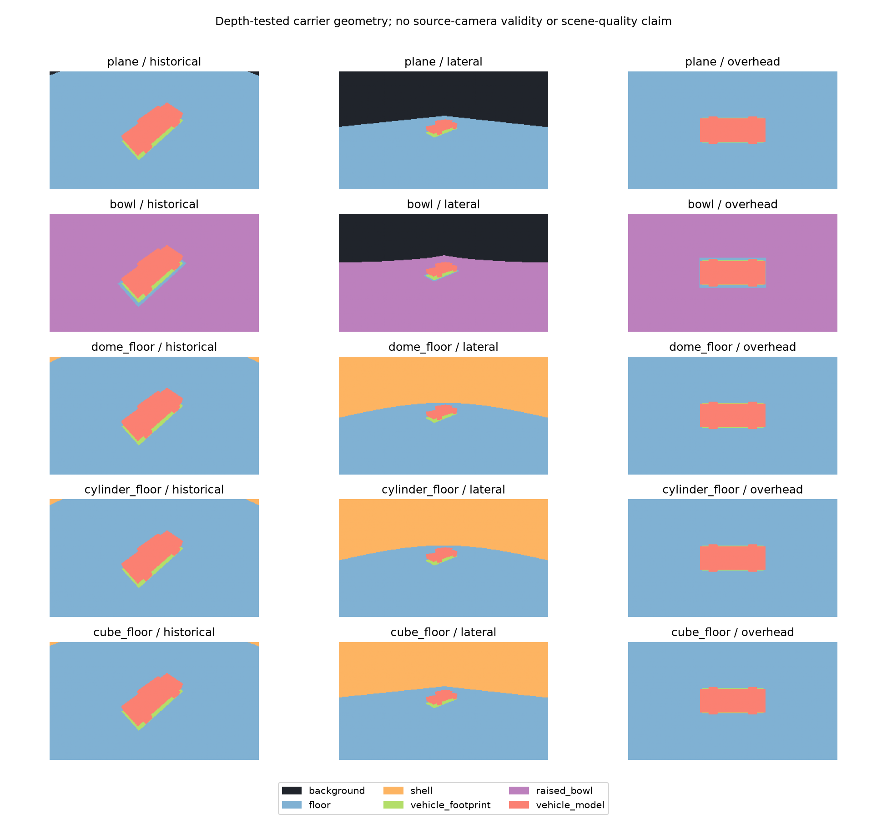

# Что действительно покрывали прежние ракурсы

11.10.2026. Протокол [[research/CARRIER_COVERAGE_PROTOCOL]], frozen plan `configs/research/carrier-coverage-plan.json`, baseline [carrier_coverage_v1.json](baselines/carrier_coverage_v1.json). Выполнены15 native geometry passes и30 пересечений с прежними independently visible interior ROIs. Камерных кадров/новой RGB quality matrix в этом опыте нет.

| Носитель | Shell, historical | Shell, lateral | Background, lateral |
|---|---:|---:|---:|
| plane | 0% | 0% | 42.608% |
| bowl | 0% | 0% | 39.363% |
| dome_floor | 0.325% | 43.944% | 0% |
| cylinder_floor | 0.325% | 43.944% | 0% |
| cube_floor | 0.203% | 42.608% | 0% |

В historical enclosure кадре floor занимает92.606–92.727%; модель автомобиля6.264% и footprint0.806%. У bowl91.842% приходится на поднятую поверхность носителя (world.z>1e−6m),1.089% —на плоский участок. Во всех overhead enclosure кадрах shell0%, floor93.236%; этот ракурс также недостаточен для исследования оболочки. Plane historical оставляет117 background pixels (0.203%); bowl historical закрывает кадр, но это не сохраняется при lateral view.

В прежней RGB interior ROI оболочка dome/cylinder занимает95–187 pixels (0.215–0.428% ROI), cube63–117 pixels (0.143–0.268%). Plane имеет63–117 background pixels внутри той же independently visible ROI: прежняя оценка действительно учитывала часть незаполненного кадра. Historical bowl/все enclosure не имеют background pixels в ROI. Равенство геометрических shell counters dome/cylinder в двух ракурсах не означает равенства их texture projection или качества.



Рисунок1 — native depth-tested region IDs, независимо от изображений камер. Чёрный показывает незакрытый фон; оранжевый —shell; фиолетовый —поднятую поверхность bowl. Модель автомобиля включена для контроля окклюзии.

Прежние mesh-budget/refinement результаты остаются верными для своих кадров, но почти не проверяют оболочку dome/cylinder/cube. Следующая paired RGB серия с lateral view, независимым Blender RGB/object-ID/visibility truth и common floor/shell метриками уже выполнена: [[validation/CARRIER_LATERAL]]; новые views нельзя оценивать по прежнему truth. Также остаются triangle-hit coverage, physical-height truth, другие scene families и полные GPU/memory бюджеты.

## Воспроизведение

Сначала нужны исходные `artifacts/carrier-budget-v1/seed101/*/config.json` и paired captures/inputs seed101–103. Команды из корня репозитория:

```sh
cmake --build build --target sv-carrier-probe -j4
python3 tools/research/carrier_coverage.py --plan configs/research/carrier-coverage-plan.json --root artifacts/carrier-coverage-v1 --probe build/sv-carrier-probe --output artifacts/carrier-coverage-v1/audit.json
```

Без `--probe` команда только повторно проверяет сохранённые masks/reports. Python здесь формирует frozen matrix и проверяет результаты; геометрия и растеризация выполняются C++. Raw artifacts не отслеживаются Git. Рисунок воспроизводится так:

```sh
MPLCONFIGDIR=/tmp/sv-matplotlib python3 docs/diploma/plot_server_boundary.py --report docs/validation/baselines/carrier_coverage_v1.json --captures-root artifacts/carrier-coverage-v1
```

Автоматические native controls: `ctest --test-dir build -R 'render_modes|render_fusion_parity' --output-on-failure`. Renderer inspection не опубликован через клиентский протокол; его дальнейший экспорт относится к intermediate subscriptions.

Проверено в текущей Linux-сборке: полный CTest51/51 (112.78s), затем повтор `render_modes` после добавления явных top/bottom orientation controls. Полный15-mask audit воспроизводится побитно; повреждение raw mask или pixel counters в отдельной временной копии отвергается. Рисунок просмотрен. Время CTest не является pipeline benchmark.
