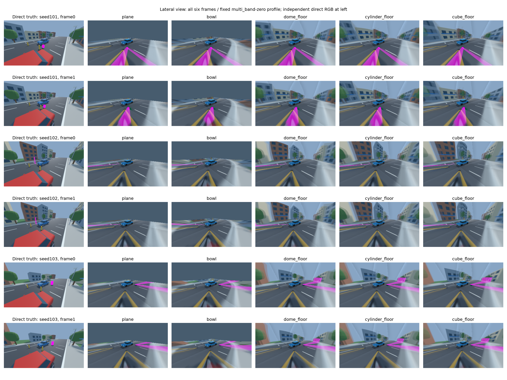
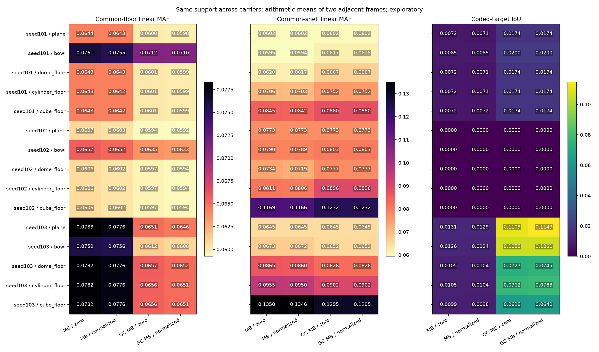

# Сшивка в боковом ракурсе: общая область пола и оболочки

11.10.2026. Протокол [[research/CARRIER_LATERAL_PROTOCOL]], inputs plan `assets/scenarios/carrier-lateral-v1.json`, budget plan `configs/research/carrier-lateral-plan.json`; [полный baseline](baselines/carrier_lateral_v1.json). Это follow-up [[validation/CARRIER_COVERAGE]], а не независимый holdout.

## Что выполнено

Blender5.2.2LTS/MCP protocol13: три заново построенные isolated street instances seeds101–103 с прежними perturbations монтажа и coded targets, по два кадра. Новый view: azimuth0.8/elevation0.35/fov_y1.6rad, distance8.5m, output320×180. Заново экспортированы direct RGB, object-ID, any-camera visibility и source IDs. Исходная активная пользовательская Scene восстановлена.

Камерные RGB всех24 fisheye images совпали с прежней серией **побитно**; manifests SHA256 также совпали для всех трёх seeds. Калибровка, poses/timestamps и весь input config вне virtual_camera совпадают. PNG cubefaces имеют другие file hashes из-за контейнерного содержимого, но decoded RGB одинаков. Проверка equality выполняется в audit, не предполагается по имени seed. Новый direct truth соответствует новому view; прежний truth не переиспользуется.

15 fresh sv-server процессов, пять medium meshes, четыре native mode/boundary profiles,2 frames×(warmup2+repeats7):1080 samples,840 measurement RGBA captures,120 quality conditions. SV01 команды выполняет C++ `svctl research` через sv-client-lib; Python только запускает эти инструменты и проверяет результаты. Source fingerprint `601a3878ba99e6bc953756bbc0c40e969fdb0c89c5d7487349332b7960ac87f4`. Build metadata содержит base source_revision2240202 (сборка с рабочими изменениями native inspection, позднее сохранёнными в27f1cc2); точный product tree идентифицирует fingerprint, а не один HEAD. Product C++ в этом этапе не изменялся; используется native geometry inspection предыдущего этапа. Обычные server samples не включают inspection pass.

## Одинаковый support для сравнения

Native region masks трёх enclosure задают common floor/shell: во всех трёх masks ID1 или ID2 соответственно. Обе области пересекаются с independently visible non-ego interior ROI. Остаток сохраняется отдельно, weighted MAE трёх частей воспроизводит прежнее aggregate определение с tolerance1e−12. Эти masks одинаковы для всех пяти outputs одного кадра. Shell здесь означает часть носителя, не физическую высоту scene object.

| Seed / кадр | Common floor pixels | Common shell pixels | Other pixels |
|---|---:|---:|---:|
| 101 / 0 | 16738 | 4548 | 142 |
| 101 / 1 | 16106 | 4356 | 121 |
| 102 / 0 | 16966 | 5844 | 193 |
| 102 / 1 | 16279 | 5624 | 210 |
| 103 / 0 | 16729 | 4170 | 182 |
| 103 / 1 | 16013 | 4042 | 163 |

Shell теперь представлен4042–5844 pixels на общей quality ROI вместо95–187 carrier-shell pixels прежнего view. Это разные лучи/ROI; величину RGB MAE между этими view нельзя трактовать как разность на одном изображении.

## Результаты

Разности относительно dome на24 scene/frame/profile условиях; отрицательная ΔMAE лучше. Все значения linear RGB [0,1].

| Носитель | Common-shell RGB лучше / хуже dome | ΔMAE shell, диапазон | Aggregate RGB лучше / хуже dome |
|---|---:|---:|---:|
| plane | 17 / 7 | -0.024566…+0.006843 | 16 / 8 |
| bowl | 16 / 8 | -0.022271…+0.008691 | 10 / 14 |
| cylinder_floor | 0 / 24 | +0.005822…+0.014484 | 0 / 24 |
| cube_floor | 0 / 24 | +0.019735…+0.049332 | 0 / 24 |

В этой постановке dome имеет меньшую shell и aggregate RGB MAE, чем cylinder/cube, во24/24 парах с каждым. На common floor cylinder/cube немного лучше dome в17/24 и18/24, но разницы малы: max absolute ΔMAE около5.15e−5. Следовательно, отличие оболочки теперь влияет на результат заметнее прежнего floor-dominated view. Три экземпляра одного семейства, два кадра и один lateral view не позволяют утверждать универсальное превосходство dome.

Plane/bowl оставляют42.608%/39.363% полного кадра без геометрии. Постоянный background плоскости иногда даёт меньшую RGB MAE на common-shell ROI, чем искажённое изображение оболочки. Это **не** успешная реконструкция: coverage и соответствие объектов остаются самостоятельными критериями. Нельзя выбрать незамкнутый носитель только по MAE, если требуется обволакивающее изображение.

Normalized boundary снижает aggregate и common-floor MAE во60/60 парах. На common shell улучшение42/60, ухудшение4/60, совпадение14/60; ΔMAE от−0.001575 до+0.0000383. Все четыре ухудшения относятся к graph_cut_multi_band/bowl seeds101/103. Coded IoU улучшилась13/60, ухудшилась10/60, совпала37/60. Поэтому normalized также не является безусловным победителем по всем критериям.

В seed102 pole имеет64/62 direct object-ID pixels, но IoU=0 во всех40 outputs этой сцены: output/target не пересекаются после заданной component policy, это не пустой truth. Для seed101 IoU0.00633–0.02885, seed1030.00960–0.13559. На рисунках видны протяжённые следы поднятых объектов, включая растянутую coded texture; эти результаты согласуются с ограничением единого carrier при параллаксе. Опыт не отделяет все источники ошибки — геометрию, sampling и fusion — и не является natural-object correspondence/ghost-trail измерением.



Рисунок1 — все шесть кадров, слева новый direct RGB truth, далее пять server outputs при заранее выбранном multi_band/zero. Красный автомобиль на переднем плане truth —припаркованный объект сцены, ego —синий автомобиль ближе к центру; искажение parked car относится к реконструкции поднятых объектов.



Рисунок2 — common-floor/common-shell RGB MAE и coded-target IoU; арифметические средние двух соседних кадров, все15 scene/carrier групп и четыре profiles. Средние не являются независимыми replicates или доверительным интервалом.

## Повторение и ограничения

Capture и native commands: [[engineering/BLENDER#Боковой ракурс с независимым truth]], [[engineering/USAGE#Сшивка в боковом ракурсе]]. Read-only повтор всех input/report/RGBA/region checks:

```sh
python3 tools/research/carrier_lateral.py --plan configs/research/carrier-lateral-plan.json --root artifacts/carrier-lateral-v1 --inputs artifacts/carrier-lateral-inputs-v1 --output artifacts/carrier-lateral-v1/audit.json
MPLCONFIGDIR=/tmp/sv-matplotlib python3 docs/diploma/plot_server_boundary.py --report artifacts/carrier-lateral-v1/audit.json --captures-root artifacts/carrier-lateral-v1 --inputs-root artifacts/carrier-lateral-inputs-v1
```

Fixed carrier order/без thermal control: timings описательные, speed ranking не выполняется. Это paused sequence, не FPS/длительная стабильность. Известна истинная perturbed calibration, поэтому accuracy solver не исследуется. Raw inputs/reports сохраняются в ignored artifacts, recipes/code/baseline/figures —в Git без LFS. Sandbox bind failure сохранён отдельно в `artifacts/carrier-lateral-v1-sandbox-failed`; успешная матрица его не включает.

Остаются независимые scene families/ракурсы, physical-height и correspondence truth, controlled geometry/parallax ablation, spatial triangle-hit/resolution sensitivity, длинные клипы и целевой аппаратный стенд. Сам этот lateral follow-up завершён; он не закрывает весь E-STITCH-01.

Проверки этого этапа: CTest render_modes/blender_fixture/object_metrics/render_fusion_parity —4/4 (5.89s); все120 quality conditions повторно audited, native output repeatability/restore и weighted ROI identity проверены. Неверный frozen view и попытка соединить новые inputs с historical truth отвергаются. Decoded RGB всех120 camera cubefaces также совпали с прежними. Python syntax checks прошли; обе фигуры просмотрены. Полный CTest51/51 выполнен на предыдущем этапе того же product C++, новый full-suite прогон здесь не заявляется.
