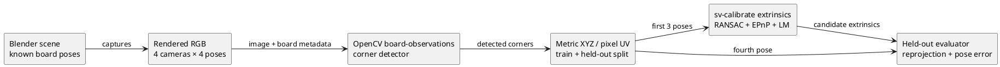

# E-CAL-IMG-01: image-derived calibration on Blender captures

**Date:** 07.10.2026
**Status:** completed first synthetic image-derived proof; physical validation remains open.
**Inputs:** `artifacts/blender-board-v9` (local generated dataset)
**Study output:** `artifacts/image-calibration-v2` (local generated report)

## Question and protocol

Does the implemented image path detect a metric planar target in rendered fisheye camera images and provide observations that let the existing extrinsic solver recover a perturbed four-camera rig on poses not used for fitting?

The Blender scene renders a 9×6 inner-corner chessboard with 0.2 m squares. Each camera sees four different board poses. The capture generator stores the board transform in vehicle coordinates with its origin at the lower-left **inner** corner, matching `board-observations`; the mesh is shifted by one square for rendering its outer border. Corner order is stored from the procedural scene because a symmetric chessboard has no intrinsic orientation marker. The native OpenCV detector finds image corners and writes metric vehicle XYZ/pixel UV pairs plus annotated images. The first three poses per camera train `ransac_epnp_lm`; the fourth is held out.

Known intrinsics and board-to-vehicle transforms are supplied. Only camera extrinsics are estimated. This tests Blender RGB → native detector → metric correspondences → OpenCV fit → independent-pose reprojection; it does not test physical target surveying, automatic target orientation, runtime server jobs, or the calibration of intrinsics.



*Figure 1 — Data flow used by the first image-derived calibration experiment. The held-out view is evaluated separately from the solver input.*

## Results

All 16 camera views were detected, with 54/54 inner corners in every held-out view. The held-out reprojection results are:

| Camera | Train corners | Held-out corners | Nominal RMSE, px | Recovered RMSE, px | Recovered p95, px | Rotation error, ° | Center error, m |
|---:|---:|---:|---:|---:|---:|---:|---:|
| 0 | 162 | 54 | 21.48076 | 0.13874 | 0.23731 | 0.10815 | 0.00616 |
| 1 | 162 | 54 | 17.43318 | 0.14574 | 0.24539 | 0.14034 | 0.00698 |
| 2 | 162 | 54 | 14.15524 | 0.13269 | 0.22528 | 0.08425 | 0.00443 |
| 3 | 162 | 54 | 12.95263 | 0.14605 | 0.26032 | 0.11451 | 0.00625 |


*Figure 2 — Held-out Blender RGB observations (cyan) with nominal projection (red) and recovered projection (green). The image is a visual companion to the numeric metrics, not an independent physical reference.*

All 162 training points per camera were inliers. The fit RMSE on training views was 0.120–0.165 px. The large held-out nominal residual falls to 0.133–0.146 px after recovery, consistent with subpixel corner/detector and render sampling error in this controlled synthetic setup.

## Reproduction

The Blender capture uses the mount-error recipe and the board option. Run each command from the repository root and use a new output path:

```sh
blender --background --python tools/blender/scene.py -- \
  --scenario assets/scenarios/mount-errors-v1.json \
  --output artifacts/board-capture --frames 4 --face-size 512 --calibration-boards
python3 tools/blender/convert.py --capture artifacts/board-capture \
  --output artifacts/board-data
python3 tools/configurator.py calibrate-images --dataset artifacts/board-data \
  --output artifacts/board-calibration --build build --training-frames 3
```

If Blender CLI is unavailable, the same capture functions can be called in the already connected Blender through MCP; `docs/engineering/BLENDER.md` records the procedure. The converter creates `calibration-board-captures.json`. The study command runs `sv-calibrate board-observations` separately on train and held-out frames, fits only train observations, and writes `REPORT.md`, `report.json`, observations, annotations, and the candidate config.

The recorded run used Blender 5.2.2 LTS and C++ OpenCV 5.0.0. `report.json` records SHA-256 values for the capture, input manifest, train and validation observations, and calibration binary. The locally generated `artifacts/` dataset is intentionally not checked into Git; the scene and study scripts are the reproducible source.

## Limits and next experiment

This is one procedural scene, one symmetric planar target, four poses, a known camera model, exact board poses, and one held-out pose. The synthetic corner ordering comes from scene truth; a physical checkerboard requires a fiducial/asymmetric pattern or operator verification. No occlusion, glare, blur, motion, partial-board, target survey error, lens-model error, or illumination sweep was made. These results therefore establish that the image-derived software path executes end to end, not that it meets an automotive calibration tolerance.

Next compare symmetric checkerboard, ChArUco/AprilTag-style coded targets, and ground/raised nonplanar points; vary pose diversity, target survey error, occlusion and image quality; use separate scenes and more held-out poses; then repeat with measured physical images. Add a server calibration job only after the offline candidate has a documented quality gate and independent validation. See [[research/IMAGE_CALIBRATION]], [[research/MOUNT_CALIBRATION]], and the remaining calibration tasks in `TODO.md`.
