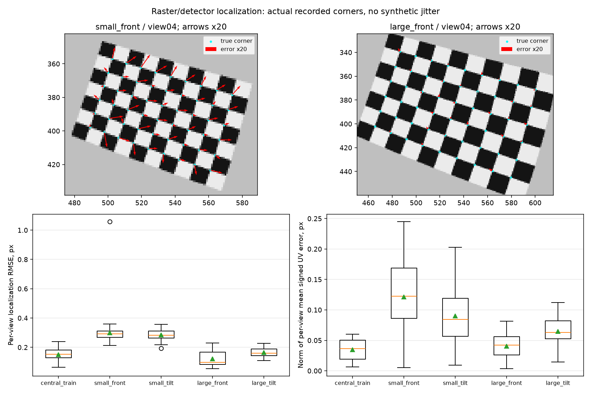
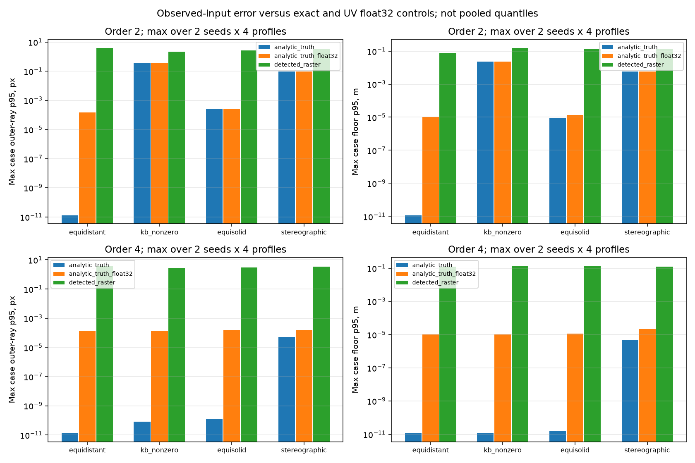

# E-CAL-diagnostic-01: наблюдения, округление и модельная ошибка

Дата: 10.10.2026. Диагностика [[CALIBRATION_CAPTURE_FACTORS]], частичное выполнение этапа 3 [[planning/ROADMAP]]. Протокол [[research/INTRINSIC_DIAGNOSTIC_PROTOCOL]] зафиксирован коммитом `b2cdcc0` до новых fit runs. Исходные capture cases уже просмотрены, поэтому это exploratory mechanism ablation, не новые независимые сцены и не confirmatory holdout.

## Реализованный диагностический путь

`sv-calibrate diagnose-intrinsics` читает JSON с размерами доски/изображения и UV по каждому train/validation view, затем вызывает **то же `sv::calibrate_intrinsics`**. Flags, число итераций, stopping epsilon, order=2/4 и monotonicity domain сохраняются. Detector не вызывается: координаты предоставляются явно. Новый режим пишет только `diagnostics.json` со статусом `diagnostic_only` и embedded estimate, не `intrinsics.json`; successful fit **не является принятой или применённой калибровкой**. Production `intrinsics` и его p95 gate не изменены.

Режим проверяет schema/purpose, origin label, resolution/board/domain, view counts, IDs, количество и границы UV, finite values и повторные аргументы. Dataset ограничен 8 MiB; существующий output не перезаписывается; hash файла контролируется при чтении и после fit. IDs и origin являются заявленными метаданными, не аутентифицируют источники или независимость. Этот режим не добавляет серверный registry и не заменяет provenance checks.

OpenCV fisheye model/API: [официальная документация](https://docs.opencv.org/4.13.0/db/d58/group__calib3d__fisheye.html); generative projections: [Kannala–Brandt](https://users.aalto.fi/~kannalj1/calibration/Kannala_Brandt_calibration.pdf). Результаты ниже получены собственным исполнением OpenCV 5.0.0, не взяты из источников.

## Парное сравнение

Все 64 исходных сочетания family/seed/profile/order сохраняют ровно 12 train views и те же 12 validation poses. Сравниваются три train inputs:

| Origin | Обучающие координаты | Что проверяется |
|---|---|---|
| analytic_truth | Double forward UV физических углов | Идеальные наблюдения, оставшаяся модельная/solver ошибка |
| analytic_truth_float32 | Те же UV после float32→double | Влияние округления UV отдельно от raster/detector |
| detected_raster | Сохранённые production detector coordinates | Воспроизведение прежней калибровки |

Валидационные UV во **всех трёх вариантах exact и одинаковые**. Их residual всё ещё использует отдельно подбираемую board pose. Сравнивать его напрямую с прежним gate residual на detected validation нельзя. Oracle metrics сохраняют общие true ray/plane points и 12 fixed true board poses, без pose fitting.

Unmarked board имеет 180° indexing ambiguity. Чтобы сохранить original detector ordering, при необходимости разворачиваются truth coordinates; detected coordinates не меняются. На всех 384 исходных изображениях выбран reversed truth order; это допустимая ориентация сетки, а не 384 detector failures. Выравнивание использует известную синтетическую геометрию и не предлагается как автоматический способ определения физических board IDs.

Выполнены **192 diagnostic fits, 192 successful exports**; invalid floor points=0. Отказы solver/monotonicity сохранялись бы как missing metrics, не нули; в этой серии их нет. Ни для одного из 192 outputs acceptance gate не исполнялся.

64 detected-input estimates сравнены с прежними production central-gate estimates: все совпадают в пределах заранее заданного 1e-7; фактическая max разность fx/fy/cx/cy/k — **6.2528×10⁻¹³**. Новая exact validation не изменила train fit. Это проверяет корректность replay для данной версии core/inputs; не доказывает переносимость всех цифр на другой OpenCV/toolchain.

## Localization до solver

Для каждого view сохраняются signed UV mean/std, RMSE/p95 и radial/tangential projections относительно истинного principal point:

$$\delta_i=u_i^{det}-u_i^{true},\quad b=\frac1N\sum_i\delta_i,$$

$$a_i=\frac{u_i^{true}-c}{\|u_i^{true}-c\|},\quad
\delta_{r,i}=\delta_i^T a_i,\quad \delta_{t,i}=\delta_i^T(-a_{iy},a_{ix}).$$

На optical axis radial/tangential direction не определено; такие точки исключаются только из этих двух компонентов и учитываются count. Euclidean/UV ошибки остаются определёнными. Данные — результат inverse-ray rasterization, 2×2 pixel integration, quantization и реального SB detector; это не искусственный coordinate jitter.



*Рисунок 1 — Верх: kb_nonzero/7101/view04, crop исходного PNG, true corners и векторы detected−true, увеличенные в 20 раз. Низ: per-view ошибки по всем families/seeds; 32 central_train views и по 64 peripheral views на profile. Коррелированные views/corners не считаются независимыми физическими trials.*

Медиана per-view RMSE для small_front≈0.2917 px, large_front≈0.0976 px; медиана нормы mean UV bias≈0.1227 и 0.0425 px. Это описательная свёртка по текущим cases, не universal detector benchmark. Меньшая средняя localization error не гарантирует меньшую floor error: направление ошибок и чувствительность fit также имеют значение; Jacobian/conditioning пока не измерены. Есть отдельный RMSE≈1.0579 px у equisolid/7102/small_front/view01; этот кадр не исключён из fit.

## Разделение совпадающей и приближённой модели

**Matched subset, 24 cases:** equidistant при order2/4 и kb_nonzero при order4. Истинная радиальная функция входит в выбранный polynomial family.

**Approximation subset, 40 cases:** kb_nonzero/order2, equisolid/order2/4, stereographic/order2/4. Ограниченный полином не обязан точно воспроизводить истинную функцию. Совпадение generative family и solver — математическая предпосылка, не условие отбора по полученной ошибке.

В таблице приведён **максимум отдельных case p95**, а не pooled p95 всех углов/лучей.

| Subset | Origin | Cases | Max outer-ray p95, px | Max floor p95, m |
|---|---|---:|---:|---:|
| matched | analytic_truth | 24 | 7.977584e-11 | 1.142935e-11 |
| matched | analytic_truth_float32 | 24 | 0.0001472505 | 1.058564e-05 |
| matched | detected_raster | 24 | 3.900102 | 0.1368842 |
| approximation | analytic_truth | 40 | 0.3603948 | 0.02274621 |
| approximation | analytic_truth_float32 | 40 | 0.3604357 | 0.02274419 |
| approximation | detected_raster | 40 | 3.496558 | 0.1551306 |



*Рисунок 2 — Максимум case p95 по 2 seeds×4 capture profiles отдельно для каждой family/order/origin. Шкала логарифмическая; near-zero exact values отражают предел численного расчёта идеальной синтетики, не точность физического сенсора. Все 192 модели представлены в полном отчёте.*

Для matched cases exact input даёт outer p95≤7.98×10⁻¹¹ px, floor p95≤1.15×10⁻¹¹ м. UV float32 control даёт не более 1.48×10⁻⁴ px и 1.06×10⁻⁵ м. Detected-input maxima — 3.9001 px и 0.1369 м. На этих cases одно округление UV до float32 не объясняет прежние ошибки. Они появляются при замене идеальных UV результатом всей raster/detector цепочки и передаются через тот же solver. Это не оценка condition number и не доказательство общей устойчивости solver к произвольным данным.

При approximation models exact input оставляет до 0.3604 px outer p95 и 0.02275 м floor p95. Поэтому нельзя всю ненулевую ошибку объявить detector bias: даже идеальные наблюдения не устраняют model mismatch. Суммарные эффекты нелинейны; разность двух p95 не является строгой аддитивной декомпозицией дисперсии.

Пример kb_nonzero/7101/order4:

| Profile | Origin | Outer p95, px | Floor p95, m | Exact-validation pose-fitted p95, px |
|---|---|---:|---:|---:|
| small_front | analytic_truth | 4.507798e-11 | 1.129784e-11 | 1.806365e-06 |
| small_front | analytic_truth_float32 | 6.397304e-05 | 5.987977e-06 | 2.548472e-06 |
| small_front | detected_raster | 1.484345 | 0.02411259 | 0.08413359 |
| large_front | analytic_truth | 7.977584e-11 | 1.142935e-11 | 1.834622e-06 |
| large_front | analytic_truth_float32 | 4.85203e-05 | 7.037718e-06 | 2.92264e-06 |
| large_front | detected_raster | 1.195089 | 0.1368842 | 0.02728291 |

При detected inputs увеличение доски уменьшает outer error, но floor error растёт 0.0241→0.1369 м. При exact inputs обе позовые конфигурации восстанавливаются почти точно; при float32 errors микроскопические. Это уточняет предыдущий контрпример: конкретная комбинация localization field и fit важнее одного scalar размера доски. Не установлено, какие отдельные компоненты bias и параметров ответственны за усиление; нужны controlled perturbations/normalized sensitivity и анализ coupled K/k/pose errors.

## Полная парная таблица

Каждая тройка значений имеет порядок exact / float32 / detected. Значения near zero представлены scientific notation, не округлены до физического нуля.

| Family | Seed | Profile | Order | Outer p95 exact / float32 / detected, px | Floor p95 exact / float32 / detected, m |
|---|---:|---|---:|---|---|
| equidistant | 7101 | small_front | 2 | 1.26291e-11 / 3.94509e-05 / 2.33873 | 1.13218e-11 / 1.80355e-06 / 0.0586123 |
| equidistant | 7101 | small_front | 4 | 1.2843e-11 / 4.77931e-05 / 1.75843 | 1.13279e-11 / 2.11186e-06 / 0.121285 |
| equidistant | 7101 | small_tilt | 2 | 1.20521e-11 / 5.08214e-05 / 3.9001 | 1.13259e-11 / 1.28955e-06 / 0.0773022 |
| equidistant | 7101 | small_tilt | 4 | 1.1794e-11 / 4.22034e-05 / 3.87057 | 1.13271e-11 / 8.19687e-07 / 0.0511003 |
| equidistant | 7101 | large_front | 2 | 1.14128e-11 / 3.51e-05 / 1.73986 | 1.13289e-11 / 3.00592e-06 / 0.019025 |
| equidistant | 7101 | large_front | 4 | 1.18488e-11 / 4.12875e-05 / 1.29579 | 1.13245e-11 / 2.72437e-06 / 0.0238641 |
| equidistant | 7101 | large_tilt | 2 | 1.103e-11 / 5.91761e-05 / 1.78213 | 1.13301e-11 / 3.25811e-06 / 0.019645 |
| equidistant | 7101 | large_tilt | 4 | 1.12385e-11 / 4.00879e-05 / 1.67167 | 1.13301e-11 / 2.95344e-06 / 0.024528 |
| equidistant | 7102 | small_front | 2 | 1.09459e-11 / 4.67301e-05 / 1.07003 | 1.13256e-11 / 1.85037e-06 / 0.0737194 |
| equidistant | 7102 | small_front | 4 | 1.06593e-11 / 3.79675e-05 / 1.55311 | 1.13228e-11 / 1.58282e-06 / 0.067829 |
| equidistant | 7102 | small_tilt | 2 | 1.09231e-11 / 0.000147251 / 1.93032 | 1.13215e-11 / 1.05856e-05 / 0.037724 |
| equidistant | 7102 | small_tilt | 4 | 1.08304e-11 / 0.00013225 / 3.06197 | 1.13254e-11 / 1.0361e-05 / 0.0445774 |
| equidistant | 7102 | large_front | 2 | 1.09138e-11 / 4.71926e-05 / 0.470358 | 1.13185e-11 / 7.42595e-07 / 0.0202949 |
| equidistant | 7102 | large_front | 4 | 1.09758e-11 / 4.26819e-05 / 0.268541 | 1.13215e-11 / 7.68375e-07 / 0.0124519 |
| equidistant | 7102 | large_tilt | 2 | 1.07475e-11 / 8.41628e-05 / 3.0633 | 1.13173e-11 / 3.46947e-06 / 0.0795904 |
| equidistant | 7102 | large_tilt | 4 | 1.07049e-11 / 9.56865e-05 / 3.46245 | 1.13202e-11 / 3.04455e-06 / 0.0779588 |
| kb_nonzero | 7101 | small_front | 2 | 0.260234 / 0.260269 / 1.15651 | 0.0185178 / 0.0185136 / 0.0668991 |
| kb_nonzero | 7101 | small_front | 4 | 4.5078e-11 / 6.3973e-05 / 1.48435 | 1.12978e-11 / 5.98798e-06 / 0.0241126 |
| kb_nonzero | 7101 | small_tilt | 2 | 0.0917696 / 0.0918391 / 1.73774 | 0.00297122 / 0.0029734 / 0.0716666 |
| kb_nonzero | 7101 | small_tilt | 4 | 1.4026e-11 / 5.32077e-05 / 1.68163 | 1.1296e-11 / 2.25016e-06 / 0.0698523 |
| kb_nonzero | 7101 | large_front | 2 | 0.360395 / 0.360436 / 1.10611 | 0.0227462 / 0.0227442 / 0.155131 |
| kb_nonzero | 7101 | large_front | 4 | 7.97758e-11 / 4.85203e-05 / 1.19509 | 1.14293e-11 / 7.03772e-06 / 0.136884 |
| kb_nonzero | 7101 | large_tilt | 2 | 0.245999 / 0.246053 / 0.829084 | 0.0180833 / 0.0180843 / 0.0435659 |
| kb_nonzero | 7101 | large_tilt | 4 | 2.15793e-11 / 5.68177e-05 / 1.02621 | 1.13317e-11 / 1.28601e-06 / 0.0310705 |
| kb_nonzero | 7102 | small_front | 2 | 0.183458 / 0.183517 / 1.19769 | 0.00438101 / 0.00437313 / 0.0750984 |
| kb_nonzero | 7102 | small_front | 4 | 2.32351e-11 / 0.000134015 / 1.56679 | 1.12816e-11 / 1.02913e-05 / 0.0771158 |
| kb_nonzero | 7102 | small_tilt | 2 | 0.210266 / 0.210323 / 2.19223 | 0.00233705 / 0.00233391 / 0.0615379 |
| kb_nonzero | 7102 | small_tilt | 4 | 1.63566e-11 / 7.26674e-05 / 2.56742 | 1.13409e-11 / 5.94702e-06 / 0.0404787 |
| kb_nonzero | 7102 | large_front | 2 | 0.261323 / 0.26142 / 1.69908 | 0.00501828 / 0.00501158 / 0.0540858 |
| kb_nonzero | 7102 | large_front | 4 | 3.24164e-11 / 0.000123369 / 2.05653 | 1.13333e-11 / 9.82788e-06 / 0.0442848 |
| kb_nonzero | 7102 | large_tilt | 2 | 0.202621 / 0.202702 / 1.55593 | 0.00637817 / 0.00637778 / 0.0248207 |
| kb_nonzero | 7102 | large_tilt | 4 | 1.46241e-11 / 9.17089e-05 / 1.33239 | 1.13407e-11 / 9.99424e-07 / 0.0162609 |
| equisolid | 7101 | small_front | 2 | 0.000139567 / 0.000167912 / 1.49212 | 5.69502e-06 / 3.70704e-06 / 0.049589 |
| equisolid | 7101 | small_front | 4 | 1.21033e-10 / 3.70754e-05 / 1.45144 | 1.27605e-11 / 2.22589e-06 / 0.0730214 |
| equisolid | 7101 | small_tilt | 2 | 0.000129455 / 7.70494e-05 / 2.12042 | 2.45994e-06 / 1.74783e-06 / 0.0520658 |
| equisolid | 7101 | small_tilt | 4 | 1.31575e-10 / 6.81362e-05 / 2.17282 | 1.25257e-11 / 9.45636e-07 / 0.044831 |
| equisolid | 7101 | large_front | 2 | 0.000187132 / 0.000190997 / 1.71933 | 9.0417e-06 / 1.35051e-05 / 0.0245206 |
| equisolid | 7101 | large_front | 4 | 4.30567e-11 / 4.09002e-05 / 1.48663 | 1.2421e-11 / 5.58041e-06 / 0.0184808 |
| equisolid | 7101 | large_tilt | 2 | 0.00024172 / 0.000253921 / 1.55608 | 8.89489e-06 / 1.16488e-05 / 0.0552306 |
| equisolid | 7101 | large_tilt | 4 | 1.00259e-10 / 6.92872e-05 / 1.27803 | 1.66116e-11 / 3.14977e-06 / 0.0820978 |
| equisolid | 7102 | small_front | 2 | 8.11349e-05 / 0.000132248 / 1.67506 | 3.60515e-06 / 2.85519e-06 / 0.0658727 |
| equisolid | 7102 | small_front | 4 | 6.88238e-11 / 8.29622e-05 / 1.26479 | 1.13225e-11 / 3.25062e-06 / 0.0528217 |
| equisolid | 7102 | small_tilt | 2 | 0.000104862 / 0.000242189 / 1.30602 | 1.86497e-06 / 9.63853e-06 / 0.0655923 |
| equisolid | 7102 | small_tilt | 4 | 9.67419e-11 / 0.000162551 / 1.50477 | 1.13468e-11 / 1.14402e-05 / 0.0736179 |
| equisolid | 7102 | large_front | 2 | 0.000111329 / 0.000133609 / 0.943954 | 5.89976e-06 / 9.5847e-06 / 0.0850182 |
| equisolid | 7102 | large_front | 4 | 3.48519e-11 / 5.10146e-05 / 1.23066 | 1.13728e-11 / 2.67775e-06 / 0.0704452 |
| equisolid | 7102 | large_tilt | 2 | 0.00010688 / 8.20273e-05 / 2.71194 | 5.40647e-06 / 2.72681e-06 / 0.13075 |
| equisolid | 7102 | large_tilt | 4 | 2.98023e-11 / 5.24279e-05 / 2.90589 | 1.15218e-11 / 2.6876e-06 / 0.133958 |
| stereographic | 7101 | small_front | 2 | 0.0572887 / 0.0573697 / 1.82515 | 0.00351558 / 0.00351482 / 0.0777283 |
| stereographic | 7101 | small_front | 4 | 5.33488e-05 / 7.48256e-05 / 0.859417 | 2.13802e-06 / 7.3454e-06 / 0.0269616 |
| stereographic | 7101 | small_tilt | 2 | 0.0271268 / 0.0271074 / 2.87855 | 0.000463483 / 0.000463175 / 0.0370824 |
| stereographic | 7101 | small_tilt | 4 | 5.06024e-05 / 0.00015512 / 2.38048 | 1.3245e-06 / 6.76316e-06 / 0.0494059 |
| stereographic | 7101 | large_front | 2 | 0.093414 / 0.0934342 / 1.16621 | 0.0056957 / 0.00569278 / 0.0987756 |
| stereographic | 7101 | large_front | 4 | 2.30133e-05 / 9.91672e-05 / 1.29682 | 2.10183e-06 / 6.60476e-06 / 0.0413378 |
| stereographic | 7101 | large_tilt | 2 | 0.0931527 / 0.0932265 / 1.47406 | 0.0056733 / 0.00566132 / 0.130783 |
| stereographic | 7101 | large_tilt | 4 | 4.38458e-05 / 0.000138029 / 1.46383 | 4.49599e-06 / 2.11368e-05 / 0.102377 |
| stereographic | 7102 | small_front | 2 | 0.0394142 / 0.039329 / 2.80825 | 0.00084693 / 0.000851339 / 0.124321 |
| stereographic | 7102 | small_front | 4 | 2.25081e-05 / 0.000155308 / 3.14997 | 5.452e-07 / 7.49032e-06 / 0.119505 |
| stereographic | 7102 | small_tilt | 2 | 0.0443238 / 0.0442689 / 1.47791 | 0.000533696 / 0.000537136 / 0.0503661 |
| stereographic | 7102 | small_tilt | 4 | 3.63901e-05 / 0.000115576 / 1.39478 | 3.05837e-07 / 6.80843e-06 / 0.043861 |
| stereographic | 7102 | large_front | 2 | 0.0643398 / 0.0642748 / 3.48137 | 0.00110333 / 0.00110665 / 0.0861812 |
| stereographic | 7102 | large_front | 4 | 2.47935e-05 / 0.000126338 / 3.49656 | 7.58284e-07 / 8.13594e-06 / 0.088316 |
| stereographic | 7102 | large_tilt | 2 | 0.0566673 / 0.0566341 / 3.30351 | 0.00175183 / 0.00175931 / 0.0734607 |
| stereographic | 7102 | large_tilt | 4 | 3.18152e-05 / 9.20667e-05 / 3.13715 | 6.23752e-07 / 1.00209e-05 / 0.0675496 |

## Воспроизведение и проверки

```sh
cmake -S . -B build
cmake --build build --target sv-calibrate -j 4
# Если parent capture отсутствует, создать его заново:
python3 tools/configurator.py compare-capture --output artifacts/calibration-capture-repeat --seeds 7101 7102
python3 tools/configurator.py diagnose-capture --input artifacts/calibration-capture-repeat --output artifacts/calibration-diagnostic-repeat
MPLCONFIGDIR=/tmp/sv-mpl python3 docs/diploma/plot_intrinsic_diagnostics.py --results artifacts/calibration-diagnostic-repeat --input artifacts/calibration-capture-repeat
ctest --test-dir build -R 'intrinsic_diagnostics|vision_tools|calibration_capture_factors|optical_models' --output-on-failure
```

При наличии исходного `artifacts/calibration-capture-v1` его можно передать через `--input`, без повторного создания PNG/детекций. Output должен быть новым. Python NumPy/SciPy/Pillow/Matplotlib и собранный C++ OpenCV binary; Python cv2/Blender не нужны. Parent numerical core hashes должны совпадать с текущими; историческую серию после изменения core запускайте на соответствующей версии Git. Для совпадения исторических image/detection/fit hashes требуется также исходная версия OpenCV/toolchain.

[Сохранённый полный summary](baselines/calibration_diagnostic_v2.json) содержит 192 estimates/reports, stdout/stderr, 384 signed localization records, parent/source/binary/input hashes и replay comparisons. Проверены 96 новых dataset hashes, 768 parent image/detection hashes, parent summary и выбранные source/binary hashes. Во время серии код/binary и parent inputs заморожены; изменившиеся hashes препятствуют выпуску summary. Raw diagnostic JSON остаются в `artifacts/` и восстанавливаются кодом.

6 новых тестов проверяют exact recovery/explicit nonacceptance, float32/order2, 15 некорректных input cases, недопустимые/repeated аргументы и попытку gate override, signed radial/tangential known answer с 180° reversal, optical axis/невалидную localization. Все 10 CTest suites прошли: `calibration_job`, `vision_tools`, `optical_models`, `calibration_coverage`, `calibration_capture_factors`, `intrinsic_diagnostics`, `raster_calibration`, `calibration`, `real_data_calibration`, `calibration_observations`.

Следующее исследование normalized sensitivity/conditioning завершено в начальной форме: направленные finite responses — [[CALIBRATION_SENSITIVITY]], полный joint Jacobian и условные uncertainty — [[JOINT_CALIBRATION_INFORMATION]]. Остаются targeted signed-component/pose attribution, robust fit ablation без oracle selection; paired raster blur/noise, nonradial/extrinsic/ground-height errors, physical acceptance criteria и реальные снимки. Совокупность текущих diagnostic studies не обосновывает production thresholds и не подтверждает точность на Авроре/автомобиле.
