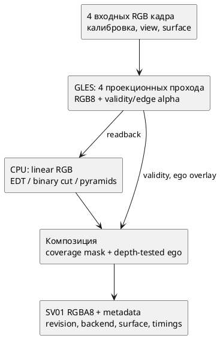

# Серверные реализации сшивки и переключение носителя

Срез 10.10.2026. Реализация: `src/fusion/`, `src/render/renderer.cpp`, `src/apps/server.cpp`; математический эталон — существующий независимый Python path `tools/fusion.py`. Контракт: [[engineering/PROTOCOL_IMPLEMENTED]], запуск: [[engineering/USAGE#Сценарное сравнение fusion через sv-client-lib]].

## Что перенесено

| Режим | Исполнение | Определение |
|---|---|---|
| edge / angular feather, hard best angle | GLES fragment shader | Прежние три локальных метода |
| seam_distance_feather | GLES projection + native CPU | Точный L2 EDT validity, нормированные расстояния |
| graph_cut_seam | GLES projection + native CPU | Независимый binary s-t cut для каждой пары в области ровно двух камер |
| multi_band | GLES projection + native CPU | Laplacian RGB / Gaussian edge masks, нормирование весов на каждом уровне |
| graph_cut_multi_band | GLES projection + native CPU | Cut mask, Gaussian sigma=2, ограничение validity, pyramid blend |

CPU-ядро использует OpenCV для матриц, EDT и Gaussian; Boost.Graph push-relabel для max-flow. Python не вызывается сервером. Кадр ограничен 262144 пикселями для четырёх новых методов; это ограничение ресурсов исследовательского backend, не оценка производительности целевого устройства. `pyramid_levels` — 1..8, фактическая пирамида останавливается раньше при размере стороны <4; `smoothness_weight` — 0..100. Сохраняется прежнее определение энергии offline cut: 4-соседство, целочисленные capacities с масштабом 1000, округление nearest-even, p95-нормирование RGB disagreement. В тройных/четверных перекрытиях используется centrality fallback с равными весами при ties. Global multilabel solver не реализован.

Для совпадения с SciPy зафиксированы Gaussian sigma=1/truncate=4/reflect, decimation [::2] и bilinear upsample с совмещением крайних центров. OpenCV `pyrDown/pyrUp` имеют другую дискретизацию и здесь не подменяют эталон. Для полностью валидной маски воспроизведён специальный EDT случай SciPy с неявным нулём (-1,0).

## Гибридный путь



*Рисунок В.1 — Реализованный исследовательский серверный путь четырёх новых методов.*

Алгоритм работает в координатах конечного viewport, после проекции на выбранную поверхность. Это не panorama/cubemap до рендера. Sampling RGB квантован в sRGB8, alpha хранит validity и edge weight с шагом 1/254. После readback RGB декодируется в linear space. Core parity не включает эту дополнительную квантизацию и не доказывает побитового совпадения полного серверного изображения с offline renderer. RGB вне validity остаётся штатной заливкой; ego накладывается с carrier depth. Прямой GPU baseline не получает дополнительных readbacks.

`render_wall` измеряет полный renderer. `layer_readback_cpu` включает дополнительный GPU draw/readback, преобразование слоёв и ego overlay; это синхронное wall time, не изолированное CPU compute. `fusion_cpu` включает native fusion и композицию. Для гибридного пути `gpu_draw=null`, `gpu_timer_status=hybrid_total_not_measured`. Вложенные spans не суммировать с render_wall. Время подготовки новой сетки командой не входит в render_wall.

## Носители и восстановление

Temporary `configure_surface` переключает plane/bowl, dome+floor, cylinder+floor и cube+floor. Полный объект проверяется общей config validation и текущим view clearance. Новые сетки и GPU buffers готовятся до публикации snapshot; при ошибке snapshot/revision сохраняются. Surface смена увеличивает mesh_build_count, не меняет входные кадры и upload_count. Frame публикует фактическую surface и mesh_triangles; примеры density не имеют одинакового triangle budget и не являются честным carrier ranking. Parameterized burger-like ещё offline.

Lease сохраняет fusion, surface и pause/resume. Сценарий допускает optional `surface` у варианта; отсутствие поля означает исходную поверхность, поэтому порядок вариантов не переносит геометрию предыдущего trial. Завершение/cancel, expiry и control disconnect восстанавливают baseline. Cursor и temporal history не восстанавливаются.

## Проверки

```sh
cmake --build build -j4
ctest --test-dir build -R 'native_fusion_parity|render_modes|replay_ipc|client_transports|experiment_watchdog|config_store_persistence|research_scenarios' --output-on-failure
```

| Проверка | Независимое утверждение |
|---|---|
| native_fusion_parity | 29 сравнений C++ с NumPy/SciPy: четыре метода, 3×3/9×13/16×20, levels 1/4, missing coverage, 2-camera corridor, full masks, smoothness 0.7. Допуски: weights atol/rtol 2e-6, linear RGB 4e-6 |
| render_modes | Аналитически заданные RGB/weights/coverage, семь методов; отсутствие источников, отказ камер; дополнительно 36 орбит трёх замкнутых оболочек |
| replay_ipc | Семь методов на одном paused frame set; пять носителей; revisions, unchanged inputs/uploads, invalid/stale/unsafe apply, побитовое восстановление исходного RGBA, файл неизменен |
| client_transports | Общий C++ runner через sv-client-lib по Unix/TCP; 7 вариантов × (1 warmup + 2 repeats), смешение explicit/baseline surface, одинаковые hashes повторов и восстановление |
| experiment_watchdog | Expiry/disconnect восстанавливают fusion/surface и running/paused baseline; файл неизменен |
| config_store_persistence | Ошибка callback подготовки ресурсов не публикует snapshot/revision |
| research_scenarios | Parse/range checks новых параметров и optional surface; cancel/callback failure restore через живой server |

Эти проверки прошли на Linux с установленными OpenCV 5.0.0 и GLM 1.0.3. Они подтверждают реализацию выбранных вариантов и проверяемое управление сервером, но не итоговое качество сшивки, sustained latency, корректность всех драйверов или перенос на Аврору. Следующий исследовательский этап — серверные серии с независимой Blender truth/holdout, общими ресурсными бюджетами, несколькими ракурсами и клипами: [[planning/ROADMAP]].

CPU-профиль также собран; четыре проверки core/config-store/lease/scenario прошли с sanitizers вне ptrace sandbox (live integration в CPU-профиле отдельно пропускается; он покрыт GPU Unix/TCP harness).

Полный регрессионный запуск `ctest --test-dir build --output-on-failure -j2`: **43/43 CTest entries passed**, 49.48 s. Это Linux-run; испытание Авроры не выполнялось.

## Запуск на сохранённой Blender-записи

Выполнены оба checked-in сценария на `artifacts/blender-street`, output 320×180, NVIDIA RTX 5070 Ti: fusion — 63 samples, carrier — 45 samples, оба success/restored. Raw JSON, effective config и manifest hashes сохранены в `baselines/native_fusion_runtime/`. Камерные изображения и trace остаются локальными generated artifacts; этот baseline не является самодостаточным датасетом. Source revision в отчёте обозначает родительский HEAD, а source_fingerprint — фактически проверенные исходники до commit.

| Fusion | render_wall p50 / p95, ms |
|---|---|
| edge_feather | 0.152 / 0.693 |
| hard_best_angle | 0.137 / 0.159 |
| angular_feather | 0.140 / 0.186 |
| seam_distance_feather | 6.383 / 6.494 |
| graph_cut_seam | 17.948 / 18.448 |
| multi_band | 8.697 / 9.125 |
| graph_cut_multi_band | 21.850 / 22.463 |

*Таблица В.2 — Короткий smoke warm-render стоимости на одном остановленном Blender frame set. CPU/GPU backend различается; числа не являются рейтингом качества, sustained FPS или прогнозом Авроры.*

Каждая строка содержит семь measurement samples, после двух полных warmup blocks. Не контролировались CPU frequencies/thermal, нет capture/decode/upload на каждом повторе. Carrier smoke использует разные density и поэтому не ранжируется по скорости. Числа нужны для проверки фактического исполнения и различения backend costs. Для переноса опыта нужны входные изображения с проверкой manifest hashes; инструкция Blender: [[engineering/BLENDER]].

## Полный raster path и исправление offline параметров

Следующий срез от 10.10.2026 закрывает часть разрыва между float core parity и готовым RGBA. Добавлен явно запрашиваемый `RenderInspection`; стандартный сервер его не запрашивает и не копирует inspection products. Test probe использует тот же renderer и сохраняет actual samples, fallback и ego overlay. Python самостоятельно выполняет NumPy/SciPy fusion, sRGB encode, выбор diagnostics и композицию. Проверены пять носителей × четыре native метода × три diagnostics = **60 случаев**, размер 63×47, levels=3, smoothness=0.7. Максимальная допустимая ошибка RGBA — 1 code value; alpha должна быть 255. Capture и обычный render побитово совпадают, camera uploads и mesh builds не повторяются.

Для плоскости отдельно рассчитаны analytic ray/carrier intersections и fisheye/bilinear samples. Validity совпадает точно; RGB sampling допускает 2/255 в sRGB из-за GPU filtering/RGB8 quantization, edge weights — 1/254 + 1e-5. Асимметричные градиенты обнаруживают row flip, camera reorder и перепутанные оси. Дополнительно настоящий sv-server с однокадровым replay переключает четыре режима/три diagnostics: **12 SV01 RGBA кадров побитово совпали с probe**. После последнего изменения catalog metadata эти три затронутые entries повторно прошли.

Это композиционный oracle: fallback/ego берутся из actual GPU passes, а не независимого mesh/vehicle rasterizer. Он не доказывает точность геометрии всех носителей, физическую видимость или качество реальной сцены. Независимая analytic sampling проверка здесь относится только к плоскости и одному ракурсу. Сетевые подписки на эти слои ещё не реализованы.

Найденные и исправленные дефекты:

1. `reference.render` игнорировал серверное имя pyramid_levels, читая только num_pyramid_levels. Теперь серверное имя основное, legacy alias поддержан, конфликт отклоняется; regression test подтверждает различие levels 1/4 и равенство alias.
2. `fuse_samples` не передавал smoothness_weight в cut. Теперь параметр проходит в graph_cut_seam и graph_cut_multi_band; native/reference tests используют и default 0.1, и 0.7.
3. Pyramid filtering мог использовать RGB невалидной камеры вокруг границы маски. В native и offline введена одинаковая **zero extension до filtering**; изменение invalid RGB не меняет результат. В native projected samples эти значения уже были нулевыми, поэтому меняется прежде всего поведение общего ядра и offline пути. Версия алгоритма — validity_zero_extension_v2; она публикуется в catalog, analytic reports и новой matrix.

Float core suite теперь содержит **34 сопоставления**. Полная регрессия: **44/44 CTest entries passed**, 32.31 s; заключительная проверка после пересборки catalog/probe — native_fusion_parity, render_fusion_parity и client_transports, 3/3 passed. CPU/GPU timings этого запуска не используются как benchmark.

### Пересчёт 84-case screen

Повторно выполнены все 84 случая tracked E-STITCH-01 fixture. Raw summary: `baselines/e_stitch_mask_v2.json`; сравнение с прежним tie-v1: `baselines/e_stitch_mask_delta_v2.json`. Input hashes прежние, новые source hashes записаны в summary.

| Режим | Средняя абсолютная разница RGB8 | Максимальная разница канала | Доля изменившихся пикселей | Максимальное изменение seam p95 |
|---|---:|---:|---:|---:|
| multi_band | 0.009666 | 23 | 1.9604% | 0.015787 |
| graph_cut_multi_band | 0.000375 | 25 | 0.04716% | 0.057588 |
| Остальные пять методов | 0 | 0 | 0% | 0 |

*Таблица В.3 — Изменение output после фиксации конвенции маски. Для каждого метода 12 carrier/view случаев одинакового разрешения; среднее по случаям, максимум по каналам/случаям. Seam — прежний output proxy, не независимая оценка качества.*

Небольшая средняя ошибка не означает отсутствия локального эффекта: максимум достигает 23–25 code values. Zero extension предотвращает влияние ненаблюдаемого RGB, но сама может создавать тёмные полосы по границе validity. Это не новый «лучший метод». Нужны отдельные исследования border extension/normalized convolution и независимой object correspondence. Tracked 3-frame temporal серия дополнительно пересчитана: [[validation/PAIRED_STITCH_TEMPORAL]], raw `baselines/paired_temporal_mask_v2.json`; таблица, source hashes и графики обновлены. Object/robustness/resolution/convergence и moving-target серии также пересчитаны; актуальные quality tables, tracked raw reports и попиксельное сравнение 819 строк условий — [[STITCH_MASK_FOLLOWUP]]. Все 585 непирамидальных RGB outputs совпали побитно. Старые object CPU timings сохранены как исторические; новые concurrent timings не используются для сравнения скорости. Этот пересчёт не заменяет независимой quality выборки.

Дополнение по boundary policy: [[PYRAMID_BOUNDARY]]. Default zero сохраняет v2 screening. Catalog v3 добавляет normalized_support_v1 как отдельный вариант; native random-mask comparisons дополнены 18 случаями, full RGBA oracle теперь содержит 90 carrier/mode/policy/diagnostic случаев и 18 actual SV01 frames. Это расширение parity, не замена независимого quality исследования.
