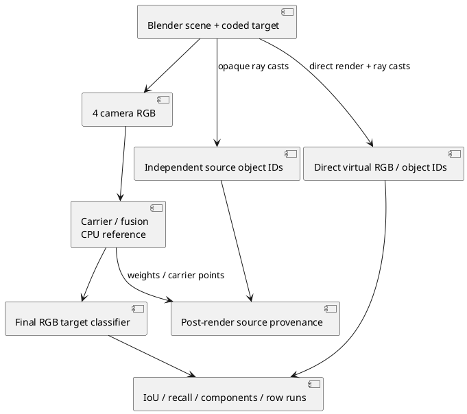
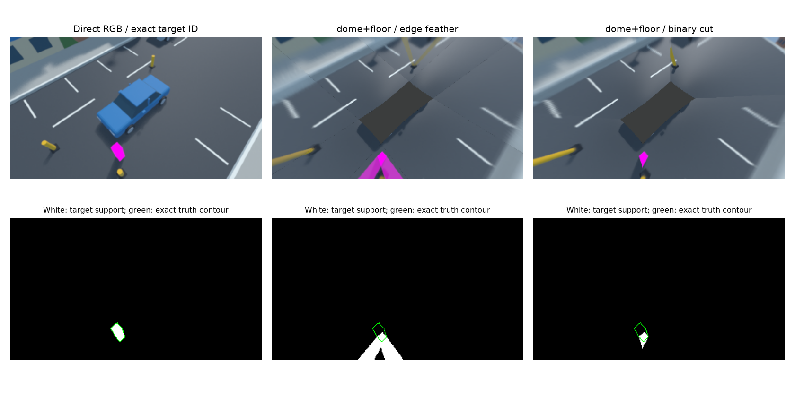
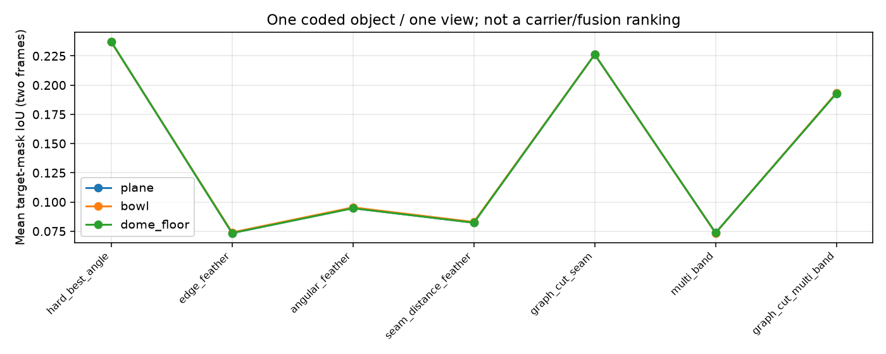

# E-STITCH-coded-object-01: независимая идентичность диагностической мишени

Дата: 10.10.2026. Продолжение [[STITCH_CONVERGENCE_ROBUSTNESS]], частичное выполнение этапов 1, 5 и 6 из [[planning/ROADMAP#Критерии готовности исследовательского заключения]]. Это диагностический опыт, а не финальный рейтинг методов.

## Постановка и независимый эталон

В авторскую Blender улицу добавлена уникальная magenta emission мишень размером 0.35×0.35×1.6 м с центром (2.7,1.6,0.8) м. Один ракурс, две позы автомобиля x=0/0.4 м при t=0/0.2 s, номинальная истинная калибровка. Исходные cube faces 256×256, четыре fisheye RGB 400×400, конечный кадр 320×180. Seed 15 меняет улицу, но выбор диагностической позиции выполнен после просмотра; это exploratory выборка, не untouched holdout. Предварительная позиция около границы кадра исключена из публикуемой серии.

Прямой RGB получен Blender EEVEE 5.2.2 LTS, независимо от поверхности проекции. Ray casts дают uint16 object IDs в виртуальном виде и, впервые, на каждом из четырёх оптических входов. Общая идентичность мишени — ID 46. В двух кадрах передняя камера содержит 4902/521 пикселей мишени, левая — 2551/3586; две остальные — ноль. Источник не определяет качество конечного кадра: метрики считаются по его RGB.

ID exporter поддерживает только equidistant zero-skew optics; другие модели явно отклоняются. Непрозрачные mesh-пересечения считаются по центрам оптических пикселей с дальностью 200 м, скрытые camera helpers пропускаются. Прозрачность, antialiasing, near clipping и cube resampling этим эталоном не моделируются. На границах IDs и RGB закономерно расходятся.



*Рисунок 1 — Независимый эталон и измерение результата. Source IDs не подаются в fusion и не заменяют распознавание конечного RGB; отдельная ветвь provenance анализирует происхождение пикселей после render.*

## Метрики и проверки

Для данного уникального материала маска RGB определяется как

$$P(u,v)=[\min(R(u,v),B(u,v))-G(u,v)>0.15],$$

где RGB нормирован в [0,1]. Связные компоненты площадью меньше 8 пикселей удаляются с 8-связностью из P и эталона T. Затем

$$IoU=\frac{|P\cap T|}{|P\cup T|},\qquad recall=\frac{|P\cap T|}{|T|},\qquad precision=\frac{|P\cap T|}{|P|}.$$

Неопределённые знаменатели дают null. Дополнительно измеряются число компонент, избыток компонент относительно T, число строк с дополнительными foreground runs и строки с отсутствующим объектом. Отдельные копии могут соединяться: нулевой избыток компонент/runs **не означает отсутствия ghosting**. Known-answer controls проверяют чистый, удвоенный, отсутствующий и смещённый объект, соединённые копии, малый шум, projection labels и отказ при повреждении source ID файла.

Классификатор прямого RGB имеет IoU 0.870370/0.873646 и recall 1.0 относительно точных IDs: antialiasing расширяет цветовую область. Порог контрольного допуска IoU≥0.75 — техническая проверка применимости классификатора, не требование к качеству кругового обзора. Порог и min area не подбирались для улучшения fusion результатов. Классификатор относится только к кодированной мишени, а не к естественным объектам.

## Результаты

6 carrier × 7 fusion × 2 кадра = 84 случая. Ниже IoU обоих кадров; p50 приведён отдельно для каждого кадра в миллисекундах. Все семь исходных time samples, p95/max, pixel counts, precision/recall, hashes и controls сохранены в [машиночитаемом отчёте](baselines/object_stitch_v1.json).

| Carrier | Fusion | IoU t=0 | IoU t=0.2 | CPU p50 t=0 / t=0.2, ms |
|---|---|---:|---:|---:|
| plane | hard_best_angle | 0.290210 | 0.184080 | 47.31 / 48.82 |
| plane | edge_feather | 0.071623 | 0.075203 | 46.51 / 46.01 |
| plane | angular_feather | 0.094688 | 0.094629 | 47.01 / 49.25 |
| plane | seam_distance_feather | 0.077578 | 0.086957 | 51.09 / 54.25 |
| plane | graph_cut_seam | 0.291228 | 0.161220 | 69.44 / 66.13 |
| plane | multi_band | 0.071753 | 0.075356 | 76.29 / 72.63 |
| plane | graph_cut_multi_band | 0.257764 | 0.128250 | 95.40 / 96.20 |
| bowl | hard_best_angle | 0.290210 | 0.183623 | 46.99 / 46.48 |
| bowl | edge_feather | 0.072398 | 0.075587 | 44.02 / 41.44 |
| bowl | angular_feather | 0.096065 | 0.094750 | 45.99 / 45.30 |
| bowl | seam_distance_feather | 0.078748 | 0.087059 | 49.02 / 48.87 |
| bowl | graph_cut_seam | 0.291228 | 0.161220 | 59.93 / 59.57 |
| bowl | multi_band | 0.071623 | 0.075280 | 75.10 / 75.50 |
| bowl | graph_cut_multi_band | 0.258567 | 0.128472 | 94.95 / 94.74 |
| dome_floor | hard_best_angle | 0.290210 | 0.184080 | 37.68 / 36.11 |
| dome_floor | edge_feather | 0.071623 | 0.075203 | 34.94 / 34.66 |
| dome_floor | angular_feather | 0.094688 | 0.094629 | 35.38 / 35.33 |
| dome_floor | seam_distance_feather | 0.077578 | 0.086957 | 38.48 / 40.24 |
| dome_floor | graph_cut_seam | 0.291228 | 0.161220 | 51.91 / 51.76 |
| dome_floor | multi_band | 0.071753 | 0.075356 | 65.91 / 65.39 |
| dome_floor | graph_cut_multi_band | 0.257764 | 0.128250 | 83.90 / 83.73 |
| cylinder_floor | hard_best_angle | 0.290210 | 0.184080 | 35.82 / 35.68 |
| cylinder_floor | edge_feather | 0.071623 | 0.075203 | 33.99 / 35.26 |
| cylinder_floor | angular_feather | 0.094688 | 0.094629 | 36.10 / 37.42 |
| cylinder_floor | seam_distance_feather | 0.077578 | 0.086957 | 40.67 / 40.34 |
| cylinder_floor | graph_cut_seam | 0.291228 | 0.161220 | 53.90 / 53.35 |
| cylinder_floor | multi_band | 0.071753 | 0.075356 | 67.20 / 65.42 |
| cylinder_floor | graph_cut_multi_band | 0.257764 | 0.128250 | 83.78 / 82.93 |
| cube_floor | hard_best_angle | 0.290210 | 0.184080 | 38.63 / 39.77 |
| cube_floor | edge_feather | 0.071623 | 0.075203 | 38.13 / 37.97 |
| cube_floor | angular_feather | 0.094688 | 0.094629 | 38.82 / 38.75 |
| cube_floor | seam_distance_feather | 0.077578 | 0.086957 | 43.57 / 44.41 |
| cube_floor | graph_cut_seam | 0.291228 | 0.161220 | 55.36 / 56.35 |
| cube_floor | multi_band | 0.071753 | 0.075356 | 68.30 / 68.92 |
| cube_floor | graph_cut_multi_band | 0.257764 | 0.128250 | 88.99 / 87.43 |
| burger_like | hard_best_angle | 0.290210 | 0.184080 | 39.64 / 40.08 |
| burger_like | edge_feather | 0.071623 | 0.075203 | 38.48 / 36.36 |
| burger_like | angular_feather | 0.094688 | 0.094629 | 38.48 / 39.08 |
| burger_like | seam_distance_feather | 0.077578 | 0.086957 | 42.09 / 41.20 |
| burger_like | graph_cut_seam | 0.291228 | 0.161220 | 62.12 / 62.29 |
| burger_like | multi_band | 0.071753 | 0.075356 | 65.25 / 65.48 |
| burger_like | graph_cut_multi_band | 0.257764 | 0.128250 | 93.94 / 94.73 |



*Рисунок 2 — Прямой RGB, dome-floor feather и binary cut; снизу их маски, зелёным — точный контур. У feather заметно расширение/слияние проекций; часть восстановленной мишени выходит за кадр, хотя истинная мишень находится внутри.*



*Рисунок 3 — Среднее по двум кадрам одного клипа; это не независимые статистические повторы.*

Для dome-floor feather IoU 0.071623/0.075203, для binary cut — 0.291228/0.161220. Это ограниченное свидетельство сильного геометрического искажения близкого вертикального объекта. Cut в этом случае уменьшает площадь ложного цветового следа, но не восстанавливает истинную геометрию. Нельзя заключать, что cut универсально лучше feather: одна мишень/ракурс и одна настройка классификатора не образуют подтверждающую выборку.

Во всех 84 случаях избыток компонент и дополнительных строковых runs равен нулю. Форма и положение существенно ошибочны, но соединённый след остаётся одной компонентой. Это отрицательный результат для полноты счётчика копий; нужна геометрическая correspondence/instance оценка и отдельная temporal ghost-trail метрика. Видимый объект здесь не является плоской частью carrier. Пять carrier имеют общий центральный пол и близкие результаты: опыт не различает качество всей оболочки, mesh budgets не выровнены.

На каждый случай выполнены 2 warmup и 7 timed повторов полного `reference.render`. Это Python CPU analytic renderer, без файлового I/O, метрик и ID анализа; не GPU, сервер или end-to-end latency. Порядок carrier/mode/frame фиксирован, фоновые нагрузки/температура не контролируются. Различия времени между одинаковыми центральными ROI нельзя считать доказательством скорости carrier. p95 при N=7 — описательная интерполяция; p99 не оценивается. Для этапа 6 ещё нужны чередование порядка, host metadata, длительные stage measurements и hardware/resource profiles.

## Воспроизведение

Checked-in fixture `tests/data/object_stitch_v1` содержит исходные RGB и truth, без raw cube faces и `.blend`. Численный прогон не требует Blender:

```sh
python3 tools/research/object_stitch.py --output artifacts/object-study-repeat --warmup 2 --repeats 7
MPLCONFIGDIR=/tmp/sv-mpl python3 docs/diploma/plot_object_stitch.py --results artifacts/object-study-repeat
ctest --test-dir build -R 'object_metrics|scene_visibility' --output-on-failure
```

Для повторного захвата выполнить в Blender Python console/MCP, подставив абсолютный путь проекта; активная сцена пользователя восстанавливается:

```python
import bpy, json, sys
from pathlib import Path
root = Path('/home/bogdan/prog/MAI/surround-view')
sys.path.insert(0, str(root/'tools/blender'))
from diagnostic import build_diagnostic
from paired_truth import capture_paired
plan = json.loads((root/'assets/scenarios/object-stitch-v1.json').read_text())
previous = bpy.context.window.scene
try:
    scene = build_diagnostic(plan)
    bpy.context.window.scene = scene
    capture_paired(scene, root/'artifacts/object-recapture', **plan['capture'])
finally:
    bpy.context.window.scene = previous
```

```sh
python3 tools/blender/convert.py --capture artifacts/object-recapture --output artifacts/object-recapture-inputs --image-format png
```

Converter пишет RGB/manifest/config, а paired truth остаётся в каталоге capture. Для self-contained fixture скопировать оттуда `capture.json`, `paired_truth.json` и файлы, перечисленные в `paired_truth.json:sha256`, в каталог converted inputs. Скрипт `load_objects` проверяет их hashes, размеры, dtype, порядок камер и общий calibration/pose contract до исследования. Повреждение источников останавливает опыт. Точные численные результаты при другой версии Blender/рендер-драйвере могут измениться.

Blender regression `tests/blender/test_visibility.py:run_source_capture` отдельно проверяет двухкадровый source-ID export, восемь карт и восстановление камеры/сцены; smoke выполнен с картами 16×16. `run(scene)` проверяет пропуск скрытых helpers после выделения общего ray helper.

Этапы 2–4 и 7 этим опытом не закрыты: реальные detector/solver, mount seeds, длинные повороты/dynamic scenes, compensation и заранее замороженный holdout остаются в [[../TODO]]. Natural-object segmentation, transparency и соответствие движущихся объектов также остаются открытыми.

## Выполненные регрессионные проверки

CMake configure прошёл с системными GLM 1.0.3 и OpenCV 5.0.0. Восемь CTest suites прошли: `blender_fixture`, `stitch_fusion`, `e_stitch_inputs`, `image_quality_oracle`, `temporal_truth`, `scene_visibility`, `stitch_robustness`, `object_metrics` (последний содержит восемь Python unit tests). Blender-specific hidden-helper и source-export smoke выполнены отдельно через MCP, не входят в эти восемь suites. SHA-256 пяти fixture indexes и пяти вычислительных модулей совпадают с опубликованным отчётом.
