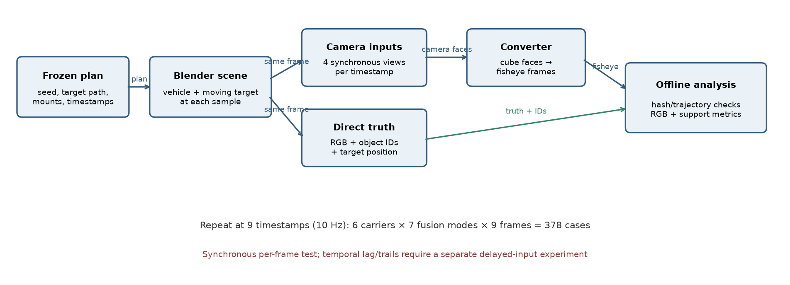
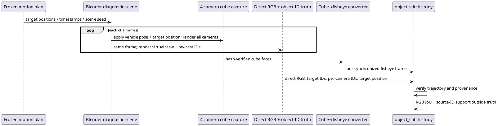

# E-STITCH-object-motion-01: coded target crossing camera sectors

Status: **captured and analyzed on 10.10.2026**. Frozen protocol: [[../research/STITCH_MOVING_OBJECT_PROTOCOL]]. This is a controlled synthetic screen, not evidence from physical cameras or Aurora hardware.

## Purpose and scope

The static coded-target fixture showed that source-camera identity support can extend outside a direct-view object mask, while connected projections can evade a connected-component ghost counter. This follow-up moves the same coded cuboid across camera sectors and evaluates each synchronized time separately. It measures frame-local RGB mask agreement and projected source-ID support. It does **not** measure temporal lag or stale-frame trails: every source camera is synchronized and fusion has no temporal history.



*Рисунок 1 — Blender задаёт одинаковые позу автомобиля и положение цели для входных камер и прямого RGB/object-ID эталона; после проверки траектории анализируются шесть поверхностей, семь режимов сшивки и девять временных отсчётов.*



## Fixed inputs and execution

The exact scenario is [`assets/scenarios/object-stitch-motion-v1.json`](../../assets/scenarios/object-stitch-motion-v1.json), seed 15. A 0.55 × 0.55 × 1.8 m magenta cuboid moves from y=−1.2 m to y=+1.2 m in 0.3 m increments while the vehicle moves at 2 m/s. Source frames are 0, 3, …, 24 at 30 fps, giving nine timestamps from 0 to 0.8 s. Each Blender row records the evaluated target position. The loader validates all nine positions and requires four camera object-ID maps for every frame.

The captured dataset is in ignored/generated `artifacts/object-stitch-motion-capture/`; converted inputs are in `artifacts/object-stitch-motion-inputs/`; the analysis is in `artifacts/object-stitch-motion-results-final/`. These can be regenerated using the frozen plan and commands below. The raw capture contains 247 files, including the nine-row camera/truth metadata, 36 source object-ID maps, the direct RGB/object/visibility references, and an isolated `street.blend` snapshot. The paired-truth manifest verifies 63 listed outputs; all hashes and the capture-manifest hash matched. The Blender source records version 5.2.2 LTS. After capture, the connected Blender scene was checked again and remained the user's original unsaved startup scene (`Cube`, `Camera`, `Light`).

```sh
python3 tools/blender/convert.py \
  --capture artifacts/object-stitch-motion-capture \
  --output artifacts/object-stitch-motion-inputs --image-format png
python3 tools/research/object_stitch.py \
  --fixture artifacts/object-stitch-motion-inputs \
  --capture artifacts/object-stitch-motion-capture \
  --output artifacts/object-stitch-motion-results-final \
  --warmup 2 --repeats 7 --order-seed 20261010
MPLCONFIGDIR=/tmp/sv-mpl python3 docs/diploma/plot_object_motion.py \
  --results artifacts/object-stitch-motion-results-final \
  --capture artifacts/object-stitch-motion-capture
```

## Results

The direct RGB classifier control achieved IoU 0.909–0.925 against exact object-ID masks across the nine frames, above its frozen 0.75 validity threshold. The full matrix contains 6 carriers × 7 fusion modes × 9 frames = 378 render cases. Timing used two warmups per case and seven seeded randomized complete blocks; the measured quantity is CPU `reference.render` time only, excluding truth generation, metrics and file I/O. Adjacent frames are repeated samples of one scripted path, not independent trials.

| Fusion mode | Mean target-mask IoU | Mean source-ID support outside direct truth | Median CPU render p50 (ms) |
|---|---:|---:|---:|
| Angular feather | 0.0815 | 0.8709 | 37.414 |
| Edge feather | 0.0730 | 0.8827 | 36.417 |
| Graph-cut multi-band | 0.0957 | 0.8362 | 89.213 |
| Binary graph-cut seam | 0.1024 | 0.8362 | 56.440 |
| Hard best angle | 0.0998 | 0.8461 | 37.467 |
| Multi-band | 0.0724 | 0.8827 | 66.708 |
| Seam-distance feather | 0.0779 | 0.8736 | 40.434 |


*Рисунок 2 — Матрицы показывают RGB IoU относительно прямого object-ID эталона (выше лучше) и долю source-ID поддержки вне этой истины (ниже меньше несоответствие) для каждой пары «носитель/смешивание» по всем девяти положениям цели.*

Across all 378 cases, mean target-mask IoU is 0.0861 and mean outside-support fraction is 0.8612. The direct-view truth can contain target pixels not visible to any input camera, while projected source IDs can appear outside the direct truth. Therefore outside support is a provenance mismatch, not a final-RGB ghost mask. The results expose substantial perspective/deformation and visibility mismatch for this cuboid trajectory; they do not establish that a fusion mode or surface is generally best. Even the largest per-mode mean IoU (binary graph-cut seam, 0.1024) is low, and the six carrier means are effectively tied in this one setup. The matrix is useful for locating hard frames and exposing a failure mode, not for ranking algorithms.

Mean CPU render p50 across cases was 52.96 ms on the recorded host. It is an offline Python reference timing, not the C++ server, GPU, or Aurora performance. Runtime samples and host/environment data are retained in `summary.json`; full capture and input hashes plus source-code hashes are included there and in `paired_truth.json`.

## Interpretation and limits

This experiment completes the first dynamic, frame-synchronized coded-target screen. It does not complete the broader stitching study. The renderer uses a single synthetic street, one nominal camera rig, one scripted cuboid path and no sensor noise, motion blur, exposure skew or moving occluder. Cuboid geometry and the magenta color classifier do not represent natural-object correspondence. Source-ID maps use opaque pixel-center ray casts; RGB images are filtered and antialiased. The carrier meshes have unequal budgets. The results therefore cannot support statistical confidence intervals, a general carrier/fusion ranking, claims about dynamic ghost trails or performance on the target hardware.

To study stale trails, add an explicit asynchronous-camera or renderer-history condition with frozen delay and matching direct truth. To support general conclusions, extend to independently seeded scenes, vehicle turns, realistic objects, mount perturbations, equal carrier/memory budgets, and a separate held-out evaluation. See [[../research/STITCH_MOVING_OBJECT_PROTOCOL]], [[../research/PROJECTION_AND_STITCHING]], [[STITCH_CONVERGENCE_ROBUSTNESS]], [[E_STITCH_01_V2]], and [[IMAGE_QUALITY_ORACLE]].
