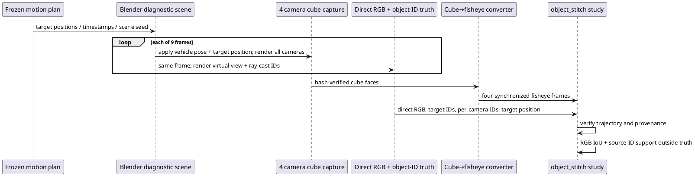

# E-STITCH-object-motion-01: coded target crossing camera sectors

Status: **capture plan and code prepared; Blender capture not run**. Frozen design: [[../research/STITCH_MOVING_OBJECT_PROTOCOL]]. It reuses target source-ID support from [[OBJECT_STITCH]].

## Purpose and scope

The static coded-target fixture exposes geometric source-ID support outside direct-view truth, but cannot show how the mismatch changes while an object moves. This experiment specifies a 9-frame, 10 Hz target path across camera sectors while the vehicle follows the existing straight trajectory. Synchronous camera frames and direct RGB/object-ID truth are captured at each exact timestamp. It measures per-frame cross-camera duplication; it does not measure temporal lag or stale-frame trails because fusion has no temporal history.


*Рисунок 1 — Blender applies the same timestamp and target position to camera capture and direct truth; conversion preserves timestamps; the offline study checks target trajectory and hashes before evaluating 84 carrier/fusion combinations over nine frames.*



## Fixed inputs and expected outputs

The scene plan is [`assets/scenarios/object-stitch-motion-v1.json`](../../assets/scenarios/object-stitch-motion-v1.json). It retains scenario seed 15 and nominal camera mounts. The target is a 0.55 m magenta cuboid, moving laterally from y=−1.2 m to y=+1.2 m in 0.3 m increments; the vehicle advances at 2 m/s. Nine rows use source frame numbers 0, 3, …, 24 (timestamps 0–0.8 s). Every capture stores the evaluated target world position, and the study rejects position or frame-count mismatches before rendering.

The study has 6 carrier geometries × 7 fusion modes × 9 timestamps = 378 visual cases. For each case it reports the RGB target mask and fixed source-support thresholds 0.25/0.50/0.75, including support outside that timestamp's independent direct truth. The prior 7-block timing method is retained for descriptive CPU reference timing, but adjacent timestamps are not independent samples and cannot support a confidence interval or algorithm ranking.

## Capture and run

Run this in the connected Blender Python Console or through Blender MCP. It builds an isolated diagnostic scene and writes only generated artifacts:

```python
import bpy, json, sys
from pathlib import Path
root = Path('/absolute/path/to/surround-view')
sys.path.insert(0, str(root / 'tools/blender'))
from diagnostic import build_diagnostic
from paired_truth import capture_paired
plan = json.loads((root / 'assets/scenarios/object-stitch-motion-v1.json').read_text())
scene = build_diagnostic(plan)
previous = bpy.context.window.scene
try:
    bpy.context.window.scene = scene
    capture_paired(scene, root / 'artifacts/object-stitch-motion-capture', **plan['capture'])
finally:
    bpy.context.window.scene = previous
```

Convert camera faces and run the validated study:

```sh
python3 tools/blender/convert.py \
  --capture artifacts/object-stitch-motion-capture \
  --output artifacts/object-stitch-motion-inputs --image-format png
python3 tools/research/object_stitch.py \
  --fixture artifacts/object-stitch-motion-inputs \
  --capture artifacts/object-stitch-motion-capture \
  --output artifacts/object-stitch-motion-results \
  --warmup 2 --repeats 7 --order-seed 20261010
MPLCONFIGDIR=/tmp/sv-mpl python3 docs/diploma/plot_object_stitch.py \
  --results artifacts/object-stitch-motion-results \
  --fixture artifacts/object-stitch-motion-capture
```

## Execution status and limitations

The local environment has no `blender` executable. The connected Blender MCP handshake also failed on 10.10.2026 (`Connection closed before receiving any data`; addon protocol could not be read). Therefore no moving-target images, outcomes, or figures are claimed yet. Pure-Python plan/trajectory validation, source compilation, and known-answer metrics are testable without Blender; rendering and visual inspection require reconnecting Blender MCP or installing/starting a compatible local Blender.

Even after capture, the result remains one synthetic scene and one target path. It will not establish temporal carryover. A separate asynchronous-camera or renderer-history experiment with an explicit delay and matching moving-object truth is required for stale trails.
