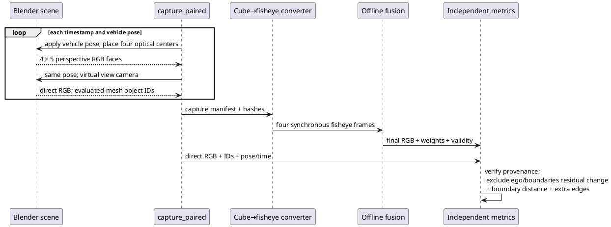

# Парная Blender-серия: сшивка и изменение швов

> Повторный прогон 10.10.2026 с validity_zero_extension_v2 выполнен на том же tracked 3-frame fixture. Таблица и рисунки обновлены; raw report — `baselines/paired_temporal_mask_v2.json`. Длинные клипы, независимые сцены и физическая проверка остаются открытыми. Исправления: [[validation/NATIVE_FUSION]].

Дата: 10.10.2026. Статус: воспроизводимая проверка методики на одном коротком синтетическом клипе; E-STITCH-01 остаётся открытым.

## Данные и независимость эталона

Четыре камеры физически перемещены вместе с машиной в одной Blender-сцене `SV Research Street`. Поза применяется к оптическим центрам и ориентациям до каждого capture. Прямой виртуальный вид рендерится из **той же сцены**, с тем же освещением, color transform, позой автомобиля и временем. Носитель сшивки при его построении не используется. Object IDs получают независимым `Scene.ray_cast` по evaluated mesh geometry. Это устраняет несовпадение аналитической улицы с Blender RGB, отмеченное в [[IMAGE_QUALITY_ORACLE]].

Blender 5.2.2 LTS, EEVEE; 3 момента: 0 / 0.2 / 0.4 s, x=0 / 0.4 / 0.8 m; скорость 2 m/s. Это **5 Hz sampling**, не 30-fps видео. Cube faces 64×64 преобразованы в fisheye 400×400; direct view 320×180. Dome+floor radius 12 m, azimuth 0.8 rad, elevation 1 rad, distance 8.5 m. Максимальная ошибка проверки виртуальной камеры через Blender projector: 0.000114 px.

В Git сохранён `tests/data/paired_street_v1` (~1.4 MB). Raw cubes и snapshot — generated artifacts, не входят в fixture. RGB PNG lossless переупакованы из PPM; актуальные хэши находятся в manifest. Позы/время сверяются с original capture provenance.

## Метрики

Пусть $F_t$ — сшитый кадр, $G_t$ — соответствующий прямой вид Blender. Используется sRGB в [0,1], а не физическая яркость. Для ROI соседних кадров $R_t$:

$$e_t=F_t-G_t,\qquad D_t=rac{1}{3|R_t|}\sum_{p\in R_t}\|e_t(p)-e_{t-1}(p)\|_1.$$

ROI исключает фон, кузов, края объектов (maximum/minimum filter 3×3 и dilation на 2 px), footprint носителя и зоны без проекции. Пересечение ROI для двух переходов: 42033 / 42032 pixels. Это изменение остаточной ошибки в vehicle-fixed view, **не чистое мерцание**: нет optical flow, остаются параллакс и смена окклюзий. Raw change сохраняется в JSON как отдельная диагностика.

Граница шва определяется сменой `argmax(weights)` между соседними активными overlap pixels, включая hard masks. Движение — среднее симметричное расстояние до ближайшей границы следующего/предыдущего кадра; оно не равно centroid shift. При отсутствии любой границы результат `null`, а не фиктивный ноль. Граница весов не доказывает наличия видимого шва.

Extra-edge fraction: доля fused Sobel edges (threshold 0.08), удалённых более чем на 2 px от RGB edges прямого вида в ROI. Это независимая image-edge диагностика, **не object-level ghost rate**: геометрическое растяжение, sampling и сглаживание также дают лишние края. Object-ID карты используются для маскирования ROI; соответствие индивидуальных объектов между камерами пока не оценивается.

## Результаты одного клипа

Каждый вариант вычислен один раз. Соседние кадры и два перехода не являются независимыми повторениями. Время/GPU performance в этой серии не измеряются.

| Fusion | MAE t0 / t1 / t2 | Residual change 0→1 / 1→2 | Boundary distance px 0→1 / 1→2 | Extra-edge % t0 / t1 / t2 |
|---|---|---|---|---|
| `hard_best_angle` | 0.04067 / 0.04164 / 0.04152 | 0.00901 / 0.01061 | 0.00000 / 0.00000 | 69.18394 / 68.79934 / 69.58780 |
| `edge_feather` | 0.03920 / 0.04004 / 0.03974 | 0.00722 / 0.00785 | 0.00000 / 0.00000 | 68.41060 / 69.56384 / 70.58537 |
| `angular_feather` | 0.04013 / 0.04110 / 0.04100 | 0.00855 / 0.00991 | 0.00000 / 0.00000 | 66.88207 / 67.07424 / 67.57488 |
| `seam_distance_feather` | 0.03971 / 0.04066 / 0.04044 | 0.00831 / 0.00941 | 0.00000 / 0.00000 | 66.08648 / 66.56068 / 67.15704 |
| `graph_cut_seam` | 0.04041 / 0.04171 / 0.04170 | 0.00874 / 0.01074 | 0.09161 / 0.04814 | 68.34290 / 68.29026 / 69.02998 |
| `multi_band` | 0.03964 / 0.04045 / 0.04005 | 0.00733 / 0.00799 | 0.00000 / 0.00000 | 70.04330 / 70.73171 / 71.80664 |
| `graph_cut_multi_band` | 0.04044 / 0.04176 / 0.04186 | 0.00865 / 0.01068 | 0.09161 / 0.04814 | 67.28255 / 67.12494 / 68.03150 |

Для `graph_cut_seam` boundary IoU: 0.83215 / 0.90815; p95 boundary distance: 1 / 0 px. Нулевой p95 второго перехода не означает отсутствия изменений: среднее 0.04814 px и IoU<1 показывают изменение небольшой части границы. Геометрические веса feather остаются неподвижны в vehicle-fixed view, хотя сцена и RGB меняются. **Это свойство весов, а не доказательство отсутствия мерцания.**

На этом клипе residual change `edge_feather` составляет 0.00722 / 0.00785, `graph_cut_seam` — 0.00874 / 0.01074. Варианты нельзя ранжировать: один мир/ракурс, редкая короткая серия, низкое разрешение исходных кубических граней, нет holdout/repeats или экспозиционных возмущений. Высокая extra-edge fraction также не означает, что 69% объектов двоятся.


*Рисунок 1 — Три положения автомобиля: direct Blender view, edge feather и binary graph-cut seam. Сшивка показана без автомобильного overlay; кузов прямого вида исключён из ROI. Видны растяжение и размытие при переносе объектов на dome+floor.*


*Рисунок 2 — Изменение остаточной RGB-ошибки и симметричное расстояние между границами весов. Два перехода одного клипа, без доверительных интервалов.*

## Воспроизведение

```sh
python3 tools/temporal_seam_stability.py \
  --dataset tests/data/paired_street_v1 \
  --capture tests/data/paired_street_v1 \
  --output artifacts/paired-temporal-mask-v2
python3 tests/test_temporal_truth.py
python3 docs/diploma/plot_paired_stitch.py --results artifacts/paired-temporal-mask-v2
```

Для нового Blender capture: активировать нужную сцену, затем выполнить в Python console или MCP:

```python
import sys
sys.path.insert(0, '/absolute/project/tools/blender')
from paired_truth import capture_paired
capture_paired(bpy.context.scene, '/absolute/project/artifacts/new-paired-capture',
               frames=3, face_size=64, frame_step=6, width=320, height=180)
```

```sh
python3 tools/blender/convert.py --capture artifacts/new-paired-capture \
  --output artifacts/new-paired-inputs
python3 tools/temporal_seam_stability.py --dataset artifacts/new-paired-inputs \
  --capture artifacts/new-paired-capture --output artifacts/new-paired-report
```

Выходные директории должны отсутствовать, чтобы серии не смешивались. Capture восстанавливает позу, camera optics, resolution и frame исходной сцены; сохранённый snapshot не перезаписывает открытый файл пользователя.

## Контрольные проверки и оставшаяся работа

9 unit tests проверяют изменение сцены без ложного residual flicker, внесённый temporal bias 0.1, известное смещение hard seam, отсутствие границ/ROI, неверный RGB/time, искусственный дополнительный контур, действительное движение fixture и отказы при checksum/pose mismatch. Это проверки измерителя, не подтверждение качества алгоритмов сшивки.

Далее: independent scene/mount seeds, повороты и более длинные клипы, исходные cube faces ≥256 px, matched scene visibility для исключения скрытых от камер поверхностей, динамические объекты, экспозиционные trials, object-correspondence ghost trails, equal mesh/memory budgets и repeated timing. См. [[planning/ROADMAP]], [[../TODO]].

## Происхождение

Хэши входных индексов и исполняемых модулей зафиксированы при запуске:

| Вход / модуль | SHA-256 |
|---|---|
| `tests/data/paired_street_v1/config.json` | `a7c87c1c2717200a8876c5bd23289ad5650bda94c928db3de7d23a3bbd097ed4` |
| `tests/data/paired_street_v1/manifest.json` | `0ab46ef4687e22f8d38a0a0adcf728fd4a581a074171d17a26b7adc464e9c4e5` |
| `tests/data/paired_street_v1/ground_truth.json` | `d6d4eebd55391dae1a6c936098a68d81d63d2b282ea9b0994cd562dd967312fa` |
| `tests/data/paired_street_v1/capture.json` | `793695f8a45746f91164f6ce120ae6539fbe282a183349d806cb6e51eeff8bd2` |
| `tests/data/paired_street_v1/paired_truth.json` | `08818583a39d39a0223a64886fa24a82ccc5d1c087e6907e498740b40723234a` |
| `temporal_seam_stability.py` | `993548b75655b4554faeb44907ee23fcdfca2711cd336455a62d8818b0e33a0d` |
| `reference.py` | `45342a907a08361bdaa4bf6fb5b5daf8e13870688acc3beba1caf1f46d369432` |
| `fusion.py` | `7dd094116f8e7817dcd43ee3a8f126f665c87b406444c71353fa4efa91bd4c84` |
| `stitch_metrics.py` | `de8d287f1f7b098d526f8677f5e96c59a77bf6f48dd7bde7c36ef250bcef1814` |

## Последовательность получения данных



*Рисунок 3 — Раздельное построение входов сшивки и прямого эталона одной сцены. Эталон не использует dome/fusion renderer.*
