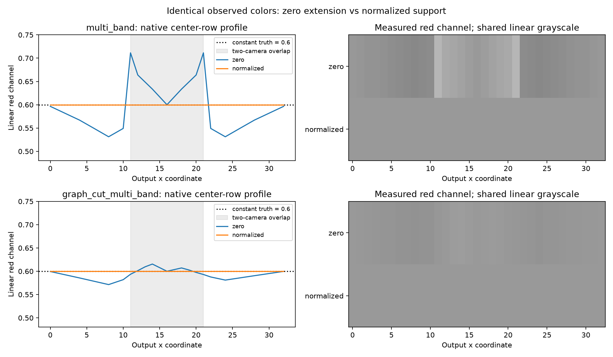

# Границы pyramid blending: zero и normalized support

Дата: 10.10.2026. Контролируемый native опыт, не подтверждающее сравнение на уличных сценах. Продолжение [[STITCH_MASK_FOLLOWUP]] и [[NATIVE_FUSION]].

## Вопрос и метод

Устранение ненаблюдаемого RGB перед filtering (`validity_zero_extension_v2`) необходимо для воспроизводимости, но не гарантирует сохранения постоянного цвета у границы маски. Проверяемое требование: если наблюдаемые цвета всех камер одинаковы, общая видимость полная и веса положительны, граница между камерами не должна создавать яркостный ореол.

В `fusion_boundary` данные строятся C++ кодом и проходят production `sv::fuse_research`. Линейный RGB каждого наблюдения равен (0.6, 0.3, 0.8). Маски: две горизонтальные области с перекрытием; диагональная граница; четыре чередующиеся камеры; полностью наблюдающая камера с дополнительными тонкими полосами двух камер. Размеры 3×3, 33×17 и 32×16, requested levels 1/4/8, два pyramid режима — 72 сочетания. Реальное число уровней ограничивается размером: при стороне меньше 4 дальнейшее уменьшение прекращается. 72 сочетания — deterministic controls, не независимые сцены.

Новый вариант использует раздельную фильтрацию цветовой массы и поддержки. Это опирается на принцип signal/certainty в normalized convolution: отсутствие данных обозначается нулевой уверенностью, а не достоверным чёрным цветом. Источник: H. Knutsson, C.-F. Westin, [Normalized and differential convolution, CVPR 1993, DOI 10.1109/CVPR.1993.341081](https://ieeexplore.ieee.org/abstract/document/341081/). Рекурсивная пирамида и её включение в данный renderer являются исследуемым вариантом проекта, а не воспроизведением всех операторов статьи.

Для камеры i на уровне l обозначим цвет C и поддержку S. Начальные S — бинарная validity, C вне validity — ноль. При Gaussian G (σ=1, truncate=4, reflect) и decimation D с чётных центров:

$$S_i^{l+1}=D(G*S_i^l),$$
$$C_i^{l+1}=\begin{cases}\dfrac{D(G*(C_i^l S_i^l))}{S_i^{l+1}}, & S_i^{l+1}>10^{-12},\\0,&\text{иначе}.\end{cases}$$

Порог — численная защита деления, не физический calibration gate. Laplacian decomposition/reconstruction и Gaussian pyramid fusion weights сохранены. Support не является camera confidence, visibility truth или новым graph-cut unary. Пустая камера не получает вес; вне общей исходной validity renderer использует прежний fallback.

## Результаты

| Fusion | Boundary | Max abs linear RGB error, 33×17 horizontal overlap |
|---|---|---:|
| multi_band | zero | 0.148552 |
| multi_band | normalized | 1.192093e-7 |
| graph_cut_multi_band | zero | 0.038150 |
| graph_cut_multi_band | normalized | 1.192093e-7 |

Максимальная ошибка normalized по всем 72 controls — **1.788139e-7**, допуск GTest — 4e-5. Значения таблицы — максимум по трём каналам; профиль рисунка показывает только красный канал. В horizontal case cam0 покрывает x<22, cam1 — x≥11; прямой truth red=0.6. Zero extension создаёт как затемнение, так и осветление, несмотря на одинаковые наблюдаемые цвета. Тест специально сохраняет этот эффект baseline для дальнейшей ablation; default не заменён.



*Рисунок 1 — Измеренный native профиль красного канала через перекрытие камер и его визуализация с общей линейной шкалой. Это контролируемое постоянное поле, не фотография улицы. Скрипт `docs/diploma/plot_pyramid_boundary.py` читает GTest raw report.*

Дополнительные C++ controls: изменение invalid RGB не меняет normalized output; полностью пустые inputs дают конечный нулевой результат; одна полностью наблюдающая камера восстанавливает неconstant gradient с допуском 4e-6; неизвестная boundary policy отклоняется. Для случайных масок/нечётных размеров и levels 1/4/8 native сравнивается с отдельной NumPy/SciPy реализацией (18 новых сочетаний, прежние 34 сохранены), прежние tolerances 4e-6 для RGB и 2e-6 для weights.

## Серверный контракт и воспроизведение

Поле `fusion.pyramid_boundary`: `zero` (default) либо `normalized`, влияет только на `multi_band` / `graph_cut_multi_band`. Каталог версии 3 перечисляет оба значения и `normalized_pyramid_implementation=normalized_support_v1`; поле `research_fusion_implementation=validity_zero_extension_v2` описывает прежний zero baseline. Настройка временная, применяется через тот же revision-aware API между render calls. Типизированная библиотека отправляет новое поле для normalized; default zero опускается ради совместимости с прежним сервером. Использование normalized требует проверки каталога. Snapshot/ACK/frame нового сервера включают фактическую policy.

```sh
cmake -S . -B build -DSV_GTEST_TESTS=ON
cmake --build build -j4
build/sv-fusion-boundary-tests --gtest_output=json:artifacts/pyramid-boundary-tests.json
MPLCONFIGDIR=/tmp/sv-mpl python3 docs/diploma/plot_pyramid_boundary.py --report artifacts/pyramid-boundary-tests.json
build/svctl --unix /tmp/sv-runtime-screen research configs/research/pyramid-boundary-screen.json artifacts/pyramid-boundary-report.json
```

Последняя команда требует работающего replay сервера и READY baseline; запуск сервера описан в [[engineering/USAGE]]. Сценарий содержит оба fusion режима × обе boundary policy, два warmup и семь measurement blocks — 36 кадров на одном paused frame set. GUI редактор принимает исторические шесть обязательных полей и optional седьмое `pyramid_boundary`; сценарный parser и общий C++ runner сохраняют policy в нормализованном scenario/report. Серверные конфиги клиент не редактирует.

Raw native controls: `baselines/pyramid_boundary_v1.json` (GTest JSON с profiles/72 case errors и build fingerprint). `render_fusion_parity` расширен до пяти carriers × 18 случаев = 90 полных RGBA сравнений; на plane дополнительно получены 18 actual SV01 кадров с побитным совпадением probe. GUI typed apply/reject/restore проверен через Unix/TCP в `client_transports`. Полная регрессия: **48/48 CTest entries**, 25.29 s; отдельный финальный native report — 4/4 GTest cases.

Отдельный C++ `svctl research` прогон на первом кадре tracked object fixture выполнил 36 samples и восстановил fusion/surface/pause. Raw — `baselines/pyramid_boundary_server_v1.json`, включая исходный manifest и способ получения one-row replay. GL renderer из реального отчёта — AMD Ryzen 9 9950X integrated radeonsi; это не RTX baseline и не Аврора. Результат проверяет переключение/metadata/restore, не ранжирует latency или качество.

Первый запуск на исходном двухкадровом replay попал на `NO_INPUT`: интервал 200 ms больше `max_input_age_ms=100`, а runner требует READY при pause. Он корректно вернул failed report и restored=true. Этот отрицательный результат сохранён вместе с успешным; автоматической подготовки READY/cursor restore runner пока нет. Однокадровый replay исключил данный временной разрыв без изменения RGB/calibration.

## Ограничения и следующие опыты

Постоянное поле показывает нарушение инварианта baseline и его устранение в выбранных controls, но не доказывает улучшение на textured scenes, silhouettes, occlusions, различной экспозиции или всех масках. Нормализованная фильтрация продолжает смешивать соседние наблюдения по масштабу и может размывать/переносить цвет через разрывы. Нужны paired independent Blender RGB/object-ID/visibility, bias/noise и маски с крупными отверстиями/разрывами, равные resource budgets, отдельное измерение overhead и целевая Аврора. Исторические zero screening tables остаются результатами default версии; они не являются результатами нового normalized варианта. E-STITCH-01 не закрыт.
