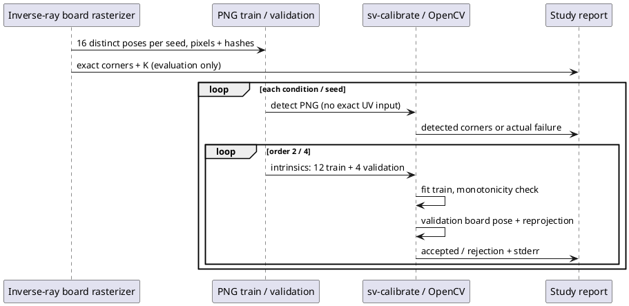

# E-CAL-raster-01: реальный OpenCV detector/solver на синтетических изображениях

Дата: 10.10.2026. Частичное выполнение этапа 3 из [[planning/ROADMAP#Критерии готовности исследовательского заключения]]. Здесь реально выполняется production C++ `sv-calibrate`, связанный с OpenCV 5.0.0. Физические фотографии не используются. Историческая jitter-модель `real_data_calibration_evaluation.py` теперь явно сообщает `detector_executed=false`, `solver_executed=false`, `threshold_status=illustrative_unvalidated`; её пороги не являются рекомендациями.

## Данные и протокол

`tools/calibration/raster_board.py` независимо формирует каждый оптический луч equidistant камеры и пересекает его с плоскостью доски. Цвет берётся по parity координат квадрата. Box integration 2×2 subpixels, затем Gaussian blur/noise и grayscale uint8 quantization. Нет подмены найденных углов искусственным jitter. Forward projection физических пересечений доски используется только для измерения localization error; detector получает исключительно PNG.

640×480, fx=300, fy=295, cx=319.5, cy=239.5, skew=0, истинные k1..k4=0. Внутренних пересечений 9×6, квадрат 0.08 м, наружная полоса квадратов присутствует. Доска центрирована; центр в координатах камеры выбирается в x∈[−0.28,0.28], y∈[−0.22,0.22], z∈[0.8,1.35] м. Независимые Euler xyz angles: ±0.5, ±0.5, ±0.2 rad. Seeds 2401/2402 задают по 16 поз: первые 12 training, последние 4 validation. Пары условий используют одни и те же позы и noise seeds. Это два exploratory pose sets, не независимые типы оптики/среды и не финальный holdout.

| Условие | Blur σ, px | Noise σ, intensity [0,1] |
|---|---:|---:|
| clean | 0 | 0 |
| blur_noise | 1.5 | 0.02 |
| heavy_blur | 4 | 0.02 |

96 изображений, 96 самостоятельных detector calls и 12 calibration attempts (2 seeds × 3 conditions × 2 models). Calibration CLI повторно обнаруживает углы в тех же файлах; отказ любого обязательного изображения прекращает fit. Отказы не исключаются для улучшения статистики.

## Методы и метрики

Production путь: `detect_board` → `findChessboardCornersSB`, `calibrate_intrinsics` → `cv::fisheye::calibrate`; validation с фиксированными intrinsics и отдельно подбираемой board pose через `solvePnP`. Новая опция CLI `--distortion-order 2|4` по умолчанию 4. В order=2 k3/k4 фиксированы нулями, k1/k2 оцениваются; order=4 оценивает все четыре коэффициента. Использованы штатные `CALIB_FIX_K3`, `CALIB_FIX_K4`; определения модели/флагов: [OpenCV fisheye](https://docs.opencv.org/4.13.0/db/d58/group__calib3d__fisheye.html). Детектор: [OpenCV calibration documentation](https://docs.opencv.org/4.13.0/d9/d0c/group__calib3d.html). Документация описывает API 4.13; фактическая версия исследуемого бинарного файла — 5.0.0, записана в reports.

Для localization error разрешается только 180° reversal порядка немаркированной шахматной доски, минимизирующий RMSE относительно точных углов; эта операция применяется при оценке, не при solver fit. RMSE агрегируется сначала по 54 углам изображения. Ниже mean по обнаруженным изображениям; при отказах это условная статистика, поэтому рядом обязательно указано число обнаружений.

$$e_f=(\hat f-f)/f,\qquad RMSE=\sqrt{\frac{1}{54}\sum_j\|\hat u_j-u_j\|^2}.$$

Gate CLI сохраняет прежние ограничения: p95 validation≤1 px и монотонность $\theta_d$ на [0,1.0] rad. Порог 1 px технический, физически не обоснован. Монотонность проверяется по 1025 равномерным отсчётам, это не аналитическое доказательство. Размещение досок не покрывает весь заявленный angular domain; отказ при extrapolation важен для исследуемого набора. Нельзя уменьшать домен задним числом для получения accepted.



*Рисунок 1 — Изображения являются входом детектора, точные UV доступны только отчёту. Проверочные позы не участвуют в fit intrinsics, но подбираются отдельно при validation.*

## Результаты

| Seed | Condition | Detected / 16 | Mean detected RMSE, px | Order | Fit | Validation p95, px | fx / fy error, % |
|---|---|---:|---:|---:|---|---:|---:|
| 2401 | clean | 16 | 0.1564 | 2 | accepted | 0.2977 | 0.279 / 0.313 |
| 2401 | clean | 16 | 0.1564 | 4 | accepted | 0.2994 | 0.292 / 0.327 |
| 2401 | blur_noise | 16 | 0.3002 | 2 | accepted | 0.4453 | 2.279 / 2.552 |
| 2401 | blur_noise | 16 | 0.3002 | 4 | accepted | 0.4521 | 2.397 / 2.678 |
| 2401 | heavy_blur | 9 | 0.8606 | 2 | detector failure | — | — |
| 2401 | heavy_blur | 9 | 0.8606 | 4 | detector failure | — | — |
| 2402 | clean | 16 | 0.1644 | 2 | accepted | 0.2663 | 0.251 / 0.240 |
| 2402 | clean | 16 | 0.1644 | 4 | nonmonotonic | — | — |
| 2402 | blur_noise | 16 | 0.3617 | 2 | accepted | 0.8953 | 2.325 / 2.451 |
| 2402 | blur_noise | 16 | 0.3617 | 4 | nonmonotonic | — | — |
| 2402 | heavy_blur | 5 | 0.3614 | 2 | detector failure | — | — |
| 2402 | heavy_blur | 5 | 0.3614 | 4 | detector failure | — | — |


*Рисунок 2 — По одному изображению каждого seed/condition: первая нераспознанная доска, если отказ есть, иначе первая распознанная. Зелёные окружности — точные углы; magenta точки — результат OpenCV. Изображения показывают выбранные диагностические случаи, не средний результат.*

На seed 2402 четырёхкоэффициентная модель отклонена как немонотонная в clean и blur_noise; двухкоэффициентная проходит с p95 0.2663/0.8953 px. Это свидетельство чувствительности свободной модели к данным/диапазону, а не универсального превосходства меньшего порядка: ground truth equidistant имеет нулевые коэффициенты и благоприятен для более простой модели. При heavy blur детектор находит 9/16 и 5/16 изображений, обе модели прекращают калибровку. Успешное распознавание доски и успешная калибровка — разные проверки.

Даже при accepted и p95<1 px blur_noise даёт focal errors около 2.3–2.7%, тогда как clean — около 0.24–0.33%. Board pose, подбираемая на validation, может компенсировать часть ошибки intrinsics. Низкая reprojection error не доказывает физическую точность параметров, точность монтажа на автомобиль или отсутствие швов. Нужны independent metric geometry, несколько optical families, mount error, outer-angle coverage и false accept/reject protocol; требования к физическим ошибкам нельзя вывести из этой серии.

## Воспроизведение и ограничения

```sh
cmake -S . -B build
cmake --build build --target sv-calibrate -j 4
python3 tools/calibration/raster_study.py --output artifacts/calibration-raster-repeat --seeds 2401 2402
MPLCONFIGDIR=/tmp/sv-mpl python3 docs/diploma/plot_raster_calibration.py --results artifacts/calibration-raster-repeat
ctest --test-dir build -R 'raster_calibration|vision_tools|real_data_calibration' --output-on-failure
```

Python cv2 и Blender не требуются; production бинарный файл использует системный C++ OpenCV. Renderer требует NumPy/SciPy/Pillow. Каждый output каталог должен быть новым. Отчёт содержит binary/code/dataset/image SHA-256, позы, exact/detected UV, stdout/stderr, оценки моделей и validation reports. [Полный сохранённый отчёт](baselines/calibration_raster_v1.json); изображения генерируются скриптом, raw PNG/annotations остаются в `artifacts/`.

Физические снимки, radiometric realism, glare/rolling shutter, небазовые оптические модели, движение автомобиля и серверный training/validation provenance этим опытом не проверены. Выбор order=2 добавлен после просмотра отказа order=4, поэтому ablation exploratory. Не объявлять подтверждающую серию или новую физическую Quality Gate методику.

## Выполненные проверки

Полная Linux CMake сборка прошла, включая сервер, CLI и Qt simulator. Восемь CTest suites прошли: `core`, `calibration_job`, `vision_tools`, `raster_calibration`, `calibration`, `object_metrics`, `comprehensive_calibration`, `real_data_calibration`. `vision_tools` дополнен проверкой фиксированных k3/k4 и отказа для некорректного `--distortion-order`; raster tests проверяют scalar projection, parity, детерминизм/noise seeds, actual detector и blank-image rejection. Binary/code/96 PNG hashes сверены с сохранённым отчётом.
