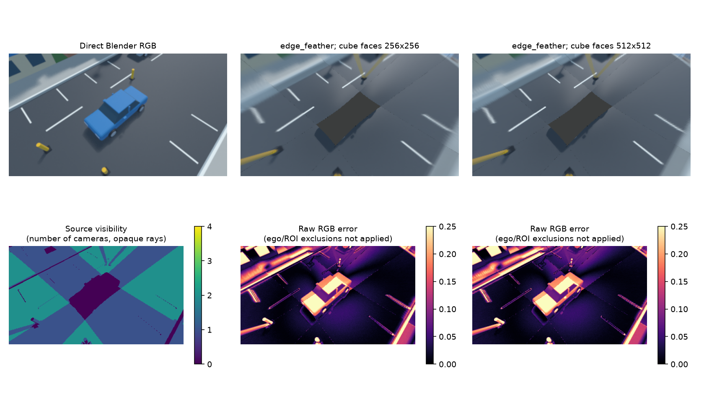
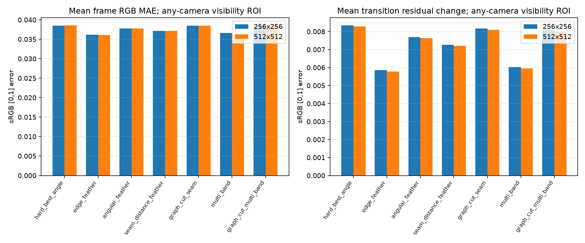
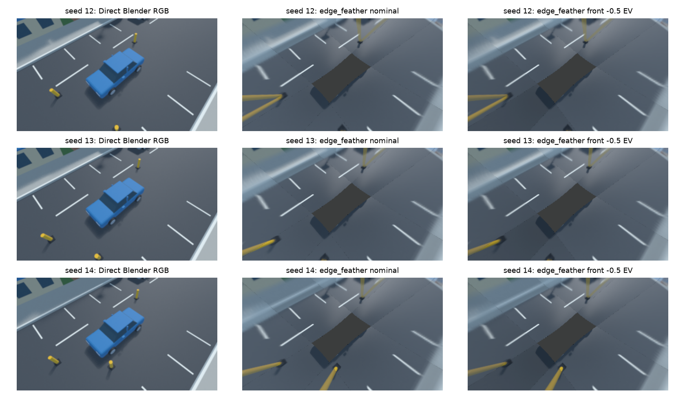
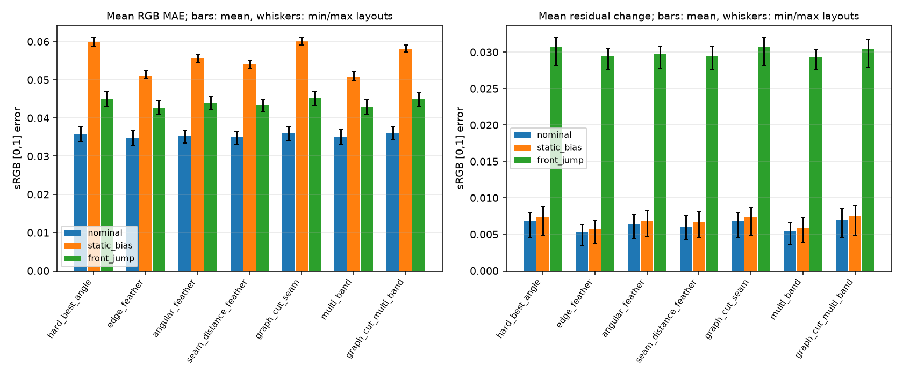

# E-STITCH-01: сходимость sampling и устойчивость к экспозиции

> Пересчёт 10.10.2026 для validity_zero_extension_v2 выполнен на прежних входах; quality tables и рисунки обновлены. Raw reports, RGB8 changes и ограничения: [[STITCH_MASK_FOLLOWUP]]. Это регрессия, не независимая подтверждающая выборка.

Дата: 10.10.2026. Продолжение [[STITCH_RESOLUTION_VISIBILITY]]. Выполнены convergence screen 256→512 и exploratory серия на трёх вариантах ближайших препятствий. Общий выбор carrier/fusion и полноценная приёмка остаются открытыми.

## 1. Сходимость 256→512

Для прежнего 3-frame клипа получен capture с cube faces 512×512. Fisheye 400×400, direct view 320×180, true rig, материалы, освещение и позы фиксированы. Decoded direct RGB, object IDs и source visibility совпадают побитно с условием 256. Проверка пары принимает любые два возрастающих разрешения 32..2048; legacy default 64/256 сохранён.

| Fusion, any-camera ROI | Mean MAE 256 | Mean MAE 512 | MAE change % | Residual change 256 | Residual change 512 |
|---|---:|---:|---:|---:|---:|
| `hard_best_angle` | 0.038520 | 0.038574 | +0.141 | 0.008354 | 0.008280 |
| `edge_feather` | 0.036170 | 0.036034 | -0.374 | 0.005858 | 0.005786 |
| `angular_feather` | 0.037796 | 0.037814 | +0.048 | 0.007686 | 0.007632 |
| `seam_distance_feather` | 0.037184 | 0.037161 | -0.062 | 0.007268 | 0.007207 |
| `graph_cut_seam` | 0.038471 | 0.038520 | +0.128 | 0.008174 | 0.008097 |
| `multi_band` | 0.036589 | 0.036450 | -0.380 | 0.006024 | 0.005950 |
| `graph_cut_multi_band` | 0.038570 | 0.038616 | +0.120 | 0.008099 | 0.008019 |

Для `edge_feather` MAE уменьшилась на 0.374%, residual change — на 1.228%; для нескольких hard/cut вариантов MAE немного выросла. Это наблюдаемое насыщение **данного ракурса и разрешения output**, а не математическое доказательство сходимости. Критерий остановки не был зарегистрирован до опыта, поэтому 256 выбирается как рабочий компромисс для следующего exploratory screen, без утверждения, что его достаточно для всех сцен.



*Рисунок 1 — Прямой вид, feather при 256/512 source faces и visibility/raw error карты. Различия мало заметны при output 320×180; geometric distortion остаётся.*



*Рисунок 2 — Mean frame MAE и mean transition residual change при фиксированном any-camera ROI; один клип, без независимых повторов.*

## 2. Варианты сцены и photometric stress

Зафиксирован план `assets/scenarios/stitch-validation-v1.json`: seeds 12/13/14, validation split, исходные faces 256, три позы x=0/0.4/0.8 m, t=0/0.2/0.4 s. Все камеры имеют одинаковую true nominal calibration и нулевое mount perturbation. Время scripted capture задаётся frame/30 независимо от native timeline fps; анимированных объектов нет.

В прежнем генераторе seed менял только здания; близкие препятствия были одинаковы. Добавлен `near_obstacle_jitter_m=0.8`: три столбика с основаниями перемещаются по XY в заданном диапазоне. Random stream `(seed,1701)` отделён от генерации зданий; изменение числа зданий не меняет положения столбиков. Actual positions записаны в capture/ground_truth. Эти три набора — **варианты одной улицы**, а не независимые типы среды; данные уже просмотрены и не называются нетронутым финальным holdout.

| Seed | Столбик 1, XY m | Столбик 2, XY m | Столбик 3, XY m |
|---:|---|---|---|
| 12 | 3.1855 / 2.8387 | -3.6538 / -1.5908 | 4.7156 / -1.6549 |
| 13 | 3.9255 / 2.0537 | -4.4222 / -1.7799 | 5.5361 / -1.0506 |
| 14 | 2.5191 / 1.6397 | -4.1867 / -1.7879 | 5.0215 / -1.1889 |

На каждый набор применены три состояния:
- `nominal`: EV=(0,0,0,0); decoded RGB8 inputs не меняются;
- `static_bias`: постоянные EV=(+0.5,−0.5,+0.25,−0.25);
- `front_jump`: front EV=(+0.5,−0.5,+0.5) во времени, остальные камеры EV=0.

Пересчёт: sRGB→linear RGB, gain $2^{EV}$, clip [0,1], sRGB encoding и RGB8 quantization. Это цифровая модель camera-gain mismatch, без sensor noise, autoexposure или rolling shutter. Прямой эталон остаётся при nominal exposure: metric включает фотометрическое расхождение с выбранным output target. **Компенсация экспозиции не применяется**. Noise/adaptive compensation — отдельные будущие факторы. Максимальная доля clipped channels среди frames/cameras около 0.0465%; значения и хэши transformed RGB arrays сохранены в отчёте.

Итого 3 scene variants × 3 photometric conditions × 7 fusion variants × 3 frames = 189 offline final-frame evaluations. Frame means вычислены внутри каждого клипа; соседние кадры не считаются независимыми trials.

### Результаты по каждому варианту

| Seed | Condition | Fusion | Mean frame MAE | Mean residual change |
|---:|---|---|---:|---:|
| 12 | `nominal` | `hard_best_angle` | 0.037708 | 0.008082 |
| 12 | `nominal` | `edge_feather` | 0.036665 | 0.005970 |
| 12 | `nominal` | `angular_feather` | 0.036863 | 0.006937 |
| 12 | `nominal` | `seam_distance_feather` | 0.036403 | 0.006459 |
| 12 | `nominal` | `graph_cut_seam` | 0.037716 | 0.008018 |
| 12 | `nominal` | `multi_band` | 0.037009 | 0.006039 |
| 12 | `nominal` | `graph_cut_multi_band` | 0.037808 | 0.007939 |
| 12 | `static_bias` | `hard_best_angle` | 0.061052 | 0.008811 |
| 12 | `static_bias` | `edge_feather` | 0.052432 | 0.006559 |
| 12 | `static_bias` | `angular_feather` | 0.056587 | 0.007749 |
| 12 | `static_bias` | `seam_distance_feather` | 0.054969 | 0.007228 |
| 12 | `static_bias` | `graph_cut_seam` | 0.061064 | 0.008743 |
| 12 | `static_bias` | `multi_band` | 0.052029 | 0.006618 |
| 12 | `static_bias` | `graph_cut_multi_band` | 0.059024 | 0.008779 |
| 12 | `front_jump` | `hard_best_angle` | 0.047011 | 0.032004 |
| 12 | `front_jump` | `edge_feather` | 0.044659 | 0.030255 |
| 12 | `front_jump` | `angular_feather` | 0.045535 | 0.030671 |
| 12 | `front_jump` | `seam_distance_feather` | 0.044867 | 0.030190 |
| 12 | `front_jump` | `graph_cut_seam` | 0.046987 | 0.031812 |
| 12 | `front_jump` | `multi_band` | 0.044731 | 0.030012 |
| 12 | `front_jump` | `graph_cut_multi_band` | 0.046660 | 0.031501 |
| 13 | `nominal` | `hard_best_angle` | 0.035998 | 0.004518 |
| 13 | `nominal` | `edge_feather` | 0.034667 | 0.003417 |
| 13 | `nominal` | `angular_feather` | 0.035664 | 0.004410 |
| 13 | `nominal` | `seam_distance_feather` | 0.035282 | 0.004265 |
| 13 | `nominal` | `graph_cut_seam` | 0.036043 | 0.004519 |
| 13 | `nominal` | `multi_band` | 0.035169 | 0.003549 |
| 13 | `nominal` | `graph_cut_multi_band` | 0.036278 | 0.004556 |
| 13 | `static_bias` | `hard_best_angle` | 0.059975 | 0.004814 |
| 13 | `static_bias` | `edge_feather` | 0.050737 | 0.003750 |
| 13 | `static_bias` | `angular_feather` | 0.055720 | 0.004721 |
| 13 | `static_bias` | `seam_distance_feather` | 0.054033 | 0.004581 |
| 13 | `static_bias` | `graph_cut_seam` | 0.060028 | 0.004815 |
| 13 | `static_bias` | `multi_band` | 0.050387 | 0.003898 |
| 13 | `static_bias` | `graph_cut_multi_band` | 0.058018 | 0.004911 |
| 13 | `front_jump` | `hard_best_angle` | 0.045150 | 0.028147 |
| 13 | `front_jump` | `edge_feather` | 0.042466 | 0.027674 |
| 13 | `front_jump` | `angular_feather` | 0.044170 | 0.027738 |
| 13 | `front_jump` | `seam_distance_feather` | 0.043532 | 0.027673 |
| 13 | `front_jump` | `graph_cut_seam` | 0.045194 | 0.028146 |
| 13 | `front_jump` | `multi_band` | 0.042626 | 0.027619 |
| 13 | `front_jump` | `graph_cut_multi_band` | 0.044994 | 0.027852 |
| 14 | `nominal` | `hard_best_angle` | 0.033698 | 0.007756 |
| 14 | `nominal` | `edge_feather` | 0.032800 | 0.006336 |
| 14 | `nominal` | `angular_feather` | 0.033452 | 0.007723 |
| 14 | `nominal` | `seam_distance_feather` | 0.033204 | 0.007545 |
| 14 | `nominal` | `graph_cut_seam` | 0.033964 | 0.008039 |
| 14 | `nominal` | `multi_band` | 0.033194 | 0.006642 |
| 14 | `nominal` | `graph_cut_multi_band` | 0.034358 | 0.008522 |
| 14 | `static_bias` | `hard_best_angle` | 0.058849 | 0.008337 |
| 14 | `static_bias` | `edge_feather` | 0.050279 | 0.006965 |
| 14 | `static_bias` | `angular_feather` | 0.054572 | 0.008236 |
| 14 | `static_bias` | `seam_distance_feather` | 0.052950 | 0.008092 |
| 14 | `static_bias` | `graph_cut_seam` | 0.059080 | 0.008605 |
| 14 | `static_bias` | `multi_band` | 0.049855 | 0.007327 |
| 14 | `static_bias` | `graph_cut_multi_band` | 0.057322 | 0.008988 |
| 14 | `front_jump` | `hard_best_angle` | 0.042989 | 0.031781 |
| 14 | `front_jump` | `edge_feather` | 0.040985 | 0.030422 |
| 14 | `front_jump` | `angular_feather` | 0.042098 | 0.030788 |
| 14 | `front_jump` | `seam_distance_feather` | 0.041670 | 0.030712 |
| 14 | `front_jump` | `graph_cut_seam` | 0.043245 | 0.032004 |
| 14 | `front_jump` | `multi_band` | 0.041066 | 0.030389 |
| 14 | `front_jump` | `graph_cut_multi_band` | 0.043153 | 0.031759 |

### Допустимый вывод этой серии

В трёх вариантах `edge_feather` mean residual change без возмущения составляет 0.003417–0.006336, при front_jump — 0.027674–0.030422. В парном отношении это увеличение примерно в 4.8–8.1 раза. Значит, геометрически неподвижные веса не обеспечивают устойчивость итогового RGB при скачке camera gain. Нужны согласование экспозиции и отдельное исследование компенсации. Сам показатель включает движение/геометрическую ошибку и не называется чистым flicker.

Увеличение MAE при static_bias наблюдается у всех проверенных fusion modes. Нельзя объявить глобально лучший метод: одинаковое номинальное освещение target, небольшой набор вариантов, истинная калибровка без ошибок, один carrier/ракурс и отсутствие object-level ghost truth ограничивают вывод. Variants не заменяют разные дороги, текстуры, погоду и сцены с движущимися объектами.



*Рисунок 3 — Варианты улицы: direct view, nominal feather и feather при −0.5 EV передней камеры, t=0.2 s.*



*Рисунок 4 — Среднее по трём вариантам; whiskers обозначают min/max этих вариантов, не доверительные интервалы. Покадровые наблюдения не выдаются за независимые повторения.*

## 3. Воспроизведение

Convergence fixture (в Git, без Blender):

```sh
python3 tools/research/stitch_resolution.py --sizes 256 512 \
  --output artifacts/stitch-convergence-repeat
MPLCONFIGDIR=/tmp/sv-mpl python3 docs/diploma/plot_stitch_resolution.py \
  --results artifacts/stitch-convergence-repeat --prefix stitch_convergence
```

Исходные scene-variant captures/inputs находятся в `artifacts/stitch-validation-v1`; JSON plan и генератор сохранены в Git. Полные generated серии не добавлены в Git ради размера репозитория. Новая генерация в Blender (модули перезагрузить, если Python console/MCP использовались до обновления кода):

```python
import sys, importlib
sys.path.insert(0, '/absolute/project/tools/blender')
import scenario, scene, paired_truth
importlib.reload(scenario); importlib.reload(scene); importlib.reload(paired_truth)
paired_truth.capture_study('/absolute/project/assets/scenarios/stitch-validation-v1.json',
                           '/absolute/project/artifacts/stitch-validation-repeat')
```

Создаются отдельные сцены, active user scene восстанавливается; новые сцены остаются доступны, snapshots сохраняются в capture directories. Small batch helper прошёл smoke на одном seed / 2 frames / 32px faces с проверкой восстановления active scene.

```sh
for seed in 12 13 14; do
  python3 tools/blender/convert.py \
    --capture artifacts/stitch-validation-repeat/seed${seed}-capture \
    --output artifacts/stitch-validation-repeat/seed${seed}-inputs --image-format png
done
python3 tools/research/stitch_robustness.py \
  --inputs artifacts/stitch-validation-repeat --output artifacts/stitch-robustness-repeat
MPLCONFIGDIR=/tmp/sv-mpl python3 docs/diploma/plot_stitch_robustness.py \
  --inputs artifacts/stitch-validation-repeat --results artifacts/stitch-robustness-repeat
python3 tests/test_stitch_robustness.py
```

Выходные каталоги должны отсутствовать. Перед новым capture выбрать EEVEE; генератор наследует engine активной сцены, текущая серия выполнена на EEVEE. Runner проверяет recipe, actual obstacle positions, resolution, output dimensions и каждый trajectory timestamp/pose по locked plan. Между regenerated Blender builds возможны различия RGB/чисел; current report hashes идентифицируют именно текущий запуск. Script hashes, plan, recipes и positions позволяют восстановить протокол, но не гарантируют bit identity на другом Blender/GPU.

## 4. Что ещё нужно для итогового заключения

Порядок и exit criteria внесены в [[planning/ROADMAP#Критерии готовности исследовательского заключения]]. Следующие этапы: object-correspondence seam/ghost truth и metric validation; разные типы сцен и закрытый validation set; mount/calibration perturbations; длинные поворотные/динамические клипы; comparison carriers при равных budgets; real detector/solver calibration; repeatable CPU/GPU timings; перенос на реальные камеры/Аврору. Текущие результаты позволяют ограниченные выводы о sampling и exposure sensitivity Linux/offline prototype.

## Provenance

Convergence runner SHA-256: `9938f122b4ec8500b26f3cf0d57d743564c1f7a872d0d9416a9b605803a1c3e7`. Robustness plan SHA-256: `004a54de2c1024be4c65d008d362d133d9e48b16fa18fe3af3b731dfaf429eda`. Все входные индексы и модули записаны в current summary JSON.

| Модуль robustness run | SHA-256 |
|---|---|
| `temporal_seam_stability.py` | `993548b75655b4554faeb44907ee23fcdfca2711cd336455a62d8818b0e33a0d` |
| `reference.py` | `68f9bdc75bb72b615a0def04d85ed3c2beabeacecc54bc9a667c05a917384840` |
| `fusion.py` | `8b547e30d7da630063afbc4034b23e924341b97bfbd318c38c5aa9186a6498b9` |
| `stitch_metrics.py` | `de8d287f1f7b098d526f8677f5e96c59a77bf6f48dd7bde7c36ef250bcef1814` |
| `stitch_robustness.py` | `5c386efb3dfe66cb1c7f938de3d960bde1a4e0dbcac2dca30b5953c8a2cf6c6b` |

| Seed | SHA-256 RGB manifest | SHA-256 paired truth |
|---:|---|---|
| 12 | `b326d4e61980ff53a9dffeef8b4b82a8cf2ef9c94d3ad0f26809e5b3314b0deb` | `f88a5a0f9ec9bd9f07b625b3b0bbd4c263d4452ecfd1509062b51c7cbbee0399` |
| 13 | `9391d25c518b94e333034a675b798babf8d509aed3a5d88d756df3fcb953bde4` | `9a1cbae5891dc6e2422a70345611489b5427610ac68e534d76d52e15e3a497d4` |
| 14 | `4b272ee6eb18cafd1aacf43195364dc2c46fcd9d3564b4a91dce5a0153fac0e6` | `963c3b3c1b6785398180c2491e041b3bde25d4abd2b35a7277cdd78cf666beb0` |
