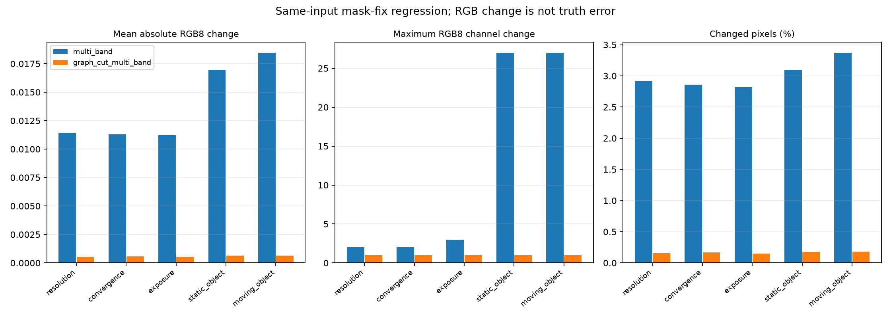

# E-STITCH-01: пересчёт серий после исправления validity masks

Дата: 10.10.2026. Реализация: `validity_zero_extension_v2`. Это регрессия на прежних входах после исключения RGB невалидных камер из pyramid filtering, не новая подтверждающая выборка. Основная инженерная проверка native/offline parity: [[NATIVE_FUSION]].

## Условия и воспроизводимость

Повторены пары разрешений 64/256 и 256/512 с двумя политиками видимости, три варианта улицы с nominal/static_bias/front_jump экспозицией, двухкадровая статическая и девятикадровая движущаяся кодированная мишень. Независимые RGB/object-ID/visibility эталоны и монтажные положения не менялись. Проверки входных hashes, порядка камер, поз и timestamps выполняются штатными загрузчиками. Для обеих пар разрешений direct truth побитно совпадает.

Raw reports, provenance входов/кода, CPU samples и попиксельное сравнение с прежними PNG сохранены в `baselines/stitch_mask_followup_v2.json`. Поле `reports` содержит результаты пяти серий; `historical_summary_sha256` идентифицирует прежние отчёты, `rgb8_comparisons` — статистику и hashes новых RGB outputs. В отчётах явно записана версия fusion. Timing samples сохранены для аудита, но **не принимаются как сравнительный результат**: эти прогоны качества выполнялись одновременно, без отдельного контроля нагрузки/thermal. GPU/server/Aurora latency здесь не измерялись.

```sh
python3 tools/research/stitch_resolution.py --output artifacts/stitch-resolution-mask-v2
python3 tools/research/stitch_resolution.py --sizes 256 512 --output artifacts/stitch-convergence-mask-v2
python3 tools/research/stitch_robustness.py --inputs artifacts/stitch-validation-v1 --output artifacts/stitch-robustness-mask-v2
python3 tools/research/object_stitch.py --output artifacts/object-study-mask-v2 --warmup 2 --repeats 7 --order-seed 20261010
python3 tools/research/object_stitch.py --fixture artifacts/object-stitch-motion-inputs --capture artifacts/object-stitch-motion-capture --output artifacts/object-motion-mask-v2 --warmup 2 --repeats 7 --order-seed 20261010
python3 tools/research/stitch_mask_followup.py --output artifacts/stitch-mask-followup-summary.json
MPLCONFIGDIR=/tmp/sv-mpl python3 docs/diploma/plot_stitch_mask_followup.py
```

Output directories должны быть новыми; повторные прогоны не перезаписывают прежние результаты. Tracked resolution/static-object fixtures доступны в `tests/data`; создание остальных исходных captures описано в [[STITCH_CONVERGENCE_ROBUSTNESS]], [[OBJECT_STITCH_MOTION]]. Компаратор требует сохранённых прежних каталогов из `PAIRS` в `tools/research/stitch_mask_followup.py`: он сверяет hashes обоих отчётов, полный набор RGB outputs и неизменность непирамидальных режимов. Он не восстанавливает старую реализацию из новой; при отсутствии прежних artifacts используйте tracked сравнение. Последняя команда строит диаграмму из tracked baseline без Blender и generated artifacts. Для повторной генерации существующих рисунков использовать `plot_stitch_resolution.py`, `plot_stitch_robustness.py`, `plot_object_stitch.py` и `plot_object_motion.py` с соответствующим `--results`; для convergence — `--prefix stitch_convergence`.

Python здесь используется как существующий независимый offline oracle и средство рисунков. Продуктовый runtime остаётся в C++ сервере; этот пересчёт не подменяет запланированный многокадровый ExperimentRunner через sv-client-lib.

## Изменение итогового RGB

Величины ниже сравнивают новую и прежнюю реализации на одинаковых входах, а не результат и независимую истину. Mean — сумма абсолютных изменений всех RGB8 каналов, делённая на их число; changed pixels — доля пикселей с хотя бы одним изменённым каналом; max — максимум по всем случаям серии. Все пять непирамидальных режимов дали побитно прежний RGB: 585 сравнений. Суммарно проверено 819 строк условий, из которых 234 относятся к двум pyramid modes. Условие 256 px входит в обе пары разрешений; это не 819 независимых сцен или trials.

| Серия | Fusion | RGB случаев | Mean abs RGB8 | Max RGB8 | Изменено пикселей, % |
|---|---|---:|---:|---:|---:|
| 64/256 | `multi_band` | 12 | 0.011439 | 2 | 2.9190 |
| 64/256 | `graph_cut_multi_band` | 12 | 0.000550 | 1 | 0.1568 |
| 256/512 | `multi_band` | 12 | 0.011279 | 2 | 2.8617 |
| 256/512 | `graph_cut_multi_band` | 12 | 0.000584 | 1 | 0.1675 |
| Экспозиция, 3 layouts | `multi_band` | 27 | 0.011234 | 3 | 2.8183 |
| Экспозиция, 3 layouts | `graph_cut_multi_band` | 27 | 0.000537 | 1 | 0.1519 |
| Статическая мишень | `multi_band` | 12 | 0.016936 | 27 | 3.0951 |
| Статическая мишень | `graph_cut_multi_band` | 12 | 0.000625 | 1 | 0.1749 |
| Движущаяся мишень | `multi_band` | 54 | 0.018469 | 27 | 3.3722 |
| Движущаяся мишень | `graph_cut_multi_band` | 54 | 0.000650 | 1 | 0.1810 |



*Рисунок 1 — Среднее, максимум и доля изменённых пикселей при прежних и исправленных масках. Это чувствительность к реализации; малое среднее не исключает локального изменения и не доказывает качества сшивки. Скрипт: `docs/diploma/plot_stitch_mask_followup.py`.*

## Метрики относительно независимого эталона

| Fusion | Static mean IoU | Moving mean IoU | Moving outside source support |
|---|---:|---:|---:|
| `hard_best_angle` | 0.237107 | 0.099845 | 0.846071 |
| `edge_feather` | 0.073510 | 0.073048 | 0.882704 |
| `angular_feather` | 0.094784 | 0.081497 | 0.870937 |
| `seam_distance_feather` | 0.082373 | 0.077894 | 0.873572 |
| `graph_cut_seam` | 0.226224 | 0.102371 | 0.836151 |
| `multi_band` | 0.073577 | 0.072368 | 0.882704 |
| `graph_cut_multi_band` | 0.193092 | 0.095716 | 0.836151 |

Средний IoU движущейся мишени по 378 случаям — 0.086106, outside source support — 0.861184.

Средние по кадрам/положениям описывают прежние короткие траектории. Они не являются независимыми повторениями и не дают доверительного интервала. RGB object-mask IoU зависит от геометрического соответствия и ограниченного chroma classifier; source-ID support не является маской ghosting готового RGB. Не использовать эти числа как универсальный рейтинг методов.

## Проверка и оставшаяся работа

Затронутые CTest entries `stitch_fusion`, `stitch_robustness`, `temporal_truth`, `object_metrics`, `native_fusion_parity`, `render_fusion_parity` прошли **6/6**, 4.84 s после добавления контролей компаратора. Один промежуточный запуск wire test был заблокирован sandbox (`bind: Operation not permitted`); повтор вне sandbox прошёл. Known-answer controls компаратора проверяют знаковую разницу RGB8 без uint8 wraparound, долю изменённых пикселей, отказ при неполном наборе, неожиданном изменении непирамидального режима и подмене input hash. Legacy flat hash layout статического screen допускается только при совпадении значений. Повторная агрегация дала побитно тот же JSON baseline. Это проверка offline metrics и ранее реализованного native соответствия, не выполнение всех этих сцен через сервер.

Закрыт долг по пересчёту перечисленных серий для текущей конвенции масок. Остаются border extension/normalized convolution, длинные независимые клипы, natural-object correspondence, temporal-history/stale-frame опыт, равные carrier/resource budgets, многокадровое исполнение через сервер, отдельные performance trials и физическая Аврора. Новые exploratory сцены и итоговый holdout должны быть отделены от данных, уже просмотренных при разработке.
