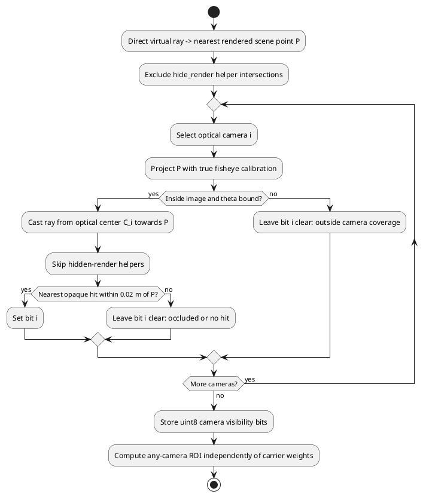

# E-STITCH-01: разрешение входов и независимая видимость

> Пересчёт 10.10.2026 для validity_zero_extension_v2 выполнен на прежних входах; quality tables и рисунки обновлены. Raw reports, RGB8 changes и ограничения: [[STITCH_MASK_FOLLOWUP]]. Это регрессия, не независимая подтверждающая выборка.

Дата: 10.10.2026. Статус: paired ablation на одном синтетическом 3-frame clip. Это продолжение [[PAIRED_STITCH_TEMPORAL]], не закрытие quality confirmation.

## Вопрос и контролируемые условия

Насколько результаты первой temporal серии зависели от низкого разрешения исходных cube faces? Влияет ли исключение точек прямого эталона, скрытых от всех четырёх входных камер, на image-error статистику?

Два capture: 64×64 и 256×256 cube faces. Фиксированы Blender 5.2.2 LTS / EEVEE, procedural street, материалы/освещение, true rig calibration, output fisheye 400×400, direct RGB 320×180, dome+floor radius 12 m и virtual view (azimuth 0.8, elevation 1, distance 8.5). Поза x=0/0.4/0.8 m при t=0/0.2/0.4 s: 2 m/s и 5-Hz sampling исходной 30-Hz шкалы. Exposure/noise/dynamic objects не добавлялись. Время scripted capture задано как frame/30; native fps открытой Blender-сцены (24) не использовался для расчёта траектории. Перенос этой шкалы на анимированные объекты потребует отдельного согласования времени.

Проверка пары требует **побитного совпадения decoded direct RGB, object IDs и visibility arrays**, а также config, poses, timestamps, engine/view transform, scenario recipe и mount offsets. В этой серии все проверки пройдены. PNG файлы могут различаться metadata, поэтому сравниваются пиксели после декодирования, а их encoded SHA-256 проверяется отдельно.

## Независимая видимость и исправленный дефект

Для каждого пикселя прямого виртуального вида Blender ray cast определяет ближайшую геометрию и точку $P$. Для каждой входной камеры проверяются её fisheye projection/FOV и ближайшее пересечение луча от оптического центра к $P$. Камера считается видящей точку, если первое пересечение находится в пределах 0.02 m от $P$. Результат хранится в uint8: bit i соответствует camera i. Carrier/fusion weights при построении этого truth не используются.

При проверке обнаружено, что `Scene.ray_cast` учитывает четыре служебных mesh-модели камер, у которых `hide_render=True`. RGB renderer их не рисует, но они ошибочно заслоняли лучи. Теперь их entry/exit intersections пропускаются с шагом 0.0001 m; число пропусков ограничено 64, при превышении capture останавливается. Список исключённых объектов записан в `paired_truth.json`.

Blender regression test добавляет временную плоскость, закрывающую все 256 лучей тестового вида 16×16: при `hide_render=True` labels/visibility неизменны, при `False` все 256 pixels имеют ID плоскости. Проверка выполнена; созданная плоскость удалена, пользовательские объекты сохранены. Этот дефект относится и к старым object-ID картам: прошлые результаты [[PAIRED_STITCH_TEMPORAL]] остаются историческим smoke, текущие ROI нельзя напрямую приравнивать к старым.

Два policy варианта используют **одни и те же итоговые RGB**:
- `ignore`: исходный object-interior/non-ego/footprint/projection ROI;
- `any`: тот же ROI, но только scene points с visibility bits != 0.

CLI также поддерживает `all` (bits == 15); в данной постановке это обычно пустой/слишком строгий ROI из-за встречных направлений камер и в сравнительную таблицу не включён. Запрос visibility policy для старого fixture без такого truth отклоняется.

| ROI | t0 pixels | t1 pixels | t2 pixels |
|---|---:|---:|---:|
| ignore | 44593 | 44664 | 44648 |
| any | 44263 | 44355 | 44368 |
| removed hidden points | 330 | 309 | 280 |

Видимость одинакова при обоих разрешениях. Исключено около 0.63–0.74% исходного ROI. Маска показывает доступность **точки сцены**, но не гарантирует, что выбранный носитель семплирует её проекцию; geometric distortion и source selection error остаются в оценке.

## Метрики и результаты

RGB MAE, residual change и independent extra-edge fraction определены в [[PAIRED_STITCH_TEMPORAL]]. Здесь приведено арифметическое среднее по трём frame metrics и двум transition metrics, **не** среднее по независимым trials. Extra-edge % — diagnostic fraction от числа fused RGB edge pixels, не процент двоящихся объектов. GPU/CPU timings не измеряются.

| Faces | Policy | Fusion | Mean RGB MAE | Mean residual change | Mean extra-edge % |
|---:|---|---|---:|---:|---:|
| 64 | ignore | `hard_best_angle` | 0.041270 | 0.009808 | 69.190 |
| 64 | ignore | `edge_feather` | 0.039655 | 0.007536 | 69.520 |
| 64 | ignore | `angular_feather` | 0.040738 | 0.009229 | 67.177 |
| 64 | ignore | `seam_distance_feather` | 0.040264 | 0.008859 | 66.601 |
| 64 | ignore | `graph_cut_seam` | 0.041267 | 0.009739 | 68.554 |
| 64 | ignore | `multi_band` | 0.040039 | 0.007656 | 70.861 |
| 64 | ignore | `graph_cut_multi_band` | 0.041351 | 0.009663 | 67.480 |
| 64 | any | `hard_best_angle` | 0.040837 | 0.009715 | 69.351 |
| 64 | any | `edge_feather` | 0.039235 | 0.007458 | 69.630 |
| 64 | any | `angular_feather` | 0.040302 | 0.009133 | 67.336 |
| 64 | any | `seam_distance_feather` | 0.039827 | 0.008762 | 66.759 |
| 64 | any | `graph_cut_seam` | 0.040834 | 0.009647 | 68.712 |
| 64 | any | `multi_band` | 0.039617 | 0.007576 | 70.988 |
| 64 | any | `graph_cut_multi_band` | 0.040918 | 0.009570 | 67.637 |
| 256 | ignore | `hard_best_angle` | 0.039284 | 0.008451 | 50.918 |
| 256 | ignore | `edge_feather` | 0.036833 | 0.005939 | 55.129 |
| 256 | ignore | `angular_feather` | 0.038554 | 0.007786 | 49.196 |
| 256 | ignore | `seam_distance_feather` | 0.037935 | 0.007371 | 49.375 |
| 256 | ignore | `graph_cut_seam` | 0.039236 | 0.008272 | 51.136 |
| 256 | ignore | `multi_band` | 0.037266 | 0.006124 | 57.571 |
| 256 | ignore | `graph_cut_multi_band` | 0.039334 | 0.008197 | 49.689 |
| 256 | any | `hard_best_angle` | 0.038520 | 0.008354 | 50.726 |
| 256 | any | `edge_feather` | 0.036170 | 0.005858 | 54.942 |
| 256 | any | `angular_feather` | 0.037796 | 0.007686 | 48.979 |
| 256 | any | `seam_distance_feather` | 0.037184 | 0.007268 | 49.159 |
| 256 | any | `graph_cut_seam` | 0.038471 | 0.008174 | 50.946 |
| 256 | any | `multi_band` | 0.036589 | 0.006024 | 57.426 |
| 256 | any | `graph_cut_multi_band` | 0.038570 | 0.008099 | 49.477 |

На any-visibility ROI для `edge_feather` RGB MAE снизилась с 0.039235 до 0.036170 (около 7.8%), residual change — с 0.007458 до 0.005858 (около 21.5%). Extra-edge fraction снизилась с 69.630% до 54.942%, на 14.688 процентного пункта. Это результат изменения разрешения **при фиксированном методе**, а не доказательство преимущества feather над graph-cut.

Для `graph_cut_seam` mean MAE: 0.040834 → 0.038471, residual change: 0.009647 → 0.008174. Наблюдаемое улучшение на одном клипе не доказывает сходимость при 256 px; нужен следующий уровень разрешения и независимые сцены. Сравнение any/ignore — чувствительность измерителя к выбору ROI, оно не меняет изображение и не исправляет fusion.


*Рисунок 1 — Прямой вид, edge feather при двух разрешениях исходных граней и число видящих точку камер. Тепловые карты показывают raw RGB error, включая исключаемые из численных ROI кузов и границы.*


*Рисунок 2 — Средние ошибки при одинаковом any-camera ROI. Один клип; соседние кадры не являются независимыми наблюдениями, доверительные интервалы не строятся.*

## Воспроизведение без Blender

```sh
python3 tools/research/stitch_resolution.py \
  --fixture tests/data/stitch_resolution_v1 \
  --output artifacts/stitch-resolution-repeat
MPLCONFIGDIR=/tmp/sv-mpl python3 docs/diploma/plot_stitch_resolution.py \
  --results artifacts/stitch-resolution-repeat
python3 tests/test_scene_visibility.py
```

Выходная директория должна отсутствовать. Runner проверяет paired inputs, запускает 2 resolutions × 2 ROI policies × 7 fusion modes × 3 frames (84 offline final-frame evaluations), сохраняет PNG, per-frame/per-transition метрики и hashes в `summary.json` и дочерних отчётах. Повторное выполнение двух ROI policies не является timing trial. Compact fixture ~3.45 MB хранится в Git; raw captures/snapshots остаются в artifacts.

## Новый захват и Blender regression

В активной сцене выполнить через MCP/Python console (новый каталог для каждого capture):

```python
import sys, bpy
sys.path.insert(0, '/absolute/project/tools/blender')
from paired_truth import capture_paired
for size in (64, 256):
    capture_paired(bpy.context.scene, f'/absolute/project/artifacts/resolution-{size}',
                   frames=3, face_size=size, frame_step=6, width=320, height=180)
```

```sh
python3 tools/blender/convert.py --capture artifacts/resolution-256 \
  --output artifacts/resolution-256-inputs --image-format png
python3 tools/temporal_seam_stability.py --dataset artifacts/resolution-256-inputs \
  --capture artifacts/resolution-256 --visibility-policy any \
  --output artifacts/resolution-256-report
```

Blender-only regression (не запускается обычным CPython/CTest):

```python
import runpy
print(runpy.run_path('/absolute/project/tests/blender/test_visibility.py')['run'](bpy.context.scene))
```

Capture восстанавливает optics/sensor fit, near/far, pixel aspect, render image settings, resolution, pose и frame. Perspective cube cameras нормализованы к horizontal sensor 36 mm и clip 0.025..200 m; direct virtual view использует заданный fov/clip. PNG option даёт те же decoded pixels, что PPM, что проверено отдельным converter test.

## Ограничения и следующие действия

Это один мир, три кадра прямолинейного движения, без photometric stress/поворотов. Видимость — непрозрачная геометрия, без transmission/antialiasing, с допуском 2 cm; thin structures и границы требуют отдельной оценки чувствительности. Попиксельное соответствие объектов между камерами и ghost trails не измеряется. Не согласованы triangle/memory budgets и не измерены GPU/target timings.

Следующие опыты: convergence 256→512; независимые scene/mount seeds и длинные поворотные клипы; per-camera exposure/noise, динамические объекты; object-correspondence truth и ghost trails; repeated timing при одинаковых ресурсах. Расширение перечислено в [[planning/ROADMAP]] и [[../TODO]].

## Provenance текущего запуска

Вложенные отчёты фиксируют SHA-256 config/manifest/ground_truth/capture/paired_truth и исполняемых fusion/metrics/reference модулей. SHA-256 runner: `4580d5263a7023d0a4308c0dbf5e12d192747d2f3f27da2c5052804d06a41365`. Capture script hashes и visibility tolerance — в каждом `paired_truth.json`.

| Условие | SHA-256 manifest | SHA-256 paired truth |
|---|---|---|
| 64 | `0ab46ef4687e22f8d38a0a0adcf728fd4a581a074171d17a26b7adc464e9c4e5` | `9183d73b94a6a66a51487419bb37181133fd96f1b7af76a85cb3cecfe57ddf44` |
| 256 | `b99fdd67740a9a1b8602bfc66081c280326d0a07ef6224401201f19e6ad84f2e` | `3eff41e4ebf6085fbbad066656449667770d47c1882c7c924c8e7365f9f94b2d` |

## Определение source visibility



*Рисунок 3 — Проверка геометрической доступности точки эталонного изображения. Она не использует surface/fusion и не является реконструкцией скрытых поверхностей.*
