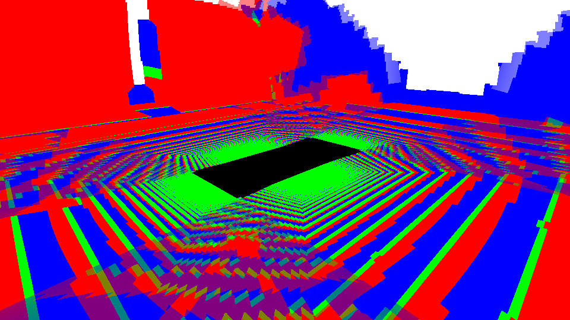

# E-STITCH-01: depth-based carrier visibility screening and fusion series

Date: 09.10.2026. Scope: one static Blender scene/frame, six analytic carriers (including parameterized Burger model), two output views, seven offline fusion labels (84 generated cases). This is a reproducible **exploratory projection/depth-visibility screen**. A commit audit found that the stored seam and ghost scores do not measure their stated quantities, and `graph_cut_seam` is not a graph-cut optimizer. Preserve the raw outputs for debugging, but do not cite their seam/ghost rankings or conclusions as confirmed evidence until the method is fixed and rerun. See [[planning/AUDIT]] and [[../TODO]]. Full question and protocol: [[research/PROJECTION_AND_STITCHING]].

## Reproduction and provenance

The tool reads four RGB frames, calibration, and radial-depth maps. It verifies RGB/depth checksums, camera IDs, synchronous timestamps, and dimensions. For each rendered carrier point `X` and camera `i`, it projects `X`, reads measured radial depth `d_i`, and compares it with camera-to-point range `r_i=||T_i X||`. A sample is depth-consistent when `|d_i-r_i|≤max(0.05 m,0.01 r_i)`. It records projection coverage separately from exact-depth coverage and apportions normalized fusion weight to matching depth, a foreground occluder, a first hit behind the carrier point, or no depth return.

```sh
# Initial screening
python3 tools/compare_visibility.py \
  --dataset artifacts/blender-depth-truth-dataset-fixed \
  --output artifacts/stitch-visibility-v3

# Full 84-case E-STITCH-01 matrix
python3 tools/run_e_stitch_01.py \
  --config artifacts/blender-depth-truth-dataset-fixed/config.json \
  --dataset artifacts/blender-depth-truth-dataset-fixed \
  --output artifacts/e-stitch-01-v1
```

The first-frame capture metadata SHA-256 is `a41c598b0ae9a3fce217c2c81eb8d794d67014c10c0b3889fe8c2cf35bed94a5`; config SHA-256 `cdf90d578d165f63734678a0709e9bc3a71199e13ba7095771bd351e4d1a9bca`; RGB manifest SHA-256 `5109162ec2a52b0de176b64bb27a2469f0a77c3eb4ba84f3191114c4ef7ac7a8`. The dataset uses face_size=32; image, depth and script hashes are also saved in the generated JSON report. Repeatable capture/conversion commands are in [[engineering/BLENDER]] and depth validation is in [[validation/DEPTH_VISIBILITY_TRUTH]].

Implementation hashes: `compare_visibility.py` `9c79b1708212a0a23972dd98a042c951124fe013213d71774c141b347eb081cc`; `reference.py` `04df1684c311548e654eb6118d0554c0e64c391238645a86d26786c55d04584e`; `fusion.py` `e3ea2bb09f19db1d604471f496738590c6819b52eb408990cf25bf922ae72d62`; `stitch_metrics.py` `e73236e890c294155b410fb5da03b41d227c9c0f993d0c24ea03a9856a94b413`. The checked-in diagnostic image is PNG SHA-256 `3999a343cbcc6671ef4c3924393e93ed172e7e52684b3a7cead0582b67eb8615`.

## Low-view measurements (E-STITCH-01 Series)

| Carrier | Fusion Strategy | Seam ΔE (p95) | Gradient Disc. | Ghost Frac % | Exact Depth Cov % (0.05m) | Consistent Weight % |
|---|---|---:|---:|---:|---:|---:|
| Plane | hard_best_angle | 949.15 | 0.14 | 2.26% | 24.50% | 21.34% |
| Plane | edge_feather | 889.37 | 0.06 | 2.26% | 24.50% | 19.99% |
| Plane | angular_feather | 57.58 | 0.02 | 2.26% | 24.50% | 20.95% |
| Plane | seam_distance_feather | 52.55 | 0.02 | 2.26% | 24.50% | 20.69% |
| Plane | graph_cut_seam | 961.13 | 0.13 | 2.26% | 24.50% | 21.25% |
| Plane | multi_band | 890.88 | 0.06 | 2.26% | 24.50% | 19.99% |
| Plane | graph_cut_multi_band | 958.27 | 0.11 | 2.26% | 24.50% | 21.25% |
| Dome + floor | hard_best_angle | 214.42 | 0.04 | 2.53% | 16.33% | 14.18% |
| Dome + floor | edge_feather | 55.94 | 0.04 | 2.53% | 16.33% | 13.31% |
| Dome + floor | angular_feather | 39.36 | 0.00 | 2.53% | 16.33% | 13.92% |
| Dome + floor | seam_distance_feather | 40.44 | 0.00 | 2.53% | 16.33% | 13.79% |
| Dome + floor | graph_cut_seam | 135.20 | 0.04 | 2.53% | 16.33% | 14.20% |
| Dome + floor | multi_band | 50.52 | 0.02 | 2.53% | 16.33% | 13.31% |
| Dome + floor | graph_cut_multi_band | 40.81 | 0.00 | 2.53% | 16.33% | 14.20% |
| Burger-like | hard_best_angle | 989.13 | 0.20 | 2.38% | 16.61% | 14.47% |
| Burger-like | angular_feather | 873.81 | 0.04 | 2.38% | 16.61% | 14.20% |
| Burger-like | seam_distance_feather | 753.68 | 0.03 | 2.38% | 16.61% | 14.05% |
| Burger-like | graph_cut_multi_band | 973.09 | 0.15 | 2.38% | 16.61% | 14.41% |



*Рисунок V.3 — Нормированный fusion weight для dome low-view edge-feather: красный — первая поверхность ближе точки носителя; зелёный — глубина совпала; синий — точка носителя находится перед первым depth hit; белый — depth truth не имеет возврата. Смесь каналов показывает смесь источников. Чёрная область — ROI, исключённая по маске автомобиля.*

## Интерпретация

1. **Видимость против покрытия:** В этом fixture проекционное покрытие близко к 100%, тогда как согласованность carrier points с radial depth ниже. Это иллюстрирует различие между попаданием проекции в изображение и совпадением точки с первым depth return. Абсолютные значения чувствительны к depth tolerance и capture face-size; они не являются общей оценкой качества поверхности.
2. **Fusion ranking:** По этим данным вывод не делается. Seam/ghost колонки имеют дефекты определения метрик, а graph-cut label не соответствует graph-cut оптимизации. Повторить расчёт после исправления, прежде чем сравнивать методы.
3. **Форма носителя:** Данная таблица сама по себе не ранжирует carrier geometry. Сравнение требует общей ROI, независимой оценки и равного mesh/memory budget; параметры разных carrier могут давать разные coverage и distortion.
